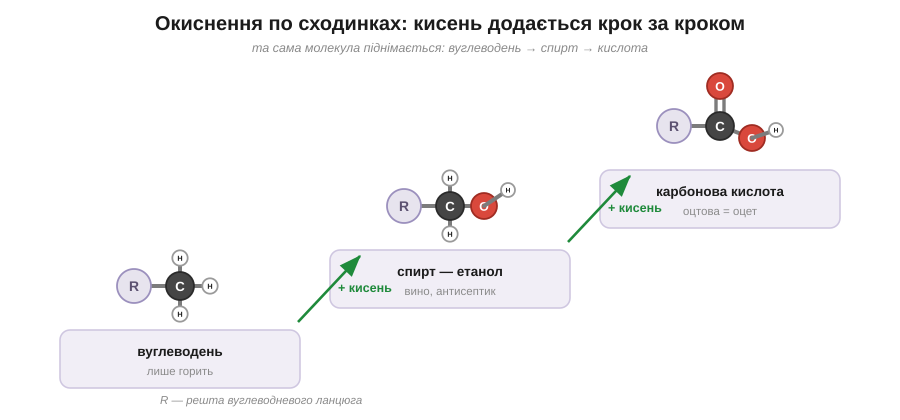
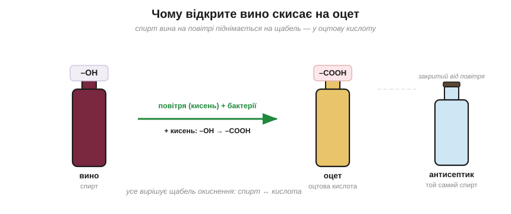

# Розділ 5.2 — Кисень приєднується: спирти, кислоти, жири

Досі наші вуглеводні були прості й одноманітні: самі тільки Карбон та Гідроген, і єдине, на що вони здатні, — горіти. Тепер до карбонового ланцюга долучиться третій гість, Оксиген, — і доти нудне пальне раптом оживає. З'являються спирти, кислоти, фруктові запахи, жири й навіть мило. Цей розділ — про те, що робить із простого вуглеводню одна-дві причеплені групи з Оксигеном: спершу ми пройдемо сходинками від спирту до кислоти, а тоді складемо з них пахучі естери, жири й мило.

## 5.2.1 Спирти і кислоти: окиснення по сходинках

Пляшка вина, забута відкритою на тиждень, на смак уже справжній оцет. А той самий спирт, що був у тому вині, стоїть у тебе в аптечці як антисептик. Один напій — а три зовсім різні лиця: трунок, ліки і майбутній оцет. Що ж їх усіх єднає? Кисень, доданий до молекули крок за кроком, — і зараз ми пройдемо ці кроки по черзі.

Почнімо з простого вуглеводню — того самого ланцюга з Карбону й Гідрогену, який тільки й уміє, що горіти. А тепер причепи до котрогось його Карбону невелику групу **–OH** (це один атом Оксигену з одним Гідрогеном) — і нудне пальне перетворюється на **спирт**. Найвідоміший із них — етанол, той самий, що й у вині, і в пляшечці антисептика. Саме ця маленька група –OH і дає спиртові його новий характер. Згадай, чому вода й олія не мішаються: олія гладенька, без заряджених кінців. А група –OH — це, по суті, шматочок самої води, з тим самим зміщеним до Оксигену зарядом; тож, причепивши її, ми зробили частину молекули водолюбною. Спробуй передбачити наслідок: чи мішатиметься спирт із водою?.. Так, тепер мішається залюбки — на відміну від бензину, який лишається суцільно гладеньким і води цурається. Маленька –OH перетягнула молекулу в табір «подібне до води».

Та Оксиген на цьому не спиняється. Він може чіплятися до того самого Карбону й далі, щабель за щаблем, — і це поступове додавання кисню називають **окисненням**. Підніми спирт на сходинку вище — і дістанеш **карбонову кислоту**: той самий ланцюг, але з групою **–COOH** на кінці, яка, мов усяка кислота, відпускає у воду свій H⁺ — точно так, як ми бачили в розділі про кислоти. Виходить струнка драбина: вуглеводень → спирт → кислота, і кожен щабель угору — це доданий до молекули кисень.

*Рис. 5.2.1-1. Та сама молекула піднімається сходинками окиснення: гола рука з воднем → група –OH (спирт) → група –COOH (карбонова кислота).*

Тепер прояснюється й історія з вином. Його спирт сидить якраз на середньому щаблі цієї драбини. Лишиш пляшку відкритою — і кисень повітря разом із дрібними бактеріями підштовхують той спирт на щабель вище, перетворюючи його на карбонову кислоту. А ця кислота зветься оцтовою — і це буквально і є оцет. Тобто скисле старе вино не просто абстрактно «зіпсувалося» — воно цілком конкретно піднялося драбиною окиснення від спирту до кислоти.

*Рис. 5.2.1-2. Кисень повітря й бактерії піднімають спирт вина на щабель вище — у оцтову кислоту; а той самий спирт, закритий від повітря, служить антисептиком.*

А чому ж той самий етанол, не піднявшись на щабель, служить антисептиком? Бо, лишаючись на спиртовому щаблі, він згубний для мікробів: він висушує їх і руйнує тонкі молекули, з яких вони збудовані, і вони гинуть. Виходить, одна-єдина молекула буває то напоєм, то ліками, то півдорогою до оцту, — і все вирішує лише те, на якому щаблі окиснення вона зараз стоїть.

> 🏠 Оцет, до речі, навмисне роблять точно так само, як псується вино: крізь розведений спирт проганяють повітря, і бактерії слухняно доводять його до оцтової кислоти.

## 5.2.2 Естери і жири

Запах груші в цукерці, банана в морозиві, квітів у парфумах — це дуже часто ніяка не груша, не банан і не квітка, а проста зустріч двох знайомих із попередньої теми: кислоти й спирту. Що ж пахуче народжується від їхньої зустрічі — і до чого тут, як обіцяно, жир та мило?

Зведімо разом карбонову кислоту з її групою –COOH і спирт з його групою –OH. З'єднуються вони так: від кислоти відходить –OH, від спирту — H, ці двоє разом полишають молекулу у вигляді краплі води, а два залишки, що лишилися, зчіплюються між собою через Оксиген. Те, що при цьому виходить, називають **естером**. І саме дрібні естери — це і є ті фруктові запахи: грушевий, яблучний, ананасовий; на них тримається вся парфумерія й добра половина харчових ароматів.

*Рис. 5.2.2-1. Кислота й спирт зчіплюються, відпустивши краплю води; новий зв'язок через Оксиген — це естер, і дрібні естери пахнуть фруктами.*

А з того самого з'єднання природа будує й дещо значно більше. Візьми **гліцерин** — невелику молекулу, що має аж три руки-–OH — і причепи до кожної з трьох рук по довгому хвосту жирної кислоти, знову ж таки через естерний зв'язок. Молекула, що вийде, з трьома довгими хвостами, і є **жир**: гліцеринова голова та три довгі хвости. А хвости ці — чистісінький вуглеводень, гладенький і незаряджений, — і саме тому жир не мішається з водою, точно як олія на самому початку нашої книги.

А тепер найцікавіше — звідки береться мило. Щоб його дістати, жир треба розібрати назад, але не водою (вона з ним не дружить), а лугом. Луг розриває естерні зв'язки й відчіплює всі три хвости від гліцерину. І кожен звільнений хвіст дістає на місці розриву заряджену голову — ось ця молекула, з довгим жирним хвостом і зарядженою головою, і є **мило**. Згадай тепер, що ми мигцем казали в розділі про основи — буцімто луг «перетворює жир на мило»; ось він, той самий механізм, тепер уже зрозумілий до кінця.

*Рис. 5.2.2-2. Луг розриває жир на мильні молекули; кожна одним кінцем чіпляється за жир, другим — за воду, тому обліплює жирну краплю й зносить її водою.*

І ось ця дволикість мильної молекули — жирний хвіст з одного кінця й водолюбна заряджена голова з другого — і є вся таємниця прання. Спробуй здогадатися сам, як саме мило знімає жирну пляму, якщо один його кінець любить жир, а другий — воду?.. Мильні молекули встромляють свої хвости в краплю жиру, а заряджені голови виставляють назовні, у воду, — і кожна жирна крапля опиняється загорнута в мильну кульку, дружню до води. Сама собою вода з жиру лише зісковзує, не беручи його; а мило хапає жир за хвіст і зносить його разом із водою геть. Оце й уся хитрість, на якій тримається миття.

> 🏠 Саме тому масний посуд відмиває мило чи засіб, а не сама вода: їхні молекули чіпляються одним кінцем за жир, другим за воду — і стягують бруд у злив.

> ▶️ Далі: [Розділ 5.3 — Молекули життя](../r3-life-molecules/r3-life-molecules.md)
