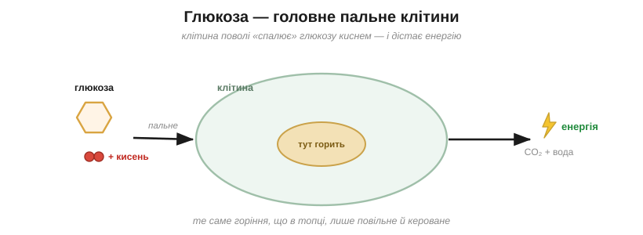
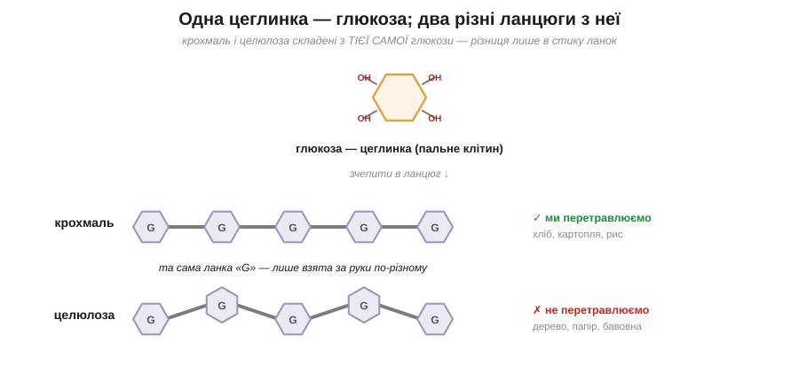
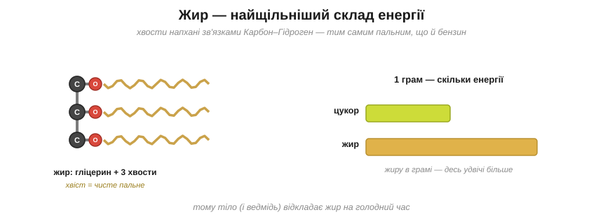
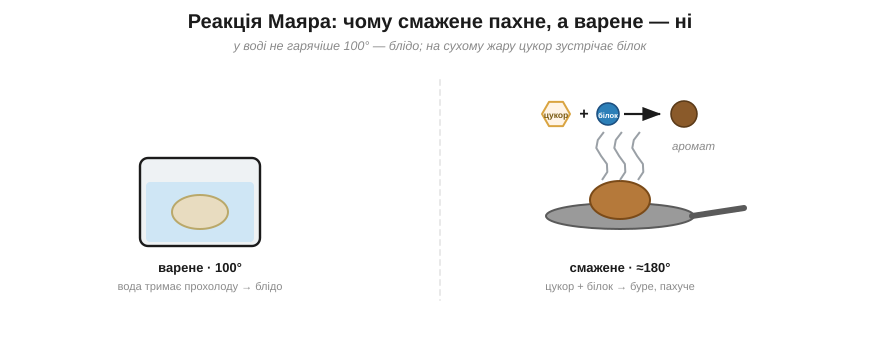
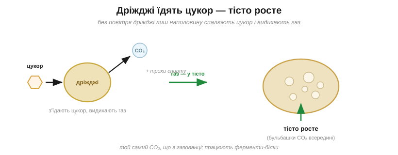
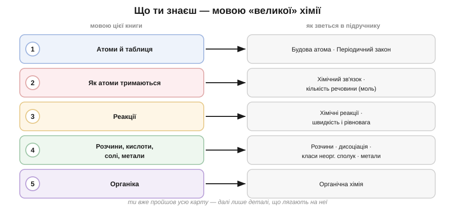

# Розділ 5.3 — Молекули життя

Ми вже навчилися читати органічні молекули — карбонові ланцюги, кільця, групи з Оксигеном. Лишилося найголовніше й найближче: з тих самих деталей збудоване все живе, зокрема й ти сам. Цей фінальний розділ — про головні молекули життя: цукри як пальне, жири як запас, білки як машини тіла. А наприкінці ми зазирнемо на звичайну кухню, де хімія цілої цієї книги працює в дії, — і попрощаємося.

## 5.3.1 Вуглеводи

Скибка хліба тебе нагодує, а трісочка деревини — ні, хоча дерево й пшениця виросли, по суті, з того самого поля під тим самим сонцем. І ось що по-справжньому дивно: і хліб, і деревина складені з однієї й тієї самої цеглинки — з глюкози. Як та сама цеглинка буває то поживним обідом, то неїстівною трісткою?

Спершу придивімося до самої цеглинки. **Глюкоза** — це маленький цукор, кільце з шести Карбонів, рясно обвішане групами –OH. До речі, тепер зрозуміло, чому цукор так легко розчиняється у воді: тих водолюбних груп –OH на ньому повно, а вони, як ми бачили, тягнуть молекулу в табір «подібне до води». Глюкоза — це головне пальне тіла: кожна клітина поволі «спалює» її киснем, добуваючи з неї енергію, а кров розносить її по всьому організму. Те, що в побуті звуть «цукром у крові», — це і є глюкоза.

*Рис. 5.3.1-1. Клітина поволі «спалює» глюкозу киснем — те саме горіння, що й у топці, лише м'яке й кероване: з нього тіло й бере енергію.*

А тепер зчепимо багато глюкоз в один довгий ланцюг — точнісінько як намистини в полімер із розділу про Карбон. Якщо ланки з'єднати між собою одним способом, виходить **крохмаль** — саме так рослини складають енергію про запас у картоплі, рисі, зерні. І в нас є ферменти, заточені рвати рівно ці з'єднання, тож крохмаль ми спокійно перетравлюємо назад на глюкозу, тобто на пальне. А тепер та сама глюкоза, але ланки в ланцюзі повернуті й з'єднані трішки інакше — і це вже **целюлоза**: деревина, папір, бавовна, волокно рослин. Здавалося б, дрібний поворот у способі з'єднання — а наші ферменти-ножиці до нього вже не пасують, не можуть його розрізати. Тому целюлозу ми не перетравлюємо зовсім: вона проходить крізь нас наскрізь як клітковина. (А корови й терміти тримають у собі особливих мікробів, чиї ножиці те з'єднання таки ріжуть, — тому й здатні живитися самою травою та деревом.)

*Рис. 5.3.1-2. Крохмаль і целюлоза складені з тієї самої ланки-глюкози; різниця лише в тому, як ланки взято за руки, — а від неї залежить, їжа це чи дерево.*

Спробуй тепер сам відповісти на загадку, з якої ми почали: чому ж хліб ми їмо, а трісочку ні, коли обидва — ланцюги з тієї самої глюкози?.. Бо вся справа не в тому, з чого вони складені (склад однаковий), а в тому, **як** саме ланки взято за руки: до одного способу з'єднання наші ферменти-ножиці підходять, а до іншого — ні. Одна цеглинка, дві долі, і вирішує спосіб зчеплення.

> 🏠 Хліб, рис і картопля — це крохмаль; вата, папір і бавовняна футболка — целюлоза; і те, і те — довгі ланцюги з тієї самої глюкози, тільки зчеплені по-різному.

## 5.3.2 Жири і білки

Розтоплене масло, охолонувши, застигає назад без жодного сліду — наче й не топилося. А зварене яйце не «розвариш» назад нізащо: побіліло — і вже навіки. Обидва — їжа, обидва ми просто нагріли, але одна зміна виявляється оборотною, а друга — остаточною. Чому ж так?

Почнімо з жиру. Його будову ми вже розібрали в попередньому розділі — гліцеринова голова й три довгі хвости. Та навіщо тіло взагалі його запасає? А тому, що ті хвости напхані тими самими зв'язками Карбон–Гідроген, що й пальне в бензині, — отже, жир є найщільнішим складом енергії, який тільки буває: грам жиру дає десь удвічі більше енергії, ніж грам цукру. Саме тому й ведмідь перед зимою, і ми з тобою відкладаємо про запас на голодний час саме жир, а не цукор.

*Рис. 5.3.2-1. Хвости жиру напхані зв'язками Карбон–Гідроген — тим самим пальним, що й бензин, тому грам жиру несе удвічі більше енергії, ніж грам цукру.*

А ось біле в яйці — це вже **білок**, і влаштований він зовсім інакше. Уяви близько двадцяти видів дрібних намистин — їх називають **амінокислотами** — нанизаних в один ланцюг у певному, наперед заданому порядку (а який саме порядок, диктують гени). Вийде довгий ланцюг — це й є білок. Поки що це просто нитка з намиста, і нічого особливого в ній наче немає. Але нитка не лишається ниткою. Вона **згортається** сама на себе в одну точну просторову форму — і саме ця форма й робить усю роботу. Згорнеться ланцюг у кишеньку, що хапає глюкозу, — вийде фермент, ті самі «ножиці», про які ми вже не раз згадували; складеться у довге волокно — буде м'яз чи волосина; скрутиться в трубку — буде канал, яким речовини входять у клітину. Білки — це машини й балки тіла, і вся їхня вправність схована саме у згортанні.

*Рис. 5.3.2-2. Ланцюг амінокислот згортається в точну форму, що й виконує роботу; нагрів розхитує слабкі зачіпки — ланцюг сплутується назавжди (денатурація).*

А тримається та згорнута форма на безлічі слабеньких зачіпок — і ось тут ми нарешті повертаємося до яйця. Нагрій білок: тепло розхитує ті слабкі зачіпки, ланцюг розкручується й безнадійно сплутується в безладний жмут, який згорнутися назад у свою точну форму вже не може. Це й називають **денатурацією** — і вона остаточна. Сирий яєчний білок прозорий і рідкий саме тому, що його ланцюги згорнуті правильно; звари його — і вони розкрутяться, переплутаються й побіліють, і жодним холодом сире вже не повернути. Тепер видно й відповідь на нашу загадку: масло лише плавилося й застигало — його молекули цілі; а яйце пережило денатурацію, незворотне розкручування білків, яке видно очима.

> 🏠 Уся смажена-варена їжа — це денатурація в дії: біліє яйце, твердне на пательні стейк, скисле молоко зсідається в сир — скрізь нагрів або кислота розкручують білки назавжди.

## 5.3.3 Кухня — твоя лабораторія

Зварена картоплина — бліда й прісна. А та сама картоплина, кинута на розпечену пательню, золотіє, береться хрумкою скоринкою й пахне так, що аж слина набігає. Картопля одна й та сама — то що ж такого зробив сухий жар, чого не змогла вода? Кухня — це насправді лабораторія всієї нашої книги, і два щоденні кухонні дива показують у ній мало не все, про що ми говорили.

Почнімо зі скоринки. Згадай важливу дрібницю: вода, хоч як її грій, ніколи не стає гарячішою за сто градусів — вона закипає й вище температуру не пускає. А ось суха пательня чи духовка розжарюються куди дужче, до двохсот і більше. І саме там, на такому жару, зустрічаються дві знайомі нам молекули з попередніх тем — цукри й амінокислоти білків. На сильному жару вони беруться одна за одну й починають плести сотні нових бурих, запашних молекул — той самий дух підсмаженої грінки, рум'яної скоринки, смаженої цибулі. Цю зустріч цукрів із білками на жару й називають **реакцією Маяра**. А варене лишається блідим і прісним тільки тому, що вода тримає його надто прохолодним — нижче за поріг, з якого ця реакція починається. Спробуй тепер сам пояснити, чому шматок м'яса на гарячій сковороді вкривається смачною скоринкою, а в каструлі з водою лишається сірим?.. Бо в сковороді жар сягає тих двохсот градусів, потрібних реакції Маяра, а кипляча вода не пускає м'ясо гарячіше за сто — і реакція просто не запускається.

*Рис. 5.3.3-1. У воді не гарячіше 100° — їжа лишається блідою; на сухому жару цукри й білки зустрічаються й дають буру пахучу скоринку.*

Друге кухонне диво — як саме росте хлібне тісто. **Дріжджі** — це крихітні живі грибки; дай їм цукру з борошна, і вони заходяться його їсти заради енергії. Та без повітря дріжджі спалюють той цукор не до кінця, а лише наполовину — і видихають при цьому **вуглекислий газ** (а заразом трохи спирту). Бульбашки цього газу застрягають у тягучому тісті, і воно від них пухне й підіймається. А той спирт, що утворюється поряд, — то, до речі, уся суть вина й пива.

*Рис. 5.3.3-2. Дріжджі з'їдають цукор і видихають вуглекислий газ; його бульбашки застрягають у тісті й підіймають його.*

А тепер озирнися й поглянь, що оце щойно відбулося на кухні. Цукри й білки з попередніх тем; жар, який підганяє реакцію, точно як у розділі про швидкість; гази, що булькають і виходять назовні; ферменти-білки, які все це провадять, — уся наша книга працює разом в одній сковороді й одній мисці тіста. Виходить, що варячи й смажачи, ти весь цей час, сам того не помічаючи, робив справжню хімію.

> 🏠 Тому ж м'ясо задля скоринки смажать на сильному вогні, а не варять; і тому тісто лишають підходити в теплі, а не на холоді — у теплі дріжджам працюється жвавіше.

## 5.3.4 Куди далі

Ми вже майже біля кінця. Озирнися на пройдений шлях: на першій сторінці слово «молекула» ще нічого для тебе не важило, а тепер ти розумієш, чому вода розчиняє цукор, чому залізо іржавіє, а золото ні, і чому зварене яйце нізащо не повернути в сире. Та найважливіше навіть не ці окремі відповіді, а те, що велика, «справжня» шкільна хімія більше не страшна: у ній немає жодних чудовиськ — лише ті самі знайомі тобі речі, тільки названі суворішими словами.

І ось тобі карта цих суворих назв, щоб не загубитися. Те, що ми звали простими словами, у підручнику зветься так: наш модуль про атоми — це «будова атома й періодичний закон»; модуль про зв'язки — «хімічний зв'язок і кількість речовини»; модуль про реакції — «хімічні реакції, їхня швидкість і рівновага»; модуль про воду й солі — «розчини, електролітична дисоціація та основні класи неорганічних сполук»; а останній — «органічна хімія». Розгорнеш підручник, побачиш ці поважні заголовки — і впізнаєш за ними давніх знайомих.

*Рис. 5.3.4-1. П'ять модулів цієї книги — це і є п'ять великих тем шкільної хімії, лише названі простіше; ти вже пройшов усю карту.*

І читай тепер той підручник інакше. Він не список для зубріння, а карта: кожен новий факт у ньому чіпляється на гачок, який у тебе вже є, — на зв'язок, на H⁺, на карбоновий ланцюг. Періодична таблиця — це твоя карта характерів, а формула — речення, яке читають, а не закляття, яке бубонять. І щойно щось почне відгонити зубрінням — спинися й пошукай за ним механізм, оте «чому на рівні атомів»; знайдеш його — і факт запам'ятається сам собою, без жодного зусилля.

Лишилося, власне, одне. Усю цю книгу ми вперто питали «чому» — і майже жодного разу нічого по-справжньому не рахували. А хімія вміє ще й рахувати: скільки чого треба взяти й скільки чого з того вийде. І саме цих формул та задач багато хто боїться найдужче — а дарма, бо й вони підлягають тому самому правилу, що й усе в цій книзі: за кожною стоїть проста, зрозуміла природа, варто лише її побачити. Тож попереду ще один, останній і короткий модуль — про те, звідки в хімії взагалі беруться числа і як читати ті задачі, якими лякають. А вже після нього й попрощаємося як належить.

> 💡 **Що про це скаже великий підручник.** Усе з останнього модуля там зветься органічною хімією, а її стик із життям — біохімією. Ті характерні «причепи», що міняли вуглеводень (–OH спирту, –COOH кислоти), називають функційними групами — саме за ними впізнають класи органічних речовин. Шукай також слова «вуглеводи, жири, білки» в розділі про природні сполуки — це і є наші молекули життя під підручниковими іменами.

> ▶️ Далі: [Розділ 6.1 — Чому хімія взагалі рахує](../../m6-counting/r1-why-numbers/r1-why-numbers.md)
