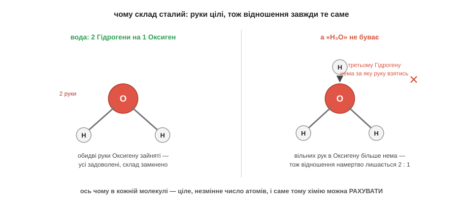
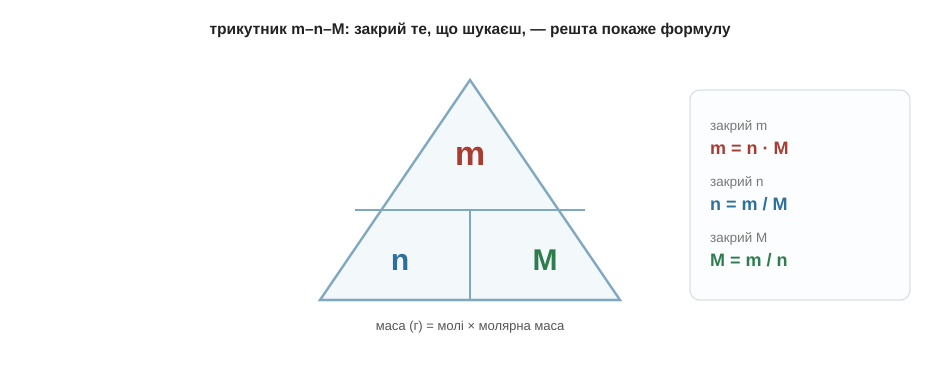
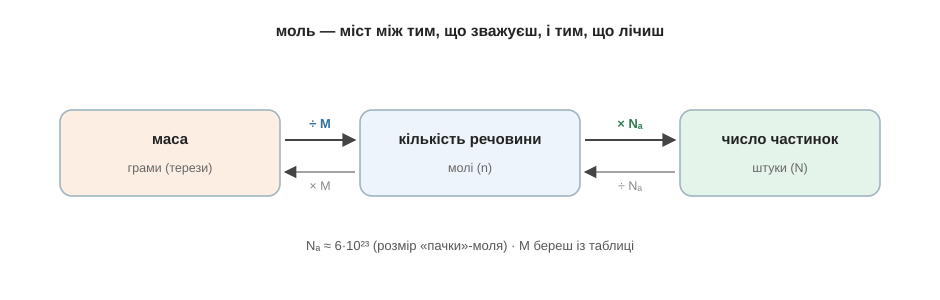

# Розділ 6.1 — Чому хімія взагалі рахує

Усю цю книгу ми питали «чому» і майже не торкалися чисел. Та в хімії числа таки є — формули з індексами, коефіцієнти в рівняннях, молі, відсотки, — і саме їх багато хто боїться найдужче. Цей короткий останній модуль — про їхню природу. Не про те, як «розв'язувати задачі» за зразком, а про те, звідки ці числа взагалі беруться і чому за кожною формулою стоїть проста, зрозуміла думка. Почнімо з найпершого питання: а чому в хімії взагалі є що рахувати?

## 6.1.1 Сталі відношення — звідси всі числа

Кухар, готуючи борщ, кладе солі «дрібку», а як на смак мало — додасть ще трохи. Художник підмішує до фарби «крапельку» синього, а захоче — крапельку ще. У звичайному житті кількості — приблизні, на око, до смаку: трохи більше, трохи менше, нічого страшного. А тепер поглянь на воду. У ній завжди, скрізь і за будь-яких умов рівно два атоми Гідрогену на один атом Оксигену. Не «два з половиною», не «трохи більше водню сьогодні» — а точнісінько два до одного, у краплі з-під крана, у хмарі над морем і в найдорожчій лабораторії світу. Чому ж хімія така сувора до чисел там, де кухня цілком вільна?

Відповідь ми, по суті, вже тримаємо в руках — вона в тих самих «руках» атомів, про які йшлося, коли ми говорили про валентність. Згадаймо: атоми з'єднуються, чіпляючись один за одного руками, і рук цих у кожного атома — ціле число. В Оксигену їх рівно дві, у Гідрогену — рівно одна. А тепер придивися, що це означає для води. Дві руки Оксигену треба чимось зайняти, і кожен Гідроген може запропонувати лише одну руку — отже, щоб усі руки зчепилися, на один Оксиген потрібно саме два Гідрогени. Не один (тоді одна рука Оксигену лишиться висіти вільна) і не три (третьому Гідрогену вже нема за яку руку взятися). Рівно два. Відношення «два до одного» не вигадане й не домовлене — воно намертво задане тим, що рук у атомів ціле число.


*Рис. 6.1.1-1. Дві руки Оксигену зчіплюються рівно з двома Гідрогенами; третій Гідроген зайвий — рук більше немає, тож відношення намертво лишається 2 : 1.*

Спробуй тепер сам пересвідчитися, наскільки це жорстко. Уяви, що ти дуже хочеш зробити воду, у якій на один Оксиген припадало б три Гідрогени, — таке собі «H₃O». Береш молекулу води й намагаєшся приліпити до неї третій Гідроген. Що з нього вийде?.. Нічого: обидві руки Оксигену вже зайняті першими двома Гідрогенами, а до чого причепитися третьому — немає. Він просто не втримається й відпаде. Хоч скільки додавай водню до води, зайве не пристане — відношення вперто лишиться два до одного. Ось чому хімічний склад речовини сталий: він тримається не на домовленості людей, а на тому, що атоми цілі й рук у них ціле число.

А тепер — найголовніший висновок, заради якого все це й говорилося. Раз кожна речовина має сталий, незмінний склад із цілих чисел атомів, то з цими числами можна робити арифметику: складати, ділити, перераховувати. Якби речовини складалися «на смак», як борщ, — сьогодні трохи більше водню, завтра трохи менше, — то жодна формула не мала б сенсу, жодне рівняння не сходилося б, і рахувати в хімії було б нічого. Хімія може рахувати саме тому, що відношення в ній сталі й цілі. Числа в хімії — не канцелярія й не примха підручника, яку треба визубрити; вони просто відображають оту жорстку цілість атомів та їхніх рук. І все, що ми рахуватимемо далі в цьому модулі, виростає з однієї цієї думки.

> 🏠 Напис H₂O на пляшці — це не позначка «приблизно водень із киснем», а точний рецепт із незмінною пропорцією; будь-яка вода на світі складена рівно так само.

## 6.1.2 Головні формули кількості речовини: n = m/M і N = n·Nₐ

Сталі цілі відношення дають нам право рахувати — та одразу впираємось у стару перешкоду: атомів не видно й поштучно їх не перелічиш. Цю перешкоду ми вже обходили в модулі про формули, коли домовилися лічити атоми не поодинці, а великими однаковими порціями — **молями**, де в кожній порції 6·10²³ частинок, а маса однієї порції в грамах дорівнює числу з періодичної таблиці. Зараз ми перетворимо ту ідею на дві короткі робочі формули, якими справді розв'язують задачі, — і виведемо їх так, щоб не довелося зубрити.

Почнімо з найголовнішої. Молярна маса **M** — це маса одного моля речовини в грамах; її просто складають із атомних мас за формулою речовини. Для води, скажімо, M(H₂O) = 1 + 1 + 16 = 18 г/моль, для вуглекислого газу M(CO₂) = 12 + 16 + 16 = 44 г/моль. А тепер постав собі питання: якщо один моль важить M грамів, то скільки молів у m грамах речовини? Та очевидно — стільки разів, скільки M вміщається в m, тобто m поділити на M. Ось і вся перша формула, і вона не з неба впала, а просто записала цю думку:

```
n = m / M

n — кількість речовини, молі
m — маса, грами
M — молярна маса, г/моль (з таблиці)
```

Щоб не плутатися, котрий бік на котрий ділити, зручний трикутник: пишемо **m** угорі, а **n** і **M** унизу. Закрий пальцем ту величину, яку шукаєш, — і дві відкриті покажуть формулу. Закрив m (воно зверху, над рискою) — лишилось n · M; закрив n — лишилось m / M; закрив M — m / n. Один малюнок замінює три формули.


*Рис. 6.1.2-1. Закрий те, що шукаєш: m угорі дає множення (m = n·M), а n чи M унизу — ділення (n = m/M, M = m/n).*

Друга формула потрібна, коли треба дізнатися не молі, а саме число частинок — скільки там молекул чи атомів поштучно. Раз у кожному молі сидить та сама «пачка» з 6·10²³ частинок (це число називають сталою Авогадро й позначають Nₐ), то загальне число частинок — це просто кількість молів, помножена на розмір пачки:

```
N = n · Nₐ        Nₐ ≈ 6·10²³ частинок у молі
```

Разом ці дві формули зшивають три світи: те, що можна зважити на терезах (грами), те, чим зручно рахувати (молі), і те, що відбувається насправді (окремі частинки). Моль стоїть мостом посередині: щоб перейти від грамів до молів, ділимо на M; щоб від молів до штук — множимо на Nₐ.


*Рис. 6.1.2-2. Моль — міст: від грамів до молів ділимо на M, від молів до штук множимо на Nₐ; назад — навпаки.*

Пройдімо одну задачу повільно, щоб побачити формули в роботі. Скільки молів і скільки молекул у звичайній склянці, де налито 36 грамів води?

```
M(H₂O) = 1 + 1 + 16 = 18 г/моль
n = m / M = 36 / 18 = 2 моль
N = n · Nₐ = 2 · 6·10²³ = 1,2·10²⁴ молекул
```

Два кроки, дві формули — і ми дізналися те, чого ніколи не побачимо: у склянці більше трильйона трильйонів молекул. Зверни увагу, що насправді сталося: ми зважили воду й двома множеннями-діленнями перейшли від грамів аж до поштучного числа молекул. Це і є серцевина майже кожної хімічної задачі.

Спробуй тепер сам, щоб формула лягла в руку. У балоні 88 грамів вуглекислого газу; його молярна маса M(CO₂) = 44 г/моль. Скільки це молів?.. За тим самим n = m/M виходить 88 / 44 = 2 молі. А якби спитали число молекул — помножив би на Nₐ і дістав 1,2·10²⁴. Бачиш: формула одна й та сама, міняються лише числа, які підставляєш.

> 🏠 Рецепти, дозування ліків, склад добрив — усюди, де треба перевести «скільки грамів» у «скільки часток речовини», працює та сама n = m/M.

