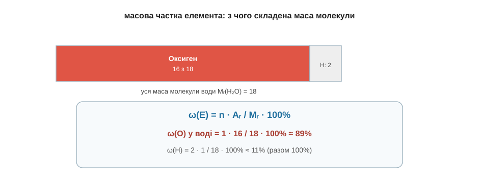

# Розділ 6.2 — Масова частка

Кількість речовини ми вже вміємо рахувати. Тепер — про друге число, яке трапляється чи не в кожній другій задачі й на кожній другій етикетці: **частка**. Скільки солі в розсолі, скільки золота в каблучці, скільки Нітрогену в добриві, скільки спирту в настоянці — усе це питання «яку частину цілого становить щось». У цьому розділі дві майже однакові формули: одна — про частку речовини в суміші, друга — про частку елемента в молекулі.

## 6.2.1 Масова частка речовини: ω = m(речовини) / m(суміші) · 100 %

На пляшці мінералки пишуть «мінералізація 4 г/л», на банці — «розчин солі 10 %», морська вода «солона на 3,5 %». Усюди якісь частки й відсотки. Розберімо, що це число означає й звідки береться, — і виявиться, що це найпростіша арифметика на світі.

Уяви, що ти розчинив 30 грамів солі у 170 грамах води. Скільки всього вийшло розчину? Очевидно, 30 + 170 = 200 грамів — сіль нікуди не зникла, вона тепер у воді (це ми бачили ще в модулі про розчини). А тепер питання: яку частину цієї маси становить сама сіль? Та просто масу солі поділити на масу всього розчину: 30 поділити на 200. Виходить 0,15 — тобто сіль це 15 сотих усієї маси. Дроби читати незручно, тож їх за звичаєм множать на 100 і дописують значок «%»: 0,15 — це 15 %. Оце число й називають **масовою часткою** і позначають грецькою буквою ω («омега»):

```
ω = m(речовини) / m(розчину) · 100%

ω        — масова частка, %
m(речовини) — маса розчиненої речовини, г
m(розчину)  — маса всього розчину (речовина + розчинник), г
```


*Рис. 6.2.1-1. Масова частка — це частина від цілого: маса солі ділена на масу всього розчину, помножена на 100 для зручних відсотків.*

Найкорисніше, що ця формула працює в обидва боки — залежно від того, чого в задачі не вистачає. Якщо знаєш маси й шукаєш частку — ділиш, як щойно. А якщо навпаки, відома частка й треба дізнатися, скільки чого взяти, — множиш. Скажімо, тобі треба приготувати 200 грамів 15-відсоткового розчину солі. Скільки солі відважити? Береш ту саму формулу й виражаєш із неї масу солі: m(солі) = ω · m(розчину) = 0,15 · 200 = 30 грамів (а води — решта, 170 г). Та сама рівність, просто дивимось на неї з іншого боку, як ми вже робили з трикутником у попередньому розділі.

Спробуй тепер сам, для певності. Ти розмішав 5 грамів цукру в 95 грамах води — яка масова частка цукру в цьому сиропі?.. Маса всього розчину 5 + 95 = 100 грамів, тож ω = 5 / 100 · 100 % = 5 %. (Коли маса розчину виходить рівно 100 грамів, частка у відсотках просто дорівнює масі речовини — зручний збіг, не більше.)

> 🏠 Написи «10 % розчину», «40 % спирту», «солоність 3,5 %» на етикетках — це все вона, масова частка: скільки грамів речовини припадає на кожні 100 грамів рідини.

## 6.2.2 Масова частка елемента у формулі: ω(Е) = n · Aᵣ / Mᵣ · 100 %

Та сама ідея частки відповідає й на зовсім інше питання. На мішку з добривом пишуть «багато азоту» — а як перевірити, скільки там того Нітрогену насправді? Або: вода — це Гідроген і Оксиген, але яку частину її маси тягне на собі кожен? Тут частку рахують уже не для речовини в суміші, а для елемента всередині однієї молекули, — і формула виходить майже та сама.

Згадаймо, як ми рахували молярну масу: складали атомні маси всіх атомів у формулі. Для води Mᵣ(H₂O) = 1 + 1 + 16 = 18. Так от, у цих 18 одиницях маси кожен елемент має свою частку: Оксиген вносить 16, а два Гідрогени — лише 2. Виходить, частка елемента — це його внесок у масу, поділений на всю молярну масу:

```
ω(Е) = n · Aᵣ / Mᵣ · 100%

n   — скільки атомів цього елемента у формулі
Aᵣ  — атомна маса елемента (з таблиці)
Mᵣ  — молярна маса всієї речовини
```

Порахуймо для води. Оксиген: n = 1, Aᵣ = 16, тож ω(O) = 1 · 16 / 18 · 100 % ≈ 89 %. Гідроген: n = 2, Aᵣ = 1, тож ω(H) = 2 · 1 / 18 · 100 % ≈ 11 %. Разом 89 + 11 = 100 %, як і має бути — уся маса розкладена між елементами без залишку. Несподівано, правда? Вода майже на дев'ять десятих за масою — це Оксиген, хоч атомів Гідрогену в ній удвічі більше; просто кожен атом Оксигену важчий у шістнадцять разів.


*Рис. 6.2.2-1. Уся маса молекули води (18) ділиться між Оксигеном (16) і двома Гідрогенами (2): звідси ≈89 % і ≈11 %.*

Саме так перевіряють і те добриво. Скажімо, аміак NH₃: молярна маса Mᵣ = 14 + 1 + 1 + 1 = 17, а Нітрогену в ньому 14 одиниць, тож ω(N) = 14 / 17 · 100 % ≈ 82 %. Дуже багатий на азот — недарма аміак і його сполуки кладуть у добрива. Спробуй сам прикинути для вуглекислого газу CO₂: яка в ньому масова частка Карбону, якщо Mᵣ(CO₂) = 44?.. Карбону там 12 одиниць із 44, тож ω(C) = 12 / 44 · 100 % ≈ 27 % — більшу частину маси вуглекислого газу тягне на собі Оксиген.

> 🏠 Цифри на мішку добрива (скільки відсотків азоту, фосфору, калію) — це масові частки елементів; за тією самою формулою їх рахують і перевіряють.

> ▶️ Далі: [Розділ 6.3 — Розрахунки за рівнянням](../r3-by-equation/r3-by-equation.md)
