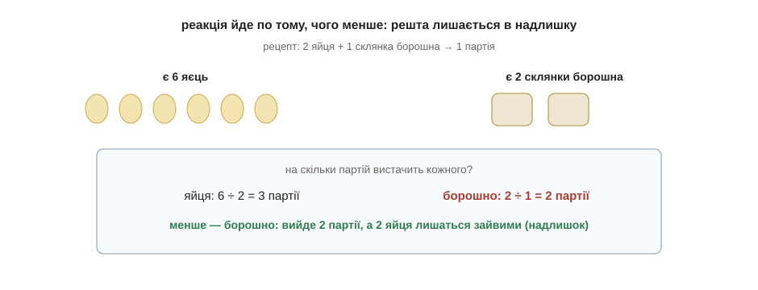

# Розділ 6.4 — Складніші задачі: гази, надлишок, вихід

Основу ми вже маємо: моль, масова частка, розрахунок за рівнянням. Лишилися три ситуації, на яких задача іноді ставить підніжку, — коли речовина газ, коли одного реагенту взяли більше, ніж треба, і коли реальність дає менше за теорію. Кожна з них додає рівно одну формулу або один прийом до того, що ми вже вміємо. А наприкінці цього розділу — кінець усієї книги.

## 6.4.1 Об'єм газу: V = n·Vₘ (Vₘ = 22,4 л/моль)

Доти ми переходили від речовини до молів через масу — зважили й поділили на M. Та з газом так робити незручно: спробуй-но зважити повітря чи водень. Газ куди легше виміряти не вагою, а **об'ємом** — скільки літрів він займає. І тут хімію виручає напрочуд гарний факт.

Ще Авогадро завважив: однакові об'єми будь-яких газів за однакових умов містять **однакову кількість молекул**. Дивно, але байдуже, важкі ті молекули чи легкі, — у газі вони розкидані так рідко, що значення має лише, скільки їх, а не які вони. А якщо так, то один моль (тобто та сама «пачка» з 6·10²³ частинок) будь-якого газу займає той самий об'єм. За нормальних умов цей об'єм виміряли — він дорівнює **22,4 літра на моль**, і його називають молярним об'ємом Vₘ. Звідси формула, така ж проста, як n = m/M, тільки замість маси — об'єм:

```
V = n · Vₘ        Vₘ = 22,4 л/моль (за нормальних умов)

V   — об'єм газу, літри
n   — кількість речовини, молі
Vₘ  — молярний об'єм, 22,4 л/моль
```


*Рис. 6.4.1-1. Однаковий об'єм різних газів містить однакове число молекул, тож моль будь-якого газу займає 22,4 літра.*

Користуватись нею так само легко в обидва боки. Який об'єм займуть 2 молі газу? V = 2 · 22,4 = 44,8 літра. А скільки молів газу в балоні на 11,2 літра? Виражаємо навпаки: n = V / Vₘ = 11,2 / 22,4 = 0,5 моля. Спробуй сам: який об'єм займе 0,5 моля будь-якого газу за нормальних умов?.. V = 0,5 · 22,4 = 11,2 літра. Тепер, до речі, у розрахунку за рівнянням можна на останньому кроці переходити не до грамів, а до літрів, якщо шукана речовина — газ: просто замість m = n·M береш V = n·Vₘ.

> 🏠 Тому гази й продають та міряють літрами чи кубометрами, а не кілограмами: для газу об'єм — це майже пряма лічба молекул.

## 6.4.2 Надлишок і нестача: за чим рахувати

Досі в наших задачах однієї речовини було рівно стільки, скільки треба. Та в житті — і в задачах — частіше дають кількості обох реагентів, і вони не конче «у міру». Уяви рецепт млинців: на одну партію треба 2 яйця й 1 склянка борошна. У тебе є 6 яєць, але лише 2 склянки борошна. Скільки партій вийде — і що лишиться зайвим?

Відповідь підказує здоровий глузд: партій буде стільки, на скільки вистачить того, чого **менше**. Перевіримо обидва складники. Яєць на 6 ÷ 2 = 3 партії. Борошна на 2 ÷ 1 = 2 партії. Менше число — у борошна, тож вийде лише 2 партії; борошно скінчиться першим, а з шести яєць підуть тільки чотири, і 2 яйця так і лишаться невикористаними. Те, чого не вистачило й що визначило результат, кажуть, узяте в **нестачі** (борошно), а те, що лишилося, — у **надлишку** (яйця).


*Рис. 6.4.2-1. Партій вийде стільки, на скільки вистачить того, чого менше: борошна — на 2, тож 2 яйця лишаються зайвими.*

У хімії все так само, лише «рецепт» — це коефіцієнти рівняння, а «склянки» — молі. Прийом той самий: перевести обидва реагенти в молі, поділити кількість кожного на його коефіцієнт у рівнянні — і менший результат покаже, якого реагенту не вистачає. Саме за ним і ведемо весь розрахунок продукту (за схемою з минулого розділу), а другий реагент лишається частково невитраченим. Спробуй на млинцях ще раз для певності: якби було 10 яєць і 3 склянки борошна — чого вистачить на менше партій?.. Яєць на 5 партій, борошна на 3; менше борошно — вийде 3 партії, а 4 яйця будуть зайві.

## 6.4.3 Вихід продукту: η = m(практ) / m(теор) · 100 %

І останній підступ — найчесніший. У минулому розділі ми порахували, що з 8 грамів водню має вийти 72 грами води. Але якби ти справді провів цю реакцію в колбі й зважив воду, її майже напевно виявилося б менше — скажімо, 63 грами. Куди ж поділася решта? Нікуди не зникла за законом збереження маси — просто частина не встигла прореагувати, щось лишилося на стінках, щось випарувалося. Реальність майже завжди трохи скупіша за теорію.

Щоб виміряти цю скупість, порівнюють те, що вийшло насправді, з тим, що обіцяла теорія, — і це знову проста частка, як у розділі про масову частку. Її називають **виходом** і позначають η («ета»):

```
η = m(практ) / m(теор) · 100%

η         — вихід, %
m(практ)  — маса, яку реально отримали
m(теор)   — маса, яку обіцяв розрахунок за рівнянням
```

Для нашої води: η = 63 / 72 · 100 % ≈ 87,5 %. Тобто реакція віддала майже дев'ять десятих обіцяного — для хімії дуже непогано. Працює формула й навпаки: якщо знаєш, що вихід зазвичай 80 %, а теорія обіцяє 50 грамів, то реально готуйся отримати m(практ) = 0,8 · 50 = 40 грамів. Спробуй сам: теорія дає 200 грамів, а вихід вийшов 90 % — скільки грамів продукту ти отримав?.. m(практ) = 0,9 · 200 = 180 грамів.


*Рис. 6.4.3-1. Вихід — це частка від обіцяного теорією: реально отримана маса, поділена на теоретичну.*

---

Ось і все. Озирнися на пройдений шлях — він був неблизький. На першій сторінці слово «молекула» ще нічого для тебе не важило; а тепер ти знаєш, з чого зроблено світ, чому атоми з'єднуються, як речовини перетворюються одна на одну, чому горить вогонь і чому скисає вино, — і на додачу вмієш це порахувати. Шість модулів: від заряду в атомі до формул, якими розв'язують задачі. Уся «велика» шкільна хімія тепер для тебе не темний ліс, а знайома місцевість, лише з суворішими вивісками.

Тож наостанок — кілька щирих порад, як іти далі. Перша: розв'язуй і пиши рукою, бо самим читанням ні формули, ні хімію не опануєш — зрівноваж кілька рівнянь, порахуй кілька задач на моль, і вони сядуть міцніше за будь-яке перечитування. Друга: завжди питай «чому» аж до атомів, а коли відповідь не дається — чесно познач це місце й рушай далі, бо дещо в хімії спершу беруть на віру. Третя: роби кухонні досліди з цієї книги — хай хімія лишиться для тебе живою, а не паперовою. І четверта, найголовніша: не бійся формул і чисел. Ти щойно пройшов цілий модуль розрахунків і бачив на власні очі, що за кожною формулою стоїть проста, зрозуміла думка, а будь-яка «страшна» задача розбирається на кілька чесних кроків.

На цьому я прощаюся. Ти прийшов сюди, нічого не знаючи, — а йдеш із картою цілої науки в руках; усе інше тепер лягатиме на неї саме. Щасти тобі.

> 💡 **Що про це скаже великий підручник.** Усе з цього модуля там зветься хімічними розрахунками, а наука про кількісні відношення в реакціях — стехіометрією. Шукай слова «кількість речовини й моль», «молярна маса», «молярний об'єм» (та закон Авогадро з його 22,4 л), «масова частка», «реагент у надлишку та нестачі» і «вихід продукту реакції» — за кожним із цих поважних термінів стоїть рівно та формула, якою ти вже вмієш користуватися.
