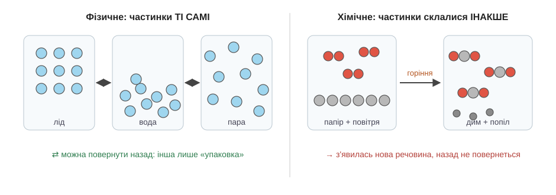

# Речовини

Поставмо поруч дві геть буденні картини. У склянці поволі тане кубик льоду. На сковорідці тим часом підгорає, чорніючи з краю, забутий млинець. Якщо спитати когось, що відбувається, відповідь буде однакова: «ну, щось змінилося». І справді, в обох випадках щось сталося. Але між цими двома «щось» лежить така прірва, що саме з неї, з уміння її побачити, і починається хімія. Розберімо обидві картини повільно, одну за одною.

Спершу домовмося про головне слово, бо воно муляє вже з самої назви. **Речовина** — це те, з чого зроблена річ. Склянка — це річ, а скло, з якого вона зроблена, — речовина. Цвях — річ, а залізо — речовина. Одна й та сама речовина може жити в тисячі різних речей: із того самого скла зроблено і склянку, і шибку, і кульку ялинкової прикраси. Коли хімік каже «речовина», він думає не про конкретний предмет, а про сам матеріал, з якого предмет складено.

Тепер повернімося до льоду. Він розтанув — і перед нами вода. На вигляд зміна повна: щойно було тверде, холодне, тримало форму, а стало рідке й текуче. І все ж придивімося: чи стало це **іншою речовиною**? Ні. Це та сама вода, лише в іншому вигляді — і найкращий доказ у тому, що зміну легко відмотати назад. Постав склянку з водою назад у морозилку — і за кілька годин матимеш той самий лід. Нічого нового не народилося і нічого не пропало; змінилося тільки те, наскільки щільно й нерухомо тримаються одна за одну ті дрібні частинки, з яких складається вода. Такі перетворення, де речовина лишається собою, а змінюється лише її вигляд чи стан, називають **фізичними**.

А тепер млинець — і тут той самий прийом уже не спрацює. Підгорілу чорну скоринку нічим не повернути назад у світле м'яке тісто: ні охолодженням, ні нагріванням, нічим. І не випадково. Скоринка — це вже **не те саме тісто, а нова речовина**: вона іншого кольору, інакше пахне, інша на смак і на дотик. Те, з чого складалося тісто, під час нагрівання перебудувалося, перетасувалося — і склалося в щось зовсім інше. Ось це й називають **хімічним** перетворенням, або коротше — **реакцією**: коли одна речовина зникає, а на її місці постає інша, з власними, новими властивостями. Що саме перебудовується всередині, з яких «цеглинок» це все складено, — то окрема глибока тема: усе довкола складене з крихітних [атомів і молекул](root:basic-chemistry/atoms-molecules), і саме їхнє перетасування й стоїть за кожною реакцією. Поки що нам важливе саме чуття різниці: фізичне перетворення лишає речовину собою, хімічне — народжує нову.

Як же впіймати реакцію, не маючи лабораторії, на самій кухні? Природа люб'язно лишає підказки, і їх варто знати в обличчя. Найчастіше про реакцію зраджує **стійка зміна кольору** — не відблиск, а справді інший колір, що не зникає. Друга підказка — **бульбашки газу** там, де нічого не кип'ятять: щось нове утворюється просто на очах і відлітає. Третя — коли в прозорій рідині раптом завихрюється каламуть і осідає тверде; таку каламуть називають **осадом**. І четверта — коли саме собою **виділяється тепло або світло**, хоч ніхто нічого не підігрівав. Але тут потрібна обережність, і це важливо: кожна така прикмета — лише підказка, а не вирок. Вода в чайнику теж укривається бульбашками, хоч кипіння — перетворення суто фізичне: пара, що піднімається, лишається тією самою водою. Тому остаточне питання завжди одне-єдине: **чи з'явилася нова речовина?** І є простий побутовий спосіб це перевірити: якщо все легко відмотати назад звичайним охолодженням чи висушуванням — майже напевно перед нами фізична зміна. Цукор, що нібито «зник» у чаї, нікуди насправді не подівся: випаруй воду — і він знову осяде на дні білими крупинками. А от попіл назад у дрова не повернеться вже ніколи — бо дрова згоріли, і це була реакція.

*Зліва — лід, вода й пара: частинки ті самі, різниться лише «упаковка», тому стрілки двосторонні. Справа — горіння: частинки склалися в нові поєднання, постала нова речовина, і назад дороги вже немає.*

Хто навчився бачити цю межу — гру вигляду проти появи нового, — той уже тримає в руках найперше чуття, на якому стоїть уся хімія.
