# Розділ 1.7 — Змінний струм: синусоїда, фаза й RMS

Досі ми мали справу з постійним струмом: батарея тримає сталу напругу, струм тече в один бік, і час нічого не змінює. Та світ електрики переважно інший. Розетка в стіні, обмотки двигуна, кожен звуковий чи радіосигнал — це напруга, що безперервно коливається, міняючи знак десятки й мільйони разів за секунду. Щоб розуміти й розраховувати такі кола, потрібен новий апарат — і він напрочуд стрункий.

Цей розділ уводить мову змінного струму. Ми побачимо, чому коливання набирають саме форми **синусоїди** і чому вона природна для всього, що гойдається й обертається. Розберемо її параметри — амплітуду, період, частоту — і ключове поняття **фази**: на скільки одна хвиля випереджає чи відстає від іншої. З'ясуємо, як чесно порівняти змінну напругу з постійною через **діюче значення (RMS)** — те саме число, що пишуть на розетці. І зрештою познайомимося з **фазорами** — прийомом, який обертає громіздку тригонометрію коливань на просту арифметику стрілок.

> 📜 **Історична вставка:** [Штейнмец і математика змінного струму](hist-steinmetz.md) — як складні розрахунки змінного струму звели до простої алгебри.

---

## 1.7.1 Чому синусоїда: природна форма коливань

Озирніться довкола — і ви побачите, що світ коливань напрочуд одноманітний. Напруга в розетці гойдається вгору-вниз п'ятдесят разів на секунду. Звук, що долинає до вуха, — це тиск повітря, який коливається коло середнього значення. Радіохвиля, на якій працює Wi-Fi, — електромагнітне поле, що дрижить мільярди разів на секунду. І щоразу, коли інженер або фізик зображає таке коливання, він малює ту саму криву — **синусоїду** (*sine wave*). Не трикутник, не прямокутник, не якусь випадкову хвилясту лінію, а саме плавний, симетричний синус.

Це не випадковість і не умовність. Можна було б уявити світ, де коливання мають форму зубців пилки чи прямокутних сходинок, — але природа раз у раз обирає синус. Чому? Звідки в нього така першість? У §1.2.12 ми вже провели межу між постійним струмом (DC), де напруга стала, і змінним (AC), де вона коливається; а історія цього розділу розповідає, як Чарльз Штейнмец приборкав математику змінного струму. Тепер настав час відповісти на засадниче питання: **чому коливання набирає саме форми синуса** — і чому ця форма така зручна, що на ній збудовано всю електротехніку. Відповідь має кілька рівнів, і кожен глибший за попередній: від простої геометрії обертання — до тонкої властивості, через яку синус є справжньою рідною мовою лінійних кіл.

### Синус — це тінь рівномірного обертання

Найпростіший спосіб «побачити» синус — не в коливанні, а в **обертанні**. Уявіть точку, що рівномірно біжить по колу зі сталою швидкістю, і поставте збоку ліхтар, який відкидає її тінь на вертикальну лінію. Поки точка кружляє, її тінь не кружляє — вона **гойдається** вгору-вниз уздовж лінії. І гойдається не абияк, а саме синусоїдою: повільно повертає на самій вершині, найшвидше проходить середину, плавно сповільнюється внизу. Те, що для точки є простим рівномірним обертанням, для її тіні стає коливанням цілком певної форми.

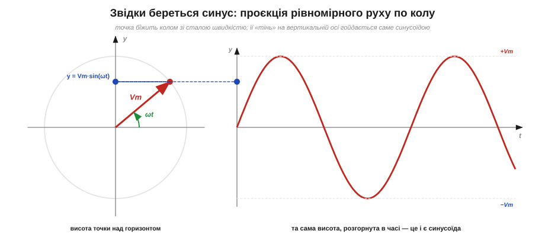
*Рис. 1.7.1.1. Точка рівномірно біжить колом; її проєкція (тінь) на вертикальну вісь гойдається саме синусоїдою. Якщо радіус-вектор має довжину Vₘ і повертається на кут ωt, то висота тіні дорівнює Vₘ·sin(ωt) — синус народжується прямо з геометрії обертання.*

Зведемо це в число. Нехай радіус кола дорівнює Vₘ, а точка обертається так, що за час t повертається на кут ωt (тут ω — швидкість обертання, скільки радіан за секунду). Тоді висота точки над горизонталлю — це проста тригонометрія прямокутного трикутника:

```
v(t) = Vm · sin(ωt)
```

Звідки ж та характерна плавність — повільно на краях, швидко посередині? Подумаймо про **швидкість тіні**. Коли точка проходить найвищу й найнижчу позиції кола, вона рухається майже горизонтально — тобто її тінь на вертикальній осі майже стоїть на місці, ледь повзе; тому на вершинах синусоїда «затримується» й плавно завертає. А коли точка проходить бічні позиції кола (на висоті осі), вона мчить прямо вгору або вниз — і тінь летить найшвидше; тому синусоїда найкрутіша саме там, де перетинає вісь. Та сама стала швидкість по колу, спроєктована на вісь, дає змінну швидкість гойдання — і це рівно та плавна, «дихаюча» крива, яку ми звемо синусом. Жодна інша рівномірність так не виглядає.

Величину Vₘ називають **амплітудою** (*amplitude*) — це найбільше відхилення, радіус того кола; саме до нього сягає коливання вгору й униз. А сам радіус-вектор, що обертається, в електротехніці отримав ім'я **фазор** (*phasor*) — обертова стрілка, чия тінь і є наша синусоїда. Поки що досить цього образу: ми не розбиратимемо фазори детально (це матеріал пізніших тем), але вже бачимо головне — за кожною синусоїдою стоїть рівномірне обертання, а синус є просто його проєкцією на вісь. Тому й не дивно, що все, у чому є обертання, природно «говорить» синусом.

> ⚙️ **Алгоритмічна вставка:** [Синус у коді: таблиця відліків і фазовий акумулятор](proj-phase-accumulator.md) — як цю обертову стрілку «оживляють» у мікроконтролері, щоб він видавав синус без жодного `sin()`.

### Природа любить синус, бо любить повертати до рівноваги

Та обертання — це лише половина історії, і то не найглибша. Адже маятник не обертається по колу, струна гітари нікуди не їде по колу — а коливаються вони так само синусоїдно. Має бути причина глибша за геометрію. І вона є: ця причина — **повертальна сила**.

Придивімося, що спільного в усіх коливальних системах. Маятник, відхилений убік, тягне назад до низу. Маса на пружині, відтягнута від спокою, штовхається пружиною назад. Натягнута струна, відведена пальцем, рветься повернутись у пряму лінію. У кожному випадку є **положення рівноваги** і є **сила, що повертає до нього**: чим далі система відхилилась, тим дужче її тягне назад.

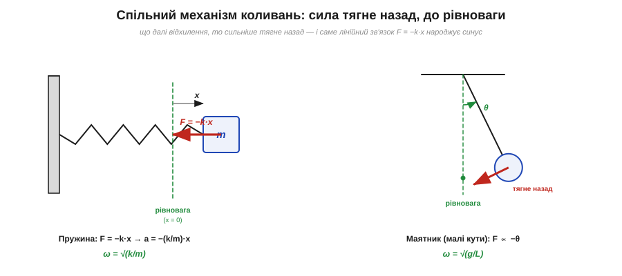
*Рис. 1.7.1.2. Спільний механізм коливань: відхилену від рівноваги масу пружина тягне назад із силою F = −k·x (мінус означає «проти відхилення»), а маятник на малих кутах — силою, пропорційною куту. Що далі відхилення, то сильніше тягне до спокою — і саме ця пропорційність народжує синус.*

Найчистіший приклад — пружина. Розтягніть її на величину x — і вона відповість силою, що описується **законом Гука**:

```
F = −k · x
```

Тут k — жорсткість пружини, а знак «мінус» — найважливіше в цій формулі: він каже, що сила завжди напрямлена **проти** відхилення, назад до рівноваги. Відтягнули праворуч — тягне ліворуч; стиснули ліворуч — штовхає праворуч. Тепер згадаймо другий закон Ньютона, F = m·a, де прискорення a — це друга похідна координати за часом. Підставивши силу Гука, дістаємо рівняння руху:

```
m · (d²x/dt²) = −k · x
   d²x/dt²     = −(k/m) · x  =  −ω²·x,   де  ω = √(k/m)
```

Це знамените **рівняння простого гармонічного коливання** (*simple harmonic motion*). І воно ставить математиці дуже своєрідне питання: знайди таку функцію часу, чия друга похідна дорівнює їй самій, узятій із мінусом (і помноженій на сталу ω²). Виявляється, таких функцій рівно дві — **синус і косинус**. Жодна інша форма (ні трикутник, ні прямокутник, ні парабола) цій умові не задовольняє. Тому розв'язок завжди той самий:

```
x(t) = Vm · sin(ωt + φ)
```

Ось де лежить найглибша причина всюдисущості синуса в механіці: **щойно повертальна сила пропорційна відхиленню, коливання неминуче виходить синусоїдним**. А пропорційна вона майже завжди — і ось чому. Будь-яка гладка залежність сили від відхилення біля точки рівноваги виглядає як крива, але **на малому шматочку всяка крива майже пряма** — як крихітна ділянка кола здається відрізком. Тому для малих відхилень навіть складна сила «випрямляється» в просту пропорційність F ≈ −k·x, і коливання виходить синусоїдним. Саме тому форма коливань майже будь-чого при малій амплітуді — синус; «несинусоїдність» вилазить лише на великих розгойдуваннях, коли крива сили вже відчутно гнеться (маятник, відведений на 90°, гойдається помітно не-синусоїдно, а на 5° — практично ідеальним синусом). Тому маятник на малих кутах, маса на пружині, камертон, що дає чистий тон, струна, кристал кварцу в годиннику — усе це гойдається синусом.

І, що для нас найважливіше, **електричний коливальний контур** із котушки та конденсатора (LC-контур) підкоряється точнісінько тому самому рівнянню. Тут роль координати x грає **заряд** на конденсаторі, роль маси m — **індуктивність** котушки L (вона «опирається» зміні струму, як маса — зміні швидкості), а роль жорсткості пружини k — обернена **ємність** 1/C (заряджений конденсатор «штовхає» заряд назад тим дужче, чим він менший). Підставивши ці відповідники, дістаємо те саме рівняння гармонічних коливань, а з нього — частоту електричних коливань:

```
механіка:   d²x/dt² = −(k/m)·x        ω = √(k/m)
   ↕ ті самі рівняння, інші імена ↕
контур:     d²q/dt² = −(1/LC)·q        ω = 1/√(LC)
```

Заряд перетікає з конденсатора в котушку й назад, енергія гойдається між електричним полем (у конденсаторі) і магнітним (у котушці) — а струм і напруга виходять синусоїдними. Механічні й електричні коливання — близнюки, описані однією математикою; зрозумівши одне, ви безкоштовно розумієте інше.

**Приклад (частота LC-контуру).** Котушка L = 100 мкГн з конденсатором C = 100 нФ утворюють коливальний контур. На якій частоті він «дзвонить»?

```
ω = 1/√(LC) = 1/√(100·10⁻⁶ · 100·10⁻⁹)
            = 1/√(10⁻¹¹) = 1/(3.16·10⁻⁶)  ≈ 3.16·10⁵ рад/с
f = ω/(2π)  = 3.16·10⁵ / 6.283            ≈ 50.3·10³ Гц  ≈ 50 кГц
T = 1/f                                    ≈ 20 мкс
```

Контур самочинно коливатиметься коло 50 кГц — заряд повністю перетікає туди-сюди приблизно кожні 20 мікросекунд. Змініть L чи C — зміниться й частота: саме так контур «налаштовують» на потрібну хвилю. Це та сама фізика, що й камертон на 440 Гц, лише на електричному боці й у тисячі разів швидша.

### Чому виходить саме синус, а не щось інше

Рівняння d²x/dt² = −ω²·x можна відчути й без формальної математики — самим оком, дивлячись на графік. Друга похідна — це **кривина** лінії, тобто наскільки вона вигинається. А відхилення x — це висота точки над віссю. Рівняння каже: **вигин кривої в кожній точці пропорційний висоті над віссю й напрямлений до неї**.

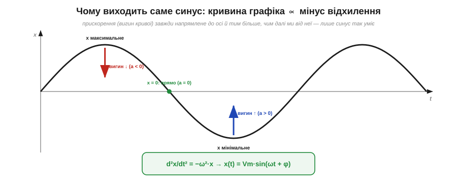
*Рис. 1.7.1.3. Чому виходить саме синус: де крива високо над віссю, там вона круто вигинається донизу (прискорення «вниз»); де низько — вигинається вгору; а на самій осі, де відхилення нульове, крива йде прямо й найшвидше. Така самоузгоджена крива і є синусоїдою.*

Простежмо логіку. На самій вершині коливання відхилення найбільше — отже, вигин найкрутіший, і він тягне криву донизу; тому на вершині крива плавно завертає вниз. У западині все навпаки: відхилення велике, але «вниз», тож вигин дужий і напрямлений угору — крива розвертається й піднімається. А коли крива перетинає вісь, відхилення нульове — отже, і кривина нульова: тут лінія йде прямо, найкрутіше, на максимальній швидкості. Складіть ці правила докупи — і єдина крива, що сама себе так узгоджує (швидко мчить через нуль, плавно завертає на краях, і так без кінця), — це синусоїда. Будь-яка інша форма десь порушила б умову «вигин пропорційний висоті» й не змогла б нескінченно повторюватися.

> 🔧 **Навіщо це.** Ця сама математика — основа кварцового резонатора, що задає такт кожному мікроконтролеру. Кристал кварцу — це механічний камертон, який коливається з винятково сталою ω, бо його жорсткість і маса майже не пливуть від температури. Розуміючи, що частота коливань ω = √(жорсткість/маса) (або ω = 1/√(LC) для електричного контуру), ви розумієте, чому годинник іде рівно, чому контур налаштовують саме на потрібну частоту й чому «чистий» тон — це завжди синус однієї частоти, а не мішанина.

### Звідки синус у розетці: обертовий генератор

Тепер стає зрозуміло, **чому мережа змінна саме синусоїдна**, — і причина напрочуд буквальна. Електрику для мережі виробляють **генератори** на електростанціях, а генератор — це, по суті, виток дроту (рамка), що обертається в магнітному полі. А ми вже знаємо: обертання й синус — нерозлучні.

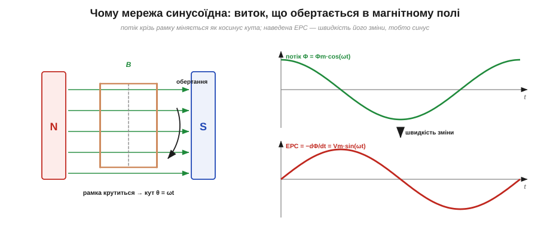
*Рис. 1.7.1.4. Рамка обертається в полі магніту. Магнітний потік крізь неї змінюється за косинусом кута повороту (найбільший, коли рамка поперек поля; нульовий, коли вздовж). Наведена ЕРС — це швидкість зміни потоку, а похідна косинуса є синус. Тому на виході генератора напруга має форму Vₘ·sin(ωt).*

Механізм такий. Коли рамка обертається, **магнітний потік** крізь неї весь час міняється: він найбільший, коли площина рамки стоїть поперек поля (поле «пронизує» її повністю), і падає до нуля, коли рамка повертається вздовж поля. Якщо кут повороту зростає рівномірно (θ = ωt), то потік міняється за косинусом цього кута. А напруга на виводах рамки — наведена **електрорушійна сила** (ЕРС) — за законом електромагнітної індукції дорівнює **швидкості зміни потоку** (його похідній за часом, узятій із мінусом). Похідна ж косинуса — це синус. Отже, на виході обертового генератора напруга неминуче виходить синусоїдною:

```
Φ(t)  = Φm · cos(ωt)         ← потік крізь рамку
ЕРС   = −dΦ/dt = Vm · sin(ωt) ← наведена напруга
```

Ось і вся розгадка форми мережевої напруги: вона синусоїдна тому, що **родом від обертових машин**. А частота мережі (50 герц у більшості світу, 60 — у частині країн) — це просто швидкість обертання тих генераторів, переведена в герци: п'ятдесят повних обертів за секунду дають п'ятдесят періодів синусоїди. (Чому світ зупинився саме на 50 і 60 герцах — окрема й цікава історія, до якої ми ще повернемось далі в курсі.) Деталі електромагнітної індукції — теж попереду, у розділі про магнетизм; тут важлива сама причина: синус у розетці — це обертання, записане напругою.

### Найглибша причина: синус не міняє форми

Дотепер ми бачили, чому синус так часто **виникає**. Та є ще одна, найтонша причина, чому інженери його так **люблять** і будують на ньому всю теорію змінного струму. Вона ось у чому: **синус — єдина форма коливання, яка проходить крізь лінійне коло, не змінюючи своєї форми**.

Згадаймо, що роблять із сигналом основні елементи кіл. Конденсатор і котушка — це елементи, що **диференціюють та інтегрують** сигнал (струм крізь конденсатор пропорційний швидкості зміни напруги; напруга на котушці — швидкості зміни струму). А тепер — ключове спостереження про синус: його **похідна — це косинус** (той самий синус, лише зсунутий на 90°), а **інтеграл — теж синус**. Це варто відчути наочно. Похідна — це нахил кривої; а де синус найкрутіший? Там, де перетинає вісь. Де він пологий (нахил нуль)? На вершинах. Тобто крива нахилів синуса сама сягає максимуму там, де синус нульовий, і нуля там, де синус на піку, — а це і є косинус, та сама хвиля, зсунута на чверть періоду. Продиференціюйте косинус — знову вийде синус (із мінусом). Тож скільки разів синус не диференціюй чи інтегруй — він лишається синусом тієї самої частоти; змінюються тільки **амплітуда** (наскільки великий) і **фаза** (на скільки зсунутий). Форма — недоторканна. Ця замкненість — рідкісна: майже жодна інша функція, узявши похідну, не повертає саму себе в тій самій формі.

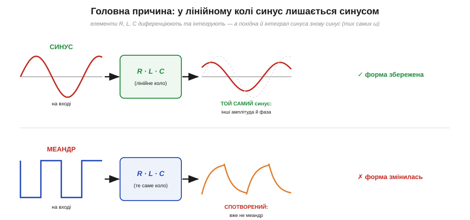
*Рис. 1.7.1.5. Пропустіть синус крізь коло з R, L, C — на виході знову синус тієї самої частоти, лише з іншою амплітудою та зсунутий по фазі (форма ціла). Пропустіть прямокутник (меандр) — і він спотвориться до невпізнання: гострі фронти «округляться» в експоненційні заряди-розряди. Жодна форма, крім синуса, не проходить лінійне коло незмінною.*

Наслідок цього колосальний. Подайте на будь-яке коло з резисторів, котушок і конденсаторів **синус** — і в кожній точці кола ви знайдете знову синус **тієї самої частоти**, хіба з іншою висотою й зсувом. Тож замість того, щоб щоразу розв'язувати громіздкі диференціальні рівняння, інженер може говорити просто: «на вході синус такої амплітуди й фази — на виході синус такої». Уся складність коливання зводиться до двох чисел (амплітуда й фаза) при фіксованій частоті. Саме на цьому стоїть метод фазорів, яким Штейнмец (історія розділу) обернув жахливу тригонометрію на легку алгебру стрілок.

А тепер контраст. Подайте на те саме коло **прямокутник** (меандр) або трикутник — і на виході ви не впізнаєте сигналу: гострі вертикальні фронти «округляться» в плавні експоненційні криві заряду й розряду, прямі полички вигнуться. Прямокутник, пройшовши крізь конденсатор, перестає бути прямокутником. І трикутник теж міняє форму. **Лише синус незрушний.** Ось чому синус — не просто одна з можливих форм коливань, а **природна мова лінійних кіл**: він єдиний, з ким коло поводиться по-справжньому просто.

### Синус як універсальна цеглинка

Лишається останнє, що остаточно підносить синус над усіма іншими формами. Виявляється, синус — не тільки найзручніша форма, а ще й **будівельний матеріал для всіх інших**. Великий математичний результат (його відкрив Жозеф Фур'є) каже: **будь-який періодичний сигнал, хоч яким химерним він був би, можна подати як суму синусів** різних частот і амплітуд. Ці складові-синуси називають **гармоніками** (*harmonics*): є основна частота, а до неї додаються кратні їй (удвічі, утричі вища тощо).

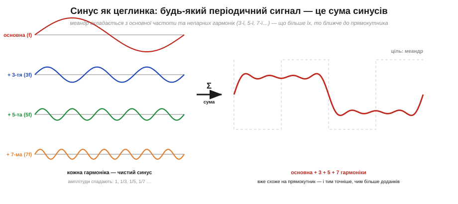
*Рис. 1.7.1.6. Навіть гострий прямокутник — це сума плавних синусів. Меандр складається з основної частоти та непарних гармонік (3-ї, 5-ї, 7-ї…) зі спадними амплітудами 1, ⅓, ⅕, ⅐… Що більше гармонік додати, то ближча їхня сума до ідеального прямокутника. Синус — цеглинка, з якої складаються всі інші форми.*

Класичний приклад — той самий прямокутник. Здавалося б, що в ньому спільного з плавним синусом? А проте меандр — це рівно **основна синусоїда плюс її непарні гармоніки** (3-тя, 5-та, 7-ма…), кожна зі щораз меншою амплітудою (1, потім ⅓, ⅕, ⅐…). Додайте лише основну — вийде проста хвиля; додайте кілька перших гармонік — обриси вже квадратнішають; додайте їх багато — і сума майже точно відтворить гострий прямокутник. Будь-яку періодичну форму можна так «зібрати» із синусів.

Чому саме **непарні** гармоніки й чому так повільно спадають амплітуди — теж має просте пояснення. Меандр **симетричний**: його друга половина — дзеркальне відображення першої з протилежним знаком. Така симетрія «вирізає» всі парні гармоніки (вони їй суперечать) і лишає тільки непарні. А спадання як 1, ⅓, ⅕, ⅐ повільне саме тому, що в прямокутника гострі, вертикальні фронти: щоб зліпити різкий стрибок із плавних синусів, потрібно дуже багато високих гармонік, і кожна ще відчутно важить. Це загальне правило: **що гостріший сигнал, то багатші його високі гармоніки**; плавна хвиля обходиться кількома, а різкий фронт тягне за собою довгий «хвіст» частот. Тому, до речі, швидкі прямокутні цифрові сигнали так легко стають джерелом радіозавад — їхні численні високі гармоніки розлітаються ефіром.

Це й замикає логіку. Якщо кожний сигнал — це сума синусів, а коло поводиться з кожним синусом просто (не міняючи форми, лише амплітуду й фазу), то й поведінку кола з **будь-яким** сигналом можна зрозуміти, розклавши той сигнал на синуси, пропустивши кожен окремо й склавши результат. Синус — це атом, на який розкладається все інше, і саме тому він — фундамент усього аналізу сигналів. (Як це працює докладно — RMS, спектр, гармоніки — ми побачимо в наступних темах розділу.)

### Зв'язки, що знадобляться далі

Перш ніж рушити далі, зведемо докупи кілька співвідношень, які описують будь-яку синусоїду. Ми вже бачили амплітуду Vₘ (висота) і кутову частоту ω (швидкість обертання фазора, радіан за секунду). Поряд із ними живуть **період** T (час одного повного циклу) і **частота** f (скільки циклів за секунду, у герцах), а зв'язані вони просто:

```
f = 1 / T          ω = 2π · f          v(t) = Vm · sin(2π·f·t + φ)
```

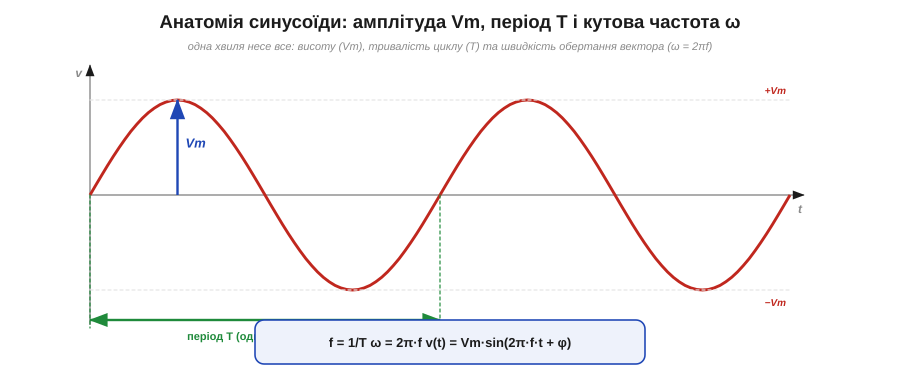
*Рис. 1.7.1.7. Одна синусоїда несе все: амплітуду Vₘ (висота від осі до піка), період T (тривалість одного циклу) і кутову частоту ω = 2πf (швидкість обертання породжувального фазора). Доданок φ під синусом — фаза, зсув хвилі в часі.*

Множник 2π тут — данина тому, що повний оберт фазора по колу становить 2π радіан, тож за f обертів на секунду стрілка проходить 2πf радіан за секунду — це і є ω. А доданок φ під синусом — це **фаза**, що задає, з якої точки циклу хвиля стартує. Усі ці величини — амплітуду, період, частоту й фазу — ми розберемо вже в наступних темах докладно (амплітуда, період і частота — у §1.7.2, фаза й зсув фаз — у §1.7.3, а діюче значення RMS — у §1.7.4). Тут вони з'являються лише як попередній ескіз, щоб картина синусоїди була повна.

> 🔧 **Навіщо це.** Зрозуміти, **чому** сигнали синусоїдні, — значить зрозуміти, чому вся електротехніка змінного струму збудована саме навколо синуса, а не якоїсь іншої форми. Це не примха й не традиція: синус народжується щоразу, коли щось обертається (генератор) або гойдається біля рівноваги (контур, кварц), і він єдиний проходить крізь R, L, C, не міняючи форми, — тому з ним кола рахуються просто (через амплітуду й фазу), а будь-який інший сигнал спершу розкладають на синуси. Через це генератори сигналів, аналіз кіл, фільтри, радіо й звук усі говорять «мовою синуса». Засвоївши цю першопричину, ви далі читатимете параметри синусоїди (амплітуду, частоту, фазу, RMS) уже не як набір формул, а як опис тієї самої обертової стрілки.

---

Підсумок §1.7.1: **синусоїда** — природна форма коливань одразу з кількох причин. Геометрично вона є **проєкцією рівномірного обертання** на вісь: v(t) = Vₘ·sin(ωt). Фізично вона неминуче виникає там, де **повертальна сила пропорційна відхиленню** (закон Гука F = −k·x): рівняння d²x/dt² = −ω²·x має розв'язком саме синус — тому так коливаються маятник, пружина, струна, кварц і електричний LC-контур. **Мережа** синусоїдна, бо її напругу виробляють **обертові генератори** (потік-косинус → ЕРС-синус). А найглибша причина любові до синуса в тім, що він **єдиний проходить лінійне коло (R, L, C), не міняючи форми** — лише амплітуду й фазу; будь-яка інша форма спотворюється. Нарешті, синус — **універсальна цеглинка**: будь-який періодичний сигнал є сумою синусів-гармонік. Знаючи це, можна переходити до точного опису параметрів синусоїди — амплітуди, періоду й частоти.

---

## 1.7.2 Амплітуда, період, частота

У §1.7.1 ми вже мигцем назвали параметри синусоїди — амплітуду, період, частоту — коли зводили докупи формулу v(t) = Vₘ·sin(2π·f·t + φ). Тоді це був лише ескіз, потрібний, щоб картина була повна. Тепер настав час розібрати кожен параметр по-справжньому: що він означає фізично, як його міряють, у яких одиницях записують і де в ньому ховаються пастки, на яких спотикаються навіть досвідчені. Бо синусоїда — це хвиля, у якої немає кінця й немає одного «значення»: вона безперервно міняється. Щоб говорити про неї конкретно — підставляти в розрахунок, замовляти генератор, читати даташит — потрібен невеликий, але точний словник чисел. Цей словник і є тема.

Домовимося від початку: повністю синусоїду без фази задають **три** числа — наскільки вона **висока** (амплітуда), як **довго** триває один цикл (період) і, що те саме іншими словами, як **часто** цикли повторюються (частота). Перше число — про вертикаль графіка, два інші — про горизонталь, і вони між собою однозначно зв'язані. Розгляньмо їх по черзі.

### Амплітуда: наскільки високо гойдається хвиля

**Амплітуда** (*amplitude*, Vₘ) — це найбільше відхилення синусоїди від середньої лінії, висота її піка над віссю. Якщо згадати образ із §1.7.1, де синус — тінь обертової точки, то амплітуда є просто **радіусом** того кола: далі за нього тінь не сягне ні вгору, ні вниз. У формулі v(t) = Vₘ·sin(ωt) множник перед синусом і є амплітуда: сам sin гойдається між −1 і +1, а Vₘ розтягує цей розмах до потрібної висоти. Для напруги її міряють у вольтах, для струму — в амперах, для звуку — в одиницях тиску; суть та сама — найбільше значення, якого величина сягає.

Та тут чигає перша й найчастіша плутанина, через яку зчитують удвічі більше або менше, ніж є насправді. Річ у тім, що «висоту» синусоїди називають **трьома** різними числами, і їх легко сплутати:

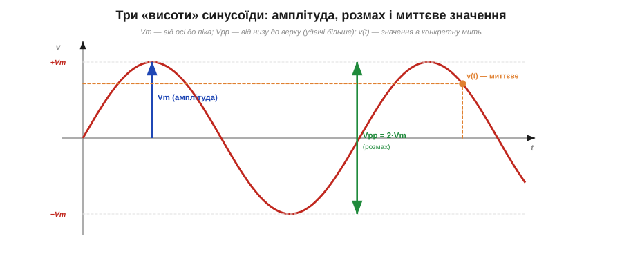
*Рис. 1.7.2.1. Три «висоти» однієї хвилі. **Амплітуда** Vₘ — від середньої осі до піка. **Розмах** (від піка до піка) Vₚₚ — від найнижчої точки до найвищої, тобто рівно вдвічі більший: Vₚₚ = 2·Vₘ. **Миттєве значення** v(t) — те, що хвиля має в конкретну мить (будь-де від −Vₘ до +Vₘ). Плутати їх — типова причина помилки «удвічі».*

- **Амплітуда** Vₘ (*amplitude*, ще «пікове значення», *peak*, Vₚ) — від осі до піка. Це те, що стоїть у формулі.
- **Розмах від піка до піка** Vₚₚ (*peak-to-peak*) — від найнижчої точки до найвищої. Для симетричної синусоїди він рівно **вдвічі** більший: Vₚₚ = 2·Vₘ. Осцилограф найзручніше показує саме його — бо око просто міряє повну висоту хвилі на екрані.
- **Миттєве значення** v(t) (*instantaneous*) — значення в конкретну мить t. Воно весь час інше: то нуль, то максимум, то від'ємне. Саме його дає формула, коли підставити певний момент часу.

Це не педантизм: коли в даташиті написано «розмах 2 В», а ви візьмете це за амплітуду, помилитеся вдвічі. Тож щоразу варто питати, **котра саме** «висота» мається на увазі — Vₘ, Vₚₚ чи миттєве v(t). У техніці частіше за все фігурує саме розмах Vₚₚ (його легко зміряти) і — як ми побачимо в §1.7.4 — діюче значення; чисту амплітуду Vₘ радше підставляють у формули.

Окремо варто спинитися на миттєвому значенні v(t), бо це поняття легко проґавити, а воно — найосновніше з трьох. Амплітуда й розмах — це числа-характеристики **всієї** хвилі, сталі; а v(t) — це те, чим напруга **насправді є** в кожну окрему мить, і саме воно весь час біжить угору-вниз за синусом. Решта параметрів — лише зручні мітки на цьому невпинному русі: амплітуда позначає, **доки** він сягає, період — за **який час** повторюється. Коли осцилограф малює хвилю, він фактично відкладає миттєве v(t) точка за точкою; коли мікроконтролер «оцифровує» сигнал, він теж бере саме миттєві значення, одне за одним, багато разів за період. Тож амплітуда — це межа, а v(t) — сам рух у її межах.

Помітьмо й корисний наслідок про симетрію. У чистої синусоїди, що гойдається коло нуля, додатний пік (+Vₘ) і від'ємний (−Vₘ) однакові за величиною — хвиля симетрична. Але в реальному колі синус часто «сидить» на сталому зміщенні (постійній складовій): наприклад, коливається не коло нуля, а коло +2.5 В. Тоді його верхній пік і нижній лежать на різній висоті від нуля, хоч **амплітуда** (відхилення від середньої лінії, тобто від тих 2.5 В) лишається тією самою. Тому, говорячи про амплітуду, завжди мають на увазі відхилення від **середнього рівня хвилі**, а не від абсолютного нуля, — і цю різницю ми ще пригадаємо, коли в §1.7.5 розбиратимемо вхідні режими осцилографа.

> 🔧 **Навіщо це.** Замовляючи чи описуючи сигнал, завжди уточнюйте, **в яких числах** він заданий. Генератор сигналів зазвичай виставляють у Vₚₚ (розмах), даташит АЦП обмежує вхід піковим значенням, а «гучність» лінійного аудіовиходу часто дають у діючих вольтах. Сплутавши Vₘ і Vₚₚ, легко або обрізати сигнал удвічі завеликою амплітудою (перевантажити вхід), або, навпаки, недодати половину розмаху. Звичка перепитувати «це амплітуда чи розмах?» рятує від найбанальнішої й найприкрішої з помилок.

### Період: тривалість одного циклу

Перейдімо з вертикалі на горизонталь — у вимір часу. **Період** (*period*, T) — це час, за який хвиля проходить **один повний цикл** і повертається в ту саму точку, рухаючись у той самий бік. Узяли будь-яку точку на синусоїді — скажімо, гребінь — і відрахували час до наступного такого самого гребеня: це й буде період. Міряють його в секундах, а для швидких сигналів — у мілісекундах (1 мс = 10⁻³ с), мікросекундах (1 мкс = 10⁻⁶ с) чи навіть наносекундах (1 нс = 10⁻⁹ с).

Важлива тонкість: повний цикл — це **весь** шлях туди-сюди, а не пів дороги. Синусоїда за період встигає піднятися до +Vₘ, опуститися через нуль до −Vₘ і повернутися назад до старту. Якщо взяти час між сусідніми переходами через нуль, вийде лише **пів** періоду — бо за наступним нулем хвиля піде вже в інший бік. Тому за орієнтир циклу зручніше брати однакові точки — два сусідні максимуми або два переходи через нуль **в одному напрямку** (наприклад, обидва «знизу вгору»).

Звідси й практичний прийом точного вимірювання періоду, корисний на осцилографі чи в коді. Міряти час одного циклу «на око» неточно — межі гребеня розмиті. Куди надійніше зловити **перехід через нуль угору** (момент, коли хвиля, піднімаючись, перетинає середню лінію): це найкрутіша, найвиразніша точка синусоїди, де її легко зафіксувати без помилки. А ще краще — зміряти час не одного, а одразу **багатьох** циклів і поділити на їхню кількість: десять періодів зміряти вдесятеро точніше, ніж один, бо випадкова похибка на кожній межі розкладається на всі цикли. Цей прийом «зміряй пачку, поділи на число» — універсальний спосіб вичавити точність із грубого вимірювання, і ним користуються скрізь, від частотомірів до прошивок, що рахують оберти двигуна.

### Частота: скільки циклів за секунду

А тепер та сама річ, що й період, але сказана навиворіт. **Частота** (*frequency*, f) — це **скільки повних циклів** хвиля встигає зробити за одну секунду. Якщо період — це «скільки секунд на один цикл», то частота — «скільки циклів на одну секунду»; це дві відповіді на те саме питання, обернені одна до одної:

```
f = 1 / T          T = 1 / f
```

Одиниця частоти — **герц** (*hertz*, Гц), і вона означає просто «один цикл за секунду». 50 Гц — п'ятдесят циклів за секунду; 1 кГц (кілогерц) = 1000 Гц; 1 МГц (мегагерц) = 10⁶ Гц; 1 ГГц (гігагерц) = 10⁹ Гц. Названа одиниця на честь Генріха Герца (*Heinrich Hertz*), який у 1880-х уперше отримав і зміряв радіохвилі — підтвердивши, що електромагнітні коливання реальні; його ім'я нині звучить у кожному «гігагерці» процесора чи Wi-Fi.

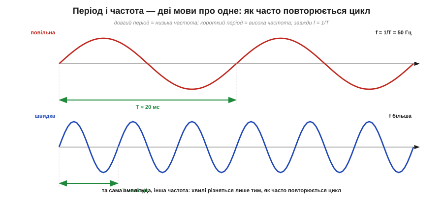
*Рис. 1.7.2.2. Дві хвилі однакової амплітуди, але різної частоти. У повільної цикл довгий (великий T) — отже, мало циклів за секунду (низька f). У швидкої цикл короткий (малий T) — багато циклів за секунду (висока f). Період і частота завжди обернені: f = 1/T.*

Зв'язок f = 1/T настільки тісний, що період і частота — це фактично один параметр, виражений у двох системах мір; який обрати, залежить від зручності. Про мережу кажуть «50 герц», бо число гарне; про швидкий цифровий імпульс — «20 наносекунд», бо так наочніше, ніж «50 мегагерц». Інженер вільно перестрибує між ними одним діленням.

**Приклад (туди й назад між T і f).** Звуковий сигнал має період T = 2.5 мс. Яка його частота? І навпаки — який період у несучої FM-радіо на 100 МГц?

```
f = 1/T = 1 / (2.5·10⁻³ с) = 400 Гц            ← звукова частота (нота «соль» десь там)
T = 1/f = 1 / (100·10⁶ Гц)  = 10·10⁻⁹ с = 10 нс ← один цикл радіохвилі триває 10 нс
```

Бачите масштаб: звукова хвиля повторюється сотні разів за секунду, а радіохвиля — сто мільйонів. Та сама формула, та сама фізика — лише числа з різних світів.

### Кутова частота ω: швидкість тієї самої стрілки

Лишився четвертий гість, який весь час крутився поряд у формулах §1.7.1, — **кутова частота** (*angular frequency*, ω). Навіщо вона, якщо вже є f? Згадаймо образ обертової стрілки-фазора: синус народжується як її проєкція. Частота f лічить **повні оберти** за секунду, але математиці синуса зручніше лічити не оберти, а **радіани** — бо саме в радіанах sin поводиться найпростіше. Один повний оберт — це 2π радіан. Тож якщо стрілка робить f обертів за секунду, то за секунду вона замітає 2πf радіан — і це й є кутова частота:

```
ω = 2π · f = 2π / T          [рад/с]
```

ω каже, **наскільки швидко крутиться фазор** у радіанах за секунду, тоді як f каже те саме в обертах за секунду. Множник 2π — це просто «скільки радіанів в одному оберті». У формулу синуса входить саме ω (бо аргумент синуса — кут у радіанах: sin(ωt)), а на приладах і в розмові частіше фігурує f (бо «герци» наочніші за «радіани за секунду»). Тому вираз сигналу можна писати двома еквівалентними способами, і обидва трапляються в літературі:

```
v(t) = Vm · sin(ω·t)  = Vm · sin(2π·f·t)  = Vm · sin(2π·t/T)
```

Усі три — та сама хвиля, лише горизонтальна вісь розмічена в радіанах (ω), у герцах (f) чи в частках періоду (T). Звикнути варто до всіх трьох: формули теорії кіл майже завжди пишуть через ω (так коротше), а технічні характеристики й покази приладів — через f.

### Де ці числа живуть: шкала частот

Щоб ці параметри не лишалися голими формулами, корисно відчути, **які частоти зустрічаються насправді** — від найповільніших коливань до найшвидших. Діапазон вражає: він тягнеться на багато порядків, і одне й те саме просте f = 1/T описує і повільне гойдання мережі, і шалене дрижання радіохвилі.

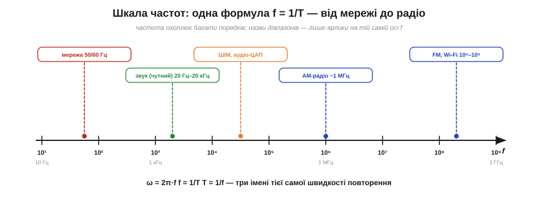
*Рис. 1.7.2.3. Частоти, з якими має справу електроніка, лягають на спільну вісь (масштаб логарифмічний — кожна поділка вдесятеро більша). Мережа — десятки герц; чутний звук — від 20 Гц до 20 кГц; керування потужністю (ШІМ) та звукові перетворювачі — кілогерци; радіо — від сотень кілогерц (AM) до гігагерців (Wi-Fi). Назви діапазонів — лише ярлики на тій самій осі f.*

Кілька орієнтирів, які варто тримати в голові. Мережа — **50 чи 60 Гц** (повільне, відчутне навіть на дотик гудіння). Звук, що його чує людина, — приблизно від **20 Гц до 20 кГц**; тому аудіотехніку проєктують саме на цю смугу. Керування яскравістю та обертами через швидке вмикання-вимикання працює на одиницях-десятках **кілогерців**. А радіо живе вже в **мегагерцях і гігагерцях**: AM-станції коло 1 МГц, FM і Wi-Fi — сотні мегагерців і гігагерці. Що вища частота, то коротший період і то «жвавіший» сигнал; і хоча фізика однакова, інженерні прийоми на 50 Гц і на 2.4 ГГц геть різні — бо на високих частотах починають важити речі, непомітні на низьких (це матеріал пізніших модулів).

> 🔧 **Навіщо це.** Частота — це не абстракція, а перше, що визначає, **як поводитися із сигналом**. Від неї залежить, який інструмент годиться (повільну хвилю видно й дешевим приладом, швидку — лише високочастотним), як швидко мусить встигати мікроконтролер, щоб її «зловити», і навіть чи полетить сигнал ефіром завадою. Замовляючи кварц для такту, ви задаєте f; обираючи частоту ШІМ, важите між чутним писком (низька f) і втратами на перемиканні (висока f); читаючи смугу підсилювача, дивитесь, до якої f він ще працює. Тому звичка одразу прикинути «а яка тут частота і період?» — це звичка одразу розуміти, у якому світі ви опинилися.

---

Підсумок §1.7.2: синусоїду без фази задають три зв'язані числа. **Амплітуда** Vₘ — висота від осі до піка; не плутати з **розмахом** Vₚₚ = 2·Vₘ і з **миттєвим** v(t). **Період** T — час одного повного циклу (в секундах і похідних), **частота** f — скільки циклів за секунду (в герцах), і вони обернені: f = 1/T. **Кутова частота** ω = 2πf — швидкість обертання фазора в радіанах за секунду, зручна для формул. Реальні частоти тягнуться від десятків герц (мережа) через кілогерци (звук, ШІМ) до гігагерців (радіо). Маючи цей словник «висоти й швидкості», переходимо до параметра, що описує **взаємне розташування** хвиль у часі, — до фази.

---

## 1.7.3 Фаза й зсув фаз

Амплітуда й частота, які ми щойно розібрали, описують одну хвилю — наскільки вона висока і як часто повторюється. Та в реальному колі хвиль майже завжди **дві або більше**: напруга й струм, вхід і вихід підсилювача, дві лінії шини, сигнал та його відлуння. І щойно хвиль стає кілька, виникає нове питання, на яке амплітуда з частотою відповісти не можуть: **як вони розташовані одна відносно одної в часі** — разом ідуть, чи одна попереду? На це відповідає останній параметр синусоїди — **фаза**. Без неї опис змінного струму неповний, а половина його найважливіших явищ (від потужності до резонансу) просто не існує.

Фаза — поняття, від якого спершу мружаться, бо воно нібито «про той самий синус, тільки трохи зсунутий». Та насправді саме фаза робить теорію змінного струму багатою. Розберемося спершу, що таке фаза в **однієї** хвилі, а тоді — найважливіше — що таке **зсув фаз** між двома.

### Фаза однієї хвилі: з якої точки циклу вона стартує

Повернімося до формули синуса з повним записом — у ній весь час сидів доданок, який ми досі лишали осторонь:

```
v(t) = Vm · sin(ωt + φ)
```

Той доданок φ (фі) і є **фаза** (точніше — **початкова фаза**, *phase*). Подивімося, що він робить. Аргумент синуса — це кут; ωt — кут, що рівномірно росте з часом (фазор крутиться), а φ — **стала добавка** до цього кута. Інакше кажучи, φ задає, **під яким кутом стрілка-фазор стояла в момент t = 0**, з якої точки свого циклу хвиля почала. При φ = 0 синус стартує з нуля й іде вгору. При φ = +90° (тобто +π/2) хвиля на старті вже на піку — а це рівно косинус. При φ = 180° (π) вона стартує з нуля, але йде вниз — дзеркальний синус. Тобто φ просто **зсуває всю хвилю** вздовж осі часу, не міняючи ні висоти, ні частоти.

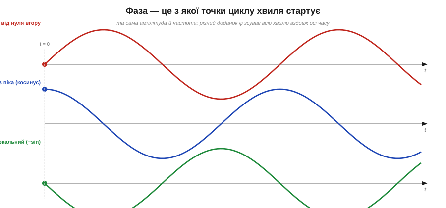
*Рис. 1.7.3.1. Той самий синус із різною початковою фазою φ. φ = 0 — стартує з нуля вгору; φ = +90° — стартує з піка (це косинус); φ = 180° — стартує з нуля, але вниз. Фаза не міняє ні амплітуди, ні частоти — лише посуває всю хвилю по горизонталі.*

Фазу міряють у тих самих одиницях, що й будь-який кут, — у **градусах** (повний цикл = 360°) або в **радіанах** (повний цикл = 2π). Чверть циклу — 90° або π/2, півцикла — 180° або π. Це природно: адже фаза — це кут обертового фазора, а цикл синуса і є один оберт. Тому й кажуть «зсунути на 90 градусів», маючи на увазі «на чверть періоду».

Сама по собі початкова фаза однієї-єдиної хвилі — річ доволі умовна: вона залежить лише від того, **звідки ми почали лічити час**. Зрушимо початок відліку — і φ зміниться, хоча хвиля та сама. Тому фаза однієї ізольованої хвилі майже не несе фізики. Уся сила поняття вмикається, коли хвиль **дві**.

### Зсув фаз: на скільки одна хвиля попереду іншої

Ось де народжується головне. Візьмімо дві синусоїди **однакової частоти** і покладімо їх на один графік. Якщо їхні початкові фази різні, одна хвиля виявиться зсунутою відносно іншої — її піки настають раніше або пізніше. Цю різницю й називають **зсувом фаз** (*phase shift*, *phase difference*, Δφ): це різниця початкових фаз двох хвиль, Δφ = φ₁ − φ₂.

І, на відміну від фази однієї хвилі, зсув фаз — річ **абсолютно реальна й від вибору початку відліку не залежна**. Зруште момент t = 0 — обидві фази зміняться **на однакову величину**, а їхня різниця лишиться тією самою. Зсув фаз каже об'єктивну річ: **наскільки одна хвиля випереджає (або відстає від) іншу**.


*Рис. 1.7.3.2. Дві синусоїди однакової частоти, зсунуті по фазі. Хвиля A проходить свої точки раніше — вона **випереджає** (*leads*); хвиля B настає пізніше — **відстає** (*lags*). Зсув можна міряти і як кут Δφ (тут 60°), і як час Δt між однаковими точками; вони зв'язані через період.*

Тут з'являються два слова, які треба засвоїти твердо, бо їх уживають на кожному кроці. Хвиля, чиї піки настають **раніше**, **випереджає** (*leads*) — вона «попереду». Хвиля, чиї піки настають **пізніше**, **відстає** (*lags*) — вона «позаду». Англійські lead і lag трапляються в даташитах і теорії постійно («current lags voltage by 90°» — струм відстає від напруги на 90°), тож варто звикнути до них одразу.

Зсув фаз можна виражати **двояко** — і це знову та сама річ двома мовами, як період і частота. Можна — **кутом** Δφ (у градусах чи радіанах): «зсунуті на 90°». А можна — **часом** Δt: «хвиля B настає на 5 мілісекунд пізніше». Зв'язує їх період: повний цикл — це 360° і водночас час T, тож частка циклу в кутах і в часі — одна:

```
Δφ / 360°  =  Δt / T          →          Δφ = 360° · (Δt / T)
```

Іншими словами, зсув у градусах — це просто частка періоду, виражена в градусах. Зсув на чверть періоду (Δt = T/4) — це 90°; на півперіоду (T/2) — 180°. Перехід «час ↔ градуси» через цю пропорцію — звичайна щоденна арифметика інженера.

**Приклад (від часу до градусів і назад).** Дві хвилі в мережі 50 Гц (T = 20 мс) зсунуті на Δt = 1.67 мс. На скільки градусів вони розійшлися? І навпаки — який часовий зсув дає 120°?

```
T = 1/50 = 20 мс
Δφ = 360° · (Δt/T) = 360° · (1.67/20)  ≈ 30°       ← часовий зсув у градусах
Δt = T · (Δφ/360°) = 20 мс · (120/360)  ≈ 6.67 мс  ← 120° у часі (третина періоду)
```

Зверніть увагу на 120°: це третина повного циклу. Саме на третину періоду зсунуті одна від одної три напруги в **трифазній** мережі (про неї згадували в §1.2.12) — три синусоїди, рознесені рівно на 360°/3 = 120°. Зсув фаз тут — не абстракція, а буквальна конструкція енергосистеми.

### Три зсуви, які треба впізнавати з першого погляду

Хоч зсув фаз буває яким завгодно, три його значення трапляються так часто й важать так багато, що їх варто впізнавати миттєво.

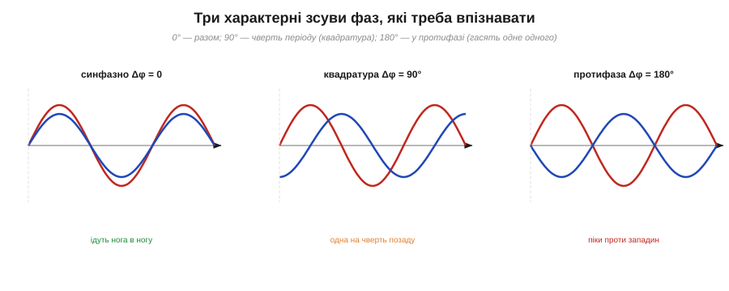
*Рис. 1.7.3.3. Три характерні зсуви. **0° (синфазно)** — піки збігаються, хвилі йдуть нога в ногу. **90° (квадратура)** — одна зсунута на чверть періоду; коли одна на піку, друга проходить нуль. **180° (протифаза)** — піки однієї проти западин іншої; складені, такі хвилі гасять одна одну.*

- **Зсув 0° — синфазно** (*in phase*). Хвилі піднімаються й опускаються разом, піки збігаються. Складені, вони підсилюють одна одну (амплітуди додаються).
- **Зсув 90° — квадратура** (*quadrature*). Одна хвиля рівно на чверть періоду попереду: коли перша на піку, друга саме проходить нуль. Це особливий, дуже важливий зсув — рівно таку чверть періоду дають конденсатор і котушка між струмом і напругою (чому — побачимо в наступних розділах, де ці елементи вивчають на змінному струмі). Назва «квадратура» — від латинського «чверть».
- **Зсув 180° — протифаза** (*anti-phase*, *out of phase*). Хвилі дзеркальні: пік однієї точно над западиною іншої. Складені, вони **гасять** одна одну — а якщо амплітуди рівні, гасять повністю, у нуль. На цьому стоїть, наприклад, активне гасіння шуму (навушники додають до зовнішнього звуку його ж протифазу).

Ці три випадки — як три ноти, з яких складається вся «гармонія» взаємодії хвиль: збіг, чверть зсуву й повна протилежність. Решта зсувів лежать десь поміж ними.

> 🔧 **Навіщо це.** Зсув фаз — не геометрична забаганка, а ключ до найважливіших речей у змінному струмі. По-перше, **потужність**: коли струм і напруга синфазні, прилад бере від мережі повну потужність; коли вони в квадратурі (90°), середня потужність — нуль, енергія лише гойдається туди-сюди, дарма гріючи дроти (це знаменитий «косинус фі» в електриці). По-друге, **зв'язок між сигналами**: вимірявши зсув фаз між входом і виходом, дізнаються, що коло робить із сигналом, і чи не «завертає» воно його настільки, що підсилювач почне самозбуджуватися. По-третє, **синхронізація**: щоб під'єднати генератор до мережі, його напругу спершу зводять з мережевою у фазу (зсув 0°), інакше — потужний удар. Тому фаза — це той параметр, повз який не пройде жоден серйозний розрахунок або налагодження кола змінного струму.

---

Підсумок §1.7.3: **фаза** φ у формулі v(t) = Vₘ·sin(ωt + φ) задає, з якої точки циклу стартує хвиля (під яким кутом стояв фазор при t = 0); міряють її в градусах (цикл = 360°) або радіанах (2π). Фаза однієї хвилі умовна (залежить від початку відліку), але **зсув фаз** Δφ між двома хвилями однакової частоти — об'єктивний: він каже, наскільки одна **випереджає** (*leads*) чи **відстає** (*lags*) від іншої. Зсув виражають кутом або часом, зв'язаними як Δφ = 360°·(Δt/T). Три ключові зсуви: 0° (синфазно, підсилюють), 90° (квадратура, чверть періоду), 180° (протифаза, гасять). Фаза — основа потужності, синхронізації й аналізу кіл. Тепер, знаючи всі параметри хвилі, можна нарешті відповісти на питання, що мучило ще з §1.2.12: яким **одним числом** чесно описати «силу» змінного струму.

---

## 1.7.4 Середнє й діюче значення (RMS)

Ось питання, яке нависало над усім розділом і вже зринало в §1.2.12: коли на розетці написано «230 вольтів», що це за число? Адже напруга там не стоїть на місці — вона коливається синусоїдою, щомиті інша: то нуль, то +325 В, то знову нуль, то −325 В. Жодне з цих миттєвих значень не дорівнює 230. То звідки взялися ці 230, і чому саме вони? Тут ми, нарешті, розберемося до дна — бо за цим простим числом стоїть напрочуд глибока ідея про те, як **чесно порівняти** мінливий змінний струм зі спокійним постійним.

Спокуса перша й очевидна — узяти **середнє** значення хвилі. Та з нею, як ми зараз побачимо, нічого не вийде, і саме її провал виведе нас на правильну відповідь.

### Чому просте середнє нікуди не годиться

Спробуймо усереднити синусоїду напруги за один період — додати всі миттєві значення й поділити на тривалість. І одразу впираємося в халепу: синусоїда **симетрична** відносно осі. Скільки часу вона проводить угорі (додатна), стільки ж — унизу (від'ємна), і відхилення дзеркальні. Тож додатна половина рівно гасить від'ємну, а середнє за повний період виходить **рівно нуль**:

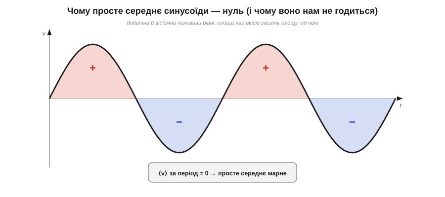
*Рис. 1.7.4.1. Просте середнє синусоїди за період — нуль: площа над віссю (додатні півхвилі) точно дорівнює площі під нею (від'ємні), і вони гасяться. Тому «середня напруга» розетки — нуль, хоча розетка справно гріє чайник. Середнє очевидно не описує «силу» змінного струму.*

І це не дивно — це навіть правильно: середній **перенесений заряд** за період справді нуль (про що ми вже казали в §1.2.12 — електрони лише гойдаються туди-сюди). Та як опис «сили» сигналу нуль безглуздий: розетка з «нульовою середньою» напругою чудово кип'ятить воду й палить пальці. Отже, проста середня величина проґавлює саму суть: змінний струм робить роботу обома півхвилями, а не сумарним зсувом заряду.

Можна спробувати латку — усереднити не сам сигнал, а його **модуль** (узяти всі значення додатними, ніби «перегнути» від'ємні півхвилі вгору). Це **середньовипрямлене** значення (*rectified average*), і воно вже не нуль. Для синусоїди воно виходить ≈ 0.637·Vₘ. Латка робоча, і деякі дешеві прилади міряють саме її. Та вона теж не та відповідь, по якій тужимо: вона не каже, скільки **корисної роботи** дає сигнал. А саме робота — тепло, потужність — нас і цікавить. Тож зайдемо з боку роботи.

### Правильна ідея: однаковий нагрів

Поставмо питання інакше — так, як його колись поставили інженери. Замість «яке в нього середнє?» спитаймо: **який постійний струм виділяв би стільки ж тепла, скільки цей змінний?** Ось це число — еквівалент за нагрівом — і буде чесною мірою «сили». Воно так і зветься — **діюче**, або **середньоквадратичне**, значення (*RMS, root-mean-square*; іноді кажуть «ефективне», *effective*).


*Рис. 1.7.4.2. Означення RMS через нагрів. Пропустіть змінний струм i(t) крізь резистор — він віддасть певне тепло за секунду. RMS-значення цього струму — це таке **постійне** I, яке у тому самому резисторі дало б **точнісінько стільки ж тепла**. Тому RMS — справедлива міра: вона прирівнює змінний струм до постійного за реальною роботою.*

Чому ключ саме нагрів? Бо тепло від струму **не залежить від напрямку**. Згадаймо з Розділу 1.3: потужність на резисторі P = I²·R — зі **квадратом** струму. А квадрат завжди додатний: і додатний струм, і від'ємний гріють однаково (мінус у квадраті зникає). Тому резистору байдуже, що струм змінний і міняє знак, — він гріється обома півхвилями. Це робить нагрів ідеальним «суддею»: він чесно складає внесок кожної півхвилі, не даючи їм погаситися, як гасилося середнє.

### Рецепт RMS: квадрат → середнє → корінь

Назва **root-mean-square** не випадкова — це буквально рецепт, і читати його треба **справа наліво**, у три кроки. Беремо сигнал і: підносимо до **квадрата** (*square*), знаходимо **середнє** цього квадрата (*mean*), а тоді добуваємо **корінь** (*root*). Простежимо, чому саме так і що на кожному кроці відбувається.

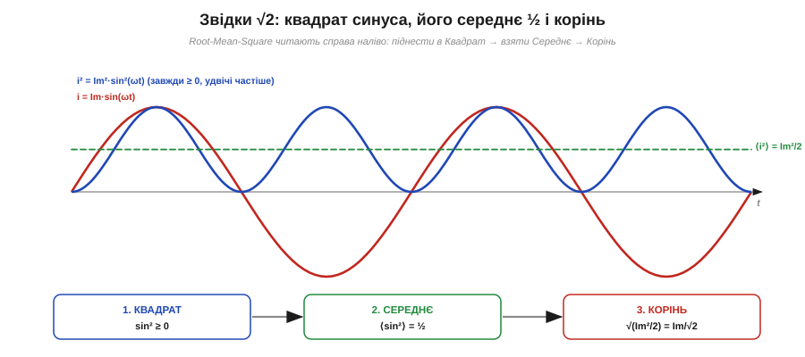
*Рис. 1.7.4.3. Три кроки RMS на прикладі синуса. (1) **Квадрат**: i² завжди ≥ 0 і коливається вдвічі частіше за i, біля свого середнього. (2) **Середнє**: у sin² середнє за період дорівнює рівно ½ (квадрат хвилі однаково часто буває вище й нижче половини). (3) **Корінь**: √(Iₘ²/2) = Iₘ/√2. Звідси й береться знаменитий множник √2.*

**Крок 1 — квадрат.** Підносимо миттєвий сигнал до квадрата. Цим ми, по-перше, прибираємо знак (усе стає додатним — як і нагрів), а по-друге, переходимо саме до тієї величини, що пропорційна потужності (бо P ∝ i²). Квадрат синуса, sin², — цікава крива: вона завжди невід'ємна, торкається нуля там, де синус проходив нуль, і коливається **вдвічі частіше** за вихідний синус, гойдаючись між 0 і Vₘ².

**Крок 2 — середнє.** Усереднюємо цей квадрат за період. Ось де ховається вся арифметика. Виявляється, середнє від sin² за період — рівно **½**. Інтуїтивно: квадрат синуса однаково часто буває вищим і нижчим за половину своєї висоти, тож «балансує» точно посередині. (Є й гарне формальне пояснення через тотожність sin²θ = (1 − cos2θ)/2: косинусний доданок за період усереднюється в нуль, лишається стале ½. Деталі цього виведення — окрема математична вставка до теми.) Отже, середнє від i² = Iₘ²·sin² дорівнює Iₘ²·½ = Iₘ²/2.

**Крок 3 — корінь.** Лишилося видобути корінь — щоб повернутися від «квадрата величини» назад до самої величини (тих самих вольтів чи амперів). Корінь із Iₘ²/2 і дає відповідь:

```
Mean (sin²)  = 1/2
Irms = √(Im²/2) = Im / √2 ≈ 0.707 · Im
```

Ось звідки той знаменитий множник: **для синусоїди RMS менший за амплітуду рівно в √2 разів** (√2 ≈ 1.414, а 1/√2 ≈ 0.707). Зверніть увагу — це справедливо **тільки для синуса**: інша форма хвилі (прямокутник, трикутник, пилка) дасть інший коефіцієнт, бо в неї інша «частка часу на висоті». Для чистого прямокутника, скажімо, RMS дорівнює самій амплітуді (він увесь час на повну), а для трикутника — Iₘ/√3.

### Числа розетки нарешті стають на місця

Тепер усе сходиться. «230 В» розетки — це **RMS-значення**: таке постійне, що грітиме навантаження так само, як ця синусоїда. А пік її помітно вищий — амплітуда більша за RMS у √2:

```
Vm = Vrms · √2 = 230 · 1.414 ≈ 325 В      ← справжній пік мережі
```

Звідси те саме практичне попередження, що й у §1.2.12: «230 вольтів» означають реальні **325 вольтів** у піку, і саме на них (з запасом) мусить бути розрахована ізоляція й деталі. Прилади ж — мультиметр у режимі AC, вольтметри на щитку — показують саме RMS, бо це число, по якому рахують потужність і яке відповідає «силі» струму.

**Приклад (повний набір чисел синусоїди).** Синусоїдальна напруга має амплітуду Vₘ = 10 В. Знайдемо її розмах, діюче й середньовипрямлене значення.

```
Vpp  = 2 · Vm            = 20 В          ← розмах від піка до піка
Vrms = Vm / √2 = 10/1.414 ≈ 7.07 В       ← діюче (по ньому рахують потужність)
Vavg = 0.637 · Vm         ≈ 6.37 В       ← середньовипрямлене (модуль, усереднений)
```

Три різні числа з однієї хвилі — і кожне відповідає на своє питання: Vₚₚ міряють оком на екрані, Vᵣₘₛ підставляють у P = V²/R, а середньовипрямлене дає простий випрямляч. Не сплутати їх — половина грамотності у змінному струмі.

### Коефіцієнти форми й піка — і чому дешевий прилад бреше

Два сталі відношення між цими числами мають назви, бо їх корисно тримати в голові. **Коефіцієнт форми** (*form factor*) — це RMS поділити на середньовипрямлене; для синуса 0.707/0.637 ≈ 1.11. **Коефіцієнт піка** (*crest factor*) — амплітуда поділити на RMS; для синуса √2 ≈ 1.41. Ці коефіцієнти **залежать від форми** хвилі, і саме тут чигає підступ.

Багато дешевих мультиметрів насправді **не вміють** рахувати RMS чесно (квадрат-середнє-корінь — недешева операція). Вони міряють легке середньовипрямлене значення, а тоді просто **множать його на 1.11** — той самий коефіцієнт форми синуса — і показують результат як «RMS». На чистій синусоїді мережі це працює бездоганно. Та подайте на такий прилад **несинусоїдальний** сигнал — спотворений струм, прямокутник, імпульси від регулятора потужності, — і прилад збреше: адже множник 1.11 справедливий лише для синуса, а в іншої форми коефіцієнт інший. Прилад, що чесно проганяє сигнал через усі три кроки незалежно від форми, маркують **True RMS** (істинне RMS) — і коштує він дорожче недарма.

> ⚙️ Як саме прилад (чи мікроконтролер) рахує True RMS на потоці відліків — квадрат кожного семпла, ковзне середнє, корінь — і **наскільки** бреше «середньовипрямлений × 1.11» на несинусоїді, докладно розбирає вставка [True RMS у приладі: квадрат → середнє → корінь](proj-true-rms.md).

> 🧮 А звідки строго береться те «середнє від sin² = ½» і множник √2 — з тотожності sin²θ = (1 − cos2θ)/2 — виводить математична вставка [Звідки √2: середнє від sin² за період](math-rms-derivation.md).

> 🔧 **Навіщо це.** RMS — це число, яким змінний струм увіходить у всі енергетичні розрахунки. Потужність на резисторі рахують саме через RMS: P = Vᵣₘₛ²/R = Iᵣₘₛ²·R — підставивши амплітуду замість RMS, помилитеся вдвічі. Запобіжник, переріз дроту, нагрів навантаження — усе визначає RMS-струм, а не піковий. Водночас **ізоляцію й пробивні напруги** рахують по **піку** (Vₘ = √2·Vᵣₘₛ), бо саме пік «продавлює» діелектрик. А вибираючи мультиметр, пам'ятайте про True RMS: якщо доведеться міряти щось хитріше за чисту синусоїду (струм через регулятор, імпульсний блок живлення), звичайний прилад покаже неправду. Коротко: **гріє і працює — RMS, пробиває ізоляцію — пік**.

---

Підсумок §1.7.4: щоб описати «силу» змінного струму одним числом, **просте середнє не годиться** — для синуса воно нуль (півхвилі гасяться). Правильна міра — **діюче, або середньоквадратичне, значення (RMS)**: таке постійне значення, що дає в резисторі **той самий нагрів**. Рахують його за рецептом *root-mean-square* (справа наліво): **квадрат** сигналу (прибирає знак, дає потужність) → його **середнє** (для sin² це ½) → **корінь**. Звідси для синуса Vᵣₘₛ = Vₘ/√2 ≈ 0.707·Vₘ; тому «230 В» розетки — це RMS, а пік ≈ 325 В. Множник √2 — лише для синуса; інша форма дає інший коефіцієнт, через що дешевий (не-True-RMS) прилад бреше на несинусоїді. Потужність і нагрів рахують по RMS, ізоляцію — по піку. Тепер подивимося, як усі ці числа — амплітуду, період і RMS — побачити й зміряти на живому приладі, осцилографі.

---

## 1.7.5 Синусоїда на осцилографі

Дотепер синусоїда жила в нас на папері — формула, графік, числа. Та інженер бачить її щодня **очима**, на екрані **осцилографа**. З цим приладом ми вже знайомі: у §1.6.7 ми розібрали, що осцилограф малює напругу як графік у часі (вертикаль — вольти, горизонталь — час), що масштаб осей задають ручки «В/поділка» й «час/поділка», а нерухомою картинку робить **тригер**. Тепер настав час навести цей прилад саме на синусоїду — головну героїню розділу — і навчитися знімати з екрана всі ті параметри, які ми щойно ввели: амплітуду, період, частоту, RMS і навіть зсув фаз. Це місток між теорією хвилі й живим стендом: усе, про що ми міркували абстрактно, осцилограф показує наочно, клітинку за клітинкою.

Чому саме синус — добрий навчальний приклад? Бо він простий і впізнаваний, бо саме його дає **генератор сигналів** (перший прилад, який під'єднують до входу, щоб потренуватися), і бо на ньому видно всі три «виміри» хвилі одразу: висоту, ширину циклу й — коли каналів два — фазовий зсув. Опанувавши читання синуса, далі ви читатимете будь-яку форму.

### Зчитати амплітуду й період із клітинок

Головний прийом ми вже знаємо з §1.6.7: усе на екрані рахують **у поділках** (клітинках сітки) і множать на масштаб. Для синуса це виходить особливо чисто.

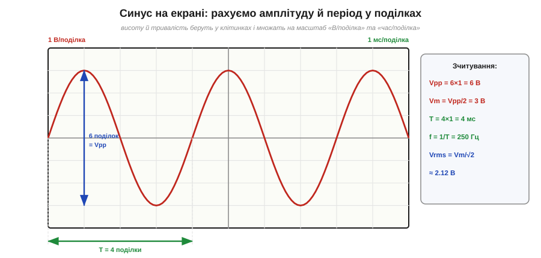
*Рис. 1.7.5.1. Зчитування синуса з сітки. По вертикалі: повна висота хвилі — 6 поділок, при «1 В/поділка» це розмах Vₚₚ = 6 В, отже, амплітуда Vₘ = 3 В. По горизонталі: один повний цикл займає 4 поділки, при «1 мс/поділка» це період T = 4 мс, звідки частота f = 1/T = 250 Гц. А діюче з амплітуди: Vᵣₘₛ = Vₘ/√2 ≈ 2.12 В.*

Робимо це по кроках. **Висота.** Найзручніше зміряти повний розмах — від нижнього піка до верхнього: порахували клітинки по вертикалі (на рисунку — 6) і помножили на «В/поділка» (1 В) — маємо Vₚₚ = 6 В. Амплітуда вдвічі менша: Vₘ = Vₚₚ/2 = 3 В (пам'ятаємо §1.7.2 — не сплутати їх!). **Ширина.** Тепер беремо один **повний цикл** — від гребеня до наступного гребеня (або від переходу через нуль до наступного в тому самому напрямку, як радили в §1.7.2): порахували клітинки по горизонталі (4) і помножили на «час/поділка» (1 мс) — маємо період T = 4 мс. **Частота.** Її прилад прямо не показує — її **рахують** за вже знайомою формулою f = 1/T = 1/0.004 = 250 Гц.

Дрібна, але корисна порада зі зчитування: міряти **повні** величини — повний розмах і повний цикл — і ставити їх так, щоб вони займали **багато** клітинок. Що більший шматок екрана займає те, що міряєте, то менша відносна похибка ока. Якщо хвиля дрібна — додайте «В/поділка» чутливості; якщо в період влазить пів екрана зморщок — розтягніть розгортку.

### Отримати RMS з того, що видно

А де ж на екрані діюче значення? Прямо — ніде: осцилограф малює **миттєвий** сигнал, а RMS — це похідна від форми величина. Та для **синуса** його легко отримати з амплітуди, яку ми щойно зняли, — просто поділивши на √2 (§1.7.4):

```
Vrms = Vm / √2 = 3 / 1.414 ≈ 2.12 В
```

І тут — важливе застереження, що зшиває §1.7.4 з практикою. Ця формула Vₘ/√2 чинна **тільки якщо хвиля справді синусоїдна**. Осцилограф дає вам безцінну перевагу перед мультиметром: він **показує форму** і дозволяє переконатися, що перед вами чистий синус, а не спотворений сигнал. Якщо на екрані синусоїда з обрізаними верхівками чи горбата хвиля — ділити амплітуду на √2 вже не можна (вийде брехня, як і в дешевого мультиметра з §1.7.4). Сучасні цифрові осцилографи, до речі, часто вміють рахувати True RMS самі (пункт меню «measure»), чесно проганяючи кожен відлік через квадрат-середнє-корінь незалежно від форми, — і це найнадійніший шлях. Та коли під рукою аналоговий чи простенький прилад, ланцюжок «зміряв амплітуду оком → переконався, що це синус → поділив на √2» працює бездоганно.

### AC чи DC на вході: де сяде хвиля зі зміщенням

У §1.6.7 ми згадували, що вхід осцилографа має режими **AC / DC / GND**. На синусоїді стає особливо наочно, навіщо вони, — тож розберімо це тут. Часто корисний сигнал — це **мала синусоїда, що «сидить» на сталому постаменті**: скажімо, пульсації в кілька мілівольтів поверх живлення 5 В, або звуковий сигнал поверх постійного зміщення. Як осцилограф це покаже — залежить від вхідного режиму.

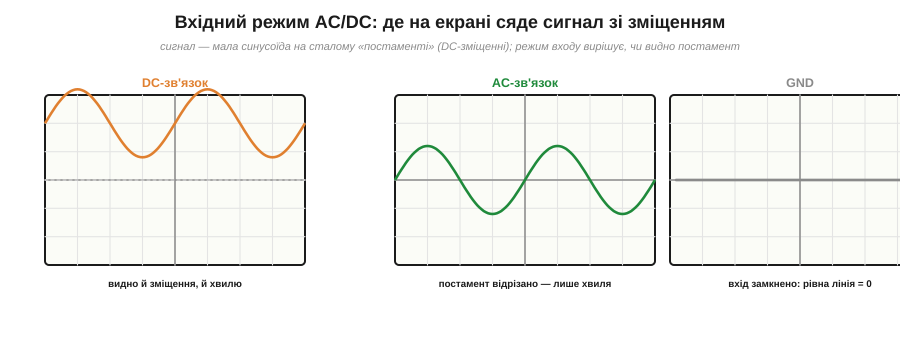
*Рис. 1.7.5.2. Та сама мала синусоїда на сталому зміщенні в трьох режимах входу. **DC-зв'язок** пропускає все — видно й постамент (зміщення), і хвилю на ньому. **AC-зв'язок** відрізає сталу складову (постамент) — лишається сама хвиля, яку тепер можна розтягнути по вертикалі й роздивитися. **GND** замикає вхід на нуль — рівна лінія показує, де на екрані «нуль вольт».*

Три режими роблять ось що. **DC-зв'язок** (*DC coupling*) пропускає сигнал як є — і сталу складову, і змінну. Це чесна повна картина: видно, що хвиля піднята, скажімо, на 5 В. Та якщо постамент великий, а хвиля дрібна, доведеться так зменшити чутливість, що хвилі майже не буде видно. **AC-зв'язок** (*AC coupling*) ставить на вході конденсатор, який **відрізає сталу складову** й пропускає лише змінну — постамент зникає, хвиля «осідає» на центр екрана, і тепер її можна розтягнути по вертикалі й роздивитися дрібні деталі (саме так дивляться пульсації на лінії живлення). **GND** (*ground*) від'єднує вхід і показує рівну лінію — нею перевіряють, де на екрані рівень нуля, перш ніж міряти. Те, що AC-зв'язок прибирає сталу складову, — пряме застосування ідеї §1.2.12 про DC і AC складові сигналу: конденсатор пропускає змінне, тримає постійне (механізм цього — у наступних розділах про конденсатор на змінному струмі).

### Бачити зсув фаз: дві хвилі на двох каналах

Нарешті — те, заради чого осцилограф особливо цінний і чого мультиметр не вміє в принципі. У §1.6.7 ми відзначили, що осцилограф має **два (або більше) канали** і може показати дві хвилі водночас. Для змінного струму це вікно у **фазу** (§1.7.3): поклавши на екран дві синусоїди однакової частоти, ви прямо **бачите**, наскільки одна зсунута відносно іншої.

Робиться це так. Подаємо обидва сигнали на два канали, синхронізуємо тригер по одному з них (щоб картинка стояла), — і на екрані дві хвилі. Тепер міряємо **часовий зсув** Δt між їхніми однаковими точками (скажімо, між сусідніми переходами через нуль угору) — у клітинках, помножених на «час/поділка». А тоді переводимо час у градуси за формулою §1.7.3, бо повний період ми теж бачимо на екрані:

```
Δφ = 360° · (Δt / T)
```

**Приклад (зсув фаз із екрана).** На двох каналах — дві синусоїди. Період кожної T = 8 поділок, а зсув між їхніми переходами через нуль — Δt = 1 поділка. Який зсув фаз?

```
Δφ = 360° · (Δt / T) = 360° · (1 / 8) = 45°
```

Одна поділка зсуву на восьми поділках періоду — це 45°. Так, не маючи жодної формули самого кола, прямо з екрана дістають фазовий зсув між входом і виходом — а він, як ми знаємо з §1.7.3, каже найважливіше про те, що коло робить із сигналом. Це щоденний прийом налагодження: подати синус на вхід, дивитися вхід і вихід на двох каналах і читати, як змінилися амплітуда й фаза.

> 🔧 **Навіщо це.** Осцилограф — це очі інженера у світі змінного струму, і синус — перше, що цими очима вчаться бачити. Практичний порядок дій варто завчити: налаштувати тригер (інакше хвиля «біжить», §1.6.7) → обрати вхідний режим (DC, щоб бачити зміщення; AC, щоб роздивитися дрібну хвилю на великому постаменті) → зчитати Vₚₚ і період у поділках → порахувати f = 1/T і, переконавшись, що це чистий синус, Vᵣₘₛ = Vₘ/√2. А коли треба фаза — два канали й Δφ = 360°·Δt/T. Цей набір рухів покриває величезну частку реального налагодження: від перевірки пульсацій живлення до вимірювання, що підсилювач робить із сигналом. Мультиметр скаже «скільки», осцилограф — «якої форми, як швидко й наскільки зсунуто».

---

Підсумок §1.7.5: осцилограф (знайомий із §1.6.7) показує синусоїду наочно, і з його сітки знімають усі її параметри. **Розмах** Vₚₚ — повна висота в поділках × «В/поділка»; амплітуда Vₘ = Vₚₚ/2. **Період** T — один повний цикл у поділках × «час/поділка»; **частоту** рахують як f = 1/T. **RMS** для синуса — Vₘ/√2, але лише переконавшись по формі, що хвиля справді синусоїдна (інакше — функція True RMS приладу). Режим входу: **DC** показує й сталу складову, **AC** відрізає постамент і лишає саму хвилю, **GND** дає лінію нуля. На **двох каналах** видно **зсув фаз**: Δφ = 360°·(Δt/T). Лишилося замкнути розділ великим питанням, до якого ми поверталися знов і знов: чому світова мережа взагалі змінна — поглибимо відповідь §1.2.12.

---

## 1.7.6 Чому мережа змінна: транспорт енергії

Ми вже двічі торкалися цього питання. У §1.2.12 пролунала коротка відповідь: мережа змінна, бо змінну напругу легко перетворює **трансформатор** — підвищує для передачі, знижує для споживача, — а постійну тоді так перетворювати не вміли. А в §1.7.1 ми побачили, **чому** ця змінна напруга саме синусоїдна: її дають обертові генератори. Тепер, маючи весь апарат розділу — RMS, потужність, форму хвилі, — повернімося до питання й розберемо його глибше: не просто «бо трансформатор», а **чому без трансформації передати енергію на великі відстані фізично неможливо** і яку саме перешкоду долає підвищення напруги. Це поглиблення §1.2.12 — від короткого факту до кількісного механізму.

Питання, нагадаємо, було слушне й гостре. Уся ж електроніка — мікросхеми, процесори, телефони — працює на **постійному** струмі; кожен пристрій усередині перетворює мережеву змінну напругу назад на постійну. То навіщо взагалі городити змінну мережу, якщо споживачеві потрібна постійна? Чому не передавати одразу постійний струм? Відповідь криється не в споживачі, а в **дорозі** від станції до розетки — у сотнях кілометрів дроту.

### Ворог далекої передачі — опір дроту

Уявімо, що енергію треба доправити від електростанції до міста за сотню кілометрів. Дроти — мідні чи алюмінієві, чудові провідники, — та на такій довжині навіть їхній малий опір складається в помітну величину (згадаймо Розділ 1.3: опір росте з довжиною). І щойно дротом тече струм, цей опір **гріється**, безповоротно з'їдаючи частину переданої потужності. Ключове — за яким законом ці втрати ростуть. З Розділу 1.3 ми знаємо потужність, що виділяється на опорі R, яким тече струм I:

```
P_втрат = I² · R
```

Зверніть увагу на **квадрат струму**. Це і є серце всієї історії. Втрати в дротах залежать не від напруги передачі, а від **струму** — і то квадратично. Подвоїте струм — втрати вчетверо; зменшите струм удесятеро — втрати впадуть у **сто** разів. А опір дроту R — заданий (його не змінити, не потовщивши й не вкоротивши лінію). Отже, єдиний спосіб різко зрізати втрати в лінії — гнати по ній **якомога менший струм**.

### Хитрість: та сама потужність — або великим струмом, або високою напругою

Але як передати велику потужність малим струмом? Тут і спрацьовує друга формула, теж із Розділу 1.3, — потужність як добуток напруги на струм:

```
P = U · I
```

Одну й ту саму потужність P можна доставити **двома різними способами**: або помірною напругою й великим струмом, або високою напругою й малим струмом — бо важить лише їхній добуток. А оскільки втрати залежать тільки від струму (квадратично!), вибір очевидний: треба **підняти напругу** якомога вище, тоді струм для тієї самої потужності впаде, а з ним обвалом — і втрати.

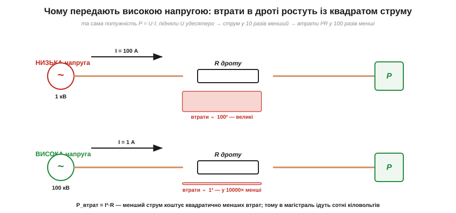
*Рис. 1.7.6.1. Та сама потужність двома способами. Угорі — низька напруга, тож великий струм (100 А); втрати ∝ 100². Унизу — піднята вдесятеро напруга, тож струм у 10 разів менший (1 А); втрати ∝ 1². Оскільки втрати йдуть із квадратом струму, передача високою напругою коштує у 100 разів менших утрат у дротах. Тому магістральні лінії несуть сотні кіловольтів.*

Покажемо силу цього на числах — вона вражає.

**Приклад (виграш від підвищення напруги).** Треба передати потужність P = 100 кВт лінією, опір якої R = 10 Ом. Порівняймо передачу при 1 кВ і при 100 кВ.

```
Варіант А — 1 кВ:
  струм   I = P/U = 100 000 / 1 000   = 100 А
  втрати  P_втрат = I²·R = 100² · 10   = 100 000 Вт = 100 кВт  (!!)
  → втрачаємо в дротах УСЮ потужність — передача безглузда

Варіант Б — 100 кВ (та сама потужність):
  струм   I = P/U = 100 000 / 100 000 = 1 А
  втрати  P_втрат = I²·R = 1² · 10     = 10 Вт
  → втрачаємо 10 Вт зі 100 000 — мізер (0.01 %)
```

Різниця приголомшлива: підняли напругу в 100 разів — струм упав у 100 разів — а втрати впали в **100² = 10 000** разів, із цілковито з'їденої потужності до незначних десятків ватів. Ось чому магістральні лінії електропередачі несуть **сотні кіловольтів**: це не примха, а єдиний фізичний спосіб доправити енергію далеко, не спаливши її дорогою в самих дротах. Без підвищення напруги далека передача просто неможлива.

### Чому це означає саме змінний струм

Отже, передавати треба **високою напругою**, а споживати — **низькою й безпечною** (у розетці 230 В, а не 100 000). Значить, напругу треба двічі **перетворити**: круто підняти на виході станції й знизити перед містом і будинком. І ось тут постійний струм програє начисто, а змінний — виграє.

Бо перетворити рівень **змінної** напруги вміє напрочуд простий, надійний і майже без втрат пристрій — **трансформатор** (*transformer*). Він працює саме на тому, що напруга **змінюється** в часі (на сталій постійній він просто не діє — чому, докладно побачимо в Розділі про котушки й трансформатори, бо в основі лежить електромагнітна індукція, та сама, що дала синус генератора в §1.7.1). Через це ланцюг від станції до розетки виглядає як кілька трансформаторних сходинок:


*Рис. 1.7.6.2. Шлях енергії — це сходинки напруги. Генератор дає помірні кіловольти; підвищувальний трансформатор піднімає їх до сотень кіловольтів для далекої лінії (малий струм, малі втрати); наприкінці знижувальні трансформатори опускають напругу — спершу до розподільчих кіловольтів, тоді до безпечних 230 В у домі. Кожну сходинку робить трансформатор — а він працює лише на змінному струмі.*

Саме ця **легкість перетворення** і зробила світову мережу змінною. Постійний струм у часи «війни струмів» (її драматичну історію згадано в §1.2.12) трансформувати не вміли взагалі — тож із ним кожне місто довелося б живити з електростанції чи не на сусідній вулиці, бо передати далеко низьку напругу неможливо, а підняти її було нічим. Змінний струм цю стіну обходив одним пристроєм — і переміг.

Тут варто бути чесним і не впадати в спрощення «AC завжди кращий». Перевага AC — саме й тільки в **легкості перетворення напруги** заради передачі. У самій передачі високою напругою постійний струм навіть **кращий** за змінний (у нього немає ні «реактивних» втрат, ні складнощів із синхронізацією) — і сьогодні наддалекі магістралі часом будують саме постійними, **HVDC**. Та можливим це стало лише тоді, коли навчилися дешево перетворювати рівень постійної напруги силовою електронікою (це вже зовсім інша, пізніша техніка). У XIX же столітті, коли закладали мережу, єдиним перетворювачем напруги був трансформатор — а він вимагає змінного струму. Тому світ і став на змінний, і досі переважно на ньому.

> 🔧 **Навіщо це.** Це поглиблення пояснює, чому світ влаштований так, як він влаштований, — і дає кілька твердих практичних висновків. По-перше, **високовольтні лінії смертельно небезпечні** саме тому, що несуть сотні кіловольтів; повага до них — питання життя. По-друге, у кожному пристрої сидить **блок живлення**, що знижує мережеву напругу й випрямляє її на потрібну приладу постійну, — і саме він є місток між «мережею змінною» і «електронікою постійною» (§1.2.12). По-третє, розуміння «втрати ∝ I²·R» працює не лише в енергетиці: усюди, де тече великий струм — у дротах живлення плати, у роз'ємах, у доріжках, — вигідно тримати струм меншим (а напругу, де можна, вищою), бо нагрів і просадка ростуть зі струмом. Це той самий закон, що жене напругу в магістраль на сотні кіловольтів, лише в мініатюрі вашого пристрою.

---

Підсумок §1.7.6 (поглиблення §1.2.12): мережа змінна не заради споживача (тому потрібна постійна напруга), а заради **транспорту енергії на відстань**. Втрати в дротах ідуть із **квадратом струму** (P_втрат = I²·R), тож щоб не спалити потужність дорогою, лінією треба гнати **малий струм**. Ту саму потужність (P = U·I) при малому струмі дає **висока напруга** — тому магістраль несе сотні кіловольтів, а виграш у втратах квадратичний (підняли U в 100× → втрати в 10 000× менші). Перетворювати ж рівень напруги легко й надійно вміє **трансформатор**, який працює **тільки на змінному струмі** (через електромагнітну індукцію — основу синуса генератора з §1.7.1). Тому світ і став на AC; постійний струм у самій передачі навіть кращий (HVDC), та потребує складної силової електроніки, якої в часи закладання мережі не існувало. Закон «втрати ∝ I²·R» працює й у мініатюрі будь-якого пристрою.

> ▶️ Далі: [Розділ 1.8 — Магнетизм і електромагніти](../magnetism/magnetism.md)
