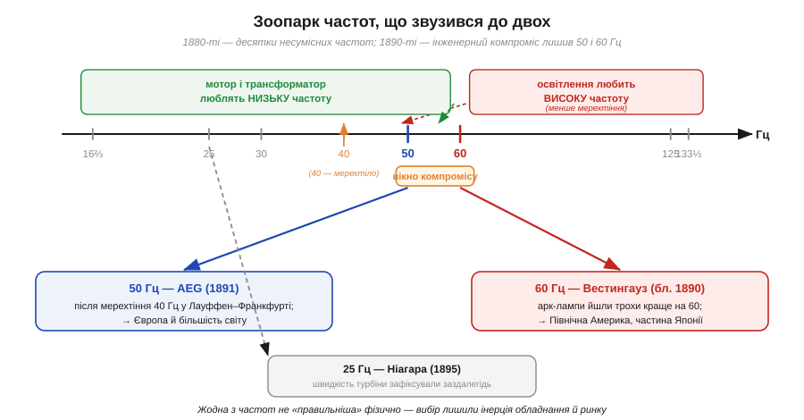
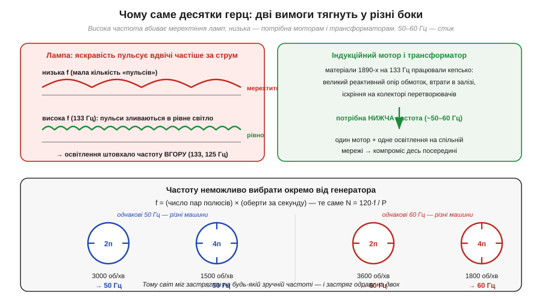

# 📜 Чому 50 і 60 Гц: як світ розколовся на дві частоти

> Історична вставка до теми [§1.7.2 «Амплітуда, період, частота»](ac-signals.md). У §1.7.2 ми навчилися читати частоту синусоїди як число циклів за секунду й побачили, що в розетці воно дорівнює 50 герцам — а в частині світу 60. Звідки взялися саме ці два числа? Чому не одне на всіх, не 45 і не 100? Відповідь — не у фізиці й не в красивій математиці, а в історії: у боротьбі ламп із мерехтінням, моторів із матеріалами своєї доби та компаній за ринок. І, що важливо, навколо цих двох чисел наросло чимало гарних, але хибних легенд — їх ми теж розберемо.

---

## Спершу — чому взагалі є якесь «число герц»

У §1.7.1 ми побачили: мережева напруга синусоїдна тому, що її виробляють **обертові генератори**, а частота — це просто швидкість їхнього обертання, переведена в герци. Тут ховається перша, найважливіша думка всієї цієї історії: **частоту не можна вибрати окремо від машини, що крутиться**. Вони зчеплені жорстко.

Генератор наводить один повний період синусоїди за кожен прохід пари полюсів (північ-південь) повз обмотку. Тож якщо ротор має P полюсів (тобто P/2 пар) і обертається N обертів за хвилину, частота виходить така:

```
f = (P/2) · (N/60)          ⇔          N = 120·f / P
```

Звідси видно весь простір вибору. Парова машина чи водяна турбіна кінця XIX століття крутилися у вузькому діапазоні обертів — сотні за хвилину. Щоб із таких обертів дістати високу частоту, потрібно багато полюсів (громіздкий, дорогий ротор); щоб дістати низьку — мало. **Будь-яке «зручне» число герц одразу диктувало конструкцію генератора** — і навпаки. Саме через це зчеплення одного з одним світ зрештою застиг не на якійсь фізично «правильній» частоті (такої немає), а на кількох історично зручних — і вже не зміг із них зійти.


*Рис. 1.7.2i.1. У 1880-х кожна фірма ставила свою частоту — від 16⅔ до 133⅓ Гц. Дві вимоги тягнули в різні боки: освітлення хотіло високої частоти (менше мерехтіння), а мотори й трансформатори — низької. Компроміс ліг у вузьке вікно, і ринок зупинився одразу на двох його краях: Європа на 50 Гц (AEG), Америка на 60 Гц (Вестингауз). 25 Гц Ніагари — окрема гілка, нав'язана наперед заданою швидкістю турбіни.*

## Зоопарк частот: коли стандарту не було

Перш ніж світ застиг на двох числах, він устиг перебрати безліч інших. У перші роки змінного струму ніякого стандарту не існувало й близько: кожна компанія, кожна станція ставила ту частоту, яка зручно випадала з її генераторів. Документовані системи працювали на **частотах від 16⅔ до 133⅓ герца** — величезний розкид. Числа на кшталт 133⅓ виглядають дивно, поки не згадати формулу: типовий генератор тих років мав 8 полюсів і крутився близько 2000 об/хв, а це й дає (8/2)·(2000/60) ≈ 133 Гц. Частота була не метою, а **побічним наслідком** того, як крутилося залізо.

Чому ж раннє освітлення тягнулося до таких **високих** частот? Через мерехтіння. Нитка лампи (та й дуга в дугових лампах) трохи охолоджується на кожному напівперіоді, коли струм проходить через нуль, — і яскравість пульсує. Причому пульсує вона **вдвічі частіше за струм**: нитка світить найяскравіше на обох піках струму — і додатному, і від'ємному (бо нагрів не залежить від напрямку струму), а провисає на кожному переході через нуль, тобто двічі за період. На низькій частоті це помітне мерехтіння, що втомлює око. Чим вища частота, тим частіші пульсації й тим повніше їх згладжує теплова інерція нитки та інерція зору — світло здається рівним. Тому інженери освітлення радо ставили 125, 133 герца: лампи світили спокійно.

> 🔧 **Навіщо це.** Та сама фізика жива й досі. Світлодіодна лампа чи підсвітка монітора, живлені від мережі, пульсують яскравістю на подвоєній частоті мережі (100 чи 120 Гц). Дешеві драйвери це мерехтіння пропускають — і воно ловиться боковим зором або виступає «стробоскопом» на відео. Розуміючи, що пульсація світла йде на **подвоєній** частоті мережі (бо око не розрізняє знак струму), ви відразу знаєте, де шукати причину тремтливого світла й на якій частоті її давити фільтром.

## Дві вимоги, що тягнуть у різні боки

Усе б лишилося на високих частотах, якби світло було єдиним споживачем. Та наприкінці 1880-х на сцену вийшов **двигун змінного струму** — насамперед асинхронний (індукційний) мотор, ідею якого незалежно подали Нікола Тесла (*Nikola Tesla*) і Галілео Ферраріс (*Galileo Ferraris*). І мотор зажадав протилежного: **низької** частоти.

Причина — у матеріалах тієї доби. Обмотки мають індуктивність, і що вища частота, то більший їхній реактивний опір — струму важче протиснутися. Залізні осердя на високій частоті сильно гріються вихровими струмами й перемагнічуванням (ті самі втрати на гістерезис, які виміряв Штейнмец, — див. історію розділу). Колекторні (комутаторні) машини на високій частоті ще й нестерпно іскрять. Підсумок був твердий: **індукційний мотор добре працював близько 50–60 Гц, але на 133 Гц матеріали 1890-х уже не давали його збудувати пристойно**.


*Рис. 1.7.2i.2. Серце вибору — компроміс. Ліворуч: лампа пульсує на подвоєній частоті, тож висока частота згладжує мерехтіння — освітлення штовхало вгору. Праворуч: індукційний мотор і трансформатор на матеріалах 1890-х на 133 Гц працювали кепсько (реактивний опір, втрати в залізі, іскріння) — це штовхало вниз. Унизу — головна причина незворотності: частоту задає сам генератор (f = пари полюсів × оберти за секунду), тож щойно обрану частоту втілили в тисячах машин, зійти з неї стало майже неможливо.*

Ось вона, серцевина всієї історії. Зійшлися дві суперечливі вимоги: **освітлення тягло частоту вгору** (геть від мерехтіння), **мотор і трансформатор тягли вниз** (де живі матеріали). А ставити дві окремі мережі — одну для світла, другу для моторів — нікому не хотілося: це подвійні дроти, подвійні станції, подвійні гроші. Потрібна була **одна** частота, на якій і лампа світить пристойно, і мотор крутиться. Така частота лежала у вузькому вікні десь між 40 і 70 герцами — і саме в ньому світ зрештою й завмер. Лишалося питання: на якому **краї** вікна.

## 60 Гц: вибір Вестингауза й чесні слова Бенджаміна Ламме

В Америці відповідь дала компанія **Westinghouse**. Близько 1890 року її інженери, шукаючи єдину частоту для світла й моторів, зупинилися на **60 герцах**. Документована причина напрочуд приземлена: наявне на той час **дугове освітлення працювало трохи краще на 60 Гц**, а ця частота була вже достатньо низькою, щоб витягнути й індукційний мотор. Не магія й не математична елегантність — просто частота, на якій більш-менш мирилися обидва головні споживачі.

Найцінніше свідчення лишив сам інженер Westinghouse **Бенджамін Ґарвер Ламме** (*Benjamin Garver Lamme*), який згодом описав цей вибір у спогадах. За його словами, **60 Гц були саме компромісом**, а не оптимумом. Вищі частоти, як-от 125 чи 133 Гц, для моторів і обертових перетворювачів того часу вже не годилися; нижчі тягли за собою помітне мерехтіння ламп і вимагали громіздкіших, багатополюсних генераторів за тодішніх обертів машин. 60 Гц лягали посередині — досить високо для світла, досить низько для моторів і перетворювачів. Свідчення Ламме цінне саме своєю тверезістю: воно не приписує числу «60» жодної надприродної переваги, а чесно називає його зваженим інженерним компромісом своєї доби.

Тут варто одразу розвіяти поширену легенду — **нібито «60 Гц вибрали через Теслу»**. Це спрощення *(перевірити в кожному переказі)*. Так, асинхронний мотор Тесли, ліцензований Westinghouse 1888 року, справді **штовхнув частоту вниз** від звичних для освітлення 133 Гц — без потреби в моторі ніхто б не опускався так низько. Але конкретне число «60» вибрали інженери Westinghouse з огляду на роботу **дугових ламп** і всього наявного обладнання, а не за якоюсь формулою Тесли. Внесок Тесли — у самій вимозі низької частоти, а не в магічній цифрі; приписувати «60» особисто йому — якраз той міф про самотнього генія, якого варто уникати.

## 50 Гц: AEG, мерехтіння у Франкфурті й машина, що визначила Європу

Європа пішла іншим краєм вікна — і теж не випадково. Вирішальною стала знаменита передача 1891 року: на Міжнародній електротехнічній виставці у **Франкфурті** трифазний струм уперше передали на 175 км від гідростанції в **Лауффені-на-Неккарі**. Це був тріумф (близько 75% потужності дійшло до Франкфурта), та інженери помітили прикру дрібницю: генератор давав **40 герців**, і на цій частоті **лампи помітно мерехтіли**.

Технічним серцем тієї демонстрації був **Міхаель Доліво-Добровольський** (*Mikhail Dolivo-Dobrovolsky*) — головний інженер компанії **AEG**. Щодо його ідентичності варто бути точним, бо її часто спрощують: він народився 1862 року в Гатчині під Петербургом у родині польсько-російського походження (батько — польського роду, мати — зі старого російського дворянства), навчався в Ризькому політехнікумі, звідки 1881 року його відрахували під час антипольських репресій після вбивства Олександра II, а інженерну освіту здобув уже в Німеччині, у Дармштадті, і всю головну роботу зробив у Німеччині, в AEG. Тож «російський інженер» — надто грубий ярлик: точніше — інженер польсько-російського походження, чия конструкторська праця належить німецькій електротехніці (пізніше він узяв і швейцарське громадянство).

Саме після мерехтіння 40-герцових ламп **AEG 1891 року підняла свою стандартну частоту до 50 герців**. А оскільки AEG (компанія, що виросла з німецького підприємства Едісона) була тоді майже монополістом і її обладнання розходилося по континенту, **її 50 Гц стали стандартом для всієї Європи** — і далі для більшої частини світу, що купувала європейські генератори.

А чому саме рівно **50**, а не, скажімо, 48 чи 55? Ось тут починається територія легенд. Найпопулярніша каже, ніби **AEG обрала 50, бо це «кругле, метричне» число, а 60 здавалося «незручним»**. Звучить гарно, але це *(перевірити)* — радше пізніший фольклор, ніж задокументований мотив: солідні джерела такого пояснення інженерам AEG **не приписують**. Імовірніше, 50 просто лягло як зручне рівне число у потрібному вікні частот, добре сумісне з обертами генераторів і десятковим ладом приладів, — а не як наслідок свідомого «голосування за метричність». Тут чесніше сказати «точний документований мотив непевний», ніж переказувати ефектну, але непідтверджену байку.

## 25 Гц Ніагари: коли частоту нав'язала турбіна

Що частота — заручниця машини, найкраще видно на третьому числі цієї історії. Велику гідростанцію на **Ніагарському водоспаді** (пуск 1895 року, обладнання Westinghouse) можна було б очікувати на «фірмових» 60 Гц. Але перші її генератори дали **25 герців** — несподівано низько. Чому? Бо **швидкість водяних турбін зафіксували заздалегідь**, ще до того, як остаточно домовилися про частоту передачі змінним струмом. Турбіни вже були розраховані на 250 об/хв, і під цю задану швидкість лишалося хіба підібрати число полюсів. Компромісом стали 12-полюсні генератори на 250 об/хв — а це рівно (12/2)·(250/60) = 25 Гц.

Через колосальний вплив Ніагарського проєкту на всю енергетику **25 Гц надовго лишилися окремим низькочастотним стандартом** у Північній Америці (їх іще десятиліттями використовували в промисловості й на залізниці). Це чудова ілюстрація головної думки: жодної фізичної «правильності» в числі немає — його продиктувала вже залита в метал швидкість турбіни. Спершу побудували машину, а частота вийшла такою, якою вийшла.

> 🔧 **Навіщо це.** Низькі частоти не зникли й тримаються там, де вони об'єктивно зручніші. Класичний приклад — залізниця: у Німеччині, Австрії, Швейцарії, Норвегії та Швеції тягова мережа працює на **16⅔ Гц** — рівно **⅓ від 50 Гц**. Це не примха: на 50 Гц старі тягові колекторні мотори нестерпно іскрили, а втричі нижча частота і прибирала іскріння, і дозволяла живити тягу від загальної мережі через прості обертові перетворювачі (генератор на втричі меншому числі полюсів крутиться на тій самій швидкості, що й мережевий). Знову та сама логіка: частоту обирають не з краси, а під мотор і генератор.

## Чому розкол так і не зрісся

Лишається питання: якщо обидва числа однаково «випадкові», чому світ не звівся згодом до одного? Бо спрацював **ефект колії**. Щойно частоту втілили в тисячах генераторів, моторів, трансформаторів і годинників (а багато годинників і таймерів лічили саме мережеві періоди!), переходити на іншу означало б викинути все це залізо разом. Дешевше було лишити як є. Тому межа між «світами» застигла рівно там, де колись зустрілося обладнання двох постачальників.

Найяскравіший пам'ятник цьому — **Японія**, розколота навпіл по живому. У 1895 році токійська компанія купила 50-герцові генератори в німецької AEG, а наступного, 1896 року, осакська взяла 60-герцові в американського попередника General Electric. Відтоді **схід Японії живе на 50 Гц, а захід — на 60**, і межа проходить приблизно по річці Фудзі. Дві системи так і лишилися несумісними; щоб перекидати потужність між половинами країни, доводиться ставити окремі перетворювачі частоти. Один-єдиний вибір постачальника наприкінці XIX століття дотепер ділить мережу цілої держави.

Ось чому в розетці саме 50 (або 60) герц — і чому це число не «правильне», а **історичне**. За ним стоять не закони фізики, а мерехтіння ранніх ламп, межі матеріалів перших моторів, тверезий компроміс інженера Ламме, мерехтіння 40-герцових ламп у Франкфурті, наперед задані турбіни Ніагари — і велика інерція вже збудованого. Коли в наступних темах ми рахуватимемо діюче значення мережі або зсув фаз у двигуні, пам'ятайте: сама частота, навколо якої усе крутиться, дісталася нам не з підручника, а зі сплетіння технічних обмежень і ділових рішень тієї бурхливої доби.

> ▶️ Повернутися до [Розділу 1.7 «Змінний струм: синусоїда, фаза й RMS»](ac-signals.md) · до теми [§1.7.2 «Амплітуда, період, частота»](ac-signals.md).

---

### Пов'язане
- [📜 Штейнмец і математика змінного струму](hist-steinmetz.md) — той самий час і ті самі люди: втрати в залізі, що обмежували частоту, виміряв саме Штейнмец.
- [§1.2.12 Постійний і змінний струм (DC vs AC)](../voltage-current-conduction/voltage-current-conduction.md) та [📜 Війна струмів](../voltage-current-conduction/hist-war-of-currents.md) — чому світ узагалі обрав змінний струм, у якому це питання частоти й постало.
