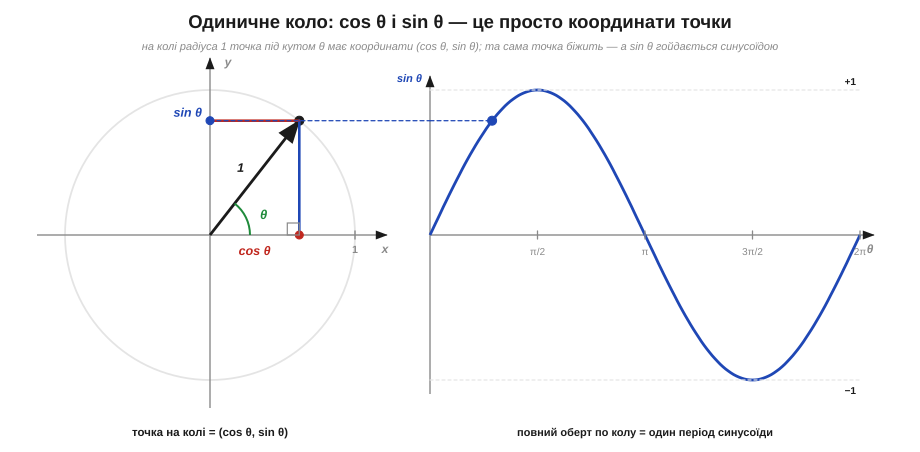
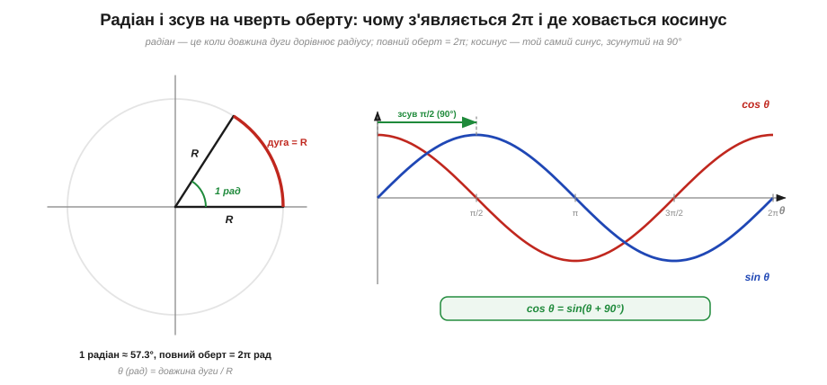

# 🧮 Синус і коло: тригонометрія обертання

> Це математична вставка до теми [§1.7.1 «Чому синусоїда: природна форма коливань»](ac-signals.md). Там ми сказали ключове: синус — це **тінь рівномірного обертання**, а радіус-вектор, що крутиться, дає висоту v(t) = Vₘ·sin(ωt). Але що таке сам **синус** як функція, звідки беруться **радіани** в записі ωt і чому похідна синуса виявляється косинусом — лишилося «за кадром». Тут — рівно той апарат тригонометрії, якого досить, щоб упевнено читати формули змінного струму далі в розділі.

### Означення: синус і косинус — це координати точки на колі

Шкільне означення синуса — «протилежний катет на гіпотенузу» — правильне, але воно живе тільки в гострих кутах прямокутного трикутника. Для коливань потрібен кут, що крутиться по всьому колу й росте без меж, тож означення розширюють. Беремо коло радіуса **1** (його так і звуть — **одиничне коло**, *unit circle*) із центром у початку координат. Проводимо з центра радіус під кутом θ до осі x. Тоді **косинус** (*cosine*) — це x-координата кінця радіуса, а **синус** (*sine*) — його y-координата:

```
точка на одиничному колі = (cos θ, sin θ)
```


*Рис. 1.7.1m.1. На колі радіуса 1 точка під кутом θ має координати (cos θ, sin θ): косинус — горизонтальний катет, синус — вертикальний. Поки точка біжить колом, її висота sin θ розгортається в часі рівно тією синусоїдою, що з §1.7.1; повний оберт (2π) — це один період хвилі.*

Це означення вже нічим не обмежене: кут може бути яким завгодно великим (точка просто намотує оберт за обертом), і обидві функції плавно ходять у межах від −1 до +1. Гострий трикутник лишається окремим випадком — для малих θ x-катет і є cos θ, а y-катет sin θ.

### Інтуїція: чому це та сама синусоїда, що в §1.7.1

Тепер видно, чому означення через коло й «тінь обертання» з §1.7.1 — одне й те саме. У темі точка біжила колом радіуса Vₘ, а ми стежили за її **висотою**. Висота — це y-координата, тобто за щойно даним означенням рівно Vₘ·sin θ. Підставивши θ = ωt (кут росте рівномірно зі швидкістю ω), дістаємо ту саму формулу v(t) = Vₘ·sin(ωt). Косинус же — це **горизонтальна** проєкція тієї ж точки; вона теж гойдається синусоїдно, лише починає з максимуму, а не з нуля.

З картинки кола одразу читаються факти, які інакше довелося б заучувати. Коли точка вгорі (θ = 90°), уся довжина пішла у висоту: sin 90° = 1, а cos 90° = 0. Коли праворуч (θ = 0°) — навпаки: cos 0° = 1, sin 0° = 0. На півоберті (θ = 180°) точка ліворуч: sin = 0, cos = −1. А оскільки x і y тут — катети прямокутного трикутника з гіпотенузою 1, теорема Піфагора дає головну тотожність тригонометрії, **на всі кути одразу**:

```
sin²θ + cos²θ = 1
```

### Апарат: радіани, період і зсув на 90°

Лишилося пояснити дивний на вигляд множник у ωt і всюдисущі π. Кут можна міряти градусами, але в усій фізиці коливань кут міряють **радіанами** (*radian*, рад). Радіан означують напрочуд природно: це кут, під яким **дуга кола дорівнює його радіусу**. Звідси міра кута — просто довжина дуги, поділена на радіус (тому радіан — число без одиниць). Уся колова дуга має довжину 2πR, тож повний оберт — це 2π радіан:

```
θ (рад) = довжина дуги / R       повний оберт = 2π рад ≈ 6.283
1 рад ≈ 57.3°        π рад = 180°        π/2 рад = 90°
```


*Рис. 1.7.1m.2. Ліворуч: радіан — це кут, під яким дуга дорівнює радіусу R (≈57.3°), а повний оберт містить 2π таких кутів. Праворуч: синус і косинус — це та сама хвиля, зсунута на чверть оберту, тобто на π/2 (90°); звідси cos θ = sin(θ + 90°).*

Радіани не примха: саме в них обчислення виходять найпростішими. По-перше, звідси прямо випливає, чому **ω = 2π·f**: за f обертів на секунду стрілка проходить f·(2π) радіан за секунду — це і є кутова швидкість ω. По-друге, синус і косинус — це, по суті, **одна крива, зсунута на чверть періоду**. Косинус випереджає синус на 90° (= π/2 рад), тож їх можна виразити одне через одне:

```
cos θ = sin(θ + 90°)        sin θ = cos(θ − 90°)
```

Найважливіша ж властивість, на якій трималася вся §1.7.1, стосується **похідної** (швидкості зміни, див. [§1.2.1](../voltage-current-conduction/voltage-current-conduction.md)). Якщо кут росте рівномірно (θ = ωt), то швидкість зміни синуса — це знову синусоїда, зсунута на 90°, тобто косинус (із множником ω). А похідна косинуса повертає синус із мінусом:

```
d/dt [sin(ωt)] = ω·cos(ωt)
d/dt [cos(ωt)] = −ω·sin(ωt)
```

Саме ця замкненість і означає те, що в темі сформульовано словами: скільки синус не диференціюй чи інтегруй, він лишається синусом тієї самої частоти — змінюються лише амплітуда (множник ω) та фаза (зсув на 90°).

### Де це працює в курсі

Цей маленький апарат — підмурок усієї решти розділу. Запис v(t) = Vₘ·sin(2π·f·t + φ) тепер читається без загадок: 2πf — це ω з радіанів, а доданок під синусом — кут у радіанах. На тотожності sin²θ + cos²θ = 1 далі стоятиме обчислення діючого значення (RMS) у §1.7.4 — там доведеться усереднювати sin²θ. Зсув на 90° між синусом і косинусом — це прямий місток до **фази** й **зсуву фаз** (§1.7.3): косинус — то «синус, що випереджає на чверть періоду». А те, що похідна синуса є косинус, згодом пояснить, чому струм і напруга на котушці та конденсаторі зсунуті рівно на 90°. Зрештою, образ обертового радіуса з Рис. 1.7.1m.1 — це вже майже **фазор**: щойно до радіуса додамо комплексну площину, обертова стрілка стане повноцінним інструментом розрахунку змінного струму.
