# Розділ 1.1 — Заряд, електричне поле й потенціал

Уся електроніка — від світлодіода до політного контролера — стоїть на одному-єдиному явищі: десь є **заряд**, він **рухається**, і ми цим керуємо. Перш ніж говорити про струми, напруги й сигнали, треба міцно зрозуміти три речі, з яких усе виростає: що таке **заряд**, як він діє на відстані через **поле** і що означає **потенціал** (з якого згодом народиться вольт). Цей розділ закладає той фундамент від першопричин — без нього подальші формули були б замовляннями.

> 📜 **Перед матеріалом — історія:** [ланцюг питань від бурштину до поля](history-electricity.md). Вона показує, *чому* ці поняття взагалі з'явилися й звідки знаки **+/−**, слова «провідник», «заряд» і навіть напрямок струму.

---

## 1.1.1 Заряд — фундаментальна властивість матерії

Ми весь час казатимемо «заряд тече», «заряд накопичився», «заряд штовхає заряд». Але що таке сам **заряд** (*charge*, позначають *q* або *Q*, одиниця — кулон)? Його не можна взяти пінцетом окремо від речовини, як не можна тримати в долоні саму «масу» без тіла. Заряд — це **фундаментальна властивість** матерії: така сама первинна цеглинка опису природи, як маса. Чесна відповідь у дусі фізики: ми не знаємо, чим заряд «є» на якомусь глибшому рівні, — зате точно знаємо, що він **робить**. І саме через те, що він робить, ми його й означуємо.

### Заряд означують через те, що він робить

Усе спостережуване зводиться до кількох простих фактів. Заряд буває **двох родів**, які Франклін назвав **додатним** (*positive*, **+**) і **від'ємним** (*negative*, **−**). І діє непорушне правило взаємодії:

```
однойменні заряди  (+ і +,  − і −)   →  відштовхуються
різнойменні заряди (+ і −)           →  притягуються
нейтральне тіло (заряду немає)        →  не штовхає й не тягне (майже — див. нижче)
```

Це **означальна** поведінка: «бути зарядженим» саме й означає «штовхати інші заряди за цим правилом». Наскільки *сильно* — це вже числа (закон Кулона, [§1.1.2](ch01-charge-field-potential.md)); тут нам важливий сам факт двох родів і двох знаків взаємодії. Зверніть увагу на дивовижну економність природи: родів рівно **два**, не три й не сім. Уся складність електрики виростає з цієї простої двійки.

### Звідки береться заряд: атомна картина

Щоб не лишати заряд містичним «родом», зазирнімо в речовину. Усе збудовано з **атомів**, а кожен атом — це важке **ядро** (*nucleus*) у хмарі легких **електронів**. У ядрі сидять **протони** (*protons*) із зарядом **+e** кожен і **нейтрони** (*neutrons*) без заряду. Навколо — **електрони** (*electrons*) із зарядом **−e** кожен.


*Рис. 1.1.1.1. Нейтральний атом: скільки протонів (+) у ядрі, стільки ж електронів (−) навколо, тож сумарний заряд — нуль. Заряди протона й електрона рівні за величиною й протилежні за знаком: **+e** та **−e**.*

Ось ключ до того, чому звичайні предмети **не б'ють струмом просто так**: у них рівно стільки ж **+**, скільки **−**, і ці заряди майже ідеально гасять одне одного. Стіл, рука, повітря — усе це електрично **нейтральне** не тому, що заряду нема, а тому, що його порівну обох родів. «Зарядити тіло» означає лише **порушити цей баланс** — додати або забрати трохи носіїв.

### Що насправді рухається: електрони

Тут природа зробила нам подарунок, без якого електроніки б не існувало. Протони замкнені в ядрі під дією ядерних сил — зрушити їх практично неможливо. А от **електрони** — легкі (майже у 2000 разів легші за протон) і сидять на периферії атома. Саме вони здатні **переходити** з тіла на тіло. Тому майже завжди, коли в нашому курсі «рухається заряд», фізично **рухаються електрони**.

Це відразу пояснює стару загадку з історії — як натирання «створює» електрику. Воно нічого не створює:

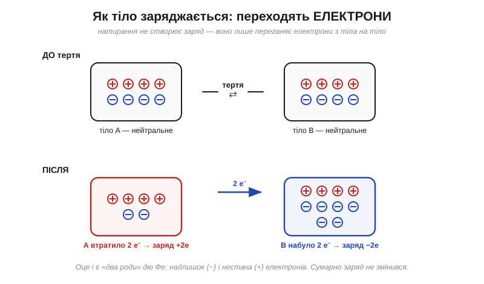
*Рис. 1.1.1.2. Натирання переганяє **електрони** (протони лишаються на місці). Тіло, що втратило електрони, стає **+**; тіло, що їх набуло, — **−**. «Два роди» електрики дю Фе — це просто **нестача** й **надлишок** електронів.*

Тіло, яке **віддало** електрони, лишилось із надлишком протонів → воно **додатне**. Тіло, яке їх **прихопило**, має надлишок електронів → воно **від'ємне**. Жодного нового заряду не народилося — його лише **перерозподілили**. (І зауважте тонкість, закладену ще Франкліном: «додатне» скло насправді має *менше* електронів, а «від'ємна» смола — *більше*. Знак говорить про надлишок умовного флюїду, а не про напрямок руху реальних носіїв.)

> 🔧 **Навіщо це.** Те саме «натер — перегнав електрони» щодня загрожує мікросхемам. Пройшовшись по килиму, ваше тіло набирає кілька кіловольтів статики; торкнувшись виводу чипа, ви проганяєте крізь нього розряд — **електростатичний розряд** (*ESD, electrostatic discharge*), що пробиває тонкі ізолятори всередині й тихо вбиває деталь. Звідси антистатичні браслети, пакети й килимки: уся ESD-дисципліна — це боротьба саме з переходом електронів із Рис. 1.1.1.2.

### Заряд квантований: лише цілі порції e

Якщо заряд переносять окремі електрони, то він не може бути «яким завгодно» — він іде **порціями**. Найменша порція вільного заряду — **елементарний заряд** (*elementary charge*) **e**:

```
e = 1.602 × 10⁻¹⁹ Кл
```

Будь-який заряд, який можна виміряти на тілі, дорівнює **цілому числу** таких порцій: q = N·e, де N — ціле (додатне чи від'ємне). Заряду «півтора електрона» у вільному стані не буває — між сходинками нічого нема.

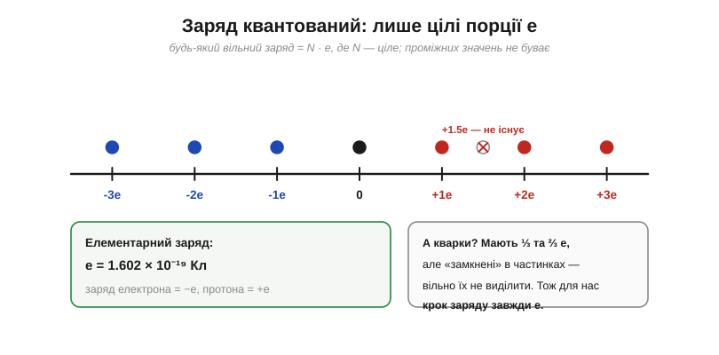
*Рис. 1.1.1.3. Заряд «цифровий» у своїй основі: дозволені тільки значення …−2e, −e, 0, +e, +2e… Проміжних (як +1.5e) для вільного заряду не існує. Кварки мають дробові ⅓ та ⅔ e, але «замкнені» всередині частинок і вільно не виділяються.*

На макрорівні ця зернистість непомітна — порція e настільки дрібна, що навіть слабенький статичний заряд складається з мільярдів електронів і здається неперервним. Але «на дні» заряд **дискретний**, і це не дрібниця: саме тому заряд можна точно зберігати й рахувати.

> 📜 А **звідки відомо** саме це число — e = 1.602×10⁻¹⁹ Кл — і як узагалі довели, що заряд іде неподільними порціями? Його виміряли крихітною краплею олії, що повисла між пластинами конденсатора, — а навколо того досліду розгорнулася ціла драма з порядним аспірантом, суперечкою про «субелектрони» й уроком про самообман: [Мілікен і краплі олії](ch01-s1-history-millikan.md).

**Приклад (скільки електронів — в одному кулоні).** Порахуймо, з якої кількості елементарних зарядів складається 1 Кл:

```
N = Q / e
N = 1 Кл / (1.602 × 10⁻¹⁹ Кл)
N ≈ 6.24 × 10¹⁸ електронів
```

Понад шість мільярдів мільярдів. Кулон — **колосальна** порція заряду; забігаючи трохи наперед, скажемо, що це й робить його зручною одиницею для струмів, але майже неможливою для «вільної» статики.

### Заряд зберігається

З того, що заряд лише переходить, випливає один із найнепорушніших законів фізики — **збереження заряду** (*conservation of charge*): у замкненій (ізольованій) системі **сумарний заряд незмінний**. Скільки **+** десь з'явилося, рівно стільки **−** залишилося деінде.


*Рис. 1.1.1.4. Хай що діється всередині — тертя, розряд, хімічна реакція, — заряди лише **перерозподіляються**. Сумарний заряд «до» дорівнює сумарному «після». Бухгалтерія заряду завжди сходиться.*

Цей принцип здається майже очевидним, але він надзвичайно потужний: на ньому триматиметься весь аналіз кіл. Коли в [§1.4.2](../ch04-kirchhoff-circuit-analysis/ch04-kirchhoff-circuit-analysis.md) ми скажемо «скільки струму втекло у вузол — стільки й витекло» (закон струмів Кірхгофа), це буде **той самий** закон збереження заряду, лише записаний для проводів.

### Одиниця — кулон, і наскільки він великий

Одиниця заряду — **кулон** (*coulomb*, **Кл** / **C**), названий на честь Шарля-Огюстена де Кулона. Ми вже бачили: 1 Кл ≈ 6.24·10¹⁸ елементарних зарядів — це дуже багато. Щоб відчути масштаб, корисно глянути на нього з двох боків одразу.

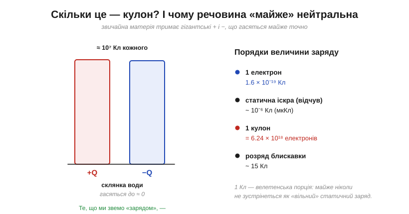
*Рис. 1.1.1.5. Ліворуч: звичайна склянка води тримає близько 10⁷ Кл додатного заряду й стільки ж від'ємного — вони гасяться майже до нуля. Те, що ми звемо «зарядом тіла», — лише **крихітний дисбаланс** цих гігантів. Праворуч: порядки величини — від одного електрона до розряду блискавки.*

Звідси — головна інтуїція цього підрозділу. **Речовина буквально напхана зарядом**, але обох родів порівну, тож зовні вона спокійна. Варто зсунути баланс на мізерну частку — і виникають сили, що піднімають волосся дибки чи б'ють іскрою. Уся електрика — це гра на цьому **малому дисбалансі** величезних протилежних зарядів.

**Приклад (скільки зайвих електронів на наелектризованій кульці).** Натерта повітряна кулька має типовий заряд близько −20 нКл. Скільки це надлишкових електронів?

```
Q = −20 нКл = −20 × 10⁻⁹ Кл
N = |Q| / e
N = (20 × 10⁻⁹ Кл) / (1.602 × 10⁻¹⁹ Кл)
N ≈ 1.25 × 10¹¹ електронів
```

Сто двадцять п'ять мільярдів зайвих електронів — і це ще **слабкий** заряд, мільярдні частки кулона. А водночас — мізерна крихта проти всіх електронів речовини кульки. Обидва відчуття правильні: заряду «багато» в штуках і «дуже мало» в кулонах.

> 🔧 **Навіщо це.** Тримати в голові, що кулон — велетень, дуже практично. Коли в даташиті бачите ємність акумулятора в **ампер-годинах** (А·год) — це теж заряд: 1 А·год = 3600 Кл. Тобто навіть маленький акумулятор переганяє **тисячі кулонів**. Звідси зрозуміло, чому статика — це нанокулони й «лоскоче», а енергія батареї — тисячі кулонів і «варить»: різниця в порядках заряду колосальна.

### Провідник чи ізолятор: куди подінеться заряд

Поведінка заряду на тілі залежить насамперед від того, **чи вільні в ньому носії**. У **провідниках** (*conductors*) є вільні носії заряду, що можуть гуляти по всьому об'єму: у **металах** (мідь, алюміній) це **електрони**, частина яких не прив'язана до конкретного атома; а в **солоній воді чи тілі людини** заряд несуть рухливі **іони** (докладніше — §1.2.11). У **ізоляторах** (*insulators*, або *діелектриках* — скло, пластик, суха деревина, гума) всі електрони міцно сидять на місцях.

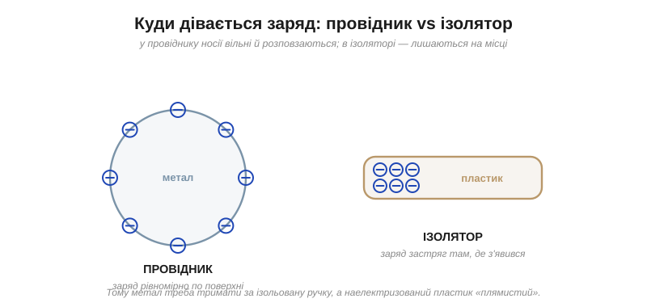
*Рис. 1.1.1.6. На **провіднику** надлишкові заряди вільні, відштовхуються один від одного й виходять на зовнішню поверхню (розподіляючись по ній тим густіше, чим гостріший виступ, — про це в §1.1.3). На **ізоляторі** заряд застряг саме там, куди його посадили, — звідси «плямиста» наелектризованість пластику.*

Це той самий поділ, який Стівен Грей намацав шовковими петлями (див. історію розділу). І саме він дає механізм **заземлення** (*grounding*, *earthing*): якщо з'єднати заряджене тіло провідником із Землею — практично нескінченним резервуаром заряду, — надлишкові електрони стечуть туди (або прийдуть звідти), і тіло **знейтралізується**.


*Рис. 1.1.1.8. Зайві електрони стікають проводом у Землю, аж поки тіло не зрівняється з нею. «Заземлити» — означає під'єднати до цього велетенського резервуара, щоб прибрати надлишок заряду.*

> 🔧 **Навіщо це.** Антистатичний браслет на зап'ясті майстра — це навмисний провідний місток до землі: він **постійно стікає** статику з тіла, не даючи їй накопичитись і стрельнути в чип. А корпус приладу, з'єднаний із «землею», з тієї ж причини лишається безпечно нейтральним. Провідник/ізолятор і заземлення — це не теорія, а щоденна гігієна роботи з електронікою.

### Який матеріал стане «плюсом», а який «мінусом»

Чи можна наперед сказати, хто під час натирання віддасть електрони, а хто прихопить? Здебільшого так — матеріали шикуються в **трибоелектричний ряд** (*triboelectric series*).

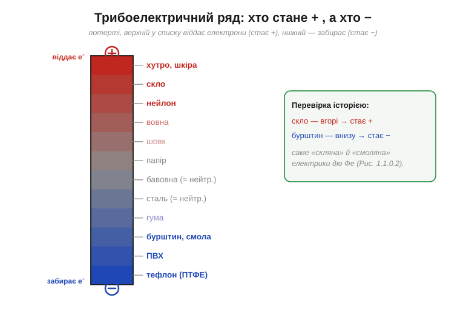
*Рис. 1.1.1.7. Потерши два матеріали, той, що **вище** в ряду, віддає електрони й стає **+**, а нижній забирає їх і стає **−**. Скло (вгорі) проти бурштину (внизу) — це рівно «скляна» й «смоляна» електрики дю Фе.*

Ряд пояснює і силу ефекту: що далі матеріали один від одного в списку, то більший заряд дає натирання. Шерсть об бурштин чи волосся об повітряну кульку (далекі пари) електризуються сильно; два схожі матеріали — ледь-ледь.

> 🔧 **Навіщо це.** Тому чутливі компоненти возять у спеціальних **антистатичних пакетах**, а не в звичайному поліетилені: звичайна плівка стоїть скраю трибоелектричного ряду й сама щедро електризується об усе. Вибір матеріалу пакування, одягу, килимка в майстерні — це прикладне читання Рис. 1.1.1.7.

### Чому заряджене тіло притягує навіть нейтральне

І наостанок — закриймо найперше питання всієї історії: чому потертий бурштин підіймає **нейтральну** соломинку, якщо в неї заряду «нема»? Заряд у ній є — порівну обох родів. Та коли підносять заряджене тіло, воно трохи **зсуває** ці заряди всередині соломинки.

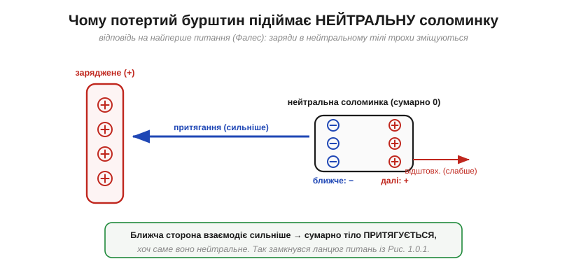
*Рис. 1.1.1.9. Заряджена паличка притягує ближчі різнойменні заряди соломинки й відштовхує дальні однойменні. Та **ближча** сторона взаємодіє сильніше за дальню — тож сумарно нейтральне тіло **притягується**. Це явище зветься **поляризацією** (*polarization*).*

Ось чому притягання працює **завжди**, незалежно від знака палички: вона сама «організовує» собі під боком потрібний протилежний заряд. Так розв'язується загадка, з якою почалася ця наука 2400 років тому, — і робиться це лише засобами цього підрозділу: двома родами заряду, правилом «різні притягуються», і тим, що заряди в речовині можуть трохи зміщуватися.

---

Підсумуймо найважливіше з §1.1.1: заряд — первинна властивість матерії двох родів (**+/−**); фізично переносять його **електрони**; він **квантований** (порціями e) і **зберігається**; одиниця — велетенський **кулон**; а доля заряду на тілі залежить від того, **провідник** це чи **ізолятор**. Ми багато разів казали «штовхає», «притягує» — але жодного разу не сказали, **наскільки сильно**. Перетворити це «тягне» на число — завдання наступного підрозділу.

---

## 1.1.2 Сила між зарядами: закон Кулона

У §1.1.1 ми багато разів сказали «штовхає», «притягує», «сильніше» — але жодного разу не поставили **число**. А вся інженерія починається там, де «тягне» перетворюється на «тягне з силою стільки-то ньютонів». Саме це зробив Шарль-Огюстен де Кулон: він зважив невидиму силу між зарядами й виявив, що вона підкоряється напрочуд простому закону — такому ж простому, як закон тяжіння Ньютона, і навіть тієї самої форми.

> 📜 **Як узагалі можна «зважити» силу, якої не видно й не чути?** Кулон зробив це крутильними терезами тонкості майже неймовірної — і ця історія варта окремої розповіді: [Кулон і крутильні терези](ch01-s2-history-coulomb.md).

### Сам закон: модуль і напрямок

Кулон установив: сила між двома **точковими зарядами** прямо пропорційна добутку їхніх величин і обернено пропорційна **квадрату** відстані між ними.


*Рис. 1.1.2.1. Сила діє **вздовж прямої**, що з'єднує заряди: однойменні відштовхуються, різнойменні притягуються. На обидва заряди діють сили, **рівні за модулем і протилежні за напрямком** (3-й закон Ньютона) — навіть якщо самі заряди дуже різні.*

У формульному вигляді:

```
F = k · |q₁ · q₂| / r²

k  = 1 / (4·π·ε₀) ≈ 8.99 × 10⁹ Н·м²/Кл²      (стала Кулона)
ε₀ ≈ 8.854 × 10⁻¹² Кл²/(Н·м²)                 (електрична стала, проникність вакууму)
```

Тут *q₁*, *q₂* — величини зарядів (у кулонах), *r* — відстань між ними (у метрах), а *k* — **стала Кулона** (*Coulomb constant*). Знак добутку *q₁·q₂* підказує тип взаємодії: додатний (однойменні) — відштовхування, від'ємний (різнойменні) — притягання; модуль у формулі дає саму величину сили. Важлива умова: формула — для **точкових** зарядів (або, що те саме, для рівномірно заряджених куль, і тоді *r* міряють **між центрами**). І ще одне застереження про межі: цей закон — для зарядів **у спокої** (електростатика); для швидко рухомих зарядів додаються інші ефекти, але до них у курсі ще далеко.

### Напрямок, одиниці й що таке «точковий» заряд

Строго закон Кулона — **векторний**. Сила на заряд *q₂* з боку *q₁* записується так:

```
F⃗ = k · (q₁ · q₂ / r²) · r̂
```

де **r̂** — одиничний вектор уздовж прямої, що з'єднує заряди. Уся зручність — у знаку добутку *q₁·q₂*: якщо він додатний (однойменні), вектор сили дивиться **геть** від іншого заряду — відштовхування; якщо від'ємний — **до** нього — притягання. Тобто напрямок «вшитий» у саму формулу, окремо його запам'ятовувати не треба.

Корисно перевірити й **одиниці** сталої k — вони не випадкові, а саме такі, щоб усе зійшлося до ньютонів:

```
[k] = Н·м²/Кл²
[k · q² / r²] = (Н·м²/Кл²) · Кл² / м² = Н   ✓
```

І нарешті — що означає **«точковий заряд»**. Реальні тіла мають розмір, але коли відстань між ними набагато більша за самі тіла, кожне можна вважати точкою в його центрі, і похибка дрібна. Понад те, рівномірно заряджена **куля** діє на зовнішні заряди **точно** так, ніби весь її заряд зібрано в центрі (красива теорема, яку ще Ньютон довів для тяжіння). Тому для двох невеликих заряджених кульок за кілька діаметрів одна від одної проста формула працює чудово; складнощі починаються, лише коли заряди близько, а форма неправильна — тоді тіло доводиться подумки різати на точкові шматочки й додавати їхні внески (а як саме додавати — побачимо нижче, у принципі суперпозиції).

> 🔧 **Навіщо це.** Закон Кулона — це не абстракція «для фізиків»: це причина, чому однойменні заряди на провіднику самі розповзаються по поверхні (Рис. 1.1.1.6) — вони відштовхуються за цим законом. Це й причина, чому статика **пробиває** повітря іскрою, коли заряд (а отже, сила на електронах) стає достатнім, щоб відірвати їх від молекул. Усе, що ми далі робитимемо зі струмами, унизу тримається на цій силі між зарядами.

**Приклад (наскільки сильна ця сила).** Візьмімо два невеликі заряди по 1 мкКл (мікрокулон) на відстані 1 см і порахуймо силу:

```
q₁ = q₂ = 1 мкКл = 1 × 10⁻⁶ Кл
r = 1 см = 0.01 м

F = k · q₁ · q₂ / r²
F = (8.99 × 10⁹) · (1 × 10⁻⁶) · (1 × 10⁻⁶) / (0.01)²
F = (8.99 × 10⁹) · (1 × 10⁻¹²) / (1 × 10⁻⁴)
F ≈ 89.9 Н
```

Майже **90 ньютонів** — це вага дев'ятикілограмової гирі! І все це від двох **мікро**кулонів (а ми пам'ятаємо з §1.1.1, що кулон — велетенська порція). Ось чому в природі вільні заряди такі малі: великий вільний заряд породив би нестерпні сили, що миттєво розкидали б його геть.

> 🔌 А чи можна **навмисно** накопичити великий заряд і втримати його? Саме це робить класична машина, що жене стрічкою заряд на металеву кулю до сотень кіловольтів: [Генератор Ван де Граафа](ch01-s2-c-van-de-graaff.md).

### Закон оберненого квадрата: чому саме 1/r²

Найважливіше в законі — оте **r²** у знаменнику. Воно означає, що сила спадає з відстанню дуже швидко: **подвоїти** відстань — це **вчетверо** послабити силу, потроїти — у дев'ять разів.


*Рис. 1.1.2.2. Чому квадрат? Вплив заряду розходиться навсібіч і «розмазується» по поверхні сфери, а її площа росте як 4·π·r². На вдвічі більшій відстані та сама «кількість» сили припадає на вчетверо більшу площу — звідси падіння в 4 рази. Праворуч — та сама крива F ∝ 1/r².*

Ця геометрична картинка пояснює навіть, **звідки в сталій k взялося 4π**: воно прийшло з площі сфери. Запис k = 1/(4·π·ε₀) не примха — четвірка-пі буквально є тілесним кутом повної сфери, по якій розбавляється вплив. (Саме тому в багатьох формулах далі 4π то з'являється, то зникає — залежно від того, чи є там сферична симетрія.)

Варто наголосити: показник степеня тут саме **2**, а не 1.99 чи 2.01. Це не наближення й не зручне округлення — точність «двійки» перевіряли понад двісті років і щоразу підтверджували з фантастичною строгістю. І це принципово: якби сила спадала, скажімо, як 1/r¹·⁹, уся струнка будова електростатики (зокрема те, що всередині зарядженого провідника поля немає) просто розсипалася б. Природа тут обрала рівно квадрат — і дотримується його бездоганно.

> 🔧 **Навіщо це.** Обернений квадрат — це чому **відстань вирішує все**. Піднести палець на міліметр до наелектризованого виводу — і сила (а з нею ризик ESD-пробою) зростає лавиноподібно. Той самий закон 1/r² керуватиме й гравітацією супутника, і яскравістю світла від лампи, і потужністю радіосигналу від антени: щойно щось «випромінюється» з точки навсібіч, воно розбавляється як 1/r². Засвоївши його тут, ви впізнаватимете його всюди.

### Та сама форма, що й тяжіння — але незрівнянно сильніша

Хто бачив закон всесвітнього тяжіння Ньютона (F = G·m₁·m₂/r²), уже помітив: закон Кулона — **тієї самої форми**, лише замість мас стоять заряди, а замість G — стала k. Це глибока спорідненість. Але є дві разючі відмінності. По-перше, маса буває лише одного «знаку» (тяжіння завжди притягує), а заряд — двох, тож електрична сила вміє і притягати, і відштовхувати. По-друге — масштаб.


*Рис. 1.1.2.4. Між двома протонами електричне відштовхування сильніше за гравітаційне притягання приблизно в 10³⁶ разів. Гравітація — вкрай слабка сила; вона панує в космосі лише тому, що великі тіла електрично майже нейтральні, і заряди гасяться.*

**Приклад (у скільки разів електрика сильніша за гравітацію).** Порівняймо силу між двома протонами:

```
F_e / F_g = (k · e²) / (G · m_p²)

k · e²   = (8.99 × 10⁹) · (1.602 × 10⁻¹⁹)²  ≈ 2.31 × 10⁻²⁸
G · m_p² = (6.674 × 10⁻¹¹) · (1.673 × 10⁻²⁷)² ≈ 1.87 × 10⁻⁶⁴

F_e / F_g ≈ (2.31 × 10⁻²⁸) / (1.87 × 10⁻⁶⁴) ≈ 1.2 × 10³⁶
```

Тридцять шість порядків — це число, яке важко навіть уявити. І ось чому світ улаштований так, як улаштований: на рівні атомів усім керує електрика, а гравітація геть непомітна; зате на рівні планет і зір електричні заряди врівноважені (речовина нейтральна), вони гасяться — і лишається сама лиш кволенька, але **невитравна** гравітація. Два роди заряду проти одного роду маси — ось чому космосом править слабша сила.

Звідси й гарний побутовий парадокс. Ви щомиті відчуваєте гравітацію **цілої планети** — а куди сильнішої електрики не помічаєте зовсім, бо у звичайних тілах вона зрівноважена. Та варто порушити баланс хоч на крихту — потерти кульку об волосся — і вже та крихта незрівноваженої електрики піднімає волосину **проти тяжіння всієї Землі**. Слабша сила перемагає сильнішу лише завдяки нейтральності; щойно нейтральність порушено, електрика бере гору миттєво.

### Коли зарядів багато: принцип суперпозиції

Закон Кулона описує силу між **двома** зарядами. А якщо їх багато? Природа і тут милостива: сили просто **додаються** — векторно, як стрілки.


*Рис. 1.1.2.3. **Принцип суперпозиції**: щоб знайти силу на заряд, рахують силу від кожного іншого заряду окремо (за Кулоном), а тоді складають усі ці сили **як вектори**. Кожна пара «не знає» про існування інших — взаємодії незалежні.*

Це **принцип суперпозиції** (*superposition principle*) — одне з найкорисніших спрощень у всій фізиці. Він означає, що складну задачу з купою зарядів завжди можна розкласти на прості парні взаємодії. Важливо саме **векторне** додавання: дві сили можуть посилювати одна одну, частково гаситися або зрівноважитися повністю. Наприклад, заряд точно **посередині** між двома однаковими зарядами відчуває дві рівні, але протилежно напрямлені сили — і сумарна сила на нього **нуль**, хоча кожна окрема сила велика. Цю саму ідею незалежного додавання ми згодом застосуємо до цілих електричних кіл (§1.5.2).

> 🧮 А як саме «додати стрілки» — на практиці, в координатах, а не транспортиром? Короткий рецепт, за яким із багатьох кулонівських сил дістають одну рівнодійну: [Вектори: додавання сил і суперпозиція](ch01-s2-m-vectors.md).

### Сила залежить від середовища

Дотепер мовчазно малося на увазі, що заряди — у порожнечі. А якщо між ними не вакуум, а якась речовина? Тоді сила **слабшає**.

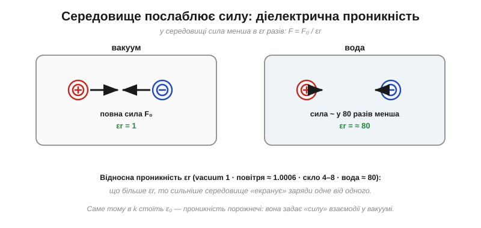
*Рис. 1.1.2.5. Те саме розташування зарядів у вакуумі й у воді: у воді сила приблизно у 80 разів менша. Речовина частково «екранує» заряди одне від одного. Міра цього — **відносна діелектрична проникність** εr.*

Кількісно: у середовищі з відносною проникністю εr (*relative permittivity*, або діелектрична стала) сила менша в εr разів — у формулі ε₀ замінюють на ε = εr·ε₀. Для вакууму εr = 1 (за означенням), для повітря ≈ 1.0006 (тобто майже вакуум — повітря на силу майже не впливає), для скла 4–8, для води ≈ 80.

Чому ж речовина послаблює силу? Згадаймо поляризацію з §1.1.1 (Рис. 1.1.1.9). Молекули багатьох речовин — це крихітні **диполі**: один їхній край трохи додатний, інший трохи від'ємний. Опинившись між нашими зарядами, такі молекули **повертаються** й шикуються так, щоб їхні власні заряди частково гасили вплив наших, — і сумарна сила слабшає. Вода складається з яскраво полярних молекул, тому екранує дуже сильно (εr ≈ 80); сухе ж повітря майже неполярне — і майже не впливає (εr ≈ 1). Інакше кажучи, εr — це міра того, **наскільки охоче речовина поляризується** у відповідь на заряди.

**Приклад (та сама пара зарядів, але у воді).** Зануримо заряди з першого прикладу (по 1 мкКл, за 1 см) у воду:

```
F_вакуум ≈ 89.9 Н           (порахували вище)
F_вода = F_вакуум / εr
F_вода = 89.9 / 80 ≈ 1.1 Н
```

Ті самі заряди на тій самій відстані тиснуть одне на одного майже у **80 разів слабше** — лише тому, що між ними тепер вода, а не порожнеча.

Тепер видно й сенс самої ε₀: це **проникність порожнечі**, що задає «силу» електричної взаємодії в найчистішому випадку — у вакуумі. Ця сама величина εr ще повернеться, коли йтиметься про діелектрики в конденсаторах.

---

Підсумок §1.1.2: сила між зарядами підкоряється закону Кулона F = k·|q₁q₂|/r² — діє вздовж лінії між ними, спадає як **обернений квадрат** відстані, складається за **суперпозицією** й послаблюється середовищем. Ми навчилися рахувати силу, **коли заряди вже стоять** на своїх місцях. Але лишилося глибоке, майже філософське запитання, яке непокоїло й самого Ньютона: як заряд *q₂* узагалі «дізнається», що десь поодаль є *q₁*? Що передає цю силу через **порожній простір** між ними? Саме спроба чесно відповісти на це народила одну з найпотужніших ідей фізики — **поле**.

---

## 1.1.3 Поле: посередник між зарядами

Закон Кулона з §1.1.2 чудово рахує силу — але лишає без відповіді питання, яке непокоїло ще Ньютона (він казав про нього щодо тяжіння, та для електрики воно те саме). Два заряди притягуються чи відштовхуються **на відстані**, не торкаючись. Між ними — порожнеча. Звідки ж заряд *q₂* «знає», що десь поодаль є *q₁*? Невже він відчуває його **миттєво й безпосередньо** через ніщо? Ця ідея «дії на відстані» бентежила фізиків понад століття. Відповідь, яку зрештою знайшли, виявилася такою плідною, що нею описують тепер світло, радіо й усю електродинаміку. Ця відповідь — **поле**.


*Рис. 1.1.3.1. Замість «миттєвої дії крізь порожнечу» вводять посередника: заряд *q₁* **змінює сам простір** навколо себе — створює поле в кожній точці. Інший заряд *q₂* не «тягнеться» до *q₁* напряму, а відчуває поле **локально**, там, де сам перебуває.*

### Що таке напруженість поля: E = F/q

Зробімо цю ідею кількісною. Помістимо в точку, що нас цікавить, маленький **пробний заряд** *q* і поміряймо силу *F*, що на нього діє. Сила залежить і від поля, і від самого *q*. Щоб дістати характеристику **тільки простору** (незалежну від того, що ми туди вмістили), поділимо силу на заряд:

```
E = F / q          (одиниця: Н/Кл)
```

Ця величина — **напруженість електричного поля** (*electric field*, **E**). Вона векторна: її напрямок — це напрямок сили на **додатний** пробний заряд. Сенс простий: поле каже, **яка сила припаде на кожен кулон заряду** в цій точці.

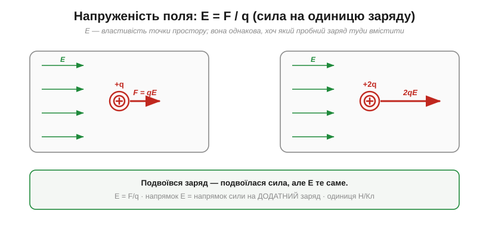
*Рис. 1.1.3.2. Вмістимо в те саме поле заряд +q, потім +2q. Сила на другий удвічі більша (F = qE) — але відношення F/q однакове. Тому **E — властивість точки простору**, а не пробного заряду. Знаючи E, силу на будь-який заряд дістаємо одним множенням: F = qE.*

Звідси й зворотний, найкорисніший на практиці бік формули: якщо поле в точці відоме, то сила на вміщений туди заряд — просто **F = qE**. Поле ніби «чекає» в кожній точці, готове помножитися на заряд і дати силу. Важлива умова коректності: пробний заряд має бути **малим**, щоб своїм власним полем не зрушити заряди-джерела й не змінити те поле, яке ми міряємо.

Щоб відчути числа за цим Н/Кл: біля потертого об волосся гребінця поле сягає десь 10³–10⁴ Н/Кл; «поле гарної погоди» в атмосфері біля землі — близько 100 Н/Кл, напрямлене вниз; а щойно поле дотягує приблизно до 3×10⁶ Н/Кл, повітря не витримує й пробивається іскрою. Тобто між «ледь помітно» і «розряд» — лише кілька порядків величини.

### Поле точкового заряду

Тепер порахуймо поле, яке створює сам **точковий заряд Q**. Візьмімо закон Кулона для сили на пробний *q* на відстані *r* і поділімо на *q*:

```
E = F/q = (k·Q·q / r²) / q

E = k · Q / r²
```

Заряд *q* скоротився — і це чудово: поле справді **не залежить** від пробного заряду, лише від джерела *Q* і відстані *r*. Поле точкового заряду **радіальне**: від додатного — назовні, у від'ємний — усередину, і слабшає за тим самим законом оберненого квадрата.


*Рис. 1.1.3.3. Поле додатного заряду напрямлене від нього, від'ємного — до нього; величина спадає як k·Q/r². Унизу — правила **ліній поля** (ліній сили): дотична до лінії показує напрямок поля, а їхня густина — його силу.*

> 🔧 **Навіщо це.** Поняття поля — це **мова, якою інженер думає про вплив** усюди в електроніці. Та є й цілком конкретний бік: коли напруженість поля в повітрі перевищує приблизно **3×10⁶ Н/Кл** (це ж саме значення згодом запишемо як 3 кВ/мм), повітря **пробивається** — електрони зриваються з молекул, і проскакує іскра. Саме поле, а не «напруга сама по собі», вирішує, чи буде пробій. Тому на платах витримують зазори між доріжками, а у високовольтних вузлах — повітряні проміжки: щоб **E** ніде не дотягнувся до межі пробою.

**Приклад (поле точкового заряду).** Яке поле створює заряд Q = 1 нКл на відстані 3 см?

```
E = k · Q / r²
E = (8.99 × 10⁹) · (1 × 10⁻⁹) / (0.03)²
E = 8.99 / (9 × 10⁻⁴)
E ≈ 1.0 × 10⁴ Н/Кл
```

Тепер силу на будь-який заряд у цій точці знайти легко — помножити на нього. Наприклад, на заряд +5 нКл: F = qE = (5×10⁻⁹)·(1.0×10⁴) = 5×10⁻⁵ Н.

### Поле — реальність, а не лише зручність

Може здатися, що поле — просто зручна бухгалтерія: мовляв, насправді є тільки заряди й сили між ними, а «поле» ми домалювали для краси. Довго так і вважали. Та поступово стало ясно, що поле — **самостійна фізична сутність**, не менш реальна за самі заряди.

По-перше, поле існує в точці, **навіть якщо там нема жодного пробного заряду**, який його відчув би: простір довкола заряду вже «наладований», готовий подіяти на будь-кого, хто туди потрапить. По-друге — і це вирішальний доказ — зміни поля поширюються **не миттєво**. Якщо заряд-джерело раптом смикнути, віддалений заряд відчує це не одразу, а із запізненням: «новина» біжить простором зі скінченною швидкістю — тією самою, що й світло. А те, що передається й має швидкість, безперечно реальне; ба більше, у самому полі **запасено енергію** (згодом побачимо, що заряджений конденсатор зберігає енергію саме в полі, а не «в зарядах»). Саме ця думка — що поле живе власним життям — згодом породить теорію світла й радіо.

### Лінії поля: винахід Фарадея

Малювати поле стрілкою в кожній точці незручно. Майкл Фарадей запропонував геніально наочний спосіб — **лінії поля** (*field lines*, або лінії сили): неперервні криві, дотична до яких у кожній точці дає напрямок поля. Їхні правила прості: лінії **починаються на додатних** зарядах (або приходять із нескінченності) і **закінчуються на від'ємних** (або йдуть у нескінченність); вони **ніколи не перетинаються** (бо в точці поле має один напрямок); а їхня **густина** показує силу поля — де лінії скупчені, поле сильне. Це можна сказати точніше: число ліній, що пронизують одиничний майданчик поперек, пропорційне до самого E — тому згущення ліній і означає сильніше поле, без жодних чисел на рисунку.

> 📜 Як палітурник, що ледь знав математику, «побачив» поле там, де інші бачили порожнечу, — у вставці [Фарадей — людина, що вигадала поле](ch01-s3-history-faraday.md).

Найкорисніше, що поля **складаються за суперпозицією** — так само, як сили в §1.1.2: поле кількох зарядів у точці є **векторною сумою** полів від кожного окремо. Звідси виростають характерні картини. Для пари «+ і −» (диполя) лінії пливуть від плюса до мінуса:

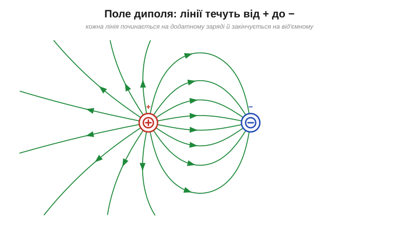
*Рис. 1.1.3.4. Поле диполя: кожна лінія стартує на +, дугою огинає простір і входить у −. Саме так виглядає поле двох близьких протилежних зарядів — від молекули води до антени.*

**Приклад (складання полів у диполі).** Заряди Q₁ = +3 нКл і Q₂ = −3 нКл стоять за 6 см один від одного. Яке поле точно **посередині** між ними?

```
r = 3 см = 0.03 м  (до кожного від середини)
E₁ = k·Q₁/r² = (8.99×10⁹)(3×10⁻⁹)/(0.03)² ≈ 3.0×10⁴ Н/Кл   (від + → праворуч)
E₂ = k·|Q₂|/r² = те саме ≈ 3.0×10⁴ Н/Кл                      (до − → теж праворуч)

E = E₁ + E₂ ≈ 6.0×10⁴ Н/Кл   (напрямлене від + до −)
```

Тут поля від обох зарядів дивляться **в один бік** (від плюса до мінуса) і **додаються**. А коли б заряди були однойменні, у тій самій точці вони дивилися б назустріч — і відняли б одне одного аж до нуля.

Для двох **однойменних** зарядів лінії, навпаки, розштовхуються, і між ними з'являється особлива **нейтральна точка**, де поля гасяться повністю:

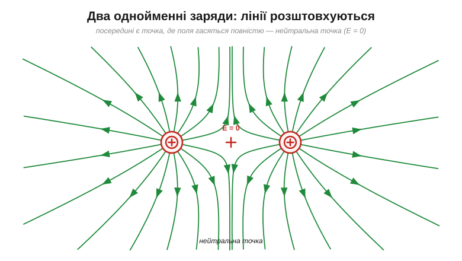
*Рис. 1.1.3.5. Два однакові заряди: лінії взаємно відштовхуються. Точно посередині поля від обох рівні й протилежні — вони сумуються в **нуль** (E = 0). Це наочний приклад суперпозиції: сильні поля можуть давати нульову суму.*

### Однорідне поле

Особливо важливий випадок — **однорідне поле** (*uniform field*): однакове за величиною й напрямком у кожній точці. Його дають дві великі протилежно заряджені пластини: між ними лінії паралельні й рівномірні.

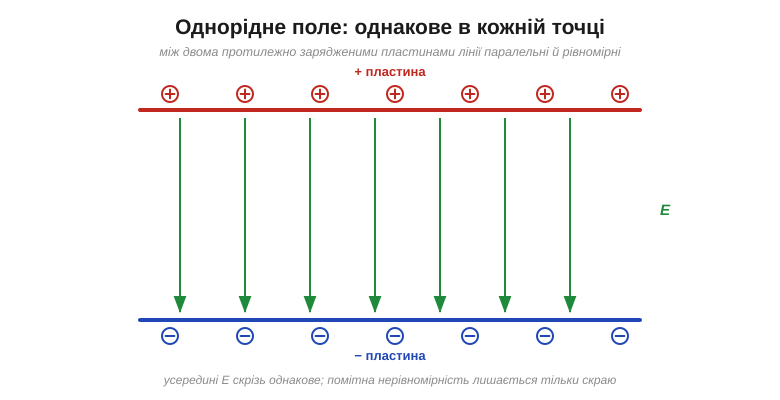
*Рис. 1.1.3.6. Між двома протилежно зарядженими пластинами поле **однорідне** — паралельні рівновіддалені лінії від + до −. Помітне викривлення лишається тільки скраю. Це найпростіша для розрахунку конфігурація: сила на заряд усередині скрізь однакова.*

> 🔧 **Навіщо це.** Однорідне поле — це робоча конячка електроніки: саме так влаштовано поле всередині конденсатора (з ним ще зустрінемося) і так відхиляють пучки заряджених частинок. Якщо поле однорідне, то й сила F = qE на заряд **стала** скрізь у проміжку — рахувати її легко, як рух тіла під сталою силою тяжіння.

### Поле біля провідників: чому вістря «колють»

Наостанок — важливий практичний факт. На зарядженому провіднику заряд (а з ним і поле біля поверхні) розподіляється **нерівномірно**: він скупчується на **гострих** виступах. А де густіший заряд — там і густіші лінії, тобто сильніше поле.

Та спершу зауважмо властивість, що випливає прямо з рухливості зарядів у провіднику (§1.1.1): **зовні біля поверхні провідника поле завжди перпендикулярне до неї**. Якби існувала складова поля **вздовж** поверхні, вона тягла б вільні заряди вбік — і ті ковзали б доти, доки своїм перерозподілом цілком не погасили б цю поздовжню складову. У рівновазі лишається тільки нормальна частина: лінії поля впираються в метал точно під прямим кутом. Тому форма провідника й диктує картину поля — а на вістрі, де поверхня круто згинається, лінії стискаються найтісніше.


*Рис. 1.1.3.7. Біля гострого кінця провідника лінії поля скупчуються — там E найбільше. Саме тому повітря пробивається першим на вістрях (корона, розряд), а на округлих боках поле слабке.*

> 🔧 **Навіщо це.** Звідси два протилежні інженерні рішення з одного принципу. **Громовідвід** роблять **гострим** і високим — щоб посилене поле на вістрі зробило його **найімовірнішою точкою удару**: він перехоплює блискавку на себе й товстим проводом відводить її величезний струм безпечно в землю. (Громовідвід не «відганяє» блискавку, тихо стікаючи заряд короною, як колись гадали, — він саме **перехоплює** удар і дає струмові безпечний шлях повз будівлю.) А високовольтні деталі, навпаки, роблять **округлими**, без задирок і гострих кутів, щоб ніде не виникло локального сплеску поля й передчасного пробою. Побачивши на платі чи у вузлі загострений край під високою напругою — знайте: там перше місце, де «прострелить».

**Приклад (сила на електрон у полі пробою).** Яка сила діє на електрон у повітрі, де поле досягло межі пробою E ≈ 3×10⁶ Н/Кл?

```
F = q · E = e · E
F = (1.602 × 10⁻¹⁹) · (3 × 10⁶)
F ≈ 4.8 × 10⁻¹³ Н
```

Сила здається мізерною — але вона діє на електрон масою лише 9.1×10⁻³¹ кг, тож надає йому колосального прискорення й розганяє так, що він вибиває інші електрони. Так і починається лавина пробою.

---

Підсумок §1.1.3: поле **E = F/q** — це посередник, що знімає загадку дії на відстані: заряд змінює простір довкола, а інші заряди реагують на поле **локально**, за правилом **F = qE**. Поле точкового заряду — радіальне, E = kQ/r²; поля **складаються векторно**; їх наочно показують **лінії Фарадея**; а біля вістрів поле згущується аж до пробою. Ми навчилися казати, **куди й з якою силою** поле штовхає заряд у кожній точці. Та коли заряд під дією цієї сили **рушає** — виконується робота, накопичується чи витрачається енергія. Перейти від сили до **енергії** — наступний крок, що приведе нас до потенціалу.

---

## 1.1.4 Робота, потенціальна енергія й потенціал

У §1.1.3 ми навчилися казати, **з якою силою** поле штовхає заряд у кожній точці (F = qE). Але сила — це ще не вся історія. Щойно заряд під дією цієї сили **рушає**, виконується **робота**, і переноситься **енергія**. А енергія — це, врешті, те, заради чого існує вся електроніка: батарея її **запасає**, коло — **доставляє**, навантаження — **витрачає**. Тож зробімо вирішальний крок: від сили перейдімо до **енергії** — і так природно прийдемо до поняття, що стане центральним у всьому курсі, до **потенціалу**.

### Робота: переміщення заряду в полі

З механіки відомо: коли сила *F* тягне тіло вздовж переміщення *d*, вона виконує **роботу** W = F·d (якщо сила вздовж руху). Робота — це і є передана енергія, у джоулях (*joule*, Дж). Для заряду в однорідному полі сила дорівнює qE, тож

```
W = F · d = q · E · d
```


*Рис. 1.1.4.1. Якщо заряд рухається **за полем**, роботу виконує саме поле (+qE·d): заряд розганяється, його потенціальна енергія переходить у рух. Якщо ж тягти заряд **проти поля**, роботу виконуєте **ви** — і енергія запасається. Поле консервативне: робота залежить лише від початку й кінця шляху, а не від траєкторії.*

Окремо наголосімо на рисі, згаданій у підписі, — **консервативності** (*conservative field*). Вона означає, що робота з переміщення заряду між двома точками **однакова, хоч би яким шляхом** ми його вели — прямо, дугою чи зиґзаґом. А це й дає право говорити про **запасену енергію**, що залежить тільки від положення: точнісінько як у гравітації.

### Потенціальна енергія: точна аналогія з висотою

Підняти камінь угору — означає **запасти** в ньому потенціальну енергію (*potential energy*, PE): відпустиш — він упаде, і PE перейде в рух (кінетичну енергію). Із зарядом у полі — те саме. Перемістити додатний заряд **проти** поля — наче підняти його «вгору» електричним пагорбом: запасається PE. Відпустиш — поле «скине» його вниз, розганяючи.


*Рис. 1.1.4.2. Зліва камінь масою m на висоті h має PE = m·g·h. Справа заряд q, зміщений на d проти поля E, має PE = q·E·d. Відповідність точна: **висота h ↔ потенціал**, а **m·g ↔ q·E**. Де аналогія ламається: заряд буває двох знаків, тож від'ємний «падає вгору» — проти напрямку поля.*

Ця аналогія — не поетичний образ, а **робочий інструмент**, бо математика обох випадків однакова (обидві сили консервативні). Тому всю інтуїцію про висоту, схили й скочування можна сміливо переносити на заряди — з єдиним застереженням про два знаки.

### Потенціал: енергія на одиницю заряду

Потенціальна енергія qEd залежить і від поля, і від самого заряду q. Щоб дістати характеристику **тільки точки простору** (як ми вже робили для сили, ввівши E = F/q), поділімо енергію на заряд. Дістанемо **електричний потенціал** (*electric potential*, V):

```
V = PE / q          (одиниця: Дж/Кл = вольт, V)
```

Потенціал — це **потенціальна енергія, що припала б на кожен кулон** заряду в цій точці. Він відіграє роль «електричної висоти»: показує, наскільки високо в енергетичному ландшафті лежить точка. Одиниця Дж/Кл має власне ім'я — **вольт** (*volt*, В); саме їй та її історії присвячено наступний підрозділ [§1.1.5](ch01-charge-field-potential.md), а поки досить знати, що 1 вольт = 1 джоуль на кулон.

Для точкового заряду потенціал виходить V = k·Q/r. Він походить не із сили, а з **енергії**: це потенціальна енергія U = k·Q·q/r, поділена на заряд q. (А якби ми поділили на q саму **силу** k·Q·q/r², дістали б не потенціал, а поле E = k·Q/r².) Тому потенціал спадає як 1/r, а поле — як 1/r². Потенціал зручно уявляти ландшафтом:


*Рис. 1.1.4.3. Додатний заряд творить **горб** потенціалу (інші додатні заряди «скочуються» з нього геть), від'ємний — **яму** (додатні зсуваються всередину). Далеко від заряду потенціал прямує до нуля. Це наочна «висота» електричного рельєфу.*

Чому ж поле спадає як 1/r², а потенціал — лише як 1/r? Бо потенціал — це **накопичена** робота на всьому шляху від нескінченності до точки. Навіть там, де поле вже слабеньке, воно все одно потроху додає енергію на кожному відрізку шляху, і ці внески підсумовуються. Тому потенціал «згасає» повільніше за поле: поле — це **крутість** рельєфу в точці, а потенціал — сама **висота**, що накопичилася за весь підйом.

> 🧮 Оте «накопичення роботи» змінної сили — це строго **площа під кривою сили**, тобто інтеграл; саме він і пояснює, чому інтегрування 1/r² дає 1/r (потенціал на степінь «повільніший» за поле): [Робота як інтеграл: площа під кривою сили](ch01-s4-m-work-integral.md).

> 🔧 **Навіщо це.** Потенціал (точніше, його **різниця** — про неї нижче) — це і є **напруга**, яку показує мультиметр і яку «дає» батарея. Коли на елементі написано «3.7 В», це означає: кожен кулон заряду, пройшовши через нього, несе 3.7 джоуля енергії. Уся робота з колами — це робота з потенціалом, тож засвоїти його як «електричну висоту» варто міцно.

### Еквіпотенціалі: де поле й потенціал зустрічаються

Якщо потенціал — це висота, то в рельєфі є **лінії однакової висоти** — як ізогіпси на карті. Тут їх звуть **еквіпотенціалями** (*equipotentials*): лінії (а в просторі — поверхні) однакового V. І між ними та полем є строгий геометричний зв'язок.


*Рис. 1.1.4.4. Еквіпотенціалі (фіолетові) — лінії однакового потенціалу; навколо точкового заряду це кола. Лінії поля (зелені) **завжди перпендикулярні** до них і вказують у бік **меншого** потенціалу. Поле «дивиться вниз із пагорба» — туди, куди скотився б додатний заряд.*

Цей зв'язок практичний: рухаючись **уздовж** еквіпотенціалі, заряд не змінює енергії (робота нульова — бо немає складової поля вздовж руху); а найшвидше енергія міняється **поперек** них, уздовж поля. Поверхня будь-якого провідника, до речі, — завжди еквіпотенціаль (інакше заряди на ній рухалися б), і тому лінії поля впираються в метал під прямим кутом, як ми вже бачили в §1.1.3.

### Різниця потенціалів — і чому нуль обираємо самі

Тут ховається тонкість, що бентежить новачків. Сам по собі потенціал у точці — величина **відносна**: вона залежить від того, де ми домовилися вважати «нуль». Фізичний сенс має лише **різниця потенціалів** між двома точками — її й називають **напругою** (*voltage*) і саме її переносить заряд як енергію.

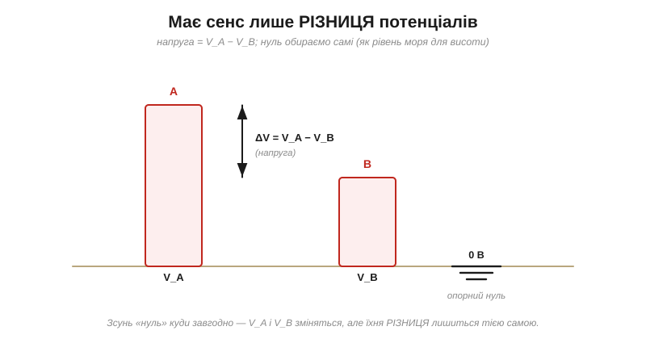
*Рис. 1.1.4.5. Має значення лише різниця ΔV = V_A − V_B (це й є напруга між A і B). Сам «нуль» обираємо довільно — як рівень моря для висоти гір. Зсунь опорний рівень куди завгодно — окремі V_A і V_B зміняться, та їхня **різниця** лишиться незмінною.*

Тому в кожній схемі обирають **опорну точку** — «нуль вольтів», або **землю** (*ground*, GND), — і всі напруги міряють відносно неї. Це не фізичний абсолют, а зручна угода, як домовитися рахувати висоту від рівня моря. Звідси й практика: «напруга у вузлі» завжди мається на увазі **відносно землі**.

І ось чому напруга так тісно сплетена з енергією на практиці. Якщо заряд q «скочується» з вищого потенціалу на нижчий через різницю ΔV, він **віддає** енергію W = q·ΔV — саме її коло й пускає в діло (на світло, тепло, рух). Батарея ж робить зворотне: вона, наче насос, **піднімає** заряд на вищий потенціал, запасаючи енергію, щоб згодом коло «спустило» його вниз із користю. Тож напруга — це буквально «скільки джоулів на кожен кулон» готове віддати джерело.

> 🔧 **Навіщо це.** Ось чому мультиметр має **два** щупи: він міряє не «потенціал тут», а **різницю** між двома точками. І чому в кожній схемі є шина **GND**: це спільний нуль, від якого відлічують усі напруги. Плутанина з тим, «відносно чого» виміряна напруга, — класичне джерело помилок; пам'ятайте, що значення має лише різниця.

### Поле — це крутість потенціалу: E = ΔV/d

Наостанок з'єднаймо §1.1.3 і §1.1.4 однією практичною формулою. В однорідному полі (між зарядженими пластинами) потенціал спадає **лінійно** від однієї пластини до іншої. А крутість цього спаду — і є напруженість поля.


*Рис. 1.1.4.6. Між пластинами потенціал V падає рівномірно вздовж проміжку; нахил прямої V(x) і є напруженість: E = ΔV/d. Тому одиницю поля Н/Кл часто записують як **В/м** (вольт на метр) — це те саме.*

```
E = ΔV / d        (однорідне поле)
```

Звідси видно й те, чим ми лякали в §1.1.3: поле залежить не лише від напруги, а від напруги **на одиницю відстані**. Невелика напруга на дуже тонкому проміжку дає **величезне** поле.

**Приклад (енергія від напруги).** Скільки енергії несе заряд q = 2 мкКл, пройшовши різницю потенціалів ΔV = 9 В?

```
W = q · ΔV
W = (2 × 10⁻⁶ Кл) · (9 В)
W = 1.8 × 10⁻⁵ Дж = 18 мкДж
```

**Приклад (яка напруга пробиває 1 мм повітря).** Повітря пробивається, коли поле сягає E ≈ 3×10⁶ В/м (з §1.1.3). Яка для цього потрібна напруга на проміжку d = 1 мм?

```
ΔV = E · d
ΔV = (3 × 10⁶ В/м) · (1 × 10⁻³ м)
ΔV ≈ 3000 В = 3 кВ
```

Тобто, щоб іскра перескочила 1 мм повітря, потрібно близько 3 кВ — а на проміжку в 10 разів тоншому вистачить уже ~300 В. Ось чому тонка ізоляція й малі зазори такі вразливі: за тієї самої напруги поле в них у рази більше.

> 🔧 **Навіщо це.** Формула E = ΔV/d — щоденний інструмент: за нею прикидають, чи витримає ізоляція задану напругу й який мінімальний зазор лишити між доріжками на платі. У світі мікроелектроніки, де ізолятори завтовшки в нанометри, навіть кілька вольтів створюють поля на межі пробою — звідси сувора межа на допустимі напруги.

### Зручна одиниця енергії: електронвольт

У світі окремих зарядів джоуль — одиниця незручно велика. Тому фізики й електронники користуються **електронвольтом** (*electronvolt*, еВ): це енергія, яку набирає один елементарний заряд, пройшовши різницю потенціалів в 1 вольт.

```
1 еВ = e · (1 В) = 1.602 × 10⁻¹⁹ Дж
```

Уся зручність — у тому, що енергію відразу **читають із напруги**: електрон, прискорений ста вольтами, дістає рівно 100 еВ, і рахувати нічого. В електронвольтах вимірюють ширину забороненої зони напівпровідників, енергію фотонів світла, рівні в атомі — усе, де природніше думати «на один заряд». Це той самий принцип «на одиницю заряду», що й сам потенціал, лише застосований до енергії.

---

Підсумок §1.1.4: коли заряд рухається в полі, виконується **робота** (W = qE·d), а оскільки поле **консервативне** — можна говорити про запасену **потенціальну енергію**, точно як про висоту в гравітації. Енергія на одиницю заряду — це **потенціал** V (одиниця — вольт, Дж/Кл); фізичний сенс має лише його **різниця** (напруга), яку міряють відносно обраного нуля-землі; а крутість потенціалу і є поле, E = ΔV/d. Ми ввели вольт майже мимохідь — а тим часом це **найголовніша** робоча величина всієї електроніки. Тож наступний підрозділ присвячено саме їй: чому вольт — це джоуль на кулон, і звідки взялося це ім'я.

---

## 1.1.5 Головна думка: вольт — це джоуль на кулон

У §1.1.4 ми ввели вольт майже мимохідь, як одиницю потенціалу. Але якщо в усьому цьому розділі є **одна** думка, яку треба винести й закарбувати назавжди, — то це вона. Вольт — найважливіша робоча величина всієї електроніки: її ви бачитимете на кожному джерелі, кожному виводі, у кожному рядку даташита. І весь її глибокий сенс уміщається в коротку рівність:

```
1 В = 1 Дж / Кл
```

**Вольт — це енергія на одиницю заряду.** Не сила, не кількість заряду, не «потужність розетки» — а саме скільки **джоулів** несе кожен **кулон**. Зрозуміти це до кінця — значить отримати ключ до всього подальшого.

### Що це означає буквально

Розшифруймо рівність якомога конкретніше. Якщо між двома точками напруга 1 вольт, то кожен кулон заряду, пройшовши від однієї до іншої, віддає (або набирає) рівно 1 джоуль енергії.


*Рис. 1.1.5.1. Уся суть на одній картинці: коли заряд в 1 кулон «падає» на різницю в 1 вольт, вивільняється 1 джоуль енергії. Вольт відповідає на питання «**скільки енергії на кожен кулон?**».*

Звідси одразу й робоча формула, яку ми вже виводили в §1.1.4, але тепер читаємо її як визначення вольта: енергія, яку несе заряд q, пройшовши напругу V, — це

```
W = q · V        (джоулі = кулони × вольти)
```

«3.7 В» на акумуляторі означає буквально: кожен кулон, що вийде з нього, принесе колу 3.7 джоуля. «5 В» на USB — кожен кулон несе 5 джоулів. Напруга — це **густина енергії в заряді**.

Має значення й **напрям**. Пройти від нижчого потенціалу до вищого — це «підйом» (заряд набирає енергію), а від вищого до нижчого — «спад» (заряд віддає). Тому напругу часто записують зі знаком або стрілкою: вона каже не лише «скільки джоулів на кулон», а й «у який бік» — заряд багатшає чи бідніє на енергію. А пригадавши електронвольт із §1.1.4, бачимо ту саму монету з іншого боку: 1 вольт — це не тільки джоуль на (величезний) кулон, а й рівно 1 еВ на кожен окремий елементарний заряд. Ідея «енергія на заряд» однаково працює на обох кінцях шкали — від батарейки до одного електрона.

### Чому саме «на кулон» — і чому це так зручно

Може здатися дивним означати величину «на одиницю» чогось. Та в цьому й уся сила: завдяки діленню на заряд напруга стає **інтенсивною** величиною — вона характеризує **саме джерело чи різницю**, а не якусь конкретну порцію заряду.

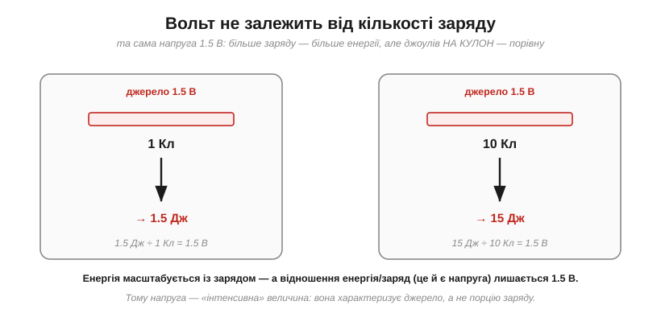
*Рис. 1.1.5.2. Через ту саму напругу 1.5 В пропустимо 1 кулон — дістанемо 1.5 Дж; пропустимо 10 кулонів — 15 Дж. Енергія росте із зарядом, але **відношення** енергія/заряд (а це і є напруга) лишається 1.5 В. Тому напруга описує джерело, а не порцію.*

Саме тому можна спокійно сказати «джерело на 5 вольтів», не уточнюючи, скільки заряду крізь нього пройде: 5 вольтів — це обіцянка дати **5 джоулів кожному кулону**, хоч би скільки тих кулонів знадобилося. Так само, як «висота водоспаду» однакова незалежно від того, ллється відро води чи ціла річка: висота — це енергія на одиницю, а не повна енергія.

> 🔧 **Навіщо це.** Ось чому в даташитах напруга живлення стоїть **окремо** від струму чи ємності: вона каже про «якість» енергії (скільки на кулон), а не про її кількість. Логіка працює на 3.3 В чи 5 В — це про те, якими «порціями на заряд» спілкуються мікросхеми; а скільки заряду вони візьмуть — то вже інше питання (струм, Розділ 1.2).

### Водяна аналогія — тепер точна

Тепер «висотну» аналогію з §1.1.4 можна зробити по-справжньому корисною. Уявіть водонапірний бак: що **вище** він стоїть, то більше енергії несе кожна крапля, що з нього падає. Висота баку — це **напруга**.


*Рис. 1.1.5.3. Висота баку (тиск) задає енергію кожної краплі — це **напруга** (енергія на заряд). Скільки води тече за секунду — то вже **струм** (Розділ 1.2), а вузька труба, що гальмує потік, — то опір. Аналогія точна там, де йдеться про «енергію на одиницю»; ламається ж тому, що заряд буває двох знаків, а висота води — лише одного.*

Ця аналогія варта засвоєння, бо вона правильно розділяє два поняття, які новачки постійно плутають: **напругу** (висота — скільки енергії на одиницю) і **потік** (скільки тієї одиниці тече — це буде струм). Високий бак із тонкою цівкою й низький бак із потужним потоком — геть різні речі, хоч «води» може витекти порівну.

### Чого вольт НЕ означає

Найчастіша плутанина початківця — змішати вольти з амперами й ватами. Тримаймо чітко: **вольт — це енергія на одиницю заряду** (Дж/Кл), і нічого більше. Це **не** кількість заряду, що тече (то ампер — і він про енергію нічого не каже), і **не** енергія за секунду (то ват — потужність). Висока напруга з крихітним потоком може нести зовсім мало енергії за секунду — статика б'є кіловольтами, та лише лоскоче; а низька напруга з потужним потоком — багато: стартер авто живиться всього 12 вольтами, проте провертає холодний двигун. Вольт каже про «якість» енергії на кожен кулон, а не про її кількість чи темп. Цю різницю ми строго розведемо в наступних розділах — але закласти її варто вже тут, бо на ній спотикаються найчастіше.

> 🧮 Саме одиниці й не дають сплутати ці величини: щойно формула змішує Дж/Кл з амперами чи ватами, перевірка розмірностей це викриває — ще до підстановки чисел: [Аналіз розмірностей](ch01-s5-m-dimensional-analysis.md).

### Калібруємо чуття: реальні напруги

Щоб вольт став відчутним, корисно прив'язати його до знайомих чисел.


*Рис. 1.1.5.4. Від мілівольтів (кволі сигнали давачів) до мегавольтів (блискавка). Кожен вольт — це один джоуль на кожен кулон: ось чому 230 В мережі небезпечні, а мілівольти термопари — ні (за тієї самої кількості заряду енергія на кулон різниться в сотні тисяч разів).*

Запам'ятавши цю драбину, ви легко оцінюватимете порядки: пальчиковий елемент — 1.5 В, літій — 3.7 В, USB — 5 В, авто — 12 В, мережа — 230 В, а сигнали давачів часто живуть у світі мілівольтів. Кожне число — це безпосередньо «джоулів на кулон».

> 🧮 Мілі-, кіло-, мега- — ці приставки тут і далі трапляються на кожному кроці. Що вони означають насправді і як перемножувати величини з префіксами усно (так, щоб «1 мкА × 10 кОм = 10 мВ» рахувалося в голові): [Префікси СІ та інженерна нотація](ch01-s5-m-si-prefixes.md).

> 🔌 А кіловольти на верхівці драбини можна дістати геть без батареї — просто стукнувши по кристалу. Саме так працює п'єзозапальничка газової плити: [П'єзозапальничка](ch01-s5-c-piezo-igniter.md).

> 🔧 **Навіщо це.** Тому й рівні логіки (3.3 В / 5 В), і «слабкі» сигнали давачів (мілівольти), і небезпека мережі — усе це мова **вольтів = Дж/Кл**. Коли побачите в даташиті підсилювача «підсилення по напрузі», знайте: мова про збільшення саме цієї «енергії на кулон», а не кількості заряду.

### Звідки береться саме «1.5 вольта»

Чому елемент дає близько 1.5 В, а літій — близько 3.7 В? Це число задає **хімія**: кожна реакція всередині елемента вивільняє певну енергію на кожен перенесений електрон — і саме вона визначає «джоулі на кулон». Інша хімія — інша енергія на заряд: лужний елемент дає ≈1.5 В, свинцево-кислотний ≈2 В, літій-іонний ≈3.7 В. Напруга елемента — це, по суті, енергетична «висота» його реакції, переведена у вольти.

А якщо потрібно більше? Елементи **складають у стовпчик** (послідовно): тоді кожен кулон піднімають по черзі всі елементи, і їхні напруги **додаються**. Три елементи по 1.5 В дають 4.5 В — кожен кулон набирає 1.5 + 1.5 + 1.5 джоуля. Саме так із 3.7-вольтових банок збирають акумулятори на 7.4 чи 11.1 В. (Докладно про послідовне з'єднання — у Розділі 1.4.)

> 🔌 Як саме хімія цинку й діоксиду мангану «вирішує» дати рівно 1.5 В — і чому AA, AAA та D однаково по 1.5 В, а більший лише довше тягне: [Лужна батарейка AA зсередини](ch01-s5-c-alkaline-cell.md).

### Джерело — це насос енергії

І останній, найпрактичніший образ. Звідки заряд бере свою «висоту»? Його **піднімає джерело**. Батарея працює як насос: усередині вона переганяє заряд із нижчого потенціалу на вищий, **запасаючи** в кожному кулоні енергію qΔV. А коло потім дає цьому заряду «скотитися» назад — і витрачає запасене на світло, тепло, рух.


*Рис. 1.1.5.5. Джерело піднімає кожен кулон на свою напругу ΔV, вкладаючи в нього qΔV енергії; зовнішнє коло «спускає» заряд через споживача, вивільняючи цю енергію. Напруга джерела — це буквально «на скільки джоулів на кулон воно піднімає заряд». (Як саме заряд побіжить колом — тема Розділу 1.2.)*

Ця «піднімальна» здатність джерела має й власну назву — **електрорушійна сила** (*ЕРС*, *EMF*), але суть її та сама: скільки енергії на кулон джерело готове надати. Тільки затямте одразу: усі ці числа — **номінальні**, виміряні майже без навантаження. Реальне джерело має ще й **внутрішній опір**, тож щойно з нього потече помітний струм, напруга на клемах трохи **просідає** (а в міру виснаження — і поготів). Тому «1.5 В» чи «3.7 В» — це радше напруга «на холостому ході», ніж залізна стала; як це врахувати — у §1.5.1. Тут ми впритул підходимо до межі розділу — далі заряд **потече**, і почнеться розмова про струм.

**Приклад (скільки енергії в пальчиковій батарейці).** Лужний елемент AA має напругу 1.5 В і ємність близько 2000 мА·год. Скільки в ньому енергії?

```
заряд:    Q = 2000 мА·год = 2 А·год = 2 × 3600 = 7200 Кл
енергія:  W = Q · V = 7200 Кл × 1.5 В ≈ 10800 Дж ≈ 10.8 кДж
```

**Приклад (акумулятор телефона).** 3.7 В, 3000 мА·год:

```
Q = 3000 мА·год = 3 А·год = 10800 Кл
W = Q · V = 10800 × 3.7 ≈ 40000 Дж ≈ 40 кДж ≈ 11 Вт·год
```

Звідси видно й сенс одиниці **ват-година** (Вт·год) на акумуляторах: це теж енергія (заряд × напруга), просто в зручніших одиницях — кожні 3600 джоулів дають 1 Вт·год.

### Звідки ім'я

Одиницю названо на честь **Алессандро Вольти** (*Alessandro Volta*), який 1800 року подарував світові перше джерело **сталої** напруги — батарею, і тим відкрив добу практичної електрики. А народилася вона із запеклої наукової суперечки, що тривала роками.

> 📜 Драму «жаб'ячої електрики» — суперечку Вольти з Гальвані, з якої постала батарея, — викладено у вставці [Вольта проти Гальвані](ch01-s5-history-volta.md).

---

Підсумок §1.1.5 — і він короткий, бо думка одна: **вольт — це джоуль на кулон**, енергія, яку несе кожна одиниця заряду. Це **інтенсивна** величина: вона характеризує джерело чи різницю потенціалів, а не кількість заряду; її дає «насос»-джерело й витрачає коло; і саме нею проградуйовано весь світ електроніки — від мілівольтів давача до кіловольтів лінії. Ми описали заряд, поле й потенціал. Лишилося побачити, що **поле й потенціал — це не дві різні речі, а одне явище, розказане двома мовами**.

---

## 1.1.6 Поле й потенціал — одне явище двома мовами

Може скластися враження, що ми завели **дві окремі** характеристики простору, які тепер доведеться тягати порізно: поле **E** (§1.1.3) і потенціал **V** (§1.1.4–1.1.5). Це враження хибне — і розвіяти його важливо, бо інакше пів курсу здаватиметься удвічі складнішим, ніж є. Насправді **E і V — це не дві різні речі, а два описи однієї й тієї самої реальності**. Як карта місцевості, яку можна задати або стрілками схилів, або лініями висот: інформація та сама, мова різна.

### Один заряд — два портрети

Погляньмо на той самий точковий заряд двічі.

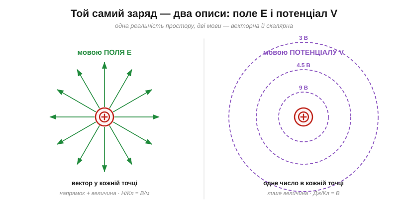
*Рис. 1.1.6.1. Ліворуч — мова **поля**: у кожній точці стрілка-вектор E (куди й з якою силою штовхне заряд). Праворуч — мова **потенціалу**: у кожній точці одне число V (яка енергія на кулон). Це не два явища, а два портрети одного.*

Обидва описи містять усю інформацію про електричний стан простору довкола заряду — просто подану по-різному: **векторно** (E) чи **скалярно** (V). І, що головне, вони **жорстко пов'язані**: знаючи один усюди, можна відновити другий. Подивімося, як саме.

### Топографічна карта: висота і схил

Найкраща аналогія — **топографічна карта**, і тепер ми можемо розкрити її до кінця.

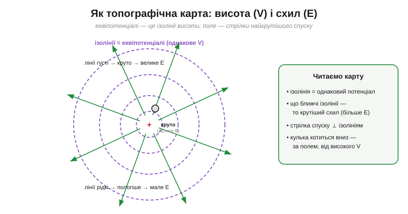
*Рис. 1.1.6.2. Еквіпотенціалі — це **ізолінії висоти** (однаковий потенціал V), як на карті гір. Поле E — це **стрілки найкрутішого спуску**: перпендикулярні до ізоліній і напрямлені вниз. Де ізолінії густі — там схил крутий, тобто E велике; де рідкі — пологий, E мале.*

На карті висот ви ніколи не малюєте «стрілки крутості» окремо — їх і так видно з **густоти** ізоліній. Так само й тут: потенціал (висота) повністю задає поле (схил). Потенціал — це **де ви на рельєфі**; поле — це **куди й як круто покотитеся**. Одне випливає з другого.

### Точний зв'язок: поле — це крутість потенціалу

Переведімо аналогію в точне правило. Поле дорівнює тому, **наскільки швидко падає потенціал на одиниці довжини**, і напрямлене в бік **меншого** потенціалу:

```
E = −(нахил V уздовж напрямку)      (в однорідному полі: E = ΔV / d)
```


*Рис. 1.1.6.3. Зверху — профіль потенціалу V(x), знизу — відповідне поле E(x). Там, де V падає **круто**, поле **велике**; де V майже рівний — поле близьке до нуля. Поле — це похідна (нахил) потенціалу, узята зі знаком «мінус» (бо дивиться вниз).*

Знак «мінус» лише фіксує напрямок: поле тягне додатний заряд **туди, де потенціал нижчий** (з гори вниз). А величина — це чиста крутість. Саме тому одиниця поля — **В/м** (вольт на метр): вона буквально каже «скільки вольтів потенціалу спадає на кожному метрі». Н/Кл і В/м — те саме число, два записи однієї величини.

У просторі (не лише вздовж однієї осі) поле вказує в бік **найкрутішого** спаду потенціалу — туди, куди покотилася б кулька на горбистому рельєфі. Математики звуть це «градієнтом, узятим зі знаком мінус», але образ простий: серед усіх можливих напрямків поле обирає той, де потенціал падає найшвидше, і його величина дорівнює тій максимальній крутості.

> 🧮 Як саме з карти потенціалу V(x, y, z) дістати вектор поля в кожній точці — формально, через частинні похідні (E = −∇V): [Градієнт: із карти потенціалу — у вектор поля](ch01-s6-m-gradient.md).

### Провідник — увесь на одному потенціалі

Ця єдність поля й потенціалу дає негайний практичний висновок про провідники. У рівновазі всередині провідника поля **немає**: будь-яке поле розігнало б вільні заряди, і ті рухалися б, аж доки своїм перерозподілом цілком його не погасили б (§1.1.1). А якщо E = 0 всюди в металі, то й потенціал там **не змінюється** — увесь провідник, від краю до краю, сидить на **одному** значенні V. Його поверхня є еквіпотенціаллю, тож лінії поля впираються в метал під прямим кутом (§1.1.3).

Звідси буденні, але важливі речі: дріт — це майже еквіпотенціаль (по всій довжині приблизно одна напруга), заземлений корпус приладу — увесь на 0 В, а суцільний полігон міді на платі — одне V для всіх під'єднаних до нього точок. Звичка бачити метал як «одну висоту» щодня рятує від плутанини.

> 🔧 **Навіщо це.** Ось чому напруженість поля міряють у **В/м** (чи В/мм, кВ/мм у даташитах ізоляції). Коли пишуть «електрична міцність ізолятора 20 кВ/мм», це і є гранична **крутість потенціалу**, яку матеріал витримує, перш ніж пробитися. Поле й напруга тут — буквально та сама величина, поділена на товщину.

### Чому дві мови? Бо одну рахувати легше

Якщо це одне явище, навіщо тримати обидві мови? Бо для різних задач зручна різна. І головна перевага потенціалу — він **скаляр**, а скаляри додавати куди легше за вектори.


*Рис. 1.1.6.4. Щоб знайти сумарний ефект кількох зарядів у точці, потенціали просто **додають як числа** (3 В + 2 В = 5 В). А поля доводиться складати **як вектори** — з напрямками й проєкціями. Тому на практиці часто спершу рахують V (легко), а тоді дістають E як його нахил.*

Це не дрібниця, а робоча стратегія фізика: складну задачу розв'язують у **скалярній** мові потенціалу (де все зводиться до додавання чисел), а коли потрібне поле — беруть нахил готового потенціалу. Вектор отримують наприкінці, а не тягнуть із собою через увесь розв'язок.

Так само чинять і серйозні інструменти. Програми, що рахують електростатику (від моделювання ізоляції до ємнісних давачів), майже завжди обчислюють спершу **скалярний** потенціал по всьому простору, а вже потім беруть його нахил, щоб дістати векторне E. Бо розв'язувати рівняння для одного числа в кожній точці легше, ніж одразу для трьох компонент вектора. Перевага суто математична — та користуються нею всі.

> ⚙️ А як саме комп'ютер «обчислює V по всьому простору», коли формули немає? Напрочуд просто — усереднюючи сусідів на сітці, доки картина не застигне: [Потенціал на сітці: метод релаксації](ch01-s6-a-relaxation.md).

### Словник перекладу

Зведімо обидві мови в один словник — це і є суть підрозділу.


*Рис. 1.1.6.5. Кожен рядок — те саме поняття, сказане через поле і через потенціал. Поле — вектор, «крутість», В/м, сила на заряд; потенціал — скаляр, «висота», В, енергія на заряд. Задавши одне з двох усюди, друге однозначно відновлюють.*

> 🔧 **Навіщо це.** У роботі з колами ви майже завжди говоритимете мовою **потенціалу** — «напруга у вузлі», «5 вольтів тут», «земля там». Це скалярна, проста мова, і її цілком вистачає, поки струм біжить дротами. А до мови **поля** перемикаються там, де важлива геометрія всередині матеріалу: ізоляція, пробій, зазори, конденсатори, антени. Уміти переходити між мовами — і знати, що це одне явище, — означає не плутатись, коли в даташиті поряд стоять і вольти, і В/мм.

### Дві тонкощі наостанок

**Вибір нуля не впливає на поле.** Згадаймо з §1.1.4: «нуль» потенціалу обираємо довільно. Та помітьте — на **поле** цей вибір не діє зовсім. Зсунь опорний рівень — і всі потенціали зміняться на ту саму сталу, але їхні **різниці** (а отже, й нахили, тобто поле) лишаться ті самі. Поле «не знає» про наш нуль: воно залежить лише від того, як V **змінюється**, а не від абсолютного значення. Тому V має довільну добавку, а E — однозначне.

**Куди рухаються заряди.** Додатний заряд скочується туди, де потенціал **нижчий** (за полем, з гори). А від'ємний — навпаки, «падає вгору», до **вищого** потенціалу. Суперечності нема: обидва прямують туди, де менша їхня потенціальна **енергія**; просто для від'ємного заряду менша енергія — там, де більший V. Поле штовхає різні знаки в протилежні боки — точно як і має бути за F = qE.

**Приклад (від потенціалу до поля).** В ізоляторі потенціал спадає з 12 В до 0 на товщині 3 мм. Яке там поле?

```
E = ΔV / d
E = 12 В / (3 × 10⁻³ м)
E = 4000 В/м  (= 4000 Н/Кл), напрямлене в бік меншого потенціалу
```

**Приклад (потенціал — додаванням чисел).** Два заряди: +2 нКл за 3 см від точки P і +1 нКл за 6 см. Який потенціал у P?

```
V₁ = k·Q₁/r₁ = (8.99×10⁹)(2×10⁻⁹)/0.03 ≈ 599 В
V₂ = k·Q₂/r₂ = (8.99×10⁹)(1×10⁻⁹)/0.06 ≈ 150 В

V = V₁ + V₂ ≈ 749 В     (просто сума — бо потенціал скалярний)
```

Зверніть увагу, як легко пройшов другий приклад: жодних напрямків, жодних проєкцій — лише додавання двох чисел. Поле в тій самій точці порахувати було б помітно марудніше (довелося б складати два вектори). У цьому й уся практична цінність розуміння, що **це одне явище**: завжди можна обрати простішу мову.

**Приклад (зсув нуля не чіпає різниці).** Нехай відносно нескінченності точка A має 5 В, а B — 2 В. Перенесімо «нуль» у точку B:

```
було:    V_A = 5 В,  V_B = 2 В   →  ΔV = 3 В
стало:   V_A = 3 В,  V_B = 0 В   →  ΔV = 3 В
```

Окремі потенціали впали на 2 В, а от **різниця** (3 В) — а отже, і поле, що від неї залежить, — лишилися незмінні. Саме тому абсолютне значення V — питання угоди, а фізику несе різниця.

---

Підсумок §1.1.6: поле **E** й потенціал **V** — не два окремі поняття, а **дві мови одного явища**, як схили й висоти на одній карті. Їх жорстко пов'язує одне правило: поле — це **крутість** потенціалу (E = −нахил V; у В/м), а потенціал — **накопичена** дія поля вздовж шляху. Векторну мову (E) беруть, коли важлива геометрія й сила; скалярну (V) — коли зручніше додавати числа, тобто майже завжди в колах. Маючи одне з двох усюди, друге відновлюють однозначно. На цьому ми зібрали всі цеглинки розділу — заряд, силу, поле, енергію, потенціал, вольт. Лишається **зв'язати їх в одну струнку картину**.

---

## 1.1.7 Зведення докупи

Ми пройшли довгий шлях — від питання «що таке заряд?» до тонкої єдності поля й потенціалу. Тепер варто на мить зупинитися й глянути на весь розділ **згори**: не щоб переказати його (це було б марно), а щоб побачити, що всі шість тем — насправді **одна струнка історія**, де кожен крок неминуче випливав із попереднього.

### Логічний ланцюг: як одне вело до іншого

Озирнімося на дорогу, якою ми йшли, — і помітьмо, що вів нас **ланцюг питань**, де кожна відповідь породжувала наступне.


*Рис. 1.1.7.1. Увесь розділ на одній мапі. Заряд (§1.1.1) → «а наскільки сильно діє?» → закон Кулона (§1.1.2) → «що передає силу крізь порожнечу?» → поле (§1.1.3) ↔ потенціал (§1.1.4–1.1.5), що виявилися одним явищем (§1.1.6). Жодне поняття не висить окремо — кожне народилося з потреби, яку лишило попереднє.*

Почали ми із **заряду** (§1.1.1) — первинної властивості матерії, двох родів, квантованої й незнищенної. Та сказати, що заряди «діють одне на одного», було замало; постало питання **наскільки сильно** — і §1.1.2 дав закон Кулона з його оберненим квадратом. Але закон сили лишив глибшу загадку: **що саме** передає цю силу через порожній простір? Відповіддю стало **поле** (§1.1.3) — посередник, що змінює сам простір. Коли ж заряд під дією поля рушав, поставало питання **енергії** — і ми ввели роботу, потенціальну енергію й **потенціал** (§1.1.4), а з ним і головну одиницю — **вольт = Дж/Кл** (§1.1.5). Нарешті §1.1.6 показав, що поле й потенціал — не дві речі, а **дві мови** одного явища. Кожна ланка тут — не довільний розділ підручника, а **вимушений наступний крок**.

### Одна причинна історія

Якщо логічний ланцюг — це послідовність наших **питань**, то є й простіший, фізичний погляд: що насправді **відбувається** в просторі. І весь розділ вкладається в одне речення з трьох слів: **джерело → простір → ефект**.


*Рис. 1.1.7.2. Заряд-джерело не дотягується до іншого заряду «через порожнечу». Він **змінює простір** довкола — наповнює його полем E і потенціалом V. А вже цей змінений простір діє на будь-який інший заряд: штовхає його силою F = qE й наділяє енергією W = qV. Уся електростатика — це ці три стадії.*

Ось чому поле виявилося такою плідною ідеєю (згадаймо Фарадея): воно прибрало містику «дії на відстані», замінивши її ланцюжком **локальних** причин. Заряд тут — причина; поле/потенціал — стан простору, який вона створює; сила й енергія на інший заряд — наслідок. Заряд, поле, потенціал, вольт — це не чотири окремі факти для зубріння, а чотири погляди на **одну** просту картину.

### Наскрізні мотиви

Варто помітити кілька **візерунків**, що проходять крізь увесь розділ, — бо вони повторюватимуться й далі. Перший — знаменник «**на заряд**»: і поле (E = F/q), і потенціал (V = W/q) ми дістали, поділивши щось на заряд, щоб мати властивість самого простору, незалежну від пробного тіла. Другий — пара «**крутість і висота**»: те, що поле спадає як 1/r², а потенціал як 1/r, — це той самий зв'язок «нахил проти накопиченого». Третій — **аналогія з гравітацією**: висота, схил, запасена енергія супроводжували нас від §1.1.2 до §1.1.6. І скрізь діяло **збереження** — заряду, енергії. Упізнавати ці мотиви — означає вчитися швидше: нове часто виявляється старим у новому вбранні.

**Приклад (увесь розділ в одному розрахунку).** З'єднаймо все. Маємо джерело — точковий заряд Q = +10 нКл. Розгляньмо точку за 5 см від нього.

```
поле там:      E = k·Q/r² = (8.99×10⁹)(10×10⁻⁹)/(0.05)² ≈ 3.6×10⁴ Н/Кл
потенціал там: V = k·Q/r  = (8.99×10⁹)(10×10⁻⁹)/(0.05)  ≈ 1800 В
сила на +2 нКл: F = qE = (2×10⁻⁹)(3.6×10⁴) ≈ 7.2×10⁻⁵ Н
енергія, коли цей заряд відійде з 5 см на 10 см:
   V(10 см) = k·Q/0.10 ≈ 900 В
   ΔV = 1800 − 900 = 900 В
   W = q·ΔV = (2×10⁻⁹)(900) ≈ 1.8×10⁻⁶ Дж = 1.8 мкДж
```

Один заряд-джерело — і ми за хвилину дістали поле, потенціал, силу й енергію. Усі поняття розділу спрацювали разом, як деталі одного механізму. Якщо цей приклад читається легко — розділ засвоєно.

> 🔧 **Навіщо це.** Тепер ви володієте **робочим словником** усієї електроніки: заряд (кулон), поле (В/м), потенціал і напруга (вольт = Дж/Кл), енергія (qV), а ще — інтуїцією «висоти й схилу» та звичкою бачити провідник як одну еквіпотенціаль. Це той фундамент, на якому стоятиме все подальше: струми, опір, кола, сигнали. Жодну схему не можна по-справжньому зрозуміти, не відчуваючи за «вольтами» саме **енергію на заряд**.

### Перш ніж рушити далі — одна показова перевірка

Фундамент закладено: ми зібрали всю **абетку** електроніки — заряд, силу, поле, потенціал, вольт — і побачили, що це не розрізнені факти, а одна струнка картина. Та перш ніж пускати заряд у рух (а саме це робить наступний розділ), варто побачити цю абетку **в дії — усю одразу**. Найкраща така перевірка — явище, яке не вводить жодного нового поняття, а лише змушує всі вже відомі працювати разом.

Таким явищем є **екранування**, або **клітка Фарадея**. Щоб зрозуміти, чому замкнута металева оболонка робить простір усередині «сліпим» до зовнішніх полів, доведеться згадати водночас: вільні заряди у провіднику (§1.1.1), суперпозицію полів (§1.1.2–§1.1.3), те, що поле біля провідника перпендикулярне до поверхні (§1.1.3), і що провідник — одна еквіпотенціаль (§1.1.6). Якщо все це склалося в голові в єдину картину — наступна тема прочитається легко; якщо ні — вона якраз і допоможе її скласти. До неї й перейдемо у §1.1.8.

І ще одне, що варто усвідомити, — **вагу** цього фундаменту для всього курсу. Хоч би що ми вивчали далі — давач, що віддає мілівольти; логічний рівень, що є просто напругою; транзистор, яким керує поле на затворі; антену, що випромінює поле, — усе це говоритиме мовою заряду, поля, потенціалу й енергії на заряд. Опанувавши цей розділ, ви опанували абетку, якою написано решту, — і до неї ще не раз варто буде повернутися, тепер уже як до опори.

---

## 1.1.8 Клітка Фарадея й екранування

Попередня тема зібрала докупи всю абетку розділу. Тепер — її перша велика перевірка, і заразом одне з найкорисніших явищ практичної електроніки. Поставмо пряме інженерне питання: як **захистити** щось від електричного поля? Як зробити куточок простору, куди зовнішні заряди не дотягуються, — щоб тонкий сигнал давача не тонув у наводках, а чутлива мікросхема не ловила кожну іскру довкола? Відповідь напрочуд проста й трохи несподівана: **оточити його провідником**. Усередині замкнутої металевої оболонки — навіть зробленої з самої лиш сітки — електричного поля **немає зовсім**. Це і є **екранування** (*shielding*, *screening*), а саму оболонку звуть **кліткою Фарадея** (*Faraday cage*). І найкрасивіше те, що ми вже маємо все, щоб зрозуміти, *чому*: жодного нового закону тут не знадобиться.

### Дослід, що й досі вражає

Майкл Фарадей довів це видовищно. 1836 року він збудував велику кімнату-куб завбільшки кілька метрів, оббиту металевою фольгою й дротяною сіткою, поставив її на ізолятори й зарядив до високої напруги — так, що зовні з неї сипалися іскри, а клаптики паперу підлітали від наелектризованих стін. А тоді спокійно зайшов **усередину** з найчутливішими електроскопами, які мав, і шукав хоч натяк на поле. Не знайшов нічого: усередині прилади лишалися мертвими, наче зовні не було жодного заряду.

Ще раніше, простішим дослідом із металевим **цеберком для льоду** (звідси й назва — *ice-pail experiment*, 1843), Фарадей показав другий бік того самого явища: внесений усередину заряд наводить рівно такий самий заряд на зовнішній стінці, проте крізь сам метал його поле не проходить. Обидва досліди впираються в один факт: замкнутий провідник цілком розділяє «всередині» й «зовні». Поясніть цей факт — і ви володієте екрануванням. А пояснити його можна, спираючись лише на §1.1.1–§1.1.6.

### Чому в порожнині поля немає

Почнімо з найголовнішого — зі **вільних зарядів** у провіднику (§1.1.1). Метал повний електронів, які можуть гуляти по всьому об'єму. Піднесімо до куска металу зовнішнє поле — хай однорідне, спрямоване праворуч.


*Рис. 1.1.8.1. Провідник у зовнішньому полі. Вільні електрони зміщуються, наводячи **−** на одному боці й **+** на іншому; зовнішні лінії поля впираються в метал перпендикулярно (§1.1.3) і до порожнини не доходять — усередині **E = 0**.*

Поле штовхає вільні електрони (вони від'ємні) **проти** свого напрямку — ліворуч. Електрони зміщуються й накопичуються на лівій поверхні, лишаючи правий бік із нестачею електронів, тобто **додатним**. Так на поверхнях металу самі собою з'являються **наведені заряди** (*induced charges*): мінус там, куди поле зганяє електрони, плюс — звідки воно їх забирає.

Але тут і ховається вся суть. Ці наведені заряди **самі створюють поле** — і всередині металу воно спрямоване назустріч зовнішньому (від плюса праворуч до мінуса ліворуч). Поки всередині лишається хоч якесь сумарне поле, воно й далі штовхає електрони — отже, рівновага ще не настала. Заряди перестануть рухатися лише тоді, коли їхнє власне поле **точно зрівноважить** зовнішнє, і всередині металу настане **E = 0**.

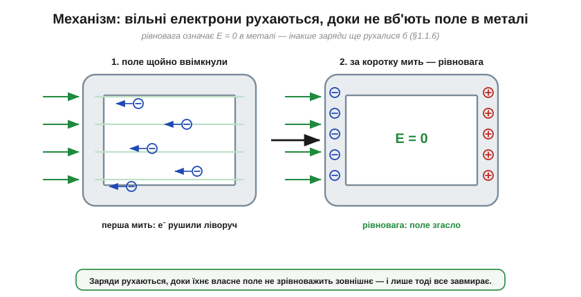
*Рис. 1.1.8.2. Звідки береться нуль. Тільки-но прикладено поле, електрони рушають проти нього (ліворуч); вони рухаються доти, доки наведені заряди не створять рівно протилежне поле — і в металі настане рівновага з E = 0.*

Це не випадковий збіг, а **неминучість**, і міркування варте того, щоб його закарбувати. У провіднику, що дійшов рівноваги (де заряди вже не рухаються), поле всередині **мусить** дорівнювати нулю — інакше воно й далі ганяло б вільні заряди, і рівноваги не було б за означенням. Саме це ми вже виводили в §1.1.6, коли казали, що провідник — одна еквіпотенціаль. А якщо E = 0 у самому металі, то заряди на поверхні неодмінно влаштувалися так, щоб скрізь усередині погасити зовнішнє поле. Метал не «зупиняє» поле стіною — він **відповідає** на нього власним, рівно протилежним.

> 🔧 **Навіщо це.** Ось чому глуха металева коробка — найдешевший і найнадійніший спосіб захистити електроніку від зовнішніх електричних наводок. Не треба ні живлення, ні складної схеми: вільні електрони в стінках самі, без жодної команди, миттєво перебудовуються під будь-яке зовнішнє поле й гасять його всередині. Корпус приладу, екран кабелю, бляшаний кожух над чутливим вузлом — усе це працює на одному цьому факті.

### Це просто суперпозиція

Корисно глянути на те саме під кутом §1.1.2–§1.1.3 — мовою **суперпозиції**. Поле в будь-якій точці порожнини — це сума двох полів: зовнішнього й того, що створюють наведені заряди.


*Рис. 1.1.8.3. Те саме мовою суперпозиції: усередині складаються зовнішнє поле (праворуч) і поле наведених зарядів (ліворуч). Рівні за модулем, протилежні за напрямком — сума нуль у кожній точці порожнини.*

Зовнішнє поле однорідне й дивиться праворуч. Наведені заряди розташувалися так, що їхнє сумарне поле всередині дивиться ліворуч — і рівно настільки ж сильне. Складіть два вектори, однакові за модулем і протилежні за напрямком, — дістанете нуль. У кожній точці порожнини. Ніякої магії: це та сама суперпозиція, з якою ми складали поля двох зарядів у §1.1.3, тільки тепер зарядів багато, і природа сама розставила їх на поверхні в єдино можливу рівноважну конфігурацію — ту, що гасить поле всюди всередині.

Помітьте, наскільки це сильніше за просту інтуїцію «метал не пропускає». Крізь нерухомий метал поле спокійно проходило б — якби заряди не ворухнулися. Екранує не речовина сама по собі, а **перерозподіл** її вільних зарядів. Саме тому екран мусить бути **провідником**: в ізоляторі заряди не вільні, перебудуватися й погасити поле вони не можуть, тож скляна чи пластикова коробка від поля не захищає.

### Порожнина — одна еквіпотенціаль

З того, що E = 0 у металі, негайно випливає висновок про **порожнину** всередині. Якщо видовбати в куску металу порожнину (не вклавши туди жодного заряду), у ній теж буде E = 0. Чому? Поле скрізь у металі нульове, а порожнина оточена металом з усіх боків; зайти полю в неї немає звідки — будь-яка лінія мусила б початися й скінчитися на стінці, але вздовж рівноважної поверхні провідника поля нема (§1.1.3, §1.1.6). Порожнина «успадковує» нульове поле металу. А якщо E = 0, то й потенціал у ній **не змінюється** (§1.1.6): уся порожнина разом зі стінками сидить на **одному** значенні V.

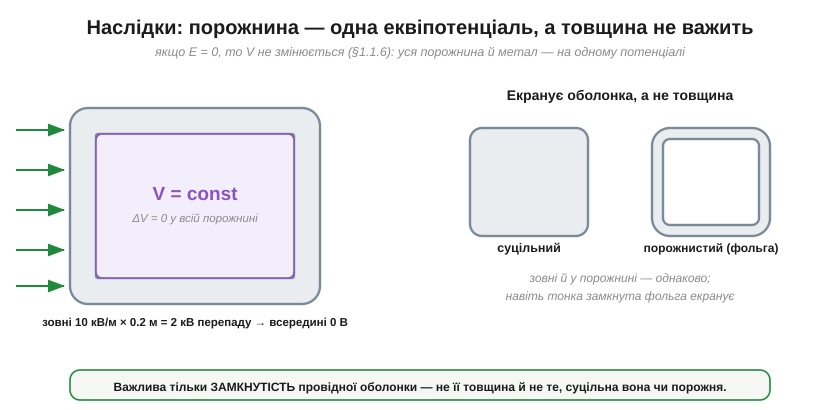
*Рис. 1.1.8.4. Якщо E = 0, то V однаковий у всій порожнині (ліворуч): зовнішнє «розгойдування» на тисячі вольтів усередині стає нулем. Праворуч: екранує сам факт замкнутої оболонки — суцільний брусок і тонка фольга роблять це однаково.*

Звідси два практичні наслідки. Перший: для екранування **байдуже, суцільний провідник чи порожнистий** — зовнішні заряди розташовуються на зовнішній поверхні однаково, а все всередині оболонки однаково захищене. Другий, ще приємніший: **товщина оболонки не має значення**. Екранує не маса металу, а сам факт замкнутої провідної поверхні. Тонесенька суцільна фольга захищає так само, як товста бронзова плита, — бо й тонкому шару вистачає вільних електронів, щоб вишикуватися й погасити поле. Важлива тільки **замкнутість**.

**Приклад (наскільки оболонка «сплощує» поле).** Хай зовні діє однорідне поле E = 10 кВ/м, а наш екран — коробка завглибшки d = 0.2 м. Якби поле проникало всередину, між протилежними стінками порожнини була б різниця потенціалів (за E = ΔV/d із §1.1.4):

```
без екрана:  ΔV = E · d = 10000 В/м × 0.2 м = 2000 В   (2 кВ «розгойдування»)
з екраном:   E = 0  →  ΔV = 0 В
```

Дві кінцівки чутливого вузла, рознесені на 20 см, замість двох кіловольтів наводки бачать **нуль**. Ось масштаб того, що дає звичайна замкнута коробка.

### Чому годиться навіть сітка

Найдивовижніше у Фарадеєвому досліді — що його кімната була не суцільна, а **сітчаста**. І все одно екранувала. Як таке можливо, якщо в сітці повно дірок?

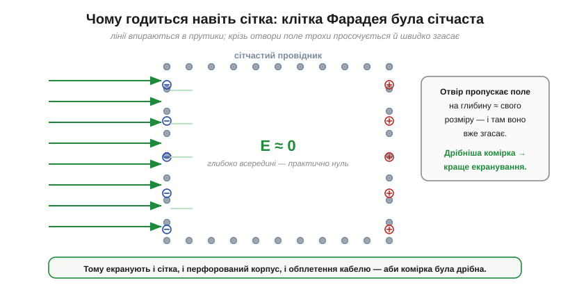
*Рис. 1.1.8.5. Чому екранує навіть сітка. Лінії впираються в прутики; навпроти отворів поле просочується лише на глибину порядку розміру комірки й там згасає. Дрібніша комірка — краще екранування.*

Відповідь — у тому, як поводиться поле біля отвору. Лінії впираються в металеві прутики (там, на них, сідають наведені заряди), і лише навпроти самих отворів поле трохи **просочується** всередину. Та просочується неглибоко: воно «загладжується» й згасає на відстані порядку **розміру комірки**. Якщо комірки дрібні проти розмірів самої клітки, то вже на невеликій глибині від стінки поле практично нульове, а в центрі його немає й поготів. Тому суцільність не обов'язкова — досить частої провідної сітки.

> 🔧 **Навіщо це.** Це пояснює цілий клас рішень. Сітка на дверцятах мікрохвильовки лишає простір прозорим для ока, але втримує те, що треба втримати, — бо її отвори набагато менші за нього. Перфорований металевий корпус приладу провітрюється, але екранує. А обплетення (екран) сигнального кабелю — це та сама клітка Фарадея, тільки скручена в трубку навколо жили. Скрізь діє одне правило: **отвори мають бути дрібними** проти того, від чого захищаєшся.

### Зворотний бік: заряд усередині

Досі ми захищали порожнину від поля **ззовні**. А що, як заряд опиниться **всередині** порожнини? Це і є дослід із цеберком — і відповідь тут тонша.


*Рис. 1.1.8.6. Заряд усередині. Усі лінії від +q кінчаються на внутрішній стінці, наводячи там рівно −q; на зовнішній виступає +q (метал нейтральний). Ліворуч: незаземлена оболонка — зовні є поле від сумарного заряду. Праворуч: заземлена — зовнішній заряд стікає, і зовні не лишається нічого.*

Покладімо в порожнину додатний заряд +q. Його поле тепер є всередині — нікуди ж йому подітися. Лінії цього поля йдуть від +q навсібіч і впираються у внутрішню стінку, наводячи на ній від'ємний заряд. Скільки саме? Рівно −q. Адже всередині металу поле нульове, тож **жодна** лінія від +q не може пройти крізь стінку назовні — усі до одної мусять закінчитися на внутрішній поверхні, а отже, зібрати там сумарний заряд точно −q. А оскільки метал у цілому лишається нейтральним (збереження заряду, §1.1.1), то стільки ж заряду, скільки «забрала» внутрішня стінка, бракує деінде — і на **зовнішній** поверхні виступає +q.

**Приклад (бухгалтерія наведених зарядів).** Внесімо в ізольовану металеву коробку заряд +5 нКл:

```
заряд у порожнині:             +5 нКл
наведено на ВНУТРІШНІЙ стінці:  −5 нКл   (усі лінії від +q кінчаються тут)
наведено на ЗОВНІШНІЙ стінці:   +5 нКл   (бо коробка в цілому нейтральна)
```

Тепер видно, що саме ховає, а що видає оболонка. **Зовні** поле є — його дає +5 нКл на зовнішній поверхні. Але — і це головне — його картина залежить лише від **форми зовнішньої поверхні**, а не від того, де саме всередині лежить заряд і скільки тих зарядів. Совай заряд по порожнині, дроби його на частини — зовнішнє поле не ворухнеться, поки сумарний внутрішній заряд той самий. Оболонка приховує від зовнішнього світу **всю внутрішню кухню**, лишаючи назовні єдине число — повний заряд усередині.

А якщо й це число сховати? Тоді оболонку **заземлюють** (§1.1.1). Зайвий +q із зовнішньої поверхні стікає в землю — і зовні не лишається **нічого**: ні поля, ні сліду внутрішнього заряду. Заземлений провідник екранує в **обидва** боки: зовнішнє поле не входить усередину, а внутрішнє не виходить назовні.

### Заземлювати чи ні

Тут варто розвіяти поширену плутанину. Чи **обов'язково** заземлювати екран? Залежить від того, від чого захищаємось.

Щоб уберегти порожнину від **зовнішнього** поля, заземлення **не потрібне**: ми ж бачили — вільні заряди оболонки гасять зовнішнє поле в порожнині самі, хай навіть коробка ні до чого не під'єднана. Незаземлена металева коробка вже екранує те, що всередині.

Проте заземлення дає три важливі речі. По-перше, воно **фіксує потенціал** оболонки (а з нею й порожнини) на нулі — інакше «плаваюча» коробка може набрати власний потенціал від випадкових зарядів. По-друге, воно стікає будь-який наведений на зовнішній поверхні заряд, отже, екранує й у зворотний бік — від внутрішніх джерел назовні. По-третє, на практиці зовнішнє поле рідко буває геть статичним; заземлений екран дає тим зарядам, що ними «гойдає» мінливе зовнішнє поле, шлях стекти, а не накопичуватись. Тому в реальних приладах екран майже завжди **з'єднують із землею** — це з тих звичок, що недорого коштують і багато рятують.

> 🔧 **Навіщо це.** Звідси правило, яке ще не раз спливе: металевий корпус приладу під'єднують до спільного нуля (землі) схеми. Тоді корпус і екранує внутрішні вузли від зовнішніх полів, і сам не «світить» назовні, і не плаває під випадковим потенціалом, за який неприємно взятися рукою. «Заземли кожух» — одна з найдешевших порад у всій електроніці.

### Де екранування не спрацьовує

Чесно окреслимо й межі — бо клітка Фарадея не всемогутня. По-перше, вона безсила там, де **порушено замкнутість**: широка щілина, довгий проріз, недбалий стик двох половинок корпусу — і крізь них поле затікає, як протяг крізь шпарину. Тому в екрануванні дрібниці на кшталт того, чи добре прилягає кришка, важать незрідка більше за товщину стінок.

По-друге, усе сказане строго стосується **сталих** полів (електростатики, якою й обмежений цей розділ). Поля, що **швидко змінюються в часі**, екрануються за тим самим принципом, але з поправками, які залежать від матеріалу й розміру отворів; до них ми повернемося пізніше, коли матимемо чим їх описати.

І по-третє — застереження, яке варто почути одразу, щоб не переоцінити захист. Клітка Фарадея екранує **електричне** поле. А ось сталого **магнітного** поля вона майже не тримає: компас усередині металевої коробки спокійно показує на північ. Магнетизм — окреме явище з власними правилами, і до нього ми ще дійдемо; поки що просто запам'ятаймо, що «екран від електрики» й «екран від магніту» — різні речі.

### Клітки Фарадея довкола нас

Варто на мить роззирнутися — і ви впізнаєте це явище всюди.

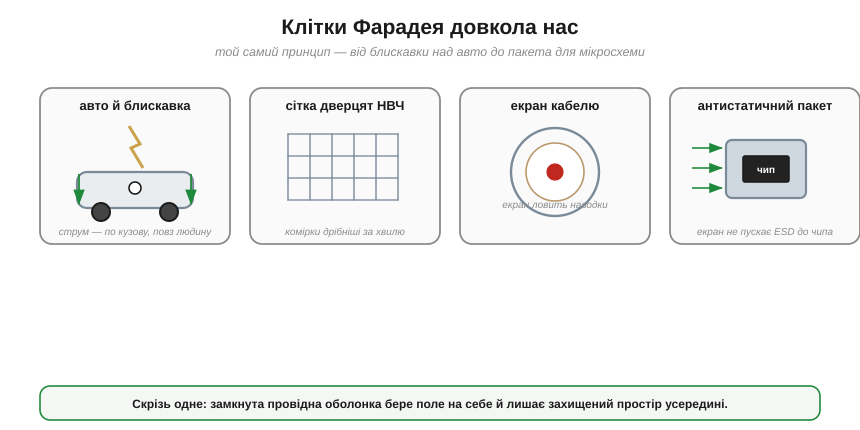
*Рис. 1.1.8.7. Те саме явище в побуті: кузов авто відводить блискавку по обшивці; сітка дверцят НВЧ-печі втримує хвилі; екран кабелю перехоплює наводки; металізований пакет береже мікросхему від ESD.*

Авто чи літак під час грози — велика клітка Фарадея: блискавка б'є в метал і розтікається по **зовнішній** обшивці, лишаючи людей усередині неушкодженими (рятують саме провідні стінки, а зовсім не гумові шини, як часто думають). Ліфт чи залізобетонна коробка з арматурою глушать сигнал телефона з тієї самої причини. Металевий корпус осцилографа береже його тонку електроніку від наводок цеху. Екран коаксіального кабелю обвиває сигнальну жилу й перехоплює завади на себе. А чутливі мікросхеми возять у **антистатичних екранувальних пакетах** — металізованих торбинках, що є кишеньковою кліткою Фарадея й не пускають до виводів ту саму статику, з якої починався цей розділ (§1.1.1). Одне явище — і ціле гроно щоденних рішень.

> 🔌 Як ці екрани роблять і — головне — як їх правильно під'єднати в реальному пристрої (корпус, провідні прокладки, заземлення оплетення кабелю по колу): [Екран навколо нас](ch01-s8-c-everyday-shields.md).

### Місток далі: від нерухомих зарядів — до потоку

На цьому ми по-справжньому завершуємо розділ — і то найкращим чином: останнє явище не додало жодного нового поняття, а лише змусило всі попередні спрацювати разом. Та зверніть увагу: геть усе, про що ми говорили, стосувалося зарядів, які зрештою **стоять на місці**. Навіть наведені заряди клітки, перебігши на свої поверхні, завмирають у рівновазі. Ми навчилися казати, де потенціал вищий, а де нижчий, — але заряд іще нікуди не тече.


*Рис. 1.1.8.8. Підсумок розділу й місток далі. Різниця потенціалів — це **запасена готовність** штовхати заряд: поки коло розімкнене, напруга є, а струму нема. Дай провідний шлях — і заряд потече. Цей рух — струм, тема Розділу 1.2.*

У цьому й уся напруга: вона — як піднята вгору вода чи зведена пружина, **запасена готовність** до руху, що чекає лише дороги. Поки коло розімкнене, напруга є, а струму немає: заряди «хочуть» рушити, та не мають шляху. А з'єднай високий потенціал із низьким провідником — і заряд ринеться вниз. Цей **рух заряду** і є струм; із нього виростуть опір, нагрів і цілі електричні кола — тобто майже вся решта курсу. Фундамент закладено; час пустити заряд у рух.

> ▶️ Далі: [Розділ 1.2 — Напруга, струм і провідність](../ch02-voltage-current-conduction/ch02-voltage-current-conduction.md)

