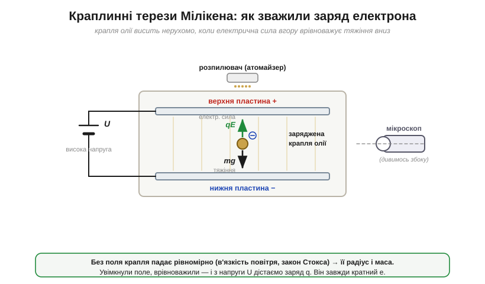
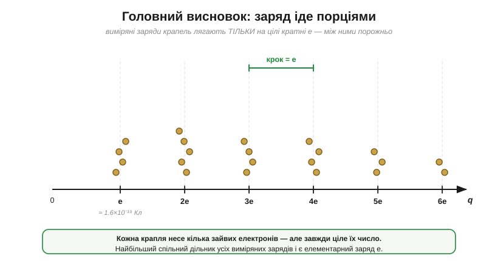
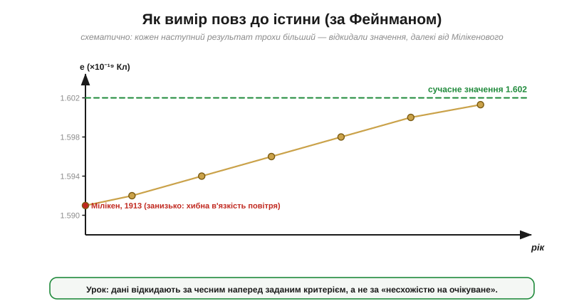

# 📜 Мілікен і краплі олії: як «зважили» заряд електрона

> Історична вставка до [§1.1.1 «Заряд — фундаментальна властивість матерії»](ch01-charge-field-potential.md). У §1.1.1 ми просто **назвали** число — елементарний заряд e = 1.602×10⁻¹⁹ Кл — і сказали, що заряд іде неподільними порціями. Але звідки це відомо? Як виміряти заряд того, чого не видно, не вхопиш пальцями й не покладеш на терези? Це історія про десятирічне полювання на одне число, про аспіранта, чиє ім'я зникло з головної статті, про запеклу суперечку, чи існує взагалі неподільна порція заряду, — і про знаменитий урок, як легко науковець дурить сам себе.

На початку XX століття про електрон уже дещо знали — але не його заряд. **Джозеф Джон Томсон** (*Joseph John Thomson*, 1856–1940) у 1897 році показав, що катодні промені — це потік однакових легких частинок, і виміряв їхнє **відношення** заряду до маси, e/m. Та саме по собі це відношення не давало ні e, ні m окремо: велике e з великою масою і мале e з малою масою дали б однакове e/m. Щоб розчепити їх, треба було незалежно зважити **щось одне** — найкраще сам заряд e. А ще лишалося глибше питання: чи заряд узагалі **неподільний**? Може, e — це просто середнє по чомусь неперервному, як середній зріст по натовпу? Відповісти могло тільки пряме вимірювання заряду окремих крихітних тілець. Саме за нього й узявся в Чиказькому університеті **Роберт Ендрюс Мілікен** (*Robert Andrews Millikan*, 1868–1953).

---

## Чому це було так важко

Уявіть масштаб задачі. Заряд однієї краплі — мільярдні частки кулона, сила на неї — частки мільйонної грама. Заряд не сидить на місці: на вологому повітрі він стікає. А саме тільце настільки мале, що його ледь видно в мікроскоп як цятку світла. Зважити треба, по суті, тінь.

Перші підходи — і Томсонова школа в Кембриджі, і сам молодий Мілікен — спиралися на **хмари**. Іонізували вологе повітря, на іонах конденсувалася водяна пара, утворюючи туманну хмарку заряджених краплинок; за швидкістю, з якою хмарка осідала під тяжінням, та за її повним зарядом оцінювали заряд, що припадає на одну краплю. Біда в тому, що хмара — це суцільна статистика: краплі різні, полічити їх точно неможливо, а головне — **вода випаровується**, і поки тривав дослід, краплі всихали просто на очах, спотворюючи геть усе. Мілікен бився з цим кілька років, аж доки не дійшов простої, але вирішальної думки: годі морочитися з хмарою — треба впіймати **одну-єдину** краплю й стежити за нею скільки заманеться.

## Крапля, що не випаровується

Щоб крапля жила досить довго, вона мусила перестати всихати. Розв'язок виявився буденним до краси: узяти замість води **олію** — малолетку годинникову чи вакуумну оливу, у якої тиск насиченої пари мізерний. Така крапля не міняє маси годинами. Звичайний пульверизатор, як для парфумів, розпорошував хмарку дрібнесеньких олійних крапель; пролітаючи крізь сопло, вони набирали заряд — десь від тертя, десь від іонізації повітря рентгеном чи радієм. Кілька крапель залітали крізь крихітний отвір у простір **між двома горизонтальними пластинами** конденсатора, і одну з них дослідник брав «на приціл» у мікроскоп, підсвічуючи збоку яскравим променем, — у темному полі вона мерехтіла, мов зірка.

*Рис. 1.1.1і.1. Установка Мілікена. Заряджена крапля олії висить між пластинами конденсатора. На неї діють дві сили: тяжіння mg вниз і електрична qE вгору. Без поля крапля рівномірно падає (її гальмує в'язкість повітря — закон Стокса), і за швидкістю падіння знаходять радіус та масу. Увімкнувши напругу й урівноваживши краплю, з поля дістають її заряд q.*

Сам метод — взірець винахідливості, і варто розкласти його на два кроки. **Крок перший — зважити краплю.** Вимкнувши поле, дають їй вільно падати. Вона миттю набирає сталу швидкість: повітря гальмує її за **законом Стокса** (*Stokes' law*) — опір росте зі швидкістю, доки точно не зрівноважить тяжіння. За цією швидкістю падіння обчислюють **радіус** крихітної кульки, а з радіуса й густини олії — масу. **Крок другий — зважити заряд.** Тепер вмикають напругу на пластинах, і електрична сила qE підхоплює заряджену краплю. Підібравши напругу так, щоб крапля **завмерла** (qE точно зрівноважило mg), або вимірявши, з якою швидкістю вона тепер повзе вгору, знаходять силу, а з відомого поля E між пластинами — і сам заряд q.

> 🔧 **Навіщо це.** Серце методу — **нуль-вимірювання**: не міряти силу абсолютно, а підкрутити напругу до точної рівноваги, коли крапля завмерла. Це безсмертний прийом інженера: зважування на терезах, вимірювальні мости, нуль-індикатори, системи з від'ємним зворотним зв'язком — усюди точніше довести різницю **до нуля** й зчитати, чим це зроблено, ніж міряти велику величину «в лоб». Мілікенова крапля, що повисла нерухомо, — класичний нуль-детектор.

Установку, за власними пізнішими спогадами, зібрав і вперше побачив у ній поодинокі врівноважені краплі молодий аспірант Мілікена — **Гарві Флетчер** (*Harvey Fletcher*, 1884–1981); до його ролі ми ще повернемося, і вона варта окремої розмови. Годинами двоє по черзі ганяли ту саму краплю вгору-вниз, міняючи напругу, й записували числа в зошит.

## Сходинки заряду

І ось тут проступило найголовніше. Заряд q, який виходив на краплях, ніколи не бував «яким завгодно». Хоч скільки крапель міряли, їхні заряди вперто лягали на **цілі кратні** однієї й тієї самої порції — e, 2e, 3e, 4e… — і ніколи між ними.

*Рис. 1.1.1і.2. Чому це доводить квантування. Заряди багатьох крапель скупчуються тільки на рівнях e, 2e, 3e… — проміжних значень немає. Крок між сусідніми рівнями скрізь однаковий і дорівнює елементарному заряду e. Найбільший спільний дільник усіх виміряних зарядів — і є e.*

Найпереконливіше було спостерігати це **наживо**. Інколи крапля, що мирно висіла, раптом «ловила» з повітря ще один іон — і її заряд **стрибком** змінювався рівно на одну порцію e, відразу збиваючи рівновагу; ніколи на півпорції, ніколи на третину. Заряд поводився не як вода, що ллється струменем, а як монети, що падають поштучно. Це було пряме, майже відчутне на дотик підтвердження того, що в §1.1.1 ми взяли за основу: заряд **квантований**. А число вийшло e ≈ 1.59×10⁻¹⁹ Кл — і вперше у світі заряд електрона дістав власне **значення**, а не лише відношення e/m. Помноживши його на Томсонове e/m, тут-таки дістали й масу електрона — обидві величини нарешті розчепилися.

> 🔧 **Навіщо це.** Те, що заряд дискретний, — не музейний факт, а підмурок сучасної електроніки. Саме тому заряд можна **точно рахувати**, а не лише міряти «приблизно». Комірка флеш-пам'яті зберігає біт як **жменьку електронів** на ізольованому затворі; піксель матриці фотоапарата накопичує й перелічує фотоелектрони; а одноелектронні прилади оперують **поодинокими** зарядами. Усе це має сенс лише тому, що заряд іде незлічуваними рівними монетками, а не суцільним «киселем».

## Аспірант, якого лишили за кадром: Гарві Флетчер

Тут історія робить прикрий поворот, про який чесніше розповісти прямо. Велику частину цієї роботи — складав установку, налагоджував, годинами вистежував краплі — виконав аспірант **Гарві Флетчер**, для якого оливні краплі були темою дисертації. Та коли настав час публікувати головний результат — виміряний заряд електрона, — на статті 1913 року в *Physical Review* стало **одне ім'я: Мілікен**.

Як так вийшло, стало відомо лише по смерті Флетчера. За його власним свідоцтвом (опублікованим посмертно в *Physics Today* у червні 1982 року, уривком із автобіографії 1967-го), Мілікен скористався тодішнім правилом Чиказького університету: дисертаційна стаття мусила мати **єдиного** автора — самого здобувача. Робота ж обіцяла кілька публікацій (близько п'яти). Мілікен запропонував угоду: він стає одноосібним автором найважливішої, першої статті — тієї, що оголошувала e, — а Флетчер натомість одноосібно підписує одну з інших (вона й лягла в його дисертацію, про підтвердження результату незалежним методом — броунівським рухом крапель). Молодий аспірант, цілком залежний від наукового керівника, погодився й мовчав про це до самої смерті.

Як це оцінювати? Без міфів — ні «лиходія», ні «обкраденого генія». Сам задум, прилад і дослідницька програма були Мілікенові; його впертість багаторічно вела роботу. Та виміри, з яких постало те число, робили **двоє рук**, і за нормальної атрибуції Флетчер заслуговував на співавторство головної статті — а дістав його лиш на «втішній» публікації, через нерівність, яку сам прийняв. Мілікен згодом цю залежність радше відплатив, ніж використав надалі: він підтримав кар'єру Флетчера, і той виріс у великого вченого самостійно — у Bell Labs став «батьком стереофонічного звуку», розробив ранні слухові апарати й аудіометр. Але сам епізод лишається повчальним.

> 🔧 **Навіщо це.** Це не лише давня етика — це про те, як **розподіляють кредит** у будь-якій спільній роботі. Хто реально написав код, хто спаяв стенд, хто продумав алгоритм — це варто фіксувати чесно, а не за старшинством. Несправедлива атрибуція не «дрібниця заднім числом»: вона викривлює те, як наука й інженерія бачать власну історію, і знеохочує саме тих, хто робить чорнову роботу.

## «Субелектрони»: суперечка з Еренгафтом

Перемога квантування не була ні швидкою, ні легкою. Майже одночасно з Мілікеном схожі досліди ставив віденський фізик **Фелікс Еренгафт** (*Felix Ehrenhaft*, 1879–1952) — і дійшов **протилежного** висновку. Він теж міряв заряди крихітних частинок, але бачив значення **менші** за e, ще й розкидані неперервно, без жодних сходинок. Звідси Еренгафт проголосив існування **«субелектронів»** (*Subelektronen*) — нібито дрібніших, ніж електрон, порцій заряду, а отже, заряд узагалі не квантований.

Розгорілася затята суперечка, що тяглася роками. Найнеприємніше — що обидва спиралися на **однаковий** клас дослідів, а висновки робили несумісні. Хто має рацію, коли два сумлінні експериментатори «бачать» різне? Мілікен доводив, що дрібні «субзаряди» Еренгафта — артефакти: для геть малих частинок ламається закон Стокса, домішується випаровування, форма не ідеальна, відлік ненадійний. З часом наукова спільнота стала на бік Мілікена: квантування заряду влаштувалося в підручники, а «субелектрони» зникли. Та сама ця історія — улюблений приклад філософів науки: вона показує, що «просто подивитися й виміряти» майже ніколи не буває просто, і що між даними та висновком завжди стоїть **тлумачення**.

## Чи справді «всі краплі»? Суперечка про добір даних

І ще один поворот, без якого розповідь була б прикрашеною. У статті 1913 року Мілікен наголошував, що наведені краплі — **не добірка**, а «**всі** краплі за 60 днів поспіль». Це звучало як взірець об'єктивності. Але 1978 року історик науки **Джеральд Голтон** (*Gerald Holton*) розібрав робочі зошити Мілікена, що збереглися в архіві Каліфорнійського технологічного інституту, — і виявив, що насправді чимало крапель **відкинуто**, ще й із промовистими нотатками на берегах: «гарна, опублікувати», а поряд — «не годиться». Тобто твердження «всі краплі» буквально не відповідало записам: добір таки був.

Чи означає це шахрайство? Тут варто бути обережним і не «доганяти» історію сучасним вироком. Пізніше **Аллан Франклін** (*Allan Franklin*) і **Девід Ґудстайн** (*David Goodstein*) перерахували все наново й показали: викинуті краплі майже **не змінювали** саме значення e — вони радше звужували оголошену похибку (давали Мілікенові право написати «точніше за 0.5%»). Багато відкинутих вимірів були пробні, з негодящим приладом чи незавершеною серією спостережень; за словами Ґудстайна, Мілікен не викинув жодної краплі з-поміж тих, що пройшли **повний** цикл вимірів. Підсумок зважений: це **не сфальшований** результат — висновок про квантування й число e правильні; але гучна заява «всі до одної краплі» була неправдою, і добір, хай і за розумними мовчазними критеріями, таки був. Статус цього епізоду — **досі дискусійний**: класичний навчальний приклад про межу між чесним відсіванням негодящих даних і самообманом.

## Як вимір повз до істини: урок Фейнмана

Найкращий урок цієї історії дав **Річард Фейнман** (*Richard Feynman*) у відомій промові «Cargo Cult Science» (1974). Мілікенове число було **занизьке** приблизно на 0.6% — і не через добір даних, а через прозаїчну причину: він узяв трохи **хибне значення в'язкості повітря**, яке входить у закон Стокса. Помилка дрібна, але систематична.

*Рис. 1.1.1і.3. Схематично, за Фейнманом. Мілікенове значення (1913) було занизьке через хибну в'язкість повітря. Дивно інше: наступні виміри підкрадалися до правильного значення **поступово** — кожен трохи більший за попередній, а не стрибком. Причина не фізична, а людська: значення, надто далекі від «визнаного» Мілікенового, дослідники несвідомо вважали помилкою й відкидали.*

Цікаве, як зауважив Фейнман, не сама похибка, а те, **як її виправляли**. Якби пізніші експериментатори були неупереджені, їхні значення розсіялися б навколо істини одразу. Натомість вони повзли до неї **поволі**: наступний вимір був трохи більший за попередній, потім іще трохи більший — наче хтось обережно підкрадався. Причина не у фізиці, а в психології: коли в когось виходило значення помітно більше за «канонічне» Мілікенове, він підозрював **свою** помилку й шукав, що відкинути; а коли число було близьке — заспокоювався. Так ціла спільна впродовж років несвідомо тримала результат прив'язаним до першого, хибного.

> 🔧 **Навіщо це.** Це найпрактичніший урок усієї історії — і він про **вас за вимірювальним стендом**. Критерій, за яким відкидати «погані» точки, треба задати **наперед**, ще не знаючи відповіді, — а не вирішувати по ходу, дивлячись, чи подобається результат. Звідси сучасні **«сліпі» аналізи** (коли значення приховують від експериментатора до кінця обробки), наперед записані протоколи й чесні журнали відбракування. Найнебезпечніша похибка — не в приладі, а в очікуванні того, хто на нього дивиться.

## Що лишилося нам

Попри всі застереження, головне Мілікен зробив назавжди: **виміряв заряд електрона** й **довів, що заряд квантований**. За це (і за роботи з фотоефектом) він дістав Нобелівську премію з фізики 1923 року. Уточнена в'язкість згодом підняла значення до сьогоднішніх e = 1.602176634×10⁻¹⁹ Кл, але метод лишився той самий, а сходинки заряду на Рис. 1.1.1і.2 — непорушні.

Озирнімося на весь епізод — він навчає одразу кількох речей, і не лише фізики. Він показує, як **впіймати невидиме** нуль-методом (повисла крапля). Він демонструє, що навіть «очевидний» дослід тягне за собою тлумачення й суперечку (Еренгафт). Він застерігає, як легко **обманути себе** очікуванням (добір даних, повзуча до істини величина). І він нагадує бути чесним із **атрибуцією** (Флетчер за кадром). За скромним числом e = 1.602×10⁻¹⁹ Кл стоїть не лише крапля олії, що завмерла між пластинами, а й ціла наука про те, як узагалі здобувають і перевіряють знання.

> ▶️ Повернутися до [§1.1.1 «Заряд — фундаментальна властивість матерії»](ch01-charge-field-potential.md) · Далі в розділі — §1.1.2 «Сила між зарядами: закон Кулона».

---

### Пов'язане
- [§1.1.1 Заряд — фундаментальна властивість матерії](ch01-charge-field-potential.md) — звідки взялося число e й факт квантування, який тут «зважили».
- [Історія розділу: ланцюг питань від бурштину до поля](history-electricity.md) — ширша картина, у якій стоїть цей епізод.
- [§1.1.2 Сила між зарядами: закон Кулона](ch01-charge-field-potential.md) — інший приклад «зважування невидимого», крутильними терезами.
