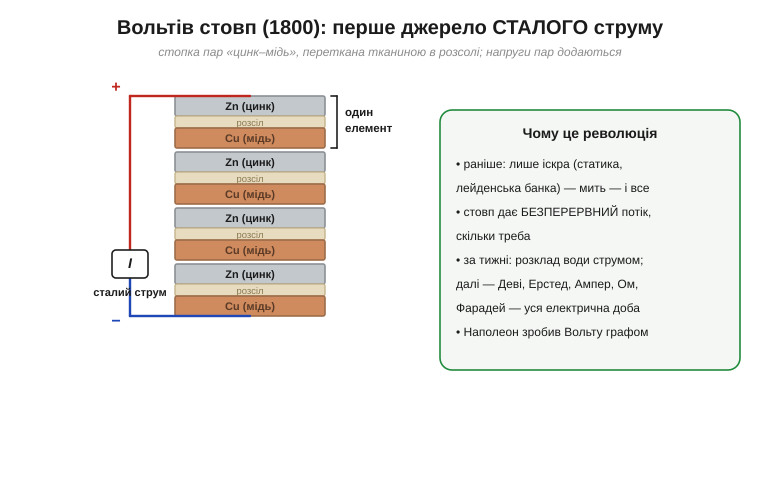

# 📜 Вольта проти Гальвані: суперечка, що дала світові батарею

> Історична вставка до [§1.1.5 «Головна думка: вольт — це джоуль на кулон»](ch01-charge-field-potential.md). Одиниця **вольт** носить чиєсь ім'я — і за цим ім'ям стоїть одна з найдраматичніших суперечок в історії науки. Почалася вона з мертвої жаби, а скінчилася винаходом, що відкрив добу практичної електрики. Тут — не «хто винайшов батарею», а **ланцюг питань**: чому смикається лапка, звідки береться електрика і як суперечка двох упертих італійців дала нам сталий струм.

Згадаймо, де ми були (§1.1.5): уся електрика до 1800 року була **миттєвою** — потер бурштин, накопичив у лейденській банці (Рис. 1.1.0.1), розрядив одним ударом. Думка про **сталий, безперервний** потік електрики здавалася фантастикою. А прийшла вона з геть несподіваного боку — від анатомії.

---

## Лапка мертвої жаби, що смикається: Гальвані

Болонья, 1780-ті. Анатом **Луїджі Гальвані** (*Luigi Galvani*, 1737–1798) препарує жаб. І помічає дивне: лапка вже мертвої жаби раптом **смикається**, мов жива, коли її торкаються металевим інструментом — особливо якщо поряд іскрить електростатична машина. А ще разючіше: коли лапку, підвішену на латунному гачку, торкають до залізних поручнів, вона теж сіпається. Жодної машини — лише два метали й мертва тканина.

*Рис. 1.1.5і.1. Латунний гачок, тканина лапки й залізна огорожа замикають петлю з двох різних металів — і мертвий м'яз скорочується. Гальвані виснував, що електрика захована в **самій тканині**: тіло наче крихітна лейденська банка з «життєвою силою».*

Гальвані дав цьому сміливе пояснення: у живій (і щойно померлій) тканині зберігається особлива **«тваринна електрика»** (*animal electricity*) — м'яз і нерв самі є джерелом, наче природна лейденська банка, а метал лише випускає накопичений заряд. Думка була захоплива: вона пов'язувала електрику з самою **таємницею життя**. Європа була заворожена; здавалося, ось-ось розгадають, що таке життєва сила.

> 🔧 **Навіщо це.** Це не лише курйоз: Гальвані фактично відкрив, що **електрика й живі тканини пов'язані**. Сьогодні на цьому стоять ЕКГ, ЕЕГ, електроміографія — усі прилади, що зчитують електричні сигнали тіла. Та правильне пояснення прийде пізніше; спершу був ефектний, але не зовсім точний здогад.

---

## Джерело — тканина чи метали: сумнів Вольти

За дослідами Гальвані пильно стежив його земляк і приятель — професор фізики з Павії **Алессандро Вольта** (*Alessandro Volta*, 1745–1827). На той час Вольта вже був ученим зі світовим ім'ям: він винайшов **електрофор** (прилад, що знов і знов відтворює заряд простим дотиком), удосконалив електроскоп і навіть відкрив горючий «болотний газ» — метан. Тож до жаб'ячих дослідів він підходив не новачком, а визнаним майстром вимірювання найслабших електричних ефектів. Спершу він захоплено прийняв ідею «тваринної електрики». Та що більше Вольта вдивлявся, то дужче його гриз сумнів. Він помітив ключову деталь, яку Гальвані недооцінив: ефект найсильніший, коли беруть **два різні** метали (латунь і залізо), а не один.

І Вольта висунув зухвалу зустрічну гіпотезу: а що, як джерело електрики — зовсім **не жаба**, а **стик двох різних металів**? Тоді лапка — не батарея, а лише надзвичайно **чутливий прилад**, що відгукується на найменший струм; волога тканина просто замикає коло.

*Рис. 1.1.5і.2. Уся суперечка — в одному питанні. Гальвані: електрику виробляє **тканина**. Вольта: електрика народжується на **стику різних металів**, а жаба — лише чутливий детектор. Розв'язати суперечку могло одне: прибрати жабу й подивитися, чи лишиться струм.*

Так наука розкололася на два табори. Прихильники **«тваринної електрики»** (Гальвані) проти прихильників **«металевої», або контактної, електрики** (Вольта). Суперечка тривала роками й була запеклою — на кону стояло розуміння природи самого життя.

---

## Вирішальна перевірка: вольтів стовп

Вольта зробив те, що й має робити справжній експериментатор: придумав **вирішальну перевірку**. Якщо він має рацію і струм дають метали, то жаба зовсім не потрібна — досить двох різних металів і **будь-якого** вологого провідника між ними.

І Вольта прибрав жабу. Спершу він перевірив це на собі: поклав на язик дві монети з різних металів, з'єднав їх — і відчув **кислуватий металевий присмак** і легке поколювання. Жодної тканини жаби — лише два метали й слина; а електрика є. Язик став тим самим «чутливим приладом», яким раніше була лапка. Вольта так захопився, що випробовував струм і на повіках, і у вухах, ретельно описуючи відчуття. До речі, цей дослід легко повторити й сьогодні: торкніться язиком обох контактів «кронової» батарейки на 9 В — відчуєте той самий кислуватий лоскіт. Це той-таки стик різнорідних провідників через вологу — рівно те, що відкрив Вольта.

Лишалося зробити ефект сильним і **сталим**. І тут Вольта здійснив головне: він **склав** багато таких пар одну на одну. Стопка кружалець двох металів (цинку й міді), перекладена картоном чи сукном, намоченим у розсолі, — і кожна пара додавала свою крихту напруги до спільної. Так 1800 року народився **вольтів стовп** (*voltaic pile*) — перша **батарея**.

*Рис. 1.1.5і.3. Стопка пар «цинк–мідь», перекладена змоченою в розсолі тканиною. Кожна пара дає свою невелику напругу, і вони **додаються** — тож стовп видає сталий струм, доки тривають хімічні реакції в ньому. Це й розв'язало суперечку: струм є без жодної жаби.*

Це й був нокаут у суперечці: струм тече без жодної тканини тварини. Отже, джерело — **метали** (а точніше, як з'ясується згодом, **хімічна реакція** між ними через електроліт).

Варто пояснити, чому потрібні саме **різні** метали. Один із них (цинк) охочіше віддає електрони, ніж інший (мідь); тож у вологому середовищі цинк потроху «розчиняється», лишаючи по собі зайві електрони, а на міді їх бракує. Ця **різниця в готовності** двох металів віддавати електрони і є тією «висотою» — напругою на кулон із §1.1.5. Розсіл (електроліт) лише замикає коло зсередини, переносячи іони. Деталі цієї хімії — у Розділі 2.1; тут досить ідеї: напругу дає **різниця двох речовин**, а не сам по собі метал. Саме тому два однакові метали струму не дадуть — потрібна пара несхожих.

---

## Чому сталий струм — це революція

Щоб оцінити вагу винаходу, треба згадати, чим була електрика **до** нього. Лише іскрою: накопичив статику, розрядив — мить — і все скінчилося. З таким «імпульсним» струмом мало що вдієш.

Вольтів стовп дав інше — **безперервний потік**, керований і тривалий. І це відчинило шлюзи. Уже за кілька тижнів після оголошення в Англії струмом стовпа **розклали воду** на водень і кисень (електроліз). Невдовзі Деві добуватиме стовпом нові хімічні елементи й засвітить одну з перших електричних дуг. А далі — лавина: Ерстед (1820) побачить, що струм відхиляє компас, Ампер опише взаємодію струмів, Ом знайде свій закон, Фарадей відкриє індукцію. **Уся електрична доба XIX століття виросла з вольтового стовпа** — бо вперше з'явився надійний інструмент, що дає струм на вимогу.

Слава була гучною. Вольта оголосив винахід у листі до Лондонського королівського товариства 1800 року, а Наполеон, уражений демонстрацією, зробив його **графом і сенатором**.

Тим часом табір «тваринної електрики» не здавався. Небіж Гальвані, **Джованні Альдіні** (*Giovanni Aldini*), возив Європою моторошні публічні видовища: пропускав струм крізь тіла страчених злочинців — і ті здригалися, розплющували очі, ворушили щелепою. 1803 року в Лондоні він на очах у приголомшеного натовпу «оживляв» тіло повішеного вбивці. Ці демонстрації так вразили сучасників, що, як вважають, надихнули юну Мері Шеллі на «Франкенштейна». Наука й жах ішли тут пліч-о-пліч — і саме образ електрики, що повертає рух мертвій плоті, увійшов у культуру назавжди.

> 🔧 **Навіщо це.** Кожна батарея, акумулятор, «пальчик» чи літієва банка у вашому пристрої — прямий нащадок вольтового стовпа: дві різні речовини, розділені електролітом, що хімічно «піднімають» заряд (саме та «висота» — напруга — з §1.1.5). Принцип за 220 років не змінився, змінилася лише хімія.

Хоч стовп і був дивом, він був вередливий: розсіл висихав і витікав, кружальця окислювалися, а напруга помітно «просідала» під час роботи. Ці вади підштовхнули інших — Даніеля, Лекланше, згодом творців перших акумуляторів — шукати надійніші конструкції. Тож вольтів стовп був не кінцем, а **початком** довгого поступу хімічних джерел, який курс простежить аж до сучасних літієвих банок (Розділи 2.1 і 7.4).

---

## То хто ж мав рацію — і несподіваний поворот

У безпосередній суперечці **переміг Вольта**. Батарея незаперечно довела: електрика стовпа народжується з **хімії** різних металів в електроліті, а не з якоїсь окремої «життєвої сили». «Тваринна електрика» в тому сенсі, який вкладав Гальвані, виявилася хибною — і саме тому одиницю напруги назвали **вольтом**, на честь переможця.

Але історія любить іронію. Гальвані **не був** цілком неправий — він просто пояснив правильне спостереження хибно. Бо нерви й м'язи **справді** працюють на електриці: по них біжать електричні імпульси (потенціали дії), і саме вони керують скороченням. Гальвані краєм ока побачив реальне явище — **біоелектрику**, — лише витлумачив його не так. Тож обидва імена дожили до нас.

*Рис. 1.1.5і.4. Вольта виграв суперечку (батарея — це хімія) і дав ім'я **вольту**. Та Гальвані вхопив справжнє зерно — біоелектрику нервів і м'язів, — і його ім'я живе в словах «гальванічний», «гальванометр», «гальванізація», в ЕКГ та ЕЕГ. Найбільша іронія: «гальванічний елемент» — це і є батарея, тобто винахід Вольти носить ім'я його опонента.*

> 🔧 **Навіщо це.** Звідси ціла родина слів у вашому щоденному лексиконі. **Гальванічний елемент** — це і є батарея (Розділ 2.1). **Гальванометр** — чутливий вимірювач струму, предок стрілкового приладу (Розділ 1.6). **Гальванізація** (оцинкування) — захист сталі цинком, що жертовно кородує замість заліза. Усе це — від «переможеного» Гальвані.

Доля обох була нерівною. Вольту обсипали почестями — граф, сенатор, улюбленець Наполеона; на його честь назвали одиницю напруги (міжнародно — 1881 року). Гальвані ж відмовився присягнути новій Наполеоновій республіці, втратив кафедру в Болоньї й помер 1798 року в бідності та зневірі — так і не дізнавшись, що в його «помилці» сховалося велике відкриття. Історія розсудила їх лагідніше за сучасників: сьогодні шанують **обох**, бо кожен по-своєму мав рацію.

---

## Чим це відгукнулося

Підіб'ємо цей ланцюг:

- **Вольт** (*volt*, В) — одиниця напруги, з §1.1.5, — на честь Вольти й його стовпа.
- **Гальванічний елемент, гальванометр, гальванізація, «гальванічна» розв'язка** — на честь Гальвані; його ж відкриття біоелектрики живе в усій сучасній медичній електроніці.
- **Сам принцип батареї** — дві різні речовини + електроліт — лишається основою всіх хімічних джерел, від «пальчика» до тягових літієвих банок (їхню історію курс продовжить у Розділі 2.1 і 7.4).

А головний урок цієї історії — про **природу наукової суперечки**. Гальвані помилився в поясненні, але його дослід був справжній і вказував на реальне явище. Вольта не «спростував жабу» — він поставив краще питання («а без жаби?») і дав інструмент, що зрушив усю науку. Обидва рухали знання вперед, кожен по-своєму. Тому в історії науки навіть «програна» ідея нерідко виявляється напівправдою, що чекає свого часу, — а суперечка чесних дослідників майже завжди плідна.

Тепер, поставивши крапку в питанні, **звідки** береться напруга, повернімося до фізики — і побачимо, що поле й потенціал, про які ми говорили окремо, насправді є двома мовами одного явища.

> ▶️ Повернутися до [§1.1.5 «Вольт — це джоуль на кулон»](ch01-charge-field-potential.md) · Далі в розділі — §1.1.6 «Поле й потенціал — одне явище двома мовами».

---

### Пов'язане
- [§1.1.5 Головна думка: вольт — це джоуль на кулон](ch01-charge-field-potential.md) — одиниця, названа на честь Вольти.
- [Історія розділу: ланцюг питань від бурштину до поля](history-electricity.md) — де Вольта стоїть між Кулоном і Фарадеєм.
