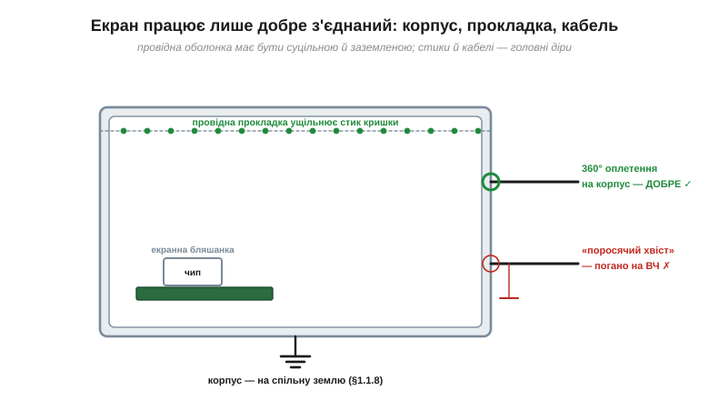

# 🔌 Екран навколо нас: металевий корпус, сітка, фольга

> Компонентна вставка до теми [§1.1.8 «Клітка Фарадея й екранування»](ch01-charge-field-potential.md). §1.1.8 пояснив **фізику** екранування. Тут — практичне залізо: з чого роблять екрани в реальних пристроях і, головне, як їх правильно під'єднати, бо погано з'єднаний екран майже не екранує.

### Клас: провідні оболонки проти полів

Усі екрани — це клітки Фарадея різної форми. Вибирають за тим, що мусить пройти крізь оболонку (повітря, світло, кабелі) і наскільки сильно треба глушити завади:

- **суцільний металевий корпус** — найкращий захист, але без вентиляції й огляду;
- **сітка чи перфорація** — провітрює й видно крізь неї, а екранує, бо отвори дрібніші за те, що тримаємо (§1.1.8): саме так зроблено дверцята мікрохвильовки;
- **фольга / металізована плівка** — дешеве обгортання, а також фольговий екран кабелю;
- **обплетення кабелю** — коаксіал чи «оплетення + фольга» навколо сигнальних жил;
- **екранна бляшанка** — металева коробочка, припаяна на платі просто над «галасливим» ВЧ-чипом;
- **провідні прокладки й піна** — щоб ущільнити стики корпусу.

### Як під'єднати — найважливіше

*Рис. 1.1.8c.1. Екран працює лише як суцільна заземлена оболонка. Стик кришки ущільнює провідна прокладка; над ВЧ-чипом — екранна бляшанка; корпус з'єднаний зі спільною землею. Кабель: оплетення, обтиснуте на корпус по всьому колу (360°), екранує добре; під'єднане тонким «поросячим хвостом» — на високих частотах майже ні.*

Головне правило практики: екран треба **з'єднати зі спільною землею** пристрою, і з'єднати **добре**. §1.1.8 нагадав: від сталого зовнішнього поля заземлення не конче потрібне, але від реальних (змінних) наводок — так. Тож корпус саджають на опорний нуль (шасі/GND) надійним коротким контактом. А оплетення кабелю обтискають на корпус **по всьому колу (360°)** — там, де кабель входить усередину.

### Щоб справді працювало

Екран екранує, лише якщо він **електрично суцільний і під'єднаний**. Перевірте подумки: кожна панель з'єднана із сусідньою (прокладки), кришка контактує по всьому периметру, оплетення кабелів сідає на шасі, ніде немає довгої непід'єднаної щілини. Один добрий контакт замість десятка випадкових — і коробка ожила.

### Типові граблі

- **Щілини та прорізи — це антени.** Довгий стик чи проріз тече гірше, ніж багато дрібних отворів тієї самої сумарної площі (§1.1.8: важить замкнутість, не товщина).
- **Кабель проносить заваду всередину**, якщо його екран не обтиснутий на стінці там, де він входить.
- **«Поросячий хвіст» (pigtail).** Під'єднати оплетення коротким скрученим дротиком замість 360° — і на високих частотах захист майже зникає.
- **Земляні петлі.** З'єднавши екран у двох місцях через різні шляхи землі, можна створити петлю; заземлення варто планувати.
- **Фарба й анодування ізолюють.** Під прокладкою має бути голий метал — анодований алюміній чи лак розривають контакт.

### Варіації

Для гнучких чи складних форм беруть **провідну тканину** й металізовану піну; зсередини пластикового корпусу наносять **екранувальну фарбу** (нікель, мідь). І окрема пісня — **магнітне** екранування: звичайний провідний екран сталого магнітного поля не тримає (§1.1.8), для нього потрібен феромагнітний кожух із мю-металу.
