# Розділ 1.3 — Опір, потужність і тепло

У Розділі 1.2 ми зрозуміли струм **якісно**: що тече, чому, куди й що йому опирається. Та інженер живе **числами**: скільки потече струму, скільки виділиться тепла, який резистор узяти й чи не згорить він. Цей розділ дає ці числа. Він будується на двох законах із [своєї історії](ch03-history-ohm-joule.md) — **Ома** (струм) і **Джоуля** (тепло) — і доводить розуміння струму до практичного інструменту: опір у числах, закон Ома, потужність, нагрів і добір реальних деталей.

> 📜 **Перед матеріалом — історія:** [Ом і Джоуль](ch03-history-ohm-joule.md) — закон, який спершу відкинули, і тепло, що виявилося енергією.

---

## 1.3.1 Опір: спротив струму й звідки він

У §1.2.9 ми побачили **механізм** опору: дрейфові електрони раз у раз стикаються з решіткою, і ці зіткнення гальмують струм. Тоді це була якісна картина. Тепер перетворімо її на **величину** — на **опір** (*resistance*, R), яким можна рахувати. Бо щоб дібрати дріт, резистор чи запобіжник, треба знати опір **у числах**.

### Означення: R = V/I

Опір — це **наскільки сильно елемент опирається струмові**. Виміряти його просто: прикладіть напругу й подивіться, який струм потече. Що більша потрібна напруга на кожен ампер струму — то більший опір:

```
R = V / I        (одиниця: ом, Ом = В/А)
```

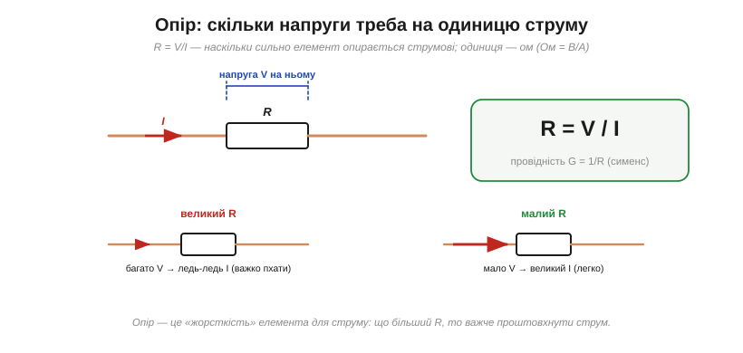
*Рис. 1.3.1.1. Опір — це відношення напруги на елементі до струму крізь нього. **Великий R**: щоб проштовхнути навіть малий струм, потрібна велика напруга (важко). **Малий R**: мала напруга дає великий струм (легко). Обернена величина — **провідність** G = 1/R (у сименсах).*

Одиниця опору — **ом** (*ohm*, **Ω**), і означена вона якраз як вольт на ампер: 1 Ом — це такий опір, що за напруги 1 В пропускає струм 1 А. Часто зручна й обернена величина — **провідність** (*conductance*, G = 1/R, у **сименсах**, См): велика провідність = малий опір = легко тече. Інакше кажучи, опір — це «обмінний курс» між напругою й струмом: скільки вольтів коштує кожен ампер. Для звичайного резистора цей курс сталий — і саме тому поведінка кола передбачувана.

**Приклад (знайти опір).** Через елемент за напруги 5 В тече струм 10 мА. Який його опір і провідність?

```
R = V/I = 5 / 0.01 = 500 Ом
G = 1/R = 1/500 = 0.002 См = 2 мСм
```

Діапазон опорів величезний — як і питомий опір (§1.2.8). Товстий мідний провід має частки ома; типові резистори — від одиниць ом до мегаом; ізолятор — десятки мегаом і більше; надпровідник — рівно нуль. Тому опір лічать із префіксами: **кілоом** (кОм = 1000 Ом), **мегаом** (МОм = 10⁶ Ом).

**Приклад (хто пропустить більший струм).** Два елементи під однаковою напругою 5 В: в одного R = 100 Ом, в іншого R = 1 кОм. Крізь який тече більший струм?

```
менший опір → більший струм (з R = V/I):
R = 100 Ом:  I = 5/100  = 50 мА
R = 1000 Ом: I = 5/1000 = 5 мА
```

Удесятеро менший опір — удесятеро більший струм.

### Інтуїція: вузьке місце в трубі

Образ опору, який варто закарбувати, — це **вузька труба** (продовження водяної аналогії §1.2.5).

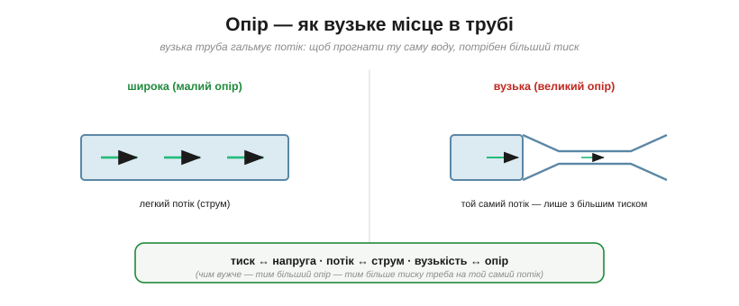
*Рис. 1.3.1.2. Широка труба пропускає воду легко (малий опір); вузька гальмує її, і щоб прогнати **той самий** потік, потрібен більший тиск. Перенесімо: тиск ↔ напруга, потік ↔ струм, вузькість ↔ опір. Великий опір — це «вузьке горло» для струму.*

Що вужче «горло», то більший опір — і то більше «тиску» (напруги) треба, щоб прогнати ту саму кількість «води» (струму). Резистор у колі — це навмисне зроблене таке вузьке місце.

### Звідки береться опір

Опір — не магія, а **усереднена складність** руху електронів крізь решітку, яку ми вже розклали в §1.2.9–§1.2.10.

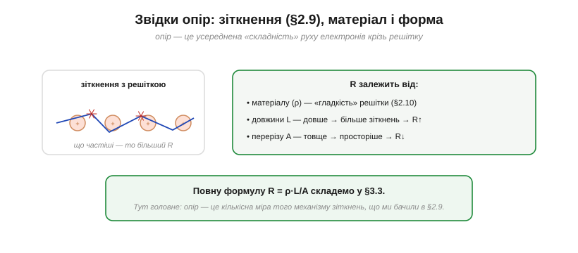
*Рис. 1.3.1.3. Опір — це кількісна міра тих самих **зіткнень** електронів із решіткою (§1.2.9). Він залежить від **матеріалу** (питомий опір ρ — «гладкість» решітки, §1.2.10), **довжини** (довше → більше зіткнень → R↑) і **перерізу** (товще → просторіше → R↓). Повну формулу R = ρ·L/A складемо у §1.3.3.*

Тобто опір конкретної деталі задають дві речі: **який матеріал** (його питомий опір ρ із §1.2.10) і **яка форма** (довжина й переріз). Метал має малий опір, бо в ньому багато вільних носіїв і «гладка» решітка; тонкий довгий дріт опирається більше за товстий короткий. Числову формулу R = ρ·L/A ми виведемо в §1.3.3 — тут важливо побачити, що опір **виростає прямо з механізму** Розділу 1.2.

Опір має не лише «навантаження», а й самі **джерела** та прилади. У батареї є внутрішній опір — через нього вона «просідає» під струмом (§1.2.6, докладно — §1.5.1); амперметр має малий власний опір, вольтметр — великий (§1.2.1). Тобто опір — властивість **усього**, що проводить; питання лише в тому, він великий чи малий.

> 🔧 **Навіщо це.** Опір — усюди, і його роль двоїста. У **дротах** і доріжках опір **небажаний** (хочемо малий, щоб менше гріло й «просідало», §1.2.9); тому їх роблять із міді й достатньо товстими. А в **резисторах** опір, навпаки, **бажаний і точно заданий** — це робочий інструмент. Уміти прикинути опір «на око» (товстий мідний провід — частки ома; резистор — оми, кілооми, мегаоми; ізолятор — мегаоми й більше) — базова навичка читання схем. До речі, опір мають і **з'єднання**: кожен контакт, паяння, роз'єм додає маленький, та реальний опір. Поганий контакт (окислений, нещільний) — це зайвий опір, що **гріється** (§1.2.9) і часто стає причиною збоїв і навіть пожеж. Тому надійні з'єднання — питання не лише сигналу, а й безпеки.

### Резистор: навмисний опір як інструмент

Найчастіше опір у схему ставлять **спеціально** — це окремий компонент, **резистор** (*resistor*).

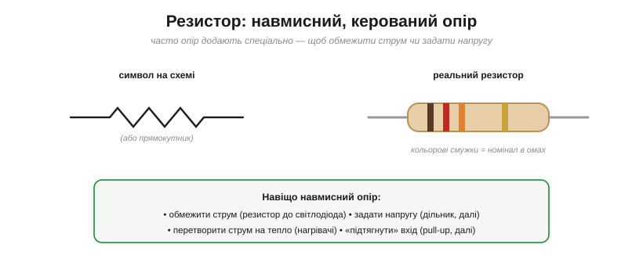
*Рис. 1.3.1.4. Резистор на схемі позначають зигзагом (або прямокутником), а в житті це деталь із кольоровими смужками, що кодують його номінал в омах. Опір додають навмисно: щоб **обмежити струм**, **задати напругу**, перетворити струм на **тепло** чи «**підтягнути**» вхід.*

Навіщо взагалі **додавати** опір, якщо він «гальмує»? Бо керований опір — це керування струмом і напругою. Найкласичніше — **струмообмежувальний резистор** перед світлодіодом: без нього крізь діод потік би згубний струм (§1.2.1), а резистор «вузьким горлом» тримає його в безпечних міліамперах. Резистори також **задають напругу** (дільник, §1.4.6), навмисно **гріються** (нагрівачі), «**підтягують**» входи мікросхем до потрібного рівня — усе це робочі прийоми, які ми ще зустрінемо.

> 🔧 **Навіщо це.** Номінал резистора читають за **кольоровими смужками** (або написом на SMD): кожен колір — цифра, разом вони дають опір в омах. І ще: у резистора є не лише номінал в омах, а й **допустима потужність** (¼ Вт, ½ Вт…) — скільки тепла він витримає, перш ніж згоріти (§1.2.9; кількісно — §1.3.7). Тому добирають і опір, і потужність. На практиці ви добиратимете резистор саме під потрібний струм чи напругу — а для цього треба зв'язати R, V та I одним законом. Саме його — закон Ома — ми й розгорнемо в наступному підрозділі.

Наостанок зауважмо: опір не завжди **сталий**. Для багатьох матеріалів (металів, звичайних резисторів) R майже не залежить від прикладеної напруги — такі елементи звуть **омічними**. А є й такі, де опір «пливе» (лампа розжарення гарячою, діод, терморезистор) — **неомічні**. Наприклад, у звичайного резистора подвоїш напругу — подвоїться й струм (R той самий); а от у **діода** опір різко падає, щойно напруга перевищить поріг, тож струм злітає нелінійно. У **лампи розжарення** гаряча нитка має в рази більший опір за холодну (§1.2.10), тож її R залежить від того, наскільки вона розжарена. Розрізняти омічне й неомічне критично: до перших закон Ома застосовують прямо, до других — лише обережно, у кожній робочій точці. Це розрізнення — серце наступного підрозділу.

---

Підсумок §1.3.1: **опір** R = V/I — кількісна міра того, наскільки елемент опирається струмові (одиниця — **ом**, Ω = В/А; обернене — провідність G = 1/R). Він виростає прямо з механізму §1.2.9 (зіткнення) і залежить від **матеріалу** (ρ) та **форми** (L, A). Опір буває небажаний (у дротах) і навмисний (резистор — інструмент, щоб обмежити струм чи задати напругу). Ми означили R через V та I — а зв'язок цих трьох величин і є **законом Ома**, до якого переходимо.

---

## 1.3.2 Закон Ома: I = V/R

У §1.3.1 ми означили опір як R = V/I. Та сама рівність, прочитана як **зв'язок трьох величин** — струму, напруги й опору, — і є **закон Ома**: найуживаніша формула всієї електроніки. Він каже просту, але всемогутню річ: струм дорівнює напрузі, поділеній на опір.

```
I = V / R
```

Більша напруга жене більший струм; більший опір — менший. Усе, що ми вивели якісно (напруга — причина струму §1.2.6, опір — спротив §1.3.1), тут стискається в одну формулу, якою рахують.

Чому закон такий простий? Корінь — у механізмі Розділу 1.2. Поле в дроті пропорційне напрузі (E = V/d, §1.1.4), дрейфова швидкість пропорційна полю (v ∝ E, §1.2.3), а струм пропорційний дрейфу (I = n·A·v·e, §1.2.3). Збираючи ці пропорційності докупи, дістаємо I ∝ V — а коефіцієнт між ними і є 1/R. Закон Ома — це, по суті, ланцюжок «розгін–зіткнення» (§1.2.9), записаний однією рівністю.

### Три форми — одна рівність

Закон Ома пов'язує три величини, тож із нього легко виразити будь-яку, знаючи дві інші. Це **три форми** однієї рівності.

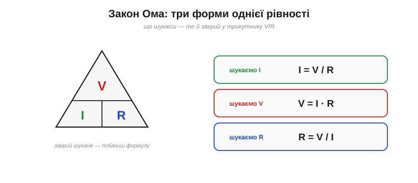
*Рис. 1.3.2.1. Залежно від того, що шукаємо, закон Ома беруть в одній із трьох форм. Зручний мнемонічний **трикутник VIR**: затули пальцем шукану величину — і побачиш формулу (V зверху, I та R унизу).*

```
шукаємо струм:    I = V / R
шукаємо напругу:  V = I · R
шукаємо опір:     R = V / I
```

Трикутник підказує: V — згори, I та R — унизу. Затулиш **V** — лишається I·R; затулиш **I** — лишається V/R; затулиш **R** — V/I. Запам'ятавши цю картинку раз, ви ніколи не переплутаєте, що на що ділити.

**Приклад (знайти струм).** Яка сила струму за напруги 12 В на опорі 2 кОм?

```
I = V/R = 12 / 2000 = 0.006 А = 6 мА
```

**Приклад (знайти напругу).** Скільки впаде напруги, якщо крізь резистор 100 Ом тече 50 мА?

```
V = I·R = 0.05 × 100 = 5 В
```

**Приклад (струм нагрівача).** Який струм бере спіраль опором 10 Ом від мережі 230 В?

```
I = V/R = 230 / 10 = 23 А
```

Звідси й видно, чому потужні нагрівачі тягнуть великий струм — і потребують товстих дротів.

Маленька, та золота практична хитрість — **узгоджені одиниці**. Якщо рахувати у **вольтах, міліамперах і кілоомах**, усе сходиться без переведень, бо мА × кОм = В (10⁻³ × 10³ = 1). Наприклад, 5 В / 1 кОм = 5 мА одразу. Ця трійця «В, мА, кОм» — звичні робочі одиниці електроніки, і вона рятує від плутанини з нулями.

До слова, закон Ома працює не лише на «навантаженні», а й на **внутрішньому опорі** джерела: реальна напруга на клемах V = ЕРС − I·r, де r — той внутрішній опір (§1.2.6). Тому під великим струмом батарея «просідає» — частина ЕРС падає на її власному r за тим самим законом Ома (докладно — §1.5.1).

### Лінійність: пряма через нуль

Для **омічного** елемента (метал, звичайний резистор) опір R сталий — і тоді закон Ома дає **пряму** залежність струму від напруги.

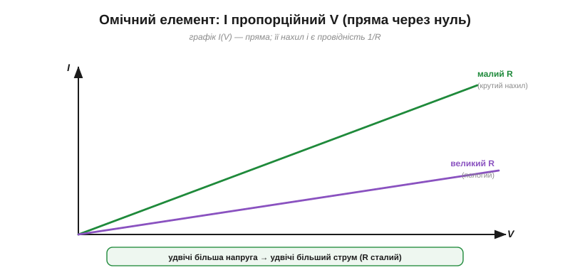
*Рис. 1.3.2.2. Для омічного елемента графік струму від напруги I(V) — **пряма, що виходить із нуля**: подвоїш напругу — подвоїться струм. Її **нахил** — це провідність 1/R: крута пряма — малий опір (легко тече), полога — великий.*

Ця лінійність — практично зручна річ: знаючи одну точку, знаєш усю пряму. Нахил прямої — провідність 1/R, тож із графіка опір видно «на око»: крутіше — менший опір.

### Омічні й неомічні: не всі прямі

Та закон Ома в формі «сталий R» працює **не для всього**. Багато елементів **неомічні** — їхній опір залежить від напруги чи струму, і графік I(V) — **крива**, а не пряма.

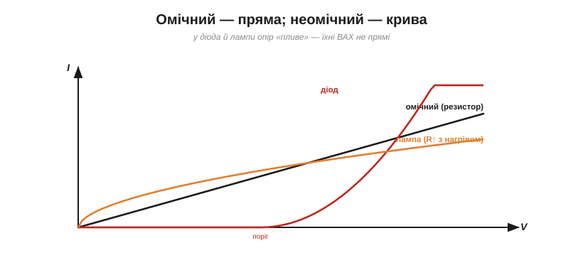
*Рис. 1.3.2.3. **Вольт-амперні характеристики** (ВАХ): у резистора — пряма (омічний), у **діода** — майже нуль до порогу, тоді різкий злет (опір падає), у **лампи розжарення** — крива, що загинається (опір росте з нагрівом, §1.2.10). До неомічних елементів «сталий R» не застосуєш.*

Графік I(V) називають **вольт-амперною характеристикою** (ВАХ, *I-V curve*) — і саме його наводять у даташитах для діодів, транзисторів та інших неомічних деталей. Для них немає одного числа «опір»: він свій у кожній робочій точці. Тому закон Ома до них застосовують **локально** (який струм за цієї конкретної напруги), а не як «I пропорційний V».

Як же тоді знайти струм через неомічний елемент? Графічно — методом **навантажувальної прямої**: на тому самому графіку малюють і криву ВАХ елемента, і пряму джерела з резистором; їхній **перетин** дає робочу точку — струм і напругу. Для світлодіода це й пояснює, чому резистор «садить» його в потрібну точку кривої. Деталі лишимо на потім; тут досить запам'ятати: неомічні елементи рахують у робочій точці, а не однією формулою.

> 🔧 **Навіщо це.** Важлива чесність: закон Ома — це **емпіричне правило** для омічних матеріалів, а не вічний закон природи (на відміну від збереження заряду чи енергії). Метали й резистори за звичайних умов коряться йому чудово; діоди, лампи, транзистори — ні. Тому, побачивши в даташиті **криву ВАХ**, знайте: перед вами неомічний елемент, і «R = V/I» дасть лише опір у конкретній точці, а не сталу величину.

### Класичне застосування: резистор для світлодіода

Найчастіший у житті розрахунок за законом Ома — **струмообмежувальний резистор** до світлодіода. Світлодіод неомічний і сам струм не обмежує (§1.2.1): дай йому повну напругу — згорить. Тому послідовно ставлять резистор, що «з'їдає» зайву напругу й тримає струм у нормі.

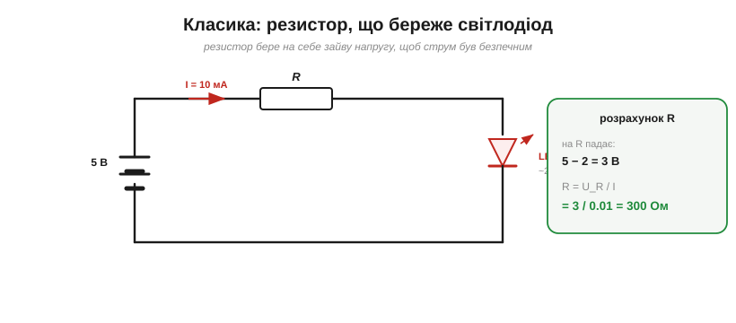
*Рис. 1.3.2.4. Світлодіод «забирає» собі своє падіння (~2 В), а решту напруги має взяти на себе резистор. Закон Ома дає його опір: R = U_R / I, де U_R = (напруга джерела − падіння на світлодіоді).*

**Приклад (резистор для світлодіода).** Живлення 5 В, світлодіод падає 2 В, бажаний струм 10 мА. Який резистор потрібен?

```
напруга на резисторі:  U_R = 5 − 2 = 3 В
опір:                  R = U_R / I = 3 / 0.01 = 300 Ом
```

Логіка завжди та сама: знайди, **скільки напруги має впасти** на резисторі, поділи на **бажаний струм** — дістанеш опір. Це і є закон Ома в роботі.

> 🔧 **Навіщо це.** Цей розрахунок ви робитимете постійно — для кожного індикатора, підтяжки, дільника. Алгоритм універсальний: визнач відому напругу на елементі й потрібний струм, а тоді за R = V/I знайди опір (або за V = I·R — потрібне падіння). Закон Ома — це не теорія для іспиту, а щоденний робочий інструмент: трьома формами однієї рівності розв'язується чи не половина задач з колами.

Зауважмо й межі застосування. Закон Ома описує **один елемент** — зв'язок V, I та R на ньому. Щоб порахувати ціле коло з багатьма елементами, його поєднують із **законами Кірхгофа** (Розділ 1.4), які кажуть, як струми й напруги розподіляються по вузлах і контурах. Разом «Ом + Кірхгоф» розв'язують будь-яке коло постійного струму — це наш наступний великий крок.

---

Підсумок §1.3.2: **закон Ома** I = V/R зв'язує струм, напругу й опір — і має три форми (I=V/R, V=I·R, R=V/I), які зручно тримати в голові «трикутником VIR». Для **омічних** елементів (резистори, метали) R сталий, тож I пропорційний V — пряма через нуль; **неомічні** (діод, лампа) мають криву ВАХ, і закон Ома до них застосовують лише локально. Класичне застосування — добір струмообмежувального резистора (R = U_R/I). Ми навчилися рахувати з опором — час побачити, **від чого** він залежить кількісно.

---

## 1.3.3 Від чого залежить опір: матеріал, довжина, переріз

Дотепер опір R був для нас просто «числом на резисторі». Та звідки воно береться для реального провідника — дроту чи доріжки? Ми вже намацали відповідь у §1.3.1: опір задають **матеріал** і **форма**. Тепер запишемо це точною формулою — однією з найкорисніших у практичній електротехніці.

### Формула R = ρ·L/A

Опір однорідного провідника дорівнює його питомому опору, помноженому на довжину й поділеному на площу перерізу:

```
R = ρ · L / A
```

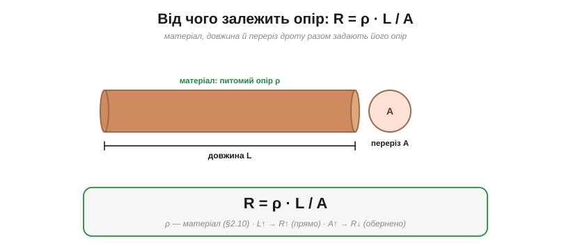
*Рис. 1.3.3.1. Опір дроту складають три чинники: **ρ** — питомий опір матеріалу (§1.2.10), **L** — довжина (входить прямо), **A** — площа перерізу (входить обернено). Що довший і тонший провідник — то більший його опір.*

Кожен множник має просте пояснення, що прямо випливає з механізму §1.2.9:
- **ρ (матеріал)** — наскільки «шорстка» решітка для електронів (§1.2.10): мідь мала, ніхром велика.
- **L (довжина)** — що довший шлях, то більше зіткнень дорогою, тому опір **прямо пропорційний** довжині.
- **A (переріз)** — що товщий провід, то більше «смуг руху» для електронів паралельно, тому опір **обернено пропорційний** площі.

Чому ж дроти майже завжди мідні? Бо мідь дає чудовий компроміс: дуже малий ρ за помірну ціну. **Срібло** трохи краще, та надто дороге. **Алюміній** має приблизно в півтора раза більший ρ за мідь — зате втричі легший і дешевший; тому на високовольтних лініях і великих шинах беруть алюміній, лише роблячи його товщим, щоб надолужити опір. Вибір матеріалу — завжди торг між ρ, вагою й ціною.

### Довжина прямо, переріз обернено

Ці дві залежності варто відчути окремо — вони працюють по-різному.

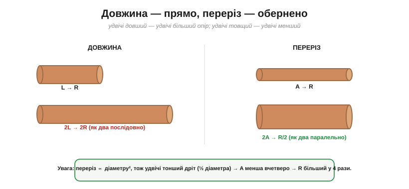
*Рис. 1.3.3.2. **Довжина**: удвічі довший дріт — удвічі більший опір (наче два шматки послідовно). **Переріз**: удвічі товщий (за площею) — удвічі менший опір (наче два дроти паралельно). Важлива пастка: площа залежить від **квадрата** діаметра, тож удвічі тонший дріт має вчетверо менший переріз — і вчетверо більший опір.*

Ключова обережність — із діаметром. Площа круга A = π·d²/4, тобто A ∝ **d²**. Тому коли діаметр дроту зменшити вдвічі, площа падає **вчетверо**, а опір зростає **в чотири рази**. Тонкі дроти опираються набагато сильніше, ніж здається «на око».

Зауважмо й те, що для постійного струму важлива саме **площа** перерізу, а не його форма: круглий дріт, плаский шлейф чи квадратна шина з однаковою площею мають однаковий опір. (На високих частотах це вже не так — там струм тісниться до поверхні, скін-ефект із §1.2.10.)

**Приклад (опір мідного дроту).** Який опір має 10 метрів мідного дроту перерізом 0.5 мм²?

```
ρ(мідь) = 1.7 × 10⁻⁸ Ом·м
L = 10 м,  A = 0.5 мм² = 0.5 × 10⁻⁶ м²

R = ρ·L/A = (1.7×10⁻⁸ · 10) / (0.5×10⁻⁶)
R = (1.7×10⁻⁷) / (0.5×10⁻⁶) ≈ 0.34 Ом
```

### Калібр дроту: AWG

На практиці товщину дроту не міряють щоразу — її задають **калібром**. У поширеній системі **AWG** (*American Wire Gauge*) кожному перерізу відповідає номер, і — увага, типова пастка — **більший номер означає тонший дріт**.

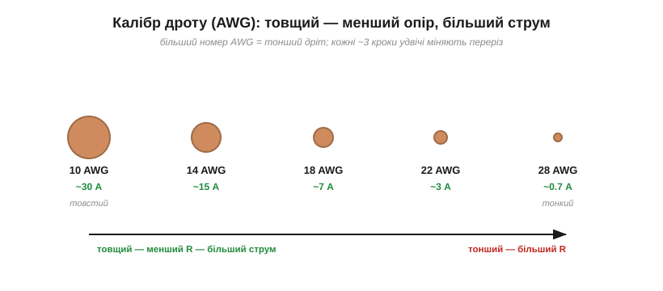
*Рис. 1.3.3.3. Що менший номер AWG — то товщий дріт, менший опір і більший допустимий струм. 10 AWG — товстий силовий провід (десятки ампер); 28 AWG — тонкий сигнальний (частки ампера). Кожні приблизно три кроки номера удвічі змінюють переріз.*

Логіка та сама, що й у формули: товщий дріт (менший номер AWG) має більший переріз A, отже, **менший опір** — і тому витримує **більший струм** без перегріву (згадаймо допустимий струм, ampacity, §1.2.1). Тому силові кабелі товсті, а сигнальні — тонкі.

> 🔌 Дріт як повноцінна деталь — допустимий струм (і чому він не одне число), падіння напруги на довгій лінії, а ще чому той самий переріз буває суцільним і багатожильним: [Дроти: переріз, AWG, допустимий струм](ch03-s3-c-wires.md).

Сама шкала AWG влаштована логарифмічно: приблизно кожні **3 номери** удвічі змінюють переріз (а отже, і опір), кожні **6** — удвічі діаметр, а **10 номерів** — це вже вдесятеро за площею. У Європі частіше користуються прямо **перерізом у мм²** (0.5; 0.75; 1.5; 2.5 мм²…) — те саме, лише без перекодування в номери.

> 🔧 **Навіщо це.** Калібр дроту добирають **під струм**: що більший струм — то товщий потрібен провід (менший R → менше тепла й менше падіння напруги). Узяти заслабкий дріт — він перегріється (§1.2.9) і може спричинити пожежу; узяти зайво товстий — марно дорого й важко. Орієнтир: для слабких сигналів вистачає тонкого 24–28 AWG, для живлення кількох ампер беруть 18–20 AWG, для потужних навантажень — 14 AWG і товще.

На друкованих платах роль «дроту» грають мідні **доріжки**, і формула працює так само: опір тим менший, чим доріжка ширша й товстіша. Для тонких плівок зручний **поверхневий опір** (Ом на квадрат, §1.2.10): опір доріжки — це поверхневий опір, помножений на число «квадратів» у її довжині (тобто на відношення довжина/ширина). Тому силові доріжки роблять широкими, а часто заливають цілими полігонами міді.

### Падіння напруги на дротах

Найважливіший практичний наслідок формули: **сам дріт теж має опір**, і на ньому теж падає напруга (за законом Ома, §1.3.2). На коротких товстих провідниках це дрібниця, а от на **довгих тонких** — суттєва втрата.

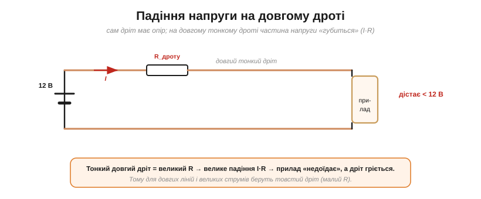
*Рис. 1.3.3.4. Опір самого дроту R_дроту «з'їдає» частину напруги: I·R падає вздовж проводу, і прилад на кінці дістає **менше**, ніж видало джерело. Тонкий довгий дріт = великий R = велике падіння + нагрів. Тому для довгих ліній і великих струмів беруть товстий провід.*

**Приклад (втрата на дроті).** Тим самим дротом (R ≈ 0.34 Ом на 10 м) живимо прилад струмом 5 А. Скільки напруги «згубиться» на проводі?

```
треба врахувати обидва проводи (туди й назад): L = 2 × 10 = 20 м
R_дроту ≈ 2 × 0.34 = 0.68 Ом
падіння: U = I·R = 5 × 0.68 ≈ 3.4 В
```

Аж 3.4 вольта! Якщо джерело давало 12 В, до приладу дійде лише ~8.6 В — а різниця піде в **нагрів дроту**. Ось чому тонкий довгий подовжувач під навантаженням гріється, а пристрій на його кінці працює мляво.

> 🔧 **Навіщо це.** Падіння I·R на дротах — постійний клопіт у реальних системах: довгі лінії живлення, тонкі подовжувачі, вузькі доріжки на платі. Боротися з ним просто: коротший і товщий провід (менший R) або вища напруга з меншим струмом (менший I·R — згадаймо «війну струмів», §1.2.12). Прикидати падіння напруги на дроті за R = ρL/A — щоденна навичка проєктувальника живлення.

І ще одне про те саме падіння: на опорі дроту не лише губиться напруга — там **виділяється тепло** (I²R_дроту, §1.3.6). Тобто заслабкий дріт б'є двічі: і прилад недоїдає, і сам провід гріється, марнуючи енергію. У довідниках для зручності наводять **опір на метр** для кожного калібру — помножив на довжину лінії, і одразу маєш і опір, і падіння, і нагрів.

---

Підсумок §1.3.3: опір провідника задає **R = ρ·L/A** — питомий опір матеріалу (ρ), помножений на довжину (L, прямо) і поділений на переріз (A, обернено; до того ж A ∝ d²). Товщину дроту кодують калібром **AWG** (більший номер — тонший дріт, більший опір, менший струм). Сам дріт теж має опір, тож на ньому падає напруга I·R — суттєва на довгих тонких лініях. Опір ми навчилися рахувати з геометрії — але він ще й «пливе» з **температурою**, про що — наступний підрозділ.

---

## 1.3.4 Опір і температура

Дотепер ми рахували опір так, ніби він сталий. Та ми вже знаємо з §1.2.8–§1.2.10, що опір **залежить від температури**. Тепер, маючи закон Ома й формулу R = ρL/A, доведемо це до числа — а заразом побачимо найцікавіше для Розділу 1.3: як опір і тепло сплітаються у **зворотний зв'язок**, що буває рятівним або згубним.

### Закон R(T)

Для металів у робочому діапазоні опір росте з температурою майже лінійно:

```
R(T) = R₀ · [1 + α·(T − T₀)]
```

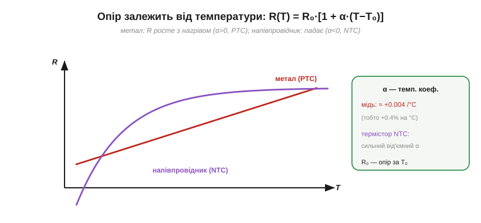
*Рис. 1.3.4.1. У **металу** опір росте з нагрівом (додатний коефіцієнт α, **PTC**) — бо гарячіша решітка дужче коливається й частіше збиває електрони (§1.2.9). У **напівпровідника** опір, навпаки, падає (від'ємний α, **NTC**) — бо тепло додає вільних носіїв (§1.2.8). Для міді α ≈ +0.004 на °C (тобто +0.4% на кожен градус).*

Тут R₀ — опір за опорної температури T₀, а **температурний коефіцієнт** α каже, на яку частку міняється опір на кожен градус. Метали мають **додатний** α (PTC — *Positive Temperature Coefficient*), напівпровідники й термістори — **від'ємний** (NTC). Механізм обох знаків ми вже розклали в §1.2.9–§1.2.10; тут зосередимося на наслідках.

**Приклад (нагрів змінює опір).** Мідний дріт має 10 Ом за 20 °C. Який його опір, коли він розігріється до 100 °C?

```
R = R₀·[1 + α·(T−T₀)] = 10·[1 + 0.004·(100−20)]
R = 10·[1 + 0.32] = 13.2 Ом
```

### Холодна й гаряча нитка: кидок струму

Найяскравіше PTC металу проявляється в **лампі розжарення**. Її вольфрамова нитка холодною має невеликий опір, а розжарившись до ~2500 °C — у **десять-п'ятнадцять разів більший**.

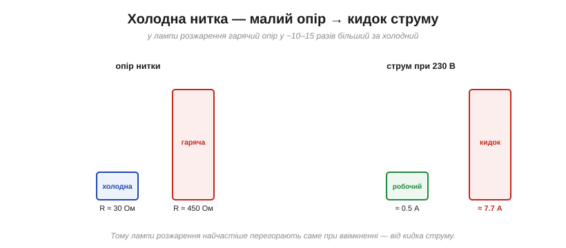
*Рис. 1.3.4.2. Холодна нитка (малий R) у першу мить після ввімкнення пропускає величезний **кидок струму** (inrush). Нитка миттю розжарюється, її опір зростає в рази — і струм спадає до робочого. Тому лампи розжарення майже завжди перегорають саме в мить увімкнення.*

**Приклад (кидок струму лампи).** Нитка має 30 Ом холодною і 450 Ом гарячою. Які струми від мережі 230 В?

```
у момент ввімкнення (холодна): I = 230/30  ≈ 7.7 А   ← кидок
у робочому режимі (гаряча):    I = 230/450 ≈ 0.5 А
```

Кидок у **п'ятнадцять разів** більший за робочий струм! Саме він і добиває стару нитку.

> 📜 Сама вольфрамова нитка має багату історію: полювання на матеріал тривало десятиліттями й по різних країнах — і не без міфів про «єдиного винахідника» (та про «наш пріоритет»): [Полювання на нитку](ch03-s4-history-filament.md).

Кидок струму на старті є не лише в ламп — але причини в різних пристроїв **різні**. У **двигуна** головна причина не в опорі: поки він не розкрутився, у ньому ще немає **проти-ЕРС** (зустрічної напруги, що стримує струм), тож у перші миті струм у рази більший за робочий (про проти-ЕРС — далі в курсі, коли дійдемо до котушок і двигунів). У **трансформатора** кидок **магнітний** — від насичення осердя, залишкового потоку й самого моменту вмикання, а не від опору обмотки. А справді «омічний» кидок від холодного опору — це передусім про **нитки розжарення й нагрівачі**. Спільне одне: на старті струм часто значно більший за робочий.

> 🔌 А як той кидок **приборкати** на вході блока живлення? Дзеркальною деталлю — NTC-термістором, опір якого холодним великий, а нагрівшись падає: [NTC проти кидка струму](ch03-s4-c-inrush-ntc.md).

> 🔧 **Навіщо це.** Кидок струму (inrush) на старті треба враховувати **завжди**: пусковий струм ламп розжарення, моторів, трансформаторів, блоків живлення буває в рази більший за робочий. Тому запобіжники й ключі добирають із запасом, а часом ставлять спеціальні обмежувачі пускового струму (часто — саме NTC-термістор, що холодним має великий опір і «пом'якшує» старт).

### Небезпечний зв'язок: теплова втеча (NTC)

А тепер — головне для Розділу 1.3. Струм у опорі **виділяє тепло** (I²R, §1.3.6), тепло змінює **опір**, а змінений опір змінює **струм**… Виникає **петля зворотного зв'язку** — і її напрямок вирішує все.

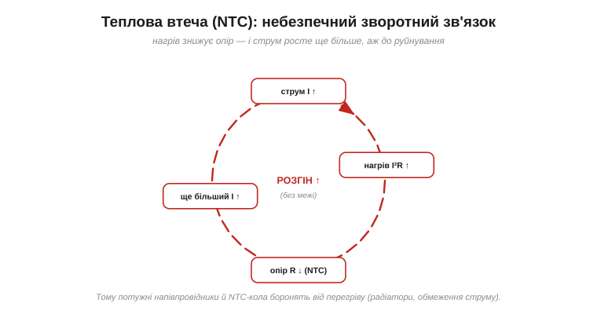
*Рис. 1.3.4.3. Якщо опір падає з нагрівом (NTC), петля **розганяється**: більший струм → більший нагрів → менший опір → ще більший струм… і так без межі, аж до руйнування. Це **теплова втеча** (*thermal runaway*).*

Коли коефіцієнт **від'ємний** (NTC), зворотний зв'язок **підсилювальний** і небезпечний: струм гріє елемент, від нагріву опір падає, тож струм росте ще дужче, гріє ще сильніше — і процес лавиною веде до перегріву й загибелі. Це **теплова втеча**, бич потужних напівпровідників (діодів, транзисторів), які теж мають схильність до NTC.

Особливо підступна теплова втеча в потужних **транзисторах**: якщо якась ділянка кристала нагрілася трохи більше, вона через NTC починає пропускати більший струм, від цього гріється ще дужче — і вся потужність стягується в одну **гарячу пляму**, що пропалює кристал (так зване «вторинне пробивання»). Тому силові ключі ніколи не лишають без тепловідводу й контролю струму.

### Рятівний зв'язок: самостабілізація (PTC)

А якщо коефіцієнт **додатний** (PTC), та сама петля стає **гальмом** — і працює нам на користь.

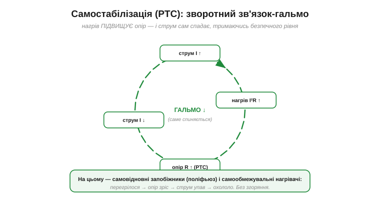
*Рис. 1.3.4.4. Якщо опір росте з нагрівом (PTC), петля **сама себе спиняє**: більший струм → більший нагрів → більший опір → струм падає назад. Елемент сам утримує безпечний режим.*

Тут нагрів **підвищує** опір, тож за заданої **напруги** струм сам **спадає** й потужність падає — система сама себе береже. (Це справджується саме за живлення від джерела напруги; якби живило ідеальне **джерело струму**, зростання опору, навпаки, лише збільшувало б потужність P = I²R.) На цьому збудовано дуже корисні речі: **самовідновний запобіжник** (*поліф'юз*, polyfuse), що при надструмі різко підвищує опір і «перекриває» коло, а охолонувши — відновлюється; і **самообмежувальні нагрівачі**, що тримають задану температуру без терморегулятора (нагрілися — опір зріс — потужність упала).

Як саме працює поліф'юз? Це провідний полімер, начинений вуглецевими зернами: у нормі зерна щільно дотикаються — опір малий. Та щойно надструм розігріє полімер, той трохи **розширюється**, зерна розходяться, і опір стрибає в сотні разів — коло «перекрите». Охолонувши, полімер стискається назад, і запобіжник сам відновлюється. Так само поводяться керамічні **PTC-нагрівачі**: розігрівшись до своєї порогової температури, вони різко підвищують опір і самі обмежують потужність, тож не перегріваються навіть без терморегулятора (фени, обігрів салону авто, дзеркал).

> 🔧 **Навіщо це.** Знак температурного коефіцієнта — це різниця між **рятунком і катастрофою**. PTC дає **самозахист** (поліф'юзи в USB-портах і акумуляторах, самообмежувальні нагрівачі, обігрів дзеркал). NTC, навпаки, вимагає **пильності**: потужні транзистори й діоди треба захищати від теплової втечі — радіаторами, обмеженням струму, контролем температури. Проєктуючи будь-що силове, завжди питайте: «а куди поведе цей зворотний зв'язок, якщо деталь нагріється?».

### А якщо охолоджувати?

Якщо нагрів збільшує опір металу, то **охолодження** його зменшує — і це наводить на думку: а що, як охолодити дуже сильно? Опір падатиме, падатиме… і в деяких матеріалів за наднизьких температур він раптом стрибає **точно в нуль** — настає **надпровідність**. Це одне з найдивовижніших явищ фізики, і йому присвячено окрему історичну вставку.

> 📜 Як 1911 року вперше побачили зникнення опору й що це означає — у вставці [Надпровідність: Камерлінг-Оннес, 1911](ch03-s4-history-superconductivity.md).

---

Підсумок §1.3.4: опір залежить від температури за законом **R(T) = R₀[1 + α(T−T₀)]** — у металів α додатний (PTC, опір росте), у напівпровідників/термісторів від'ємний (NTC, падає). Звідси **кидок струму** холодних ниток (лампа при ввімкненні) і, головне, **зворотний зв'язок тепло↔опір**: при NTC він небезпечно **розганяється** (теплова втеча), при PTC — рятівно **гальмує** (самовідновні запобіжники, самообмежувальні нагрівачі). А за наднизьких температур опір може зникнути зовсім — це надпровідність. Ми багато говорили про тепло як наслідок струму — час порахувати його прямо, через **потужність**.

---

## 1.3.5 Потужність: P = V·I

Увесь Розділ 1.3 ми говорили про тепло як **наслідок** струму на опорі — кидок струму в нитці, теплову втечу, нагрів дроту. Та щоразу це були слова «більше» чи «менше». Час дати теплу й енергоспоживанню **число**. Ключ до нього — **потужність** (*power*, P): скільки енергії коло перетворює щосекунди. З неї ми порахуємо і нагрів резистора, і споживання мотора, і навіть рахунок за світло.

### Потужність — енергія за секунду

Почнімо з означення. **Потужність — це енергія за одиницю часу**: P = W / t, тобто скільки джоулів витрачається щосекунди. Одиниця — **ват** (*watt*, Вт), і за визначенням 1 Вт = 1 Дж/с.

Тепер згадаймо два факти з попередніх розділів — і формула складеться сама:

- З §1.1.5: коли заряд q проходить різницю потенціалів V, поле віддає йому енергію W = q·V (саме так ми й означили вольт — джоуль на кулон).
- З §1.2.1: струм — це заряд за секунду, I = q/t.

Підставмо перше в означення потужності й згрупуймо доданки:

P = W/t = (q·V)/t = (q/t)·V = **I·V**.

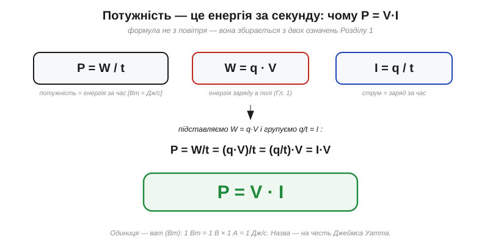
*Рис. 1.3.5.1. Формула P = V·I не постулат, а наслідок означень: потужність — це енергія за час (P = W/t), енергія заряду — це W = q·V (Розділ 1.1), а струм — це заряд за час (I = q/t). Підставивши й згрупувавши, дістаємо P = (q/t)·V = I·V. Одиниця — ват: 1 Вт = 1 В × 1 А = 1 Дж/с.*

Ось і вся таємниця: **P = V·I**. Потужність, яку споживає (чи віддає) будь-яка ділянка кола, дорівнює добутку напруги на ній на струм крізь неї. У зручних одиницях: вольти × ампери = вати. Лампа на 12 В, крізь яку тече 2 А, споживає 24 Вт; USB-порт 5 В × 1 А дає 5 Вт. Формула напрочуд проста — і працює для будь-чого: резистора, мотора, світлодіода, цілого приладу.

Звідки коло бере цю енергію і куди вона дівається? Тут діє закон збереження з історії Джоуля: джерело (батарея) **віддає** потужність P = V·I, а кожен елемент її **споживає** — і сума спожитого точно дорівнює відданому, бо енергія не зникає. А куди йде спожите, залежить від елемента: у резисторі **вся** потужність стає теплом (про це §1.3.6), у моторі частина обертає вал (механічна робота), у світлодіоді частина стає світлом. Формула P = V·I однаково міряє і те, що джерело дає, і те, що навантаження бере, — тому нею послуговуються по обидва боки кола.

### Три форми: P = V·I = I²R = V²/R

P = V·I — загальна формула. Але часто ми знаємо не саму пару (V, I), а щось одне разом з опором R. Тут у пригоді стає закон Ома (§1.3.2): V = I·R. Підставмо його двома способами:

- замінимо V на I·R:  P = V·I = (I·R)·I = **I²·R**;
- замінимо I на V/R:  P = V·I = V·(V/R) = **V²/R**.

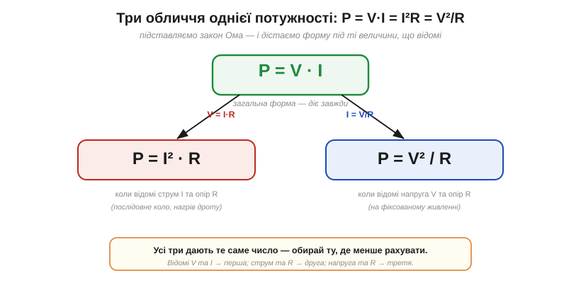
*Рис. 1.3.5.2. Та сама потужність у трьох формах. Підставляючи закон Ома (V = I·R або I = V/R) у загальну P = V·I, дістаємо P = I²R (коли відомі струм і опір) та P = V²/R (коли відомі напруга й опір). Усі три дають однакове число — обирай зручнішу.*

Маємо три рівноправні обличчя однієї величини:

- **P = V·I** — коли відомі напруга й струм (універсальна).
- **P = I²·R** — коли відомі струм і опір. Зверніть увагу на **квадрат струму**: вдвічі більший струм гріє вчетверо сильніше.
- **P = V²/R** — коли відомі напруга й опір. Тут квадрат напруги, а опір — у знаменнику.

Це не три закони, а **один**, записаний під різні вхідні дані. Усі три завжди дають однакове число; обирають ту форму, де під рукою потрібні величини.

Два уточнення на майбутнє. По-перше, рівність трьох форм (P = I²R = V²/R) тримається саме для **омічного** елемента, де діє V = I·R. У мотора чи світлодіода загальна потужність — це P = V·I, але вже не вся вона стає теплом, тож P = I²R дає лише її **резистивну** частину (решта йде в рух чи світло). По-друге, у колах **змінного** струму з конденсаторами й котушками середня потужність — це ще й помножене на **коефіцієнт потужності** cos φ: P = V_rms·I_rms·cos φ. У цьому розділі коло резистивне (cos φ = 1), тож P = V·I; а до реактивних кіл повернемося згодом.

Квадрати в цих формах — не дрібниця, а ключ до великої інженерії. Візьмімо передачу енергії лінією, що сама має опір R_лінії. Потрібну потужність до споживача можна гнати або великим струмом за малої напруги, або малим струмом за великої — добуток V·I той самий. А от **втрати** в самому дроті — це P = I²·R_лінії, тобто залежать від **квадрата струму**. Зменшивши струм удесятеро (піднявши напругу вдесятеро), втрати в лінії падають у **сто** разів. Саме тому енергію через усю країну передають надвисокою напругою, а під'їжджаючи до споживача, знижують її трансформаторами, — це технічне серце «війни струмів» з історії §1.2.12.

### Приклад: 12 В на резисторі 100 Ω

Переконаймося, що три форми справді сходяться.

**Приклад. Резистор 100 Ω під напругою 12 В — яка потужність розсіюється?**

```
Дано:     V = 12 В,   R = 100 Ω
Струм:    I = V / R   = 12 / 100      = 0.12 А
Спосіб 1: P = V · I   = 12 × 0.12     = 1.44 Вт
Спосіб 2: P = I² · R  = 0.12² × 100   = 1.44 Вт
Спосіб 3: P = V² / R  = 12² / 100     = 1.44 Вт
```

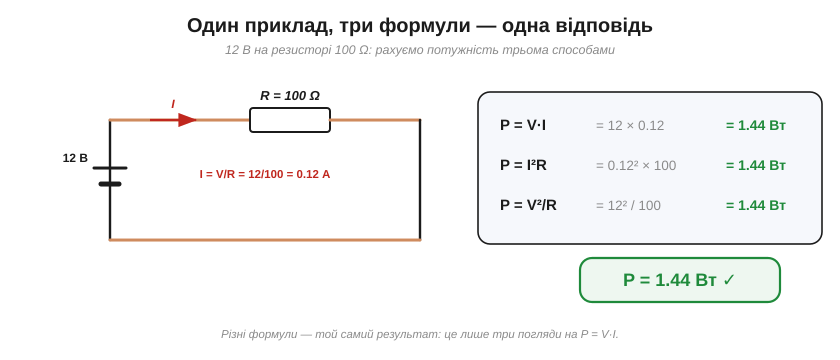
*Рис. 1.3.5.3. Резистор 100 Ω під 12 В: спершу струм I = 0.12 А, далі потужність трьома формулами — і всі сходяться до 1.44 Вт. Різні шляхи, та сама відповідь.*

Усі три дороги привели до **1.44 Вт** — як і має бути. На практиці це й означає «резистор розсіює 1.44 Вт тепла»: саме стільки енергії він віддає щосекунди в повітря. Чи витримає це сам резистор — окреме питання теплової межі, до якого ми дійдемо в §1.3.7.

### Куди йде тепло: на великий опір чи на малий?

Тут чигає пастка інтуїції. «Більший опір — більше тепла»? Іноді так, іноді навпаки. Усе вирішує, **що в елементів спільне**.

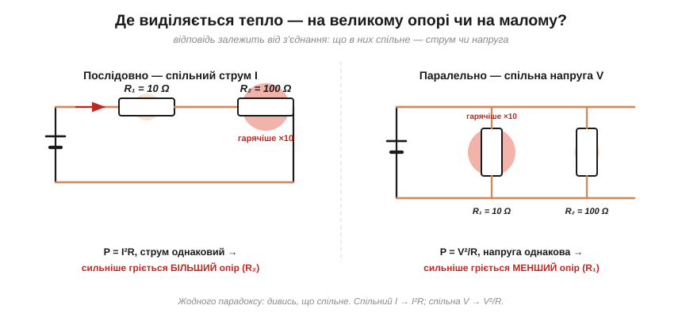
*Рис. 1.3.5.4. Де зосередиться тепло, вирішує спільна величина. Послідовно (спільний струм) гарячіший БІЛЬШИЙ опір — P = I²R. Паралельно (спільна напруга) гарячіший МЕНШИЙ опір — P = V²/R. Ореол показує, де виділяється більше потужності.*

- **Послідовно** крізь усі елементи тече **той самий струм** I. Тоді зручна форма P = I²R, і вона каже: **більший опір гріється дужче**. У ланцюжку 10 Ω + 100 Ω за спільного струму резистор на 100 Ω виділяє вдесятеро більше тепла. Тому в послідовному колі дужче гріється **опірніша** ділянка — на цьому, зокрема, стоїть і запобіжник. (Утім, *що саме* згорить, вирішує не лише опір: важать ще маса, тепловідвід, температура плавлення, конструкція й час. Запобіжник — це не просто «найбільший опір», а спеціально розрахований елемент із характеристикою «струм–час», *I²t*.)
- **Паралельно** на всіх елементах **однакова напруга** V. Тоді зручна форма P = V²/R, і висновок протилежний: **менший опір гріється дужче**. Підключені до спільних 12 В, резистор 10 Ω бере вдесятеро більшу потужність, ніж 100 Ω. Тому коротке замикання (опір майже нуль) дає велетенську потужність — і пожежу. (Застереження: «повна напруга» тут — ідеалізація. Насправді струм к.з. обмежують внутрішній опір джерела, опір дротів і контактів та захист, а напруга в точці замикання просідає — тож тепло виділяється не лише там, а й у джерелі та проводці, §1.5.1.)

Підставмо числа, щоб закріпити. Нехай послідовним колом 10 Ω + 100 Ω тече I = 0.1 А: на першому P₁ = 0.1²·10 = 0.1 Вт, на другому P₂ = 0.1²·100 = 1 Вт — гаряче саме на **більшому** опорі. Тепер ті самі два резистори паралельно під V = 10 В: P₁ = 10²/10 = 10 Вт, P₂ = 10²/100 = 1 Вт — тепер навпаки, гаряче на **меншому**. Опори ті самі, а тепло перерозподілилося протилежно — змінилося лише те, що в них спільне.

> 🔧 **Навіщо це.** Пара «I²R за спільного струму / V²/R за спільної напруги» — практичний компас. Вона пояснює, чому **запобіжник** (тонкий, опірний, увімкнений послідовно) згоряє першим, рятуючи решту; чому **коротке замикання** (малий опір на повній напрузі) таке руйнівне; чому довгий тонкий дріт гріється на всій довжині (§1.3.3). Питайте себе: тут спільний струм чи спільна напруга? — і одразу видно, де зосередиться тепло.

### Відчути ват

Скільки це — ват? Самі числа мало промовляють, тож відчуймо масштаб.

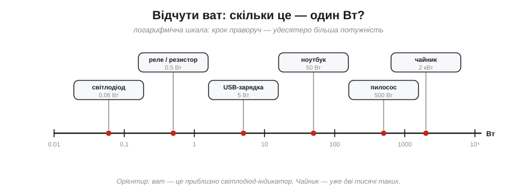
*Рис. 1.3.5.5. Масштаб ватів — логарифмічний: від світлодіода (0.06 Вт) до чайника (2 кВт) понад чотири порядки. Один ват — це приблизно яскравий індикаторний світлодіод.*

Світлодіод-індикатор світить на якісь 0.06 Вт; типовий резистор у схемі розсіює чверть вата; USB-зарядка дає 5 Вт; ноутбук — десятки ватів; а побутові нагрівачі (чайник, праска, фен) — це вже **тисячі** ватів. Між світлодіодом і чайником — понад чотири порядки величини: ось чому тонкі сигнальні дроти й товсті силові кабелі живуть у різних світах.

Той самий «ват користі» можна купити за різну ціну в інших ватах. Стара лампа розжарення на 60 Вт і світлодіодна на 8 Вт світять майже однаково — різниця в тому, що лампа розжарення майже всю потужність перетворює на **тепло**, а не на світло (тому вона й гаряча). Це знову §1.2.5: енергія нікуди не зникає, лише розподіляється між **корисною** частиною (світло) і **марною** (тепло); відношення корисного до повного й називають **коефіцієнтом корисної дії** (*efficiency*). Тому потужність приладу сама по собі ще не каже, скільки з неї йде на діло.

> 🔧 **Навіщо це.** Не плутайте **потужність** і **енергію**. Потужність P (Вт) — це **швидкість** витрати, скільки енергії йде щосекунди. Енергія W = P·t (Дж) — уже накопичена сума. У рахунку за світло платять за енергію, у **кіловат-годинах** (кВт·год): прилад на 2 кВт за годину з'їдає 2 кВт·год. Тому чайник на 2 кВт, що кипить 5 хвилин, бере менше, ніж холодильник на 100 Вт за добу: 2000·(5/60) ≈ 167 Вт·год проти 100·24 = 2400 Вт·год. Вирішує не сама потужність, а **потужність × час**.

> 🧮 **Порахувати в числах.** Джоулі, ват-години й кіловат-години легко плутати між собою — а найпідступніше «мА·год» на батарейках насправді не енергія, а **заряд**. Як переводити ці одиниці одне в одне й рахувати, на скільки годин вистачить акумулятора, — у вставці [кВт·год, мА·год і джоулі](ch03-s5-m-energy-units.md).

Одиницю названо на честь шотландця **Джеймса Уатта** (*James Watt*), чия парова машина дала світові саме поняття вимірюваної «потужності» — і навіть «кінську силу» як її мірило. Як інженер-практик придумав, чим міряти міць машин, — у вставці [Джеймс Уатт і «кінська сила»](ch03-s5-history-watt.md).

---

Підсумок §1.3.5: потужність — це енергія за секунду, **P = V·I**, а через закон Ома — ще й **P = I²R = V²/R** (усі три дають те саме число). Квадрат у формулах робить струм і напругу особливо «гарячими». Те, що в елементів **спільне** — струм чи напруга, — і вирішує, на якому опорі зосередиться тепло. А помноживши потужність на час, дістанемо енергію (ті самі кВт·год у рахунку). Тепер ми готові порахувати головний наслідок — **скільки саме гріється** резистор і де лежить його теплова межа.

---

## 1.3.6 Джоулеве тепло: чому й скільки гріється

§1.3.5 дав нам потужність. Тепер скеруймо її на головний наслідок усього розділу — **тепло**. Ми вже знаємо *чому* опір гріє (зіткнення електронів із решіткою, §1.2.9) і *якою формулою* рахувати потужність (P = I²R, §1.3.5). Лишилося звести це в інженерну відповідь: **скільки** саме виділяється тепла, **куди** воно дівається і **де межа**, за якою деталь гине. Це і є джоулеве тепло — те, заради чого існують радіатори, запобіжники й паспортна «допустима потужність».

### Чому гріється: вся потужність опору → тепло

Почнімо з найважливішого факту. У **чистому опорі** вся підведена електрична потужність перетворюється на **тепло** — на всі сто відсотків. Нічого іншого резистор із енергією зробити не вміє: він не крутить вал, не світить (помітно), не запасає заряд. Електрони розганяються полем і б'ються об решітку, віддаючи їй енергію (§1.2.9), а та проявляється як **нагрів**.

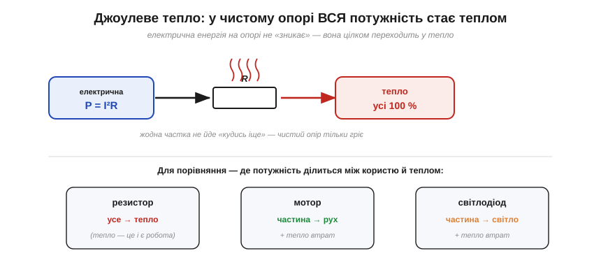
*Рис. 1.3.6.1. У чистому опорі вся підведена потужність P = I²R перетворюється на тепло — на сто відсотків. На відміну від мотора (частина енергії стає рухом) чи світлодіода (частина — світлом), резистор не має «корисного виходу», крім самого тепла.*

Це прямо випливає зі збереження енергії (історія Джоуля): скільки електричної потужності зайшло в опір, стільки теплової з нього й вийшло. Тому для резистора слова «спожита потужність» і «виділене тепло» — те саме число. У мотора чи світлодіода частина потужності йде на **корисний вихід** (рух, світло), і лише решта гріє; у резистора корисного виходу нема — тепло і є його єдиний «продукт».

Власне, **опір** — це і є та властивість матеріалу, що перетворює електричну енергію на теплову. Звідси симетрія: усе, що має опір, від струму гріється, а все, що від струму гріється, має опір. Тому джоулеве тепло **невідступне** — його не можна «вимкнути», лишивши струм; можна лише зменшити (меншим струмом чи опором) або краще відвести. («Чистий опір» — то, звісно, ідеалізація, але для звичайного резистора на постійному чи повільному струмі вона працює чудово: паразитні ємність та індуктивність тут мізерні.)

### Скільки тепла: закон Джоуля Q = I²R·t

Потужність P = I²R — це тепло **за секунду**. Щоб дістати всю виділену **енергію** за час t, множимо на час — і отримуємо **закон Джоуля** (той самий, що Джоуль виміряв 1841 року, — див. історію розділу):

Q = I²·R·t  (джоулів тепла за час t).

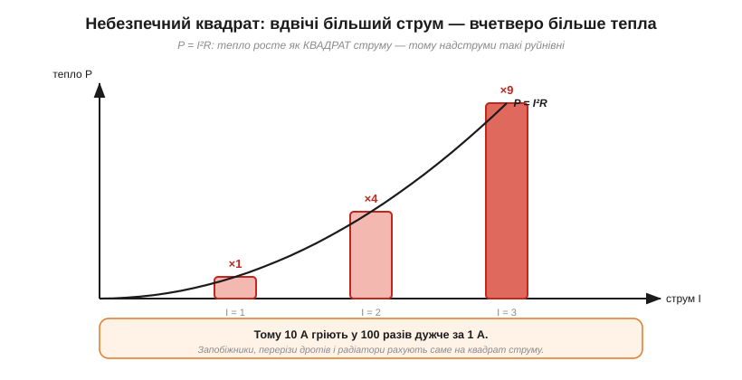
*Рис. 1.3.6.2. Тепло залежить від квадрата струму: при струмі 1, 2, 3 (у відносних одиницях) потужність відноситься як 1 : 4 : 9. Подвоїш струм — учетверо більше тепла. Саме цей квадрат робить надструми такими руйнівними.*

Найважливіше тут — **квадрат струму**. Удвічі більший струм дає вчетверо більше тепла; уп'ятеро більший — у двадцять п'ять разів. Тому надструми (коротке замикання, перевантаження) такі небезпечні: тепло злітає лавиною. І тому ж енергію вигідно передавати малим струмом високої напруги — у лінії втрати теж ідуть за I²R (ми це бачили в §1.3.5 і в «війні струмів» §1.2.12).

**Приклад. Скільки тепла дасть резистор 100 Ω при струмі 0.2 А за 5 хвилин?**

```
Потужність:  P = I²·R  = 0.2² × 100   = 4 Вт
Час:         t = 5 хв   = 300 с
Тепло:       Q = P · t  = 4 × 300      = 1200 Дж
```

А ось приклад, де тепло — бажане. Електрочайник на 2000 Вт за 5 хвилин виділяє Q = 2000 × 300 = 600 000 Дж, тобто 600 кДж — приблизно стільки й треба, щоб закип'ятити літр-півтора води. Формула та сама, Q = P·t, і джоуль той самий; різниця лише в тому, що тут роль «резистора» грає товста ніхромова спіраль, спеціально розрахована на тисячі ватів, а нагрів — мета, а не біда.

Зверніть увагу: 4 Вт — це **багато** для звичайного сигнального резистора (типовий розрахований на 0.25 Вт). Такий струм спалив би його; для цього потрібен потужний (силовий) резистор. Звідки взялася ця межа — наступний крок.

### Куди йде тепло й усталена температура

Тепло виділяється всередині деталі, а **відводиться** з її поверхні — у повітря, у плату, у радіатор. Поки виділяється більше, ніж відводиться, деталь **нагрівається**. Але що гарячіша вона стає, то швидше віддає тепло назовні (відведення росте з різницею температур). Тому процес не нескінченний: тіло гріється, доки **відведення не зрівняється з виділенням**, — і застигає на **усталеній температурі**.

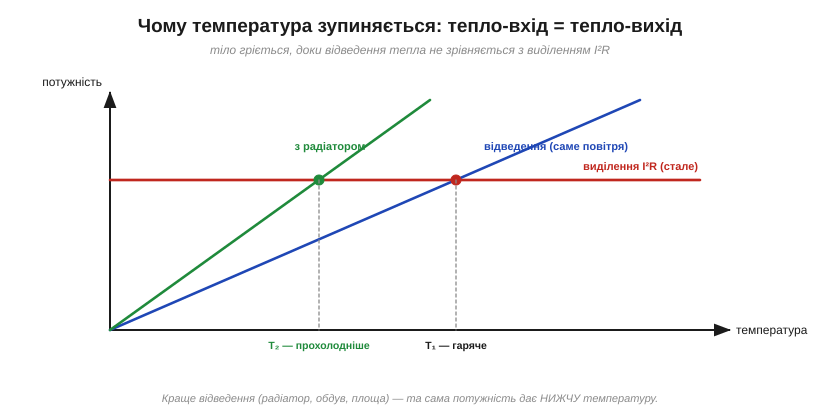
*Рис. 1.3.6.3. Виділення I²R стале (червона лінія), а відведення тепла росте з температурою (сині/зелені лінії). Де вони перетинаються — там температура й застигає. Краще відведення (радіатор) — нижча усталена температура при тій самій потужності.*

Звідси й уся наука охолодження. Та сама потужність може лишити деталь ледь теплою або розжарити її — усе залежить від того, **як добре вона скидає тепло**. Збільшити відведення можна площею (більший корпус), **радіатором** (ребриста металева насадка), обдувом (вентилятор), тепловідвідними доріжками на платі. Інженери описують це **тепловим опором** (наскільки нагріється деталь на кожен ват) — але нам поки досить ідеї: **потужність задає нагрів, відведення — кінцеву температуру**.

Є ще час. Усталеної температури деталь набирає **не миттєво**: спершу майже все тепло йде на її власний прогрів, і лише потім встановлюється рівновага вхід-вихід. Маленький резистор прогрівається за секунди, масивний радіатор — за хвилини. Через цю **теплову інерцію** коротке перевантаження деталь часто переживає, а таке саме, але тривале — вже ні: важлива не лише потужність, а й **як довго** вона діє. Тому в паспортах нерідко окремо вказують тривалу й короткочасну (імпульсну) потужність.

### Допустима потужність: межа компонента

Кожен компонент має **допустиму (номінальну) потужність** (*power rating*) — скільки ватів він може безпечно розсіювати, не перегріваючись. Резистори бувають на 0.125, 0.25, 0.5, 1, 2 Вт і більше; що більший корпус — то більше тепла він стерпить. Перевищиш межу — і температура виходить за безпечну: спершу опір «пливе» (дрейф номіналу), потім лак темніє, а далі обвуглення й **обрив**.

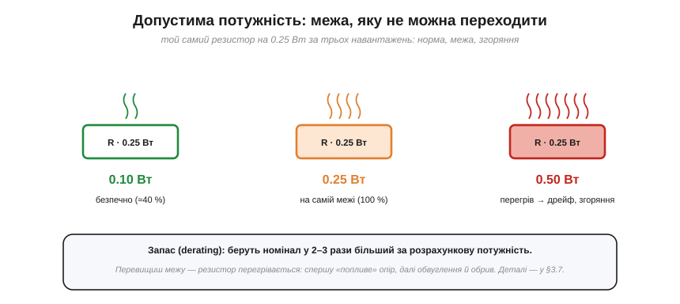
*Рис. 1.3.6.4. Той самий резистор на 0.25 Вт за трьох навантажень: при 0.1 Вт холодний і щасливий, при 0.25 Вт — на самій межі, при 0.5 Вт перегрівається: опір «пливе», далі обвуглення й обрив. Тому беруть запас.*

Ще тонкість: паспортна потужність указана для певних умов — зазвичай для вільного повітря за кімнатної температури. У тісному гарячому корпусі, упритул до інших деталей чи за високої температури довкілля та сама деталь стерпить **менше**. Це теж derating, тільки **за температурою**: що гарячіше й тісніше навколо, то більший запас слід закладати.

> 🔧 **Навіщо це.** Добираючи резистор, рахують його потужність (P = I²R чи V²/R) і беруть номінал **із запасом** — зазвичай у 2–3 рази більший за розрахунковий. Це **derating** (робота з запасом): деталь на межі живе недовго й гріє все навколо. Правило просте: спершу порахуй, **скільки ватів** розсіє елемент, і лише потім обирай його «розмір». Забути про потужність — класична причина, чому схема «за законом Ома правильна», а на столі димить. Докладно добір — у §1.3.7.

### Коли тепло — друг, а коли — ворог

Джоулеве тепло саме по собі не «погане» й не «добре» — усе залежить від того, чи воно **мета**, чи **побічна втрата**.

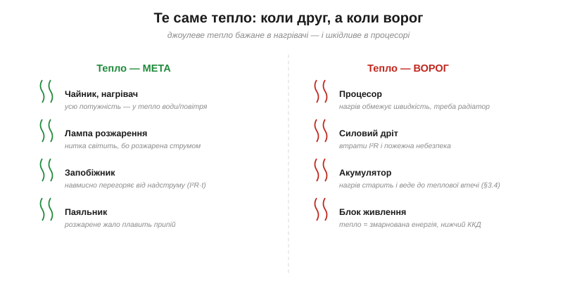
*Рис. 1.3.6.5. Те саме джоулеве тепло буває бажаним (чайник, лампа розжарення, запобіжник, паяльник) і шкідливим (процесор, силовий дріт, акумулятор, блок живлення). Різниця лише в тому, чи тепло — мета, чи побічна втрата.*

Там, де тепло — **мета**, його роблять навмисне: чайник, праска, обігрівач, паяльник, нитка лампи розжарення. Окремий гарний приклад — **запобіжник**: це шматочок дроту, навмисне розрахований так, щоб за надструму джоулеве тепло I²R·t його **розплавило** й розірвало коло раніше, ніж згорить щось дорожче. Тут руйнівний квадрат струму працює нам на користь.

А там, де тепло — **ворог**, із ним воюють: процесор треба охолоджувати, бо нагрів обмежує швидкість; силовий дріт гріється втратами й може спричинити пожежу; акумулятор від нагріву старіє й ризикує тепловою втечею (§1.3.4); у блоці живлення кожен ват тепла — це змарнована енергія й нижчий ККД. Тут уся інженерія — про те, як тепла виділити **менше** (більший переріз, менший струм) і відвести **краще** (радіатори, обдув).

Іноді той самий прилад показує обидва обличчя тепла. Лампа розжарення мала б **світити**, та насправді близько 95 % її потужності йде в **тепло** й лише якісь 5 % — у світло (тому вона й гаряча). Саме ця марнотратність її й поховала: світлодіод дає те саме світло за 8–10 Вт замість 60, бо гріється куди менше. Тепло, яке для нагрівача — жадана мета, для лампи виявилося ганебною втратою. Та сама фізика, протилежний присуд — усе вирішує, чого ми від приладу хотіли.

---

Підсумок §1.3.6: у чистому опорі **вся** потужність стає теплом; його кількість — за законом Джоуля **Q = I²R·t**, із грізним **квадратом струму**. Тіло гріється, доки відведення не зрівняється з виділенням, — звідси **усталена температура** й уся наука радіаторів. Кожен компонент має **допустиму потужність**, яку добирають із запасом (derating). А саме тепло буває і метою (нагрівачі, запобіжники), і ворогом (процесори, дроти). Тепер у нас є все, щоб грамотно **дібрати головний компонент розділу — резистор**: за номіналом, потужністю й запасом.

---

## 1.3.7 Резистор як компонент: номінал, потужність, добір і запас

Досі опір R був для нас **числом** у формулах. Час познайомитися з резистором як із **реальною деталлю**, яку купують і паяють: вона має не лише опір, а й точність, допустиму потужність, розмір і кольорове маркування. Дібрати правильний резистор — невелика, але обов'язкова інженерна процедура, якою й завершимо розділ. Тут сходиться все попереднє: закон Ома (§1.3.2), формула потужності (§1.3.5) і теплові межі (§1.3.6).

### Номінал і ряди E: чому 220, а не 200

Якщо погортати каталог резисторів, упадуть в око «дивні» номінали: 22, 47, 68, 220, 330 Ω — а круглих 20, 50, 70 чомусь немає. Це не примха. Номінали беруть зі **стандартних рядів E**: E6, E12, E24, E48… — по 6, 12, 24, 48 значень на кожну **декаду** (десятикратний проміжок), розставлених **логарифмічно**.

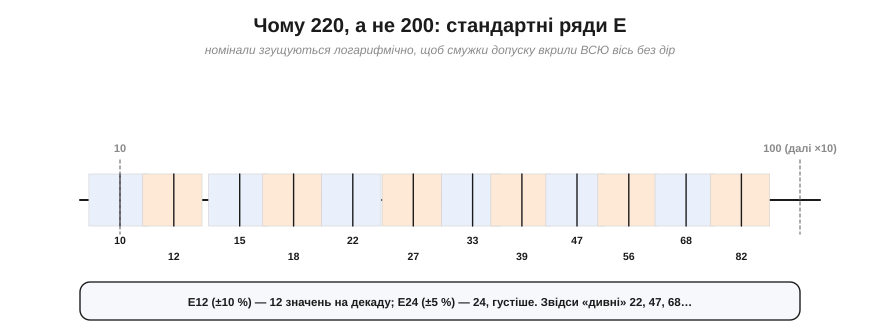
*Рис. 1.3.7.1. Номінали беруть не підряд, а з рядів E — по 12 (E12), 24 (E24) і більше значень на декаду, розставлених **логарифмічно**. Так смужки допуску (тут ±10 %) акуратно встеляють усю вісь без дір і зайвих перекриттів. Звідси й «дивні» 22, 47, 68 замість круглих 20, 50, 70.*

Логіка проста й красива. Кожен резистор має **допуск** — скажімо, ±10 %. Тоді «22 Ω ±10 %» накриває діапазон приблизно 20…24 Ω, «27 Ω ±10 %» — 24…30 Ω, і так далі: сусідні номінали **стикаються краями** допусків, укриваючи всю вісь без дір і без надмірних перекриттів. Якби крок був рівномірним (20, 30, 40…), то внизу декади номінали стояли б надто рідко, а вгорі — надто густо. Логарифмічний крок усуває це: що точніший допуск, то густіший ряд (E12 для ±10 %, E24 для ±5 %, E96 для ±1 %). Тому й значення такі «некруглі» — вони підігнані під геометричну прогресію, а не під нашу любов до десяток.

На практиці це означає ось що: порахувавши, скажімо, R = 287 Ω, ви не знайдете такого в продажу, а візьмете найближчий зі стандартного ряду — 270 чи 300 Ω (E24) або 270 чи 330 Ω (E12). Невелика похибка зазвичай несуттєва; а коли потрібен **точний** опір, його складають із кількох резисторів послідовно чи паралельно (як саме — у Розділі 1.4). Тому в шухляді радіоаматора лежать не всі опори підряд, а саме набір рядів E — і ним покривають будь-яку потребу.

> 🧮 **Звідки беруться самі числа.** Чому крок ряду — це множник ×10^(1/n), як із нього виходять 12, 15, 18… і чому густина ряду математично «одружена» з допуском (відношення сусідів ≈ (1+допуск)/(1−допуск)) — у вставці [Ряди E12/E24/E96: геометрична прогресія з кроком під допуск](ch03-s7-m-e-series.md).

### Кольоровий код: читаємо смужки

На дрібному резисторі не надрукуєш «220 Ω», тож номінал позначають **кольоровими смужками**. Класичний код — **чотирисмужковий**: дві перші смужки дають **цифри**, третя — **множник** (степінь десятки), четверта (трохи окремо) — **допуск**.


*Рис. 1.3.7.2. Чотири смужки: перші дві — цифри, третя — множник, четверта — допуск. Червона-червона-коричнева-золота = 2, 2, ×10, ±5 % = **220 Ω ±5 %**. Знизу — відповідність кольору й цифри.*

Послідовність кольорів варто знати напам'ять: **чорний 0, коричневий 1, червоний 2, оранжевий 3, жовтий 4, зелений 5, синій 6, фіолетовий 7, сірий 8, білий 9**. Множник кодують тими ж кольорами як степінь десятки (коричневий ×10, червоний ×100…), а допуск — золотий ±5 %, срібний ±10 %, коричневий ±1 %. Для точних резисторів є **п'ятисмужковий** код (три цифри + множник + допуск). Сучасні **SMD**-резистори (поверхневого монтажу) маркують не кольором, а друком: «221» означає 22×10 = 220 Ω.

Дві практичні поради. По-перше, читайте смужки з **правильного боку**: смужка допуску (золота чи срібна) зазвичай стоїть трохи окремо й завжди остання — від неї й орієнтуйтеся. По-друге, якщо колір вицвів або бере сумнів — не вгадуйте, а **зміряйте** опір мультиметром (Розділ 1.6); це найнадійніше. Кольоровий код — зручність для ока, але остаточну істину завжди скаже прилад.

> 🔌 **Покрокове декодування.** Повну таблицю колір→цифра, п'ятисмужковий код для точних резисторів і всі різновиди SMD-кодів («472», «4701», «4R7», «000»-перемичка) — із прикладами розшифрування — зібрано у вставці [Як прочитати резистор: кольорові кільця й SMD-коди](ch03-s7-c-resistor-marking.md).

### Допуск і розмір: скільки тепла стерпить

Окрім опору, у резистора два важливі паспортні числа. Перше — **допуск** (точність): ±5 % вистачає для більшості кіл, ±1 % беруть там, де номінал критичний (подільники, вимірювання). Друге — **допустима потужність**, про яку ми говорили в §1.3.6: скільки ватів деталь розсіє, не перегрівшись.

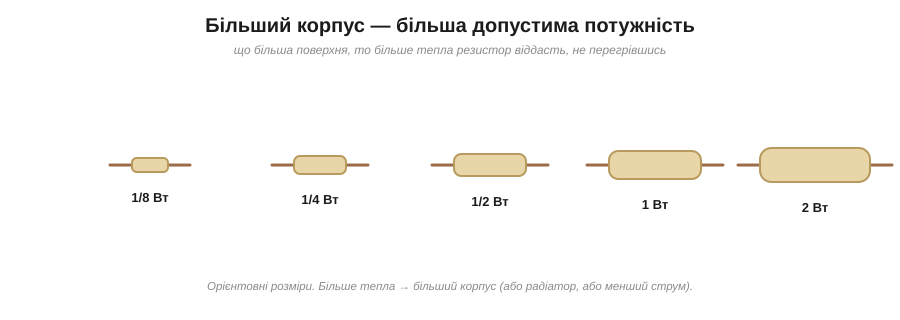
*Рис. 1.3.7.3. Допустима потужність зростає з розміром: що більший корпус, то більшу поверхню він має й тим більше тепла відведе, не перегрівшись. Той самий опір буває й на 1/8 Вт, і на 2 Вт — обирають за розрахунковою потужністю.*

Саме тому **той самий** опір (скажімо, 100 Ω) продають у різних «розмірах»: 1/8, 1/4, 1/2, 1, 2 Вт і більше. Більший корпус — більша поверхня — більше тепла він віддасть (згадайте усталену температуру §1.3.6). Різняться й матеріали: дешеві **вуглецеві** (±5 %), точніші й тихіші **металоплівкові** (±1 %), а для великих потужностей — **дротяні** (намотані ніхромом). Обираючи резистор, ви фактично називаєте три речі: **опір**, **допуск** і **допустиму потужність**.

> 🔌 **Особливий клас — шунт.** Окремо стоять резистори, зроблені навмисно дуже **малими** (міліоми) й точними, щоб ними **міряти струм** за спадом напруги. У них свої правила: чотири виводи й «кельвінівське» підключення, щоб опір власних проводів не псував вимір. Про них — у вставці [Шунти й силові резистори: міліоми та підключення Кельвіна](ch03-s7-c-shunt-kelvin.md).

Що насправді означає допуск? «220 Ω ±5 %» — це гарантія, що справжній опір цього екземпляра лежить десь між 209 і 231 Ω, а конкретно — будь-де в цих межах. Для світлодіода чи підтяжки така невизначеність геть байдужа, а от у точному **подільнику напруги** вона прямо позначиться на результаті — там і беруть ±1 %. Тобто допуск обирають не за гаслом «що точніше, то краще», а **за роллю** резистора в колі: де треба — точний, де байдуже — дешевий.

### Як дібрати: п'ять кроків

Зведімо все в коротку процедуру, придатну для будь-якого кола.

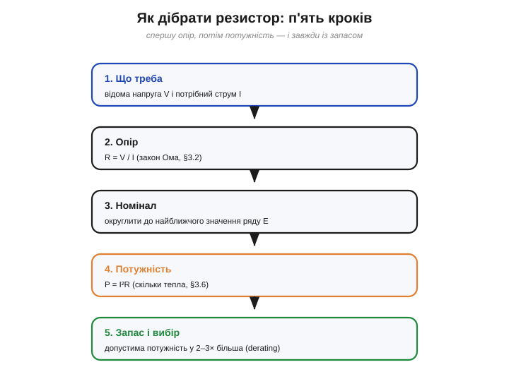
*Рис. 1.3.7.4. Порядок добору: 1) що треба (V, I); 2) опір R = V/I; 3) округлити до ряду E; 4) потужність P = I²R; 5) узяти допустиму потужність із запасом 2–3× (derating).*

1. **Що треба.** Випишіть, яка напруга має впасти на резисторі й який струм крізь нього потрібен.
2. **Опір.** Порахуйте R = V/I за законом Ома (§1.3.2).
3. **Номінал.** Округліть до найближчого значення ряду E — точно того опору може й не бути у продажу.
4. **Потужність.** Порахуйте, скільки тепла розсіє резистор: P = I²R (або V²/R, §1.3.5).
5. **Запас і вибір.** Візьміть допустиму потужність **у 2–3 рази більшу** за розрахункову (derating, §1.3.6) — і назвіть остаточно опір, допуск і потужність.

> 🔧 **Навіщо це.** Найчастіша помилка початківця — порахувати лише **опір** і забути про **потужність**. Схема «за законом Ома» правильна, а на столі резистор чорніє й димить, бо крізь нього йде забагато ватів. Тому крок 4 не пропускають **ніколи**: спершу опір, потім тепло, і завжди із запасом. Дешевше поставити більший резистор, ніж потім шукати, чому пахне горілим.

### Приклад: резистор для світлодіода

Найкласичніша задача — **струмообмежувальний резистор** для світлодіода (ми вже бачили її в §1.3.2). Світлодіод хоче певного струму (скажімо, 10 мА) і сам тримає на собі приблизно сталу напругу (≈2 В); решту напруги живлення мусить «з'їсти» послідовний резистор.

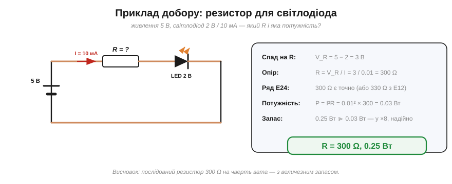
*Рис. 1.3.7.5. Класика: резистор для світлодіода. На R припадає 5 − 2 = 3 В; при 10 мА це R = 300 Ω (є в ряді E24). Потужність P = 0.03 Вт — мізер проти 0.25 Вт звичайного резистора, тож запас восьмиразовий.*

**Приклад. Світлодіод 2 В / 10 мА від джерела 5 В — який потрібен резистор?**

```
Спад на R:   V_R = 5 − 2          = 3 В
Опір:        R = V_R / I = 3 / 0.01 = 300 Ω      → ряд E24: є 300 Ω (або 330 Ω з E12)
Потужність:  P = I²·R   = 0.01² × 300 = 0.03 Вт
Запас:       беремо 0.25 Вт ≫ 0.03 Вт            → восьмиразовий запас, надійно
```

Відповідь: резистор **300 Ω, 0.25 Вт** (а на практиці часто беруть 330 Ω — трохи менший струм, ледь тьмяніше світло, зате стандартний номінал E12). Зверніть увагу, як спрацювали всі п'ять кроків — і як легко було б, порахувавши лише опір, узяти резистор без огляду на потужність. Тут запас вийшов величезний сам собою, та в силових колах саме крок 4 рятує деталь від згоряння.

А що було б **без** резистора? Світлодіод майже не обмежує струм сам, тож, увімкнений прямо в 5 В, він пропустив би струм, який стримує хіба що внутрішній опір джерела, — спалахнув би й одразу згорів. Резистор тут не дрібна формальність, а **рятівник**: він задає потрібний струм і бере на себе зайву напругу. Це і є відповідь на питання, навіщо в кожному ліхтарику й кожній платі стільки скромних резисторів: вони **тримають струм у шорах**.

---

## 1.3.8 Запобіжники й самовідновні PTC: захист від надструму

У §1.3.6 ми побачили: струм неминуче гріє (P = I²R), і в робочому колі це тепло помірне й кероване. Та варто чомусь піти не так — коротке замикання, заклинений мотор, переплутаний провід, — і струм підскакує далеко за межі, на які коло розраховане. Тоді те саме джоулеве тепло за секунди розжарює дроти, плавить ізоляцію, починає пожежу. Колу потрібен **автоматичний вартовий**, що відчує надмірний струм і обірве чи обмежить його, перш ніж станеться лихо. Найдавніший і найпростіший такий вартовий — **запобіжник**; найхитріший, що оживає сам, — **самовідновний PTC**. Про них ця тема.

### Надструм: чому це небезпечно

Спершу — про саму загрозу. **Надструм** (*overcurrent*) — це струм, більший за той, на який розраховане коло. Звідки він береться? Найгрізніше джерело — **коротке замикання** (*short circuit*): фазний провід через пошкодження торкається зворотного майже без опору. За законом Ома I = V/R (§1.3.2), якщо R падає майже до нуля, струм злітає до велетенських значень — стримує його хіба внутрішній опір джерела та опір самих дротів.

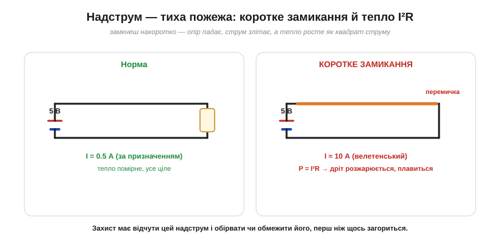
*Рис. 1.3.8.1. Ліворуч — норма: навантаження тримає струм у шорах, тепло помірне. Праворуч — коротке замикання: опір майже зник, струм злетів до десятків ампер, а тепло P = I²R розжарює дріт. Захист має обірвати це за частку секунди.*

А далі вступає квадрат із §1.3.6: тепло P = I²R росте **як квадрат струму**. Подвоївся струм — учетверо більше тепла; вдесятеро — у сто разів. Тонкий дріт, що спокійно ніс пів ампера, при десяти амперах розсіює в сотні разів більше — розжарюється до червоного, плавиться, підпалює довкілля. Тому надструм треба не «терпіти», а **швидко обірвати**.

**Приклад (що коїться при короткому).** Хай 5-вольтове джерело замкнули дротом опором лише 0.5 Ω:

```
I = V / R = 5 В / 0.5 Ω = 10 А
P = I²·R = 10² × 0.5 = 50 Вт
```

П'ятдесят ватів — у тоненькому дроті! Це більше за паяльник; дріт розжариться за мить. А був би опір іще менший — струм і тепло були б іще страшніші. Ось чому коротке замикання — не дрібниця, а аварія, яку треба гасити негайно.

Корисно одразу розрізнити **два** роди надструму, бо реагувати на них треба по-різному. **Коротке замикання** — раптове й катастрофічне: струм у десятки разів понад норму, шкода за частки секунди; тут захист мусить діяти блискавично. А **перевантаження** (*overload*) — повільніше й м'якше: до кола просто під'єднали забагато (надто потужний споживач, кілька приладів в один подовжувач), і струм перевищив норму, скажімо, у півтора раза. Воно не вибухає миттєво, та години такого «перегріву» так само псують ізоляцію й починають пожежу. Добрий вартовий має впоратися з обома: коротке рвати миттєво, а помірне перевантаження — за розумний час. Саме тому, як ми зараз побачимо, у запобіжника не одна точка спрацювання, а ціла **крива**.

### Запобіжник: найслабша ланка за вибором

Найстаріша ідея захисту геніально проста: вставити в коло послідовно **навмисно найслабшу ланку** — тонкий легкоплавкий дротик, що перегорить першим. Це **запобіжник** (*fuse*).

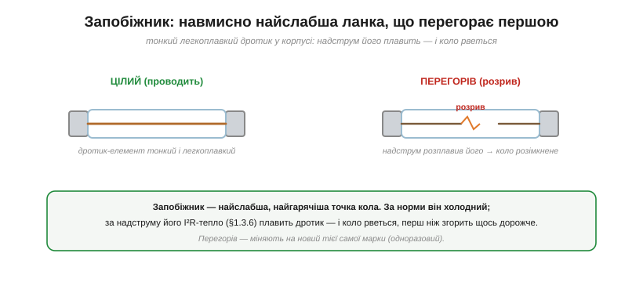
*Рис. 1.3.8.2. Запобіжник — тонкий легкоплавкий дротик у корпусі між двома ковпачками. Цілий — проводить; за надструму його I²R-тепло плавить дротик, лишаючи розрив. Деталь одноразова: перегорів — заміна.*

За нормального струму він холодний: його малий опір і помірний струм дають крихітне I²R-тепло, яке встигає стікати через ковпачки. Та щойно струм перевищить межу, тепло в тонкому елементі вже не встигає відводитись — він **розплавляється**, лишаючи розрив. Коло розімкнене, струм спинено. Запобіжник **одноразовий**: перегорів — ставлять новий.

У чому глибока мудрість «найслабшої ланки»? Вона дає змогу **обрати, де коло зламається**. Без запобіжника місце аварії обирає сама несправність — і це буде найвразливіша точка: дорога проводка в стіні, плата, акумулятор. Із запобіжником ламається саме він — копійчана, легкозамінна деталь у відомому, безпечному місці. Ви ніби кажете біді: «як уже щось горітиме — то хай оце».

> 📜 Ідея «найслабшої ланки» старша за лампочку: вона народилася на телеграфних лініях як захист від блискавки, а потім стала вартовим електричного дому. Хто й коли до неї дійшов — і чому в запобіжника, як у багатьох винаходів, немає єдиного «батька» — у вставці [Народження запобіжника](ch03-s8-history-fuse.md).

Є й тонкість, яку варто знати наперед. Запобіжник чудово береже **проводку** й усе, що **витриваліше** за нього, — але не завжди врятує найніжніше. Напівпровідник (діод, транзистор, мікросхема) часто згоряє **швидше**, ніж устигає перегоріти будь-який плавкий запобіжник: лічені мікросекунди надструму вбивають кристал, а дротику треба мілісекунди, щоб розплавитись. Тому кажуть, що запобіжник захищає радше **коло й людину від пожежі**, ніж тендітну деталь від смерті; для делікатних кіл додають швидші електронні захисти. Міру «встигне-не-встигне» описують числом **I²t** (*let-through energy*) — енергією, що проскакує до перегоряння: чим воно менше, тим «швидший» запобіжник і тим менше шкоди встигне накопичитись.

> 🔧 **Навіщо це.** Запобіжник стоїть на вході майже кожного живлення — у вилці, у блоці, в автомобілі (ціла «коробка запобіжників»), у зарядці. Коли пристрій «помер мовчки» після стрибка напруги чи замикання — перше, що перевіряють, це запобіжник: часто вся «поломка» в ньому, і заміна копійчаного скельця оживляє апарат. Тому запобіжник часто роблять **доступним** (у тримачі), а не запаюють намертво.

### Скільки й як швидко: часострумова характеристика

Тут новачки часто помиляються, гадаючи, що запобіжник «на 2 А» перегорає рівно на двох амперах. Насправді він має **часострумову характеристику** (*time-current characteristic*): малий надлишок терпить довго, а великий рве майже миттєво.


*Рис. 1.3.8.3. Часострумова крива: невеликий надлишок над номіналом запобіжник терпить довго (тепло набігає поволі), а велике коротке рве за мілісекунди. Тому «номінал» — це струм, який він несе вічно, а не точка миттєвого спрацювання.*

Логіка та сама — теплова. Невелике перевищення гріє елемент поволі, і доки він дотягне до плавлення, можуть минути секунди чи хвилини. А коротке замикання вкидає стільки тепла, що дротик зникає за **мілісекунди**. Тому в запобіжника розрізняють: **номінальний струм** (його він несе скільки завгодно довго) і саму криву (як швидко рве за того чи іншого надструму). Додають ще два важливі числа: **відключна здатність** (*breaking capacity*) — найбільший струм короткого, який запобіжник здатний обірвати, не вибухнувши, — і **робочу напругу**.

На відключній здатності спинімося окремо, бо тут ховається небезпека. Уявіть коротке з велетенським струмом — тисячі ампер. Коли дротик випаровується, між ковпачками лишається розжарена **дуга** з іонізованого металу, що чудово проводить. Якщо запобіжник не здатний цю дугу **погасити**, струм тектиме крізь плазму й далі — а сам запобіжник може **вибухнути**. Тому мережеві запобіжники роблять із піском усередині (він гасить дугу й охолоджує) і вказують велику відключну здатність; брати запобіжник із замалою відключною здатністю там, де можливі великі струми короткого, — небезпечно.

А ще криві дають змогу будувати **селективність** (*selectivity*): підбирати запобіжники так, щоб за аварії перегорав саме той, що **найближче** до місця збою, а не головний на вході. Тоді несправність відрубає лише свою гілку, а решта пристрою живе далі — як у домі вибиває пробку однієї кімнати, а не всього будинку.

### Швидкі й повільні (F/T)

З теплової природи випливає й поділ на **швидкі** (*fast*, F) і **повільні** (*time-delay*, T) запобіжники. Річ у тім, що багато навантажень при ввімкненні дають короткий **пусковий кидок** (*inrush*) струму — мотор, що рушає, чи блок живлення, що заряджає свої конденсатори, на мить беруть струм у рази більший за робочий, а тоді вгамовуються.


*Рис. 1.3.8.4. Пусковий кидок при ввімкненні короткий і безпечний. Швидкий (F) запобіжник перегорів би на ньому хибно; повільний (T) перечекає сплеск, але рве сталий надструм. Звідси й вибір F чи T за характером навантаження.*

Швидкий запобіжник сприйняв би цей безпечний кидок як аварію й **хибно перегорів**. Повільний має теплову інерцію: короткий сплеск він перечекає, а сталий надструм усе одно його розплавить. Тому правило просте: **F** — для чутливої електроніки без пускових кидків; **T** (з літерою «Т» на корпусі) — для моторів, ламп розжарення, блоків живлення та іншого «кидкого» навантаження.

> 🔌 **Як обрати справжній запобіжник.** У яких корпусах він буває (скляний, керамічний, ножовий, SMD), що означають три числа на тілі (струм, напруга, відключна здатність) і весь ряд літер швидкості FF…TT, і як дібрати номінал, щоб він захищав, а не підводив, — у вставці [Запобіжник як компонент: корпуси, швидкі/повільні, вибір номіналу](ch03-s8-c-fuse-types.md).

### Самовідновний PTC: запобіжник, що оживає

У запобіжника є прикра вада — він **одноразовий**. Замінювати його після кожного збою морочливо, а часом і неможливо (запаяний усередині пристрою). Для випадків, де збої очікувані й тимчасові, винайшли самовідновний захист — **PTC-запобіжник** (*polyfuse*, *resettable fuse*, PPTC). Працює він геть інакше: не плавиться, а **різко збільшує опір**.

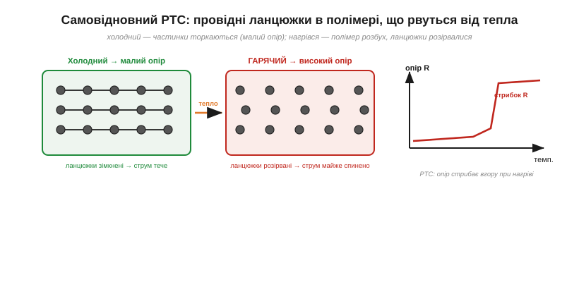
*Рис. 1.3.8.5. Усередині PTC — провідні частинки в полімері. Холодний: ланцюжки зімкнені, опір малий, струм тече. Нагрівся надструмом: полімер розбух, ланцюжки розірвались, опір стрибнув у тисячі разів (праворуч — крива R(T)).*

Усередині — полімер, напханий провідними частинками (сажею). Поки він **холодний**, частинки щільно торкаються, утворюючи провідні ланцюжки, і опір малий — струм тече вільно. Та щойно надструм нагріє полімер до певної температури, той **розбухає**, частинки розсуваються, ланцюжки рвуться — і опір **стрибком** зростає в тисячі разів. Струм майже спиняється, спадаючи до крихітної «цівки». Прилад «спрацював».

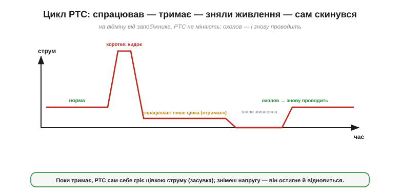
*Рис. 1.3.8.6. Цикл PTC у часі: норма → кидок короткого → спрацював і пропускає лише цівку («тримає», гріючи сам себе) → зняли живлення → охолов і сам відновився. Жодної заміни.*

Найхитріше — що далі. Та сама цівка струму, протікаючи крізь тепер високий опір, **гріє PTC й тримає його гарячим** — він **засувається** (latched) у високоомному стані, поки на нього подано напругу. А зніміть живлення — і PTC **охолоне**, полімер стиснеться, ланцюжки зімкнуться, опір упаде, і він **сам відновиться**, готовий працювати знову. Жодної заміни.

У PTC свої числа: **струм утримання** (*hold current*) — який він несе нескінченно, не спрацьовуючи, — і **струм спрацювання** (*trip current*), за якого перемикається у високоомний стан. Він повільніший і менш точний за плавкий запобіжник і не розриває коло **вщент** (лишає цівку), зате **багаторазовий**.

Та й у PTC є своя плата за зручність. Він **повільніший** за плавкий запобіжник — спрацьовує не за мікросекунди, а за частки секунди, тож від блискавичного короткого встигне пропустити чималий кидок. Він **менш точний**: межа спрацювання «розмазана» й помітно залежить від температури навколо (у теплі спрацьовує раніше, на морозі — пізніше). Розрахований він на **скромніші** струми й напруги, ніж потужні плавкі запобіжники. І трохи **старіє**: після багатьох спрацювань його опір у холодному стані поволі підростає. Тож PTC — не універсальна заміна запобіжникові, а зручний інструмент саме там, де збої часті, дрібні й очікувані.

> 🔧 **Навіщо це.** Саме тому PTC стоїть там, де збої — звичне діло, а лізти із заміною незручно: на кожному **USB-порту** (хтось замкнув роз'єм чи встромив несправний пристрій — порт «вимкнувся», а висмикнув — і він ожив), у захисті **акумуляторів** від короткого, у моторах і дитячих іграшках. Коли USB-пристрій «віднявся», а після перевтикання запрацював — це майже напевно спрацював і скинувся PTC.

### Що обрати: запобіжник, PTC чи автомат


*Рис. 1.3.8.7. Коротко: плавкий запобіжник — одноразовий, точний, для великих аварій; PTC — багаторазовий, обмежувальний, для частих тимчасових збоїв. Третій варіант — автомат для щитків.*

Звести все докупи нескладно. **Плавкий запобіжник** повністю розмикає коло, точний, тримає величезні струми короткого — але одноразовий; його місце там, де аварія рідкісна й критична: мережа, авто, потужні кола. **PTC** обмежує струм і **сам скидається**, та повільніший, менш точний і на менші струми — його місце там, де збої часті й тимчасові. А є й третій вартовий — **автомат захисту** (*circuit breaker*): багаторазовий механічний вимикач, що сам розмикається від надструму (тепловим і магнітним розчіплювачем); ним захищають домашні щитки, бо його, на відміну від запобіжника, не міняють, а просто знову вмикають важелем.

Усередині автомата — два розчіплювачі заразом. **Тепловий** (біметалева пластина, що вигинається від I²R-нагріву) повільно реагує на **перевантаження**: чим більший надлишок, тим швидше пластина вигнеться й відпустить засувку. А **магнітний** (котушка-соленоїд) спрацьовує **миттєво** на велике **коротке**: різкий стрибок струму притягує якір і вибиває засувку за мілісекунди. Так один прилад накриває обидва роди надструму — як і запобіжник своєю кривою, тільки багаторазово.

> 🔧 **Навіщо це.** Перше діагностичне питання, коли живлення зникло: **що саме спрацювало?** Запобіжник — огляньте скельце (видно перепалений дротик), замініть на такий самий. PTC — зніміть живлення на хвилину, дайте охолонути, і пристрій оживе сам. Автомат — просто підніміть важіль. А якщо захист спрацьовує **знову й одразу** — справжній збій нікуди не зник, і шукати треба його, а не «глушити» захист перемичкою (це найгірше, що можна вдіяти).

**Приклад (добір запобіжника).** Пристрій у нормі бере 1 А. Який запобіжник ставити?

```
робочий струм:            1 А
запас на кидки/нагрів:     × ~1.5–2
→ номінал запобіжника:    ~2 А
```

Чому не «рівно 1 А»? Бо тоді запобіжник балансував би на межі й рвався б від найменшого законного коливання чи нагріву (його номінал ще й трохи падає в теплі). Беруть із запасом — щоб у нормі він жив спокійно, а спрацьовував лише на справжній аварії. Точну межу й тип (F/T) звіряють із даташитом навантаження.

### Спільний корінь — і місток далі

Зверніть увагу на красиву єдність: **і запобіжник, і PTC працюють на джоулевому теплі** з §1.3.6. Запобіжник тепло **плавить**, PTC — тепло **розбухає й розриває ланцюжки**; обидва — це I²R, поставлене на службу безпеці. Тобто тепло в колі буває не лише ворогом, а й вартовим.

Ще одна спільна риса: обидва — **послідовні** вартові, що стоять прямо на шляху струму й самі його несуть. Тому в них завжди є власний (нехай і малий) опір і власне падіння напруги, з яким у точних чи сильнострумових колах доводиться рахуватися. Захист ніколи не буває геть «безкоштовним» — і це теж частина інженерного компромісу.

А це підводить до зворотного боку тієї самої медалі. Якщо навіть **справні** деталі гріються (а вони гріються — §1.3.6), то це тепло треба кудись **відводити**, інакше навіть без жодної аварії компонент звариться у власному соку. Як рахувати цей тепловий шлях і відганяти ват назовні — наступна, остання тема розділу, §1.3.9.

---

## 1.3.9 Тепловий опір і радіатор (°C/Вт): куди подіти ват

У §1.3.8 ми згадали: навіть справна деталь гріється, і це тепло треба кудись відвести. §1.3.6 сказав, **скільки** тепла народжується (P = I²R, чи будь-яка спожита потужність). Тепер питання інше: **наскільки гарячою** стане сама деталь — і як не дати їй звариться? Виявляється, тепло «тече» крізь матеріали майже за тими самими правилами, що й струм крізь опори, тож уся інтуїція цього розділу переноситься на тепло один в один. Ключове поняття — **тепловий опір**, виміряний у градусах на ват.

### Тепло мусить кудись піти

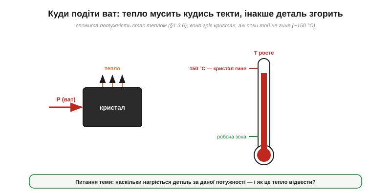
*Рис. 1.3.9.1. Спожита потужність стає теплом просто в деталі (§1.3.6); її температура росте, аж поки приплив тепла не зрівняється з відпливом. Якщо тепло не встигає стікати, кристал переходить межу (~150 °C) і гине. Тема — про те, як цей відплив порахувати й забезпечити.*

Спожита потужність не зникає — за §1.3.6 вона стає теплом просто в тілі деталі (у кристалі транзистора, у плівці резистора). Це тепло гріє деталь, і її температура **росте**, поки приплив тепла не зрівняється з відпливом у довкілля (усталений режим, §1.3.6). Біда в тому, що в кремнію є межа: кристал зазвичай гине десь біля **150 °C**, а надійно працює зі значним запасом — нижче. Якщо тепло не встигає стікати, температура переходить межу — і деталь помирає, тихо деградуючи або одразу. Тож інженер мусить уміти **передбачити** температуру деталі за відомої потужності — і, якщо вона зависока, **прокласти тепловий шлях** назовні.

І шкодить не лише раптовий перегрів. Навіть нижче за межу зайве тепло **скорочує життя** деталі: грубе правило надійності каже, що кожні зайві ~10 °C приблизно **вдвічі** прискорюють старіння електроніки (хімія псування пришвидшується з температурою). Тож охолодження — це не лише «не згоріти зараз», а й «прослужити роки»; холодний пристрій — надійний пристрій, і це окремий, дуже практичний привід не шкодувати на радіатор.

### Тепловий опір: ΔT = P·Rθ

Тут і вступає краса аналогії. Подумаймо, що штовхає тепло: різниця **температур**. Гаряче віддає холодному; що більша різниця, то швидший потік. Це точнісінько як напруга, що жене струм.

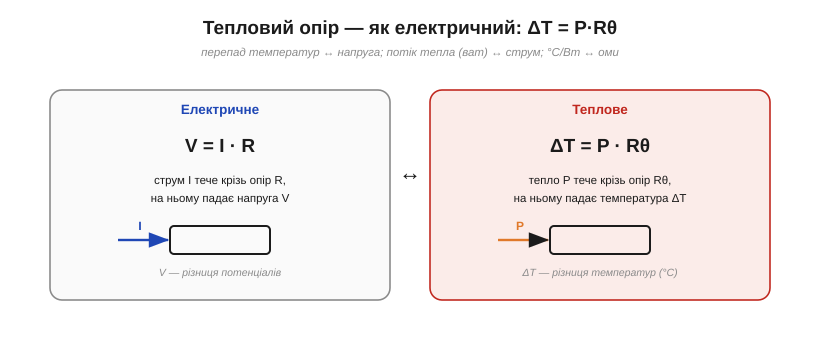
*Рис. 1.3.9.2. Тепловий опір — точний близнюк електричного. Як напруга жене струм крізь опір (V = I·R), так різниця температур жене потік тепла крізь тепловий опір: ΔT = P·Rθ. Відповідності: ΔT ↔ V, P ↔ I, Rθ ↔ R.*

Складімо відповідності: **різниця температур ΔT** грає роль напруги; **потік тепла P** (у ватах — а ват і є джоуль за секунду, §1.3.6) грає роль струму; а їхнє відношення — **тепловий опір Rθ** (*thermal resistance*) — грає роль електричного опору. І закон той самий, що Ом (§1.3.2), лише в теплових одиницях:

```
ΔT = P · Rθ        Rθ — у °C/Вт (градусів на ват)
```

Читається просто: помнож потужність (ват) на тепловий опір (°C/Вт) — і дістанеш, на скільки градусів нагріється деталь над довкіллям. «Rθ = 20 °C/Вт» означає: кожен ват підніме температуру на 20 градусів. Уся інтуїція опору з цього розділу — послідовне додавання, «вузьке місце гріється», важливість запасу — переноситься на тепло без змін.

> 🔧 **Навіщо це.** Тепловий опір — це не теорія, а **число з даташита**, з якого починається кожен розрахунок охолодження. Бачите в описі мікросхеми «Rθ(JA) = 60 °C/Вт» — це прямо каже: у цьому корпусі без радіатора кожен ват розсіюваної потужності нагріє кристал на 60 градусів над платою. Звідси одразу видно, скільки ват деталь стерпить без радіатора, а коли він стає обов'язковим.

Від чого ж залежить сам Rθ? Точнісінько так, як електричний опір (R = ρL/A, §1.3.3): тепловий опір шару тим **менший**, чим він **тонший**, чим **ширша** його площа й чим краще матеріал **проводить тепло**. Тонка широка пластина доброго провідника (мідь, алюміній) — малий тепловий опір; товстий вузький шматок поганого (пластик, а надто повітря) — великий. Тому тепловий шлях прокладають **коротким, широким і з добрих провідників**, а повітря в ньому — головний ворог, бо його тепловий опір величезний. Це той самий R = ρL/A, лише поставлений на службу теплу.

### Тепловий шлях — це опори послідовно

Тепло від кристала до повітря долає не один бар'єр, а кілька **поспіль**, і кожен має свій тепловий опір.


*Рис. 1.3.9.3. Тепло долає кілька бар'єрів поспіль: кристал → корпус → паста → радіатор → повітря. Їхні теплові опори додаються (як резистори послідовно), а температура кристала = температура повітря + P × сумарний Rθ.*

Спершу тепло пробивається з кристала крізь корпус деталі — це **Rθ(j→корпус)** (*junction-to-case*, дається в даташиті). Тоді — крізь стик корпусу з радіатором, **Rθ(корпус→радіатор)**. Нарешті — з радіатора в повітря, **Rθ(радіатор→повітря)**. Ці опори **додаються послідовно**, точно як електричні (формально це покаже Розділ 1.4):

```
Rθ(j→повітря) = Rθ(j→к) + Rθ(к→р) + Rθ(р→п)
T_кристала = T_повітря + P · Rθ(j→повітря)
```

Звідси й видно стратегію охолодження: щоб кристал був холодніший, зменшують **сумарний** Rθ — а отже, будь-яку з ланок. Найбільша зазвичай — остання (радіатор→повітря), тож саме її й атакують радіатором.

Корисний наслідок: на кожному тепловому опорі «падає» своя частка перепаду температури — пропорційно до його Rθ, точнісінько як напруга ділиться між послідовними резисторами (тепловий **подільник**). Тож якщо більшість перепаду «падає» на стику корпус–радіатор, винна погана паста; якщо на самому радіаторі — він замалий. Дивлячись, **де** просіла температура, одразу видно, яку ланку лагодити.

### Приклад: радіатор рятує деталь

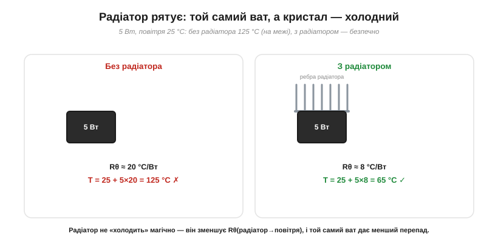
*Рис. 1.3.9.4. Той самий ват, та сама деталь. Без радіатора (Rθ ≈ 20 °C/Вт) кристал нагрівся б до 125 °C — на межі. Радіатор знижує опір «до повітря», сумарний Rθ падає до ~8 °C/Вт, і температура — безпечні 65 °C.*

**Приклад (з радіатором і без).** Деталь розсіює P = 5 Вт, повітря довкола 25 °C. Без радіатора її повний тепловий опір до повітря Rθ ≈ 20 °C/Вт:

```
T = T_повітря + P·Rθ = 25 + 5×20 = 125 °C
```

Сто двадцять п'ять градусів — небезпечно близько до межі 150 °C; запасу майже немає, а в теплий день деталь перейде межу. Тепер пригвинтимо радіатор, що знижує опір «до повітря» так, що сумарний Rθ ≈ 8 °C/Вт:

```
T = 25 + 5×8 = 65 °C
```

Шістдесят п'ять градусів — тепло, але безпечно. Той самий ват, та сама деталь — лише тепловий шлях став ширшим. Ось чому без радіатора лінійний стабілізатор чи силовий транзистор, що розсіює кілька ват, просто згоряє, а з радіатором працює роками.

### Що таке радіатор і чому в нього ребра

Радіатор (*heat sink*) — це шматок металу (зазвичай алюмінію), пригвинчений до деталі, із великою **площею поверхні**. Його завдання — віддати тепло повітрю, а повітря забирає тепло **конвекцією**: нагріта поверхня гріє прилеглий шар повітря, той розширюється, легшає й тікає вгору, поступаючись місцем холодному. Що **більша площа** контакту з повітрям, то швидше це відведення — тому радіатор роблять **ребристим**: ребра дають велику площу в малому об'ємі. Більший радіатор → менший Rθ(радіатор→повітря). А **вентилятор** жене повітря силоміць (примусова конвекція), зриваючи нагрітий шар, — і Rθ падає ще в рази.

Дрібниці теж важать. Радіатор без обдуву (природна конвекція) працює в рази гірше, ніж із вентилятором, — тому в тісних чи потужних пристроях обдув майже обов'язковий. Орієнтація ребер уздовж потоку нагрітого повітря (вертикально за природної конвекції) допомагає тому тікати вгору. А чорне матове **анодування** трохи додає віддачі **випромінюванням** — звідси й чорний колір багатьох радіаторів.

А там, де окремого радіатора нема, його роль бере на себе сама **плата**. Виливок міді (полігон), до якого припаяна деталь, розтікає тепло по платі й віддає його повітрю — по суті, плаский радіатор. Тому під гарячими деталями лишають широкі мідні площини, а крізь плату ведуть **теплові перехідні отвори** (*thermal vias*), що зливають тепло на протилежний бік. Часом грамотна мідь на платі рятує не гірше за невеликий радіатор.

> 🔧 **Навіщо це.** Звідси й знайомий вигляд техніки. Процесор розсіює десятки ват — тому несе на собі великий ребристий радіатор **плюс** вентилятор (інакше за секунди дійде до межі й сам себе пригальмує). Силовий стабілізатор у корпусі TO-220 без радіатора тримає десь до ват — більше треба прикручувати до металу. А якщо ваша деталь «занадто гаряча, щоб тримати палець» (це вже за 60 °C) — це сигнал перевірити тепловий розрахунок: можливо, бракує радіатора, площі міді на платі чи обдуву.

### Термопаста: вигнати повітря зі стику

Є підступна ланка, яку легко зіпсувати, — **стик** корпусу деталі з радіатором. На вигляд обидві поверхні гладенькі, та під мікроскопом вони шорсткі, і між ними лишаються **мікроскопічні кишені повітря**. А повітря — **поганий** провідник тепла; ці кишені різко підвищують Rθ(корпус→радіатор), і тепло застрягає, хоч радіатор начебто є.

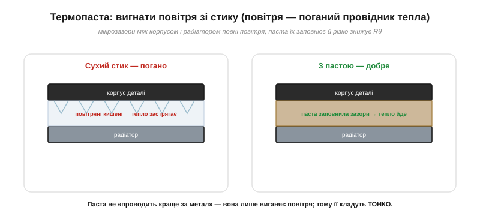
*Рис. 1.3.9.5. Стик корпусу з радіатором лише на вигляд гладенький: між шорсткими поверхнями застрягає повітря — поганий провідник тепла. Термопаста заповнює ці зазори (не «проводить краще за метал», а лише виганяє повітря), тому її кладуть тонко.*

Рятує **термоінтерфейс** (*thermal interface material*, TIM) — термопаста чи термопрокладка. Вона **не** проводить тепло краще за метал; її єдине завдання — **заповнити повітряні зазори** речовиною, що проводить ліпше за повітря. Тому пасту кладуть **тонко**: товстий шар сам стає бар'єром. Правильно — ледь помітна плівка, що тільки виганяє повітря, а деталь притиснута гвинтами щільно до радіатора.

> 🔌 **З чого складається тепловий шлях.** Повне меню термоінтерфейсів (паста, прокладка, фазозмінний, клей), типи радіаторів і що читати в їхньому Rθ, а ще підступ кріплення TO-220 — коли пластина деталі під напругою й потрібна ізоляція — зібрано у вставці [Радіатори, термопаста й термопрокладки](ch03-s9-c-heatsinks.md).

### Три шляхи тепла

Щоб картина була повна, назвімо три способи, якими тепло взагалі рухається.


*Рис. 1.3.9.6. Три способи руху тепла. До радіатора воно йде теплопровідністю крізь метал; від ребер — конвекцією в рухоме повітря (її підсилює вентилятор); трохи — випромінюванням (за низьких температур мало). Радіатор б'є саме по конвекції.*

**Теплопровідність** (*conduction*) — крізь тверде тіло, від частинки до частинки; саме нею тепло йде з кристала крізь корпус у радіатор (метали проводять чудово, пластмаси — погано). **Конвекція** (*convection*) — забір тепла рухомою рідиною чи газом; нею ребра віддають тепло повітрю, і її підсилює вентилятор. **Випромінювання** (*radiation*) — інфрачервоне світло, що його випромінює будь-яке нагріте тіло; за невисоких температур електроніки воно дає небагато, тож головні гравці — провідність (до радіатора) і конвекція (від радіатора). Знаючи, який шлях головний, ви знаєте, де тиснути: до радіатора — добрий контакт і паста; від радіатора — площа й обдув.

До речі, чому метали так добре проводять **і** струм, **і** тепло — не випадковість: переносить і те, й те одне й те саме **море вільних електронів** (§1.2.3). Розігнані теплом, вони розносять його по металу швидко, тож добрий електричний провідник майже завжди й добрий тепловий. Ось чому радіатори роблять із металу, а не з пластику, і чому товста мідь на платі — це ще й тепловідвід.

### Усталений режим, інерція й запас

Останнє, що варто тримати в голові. Усе сказане — про **усталений режим** (§1.3.6): температуру, до якої деталь зрештою прийде за сталої потужності. Та нагрівається вона **не миттєво**: у деталі й радіатора є теплова **інерція** (теплоємність), тож короткий потужний імпульс може й не встигнути перегріти кристал — так само, як заряд не встигає за надто коротким струмом. А на практиці завжди беруть **запас**: цілять не у 150 °C, а помітно нижче, бо й довкілля буває гарячим, і паста з часом підсихає, і потужність стрибає. Холодніша деталь — деталь, що живе довше.

> 🧮 **Скільки часу гріється.** Що таке теплова стала часу τ = Rθ·Cθ, чому температура росте по експоненті (як заряд конденсатора), і чому короткий імпульс у рази понад норму деталь переживає, а тривала менша потужність — ні, — з формулами у вставці [Теплова RC-модель](ch03-s9-m-thermal-rc.md).

Звідси прояснюється й тонкість допустимої потужності з §1.3.7. Коли на резисторі написано «0.25 Вт», це не священна стала, а **обіцянка за певних умов охолодження** — зазвичай у вільному повітрі за кімнатної температури. Запхайте той самий резистор у тісний гарячий корпус, обкладений сусідами, — і його реальний тепловий опір до повітря зросте, тож безпечна потужність **упаде**. Тому в гарячих чи щільних місцях рейтинг по потужності беруть із подвійним запасом: «скільки витримає деталь» і «як її охолоджують» — нероздільні.

Тут ховається й практична пастка вимірювання. Гаряча насправді — **серцевина кристала** (*junction*), а от термопарою чи пальцем ви дістаєтеся хіба до **корпусу** (*case*). Між ними лежить Rθ(j→корпус), тож кристал завжди **гарячіший** за те, що ви намацали, — інколи на десятки градусів за великої потужності. Тому в розрахунку відштовхуються від **температури кристала** (її межа — у даташиті), а виміряну температуру корпусу лише використовують, додавши P·Rθ(j→к), щоб оцінити справжню.

І ще про небезпеку зворотного зв'язку. У декого втрати **ростуть** із нагрівом (опір лампи розжарення чи витоки напівпровідника); тоді гаряча деталь гріється ще дужче й може піти в **тепловий розгін** (§1.3.4), аж до загибелі. Добре охолодження тут не розкіш, а умова стійкості: воно розриває цю петлю, не даючи температурі розкрутитися.

**Приклад (який радіатор треба).** Хай деталь розсіює 3 Вт, безпечна межа кристала — 125 °C, повітря — до 40 °C, а Rθ від кристала до корпусу й через пасту разом ≈ 3 °C/Вт. Який радіатор шукати?

```
дозволений перепад:       ΔT = 125 − 40 = 85 °C
дозволений сумарний Rθ:    Rθ = ΔT/P = 85/3 ≈ 28 °C/Вт
з них на кристал + пасту:  3 °C/Вт
→ на радіатор лишається:   28 − 3 ≈ 25 °C/Вт
```

Тобто згодиться навіть скромний радіатор на 25 °C/Вт чи менше (менше — холодніше, із запасом). Саме так, від кінця (потрібної температури) до початку (вибору радіатора), і рахують охолодження на практиці.

### Рамка всього розділу

Підсумуймо суть: тепло тече, як струм, за законом ΔT = P·Rθ; теплові опори **додаються поспіль** (кристал → корпус → паста → радіатор → повітря); щоб деталь не згоріла, зменшують сумарний Rθ — добрим контактом, пастою, великим ребристим радіатором та обдувом. І помітьмо красиву рамку всього розділу: він **почався з електричного опору, а скінчився опором тепловим** — одна й та сама ідея «спротиву потоку», застосована двічі, до струму й до тепла. Тепер ми вміємо не лише рахувати струм, напругу й потужність в одній деталі, а й **тримати її живою** — не давати теплу її вбити.

---

## 1.3.10 Три шляхи тепла: кондукція, конвекція, випромінювання

У §1.3.9 ми навчилися рахувати охолодження через **тепловий опір**: ΔT = P·Rθ, і ці Rθ зручно додавалися поспіль уздовж шляху «кристал → корпус → паста → радіатор → повітря». Та сам Rθ був для нас **чорною скринькою** — числом із даташита чи каталогу. Звідки воно береться? Чому в металу тепловий опір крихітний, а в повітря величезний? Чому радіатор узагалі **працює** — і чому без обдуву працює вдвічі гірше? Щоб відповісти, треба відкрити скриньку й спитати фізику: а **як саме** тепло переходить із гарячого в холодне?

Виявляється, способів усього **три** — і це не довгий список, з якого щось забули, а повний перелік. Тепло — це безладний рух частинок (згадаймо історію Джоуля, §1.3.5): гаряче тіло — те, чиї атоми трусяться дужче. Передати тепло означає **передати цей рух** холоднішому сусідові, а зробити це можна лише трьома шляхами: штовхнути сусіда, не зрушивши з місця (**кондукція**), віднести рух геть разом із речовиною (**конвекція**) або випустити його **світлом** (**випромінювання**). Жодного четвертого немає. Розберімо кожен — з його механізмом, його законом і його роллю в охолодженні електроніки.


*Рис. 1.3.10.1. Три — і тільки три — способи перенести тепло, кожен зі своїм носієм і своїм законом. **Кондукція**: атоми твердого тіла «штовхають» сусідів, не зрушуючи самі (закон Фур'є). **Конвекція**: нагріта рідина чи газ легшає й виносить тепло геть (закон Ньютона). **Випромінювання**: будь-яке тіло світить в інфрачервоному (Стефан—Больцман). У реальному охолодженні працюють усі три, та на різних ділянках шляху.*

### Кондукція: естафета без переселення

**Кондукція** (*conduction*, теплопровідність) — це передача тепла **крізь нерухому речовину**, від частинки до частинки. Уявіть ряд людей, що передають відро з рук у руки: відро (енергія) рухається вздовж ряду, а самі люди (атоми) лишаються на місцях. У твердому тілі атоми сидять у вузлах решітки й **коливаються**; гарячий край трусить дужче, ці коливання штовхають сусідів, ті — наступних, і хвиля «тряски» біжить у холодний бік. У металах до цієї естафети додається другий, **набагато прудкіший** носій — те саме **море вільних електронів**, яке переносить струм (§1.2.3). Розігнані теплом електрони шастають крізь метал і розносять енергію куди швидше, ніж повільні коливання решітки.

Ось чому метал на дотик здається **холоднішим** за дерево тієї самої температури: він стрімко відсмоктує тепло з вашого пальця, тимчасом як дерево майже не проводить. І ось чому добрий провідник струму — майже завжди й добрий провідник тепла: за обидва переноси відповідає **той самий** електронний газ (цей зв'язок між тепло- та електропровідністю металів відомий як закон Відемана—Франца — нам досить його якісної суті).

Кількісно кондукцію описує **закон Фур'є** (*Fourier's law*): тепловий потік крізь брусок прямо пропорційний площі та різниці температур і обернено пропорційний довжині шляху:

```
Q/t = k · A · ΔT / L

Q/t — тепловий потік (Вт)
k   — теплопровідність матеріалу (Вт/(м·°C))
A   — площа перерізу (м²)
ΔT  — різниця температур уздовж бруска (°C)
L   — довжина шляху тепла (м)
```


*Рис. 1.3.10.2. Тепловий потік крізь брусок тим більший, чим коротший і товщий шлях і чим «гладший» для тепла матеріал (велике k). Геометрія **дослівно та сама**, що в електричного опору: Rθ = L/(k·A) — це близнюк R = ρ·L/A, де теплопровідність k грає роль провідності (1/ρ). Таблиця знизу: мідь і алюміній проводять тепло в тисячі разів краще за повітря — тому радіатори металеві, а повітряні зазори згубні.*

Придивіться до формули — і ви впізнаєте давнього знайомого. Перепишемо її через тепловий опір з §1.3.9 (Rθ = ΔT/(Q/t)):

```
Rθ = L / (k · A)        ← тепловий опір бруска
порівняйте:  R = ρ · L / A   ← електричний опір дроту (§1.3.3)
```

Це **та сама геометрія**: довший шлях — більший опір (прямо), товщий — менший (обернено), а роль матеріалу грає теплопровідність k (її висока величина — як висока провідність, мала ρ). Тепловий опір — не метафора, а буквальний двійник електричного. Звідси одразу видно дві речі. По-перше, чому **повітря** (k ≈ 0.025) — чудовий теплоізолятор: його k у п'ятнадцять тисяч разів менше за мідь, тож найтонший прошарок повітря додає гігантський Rθ. По-друге, чому **термопаста** (§1.3.9) рятує: вона не «проводить краще за метал» (її k всього 1–10), а лише виганяє зі стику те саме згубне повітря, замінюючи k ≈ 0.025 на k ≈ кілька — стрибок у сотні разів.

> 🧮 Закон Фур'є — це **диференціальна** форма; повна картина (градієнт температури, рівняння теплопровідності) спирається на похідну — ту саму швидкість зміни, що ми вже зустрічали. Тут нам досить алгебраїчної форми Q/t = k·A·ΔT/L для сталого шляху.

**Приклад (тепло крізь корпус деталі).** Кристал віддає тепло крізь основу корпусу: алюмінієва площинка k = 200 Вт/(м·°C), площа A = 1 см² = 1×10⁻⁴ м², товщина L = 2 мм = 0.002 м. Який її тепловий опір?

```
Rθ = L / (k · A) = 0.002 / (200 × 1×10⁻⁴)
Rθ = 0.002 / 0.02 = 0.1 °C/Вт
```

Десята частка градуса на ват — мізер: товстий метал тепло майже не гальмує. А тепер замінімо подумки цей метал на повітряний зазор тієї самої товщини (k = 0.025): Rθ підскочить до 0.002/(0.025×10⁻⁴) = 800 °C/Вт — у вісім тисяч разів гірше. Ось чому будь-яка повітряна щілина на шляху тепла — катастрофа, і чому її виганяють пастою.

> 🔧 **Навіщо це.** Кондукція — це **вся внутрішня частина** теплового шляху: від кристала крізь корпус, крізь пасту, у тіло радіатора (§1.3.9). Працюючи з нею, ви боретеся за дві речі: побільше **площі** контакту (широкі мідні полігони на платі, велика підошва радіатора) і поменше **повітря** в стиках (притиск, тонкий шар пасти). Мідна заливка під гарячою деталлю — це теплопровідний «дріт», що розтікає тепло по платі; теплові перехідні отвори (*thermal vias*) — теплопровідні «перемички» на інший бік. Усе це — закон Фур'є в дії: збільшуй k·A, зменшуй L.

### Конвекція: тепло їде разом із повітрям

Кондукція доводить тепло **до** поверхні радіатора. Та далі постає питання: а як зняти його з ребер? Тут на сцену виходить другий механізм — **конвекція** (*convection*). Її ідея протилежна до кондукції: якщо там енергія бігла, а речовина стояла, то тут **речовина сама несе тепло геть**. Нагріта поверхня гріє прилеглий шар повітря; тепле повітря розширюється, **легшає** й спливає вгору (як повітряна кулька), а його місце займає холодне знизу. Виникає неперервний коловорот, що відносить тепло від деталі, — це **природна конвекція**.

Кількісно її описує **закон охолодження Ньютона** (*Newton's law of cooling*): потік тепла з поверхні пропорційний площі та перепаду температур між поверхнею й повітрям:

```
Q/t = h · A · ΔT

h  — коефіцієнт тепловіддачі (Вт/(м²·°C))
A  — площа поверхні, що віддає тепло (м²)
ΔT — наскільки поверхня гарячіша за повітря (°C)
```

Уся хитрість сидить у коефіцієнті **h** — він каже, наскільки бадьоро плин забирає тепло з поверхні, і **сильно** залежить від того, чи рухається повітря саме собою, чи його женуть.

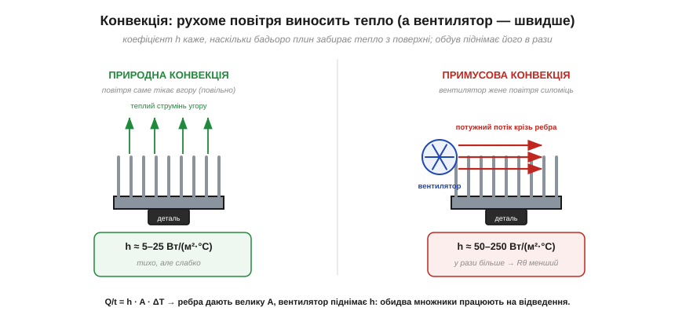
*Рис. 1.3.10.3. Природна конвекція (повітря тікає вгору саме) дає скромний h ≈ 5–25 Вт/(м²·°C). Вентилятор зриває нагрітий шар і жене свіже повітря — **примусова** конвекція піднімає h у рази (≈50–250). Оскільки Q/t = h·A·ΔT, ребра працюють на множник A, а вентилятор — на множник h; разом вони різко знижують Rθ «радіатор → повітря».*

Звідси прояснюється все, що в §1.3.9 ми взяли на віру про радіатор. **Ребра** дають велику площу A в малому об'ємі — а в законі Ньютона A стоїть прямим множником. **Вентилятор** піднімає h, бо постійно зриває нагрітий примежовий шар повітря й підставляє свіже холодне (примусова конвекція замість млявої природної), — і тому обдув знижує тепловий опір у рази, а не на відсотки. **Орієнтація ребер** уздовж висхідного потоку допомагає теплому повітрю тікати. Навіть те, чому гарячому повітрю треба давати дорогу вгору й не запирати його в глухому корпусі, — це все та сама конвекція, якій потрібен **рух** середовища.

Важлива межа: у **порожнечі** конвекції немає взагалі — нема чому текти. Тому супутник чи будь-що у вакуумі не можна охолодити обдувом; там лишається тільки випромінювання (нижче) та кондукція в конструкцію. На Землі ж саме конвекція — головний шлях, яким радіатор віддає тепло повітрю.

**Приклад (скільки знімають ребра).** Радіатор має сумарну площу ребер A = 0.02 м², його поверхня на ΔT = 50 °C гарячіша за повітря. Скільки тепла він віддає природною конвекцією (h ≈ 10) і скільки — з вентилятором (h ≈ 80)?

```
природна:   Q/t = h·A·ΔT = 10 × 0.02 × 50 = 10 Вт
примусова:  Q/t = 80 × 0.02 × 50 = 80 Вт
```

Той самий радіатор, той самий перепад — а з обдувом він відводить увосьмеро більше. Ось чому потужні пристрої майже завжди мають вентилятор: без нього довелося б ставити радіатор у рази більший.

> 🔧 **Навіщо це.** Конвекція — це **остання, найвужча ланка** теплового шляху (зазвичай саме Rθ «радіатор → повітря» — найбільший доданок суми з §1.3.9). Тому й тиснуть на неї найдужче: більша площа ребер, обдув, вільний прохід повітря вгору. Практичний наслідок: радіатор, замурований у тісний глухий корпус без вентиляції, працює в рази гірше за паспорт — бо паспортний Rθ міряли у вільному повітрі. Якщо деталь гріється понад очікуване, перше підозрюване — задушена конвекція: немає обдуву або повітрю нікуди тікати.

### Випромінювання: тепло, що світиться

Третій шлях найдивніший: **будь-яке** нагріте тіло **світить** — випускає енергію у вигляді електромагнітних хвиль, і для цього йому не потрібні ні дотик, ні повітря. Це **теплове випромінювання** (*thermal radiation*). За кімнатних температур воно невидиме (лежить в **інфрачервоній**, ІЧ області), та його чудово «бачить» тепловізор; розжарте тіло сильніше — і випромінювання зсунеться у видиме: тен почервоніє, нитка лампи засяє білим. Саме випромінюванням нас гріє Сонце крізь мільйони кілометрів порожнечі, де ні кондукції, ні конвекції бути не може.

Кількісно його описує **закон Стефана—Больцмана** (*Stefan—Boltzmann law*):

```
Q/t = ε · σ · A · T⁴

ε — випромінювальна здатність поверхні (0…1; чорна матова ≈ 0.9, блискучий метал ≈ 0.05)
σ — стала Стефана—Больцмана (5.67×10⁻⁸ Вт/(м²·К⁴))
A — площа поверхні (м²)
T — АБСОЛЮТНА температура в кельвінах (К = °C + 273)
```

Тут є дві разючі особливості. Перша: температура входить **у четвертому степені** — і саме абсолютна, у кельвінах. Подвоїти абсолютну температуру означає випромінювати у **2⁴ = 16** разів більше. Тому випромінювання росте лавиною: при кімнатних 25 °C (≈300 К) воно кволеньке, а в нитки лампи при 2500 °C (≈2800 К) — велетенське, бо 2800⁴ незрівнянно більше за 300⁴.

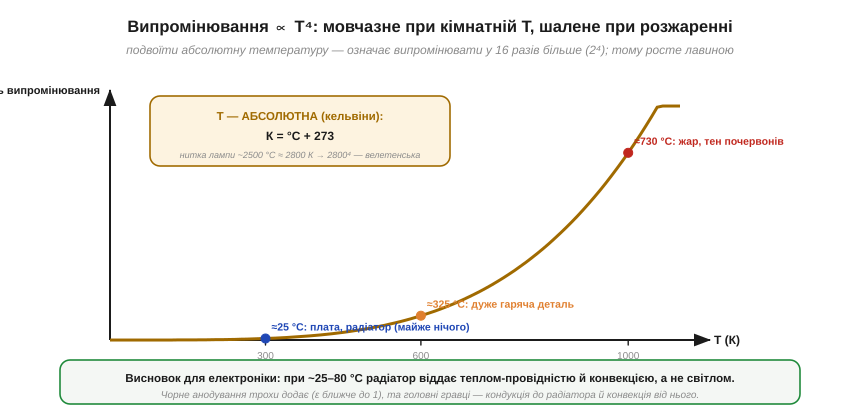
*Рис. 1.3.10.4. Потужність випромінювання ∝ T⁴ (T — абсолютна, у кельвінах). Крива надзвичайно крута: при ≈300 К (плата, радіатор) тіло світить майже непомітно, тож для електроніки випромінювання — мізерний внесок. Зате при ≈1000 К (жар, розпечений тен) і тим паче в нитки лампи (≈2800 К) воно стає **головним** шляхом віддачі тепла. Тому розпечене світиться, а теплий радіатор — ні.*

Друга особливість — множник **ε** (випромінювальна здатність, *emissivity*): він каже, наскільки поверхня близька до ідеального випромінювача. Чорна матова поверхня має ε ≈ 0.9, блискучий полірований метал — лише ≈ 0.05. Ось чому радіатори часто **чорнять** (анодують): чорне матове покриття піднімає ε ближче до одиниці й трохи додає віддачі випромінюванням. Слово «трохи» тут ключове: за низьких температур електроніки внесок ІЧ усе одно малий проти конвекції, тож чорний колір — лише невелика добавка, а не головний герой.

**Приклад (чому при 25 °C світло не рятує).** Порівняймо, скільки радіатор з ε = 0.9 і площею A = 0.02 м² віддає **конвекцією** і **випромінюванням** при ΔT = 50 °C над повітрям 25 °C (тобто поверхня ≈ 75 °C ≈ 348 К, повітря ≈ 298 К):

```
конвекція (h ≈ 10):  Q/t = h·A·ΔT = 10 × 0.02 × 50 = 10 Вт
випромінювання:      Q/t = ε·σ·A·(T_пов⁴ − T_довк⁴)
                         = 0.9 × 5.67×10⁻⁸ × 0.02 × (348⁴ − 298⁴)
                         ≈ 0.9 × 5.67×10⁻⁸ × 0.02 × (1.466×10¹⁰ − 0.789×10¹⁰)
                         ≈ 7 Вт
```

Випромінювання тут не дрібниця (≈7 Вт проти 10 Вт конвекції) — за **природної** конвекції воно дає відчутну добавку, і саме тому чорнять навіть пасивні радіатори. Та щойно вмикається вентилятор і конвекційний h злітає до 80 (Q/t ≈ 80 Вт), випромінювання (ті самі ≈7 Вт) стає вже малою часткою. А головне — обидва внески мізерні поряд із тим, що та сама формула дає для розпеченої нитки: при 2800 К доданок T⁴ більший у десятки тисяч разів, тож лампа віддає майже все тепло саме світлом.

> 🔧 **Навіщо це.** Для повсякденного охолодження електроніки (деталі при 25–80 °C) головні гравці — **кондукція** (до радіатора) і **конвекція** (від нього); випромінювання дає скромну добавку, заради якої радіатори й чорнять. Зате випромінювання стає головним там, де **гаряче**: розжарена нитка лампи (§1.3.4) віддає світлом майже всю потужність, інфрачервоні нагрівачі та обігрівачі гріють вас прямим ІЧ-променем, а тепловізор «бачить» нагріту деталь саме по її власному випромінюванню — зручний спосіб знайти гарячу точку на платі, не торкаючись її.

### Усе разом: чому працює радіатор

Тепер зберімо три шляхи в одну картину — і ланцюг охолодження з §1.3.9 заговорить фізикою. Тепло від кристала має дістатися повітря, і на кожній ділянці шляху працює **свій** механізм.


*Рис. 1.3.10.5. Уся внутрішня частина шляху (кристал → корпус → паста → тіло радіатора) — це **кондукція** крізь тверді тіла; фінальна віддача з ребер у повітря — **конвекція** (плюс трохи ІЧ-випромінювання). Кожна ланка — це тепловий опір Rθ (§1.3.9), і всі вони стоять **послідовно**, тож додаються. «Поліпшити охолодження» означає зменшити котрусь ланку: кращий контакт і паста (кондукція) чи більша площа й обдув (конвекція).*

Спочатку **кондукція** проводить тепло крізь усе тверде: кремній кристала, метал корпусу, шар пасти, тіло радіатора — закон Фур'є на кожному кроці, тож тут б'ються за велике k·A й проти повітряних зазорів. Потім із поверхні ребер тепло зриває **конвекція** — закон Ньютона, де працюють велика площа ребер і обдув. І весь час трішки додає **випромінювання** — закон Стефана—Больцмана, заради якого радіатор чорнять, хоч за цих температур його внесок невеликий.

І ось чому радіатор взагалі **працює**: гола деталь має лише крихітну власну поверхню, з якої конвекція знімає мізер, — тож вона перегрівається. Радіатор не «висмоктує» тепло якоюсь магією: він просто **підставляє велику площу** конвекції (множник A в законі Ньютона) і **проводить** до неї тепло товстим металом (велике k·A в законі Фур'є). Дві ланки, два закони — і деталь жива. Якщо вона все одно гаряча, фізика підказує, **де** саме тиснути: гаряча в стику з радіатором — слабка кондукція (паста, притиск); гарячий сам радіатор при ледь теплому повітрі — слабка конвекція (площа, обдув).

Помітьмо й глибший зв'язок, що пронизав весь Розділ 1.3. Він **почався з електричного опору** (спротив струму) і **скінчився опором тепловим** (спротив потоку тепла) — а тепер ми бачимо, що це не просто співзвучна назва: тепловий опір кондукції Rθ = L/(k·A) **дослівно** повторює електричний R = ρ·L/A, бо й тепло, і струм у металі несе те саме море електронів (§1.2.3). Одна ідея «спротиву потоку» працює двічі — і це не випадковість, а спільне коріння в русі тих самих частинок.

> 🔌 А чи можна **відмовитися** від трьох природних шляхів і качати тепло **струмом** — навіть проти різниці температур, охолоджуючи нижче за довкілля? Можна: на це здатний термоелектричний ефект — у вставці [Елемент Пельтьє: качати тепло струмом](ch03-s10-c-peltier.md).

---

Підсумок §1.3.10: тепло переходить трьома — і лише трьома — шляхами. **Кондукція** (закон Фур'є, Q/t = k·A·ΔT/L) несе енергію крізь нерухоме тверде тіло естафетою коливань і вільних електронів; її тепловий опір Rθ = L/(k·A) — буквальний двійник електричного R = ρL/A. **Конвекція** (закон Ньютона, Q/t = h·A·ΔT) виносить тепло рухомим повітрям; обдув піднімає h у рази. **Випромінювання** (Стефан—Больцман, Q/t = ε·σ·A·T⁴) світить в ІЧ; через четвертий степінь воно мізерне за кімнатних температур, але головне для розпеченого. У реальному охолодженні кондукція веде тепло **до** радіатора, конвекція знімає його з ребер, а випромінювання трохи додає — і тепер чорна скринька Rθ із §1.3.9 розкрита до фізики.

---

## Підсумок Розділу 1.3

Ми пройшли шлях від абстрактного опору до реальної деталі в руці:

- **Опір** (§1.3.1) — спротив струму; **закон Ома** I = V/R (§1.3.2) — серце розрахунку кіл.
- Опір залежить від **матеріалу, довжини й перерізу** (R = ρL/A, §1.3.3) і від **температури** (§1.3.4), аж до зникнення в надпровідності.
- **Потужність** P = V·I = I²R = V²/R (§1.3.5) і **джоулеве тепло** Q = I²R·t (§1.3.6) кажуть, **скільки** енергії стає теплом і **де** воно зосередиться.
- А **резистор як компонент** (§1.3.7) — це опір плюс допуск плюс допустима потужність; добір завжди веде через **і опір, і потужність, і запас**.
- **Захист від надструму** (§1.3.8) — запобіжник (одноразовий, плавиться) і самовідновний PTC (багаторазовий, розбухає); обидва живуть на тому самому джоулевому теплі.
- **Тепловий опір** (§1.3.9) — ΔT = P·Rθ, тепловий близнюк закону Ома; опори додаються поспіль, а радіатор і паста зменшують сумарний Rθ, тримаючи деталь живою.
- **Три шляхи тепла** (§1.3.10) — кондукція (закон Фур'є, крізь тверде тіло), конвекція (закон Ньютона, рухомим повітрям) і випромінювання (Стефан—Больцман, ∝ T⁴); саме вони наповнюють фізикою кожен Rθ, і саме тому радіатор працює.

За лаштунками весь час стояли двоє: **Ом** (закон струму) і **Джоуль** (закон тепла й збереження енергії) — їм і присвячена [історія розділу](ch03-history-ohm-joule.md).

### Що далі

Дотепер у наших колах був, по суті, **один** резистор за раз. Та реальні схеми — це **мережі** з багатьох опорів, джерел і віток, де струми розгалужуються, а напруги діляться. Щоб розрахувати таке коло, самого закону Ома вже замало — потрібні два прості, але потужні правила **Кірхгофа**: про струми у вузлах і напруги в контурах. З них і почнеться **Розділ 1.4 «Закони Кірхгофа й аналіз кіл»**.

> ▶️ Далі — **Розділ 1.4. Закони Кірхгофа й аналіз кіл**: вузли, гілки, контури; KCL і KVL; послідовне й паралельне з'єднання; подільники напруги та струму.
