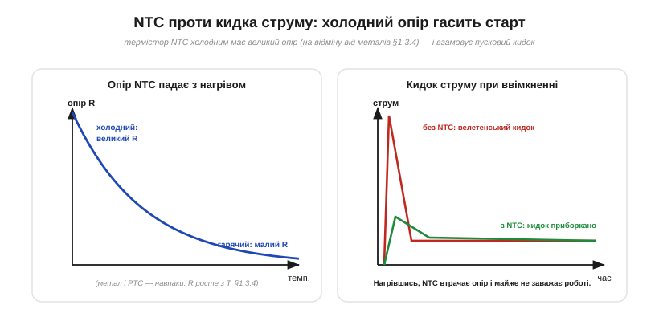

# 🔌 NTC проти кидка струму: термістор на вході блока живлення

> Компонентна вставка до теми [§1.3.4 «Опір і температура»](ch03-resistance-power-heat.md). §1.3.4 показав, що в металів (і в нитки лампи) опір **росте** з нагрівом — це PTC, і саме він дає кидок струму при ввімкненні. Тут — про дзеркальну деталь: **NTC**, опір якої з нагрівом **падає**, і про те, як нею навпаки **приборкують** пусковий кидок на вході блока живлення.

### Що це таке

**NTC-термістор** (*Negative Temperature Coefficient*) — це резистор із кераміки-напівпровідника, опір якого **різко зменшується** з нагрівом (протилежно до металів, §1.3.4: тепло звільняє в ньому більше носіїв заряду, §1.2.8). У ролі **обмежувача пускового струму** (*inrush current limiter*, ICL) його ставлять **послідовно** на вході блока живлення.

### Проблема: кидок при ввімкненні

*Рис. 1.3.4c.1. Ліворуч: опір NTC падає з нагрівом (дзеркало металу й PTC із §1.3.4). Праворуч: холодний NTC має великий опір і приборкує велетенський пусковий кидок струму; нагрівшись від цього ж струму, він втрачає опір і майже не заважає роботі.*

У блока живлення на вході стоїть великий **накопичувальний конденсатор** (детально про нього — у Модулі 2). У першу мить після вмикання він **порожній**, а порожній конденсатор бере струм майже як коротке замикання — тож крізь діоди й вимикач б'є велетенський **кидок** (десятки ампер на коротку мить). Він вибиває запобіжники, нищить діодний міст і вимикач, просаджує мережу. Цей кидок треба чимось приборкати.

### Як NTC рятує

Холодний NTC має **великий** опір (одиниці-десятки ом) — і саме він обмежує той перший кидок до безпечного рівня. А далі робочий струм **гріє** NTC (тепло I²R, §1.3.6), його опір **падає** до часток ома — і в усталеній роботі він майже не заважає, майже не гріється. Виходить розумно: великий опір **тоді, коли потрібно** (холодний старт), і малий **тоді, коли не потрібно** (тепла робота). Жодного керування — суто пасивно, дешево, само собою.

### Чому не звичайний резистор

Простий резистор теж обмежив би кидок — але він **вічно** гайнував би потужність у тепло, і коло втрачало б її щомиті. Уся хитрість NTC якраз у тому, що він обмежує **лише холодним**, а нагрівшись — «забирається з дороги».

### Типові граблі

- **Гарячий рестарт.** Після вимкнення NTC ще якийсь час лишається **теплим** (а отже, низькоомним). Вимкнув і одразу ввімкнув — NTC ще не охолов і кидок **не обмежить**. Тому в серйозних блоках NTC після старту **обходять реле** (а сам обмежувач лишають для холодного пуску).
- **Сам гарячий.** У роботі він розсіює тепло й буває гарячий — тримай подалі від чутливих деталей, не торкайся.
- **Постійні втрати.** Навіть теплий він має невеликий опір — отже, дрібну сталу втрату й просадку.

### §1.3.4 дзеркало — і варіації

NTC — це інженерне **дзеркало** PTC із §1.3.4: там нагрів опір **підвищував** (метал, нитка), тут — **знижує**. Споріднені рішення: активні обмежувачі з реле-обходом; **PTC** як захист від перегріву й надструму (той самий самовідновний «поліфьюз» із §1.3.8); і, нарешті, той самий NTC у зовсім іншій ролі — як **давач температури** (міряєш його опір — знаєш, наскільки нагрівся). Один залежний від тепла резистор — і ціле гроно застосувань.
