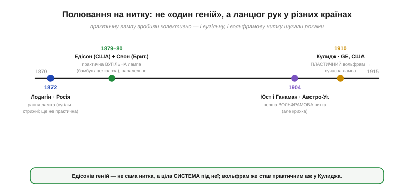
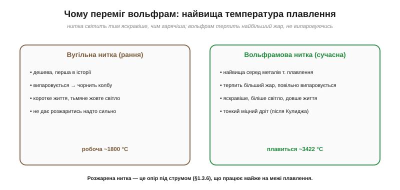
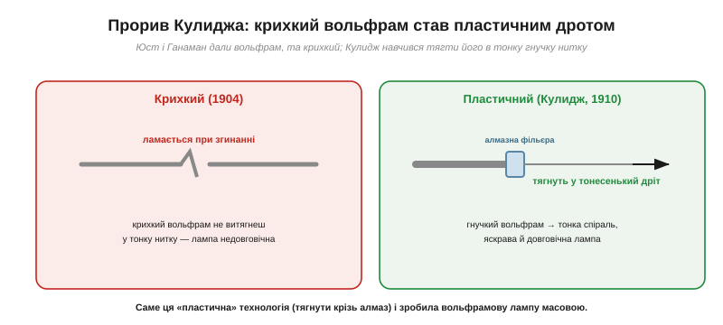

# 📜 Полювання на нитку: від вугільного бамбука Едісона до вольфраму Кулиджа

> Історична вставка до [§1.3.4 «Опір і температура»](ch03-resistance-power-heat.md). §1.3.4 показав, що опір металу росте з нагрівом, а розжарена нитка лампи — це опір, що працює майже на межі плавлення. Уся історія лампи розжарювання — це **полювання на нитку**: матеріал, який розжариться добіла й не згорить. І це історія не одного генія, а ланцюга рук у різних країнах — а заразом нагода чесно розібратися з кількома стійкими міфами.

## Завдання: нитка, що світить і не згоряє

Ідея проста на словах: пропустити струм крізь тонкий провідник, щоб він розжарився й засвітився (тепло I²R, §1.3.6). Біда — у самому слові «розжарився»: за тих температур, де тіло яскраво світить (понад тисячу-дві градусів), майже все або **плавиться**, або **згоряє**, або **випаровується**. Тож сторіччя винахідників билися над одним питанням: з **чого** зробити цю нитку, щоб вона жила довго. Це й був головний нерв усієї історії.

## Вугільна доба: Едісон і Свон — паралельно

Першою відповіддю стало **вугілля**: воно не плавиться, а тільки обвуглюється, тож витримує жар. І тут одразу варто розвіяти найпопулярніший міф — ніби лампу «винайшов Едісон» сам-один.

*Рис. 1.3.4і.1. Хто причетний до лампи розжарювання — у часі й по країнах. Рання лампа Лодигіна (Росія, 1872) → практична вугільна Едісона (США) і Свона (Британія) паралельно (1879–80) → перша вольфрамова нитка Юста й Ганамана (Австро-Угорщина, 1904, крихка) → пластичний вольфрам Кулиджа (GE, США, 1910). Винахід — колективний.*

Насправді практичну вугільну лампу створили **двоє паралельно**: американець **Томас Едісон** (*Thomas Edison*) і британець **Джозеф Свон** (*Joseph Swan*) — обидва запатентували її близько **1880 року**, працюючи незалежно. Свон почав експерименти навіть раніше; Едісон узяв карбонізований **бамбук**, що горів понад 1200 годин. А головний Едісонів геній був навіть не в самій нитці, а в **системі**: він свідомо робив лампу **високоомною**, щоб вона економно працювала в його великій електромережі з паралельним вмиканням. Згодом компанії злилися в «**Едісвон**» (Edison & Swan United, 1883). Тобто вже на цьому етапі лампа — спільний здобуток, а не одноосібний.

Варто розвіяти й романтику «генія-одинака». Едісон працював не сам, а в **промисловій лабораторії** в Менло-Парку, де ціла команда **систематично** перебрала тисячі матеріалів на нитку (звідси його знамените «я не зазнав поразок — я знайшов тисячі способів, що не працюють»). А по найкращий бамбук він навіть розсилав збирачів по всьому світу. Практична лампа народилася не з раптового осяяння, а з упертого, добре організованого **пошуку** — і це теж частина правди про винаходи.

## Лодигін: справжній внесок — і де починається міф

Тут варто акуратно розповісти про **Олександра Лодигіна** (*Alexander Lodygin*, 1847–1923) — бо довкола нього виріс міф у протилежний бік. Спершу — факти, які треба визнати чесно. Лодигін **справді** зробив лампу розжарювання ще **1872 року** — вугільні стрижні в герметичній колбі з азотом, російський патент 1874-го, **до** практичної лампи Едісона. А в 1890-х він патентував лампи з **металевими, зокрема вольфрамовими, нитками** (зокрема американський патент US 575,002) і **продав права на вольфрамовий патент компанії General Electric 1906 року**. Це реальні, вагомі внески, і применшувати їх несправедливо.

А тепер — де починається перебільшення. Радянська «пріоритетна» пропаганда зробила з Лодигіна «росіянина, що винайшов лампочку раніше за Едісона», мовляв, усе головне — наше. Це **зливає докупи різні речі**. Його лампа 1872 року, хоч і рання, була **некомерційна**: вугільні стрижні швидко вигоряли, а **системи** під неї не існувало. А «вольфрамовий пріоритет» — теж колективний: першими **патент** на вольфрамову нитку взяли Юст і Ганаман (1904), а **працювати** її змусив аж Кулидж (1910); сам по собі **продаж патенту GE 1906 року ще не означає пріоритету на вольфрам**. Тобто Лодигін — справжній співавтор довгої історії, але не «одноосібний винахідник лампи». І в цьому промовиста іронія: після революції 1917 року Лодигін **виїхав до США**, відхилив радянську пропозицію працювати над планом електрифікації й помер у Штатах 1923-го — а пропаганда однаково записала його в радянські пріоритетні герої.

Урок звідси той самий, що й із міфом про «самотнього Едісона», лише дзеркальний: остерігатися **і** «винайшов один американець», **і** «винайшов один росіянин». Винахід тут — справді колективний і міжнародний.

## Чому вугілля програло вольфраму

Вугільна нитка мала ваду, закладену в самій фізиці. Розжарена, вона помалу **випаровується**, осідаючи кіптявою на колбі: лампа тьмяніє, а сама нитка тоншає й перегоряє. Тому вугілля не давали розжарюватись надто сильно — а отже, світло виходило тьмяне й жовтувате.

*Рис. 1.3.4і.2. Чому вольфрам переміг вугілля. Вугільна нитка випаровується й чорнить колбу, тож світить тьмяно й недовго. Вольфрам має найвищу серед металів температуру плавлення (~3422 °C), тож терпить більший жар — світить яскравіше, біліше й довше.*

Розв'язок підказала фізика §1.3.4: світло тим яскравіше й біліше, чим **гарячіша** нитка, — тож потрібен матеріал, що витримає якнайбільший жар. Таким став **вольфрам** — метал із **найвищою серед металів температурою плавлення** (близько 3422 °C). Вольфрамову нитку можна розжарити куди дужче за вугільну, не доводячи до випаровування, — і вона світить **яскравіше, біліше й довше**. Саме тому всі лампи розжарювання XX століття — вольфрамові, а нитка в них працює за фантастичні дві з гаком тисячі градусів, ледь не на межі плавлення.

## Вольфрамовий прорив: Юст, Ганаман — і Кулидж

Та вольфрам опирався. Перші вольфрамові нитки запатентували 1904 року **Шандор Юст** (*Sándor Just*) і **Франьо Ганаман** (*Franjo Hanaman*) в Австро-Угорщині (Ганаман — хорват). Біда в тому, що їхній вольфрам був **крихкий**: спечений із порошку, він кришився й ламався, тонкої міцної нитки з нього не виходило.

А чому вольфрам так опирався? Якраз через свою головну чесноту. Найвища температура плавлення означає, що його **не можна просто розплавити й відлити**, як інші метали; вольфрамову нитку доводилося **спікати з порошку**, а спечений метал крихкий. Кулиджів здогад полягав у тому, що крихкість — не вирок: гарячий вольфрам, **прокатаний і прокований**, перебудовує свою зернисту структуру й стає тягучим. Те, що робило вольфрам ідеальним для нитки, водночас робило його пекельно важким в обробці — і саме цей вузол розв'язав Кулидж.

*Рис. 1.3.4і.3. Прорив Кулиджа. Вольфрам Юста–Ганамана був крихкий — ламався, тонкої нитки не зробиш. Кулидж навчився робити вольфрам пластичним і тягти його крізь алмазні фільєри в тонесенький гнучкий дріт — і лампа стала масовою.*

Загадку розплутав американець **Вільям Кулидж** (*William D. Coolidge*) у лабораторії General Electric близько **1910 року**. Він винайшов спосіб робити вольфрам **пластичним** (*ductile*): належно оброблений, той переставав кришитися й давав себе **протягувати крізь алмазні фільєри** в тонесенький, гнучкий і міцний дріт. Це й була остання, вирішальна ланка — після неї GE запустила масові вольфрамові лампи (марка «Mazda»), і вугільна доба скінчилася. Зверніть увагу на різницю заслуг: Юст і Ганаман **мали ідею** вольфраму, а Кулидж **зробив її робочою** — без його пластичного дроту патент на крихку нитку лишився б цікавинкою.

## Що лишилося нам — і урок про винаходи

Підсумок прямо лягає в §1.3.4. Вольфрамова нитка — це **повсякденне обличчя** того, що «опір росте з температурою»: холодна нитка має малий опір, тож у мить вмикання крізь неї б'є великий **пусковий струм** — ось чому лампи так часто перегоряють **саме при ввімкненні**, а не серед роботи. А ще нитка вічно балансує на межі плавлення — класичний приклад деталі, що працює на самому краю.

І ширший урок, заради якого варто було розплутувати цю історію: за «простою лампочкою» стоїть **міжнародний ланцюг** — США (Едісон, Кулидж), Британія (Свон), Росія (Лодигін), Австро-Угорщина й Хорватія (Юст, Ганаман), Німеччина (фірма Ауера, що купила патент Юста–Ганамана). Жодного «єдиного винахідника» немає, а є послідовність: **ідея → ранній зразок → патент → практична система**, де кожну ланку додавали різні люди в різних країнах. Остерігайтеся обох однобоких міфів — і «самотнього генія», і «нашого пріоритету»; чесна історія завжди складніша й цікавіша.

> ▶️ Повернутися до [§1.3.4 «Опір і температура»](ch03-resistance-power-heat.md) · Далі в розділі — §1.3.5 «Потужність».

---

### Пов'язане
- [§1.3.4 Опір і температура](ch03-resistance-power-heat.md) — фізика розжареної нитки (опір росте з T) і пускового струму.
- [Надпровідність — Камерлінг-Оннес, 1911](ch03-s4-history-superconductivity.md) — інша межа того самого §1.3.4: коли опір, навпаки, **зникає**.
