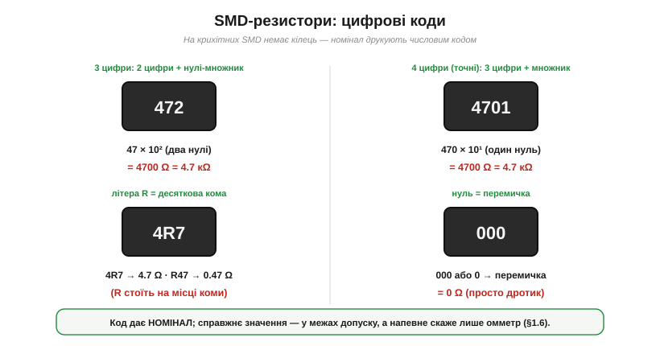

# 🔌 Як прочитати резистор: кольорові кільця й SMD-коди

> Компонентна вставка до теми [§1.3.7 «Резистор як компонент»](ch03-resistance-power-heat.md). §1.3.7 показав, які бувають резистори й чому їхні номінали стандартизовані рядами E12/E24. Тут — суто практичне вміння: **прочитати** номінал просто з корпусу, не маючи приладу. Бо на резисторі майже ніколи не написано «4700 Ω» цифрами: значення **зашифроване** — кольоровими кільцями на виводних, числовим кодом на SMD.

### Кольорові кільця: виводні резистори

На звичному «цукерковому» резисторі з дротяними виводами номінал кодують **кільця фарби**. Найпоширеніший формат — **чотири кільця**: дві цифри, множник і допуск.

*Рис. 1.3.7c.1. Чотири кільця читають зліва направо: перше й друге — цифри числа, третє — множник (10 у степені цифри), четверте — допуск. Унизу — таблиця колір→цифра. Приклад: коричневий·чорний·червоний·золотий = 1, 0, ×100, ±5% = 1000 Ω = 1 кΩ ±5%.*

Логіка така:

- **1-ше і 2-ге кільця** — це **дві цифри** числа.
- **3-тє кільце** — **множник**: на скільки нулів помножити (той самий колір, але як степінь десятки). Червоний тут означає не «2», а «×10² = ×100».
- **4-те кільце** — **допуск**: золоте ±5%, срібне ±10%.

Колір→цифра запам'ятовують за таблицею з рисунка: чорний 0, коричневий 1, червоний 2, оранжевий 3, жовтий 4, зелений 5, синій 6, фіолетовий 7, сірий 8, білий 9. **Приклад:** коричневий·чорний·червоний → 1, 0, ×100 = 1000 Ω = **1 кΩ**; а золоте кільце поряд каже «±5%».

**Точні резистори мають п'ять кілець:** три цифри, множник, допуск (зайва цифра дає більшу точність — пасує під ряди E96 з §1.3.7). Золоте й срібне кільця бувають і **множником**: золотий ×0.1, срібний ×0.01 — так кодують частки ома.

**З якого боку читати?** Кільце допуску (золоте або срібне) звичайно стоїть **скраю й трохи окремо** — читають від протилежного краю. Якщо орієнтир не очевидний, є проста перевірка: справжній номінал має лягти на стандартний ряд (4.7 кΩ існує, а «5.3 кΩ» — ні), тож хибний напрям одразу дасть «несправжнє» число.

**Граблі.** Кольори **вицвітають** від нагріву й часу, а коричневий, червоний та оранжевий при поганому світлі легко сплутати. Тому за найменшого сумніву номінал **вимірюють омметром** (§1.6) — кільця лише підказка, а не вирок.

### SMD-коди: поверхневі резистори

Крихітний **SMD-резистор** (з монтажем на поверхню) завбільшки з макове зерня — кільця на ньому не вмістити, тож номінал друкують **числовим кодом**.

*Рис. 1.3.7c.2. Чотири типи SMD-кодів. «472» = 47×10² = 4.7 кΩ (3 цифри: дві значущі + множник-нулі). «4701» = 470×10¹ = 4.7 кΩ (4 цифри — точні). «4R7» = 4.7 Ω, «R47» = 0.47 Ω (літера R на місці коми). «000» = перемичка 0 Ω.*

- **3 цифри** — дві значущі плюс **кількість нулів**: «472» = 47 і два нулі = 4700 Ω = **4.7 кΩ**; «100» = 10 Ω; «103» = 10 кΩ.
- **4 цифри** (точні) — три значущі плюс множник: «4701» = 470 і один нуль = **4.7 кΩ**.
- **Літера R = десяткова кома** для малих опорів: «4R7» = 4.7 Ω, «R47» = 0.47 Ω.
- **«000» чи «0»** — це **перемичка** 0 Ω: дротик у корпусі резистора, яким зручно з'єднати доріжки чи лишити місце під опційний номінал.

Є ще дрібний точний формат **EIA-96**: дві цифри — код значення з ряду E96, а літера — множник (наприклад, «01A» = 100 Ω). Зустрічається рідше; за потреби його розшифровують за таблицею.

### Головне правило

Будь-яке маркування дає лише **номінал** — задумане значення. Справжній опір лежить у межах **допуску** (тому й існують ряди E12/E24/E96 з §1.3.7, підігнані саме під розкид). А коли кільця стерлися, SMD-код не читається під лупою чи закралася підозра — не вгадуй, а **виміряй омметром** (§1.6). Кодування економить час, прилад дає певність.
