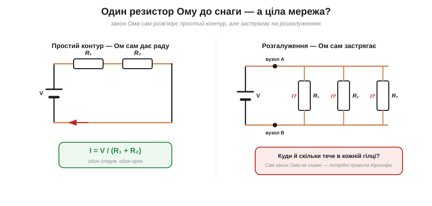
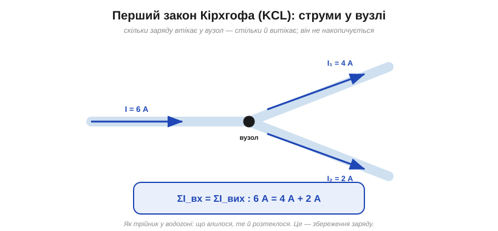
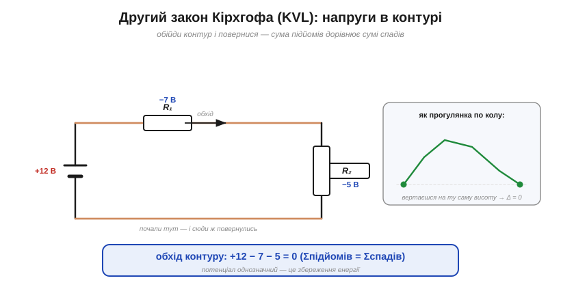
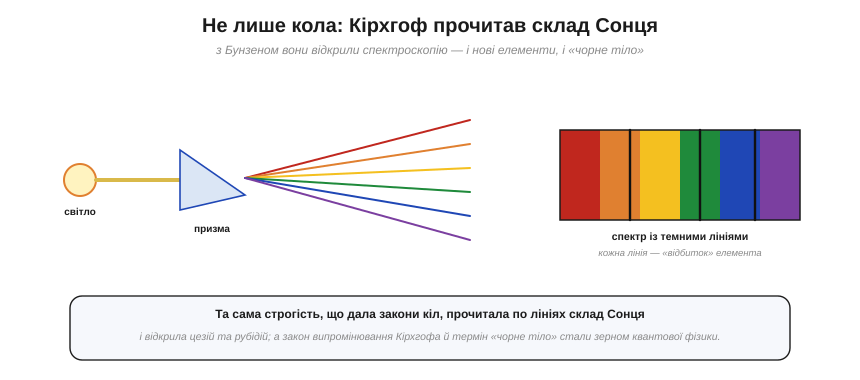

# 📜 Кірхгоф: як студент дав ключ до будь-якої схеми

> Історична вставка до [Розділу 4 «Закони Кірхгофа й аналіз кіл»](ch04-kirchhoff-circuit-analysis.md). У Розділі 3 закон Ома дав нам **один** резистор: I = V/R. Та реальні схеми — це **мережі** з десятків віток, вузлів і джерел, де струми розгалужуються, а напруги діляться. Самого Ома там замало. Ключ до будь-якого такого плетива знайшов 1845 року **Густав Кірхгоф** — і, що вражає, ще **студентом**, у двадцять один рік. Два його прості правила розкривають геть будь-яке лінійне коло; а за лаштунками вони виявляються двома знайомими законами збереження. Це історія про те, як юнацька строгість дала інженерії її найуживаніший інструмент — і про те, що той самий розум згодом прочитав по світлу склад Сонця.

---

## Закон Ома й межа одного резистора

Повторімо, де ми спинилися. Закон Ома I = V/R чудово працює для **одного** резистора чи простого контуру, де все ввімкнено послідовно: там струм один, і його легко знайти — поділити напругу на суму опорів. Розділ 3 саме цим і жив.

Та щойно коло **розгалужується** — з'являється **вузол**, де сходяться три чи більше дротів, дві вітки з різними опорами, а то й кілька джерел, — закон Ома **сам по собі застрягає**. Він каже, як пов'язані напруга й струм на **кожному** резисторі, але не каже, **як саме розподіляться** струми по гілках і напруги по вузлах усієї мережі. Бракує правил, що зв'язали б усе докупи.

*Рис. 4.0.1. Ліворуч — простий контур: закон Ома сам дає відповідь, I = V/(R₁+R₂). Праворуч — розгалуження: струм у вузлі ділиться між гілками, і сам Ом уже не скаже, скільки тече в кожній. Бракує правил для **вузлів** і **контурів** — їх і дав Кірхгоф.*

Саме цієї «клейкої речовини» — правил, що пов'язують струми у вузлах і напруги в контурах, — і бракувало, щоб з окремих законів Ома скласти розрахунок цілої схеми. Її приніс Кірхгоф.

---

## Хто такий Кірхгоф і коли він це зробив

**Густав Роберт Кірхгоф** (*Gustav Robert Kirchhoff*, 1824–1887) народився в Кенігсберзі, у Пруссії. Там само, у славетному математичному середовищі Кенігсберзького університету (у семінарі фізика Франца Ноймана), він і зробив свою першу велику роботу — і зробив її **неймовірно рано**.

Свої два закони для кіл Кірхгоф сформулював **1845 року**, маючи **двадцять один рік** і ще навіть не закінчивши навчання. Те, що інші оминали як «надто заплутане», юнак звів до двох коротких правил — і тим **узагальнив закон Ома** з одного резистора на будь-яку мережу. Це той рідкісний випадок, коли студентська робота одразу стає фундаментом цілої інженерної дисципліни й не старіє вже майже два століття.

Кілька слів про шлях. Кенігсберг тих часів був справжнім розсадником математики — саме тут століттям раніше **Ейлер** розв'язав задачу про сім мостів, заклавши теорію графів (до неї ми повернемося в історії §4.1, бо мережа кіл — це теж граф із вузлів і гілок). Кірхгоф навчався в семінарі Франца Ноймана, рано захистився, а далі професорував у Бреслау, **Гайдельберзі** — де й зійшовся з Бунзеном — і нарешті в Берліні. Закони кіл були лише блискучим початком.

> 🔧 **Навіщо це.** Варто запам'ятати цю історію хоча б тому, що вона додає сміливості: глибокі, вічні речі іноді робляться зовсім молодими людьми, які ще не знають, що «так не можна». Кірхгофові закони — не складна вища математика, а дві прості й інтуїтивні ідеї про збереження, які ми зараз і розберемо.

---

## Перший закон: струми у вузлі (KCL)

Перше правило стосується **вузла** — точки, де сходяться кілька дротів. **Перший закон Кірхгофа** (*закон струмів*, KCL — Kirchhoff's Current Law) каже просто: **скільки струму втікає у вузол, стільки ж і витікає**. Або, формально: алгебрична сума струмів у вузлі дорівнює нулю.

*Рис. 4.0.2. У вузол по одному дроту втікає 6 А, а по двох інших витікає 4 А і 2 А. Сума збігається: ΣI_вх = ΣI_вих, 6 = 4 + 2. Як трійник у водогоні — що влилося, те й розтеклося.*

Найкраща аналогія — **трійник у водогоні**: скільки води за секунду влилося в розгалуження, рівно стільки й мусить із нього витекти різними трубами. Вода не зникає й не накопичується в стику. Так само й заряд: у вузлі він не може ні зникнути, ні зібратися в купу (інакше там зростав би заряд і поле, чого в усталеному колі не буває). Ми, по суті, вже бачили цю ідею в §2.5, де казали, що струм «не витрачається» й однаковий уздовж нерозгалуженого дроту, — KCL просто поширює її на **розгалуження**.

---

## Другий закон: напруги в контурі (KVL)

Друге правило стосується **контуру** — будь-якого замкненого шляху в колі. **Другий закон Кірхгофа** (*закон напруг*, KVL — Kirchhoff's Voltage Law) каже: **обійди контур по колу й повернися у вихідну точку — і сума всіх змін напруги дорівнюватиме нулю**. Інакше: сума «підйомів» напруги (на джерелах) дорівнює сумі «спадів» (на резисторах).

*Рис. 4.0.3. Обходячи контур, на джерелі напруга піднімається на +12 В, а на резисторах спадає на −7 В і −5 В. Разом: +12 − 7 − 5 = 0. Як прогулянка по колу пагорбом: повертаєшся на ту саму висоту, тож сумарна зміна — нуль.*

Тут аналогія — **прогулянка по колу пагорбистою місцевістю**. Поки гуляєте, ви то піднімаєтесь, то спускаєтесь; але щойно повернетеся в **ту саму** точку — ваша сумарна зміна висоти **точно нульова**, хоч би якими пагорбами ви йшли. Потенціал (як і висота) — величина **однозначна**: кожній точці кола відповідає одне значення, тож, обійшовши петлю, ви повертаєтесь до того ж потенціалу. Напруга джерела «піднімає» заряд, а резистори цей підйом «проїдають» — і баланс завжди сходиться в нуль.

---

## Чому це працює: два закони збереження

Тепер найглибше. Звідки в цих правил така непохитність? Бо це не випадкові рецепти, а **два закони збереження** у масці:

- **Перший закон (KCL) — це збереження заряду.** Заряд не виникає й не зникає, тож у вузлі він не може накопичитися: що ввійшло, те й вийшло.
- **Другий закон (KVL) — це збереження енергії.** Потенціал однозначний, бо енергія, яку заряд набирає й віддає на замкненому шляху, мусить зійтися в нуль — інакше можна було б, ганяючи заряд по колу, безкоштовно черпати енергію (вічний двигун, якого не буває).

Оце і вся таємниця. Два найфундаментальніші закони фізики — збереження **заряду** й **енергії** — у застосуванні до кіл звуться законами Кірхгофа. А додавши до них закон Ома (зв'язок V = I·R на кожному резисторі), дістаємо повний набір: **Ом** дає рівняння для кожної гілки, а **Кірхгоф** — рівняння для вузлів і контурів. Разом вони дозволяють розв'язати геть **будь-яке** лінійне коло, хоч яке заплутане: складаєш систему рівнянь — і знаходиш усі струми та напруги. Саме на цьому стоятиме весь Розділ 4.

На практиці це проста механіка: позначаєш невідомі струми в гілках, пишеш по одному рівнянню KCL на кожен незалежний вузол і по одному KVL на кожен незалежний контур, додаєш V = I·R для кожного резистора — і дістаєш рівно стільки рівнянь, скільки невідомих. Лишається розв'язати систему. Цей рецепт ми покроково розгорнемо в §4.8, а спершу опануємо самі цеглинки.

---

## Кірхгоф поза колами: спектроскопія й склад Сонця

Щоб відчути масштаб людини, чиї закони ми щойно розібрали, варто знати: кола — лише **одне** з його великих діянь. Кірхгоф був одним із титанів фізики XIX століття.

*Рис. 4.0.4. Разом із Бунзеном Кірхгоф заклав **спектральний аналіз**: пропускаючи світло крізь призму, вони побачили, що кожен елемент дає свій неповторний візерунок ліній. По цих лініях вони відкрили нові елементи й навіть прочитали склад далекого Сонця.*

Разом із хіміком **Робертом Бунзеном** (*Robert Bunsen*) Кірхгоф близько 1860 року поставив на твердий ґрунт **спектральний аналіз** — метод визначати склад речовини за її спектром. Сам спектр відкрив не він: світло крізь призму розклав ще **Ньютон**, а темні лінії в сонячному спектрі виміряв і скаталогував **Йозеф Фраунгофер** на початку XIX ст. Заслуга Кірхгофа й Бунзена в іншому — вони **пояснили**, що ці лінії суть «відбитки пальців» хімічних елементів, і зробили з цього робочий метод. Помітивши, що розжарена речовина випромінює світло з **характерним для кожного елемента** набором ліній, по цих лініях вони відкрили два нові елементи — **цезій** і **рубідій**. А далі Кірхгоф пояснив **фраунгоферові** темні лінії у спектрі **Сонця** й так визначив, із чого Сонце складається. Доти вважали, що склад зір людині знати не дано; цей крок відкрив шлях **астрофізиці** — увесь сьогоднішній аналіз складу далеких зір і галактик виріс саме з тих перших темних ліній.

Мало того, його **закон теплового випромінювання** (1859) і введений ним термін «**чорне тіло**» (*black body*) поставили задачу, з якої через сорок років **Макс Планк** виведе **квантову фізику**. А ще Кірхгоф показав, що електричний сигнал біжить дротом майже зі **швидкістю світла**. Та сама строгість, що в двадцять один рік дала закони кіл, прочитала склад Сонця й торкнулася порога квантового світу.

---

## Чим це відгукнулося

Зведімо ланцюг. Ом дав нам **один** резистор; Кірхгоф — **цілу мережу**:

- **Перший закон (KCL)** — у вузлі ΣI_вх = ΣI_вих; це **збереження заряду** (родич ідеї §2.5).
- **Другий закон (KVL)** — у контурі Σ змін напруги = 0; це **збереження енергії**.
- Разом із **законом Ома** вони розв'язують будь-яке лінійне коло — фундамент усього Розділу 4.

І окремий урок — про самого Кірхгофа: глибокі речі робляться й замолоду, а справді першорядний розум проявляється всюди, куди гляне, — від схеми на столі до спектра далекої зорі. Його закони ми застосовуватимемо в кожній наступній темі: спершу опишемо **мову кіл** — вузли, гілки, контури (§4.1), потім розберемо **закон струмів** (§4.2) і **закон напруг** (§4.3), а далі складемо з них послідовні й паралельні з'єднання, подільники та цілий метод розрахунку кіл.

> ▶️ Перейти до [Розділу 4 «Закони Кірхгофа й аналіз кіл»](ch04-kirchhoff-circuit-analysis.md) · попереду — вузли й контури, KCL, KVL і аналіз будь-якої схеми.

---

### Пов'язане
- [§3.2 Закон Ома](../ch03-resistance-power-heat/ch03-resistance-power-heat.md) — зв'язок V = I·R на кожній гілці, який закони Кірхгофа доповнюють до повного набору.
- [§2.5 Струм не «витрачається»](../ch02-voltage-current-conduction/ch02-voltage-current-conduction.md) — збереження струму вздовж дроту, зародок першого закону Кірхгофа.
- [§1.5 Потенціал і напруга](../ch01-charge-field-potential/ch01-charge-field-potential.md) — однозначність потенціалу, на якій тримається другий закон.
