# Розділ 1.4 — Закони Кірхгофа й аналіз кіл

У Розділі 1.3 ми опанували **один** резистор: закон Ома, потужність, тепло, добір деталі. Та реальні схеми — це **мережі** з багатьох елементів, де струми розгалужуються, а напруги діляться між вітками. Самого закону Ома там замало. Цей розділ присвячено двом простим, але всемогутнім правилам **Кірхгофа**, що розв'язують будь-яке таке коло, — і практичним прийомам, які з них виростають: послідовне й паралельне з'єднання, подільники напруги та струму, цілий метод розрахунку. А починається все з **мови**, якою описують схеми.

> 📜 **Перед матеріалом — історія:** [Кірхгоф: як студент дав ключ до будь-якої схеми](ch04-history-kirchhoff.md) — чому Ома замало для мережі й звідки взялися два закони збереження.

---

## 1.4.1 Вузли, гілки, контури — мова кіл

Перш ніж рахувати складні кола, треба домовитися про **слова**. Як географ говорить про міста, дороги й кільцеві маршрути, так електрик описує схему трьома поняттями: **вузол**, **гілка**, **контур**. Опанувавши їх, ви зможете глянути на будь-яке плетиво дротів і одразу побачити його структуру — а отже, й застосувати закони Кірхгофа.

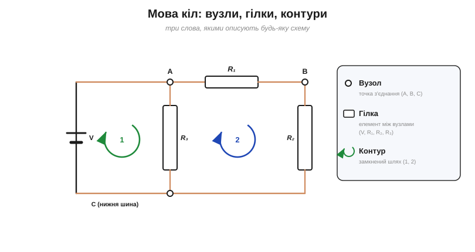
*Рис. 1.4.1.1. Канонічне коло з двома контурами. **Вузли** A, B, C — точки з'єднання; **гілки** V, R₁, R₂, R₃ — елементи між вузлами; **контури** 1 і 2 — замкнені шляхи. Цими трьома словами описують будь-яку схему.*

### Вузол: точка з'єднання

**Вузол** (*node*) — це точка, де сходяться два чи більше виводи елементів. У вузлі струм може **розгалужуватися** (або, навпаки, кілька струмів зливаються в один). Саме до вузлів застосовуватиметься перший закон Кірхгофа.

Тут чигає важлива тонкість, на якій спотикаються початківці. **Усі точки, з'єднані між собою суцільним дротом, — це ОДИН і той самий вузол**, хоч би як далеко вони були накреслені на схемі. Ідеальний дріт не має опору (§1.3.3), тож уздовж нього потенціал **однаковий** скрізь — а отже, це електрично одна й та сама точка.

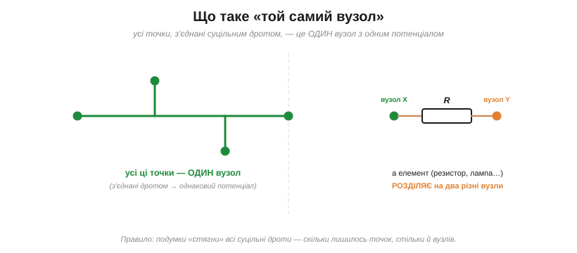
*Рис. 1.4.1.2. «Той самий вузол»: усі точки, з'єднані суцільним дротом (ліворуч, зелені), мають однаковий потенціал і рахуються як ОДИН вузол, хоч би як далеко були накреслені. А резистор чи будь-який елемент (праворуч) РОЗДІЛЯЄ дріт на два різні вузли — X і Y.*

Звідси простий практичний прийом: щоб порахувати вузли, подумки **«стягніть»** усі суцільні дроти в точки. Скільки окремих точок лишилося — стільки й вузлів. І навпаки: щойно між двома точками стоїть **елемент** (резистор, лампа, джерело), вони стають **різними** вузлами, бо на елементі потенціал змінюється.

Чому це так важливо? Бо саме до вузлів застосовується перший закон Кірхгофа, і кількість вузлів задає, скільки рівнянь струмів ми напишемо. Тому вміння **правильно полічити** вузли — не сплутавши один «розтягнутий» вузол із кількома окремими — це найперший практичний навик аналізу кіл, і саме на ньому найчастіше помиляються.

### Гілка: елемент між двома вузлами

**Гілка** (*branch*) — це шлях між двома сусідніми вузлами, як правило, з одним елементом (резистором, джерелом тощо). Уздовж гілки струм **один і той самий** — їй нікуди розгалужуватися, бо розгалуження бувають лише у вузлах. Цей **струм гілки** — основне невідоме, яке ми шукатимемо, аналізуючи коло.

У нашому канонічному колі (Рис. 1.4.1.1) чотири гілки: джерело V (між C і A), R₃ (між A і C), R₁ (між A і B) та R₂ (між B і C). Кожна несе свій струм; знайти всі ці струми — і означає «розв'язати коло».

Маленька, але важлива деталь: напрямок струму в гілці ми **призначаємо самі**, наперед, ще не знаючи, куди він тече насправді. Якщо вгадали — відповідь вийде додатна; якщо ні — просто **від'ємна**, що чесно скаже: струм тече у зворотний бік. Тож помилитися з напрямком не страшно — головне послідовно дотримуватися обраного напрямку в усіх рівняннях. Цю свободу ми не раз використаємо в §1.4.8.

### Контур: замкнений шлях

**Контур** (*loop*) — це будь-який **замкнений** шлях у колі: вирушивши з якоїсь точки вздовж гілок, ви повертаєтесь у неї ж, ніде не проходячи двічі. До контурів застосовуватиметься другий закон Кірхгофа.

У схемі зазвичай можна окреслити кілька контурів. Особливо зручні **прості** контури — такі «вічка» мережі, що не містять інших контурів усередині (їх ще звуть **комірками**, *mesh*). У канонічному колі їх два: ліве вічко (V–R₃) і праве (R₁–R₂–R₃). Саме незалежні контури дадуть нам рівняння напруг.

### Топологія, а не «географія»

Ключова думка, що звільняє від плутанини: схема визначається тим, **що з чим з'єднано**, а не тим, **де** намальовано елемент. Цю властивість «що з чим» називають **топологією** кола, на відміну від «географії» — конкретного розташування на папері.

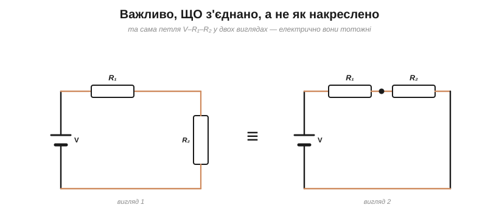
*Рис. 1.4.1.4. Та сама схема (петля V–R₁–R₂), накреслена двома способами. Електрично вони тотожні: важливо тільки, ЩО з чим з'єднано (топологія), а не де намальовано елемент (геометрія).*

Одне й те саме коло можна накреслити охайним прямокутником, витягнути в лінію чи закрутити спіраллю — доки **з'єднання** ті самі, це **одна й та сама** схема, і поводитиметься вона однаково. Тому, аналізуючи незнайому плату чи заплутаний рисунок, корисно подумки **перемалювати** її в зрозумілий вигляд: знайти вузли, простежити гілки — і складна «географія» розпадається на просту топологію. Найяскравіше це видно, коли порівняти **макетну плату** з її **принциповою схемою**: фізично вони не схожі ані крапельки — там плутанина дротів і ніжок, тут охайні символи, — а електрично це те саме коло. Принципова схема для того й існує, щоб показувати чисту топологію, відкидаючи неважливе розташування. На цьому ж стоять і два базові способи з'єднання, які ми докладно розберемо далі:

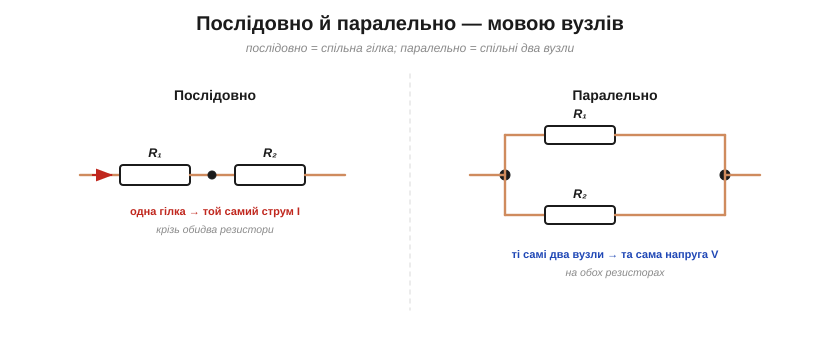
*Рис. 1.4.1.3. Два ключові способи з'єднання мовою вузлів. **Послідовно** — спільна гілка, тож крізь обидва елементи тече той самий струм. **Паралельно** — спільні два вузли, тож на обох елементах та сама напруга.*

Ось де мова вузлів одразу окупається. **Послідовне** з'єднання — це коли елементи лежать в **одній гілці**, низкою; тоді крізь них тече **той самий струм** (струму нікуди дітися — розгалужень нема). **Паралельне** — це коли елементи ввімкнені між **тими самими двома вузлами**; тоді на них **однакова напруга** (бо їхні кінці — це ті самі дві точки). Запам'ятайте цю пару: *спільна гілка → спільний струм; спільні вузли → спільна напруга*. Вона — ключ до §1.4.4 і §1.4.5.

### Порахуймо: вузли, гілки, контури

Коли структуру названо, її можна **порахувати** — і це знадобиться, щоб скласти рівно стільки рівнянь, скільки невідомих (метод §1.4.8).

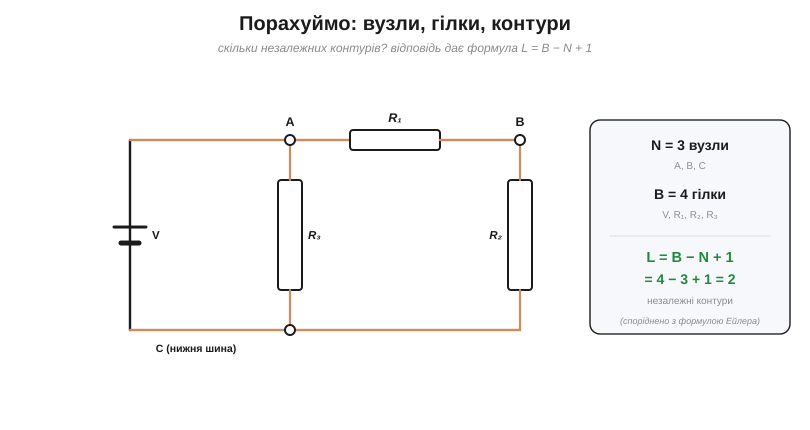
*Рис. 1.4.1.5. Підрахунок на канонічному колі: N = 3 вузли, B = 4 гілки. Кількість незалежних контурів дає формула L = B − N + 1 = 2 (для **зв'язної** схеми — однієї суцільної) — споріднена з формулою Ейлера для графів.*

Порахуймо на канонічному колі. Вузлів **N = 3** (A, B, C). Гілок **B = 4** (V, R₁, R₂, R₃). А скільки **незалежних** контурів? Відповідь дає напрочуд проста формула:

L = B − N + 1 = 4 − 3 + 1 = **2**.

Тут «+1» передбачає, що схема **зв'язна** — одне суцільне коло. Загальна форма для будь-якого графа: L = B − N + C, де C — число окремих **зв'язних частин** (у цілій схемі C = 1). Математики звуть це число L **цикломатичним**.

Саме два незалежні контури ми й бачимо — два вічка. Ця формула не випадкова: вона прямо споріднена з **формулою Ейлера** для графів (пригадайте, що мережа кіл — це граф із вузлів-точок і гілок-ребер; цей зв'язок ми згадували в [історії розділу](ch04-history-kirchhoff.md)). Вона гарантує, що ми не напишемо ні забагато, ні замало рівнянь.

Звідки вона береться — видно з простого міркування. Уявіть, що спершу з'єднуєте вузли «деревом», без жодної петлі: щоб зв'язати N вузлів без контурів, треба рівно N − 1 гілок. Кожна **додаткова** гілка понад це дерево неминуче замикає рівно один новий контур. Отже, незалежних контурів стільки, скільки «зайвих» гілок: L = B − (N − 1) = B − N + 1. Проста й залізна логіка — і та сама, що стоїть за формулою Ейлера.

> 🔧 **Навіщо це.** Ця «мова» — не педантизм, а фундамент розрахунку. Закони Кірхгофа формулюються прямо в її термінах: перший — про струми **у вузлі**, другий — про напруги **в контурі**. А формула L = B − N + 1 каже, скільки рівнянь напруг писати. Тому, перш ніж рахувати будь-яку схему, інженер спершу **називає** її структуру: ось вузли, ось гілки, ось незалежні контури — і далі все йде як по маслу. Звикніть бачити ці три речі на будь-якому рисунку, і половину роботи зроблено.

---

Підсумок §1.4.1: будь-яку схему описують три слова — **вузол** (точка з'єднання; усе, сполучене дротом, — один вузол), **гілка** (елемент між вузлами, несе один струм) і **контур** (замкнений шлях). Важлива **топологія** (що з чим з'єднано), а не «географія» рисунка; звідси й означення послідовного (спільна гілка → спільний струм) та паралельного (спільні вузли → спільна напруга) з'єднань. Кількості пов'язані формулою **L = B − N + 1**. Тепер, маючи мову, візьмемося за перший закон Кірхгофа — про струми у вузлі.

---

## 1.4.2 Закон струмів Кірхгофа (KCL)

Маючи мову вузлів і гілок, візьмемося за перший із двох законів. **Закон струмів Кірхгофа** (*Kirchhoff's Current Law*, KCL) стосується **вузлів** — і він напрочуд простий. З [історії розділу](ch04-history-kirchhoff.md) ми вже знаємо його суть (це збереження заряду); тепер сформулюймо його чітко й навчімося **застосовувати**.

### Формулювання: ΣI = 0 у вузлі

Закон каже: **сума струмів, що втікають у вузол, дорівнює сумі струмів, що з нього витікають**. Або, ще коротше: алгебрична сума всіх струмів у вузлі дорівнює **нулю**.

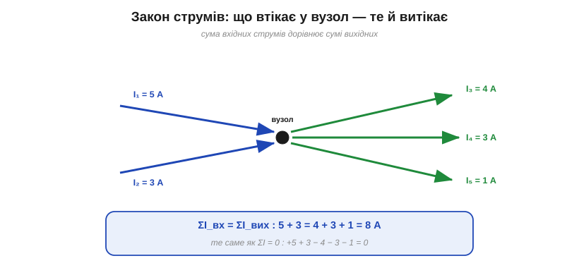
*Рис. 1.4.2.1. Закон струмів у вузлі: сума вхідних струмів (5 + 3) дорівнює сумі вихідних (4 + 3 + 1) — обидві по 8 А. Те саме можна записати як алгебричну суму всіх струмів, що дорівнює нулю (входи зі знаком +, виходи −).*

Обидва формулювання — те саме. «Вхід = вихід» наочніше, «ΣI = 0» зручніше для рівнянь. Головне, що струм у вузлі **не береться нізвідки й не дівається в нікуди**: усе, що притекло, мусить відтекти.

Аналогія з перехрестям чи водогоном тут точна: скільки машин в'їхало на перехрестя, стільки й виїхало; скільки води влилося в трійник, стільки витекло. Важливо, що в звичайному колі (зосереджені елементи) рівність тримається **щомиті** й **точно** — не «в середньому за час», а в кожен окремий момент, і однаково для постійного та змінного струму. Саме ця непохитність робить закон струмів надійним каркасом для будь-якого аналізу кола.

### Чому: заряд не накопичується

Звідки така залізна певність? З двох простих фактів. По-перше, **заряд зберігається** — його не стає ні більше, ні менше (ми це знаємо ще з Розділу 1.1). По-друге, у наближенні **зосереджених елементів** (*lumped*) вузол — це просто **точка з'єднання**, де зберігати заряд **нема де** (вона не має ємності). Насправді будь-який реальний вузол має крихітну **паразитну ємність** і на дуже високих частотах може на мить накопичити заряд (там KCL доповнюють струмом зміщення); та для звичайних кіл цим нехтують, і закон тримається точно.

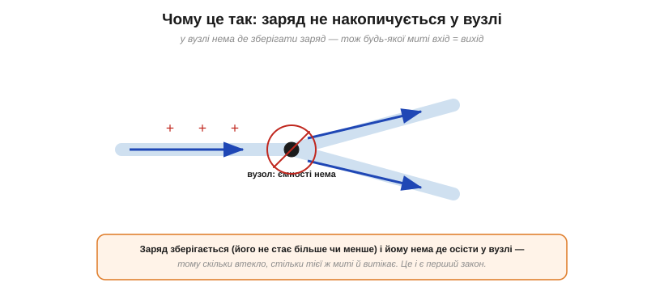
*Рис. 1.4.2.2. Чому KCL виконується: заряд зберігається, і у вузлі йому нема де накопичитись (вузол — точка, без ємності). Тому будь-якої миті скільки заряду втікає, стільки ж і витікає.*

Якби в вузол втікало більше, ніж витікає, там **зростав** би заряд — а отже, і потенціал, і поле, що відштовхувало б нові заряди, доки приплив не зрівняється з відпливом. У звичайному колі це вирівнювання миттєве, тож баланс тримається **щомиті**. (Запасати заряд уміє лише спеціальний елемент — конденсатор; але то вже не вузол, а компонент, і ним займеться Модуль 2.)

### Знаки: вхід плюс, вихід мінус

Щоб писати рівняння без плутанини, зручно домовитися про **знаки**. Найпоширеніша угода: струми, що **втікають** у вузол, беремо зі знаком «**+**», а ті, що **витікають**, — зі знаком «**−**». Тоді закон набуває стрункого вигляду **ΣI = 0**.

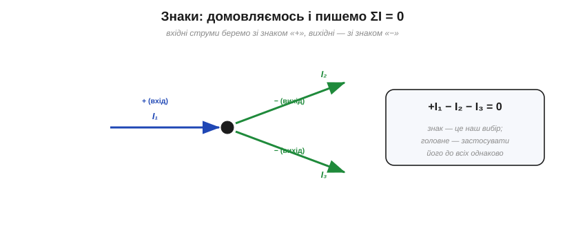
*Рис. 1.4.2.3. Зручний запис: домовляємось брати вхідні струми зі знаком «+», вихідні — зі знаком «−», і пишемо ΣI = 0. Знак — наш вибір; важливо лише застосувати правило до всіх струмів однаково.*

Підкреслимо: який саме напрямок назвати «додатним» — це **наш вибір**, і він ні на що не впливає, доки ми застосовуємо його **послідовно** до всіх струмів. Якщо наприкінці якийсь струм вийде **від'ємним** — нічого страшного: це лише означає, що насправді він тече у зворотний бік (пригадайте про вільний вибір напрямку з §1.4.1).

Запишімо для прикладу рівняння вузла з рисунка: вхідний I₁ — додатний, два вихідні I₂ та I₃ — від'ємні, тож +I₁ − I₂ − I₃ = 0, тобто I₁ = I₂ + I₃. Бачите: «алгебрична сума дорівнює нулю» — це лише компактний запис звичного «вхід дорівнює виходу». Обидві форми взаємозамінні; беріть ту, що зручніша в конкретній задачі.

### Приклад: знайти невідомий струм

Найчастіше KCL застосовують так: відомі всі струми у вузлі, крім одного, — і закон одразу дає цей останній.

**Приклад. У вузол втікає 5 А, а витікають 2 А і 1.5 А. Який четвертий струм?**

```
Закон струмів:  ΣI_вх = ΣI_вих
Підставляємо:   5 = 2 + 1.5 + Iₓ
Розв'язуємо:    Iₓ = 5 − 2 − 1.5  = 1.5 А  (витікає)
```

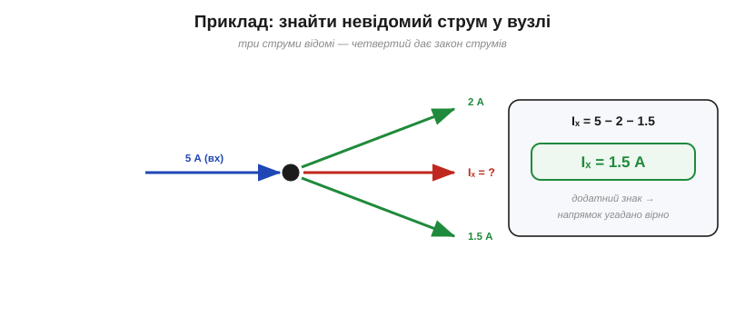
*Рис. 1.4.2.4. Якщо три струми у вузлі відомі, четвертий дає закон струмів: Iₓ = 5 − 2 − 1.5 = 1.5 А. Додатний результат підтверджує, що напрямок ми вгадали правильно.*

Відповідь додатна — отже, обраний напрямок (витікає) правильний. Якби вийшло −1.5 А, ми б знали: струм насправді **втікає**. Саме так, по одному невідомому за раз, KCL допомагає «розшити» струми в будь-якому розгалуженні.

Зверніть увагу на межу можливостей: один вузол дає **одне** рівняння, тож знайти ним можна лише **один** невідомий струм. Якщо невідомих більше, рівнянь забракне — і тоді в гру вступлять другий закон (про напруги) та систематичний метод із §1.4.8, де рівнянь складають рівно стільки, скільки треба. Але там, де лишилося добити останній струм у розгалуженні, перший закон — найшвидший інструмент у скриньці.

### Не лише вузол: будь-яка замкнена межа

І нарешті — потужне узагальнення, яке дуже спрощує життя. Закон струмів справджується не тільки для точки-вузла, а для **будь-якої замкненої межі**, хоч би що було всередині. Подумки обведіть якусь частину схеми замкненою лінією: **сума струмів, що перетинають цю межу, дорівнює нулю** — що в область увійшло, те з неї й вийшло.

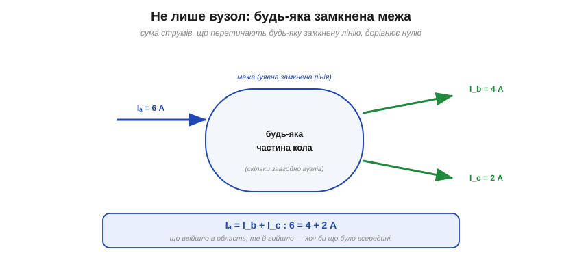
*Рис. 1.4.2.5. Потужне узагальнення: закон струмів справджується не лише для точки-вузла, а для будь-якої замкненої межі. Що ввійшло в окреслену область, те з неї й виходить, хоч би скільки вузлів і елементів було всередині.*

Це випливає з того самого збереження заряду: якщо всередині межі заряд не накопичується (а в усталеному колі це так), то сумарний приплив дорівнює сумарному відпливу. Прийом дуже корисний: ціле плетиво вузлів і гілок можна «загорнути» в одну область і миттєво пов'язати струми на її краях, не розбираючись із нутрощами.

Практичний приклад: щоб дізнатися, який струм споживає цілий **модуль** (мікросхема, плата, прилад), не треба знати його внутрішню схему — досить обвести його уявною межею й порахувати струми на живлячих провідниках. Скільки втікає по «плюсі», стільки ж витікає по «мінусі» (землі). На цьому й тримаються і бюджет живлення, і вимірювання споживання приладу мультиметром.

### Послідовне коло: той самий струм усюди

Найпростіший, але дуже важливий наслідок KCL: у **послідовному** (нерозгалуженому) колі струм **скрізь однаковий**. Адже кожен внутрішній вузол такого кола має лише один вхід і один вихід, тож закон струмів дає просто I_вх = I_вих — струм не змінюється від елемента до елемента. Саме тому ми ще з §1.2.5 повторювали: «струм не витрачається, він однаковий уздовж кола». Тепер видно, що то був окремий випадок KCL — для кола **без розгалужень**.

> 🔧 **Навіщо це.** KCL — щоденний робочий інструмент. Він каже, як струм **ділиться** в паралельних вітках (детально — §1.4.5 і §1.4.7): сума струмів гілок дорівнює загальному. Він же — основа діагностики: якщо в якусь точку струм заходить, він **зобов'язаний** кудись вийти; «зайвого» струму не буває. А узагальнення на замкнену межу дозволяє рахувати струм, що входить у цілий блок (модуль, мікросхему, плату), не зазираючи всередину. Питання «куди подівся струм?» завжди має відповідь — і дає її саме перший закон Кірхгофа.

---

Підсумок §1.4.2: **закон струмів** (KCL) — у будь-якому вузлі сума вхідних струмів дорівнює сумі вихідних, або ΣI = 0. Це пряме **збереження заряду**: у вузлі немає де його накопичити. Знаки (вхід +, вихід −) — наша угода; від'ємний результат просто означає зворотний напрямок. Закон дозволяє знаходити невідомий струм у розгалуженні й діє не лише для точки, а для **будь-якої замкненої межі**. Маючи правило для струмів, переходимо до другого — правила для **напруг у контурі**.

---

## 1.4.3 Закон напруг Кірхгофа (KVL)

Другий закон Кірхгофа — **закон напруг** (*Kirchhoff's Voltage Law*, KVL) — стосується **контурів**. Він такий самий простий і надійний, як перший, бо теж спирається на закон збереження — цього разу **енергії**. З [історії розділу](ch04-history-kirchhoff.md) суть нам уже відома; формалізуймо її й навчімося застосовувати.

### Формулювання: ΣV = 0 у контурі

Закон каже: **обходячи будь-який замкнений контур і повертаючись у вихідну точку, алгебрична сума всіх змін напруги дорівнює нулю**. Рівнозначне формулювання, часто наочніше: **сума підйомів напруги (на джерелах) дорівнює сумі спадів (на резисторах)**.

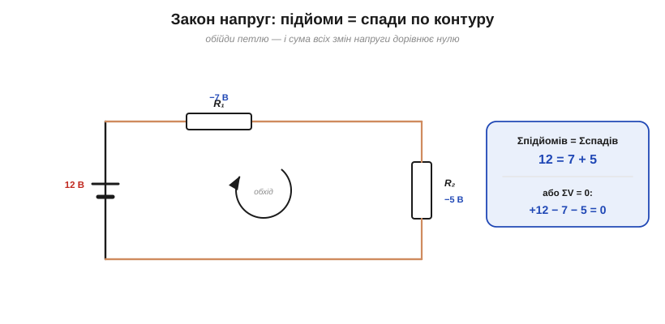
*Рис. 1.4.3.1. Закон напруг у контурі: обходячи петлю, на джерелі потенціал піднімається (+12 В), а на резисторах спадає (−7 В і −5 В). Сума підйомів дорівнює сумі спадів (12 = 7 + 5), тобто алгебрична сума напруг по контуру — нуль.*

У нашому прикладі джерело піднімає напругу на 12 В, а два резистори «з'їдають» її по 7 і 5 В. Підйом дорівнює сумі спадів: 12 = 7 + 5. Те саме як ΣV = 0: +12 − 7 − 5 = 0. Напруга джерела повністю **розподіляється** між елементами контуру — жодного вольта не зникає й не з'являється зайвого.

### Чому: однозначний потенціал

Звідки ця певність? З того, що **потенціал у кожній точці кола однозначний**: точці відповідає одне значення напруги (відносно вибраної опорної точки). А отже, обійшовши замкнену петлю й повернувшись у **ту саму** точку, ми мусимо повернутись і до **того самого** потенціалу — тож усі зміни вздовж шляху взаємно скасовуються. (Тут є тиха умова: крізь сам контур не повинен пронизувати **змінний магнітний потік**. Якщо пронизує — за законом Фарадея в петлі наводиться додаткова ЕРС, потенціал перестає бути однозначним, і цю наведену ЕРС у KVL додають окремим доданком. У звичайних колах без трансформаторного зв'язку цим нехтують — і KVL точний.)

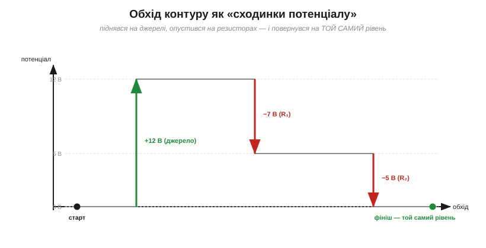
*Рис. 1.4.3.2. Той самий обхід як «сходинки потенціалу»: джерело піднімає на +12 В, кожен резистор опускає (−7, −5), і наприкінці ми повертаємось точно на стартовий рівень. Саме ця однозначність потенціалу (повернувся в ту саму точку — той самий потенціал) і є суттю KVL.*

Якнайкраще це видно на «сходинках»: ідучи контуром, потенціал піднімається на джерелі й опускається на кожному резисторі, але після повного обходу обов'язково повертається на **стартовий рівень**. За цим стоїть **збереження енергії**: напруга — це енергія на одиницю заряду (§1.1.5), і якби заряд, обійшовши петлю, повертався з іншою енергією, ми б діставали (чи втрачали) енергію з нічого — вічний двигун, якого не буває. Джерело **дає** заряду енергію, резистори її **забирають** (на тепло), і баланс завжди сходиться в нуль.

Та сама ідея — як прогулянка пагорбами: хоч скільки вгору-вниз ви йшли, повернувшись додому, ви опиняєтесь на тій самій висоті, з якої вийшли. Висота — однозначна функція місця, як потенціал — однозначна функція точки кола. Тому правило «обійшов петлю — повернувся до того самого» однаково чинне і для гір, і для напруги.

### Знаки: підйоми й спади

Щоб писати рівняння без помилок, оберіть **напрямок обходу** контуру (будь-який) і дотримуйтесь його. Тоді знаки розставляються за простим правилом.


*Рис. 1.4.3.3. Знаки: оберіть напрямок обходу. Перетин джерела з «−» на «+» — підйом (+); перетин резистора за напрямком струму — спад (−). Тоді ΣV = 0 по всьому контуру.*

Правило таке: проходячи **джерело** від «−» до «+» — це **підйом** (беремо зі знаком +), а від «+» до «−» — **спад** (−); проходячи **резистор за напрямком струму** — це **спад** (−), а проти струму — підйом (+). Розставивши так знаки й прирівнявши суму до нуля, дістаємо рівняння контуру. Як і з першим законом, напрямок обходу — наш вільний вибір; аби лише застосувати правило послідовно.

Перевірмо на нашому контурі (обхід за годинниковою стрілкою): джерело проходимо з «−» на «+» — це +12; далі R₁ за напрямком струму — це −7; далі R₂ за струмом — це −5. Сума: +12 − 7 − 5 = 0. Сходиться, як і має бути. Якби ми обрали зворотний обхід, усі знаки змінилися б на протилежні (−12 + 7 + 5 = 0) — і рівняння лишилося б правдивим.

### Приклад: знайти невідому напругу

Найчастіше KVL застосовують так: у контурі відомі джерело й частина спадів — і закон одразу дає останній.

**Приклад. У контурі джерело 12 В і два резистори; на R₁ спадає 8 В. Скільки спаде на R₂?**

```
Закон напруг:  ΣV = 0 по контуру
Обхід:         +12 − 8 − Vₓ = 0
Розв'язуємо:   Vₓ = 12 − 8  = 4 В
```


*Рис. 1.4.3.4. Якщо в контурі відомі джерело й частина спадів, решту дає закон напруг: Vₓ = 12 − 8 = 4 В.*

Уся напруга джерела (12 В) розподілилася: 8 В на R₁ і 4 В на R₂. Це не випадковість, а загальне правило послідовного кола — до нього й перейдемо.

### Послідовні джерела додаються

KVL стосується не лише спадів, а й **джерел**. Якщо в контурі їх кілька, ми просто додаємо їхні підйоми з відповідними знаками. Увімкнені **узгоджено** (плюс одного до мінуса наступного), джерела **додають** напруги: чотири батарейки по 1.5 В дають 6 В — саме так працює відсік для батарейок у ліхтарику чи пульті. А якщо одну вставити **навпаки**, її підйом обернеться спадом, і загальна напруга **впаде** (1.5 + 1.5 + 1.5 − 1.5 = 3 В). Тому полярність батарейок — не дрібниця: закон напруг рахує саме **алгебричну** суму, з урахуванням напрямку кожного джерела.

### Наслідок: послідовні резистори ділять напругу

З KVL випливає одна з найкорисніших речей у всій електроніці. У **послідовному** колі напруга джерела **ділиться** між резисторами, причому **пропорційно їхнім опорам**: на більшому опорі — більший спад.


*Рис. 1.4.3.5. Послідовні резистори ділять напругу джерела пропорційно опорам: на більшому опорі більший спад. Тут 12 В діляться як 8 В і 4 В (R₁:R₂ = 2:1). Це — подільник напруги, до якого повернемось у §1.4.6.*

Чому пропорційно? Бо крізь послідовні резистори тече **той самий струм** I (це вже перший закон, §1.4.2), а спад на кожному — за законом Ома V = I·R. Однаковий струм, помножений на різні опори, дає спади **в тій самій пропорції, що й опори**. Звідси формула: на резисторі Rᵢ спадає Vᵢ = V · Rᵢ / (R₁ + R₂ + …). У прикладі 2 кΩ і 1 кΩ ділять 12 В як 8 і 4 В (пропорція 2:1). Ця конструкція — **подільник напруги** (*voltage divider*), і вона така важлива, що їй присвячено окрему тему §1.4.6.

Подільники — усюди: ними задають **опорні напруги**, зчитують положення повзунка **потенціометра** (ручки гучності чи яскравості), узгоджують рівні сигналів, підмішують напругу для давачів. Щойно ви бачите два послідовні резистори, між якими знято напругу, — це подільник, і його частку рахують саме за щойно виведеною пропорцією.

> 🔧 **Навіщо це.** KVL — другий щоденний інструмент. Він каже, що напруги послідовних джерел **додаються** (так із кількох батарейок складають потрібну напругу), а на послідовних навантаженнях — **діляться** (подільник, §1.4.6). Він же — основа перевірки проєкту: усі спади в контурі **мусять** скластися в напругу живлення; якщо у вас не сходиться — десь помилка. І він нагадує: у тій самій точці кола не може бути двох різних напруг. Питання «скільки напруги лишилося?» завжди має відповідь — і дає її саме другий закон Кірхгофа.

---

Підсумок §1.4.3: **закон напруг** (KVL) — обходячи будь-який контур, алгебрична сума напруг дорівнює нулю, або сума підйомів дорівнює сумі спадів. Це **збереження енергії** й **однозначність потенціалу**: повернувшись у ту саму точку, повертаємось до того самого потенціалу. Знаки розставляють за обраним напрямком обходу. Закон дає невідому напругу в контурі, а його прямий наслідок — **поділ напруги** послідовними резисторами пропорційно опорам. Тепер у нас є **обидва** закони Кірхгофа; час застосувати їх до двох наріжних з'єднань — почнемо з **послідовного**.

---

## 1.4.4 Послідовне з'єднання

Маючи обидва закони Кірхгофа, застосуймо їх до найпростішого способу з'єднання — **послідовного**, коли елементи стоять **одне за одним** в одній гілці, як вагони потяга. Ми вже знаємо це з §1.4.1: послідовно — означає **спільна гілка**. Подивімось, що з цього випливає, і виведемо головний практичний результат — як рахувати опір такого ланцюжка.

### Два факти: спільний струм, напруги додаються

Послідовне коло має дві визначальні властивості, і обидві — прямі наслідки законів Кірхгофа.

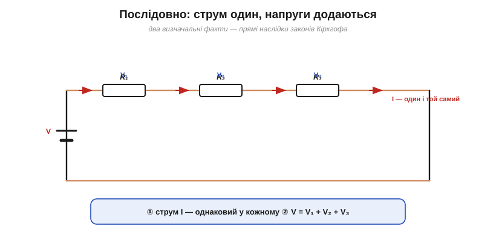
*Рис. 1.4.4.1. Послідовне коло: елементи стоять одне за одним в одній гілці. Звідси два факти — ① струм I однаковий у кожному (закон струмів), ② повна напруга дорівнює сумі спадів, V = V₁ + V₂ + V₃ (закон напруг).*

**Перше: струм скрізь однаковий.** Оскільки гілка одна й розгалужень нема, той самий струм I тече крізь усі елементи поспіль — це прямо з закону струмів (§1.4.2). **Друге: напруги додаються.** Обходячи контур, повна напруга джерела розподіляється між елементами: V = V₁ + V₂ + V₃ — це закон напруг (§1.4.3). Запам'ятайте цю пару: **спільний струм, сумарна напруга** — вона визначає все інше.

Образ простий: послідовні елементи — як намистини на одній нитці чи машини на вузькій однорядній дорозі. Пройти можна лише **гуськом**, тож потік (струм) крізь кожну ланку однаковий, а загальний спротив дорозі складається з усіх ділянок поспіль.

### Опори додаються: R_екв = R₁ + R₂ + …

Тепер головне. Із цих двох фактів випливає напрочуд проста відповідь на питання «який опір у всього ланцюжка?».


*Рис. 1.4.4.2. Чому опори додаються: струм спільний, тож V = V₁+V₂+V₃ = I·R₁ + I·R₂ + I·R₃ = I·(R₁+R₂+R₃). Порівнявши з V = I·R_екв, дістаємо R_екв = R₁ + R₂ + R₃.*

Виведення коротке. Спад на кожному резисторі — за законом Ома: V₁ = I·R₁, V₂ = I·R₂, V₃ = I·R₃ (струм I **спільний**). Сума їх дає повну напругу:

V = V₁ + V₂ + V₃ = I·R₁ + I·R₂ + I·R₃ = I·(R₁ + R₂ + R₃).

Порівняймо це з законом Ома для всього кола, V = I·R_екв, — і відповідь очевидна: **послідовні опори просто додаються**.

R_екв = R₁ + R₂ + R₃ + …

Правило діє для скількох завгодно резисторів — просто додавайте опори по черзі. А для n **однакових** резисторів воно дає зручне R_екв = n·R: п'ять резисторів по 100 Ω, увімкнені поспіль, — це рівно 500 Ω.

### Один еквівалентний резистор

Це означає, що ціле гроно послідовних резисторів можна замінити **одним** еквівалентним — і джерело «не помітить» різниці: той самий струм, та сама напруга.

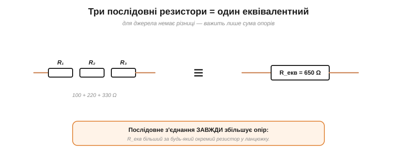
*Рис. 1.4.4.3. Для джерела ланцюжок із трьох резисторів нічим не відрізняється від одного еквівалентного R_екв = R₁+R₂+R₃ = 650 Ω. Послідовне з'єднання завжди **збільшує** опір — R_екв більший за будь-який окремий.*

Зверніть увагу на важливий наслідок: **послідовне з'єднання завжди збільшує опір**. Додаючи резистори в ланцюжок, ми лише нарощуємо R_екв, тож він неминуче **більший за будь-який окремий** опір у ньому. (Інтуїтивно — як подовжити провідник: довше → більший опір, рівно як у формулі R = ρL/A з §1.3.3.) Заміна групи елементів одним еквівалентним — це й є основний прийом **спрощення** кіл, яким ми користуватимемось знов і знов. Велике плетиво резисторів розплутують саме **крок за кроком**: знайшли послідовну групу — згорнули її в один R_екв; знайшли паралельну (наступна тема) — згорнули й її; і так, доки від цілої схеми не лишиться єдиний еквівалентний опір, з яким струм від джерела рахується одним діленням. Саме так ми діятимемо в §1.4.8.

### Приклад: розрахувати коло

Зведімо все в типовий розрахунок.

**Приклад. Три резистори 100, 220 і 330 Ω з'єднані послідовно під 12 В. Знайти струм і спад на кожному.**

```
Еквівалентний опір:  R_екв = 100 + 220 + 330  = 650 Ω
Спільний струм:      I = V / R_екв = 12 / 650  ≈ 18.5 мА
Спади:               V₁ = I·100 ≈ 1.85 В
                     V₂ = I·220 ≈ 4.07 В
                     V₃ = I·330 ≈ 6.08 В
Перевірка:           1.85 + 4.07 + 6.08 ≈ 12 В  ✓
```


*Рис. 1.4.4.4. Розрахунок: спершу R_екв = 650 Ω, потім спільний струм I = 12/650 ≈ 18.5 мА, далі спад на кожному V = I·R. Сума спадів повертає 12 В — перевірка зійшлася.*

Алгоритм універсальний: **складаємо опори → знаходимо спільний струм → шукаємо спади**. І завжди корисно перевірити себе: сума спадів **мусить** дорівнювати напрузі джерела (KVL). Якщо не сходиться — десь помилка.

### Прихований послідовний опір

Послідовні опори бувають не лише навмисні. Будь-яке реальне джерело має **внутрішній опір**, увімкнений послідовно з навантаженням; саме на ньому «губиться» частина напруги, і тому батарейка під навантаженням **просідає**. Так само послідовно додається опір довгих дротів (§1.3.3) — згадайте падіння напруги на лінії. Тому, рахуючи реальне коло, не забувайте про ці **сховані** послідовні опори: вони цілком справжні, хоч і не намальовані окремим резистором. Внутрішнім опором джерела докладно займеться §1.5.1 — а поки досить знати, що він теж **додається** в загальну суму.

### Де це працює


*Рис. 1.4.4.5. Послідовне з'єднання: обмежують струм (резистор перед світлодіодом), складають опір (як один довший провідник, R = ρL/A) — але мають слабке місце: розрив у будь-якій ланці гасить усе коло (класична гірлянда).*

Послідовне з'єднання — щоденний прийом. У ньому ставлять **струмообмежувальний резистор** перед світлодіодом (§1.3.7): додатковий опір зменшує струм до безпечного. Скільки саме додати — рахують просто: зайву напругу поділити на бажаний струм (R = V_зайве / I), точно як ми робили для світлодіода в §1.3.7. Так само складають опори чи напруги, коли потрібного номіналу нема під рукою. Але є й **слабке місце**: оскільки струм тече одним шляхом, **розрив у будь-якій ланці гасить усе коло**. Класика — старі ялинкові **гірлянди**: перегоріла одна лампочка — і темніє вся низка, а шукай потім винну. Це зворотний бік «спільного струму»: ланцюг міцний рівно настільки, наскільки міцна його найслабша ланка. Тому в сучасних гірляндах лампи доповнюють крихітним **шунтом**: щойно нитка перегоряє, струм іде в обхід неї, і решта низки світить далі.

> 🔧 **Навіщо це.** Три речі варто винести. Перше: **послідовно опори додаються** (R_екв = ΣR) — і завжди дають більше за кожен; це найшвидший спосіб підняти опір чи **обмежити струм** (згадайте резистор для LED). Друге: напруга в ланцюжку **ділиться** (звідси подільник, §1.4.6). Третє, практичне: послідовне коло **крихке** — будь-який обрив зупиняє все; тому, до речі, **запобіжник** і вмикають послідовно (хай рветься він, а не цінне навантаження). Бачите низку елементів «гуськом» — одразу думайте «спільний струм, опори й напруги додаються».

---

Підсумок §1.4.4: у **послідовному** колі струм **спільний**, напруги **додаються** (V = ΣVᵢ), а опори — теж **додаються**: R_екв = R₁ + R₂ + …, і завжди більший за кожен окремий. Звідси простий алгоритм (скласти опори → струм → спади) і прийом спрощення схем заміною групи на еквівалент. Послідовно обмежують струм і складають напругу, та платять крихкістю: один обрив гасить усе. Тепер розгляньмо **протилежне** з'єднання — паралельне, де вже спільною буде напруга.

---

## 1.4.5 Паралельне з'єднання

Друге наріжне з'єднання — **паралельне**: елементи ввімкнені між **тими самими двома вузлами**, як сходинки драбини між двома поручнями (§1.4.1). Це повна **протилежність** послідовному, і вся пара законів тут «дзеркалиться»: якщо послідовно спільним був струм, то паралельно спільною буде **напруга**.

### Два факти: спільна напруга, струми додаються


*Рис. 1.4.5.1. Паралельне коло: усі елементи ввімкнені між тими самими двома вузлами. Звідси два факти — ① напруга V однакова на кожній гілці (закон напруг), ② повний струм дорівнює сумі гілкових, I = I₁ + I₂ + I₃ (закон струмів).*

**Перше: напруга на всіх однакова.** Кінці кожної гілки — це ті самі два вузли, а між двома точками напруга одна (§1.4.1, §1.4.3); тож на всіх паралельних елементах **однаковий** V. **Друге: струми додаються.** Загальний струм, дійшовши до вузла, **розгалужується** по вітках, а потім знову зливається: I = I₁ + I₂ + I₃ — це закон струмів (§1.4.2). Запам'ятайте дзеркальну пару до §1.4.4: **спільна напруга, сумарний струм**.

### Опір: провідності додаються

Тепер головне питання — який опір у всього пучка гілок? Відповідь теж «дзеркальна» до послідовної, тільки складаються вже не опори, а їхні **обернені величини**.


*Рис. 1.4.5.2. Чому додаються провідності: напруга спільна, тож I = I₁+I₂+I₃ = V/R₁ + V/R₂ + V/R₃ = V·(1/R₁+1/R₂+1/R₃). Порівнявши з I = V/R_екв, дістаємо 1/R_екв = Σ1/Rᵢ — складаються обернені опори (провідності).*

Виведення таке саме коротке. Струм кожної гілки — за законом Ома: I₁ = V/R₁, I₂ = V/R₂, I₃ = V/R₃ (напруга V **спільна**). Сума дає повний струм:

I = I₁ + I₂ + I₃ = V·(1/R₁ + 1/R₂ + 1/R₃).

Порівнявши з I = V/R_екв, дістаємо правило:

1/R_екв = 1/R₁ + 1/R₂ + 1/R₃ + …

Тобто складаються **обернені опори**. Зручно ввести **провідність** G = 1/R (одиниця — сименс, См): тоді паралельно провідності **просто додаються**, G_екв = G₁ + G₂ + …, — так само красиво, як опори в послідовному колі.

Тут добре видно повну **двоїстість** двох з'єднань: послідовно додаються опори (R_екв = ΣR), паралельно — провідності (G_екв = ΣG); там спільний струм — тут спільна напруга; там напруга ділиться прямо — тут струм ділиться обернено. Запам'ятавши одне з'єднання, ви фактично знаєте й друге — досить подумки поміняти місцями струм із напругою, а опір із провідністю.

### Зручні випадки: добуток/сума і R/n

Формула з дробами незручна для усного рахунку, тож варто знати два короткі випадки.


*Рис. 1.4.5.3. Два зручні випадки: для **двох** резисторів R_екв = R₁·R₂/(R₁+R₂) («добуток на суму»); для **n однакових** R_екв = R/n. І головне правило: паралельне з'єднання завжди **зменшує** опір — R_екв менший за найменший із резисторів.*

Для **двох** резисторів дроби згортаються в зручну формулу **«добуток на суму»**: R_екв = R₁·R₂/(R₁ + R₂). Наприклад, 6 Ω і 3 Ω дають 18/9 = 2 Ω. Для **n однакових** резисторів — ще простіше: R_екв = R/n (три по 100 Ω — це 33.3 Ω). І запам'ятайте головне правило-перевірку: **паралельне з'єднання завжди зменшує опір**, тож R_екв виходить **меншим за найменший** із резисторів. Якщо у вас вийшло більше — десь помилка.

Чому опір неодмінно падає? Бо кожна нова паралельна гілка — це **додатковий шлях** для струму, а більше шляхів означає, що джерелу легше «проштовхнути» заряд. Додати гілку — однаково що розширити трубу: потік росте, спротив падає. Тому навіть величезний опір, поставлений паралельно до малого, трохи, але **зменшує** загальний.

### Струм ділиться обернено до опору

Якщо в послідовному колі напруга ділилася **прямо** пропорційно опорам, то в паралельному струм ділиться **обернено**: чим менший опір гілки, тим **більший** струм вона бере.

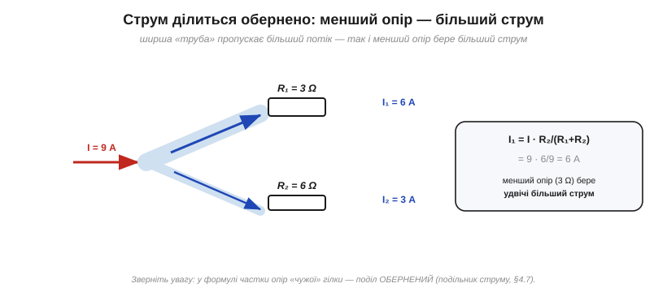
*Рис. 1.4.5.4. Струм ділиться обернено до опору: менший опір (ширша «труба») бере більший струм. Тут 3 Ω і 6 Ω ділять 9 А як 6 А і 3 А. Зверніть увагу: у формулі частки стоїть опір ЧУЖОЇ гілки — це подільник струму (§1.4.7).*

Інтуїція — водогінна: ширша труба (менший опір) пропускає більший потік. Формально для двох гілок I₁ = I · R₂/(R₁ + R₂) — зверніть увагу, що в чисельнику стоїть опір **сусідньої** гілки, тому поділ і виходить оберненим. Цей **подільник струму** — дзеркало подільника напруги з §1.4.3, і йому теж присвячено окрему тему (§1.4.7).

### Паралельні джерела

Дзеркально до §1.4.3 (де послідовні джерела **додавали** напруги), **паралельні** однакові джерела напруги її не підвищують, а **ділять навантаження** й продовжують час роботи. Два однакові акумулятори на 12 В, увімкнені паралельно, дають ті самі 12 В, а **за добре підібраної пари** — приблизно вдвічі більшу ємність і вдвічі більший віддаваний струм. Важлива пересторога: паралелити варто лише **справді однакові** джерела (та сама напруга, хімія, стан заряду, близькі внутрішні опори) — інакше між ними потече **зрівнювальний струм** (сильніше «тисне» на слабше), а це перегрів і шкода обом. Тому, скажімо, не варто з'єднувати паралельно стару й свіжу батарейки.

### Приклад і де це працює

**Приклад. Резистори 6 Ω і 3 Ω з'єднані паралельно під 12 В. Знайти еквівалентний опір і струми.**

```
Еквівалентний опір:  R_екв = 6·3/(6+3) = 18/9  = 2 Ω   (менший за 3 Ω!)
Струм у кожній:      I₁ = V/R₁ = 12/6  = 2 А
                     I₂ = V/R₂ = 12/3  = 4 А
Повний струм:        I = I₁ + I₂ = 2 + 4         = 6 А
Перевірка:           I = V/R_екв = 12/2          = 6 А  ✓
```

Менший опір (3 Ω) узяв **удвічі більший** струм (4 А проти 2 А) — як і має бути за оберненим поділом.


*Рис. 1.4.5.5. Уся домашня проводка — паралельна: кожен прилад дістає повну напругу (230 В) і працює незалежно. Вимкнув світло — холодильник і зарядка працюють далі, на відміну від послідовної гірлянди (§1.4.4).*

Найважливіше застосування паралельного з'єднання — **уся побутова й автомобільна проводка**. Розетки, лампи, прилади ввімкнені **паралельно**: кожен дістає повну напругу мережі (230 В) і працює **незалежно** від інших. Саме тому, вимкнувши світло, ви не гасите холодильник, а додавши ще один прилад, не змінюєте напруги на решті. Це пряма протилежність крихкій послідовній гірлянді з §1.4.4, де обрив однієї ланки гасив усе.

Та сама логіка — у машині (усі споживачі паралельно на 12 В бортової мережі) і в розподільчому щитку, де кожну групу розеток боронить свій автомат. А коли споживачеві треба пропустити **великий струм**, ставлять кілька **паралельних** провідників: разом вони мають менший опір і витримують більший струм, ніж один тонкий дріт.

> 🔧 **Навіщо це.** Паралельне з'єднання — це **незалежність** і **більша пропускна здатність**. Незалежність: кожна гілка на повній напрузі, вимкнення однієї не чіпає інших (звідси вся проводка). Більша здатність: кожна додана гілка — це новий шлях для струму, тож загальний опір **падає**, а сумарний струм росте (тому товсті споживачі — це багато паралельних провідників). Паралельні резистори ще ставлять, щоб дістати **нестандартний** опір або **розподілити потужність** (тепло) між кількома деталями. Бачите елементи «між двома спільними точками» — одразу думайте «спільна напруга, струми й провідності додаються».

---

Підсумок §1.4.5: у **паралельному** колі напруга **спільна**, струми **додаються** (I = ΣIᵢ), а опір рахують через **провідності**: 1/R_екв = Σ(1/Rᵢ), причому R_екв завжди **менший за найменший**. Для двох гілок зручна формула «добуток на суму», для n однакових — R/n. Струм ділиться **обернено** до опору (подільник струму, §1.4.7). Паралельно ввімкнено всю проводку — заради незалежності й пропускної здатності. Тепер, знаючи обидва з'єднання, повернімося до двох наймасовіших схемок-помічників — почнемо з **подільника напруги**.

---

## 1.4.6 Дільник напруги

**Дільник напруги** (*voltage divider*) — це, мабуть, найпоширеніша маленька схемка в усій електроніці: лише два послідовні резистори, а напругу знімають із **середньої точки** між ними. Ми вже бачили його як наслідок KVL у §1.4.3; тепер розберемо до кінця — формулу, вибір, регульований варіант і головний підступ.

### Формула: V_вих = V·R₂/(R₁+R₂)

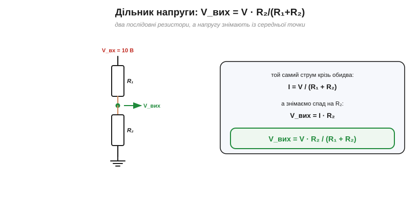
*Рис. 1.4.6.1. Дільник напруги: два послідовні резистори, а напругу знімають із середньої точки. Той самий струм I = V/(R₁+R₂) тече крізь обидва; на R₂ спадає V_вих = I·R₂ = V·R₂/(R₁+R₂).*

Виведення — пряме застосування §1.4.4. Резистори послідовні, тож крізь них тече **спільний** струм I = V/(R₁+R₂). Вихід ми знімаємо як спад на R₂, тобто V_вих = I·R₂. Підставивши струм, дістаємо формулу дільника:

V_вих = V · R₂ / (R₁ + R₂).

Усе, що вона каже, — це знайома пропорція з §1.4.3: напруга ділиться між резисторами **пропорційно опорам**, і на R₂ припадає його частка R₂/(R₁+R₂) від повної напруги.

Щоб не плутатися, котрий резистор у формулі — «R₂»: це **той, на якому знімають вихід**, тобто **нижнє** плече, між відводом і спільним проводом (землею). Верхнє плече R₁ стоїть між входом і відводом. Поміняєте їх місцями — дістанете іншу частку, R₁/(R₁+R₂), тож тримайте позначення в голові.

### Як вибрати частку

Формула одразу підказує, як дібрати потрібний вихід: усе вирішує **відношення** R₂ до суми.

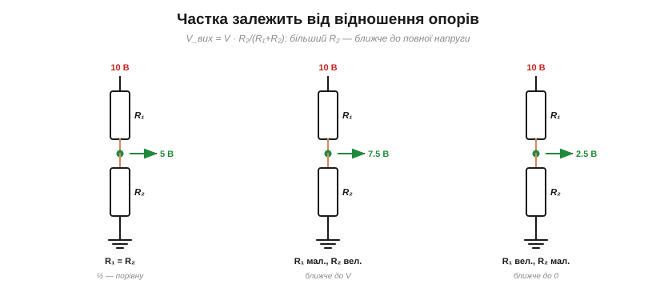
*Рис. 1.4.6.2. Частка виходу залежить від відношення опорів: рівні R₁=R₂ дають половину, більший R₂ — ближче до повної напруги, менший — ближче до нуля. Усе за тією самою формулою V·R₂/(R₁+R₂).*

Якщо R₁ = R₂ — на виході рівно **половина** напруги. Хочете більше — беріть R₂ більшим за R₁ (вихід тягнеться до повної V); хочете менше — навпаки. Зверніть увагу: важливе саме **відношення**, а не самі номінали. Дільник 10к/10к і 100к/100к дають однакову половину — але, як ми скоро побачимо, не однакові за поведінкою під навантаженням.

**Приклад. Дільник R₁ = 10 кΩ, R₂ = 20 кΩ під 5 В — яка V_вих?**

```
V_вих = V · R₂/(R₁+R₂) = 5 · 20/(10+20) = 5 · 20/30 ≈ 3.33 В
```

### Потенціометр: регульований дільник

Якщо середній відвід зробити **рухомим**, дільник стає регульованим — і це є **потенціометр** (*potentiometer*, «потенціометр» чи просто «пот»).

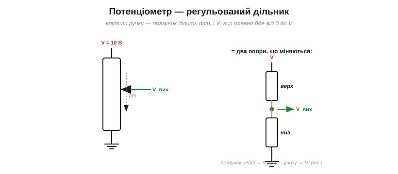
*Рис. 1.4.6.3. Потенціометр — це дільник зі змінним відводом: повзунок ділить доріжку на верхню й нижню частини, і, рухаючи його, ми плавно змінюємо V_вих від 0 до V. Так працюють регулятори гучності та яскравості.*

Усередині потенціометра — суцільна резистивна доріжка з двома кінцевими виводами, а між ними ковзає **повзунок** (третій вивід). Повзунок ділить доріжку на «верхній» і «нижній» опори — рівно як R₁ і R₂ дільника, тільки їхнє відношення **плавно змінюється**, коли ви крутите ручку. На повному оберті V_вих проходить увесь діапазон від 0 до V. Саме так влаштовані ручки **гучності**, яскравості, регулятори — і так само мікроконтролер читає положення «крутилки».

Два уточнення. Якщо задіяти лише **два** виводи (кінець і повзунок), потенціометр перетворюється на **змінний резистор** (реостат) — це вже не дільник, а просто регульований опір. А ще доріжки бувають із **лінійною** й **логарифмічною** характеристикою: для гучності беруть логарифмічну, бо так вухо сприймає наростання звуку рівномірнішим.

### Підступ навантаження: дільник просідає

А тепер — найважливіше застереження, на якому горить багато початківців. Формула V·R₂/(R₁+R₂) справджується, лише поки до виходу **нічого не приєднано** (або приєднане має дуже великий опір). Щойно ви підключите реальне навантаження, воно стане **паралельним** до R₂ — і вихід **просяде**.


*Рис. 1.4.6.4. Головний підступ: приєднане навантаження стає паралельним до R₂, знижуючи його, — і V_вих просідає (тут із 5.0 до 3.33 В). Дільник — не джерело живлення: або беруть R₁, R₂ значно меншими за навантаження, або ставлять буфер.*

Подивіться на числа: дільник 10к/10к під 10 В дає на холостому ході 5.0 В. Та приєднайте навантаження 10 кΩ — і воно стане паралельним до нижнього резистора: R₂ ∥ R_н = 5 кΩ, тож V_вих = 10·5/15 ≈ **3.33 В**. Вихід упав на третину, хоч ми «нічого не міняли» в самому дільнику. Висновок: **дільник — це не джерело живлення**. Він добре задає **опорну напругу** для входу з великим опором (як-от АЦП), але не годиться, щоб живити струмоємне навантаження.

Інженери описують це через **опір**: щоб не просаджувати дільник, навантаження мусить мати великий **вхідний опір** — саме тому входи АЦП роблять високоомними. А «силу» самого дільника як джерела характеризує його **вихідний опір** (приблизно R₁∥R₂): що він менший, то менше просідання під навантаженням. Це вже прямий місток до еквівалентних схем **Тевеніна** з Розділу 1.5, де реальне джерело описують парою «напруга + внутрішній опір».

> 🔧 **Навіщо це.** Дільник напруги — ваш щоденний інструмент для двох речей: задати **опорну напругу** й **зчитати давач**. Але пам'ятайте про навантаження. Правило великого пальця: опір навантаження має бути **щонайменше вдесятеро більший** за R₂ (тоді просідання — у межах кількох відсотків). Якщо навантаження «важке», або беріть R₁, R₂ **малими** (ціною більшого струму й тепла), або ставте після дільника **буфер** — повторювач на операційному підсилювачі (Модуль 2), що повторює напругу, не навантажуючи дільник. І не забувайте: дільник постійно споживає струм I = V/(R₁+R₂), тож для економних пристроїв опори беруть великими.

### Де це працює: читання давачів

Найгарніше застосування дільника — **аналогові давачі**. Багато з них — це просто резистори, чий опір змінюється від умов: **термістор** (опір залежить від температури), **фоторезистор/LDR** (від освітлення), тензодатчик (від деформації).

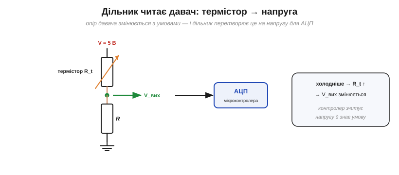
*Рис. 1.4.6.5. Найкорисніше застосування: давач (термістор, фоторезистор) як одне плече дільника. Його опір змінюється з температурою чи світлом — і V_вих, яку зчитує АЦП мікроконтролера, відображає умову. Так контролер «бачить» аналоговий світ.*

Поставивши такий давач одним плечем дільника, а звичайний резистор — другим, ми перетворюємо **зміну опору** на **зміну напруги**, яку вже легко виміряти. Холодніше — опір термістора росте — вихідна напруга змінюється; мікроконтролер зчитує її своїм **АЦП** (аналого-цифровим перетворювачем) і дізнається температуру. Це місток до Модуля 4, де ми читатимемо реальні давачі: майже кожен аналоговий давач під'єднують саме через дільник. Скромні два резистори виявляються очима, якими цифровий світ дивиться на аналоговий.

---

Підсумок §1.4.6: **дільник напруги** — два послідовні резистори з відводом посередині; V_вих = V·R₂/(R₁+R₂), тобто напруга ділиться пропорційно опорам. Частку задають **відношенням** опорів; рухомий відвід дає **потенціометр**. Головний підступ — **навантаження**: воно паралелиться до R₂ і просаджує вихід, тож дільник годиться для опорних напруг і давачів, а не для живлення. Саме через дільник мікроконтролери читають аналогові давачі. Тепер — дзеркальний помічник для струму.

---

## 1.4.7 Дільник струму

Якщо дільник напруги (§1.4.6) знімав частку **напруги** з послідовних резисторів, то **дільник струму** (*current divider*) ділить **струм** між паралельними гілками. Це повне дзеркало попередньої теми — і, знаючи одне, ви майже задарма дістаєте друге.

### Дзеркало дільника напруги

Пригадаймо двоїстість із §1.4.5: послідовно ↔ паралельно, струм ↔ напруга, опір ↔ провідність. Дільник струму — паралельна рідня дільника напруги. Там спільним був струм, а ділилася напруга (прямо до опорів); тут спільною буде **напруга**, а ділитиметься **струм** — і, як ми вже бачили в §1.4.5, **обернено** до опорів: менша гілка (менший опір) забирає **більший** струм.

Зручно тримати цю дзеркальність у голові цілою: **послідовно** — спільний струм, ділиться напруга, більша частка дістається більшому опору; **паралельно** — спільна напруга, ділиться струм, більша частка дістається меншому опору. Це не два набори правил, а один, побачений із двох боків.

### Формула: I₁ = I·R₂/(R₁+R₂)

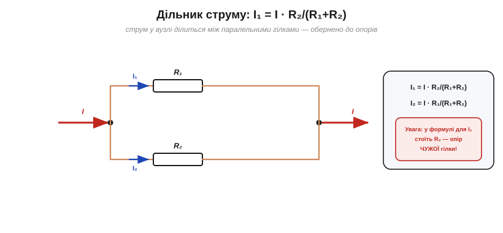
*Рис. 1.4.7.1. Дільник струму: повний струм у вузлі ділиться між двома паралельними гілками. На гілку 1 припадає I₁ = I·R₂/(R₁+R₂). Увага на пастку: у формулі для I₁ стоїть опір **чужої** (другої) гілки — бо менший опір має забирати більший струм.*

Виведення — з §1.4.5. Обидві гілки під спільною напругою V, а повний струм I = V/R_екв, де для двох гілок R_екв = R₁·R₂/(R₁+R₂). Струм першої гілки I₁ = V/R₁ = I·R_екв/R₁. Підставивши R_екв, дістаємо:

I₁ = I · R₂/(R₁ + R₂),  I₂ = I · R₁/(R₁ + R₂).

Ось де чигає **пастка**: у формулі для I₁ стоїть **R₂** — опір **сусідньої** гілки, а не своєї! Це не помилка, а саме та оберненість: щоб менший опір забирав **більший** струм, у його частці мусить стояти опір конкурента. Цю плутанину легко зробити — і легко обійти, якщо рахувати через провідності.

Кілька перевірок на здоровий глузд. Якщо R₁ = R₂, формула дає I₁ = I/2 — струм ділиться **порівну**, як і має бути для однакових гілок. Якщо ж одна гілка має майже нульовий опір (коротке замикання), вона забирає **майже весь** струм, лишаючи іншій крихти. А якщо одну гілку розірвати (нескінченний опір), увесь струм піде іншою. Формула слухняно відтворює всі ці крайні випадки — добра ознака, що вона правильна.

### Зрозуміліше — через провідності

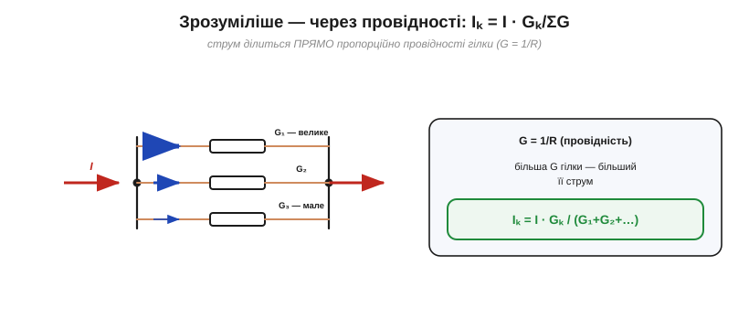
*Рис. 1.4.7.2. Зрозуміліша форма — через провідності G = 1/R: струм ділиться **прямо** пропорційно провідності гілки, Iₖ = I·Gₖ/ΣG. Більша провідність (менший опір) — більший струм. Ця форма одразу узагальнюється на скільки завгодно гілок.*

Якщо перейти від опорів до **провідностей** G = 1/R, формула стає прозорою й без жодних пасток: струм ділиться **прямо** пропорційно провідності гілки. Для будь-якої гілки k:

Iₖ = I · Gₖ / (G₁ + G₂ + …).

Тут жодних «чужих» опорів: більша провідність — більший струм, як і має бути. І ця форма одразу працює для **скількох завгодно** паралельних гілок, а не лише двох. Тому, коли гілок багато, зручніше думати саме провідностями: кожна забирає струм у частці своєї G від загальної суми.

### Приклад

**Приклад. Струм 12 А заходить у паралельні 2 Ω і 4 Ω. Як він розділиться?**

```
I₁ (через 2 Ω) = I·R₂/(R₁+R₂) = 12·4/(2+4) = 12·4/6 = 8 А
I₂ (через 4 Ω) = I·R₁/(R₁+R₂) = 12·2/(2+4) = 12·2/6 = 4 А
Перевірка:      I₁ + I₂ = 8 + 4                        = 12 А  ✓
```

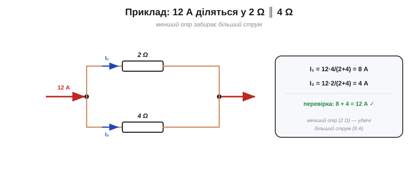
*Рис. 1.4.7.3. 12 А діляться у 2 Ω ∥ 4 Ω: I₁ = 12·4/6 = 8 А, I₂ = 12·2/6 = 4 А. Сума повертає 12 А, а менший опір (2 Ω) забрав удвічі більший струм.*

Менший опір (2 Ω) узяв **8 А**, удвічі більше за 4 Ω, — рівно як підказує оберненість. І знову корисна самоперевірка: сума гілкових струмів **мусить** дорівнювати повному (KCL).

Той самий поділ працює і в більшому масштабі: коли паралельно з'єднують кілька акумуляторів чи блоків живлення **з близькою ЕРС**, навантаження розподіляється між ними приблизно обернено до їхніх внутрішніх опорів — тож «сильніше» (менш опірне) джерело віддає більший струм. (Це спрощена модель: якщо ЕРС помітно різняться, джерела починають «боротися» зрівнювальним струмом, тому промислові блоки живлення для паралельної роботи мають спеціальну схему **розподілу струму**, *current sharing*.) Звідси, до речі, й вимога однаковості джерел із §1.4.5.

### Де це працює: шунт амперметра

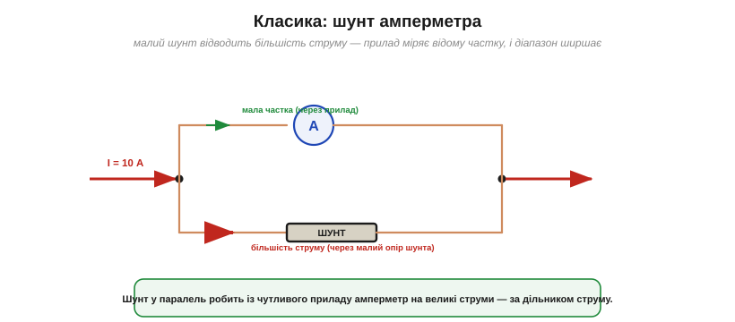
*Рис. 1.4.7.4. Класичне застосування — шунт амперметра. Малоомний шунт у паралель до чутливого приладу відводить більшість струму, а прилад міряє відому невелику частку — так із мікроамперметра роблять амперметр на десятки ампер.*

Найкласичніше застосування дільника струму — **шунт амперметра**. Сам вимірювальний механізм витримує лише крихітний струм (скажімо, міліампери). Щоб виміряти десятки ампер, паралельно до приладу ставлять **малоомний шунт**: за дільником струму він відводить **переважну більшість** струму повз прилад, а той міряє точно відому невелику **частку**. Знаючи цю частку, шкалу градуюють одразу на повний струм. Так само струм навмисне розподіляють між **паралельними** елементами, щоб вони ділили навантаження й тепло (наприклад, кілька резисторів замість одного перегрітого).

До речі, тут варто розвіяти поширений міф. Часто кажуть «струм тече шляхом найменшого опору» — та насправді він тече **всіма** шляхами одразу, просто більша частка йде туди, де опір менший (рівно за нашою формулою). Зовсім не бере струму лише **розірвана** гілка (нескінченний опір); доки на паралельній групі є **ненульова** напруга, у кожну **скінченну** провідну гілку струм таки заходить — хай і малою часткою. (Тонкощі: ідеальне коротке замикання поряд (0 Ω) обнулило б спільну напругу й забрало б увесь струм — тоді й через сусідній резистор потекло б нуль.)

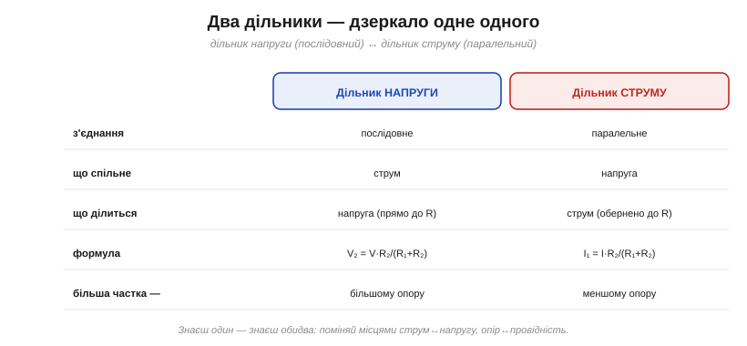
*Рис. 1.4.7.5. Повна двоїстість: дільник напруги (послідовний, спільний струм, ділить напругу прямо до R) і дільник струму (паралельний, спільна напруга, ділить струм обернено до R). Знаючи один, знаєте обидва.*

> 🔧 **Навіщо це.** Дільник струму згадуєте рідше за дільник напруги, але він важливий там, де струм **розгалужується**: шунти амперметрів, паралельні елементи, що ділять навантаження, розуміння, чому струм «тече туди, де легше». Практична порада: щоб не плутатися з «чужим опором» у формулі, рахуйте через **провідності** (Iₖ = I·Gₖ/ΣG) — там усе прямо й без винятків. А загальний образ простий: струм розливається по гілках у частці їхньої провідності, як вода — ширшими руслами.

---

Підсумок §1.4.7: **дільник струму** — паралельне дзеркало дільника напруги: повний струм ділиться між гілками **обернено** до опорів, I₁ = I·R₂/(R₁+R₂) (пастка — «чужий» опір у чисельнику!), або, прозоріше, **прямо** до провідностей, Iₖ = I·Gₖ/ΣG. Працює в шунтах амперметрів і всюди, де струм розгалужують. Тепер ми володіємо всім інструментарієм — обома законами, обома з'єднаннями, обома дільниками — і можемо звести це в **єдиний метод** розрахунку будь-якого кола.

---

## 1.4.8 Як розв'язувати коло: метод і приклади

Час зібрати все докупи. У нас на руках уже є повний набір інструментів; лишилося навчитися **застосовувати їх у системі** — за чітким порядком, що працює для будь-якої схеми. Ця тема — практичний капстоун усього Розділу 1.4.

### Інструментарій: що ми маємо


*Рис. 1.4.8.1. Чотири інструменти Розділу 1.4, що працюють разом: закон Ома (зв'язок V–I на елементі), послідовне/паралельне зведення (R_екв), закон струмів (вузли) і закон напруг (контури). Будь-яке коло розв'язують їхньою комбінацією.*

Згадаймо чотири знаряддя: **закон Ома** (V = I·R на кожному елементі), **зведення** послідовних і паралельних груп (R_екв), **закон струмів** (ΣI = 0 у вузлі) і **закон напруг** (ΣV = 0 у контурі). Уся майстерність — у тому, щоб у правильному порядку пускати їх у хід. Є дві основні стратегії.

### Стратегія 1: згортання

Для більшості повсякденних схем (де елементи складаються в послідовно-паралельні групи) найшвидший шлях — **згортання**.

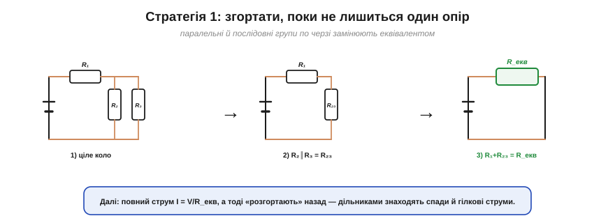
*Рис. 1.4.8.2. Стратегія згортання: паралельні й послідовні групи по черзі замінюють еквівалентом, доки від схеми не лишиться один R_екв. Тоді знаходять повний струм, а далі «розгортають» назад — дільниками шукають спади й гілкові струми.*

Ідея проста: **поетапно спрощуй**. Знайшов паралельну групу — заміни її одним опором (§1.4.5); знайшов послідовну — склади (§1.4.4); і так, доки від цілої схеми не лишиться **один** R_екв. Тоді одним діленням знаходиш повний струм від джерела (I = V/R_екв), а далі рухаєшся **назад**, «розгортаючи» схему: дільником напруги (§1.4.6) знаходиш спади на групах, дільником струму (§1.4.7) — як струм розділився по гілках.

На практиці зручно щоразу **перемальовувати** спрощену схему: побачив пару паралельних резисторів — закреслив, намалював замість них один; знайшов послідовну низку — згорнув у один. І так крок за кроком, аж поки на папері не лишиться джерело та єдиний R_екв. Така «драбинка» спрощень майже не лишає місця для помилки, і нею розв'язується більшість навчальних та побутових задач.

### Приклад згортанням

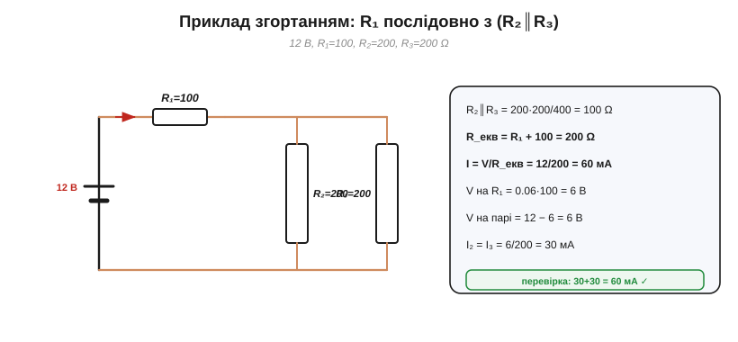
*Рис. 1.4.8.3. Приклад: R₁ послідовно з парою R₂∥R₃. Спершу пара → 100 Ω, тоді R_екв = 200 Ω, повний струм 60 мА; на R₁ спадає 6 В, на парі — теж 6 В, і кожна гілка бере по 30 мА. Перевірка KCL: 30+30 = 60 мА.*

**Приклад 1 (згортанням). V = 12 В; R₁ = 100 Ω послідовно з парою R₂ = 200 Ω ∥ R₃ = 200 Ω.**

```
1. Згортаємо пару:  R₂∥R₃ = 200·200/400         = 100 Ω
2. Послідовно:      R_екв = R₁ + 100 = 100 + 100 = 200 Ω
3. Повний струм:    I = V/R_екв = 12/200         = 60 мА
4. Спад на R₁:      V₁ = I·R₁ = 0.06·100         = 6 В
5. Спад на парі:    V_пара = 12 − 6              = 6 В
6. Гілкові струми:  I₂ = I₃ = 6/200              = 30 мА
   перевірка KCL:   30 + 30                      = 60 мА  ✓
```

Зверніть увагу на хід: **уперед** — спрощуємо до R_екв і знаходимо повний струм; **назад** — розподіляємо напругу й струм по частинах. Цим способом розв'язується величезна частина реальних схем.

Фізично відповідь читається легко: повне коло на 200 Ω при 12 В пропускає 60 мА; половина напруги (6 В) гине на R₁, друга половина — на парі; а оскільки гілки пари однакові, 60 мА діляться між ними **порівну**, по 30 мА. Кожне число має зрозумілий сенс — добра ознака, що розв'язок правильний.

### Стратегія 2: систематичні рівняння

Та не всі кола згортаються. Якщо в схемі **кілька джерел** або «місткове» з'єднання (як-от міст Вітстона), послідовно-паралельне спрощення заходить у глухий кут. Тоді діють **напряму** — так, як замислив Кірхгоф.

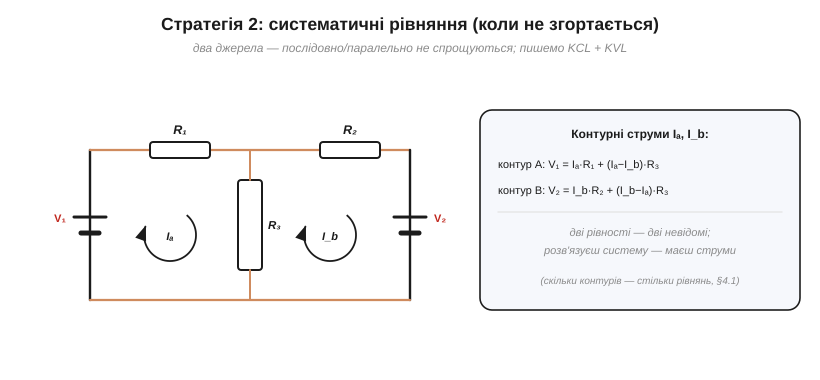
*Рис. 1.4.8.4. Коли коло не зводиться (два джерела, міст тощо), діють напряму: призначають контурні (чи гілкові) струми й пишуть рівняння KVL/KCL. Тут дві рівності контурів дають систему на два невідомі струми.*

Рецепт систематичний і завжди працює: познач невідомі струми (по гілках або по контурах), напиши **по одному рівнянню KCL** на кожен незалежний вузол і **по одному KVL** на кожен незалежний контур, додай V = I·R для резисторів — і дістанеш рівно стільки рівнянь, скільки невідомих. Тонкість «незалежності»: на зв'язній схемі незалежних рівнянь KCL рівно **N − 1** (останній вузол нового не дає), а незалежних KVL — **B − N + 1** (це наші контури з §1.4.1). На практиці зазвичай беруть **один** систематичний метод — вузловий (потенціали вузлів) **або** контурний (контурні струми), — щоб не плодити зайвих залежних рівнянь. Лишається розв'язати систему. Для кола з рисунка це дві контурні рівності:

```
контур A:  V₁ = Iₐ·R₁ + (Iₐ − I_b)·R₃
контур B:  V₂ = I_b·R₂ + (I_b − Iₐ)·R₃
```

Дві рівності, дві невідомі (Iₐ, I_b) — звичайна шкільна система. Спосіб не такий швидкий, як згортання, зате **універсальний**: ним береться будь-яке лінійне коло без винятку.

Є й рідна альтернатива — **метод вузлових напруг**: замість струмів за невідомі беруть **потенціали вузлів** (один вузол оголошують нульовим — «землею»), пишуть KCL у кожному вузлі через ці потенціали й розв'язують систему. Багатьом він зручніший, надто коли вузлів небагато. Контурний і вузловий методи дають ту саму відповідь — це лише два способи систематично застосувати ті самі закони Кірхгофа.

### Рецепт і самоперевірки


*Рис. 1.4.8.5. Рецепт: 1) спрости, 2) повний струм, 3) розгорни назад дільниками; 4) якщо не згортається — система рівнянь. І завжди три самоперевірки: одиниці, KCL/KVL, порядок величин.*

Зведімо порядок дій: **(1)** спрости послідовні й паралельні групи; **(2)** знайди повний струм I = V/R_екв; **(3)** розгорни назад — дільниками знайди спади й гілкові струми; **(4)** якщо коло не згортається, переходь до системи рівнянь KCL+KVL+Ом. І наприкінці — три обов'язкові **самоперевірки**.

> 🔧 **Навіщо це.** Звичка перевіряти себе економить години. Три перевірки на кожен розрахунок: **одиниці** (вольти з вольтами, ампери з амперами — чи не загубився множник?); **закони Кірхгофа** (сума гілкових струмів = повному, сума спадів = напрузі джерела — мусять сходитися!); **порядок величин** (чи розумна відповідь — міліампери, а не кілоампери?). Якщо щось не сходиться — шукайте помилку, не йдіть далі. До речі, симулятори кіл (як-от SPICE) усередині роблять рівно те саме, що ми тут вручну: складають рівняння Кірхгофа й розв'язують систему. Опанувавши метод, ви розумієте, **що** саме рахує машина — і чому їй можна (чи не можна) вірити.

---

## Підсумок Розділу 1.4

Ми пройшли шлях від одного резистора (Розділ 1.3) до **будь-якої мережі**:

- **Мова кіл** (§1.4.1) — вузли, гілки, контури; топологія, а не «географія»; L = B − N + 1.
- Два закони Кірхгофа: **струмів** (§1.4.2, збереження заряду) і **напруг** (§1.4.3, збереження енергії).
- Два з'єднання: **послідовне** (§1.4.4, опори додаються) і **паралельне** (§1.4.5, провідності додаються) — повні дзеркала одне одного.
- Два помічники: **дільник напруги** (§1.4.6) і **дільник струму** (§1.4.7).
- І **метод** (§1.4.8), що зводить усе це в систематичний розрахунок будь-якого кола.

За лаштунками стояли двоє: **Кірхгоф**, що дав закони (а вони — це збереження заряду й енергії), та **Ейлер**, чия теорія графів подарувала саму мову вузлів і гілок — обом присвячено [історію розділу](ch04-history-kirchhoff.md) та [вставку про мости](ch04-s1-history-euler-graphs.md).

### Що далі

Дотепер наші джерела були **ідеальні**: батарея на 12 В завжди давала рівно 12 В. Та реальне джерело «просідає» під навантаженням — у нього є **внутрішній опір** (ми вже натякали на це в §1.4.4 і §1.4.6). Як описати будь-яке складне коло простою парою «джерело + опір»? Відповідь дають **еквіваленти Тевеніна й Нортона** — могутній спосіб згорнути цілу мережу до одного джерела з одним опором. З них і почнеться **Розділ 1.5**.

> ▶️ Далі — **Розділ 1.5. Еквівалентні схеми: Тевенін, Нортон, суперпозиція**: реальне джерело й внутрішній опір, принцип суперпозиції, теореми Тевеніна й Нортона, узгодження навантаження.
