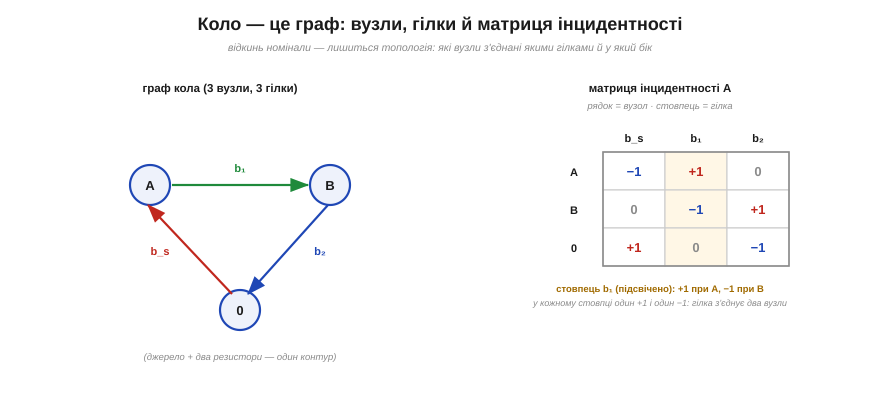
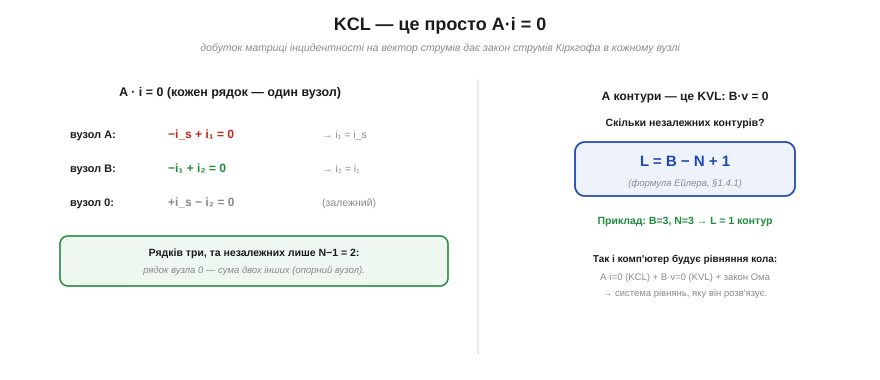

# 🧮 Графи: вершини, ребра й матриці інцидентності

> Числова вставка до теми [§1.4.1 «Вузли, гілки, контури — мова кіл»](ch04-kirchhoff-circuit-analysis.md). §1.4.1 показав, що коло — це топологія: вузли, гілки й контури, а не «географія» рисунка. Тут ми дамо цій мові **строгу математичну форму** — теорію **графів** — і побачимо, що закони Кірхгофа в ній записуються однією матрицею. Саме так коло «бачить» комп'ютер.

### Коло без номіналів — це граф

Відкиньмо від схеми всі номінали — скільки ом, вольтів, фарад — і лишімо тільки **з'єднання**. Те, що залишиться, математики звуть **графом**: набір **вершин** (*vertices*), сполучених **ребрами** (*edges*). Це рівно наші **вузли** й **гілки** з §1.4.1 — та сама річ, лише іншими словами. Граф несе **топологію** кола: що з чим з'єднано, незалежно від того, *які* саме деталі стоять у гілках. Це та сама абстракція, з якої Ейлер почав теорію графів, розв'язуючи задачу про кенігсберзькі мости (історія §1.4.1).

Кожній гілці задамо **напрям** (стрілку) — дістанемо **орієнтований** граф. Напрям — це просто умовний додатний бік для струму гілки; виберемо його довільно, а від'ємна відповідь потім скаже, що струм тече навпаки.

### Матриця інцидентності A

Усю топологію орієнтованого графа можна вкласти в одну таблицю — **матрицю інцидентності** A. Її рядки — вузли, стовпці — гілки, а на перетині стоїть:

```
a(i,j) = +1, якщо гілка j ВИХОДИТЬ із вузла i,
         −1, якщо гілка j ВХОДИТЬ у вузол i,
          0, якщо гілка j не торкається вузла i.
```


*Рис. 1.4.1m.1. Просте коло (джерело + два резистори) як орієнтований граф із трьох вузлів (A, B, опорний 0) і трьох гілок (b_s, b₁, b₂). Праворуч — його матриця інцидентності A: рядок на кожен вузол, стовпець на кожну гілку. У кожному стовпці рівно один +1 і один −1 — бо гілка завжди з'єднує два вузли: з одного виходить, в інший входить.*

Ключова прикмета: **кожен стовпець** має рівно один +1 і один −1, а решта — нулі. Це не випадковість, а сама суть: гілка має два кінці, з одного вузла вона виходить, в інший входить. Звідси випливає й те, що **сума всіх рядків** дорівнює нулю (кожен +1 десь має пару −1).

### KCL — це просто A·i = 0

А тепер найкрасивіше. Складемо вектор струмів усіх гілок **i** = (i_s, i₁, i₂, …) і помножмо на нього матрицю A. Що дасть кожен **рядок** добутку? Суму струмів, що **виходять** із відповідного вузла (зі знаками з матриці) — а це і є **закон струмів Кірхгофа** (§1.4.2)! Тобто весь KCL для цілого кола вкладається в одне матричне рівняння:

```
A · i = 0.
```


*Рис. 1.4.1m.2. Рівняння A·i = 0 розгортається в по одному рівнянню KCL на кожен вузол. Рядків стільки, скільки вузлів, але незалежних серед них лише N−1: рядок опорного вузла є сумою решти. Подвійним чином контури дають KVL (B·v = 0), а їхня кількість — це формула Ейлера L = B − N + 1 із §1.4.1.*

Рядків у цьому рівнянні стільки, скільки вузлів, — та вони **не всі незалежні**. Оскільки рядки A в сумі дають нуль, один із них завжди є комбінацією інших. Тому викидають рядок одного вузла, оголосивши його **опорним** (землею, вузол 0), і дістають **скорочену** матрицю інцидентності рангу **N−1**. Ось звідки бралося правило з §1.4.1 і §1.4.8: незалежних рівнянь KCL рівно **N−1**, а один вузол беруть за опорний.

### Контури, KVL і формула Ейлера

Подвійним чином улаштовані й контури. **Контурна матриця** B (рядок на кожен незалежний контур, стовпець на гілку) каже, які гілки в який контур входять і з яким знаком. Тоді **закон напруг Кірхгофа** (§1.4.3) теж стає одним рівнянням:

```
B · v = 0       (сума спадів уздовж кожного контуру — нуль).
```

А скільки тих незалежних контурів? Рівно стільки, скільки гілок лишилося «зайвими» після того, як N−1 гілок утворили кістяк дерева без петель: **L = B − N + 1**. Це та сама формула Ейлера, яку §1.4.1 дав без виведення, — тут вона є просто рангом контурної матриці. (Є й зовсім елегантний місток між двома світами: простори KCL і KVL **взаємно ортогональні**, A·Bᵀ = 0, — на цьому стоїть теорема Теллегена, але це вже інша розмова.)

### Де це працює

Уся ця матрична машинерія — не прикраса, а те, як коло розв'язує **комп'ютер**. Зі списку з'єднань (*netlist*) програма автоматично будує матрицю інцидентності, виписує A·i = 0 (KCL), B·v = 0 (KVL) і закони гілок (Ом для резисторів) — і розв'язує цю систему лінійних рівнянь. Тобто робить рівно те, що ми в §1.4.8 робили руками, тільки тисячами рівнянь нараз. Граф — це місток від **рисунка** схеми до **матриці**, яку машина вміє розв'язати; опанувавши його, ви розумієте не лише «що» рахує симулятор, а й «як».
