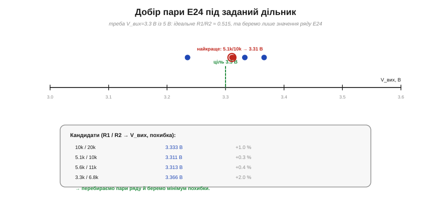
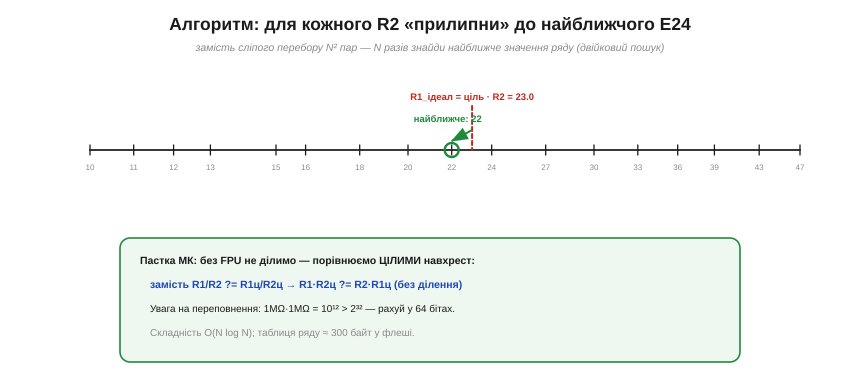

# ⚙️ Добір пари зі стандартного ряду: перебір E24 під задане співвідношення

> Алгоритмічна вставка до теми [§1.4.6 «Дільник напруги»](ch04-kirchhoff-circuit-analysis.md). Формула дільника каже, яке **відношення** опорів потрібне. Та довільних номіналів не існує — лише ряди **E** (E24: 24 значення на декаду, §1.3.7). Як автоматично знайти **пару** реальних резисторів, що дає потрібну напругу найточніше? Це маленька, але повчальна задача пошуку.

### Задача

Хай треба дістати V_вих = 3.3 В із 5 В. З формули §1.4.6: R₂/(R₁+R₂) = 3.3/5 = 0.66, звідки ідеальне відношення R₁/R₂ = (1−0.66)/0.66 ≈ **0.515**. Біда в тому, що резистора «5.15 кΩ» у продажу нема. Є лише сітка значень ряду E24, повторена по декадах (10, 11, 12, 13, 15… ×10ⁿ). Завдання: серед усіх пар (R₁, R₂) із цієї сітки знайти ту, чиє **фактичне** відношення найближче до 0.515.

### Ідея: перебір сітки


*Рис. 1.4.6a.1. Кожна пара E24 дає свою V_вих; відкладемо кандидатів на осі біля цілі 3.3 В. Пара 5.1k/10k дає 3.31 В (похибка +0.3 %) — найближче. Перебравши пари ряду й узявши мінімум похибки, знаходимо найкращу.*

Найпростіше — **повний перебір**: спробувати кожну пару (R₁, R₂), порахувати її відношення й лишити ту, де похибка найменша. Якщо в таблиці N значень (для 10 Ω…1 МΩ це ~120–150), пар буде N² ≈ 20 000 — мить для будь-якого комп'ютера, і навіть на МК це мікросекунди.

Та є й **розумніший** шлях, що відкидає квадрат. Відношення залежить лише від R₁/R₂, тож переберімо **тільки R₂**, а для кожного порахуймо **ідеальне** R₁ = (ціль)·R₂ і «прилипнімо» до **найближчого** значення E24 — його знаходять двійковим пошуком у відсортованій таблиці ряду.


*Рис. 1.4.6a.2. Розумний варіант: для обраного R2 ідеальне R1 = ціль·R2 = 23.0 «прилипає» до найближчого значення ряду (22). Унизу — цілочисловий трюк для МК без FPU: порівнюємо відношення навхрест, без ділення, пильнуючи переповнення.*

### Псевдокод

```
ціль  ← бажане R1/R2            # = (1−k)/k з потрібного виходу
E     ← усі значення E24 по декадах (відсортовані)
best  ← none;  best_err ← ∞
для кожного R2 у E:
    R1_ідеал ← ціль · R2
    R1 ← найближче до R1_ідеал у E   # двійковий пошук
    err ← |R1·1 − ціль·R2| / (ціль·R2)   # відносна похибка (без ділення R1/R2)
    якщо err < best_err:
        best_err ← err;  best ← (R1, R2)
повернути best, best_err
```

Кожна ітерація — це O(log N) на двійковий пошук, разом **O(N log N)**: для N~150 це сотні операцій, миттєво навіть на восьмибітному МК.

### Складність і пастки на МК

- **Складність.** O(N log N) у розумному варіанті (чи O(N²) у наївному — теж дрібниця). Пам'ять: таблиця ряду ~150 значень × 2 байти ≈ **300 байт** у флеші.
- **Без плаваючої коми.** Багато дешевих МК не мають FPU, тож ділення R₁/R₂ повільне чи недоступне. Порівнюй відношення **навхрест цілими**: замість `R₁/R₂ ?= R₁ц/R₂ц` рахуй `R₁·R₂ц` проти `R₂·R₁ц` — без жодного ділення.
- **Переповнення.** Опори сягають мегаомів, а добуток 10⁶·10⁶ = 10¹² **не влазить** у 32 біти (макс ≈ 4·10⁹). Рахуй проміжки в **64 бітах** або масштабуй значення.
- **Бюджет струму й тепла.** Сам пошук мусить рахуватися з повним опором R₁+R₂: замалий — марний струм і тепло I²R (§1.3.6), завеликий — просідання під навантаженням і шум (§1.4.6). Обмеж пошук **вікном** допустимих сум.
- **Точність під допуск.** Немає сенсу ганятися за 0.01 % відношення, якщо резистори ±5 % (§1.4.6m): узгодь точність пошуку з допуском, а для справді точного — згадай трюк **узгодженої пари**.

Отак банальний «підбери два резистори» виявляється повноцінною задачею пошуку — з вибором алгоритму, цілочисловою арифметикою й оглядкою на фізичні межі. Саме такі дрібні оптимізації й відрізняють робочу прошивку від «теоретично правильної».
