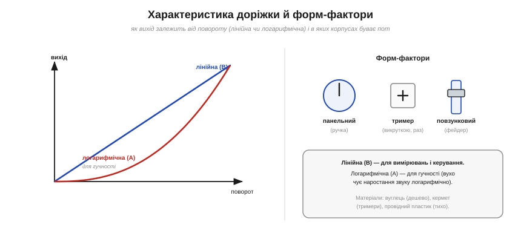

# 🔌 Потенціометр і тример: дільник, який можна крутити

> Компонентна вставка до теми [§1.4.6 «Дільник напруги»](ch04-kirchhoff-circuit-analysis.md). §1.4.6 показав **принцип** потенціометра — дільник із рухомим відводом. Тут — практичний бік: які в нього виводи, у яких **режимах** і **корпусах** він буває, що таке **характеристика доріжки** й де чигають граблі.

### Три виводи й два режими

*Рис. 1.4.6c.1. Усередині — доріжка опору з повним опором R між кінцями 1 і 3 та рухомий повзунок 2. Ліворуч: режим дільника (всі три виводи — кінці на V і GND, повзунок дає V_вих). Праворуч: режим реостата (повзунок зведено з одним кінцем — виходить просто змінний опір).*

Головне, що варто засвоїти, — у потенціометра **три** виводи: два кінці суцільної доріжки опору (між ними завжди повний опір R) і **повзунок** — рухомий відвід, що ковзає по доріжці. Звідси два режими:

- **Дільник (потенціометр).** Задіяні **всі три** виводи: кінці доріжки — на живлення й землю, повзунок — вихід. Це й є регульований дільник напруги з §1.4.6: крутиш ручку — плавно змінюєш V_вих від 0 до V.
- **Реостат (змінний опір).** Задіяні лише **два** виводи — повзунок і один кінець. Виходить не дільник, а просто **регульований опір**. Зайвий кінець варто **звести з повзунком** (пунктир на рисунку): тоді, якщо повзунок на мить втратить контакт, опір не «вистрибне» в нескінченність.

### Характеристика доріжки й корпуси

*Рис. 1.4.6c.2. Ліворуч: характеристика доріжки — лінійна (B), де вихід прямо пропорційний повороту, і логарифмічна (A) для гучності. Праворуч: форм-фактори — панельний пот із ручкою, дрібний тример під викрутку та повзунковий фейдер.*

Доріжки бувають із різною **характеристикою** (*taper*):

- **Лінійна** (маркування **B**): вихід прямо пропорційний повороту. Для більшості задач вимірювання й керування.
- **Логарифмічна** (**A**, «audio»): вихід наростає за логарифмічною кривою — її беруть для **гучності**, бо вухо сприймає гучність логарифмічно, і так регулятор відчувається рівномірним.

Корпуси теж різні: **панельний** пот із ручкою на передню панель (гучність, яскравість) — поворотний чи повзунковий (**фейдер**); і дрібний **тример** (*trimmer*, *preset*) на плату, який налаштовують **раз** викруткою при калібруванні й більше не чіпають. Матеріал доріжки впливає на якість: дешевий **вуглець**, стабільний **кермет** (у тримерах), тихий **провідний пластик**, точний **дротяний** (щаблями). Окремий клас — **цифровий потенціометр** (digipot): мікросхема, якою керує мікроконтролер замість руки.

### Типові граблі

- **Шум повзунка.** Зношена або забруднена доріжка дає «тріскучий», стрибучий вихід — біда для звуку (хрипи в гучності) і для зчитування АЦП. Якісні доріжки (провідний пластик) тихіші.
- **Не навантажуй повзунок.** Як і будь-який дільник (§1.4.6), пот тримає характеристику, лише поки до повзунка приєднано **високоомне** навантаження; «важке» навантаження викривлює криву.
- **Потужність у режимі реостата.** Тут крізь доріжку тече робочий струм, гріючи її (I²R, §1.3.6), — не перевищуй допустиму потужність, надто на малому опорі.
- **Механічне зношення.** Панельні поти живуть обмежене число обертів; тример — не для частого регулювання. Для довговічного щоденного крутіння беруть якісні поворотні енкодери чи digipot.

Тож скромний «дільник, який можна крутити» виявляється цілим сімейством: від ручки гучності до калібрувального тримера й цифрового пота під керуванням МК — але в основі завжди та сама трійця «доріжка + повзунок» із §1.4.6.
