# Розділ 1.5 — Еквівалентні схеми: Тевенін, Нортон, суперпозиція

У Розділі 1.4 ми навчилися розраховувати будь-яку мережу. Цей розділ вчить дивитися на коло **інакше** — не зсередини, а **з клем**: як цілий складний блок поводиться там, де ми приєднуємо навантаження. Виявляється, будь-яке лінійне коло з двох клем можна замінити **одним джерелом і одним опором** — еквівалентом Тевеніна (чи Нортона). Почнемо з найприземленішого прикладу такого еквівалента — **реального джерела з внутрішнім опором**, а далі піднімемося до самих теорем і до питання, коли від джерела можна взяти найбільшу потужність.

> 📜 **Перед матеріалом — історія:** [Тевенін і Нортон: як цілу мережу замінити одним джерелом](ch05-history-thevenin-norton.md) — звідки взялася ідея «чорної скриньки» й чому реальна батарея є її втіленням.

---

## 1.5.1 Реальне джерело: внутрішній опір

Досі наші джерела були **ідеальні**: батарея на 12 В давала рівно 12 В, хоч би скільки струму ми з неї брали. Це зручна вигадка для початку, але реальність інша — і ця тема про те, чим реальне джерело відрізняється від ідеального та як це порахувати.

### Ідеальне vs реальне джерело

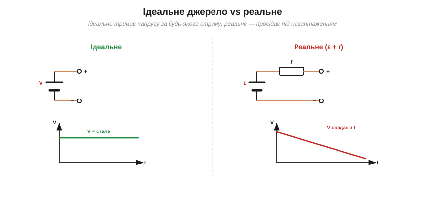
*Рис. 1.5.1.1. Ідеальне джерело тримає сталу напругу за будь-якого струму (горизонтальна характеристика); реальне має внутрішній опір r, тож його напруга на клемах **спадає** зі струмом (похила характеристика).*

**Ідеальне** джерело напруги за визначенням тримає на клемах **сталу** напругу — хоч мікроампер бери, хоч сотні ампер. Його вольт-амперна характеристика — рівна горизонтальна лінія. Та жодне реальне джерело так не вміє: спробуйте взяти з батарейки великий струм — і напруга на ній **просяде**. Причина в тому, що всередині, крім «ідеальної» частини, завжди є **внутрішній опір**.

### Модель: V = ε − I·r

Реальне джерело моделюють напрочуд просто (і це, як ми знаємо з історії розділу, є його еквівалент Тевеніна): **ідеальна ЕРС** ε **послідовно** з **внутрішнім опором** r.

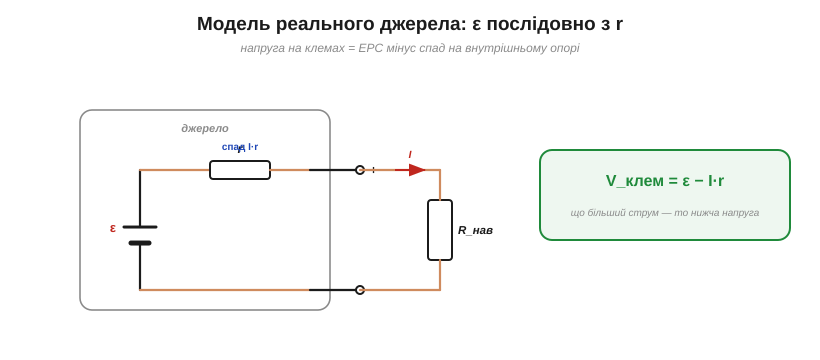
*Рис. 1.5.1.2. Модель реального джерела: ідеальна ЕРС ε послідовно з внутрішнім опором r. Частина напруги гине на r (спад I·r), тож на клемах лишається V = ε − I·r — і що більший струм, то нижча напруга.*

**ЕРС** (електрорушійна сила, ε) — це «справжня» напруга джерела, яку воно дало б за відсутності струму. Та щойно потече струм I, на внутрішньому опорі r виникає власний спад I·r (за законом Ома), і на клемах лишається **менше**:

V_клем = ε − I·r.

Ось і весь секрет «просідання». За холостого ходу (I = 0) на клемах рівно ε. Але під навантаженням частина напруги неминуче губиться **всередині** джерела на його r — і тим більша, чим більший струм. Що менший r, то «міцніше» джерело: то менше воно просідає під навантаженням.

Зверніть увагу на різницю двох напруг. **ЕРС** ε — це внутрішня, «справжня» напруга джерела; **напруга на клемах** V — те, що дістається навантаженню. Збігаються вони лише на холостому ході, а під струмом клемна завжди менша. Тому, до речі, паспортні «1.5 В» батарейки — це, по суті, її ЕРС (а точніше — **номінальна** напруга, близька до ЕРС свіжого елемента, але не гарантовано точна для кожного); під реальним навантаженням ви побачите трохи менше.

### Вольт-амперна характеристика

Формула V = ε − I·r — це рівняння **прямої**, і її варто побачити графічно: вона багато пояснює.

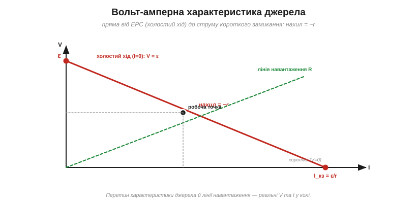
*Рис. 1.5.1.3. Характеристика джерела — пряма: від ε при I=0 (холостий хід) до струму короткого замикання I_кз = ε/r при V=0, з нахилом −r. Перетин із лінією навантаження R дає реальні робочі V та I.*

Пряма починається у точці (I = 0, V = ε) — **холостий хід** — і спадає з нахилом **−r**. Там, де вона сягає нуля напруги (V = 0), струм досягає максимуму — це **струм короткого замикання** I_кз = ε/r. Більше за нього **в межах цієї простої лінійної моделі** джерело дати не може: навіть замкнувши клеми навпрямки, вас обмежує власний r джерела. (У реальності r ще й сам залежить від струму, температури та стану заряду, а блоки живлення мають захист від надструму — тож точне I_кз складніше; але як **орієнтир** ε/r працює добре.) А реальну робочу точку дає **перетин** характеристики джерела з лінією навантаження (V = I·R): саме там одночасно справджуються і «закон джерела», і закон Ома навантаження.

Звідси корисна мова. Джерело з малим r дає майже **горизонтальну** (пологу) характеристику — його звуть «жорстким» (*stiff*): напруга майже не залежить від струму. Велике r дає круто похилу, «м'яку» характеристику. Лабораторний блок живлення прагнуть зробити якомога **жорсткішим**; навпаки, у зарядних пристроях інколи навмисне додають опір, щоб **обмежити** струм.

### Як виміряти r

Внутрішній опір легко визначити **двома вимірами** — без розкручування джерела.

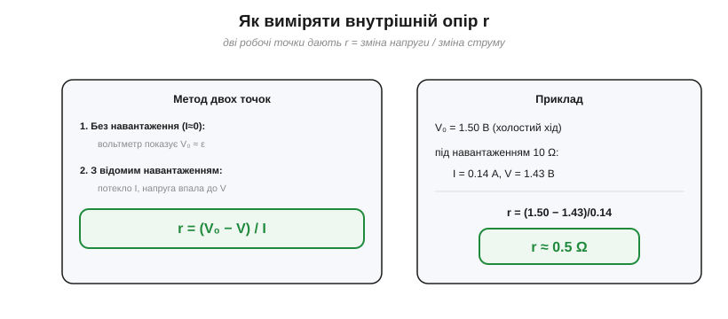
*Рис. 1.5.1.4. Внутрішній опір легко виміряти за двома точками: напруга холостого ходу V₀ ≈ ε, потім під відомим навантаженням напруга падає до V при струмі I; звідси r = (V₀ − V)/I.*

**Приклад. Батарейка показує 1.50 В без навантаження, а під резистором 10 Ω — лише 1.43 В. Який її внутрішній опір?**

```
Струм під навантаженням:  I = V/R = 1.43/10                = 0.143 А
Просідання напруги:       ΔV = V₀ − V = 1.50 − 1.43         = 0.07 В
Внутрішній опір:          r = ΔV/I = 0.07/0.143             ≈ 0.5 Ω
```

Логіка проста: усе просідання ΔV впало на внутрішньому опорі при струмі I, тож r = ΔV/I. Виміряли напругу холостого ходу (це майже ε), тоді під відомим навантаженням — нову напругу й струм, і поділили. Так перевіряють «здоров'я» батарейки: у старій r виростає, і просідання стає величезним.

### Не лише батареї

Внутрішній (його ще звуть **вихідним**) опір має **кожне** реальне джерело, не лише батарея. Лабораторний блок живлення, генератор сигналів, вихід логічної мікросхеми, навіть антена — усі вони у простій **DC-моделі** поводяться як «ЕРС + опір» і просідають під навантаженням. (Загальніше це звуть **вихідним імпедансом**: на змінному струмі він буває комплексним і залежить від частоти — про це в Модулі 2; тут досить «вихідного опору».) Ми вже зустрічали це в §1.4.6: «вихідний опір» подільника напруги (R₁∥R₂) — то рівно той самий внутрішній опір, через який подільник не годен живити серйозне навантаження. Тож скрізь, де щось віддає напругу чи струм, варто питати: а який у нього **вихідний опір** — чи витримає він мій струм без просідання?

### Внутрішній опір у житті

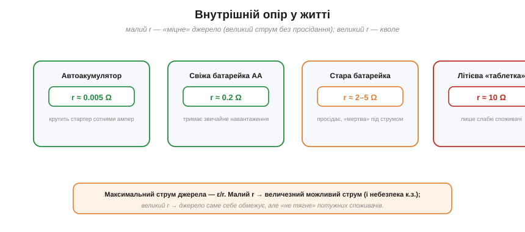
*Рис. 1.5.1.5. Внутрішній опір визначає «міцність» джерела: автоакумулятор (міліоми) крутить стартер сотнями ампер; стара батарейка (омами) просідає під найменшим навантаженням. Максимальний струм (у простій моделі) — ε/r.*

Внутрішній опір пояснює багато буденного. **Автомобільний акумулятор** має крихітний r (міліоми) — тому й здатний віддати стартеру сотні ампер; та навіть у нього фари тьмяніють під час пуску (величезний струм × малий r = помітне просідання). **Свіжа батарейка** має r у частки ома й тримає звичайне навантаження, а **стара** — кілька омів, тому «під навантаженням мертва», хоч вольтметр на холостому ході бреше, що вона ще жива. **Літієва «таблетка»** має десятки омів — годиться лише для слабких споживачів (годинник, пам'ять), а мотор від неї не запустиш. На холоді r батарей зростає — звідси й телефон, що раптом гасне «на 30 %» у мороз.

> 🔧 **Навіщо це.** Внутрішній опір — це причина, чому **джерело не всемогутнє**. Звідси кілька практичних правил. Обираючи живлення, дивіться не лише на напругу, а й на здатність віддати **струм** без просідання (малий внутрішній/вихідний опір). Пам'ятайте про межу (у простій моделі «ε + r»): орієнтовний максимальний струм джерела — це ε/r, і близько до нього тече струм короткого замикання (тому к.з. потужного джерела таке небезпечне; реальні ж потужні блоки мають ще й захист від надструму, а r у них не сталий). А «дивні» явища — просідання під навантаженням, тьмяні фари при пуску, «мертва» під струмом батарейка — це все один і той самий внутрішній опір. І, як ми знаємо з історії, ця модель «ε + r» — то просто **еквівалент Тевеніна** реального джерела.

---

Підсумок §1.5.1: реальне джерело — це **ідеальна ЕРС ε плюс внутрішній опір r** (його еквівалент Тевеніна). Напруга на клемах **просідає** під навантаженням: V = ε − I·r. Характеристика — пряма від ε (холостий хід) до I_кз = ε/r (коротке замикання) з нахилом −r; робочу точку дає перетин із лінією навантаження. Внутрішній опір легко виміряти як r = (V₀ − V)/I, і саме він визначає, скільки струму джерело віддасть без просідання. Тепер навчимося рахувати кола з **кількома** джерелами — за принципом суперпозиції.

---

## 1.5.2 Принцип суперпозиції в колах

Коли в колі **одне** джерело, розрахунок ми вже знаємо (Розділ 1.4). А коли їх **кілька** — два джерела живлення, давач плюс зміщення, сигнал поверх постійної напруги? Прямий розрахунок ускладнюється. Тут рятує **принцип суперпозиції** — елегантний спосіб розбити складну задачу на кілька простих.

### Що каже принцип

Принцип суперпозиції стверджує: у **лінійному** колі відгук (струм у гілці чи напруга на елементі) від **кількох** джерел дорівнює **сумі** відгуків від кожного джерела **окремо**.

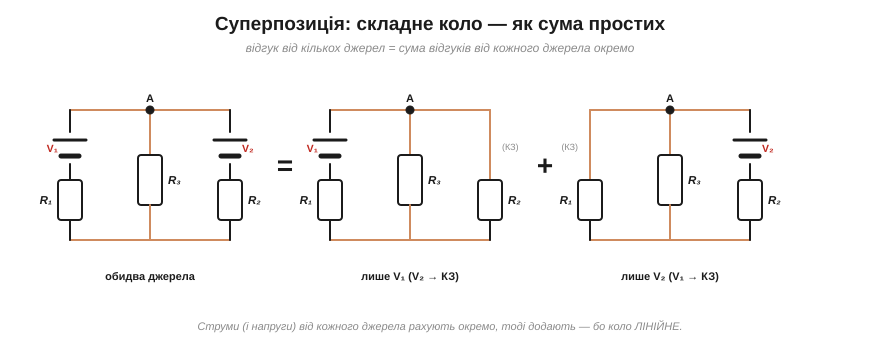
*Рис. 1.5.2.1. Принцип суперпозиції: відгук кола з кількома джерелами дорівнює сумі відгуків від кожного джерела окремо. Розв'язуємо коло з самим лише V₁ (вимкнувши V₂), потім із самим V₂, і додаємо результати. Працює, бо коло **лінійне**.*

Іншими словами: замість боротися з усіма джерелами одночасно, ми **по черзі** лишаємо тільки одне, рахуємо просте коло, а потім **складаємо** всі часткові результати. Чому так можна? Через **лінійність**: закон Ома (V = I·R), закони Кірхгофа — усі рівняння кола лінійні, а для лінійних систем відгук на суму впливів дорівнює сумі відгуків. Це той самий принцип, що й у хвиль: дві хвилі накладаються, не заважаючи одна одній.

Звідси й практична сила методу: він дозволяє спитати, **скільки саме** дає окреме джерело. Наприклад, який внесок робить джерело завад у корисний сигнал, або скільки струму в спільну гілку додає кожна з двох батарей. Відповідь — це просто відгук від цього одного джерела, порахований при вимкнених решті.

### Як «вимкнути» джерело

Ключовий технічний момент: що означає «лишити тільки одне **незалежне** джерело»? Решту незалежних джерел треба **вимкнути** — але не прибрати геть, а замінити на їхній **нульовий стан**. (Ідеться саме про **незалежні** джерела; **керовані** (залежні), що з'являться в Модулі 2 з транзисторами, не вимикають — вони лишаються активними.)

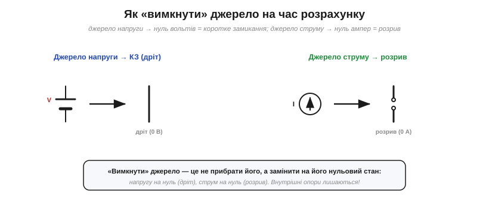
*Рис. 1.5.2.2. «Вимкнути» джерело означає замінити його на нульовий стан: джерело напруги — на коротке замикання (0 В = дріт), джерело струму — на розрив (0 А). Внутрішні опори джерел при цьому **лишаються** на місці.*

Правило просте й логічне. **Джерело напруги** вимикають, прирівнюючи його напругу до нуля, — а нуль вольтів між двома точками це **дріт** (коротке замикання). **Джерело струму** вимикають, прирівнюючи струм до нуля, — а нульовий струм це **розрив** кола. Важлива тонкість: «вимикаємо» лише **ідеальну** частину джерела; його **внутрішній опір** (§1.5.1) лишається на місці й бере участь у розрахунку.

Це не дрібниця: реальна батарея навіть «вимкнена» лишає в колі свій внутрішній опір r, і він впливає на те, як розподіляється струм від інших джерел. Сплутати «вимкнути джерело» з «викинути його разом з опором» — поширена й підступна помилка.

### Приклад по кроках

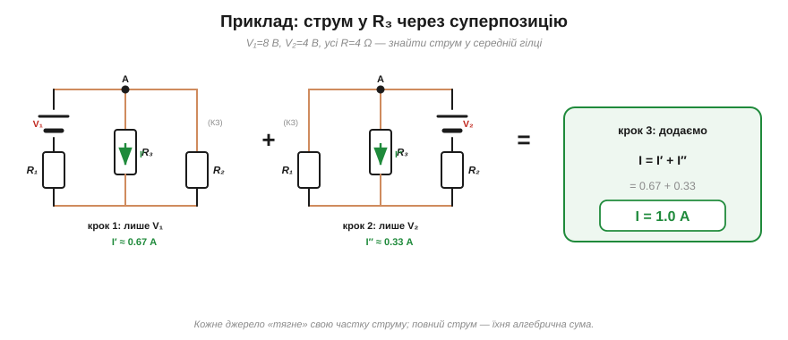
*Рис. 1.5.2.3. Приклад (V₁=8 В, V₂=4 В, усі R=4 Ω): струм у R₃ від самого V₁ — близько 0.67 А, від самого V₂ — близько 0.33 А; повний струм I = 0.67 + 0.33 = 1.0 А.*

**Приклад. V₁ = 8 В і V₂ = 4 В живлять спільний вузол A, кожне через свій резистор 4 Ω; від A до землі ввімкнено R₃ = 4 Ω. Який струм тече в R₃?**

```
Крок 1 — лише V₁ (V₂ → КЗ):  R₂∥R₃ = 4∥4 = 2 Ω;  плюс R₁ = 6 Ω
                            I = 8/6 ≈ 1.33 А;  V_A = 1.33·2 ≈ 2.67 В
                            I′ = V_A/R₃ = 2.67/4              ≈ 0.67 А
Крок 2 — лише V₂ (V₁ → КЗ):  R₁∥R₃ = 4∥4 = 2 Ω;  плюс R₂ = 6 Ω
                            I = 4/6 ≈ 0.67 А;  V_A = 0.67·2 ≈ 1.33 В
                            I″ = V_A/R₃ = 1.33/4             ≈ 0.33 А
Крок 3 — сума:              I = I′ + I″ = 0.67 + 0.33         = 1.0 А
```

Кожне джерело «тягне» свою частку струму крізь R₃; повний струм — їхня **алгебрична** сума (якби джерела гнали струм у протилежні боки, частки б віднімались). Зверніть увагу: на кожному кроці ми розв'язуємо **просте** одноджерельне коло методом згортання з §1.4.8 — суперпозиція звела складну задачу до двох знайомих.

Перевірити себе можна так само, як у Розділі 1.4: знайшовши всі струми, переконайтеся, що в кожному вузлі сходиться KCL, а в кожному контурі — KVL. Якщо часткові відгуки правильні, то й повна, складена картина зійдеться без нев'язок.

### Потужність не додається

А тепер — найважливіше застереження, через яке студенти втрачають бали. Струми й напруги суперпонуються, а **потужність — ні**.

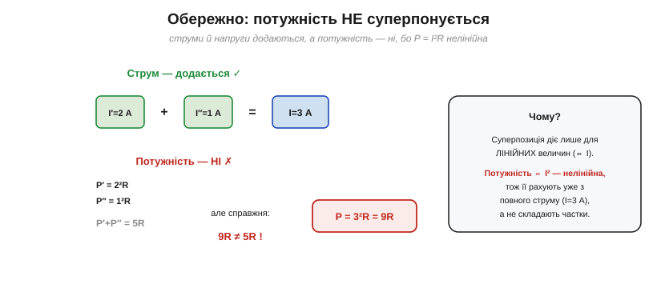
*Рис. 1.5.2.4. Пастка: струми й напруги додаються, а **потужність — ні**. Бо P ∝ I² — нелінійна. Потужність рахують з ПОВНОГО струму (тут I=3 А → 9R), а не складають частки (2²R + 1²R = 5R ≠ 9R).*

Причина — в нелінійності. Суперпозиція діє лише для величин, **пропорційних** джерелам (струм, напруга — лінійні). А потужність P = I²R залежить від **квадрата** струму (§1.3.5), тож вона нелінійна й **не суперпонується**. Наочно: якщо частки струму 2 А і 1 А, повний струм 3 А, і потужність P = 3²R = 9R. Але сума часткових потужностей 2²R + 1²R = 5R — зовсім інше число! Правило тверде: потужність рахують **уже з повного** струму (чи напруги), а не складають із часток.

### Рецепт і межі


*Рис. 1.5.2.5. Рецепт у чотири кроки — і три застереження: працює лише для лінійних кіл, потужність не суперпонується, а внутрішні опори джерел лишаються. Зате будь-яке число джерел стає посильним.*

Зведімо в рецепт: **(1)** лиши одне джерело, решту вимкни (напругу — в КЗ, струм — у розрив); **(2)** розв'яжи це просте коло; **(3)** повтори для кожного джерела; **(4)** додай часткові відгуки. І тримай у голові межі: метод працює **тільки для лінійних** кіл (резистори, ідеальні джерела — без діодів і транзисторів), потужність ним не рахують, внутрішні опори джерел лишаються, а **залежні** джерела (Модуль 2) не вимикають.

> 🔧 **Навіщо це.** Суперпозиція — це передусім **спосіб мислення**: будь-яке число джерел стає посильним, бо ми завжди маємо справу лише з **одним** за раз. Особливо це засяє в Модулі 2, коли в колі співіснують **постійна** напруга зміщення й **змінний** сигнал: суперпозиція дозволяє рахувати їх **окремо** («що робить живлення» і «що робить сигнал»), а потім скласти — наріжний прийом усієї аналогової електроніки. А ще суперпозиція — фундамент, на якому стоять теореми Тевеніна й Нортона з наступних тем. Тільки не забувайте про дві пастки: метод **лінійний** (нелінійні деталі ламають його), і потужність ним **не** складають.

---

Підсумок §1.5.2: **принцип суперпозиції** — у лінійному колі відгук від кількох джерел дорівнює сумі відгуків від кожного окремо. Джерела вимикають по черзі (напругу — в коротке замикання, струм — у розрив; внутрішні опори лишаються), розв'язують прості одноджерельні кола й додають результати. Метод працює лише для **лінійних** кіл, і **потужність ним не рахують** (P ∝ I² нелінійна). Це спосіб мислення «по одному джерелу за раз» — і місток до теорем Тевеніна й Нортона. З них наступна — **теорема Тевеніна**.

---

## 1.5.3 Теорема Тевеніна

Ось вона — головна теорема розділу, яку ми вже передчували в історії та в §1.5.1. **Теорема Тевеніна** каже річ, що спершу здається занадто гарною: **будь-яку** лінійну мережу з джерел і опорів, хоч яку заплутану, якщо дивитися на неї **з двох клем**, можна замінити **одним джерелом напруги й одним опором**.

### Що каже теорема

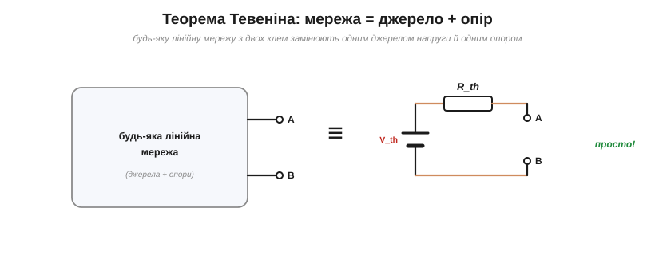
*Рис. 1.5.3.1. Теорема Тевеніна: будь-яку лінійну мережу, хоч яку складну, з двох клем можна замінити **одним** джерелом напруги V_th послідовно з **одним** опором R_th. Для навантаження різниці немає.*

Формально: будь-яка лінійна двополюсна мережа еквівалентна джерелу напруги **V_th** (напруга Тевеніна) послідовно з опором **R_th** (опір Тевеніна). «Еквівалентна» означає, що **жодне** навантаження, приєднане до клем, не відрізнить оригінальну мережу від цієї простої схемки з двох елементів — вони дадуть йому однакові напругу й струм. Уся внутрішня складність — десятки резисторів, кілька джерел — стискається у **два числа**.

Дві умови варто закарбувати. По-перше, мережа має бути **лінійною** (резистори, лінійні джерела — без діодів і транзисторів у нелінійному режимі); саме лінійність, через суперпозицію §1.5.2, і робить теорему правдивою. По-друге, еквівалент завжди прив'язаний до **конкретної пари клем**: дивишся на ту саму мережу з інших двох виводів — матимеш інші V_th та R_th.

### Два числа: V_th і R_th

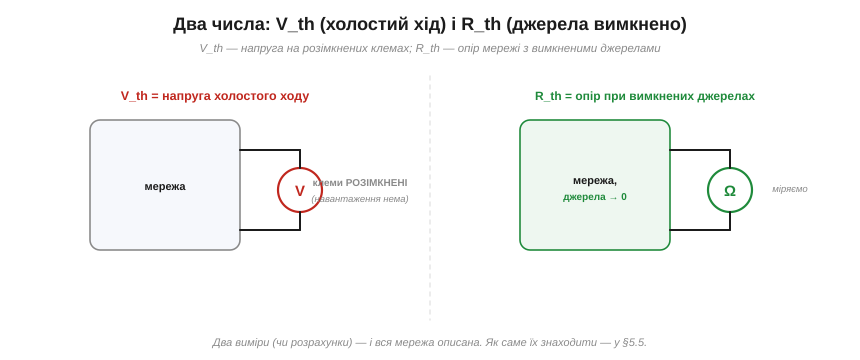
*Рис. 1.5.3.2. Два числа задають еквівалент. **V_th** — напруга на **розімкнених** клемах (холостий хід, навантаження нема). **R_th** — опір мережі, виміряний із клем, коли всі **незалежні** джерела **вимкнено** (напругу в КЗ, струм у розрив). Як саме їх рахувати — у §1.5.5.*

Що ж це за два числа? **V_th — це напруга холостого ходу**: та, що на клемах, коли навантаження ще не приєднане (як ε в реального джерела). **R_th — це опір самої мережі з клем**, виміряний тоді, коли всі її **незалежні** джерела **вимкнено** за правилом суперпозиції з §1.5.2 (джерела напруги — в коротке замикання, струму — в розрив; внутрішні опори лишаються). Якщо ж у колі є **залежні** джерела (підсилювачі, транзистори — Модуль 2), їх не вимикають, а R_th дістають пробним джерелом (§1.5.5). Два числа — і ціла плата описана. Детальну техніку їх знаходження ми відпрацюємо в §1.5.5; тут важлива сама **ідея**.

Обидва числа, до речі, цілком **вимірні** на реальному пристрої. V_th знімають вольтметром із високим вхідним опором — щоб не навантажити вузол і не зіпсувати той самий «холостий хід». А R_th дістають або з розрахунку, або непрямо — за просіданням під відомим навантаженням, точнісінько як ми міряли внутрішній опір батареї в §1.5.1.

### Чому це потужно: легко міняти навантаження

Може здатися, що звести мережу до двох чисел — лише косметика. Та насправді це дає величезну практичну вигоду.

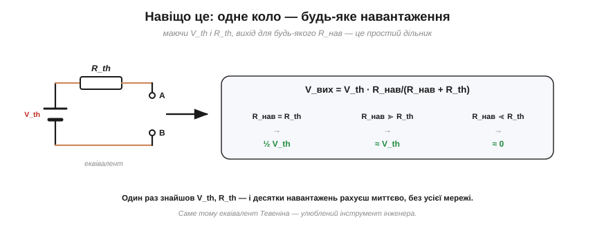
*Рис. 1.5.3.3. Сила теореми: маючи V_th і R_th, вихід для **будь-якого** навантаження — це простий дільник V_вих = V_th·R_нав/(R_нав+R_th). Одне знайдене V_th, R_th — і десятки навантажень рахуєш миттєво.*

Щойно ви знайшли V_th і R_th, відповідь для **будь-якого** навантаження R_нав стає тривіальною — це звичайний дільник напруги (§1.4.6): V_вих = V_th·R_нав/(R_нав + R_th). Хочете спробувати десять різних навантажень? Замість десять разів розв'язувати всю мережу, ви рахуєте десять простих дільників. Це і є сенс еквівалента: **складну роботу робиш один раз**, а далі користуєшся готовим результатом скільки завгодно. Саме тому інженери так люблять Тевеніна.

Особливо це цінно під час **проєктування**: підбираючи навантаження чи прикидаючи, як вузол поведеться за різних умов, ви крутите одну просту формулу замість щоразу перелопачувати цілу схему. А ще еквівалент Тевеніна — спільна «валюта», якою різні частини системи домовляються між собою: вихід одного блока описано V_th і R_th, вхід наступного — своїм опором, і їх легко зіставити.

### Приклад: дільник → еквівалент


*Рис. 1.5.3.4. Приклад: дільник 12 В з R₁=R₂=10 кΩ. Його еквівалент Тевеніна: V_th = 6 В (напруга відводу на холостому ході), R_th = R₁∥R₂ = 5 кΩ.*

Візьмімо знайомий дільник напруги й знайдімо його еквівалент Тевеніна.

**Приклад. Джерело 12 В живить дільник R₁ = 10 кΩ і R₂ = 10 кΩ; вихід знімаємо з відводу між ними. Який його еквівалент Тевеніна?**

```
V_th = напруга холостого ходу (відводу):  V_th = 12·R₂/(R₁+R₂) = 12·10/20 = 6 В
R_th = опір із клем при вимкненому джерелі (12 В → КЗ):
       тоді R₁ і R₂ виявляються паралельними:  R_th = R₁∥R₂ = 10к∥10к = 5 кΩ
```

Тепер уся «сила» дільника описана двома числами: **6 В за 5 кΩ**. Приєднаймо навантаження R_нав = 5 кΩ — і одразу бачимо просідання: V_вих = 6·5/(5+5) = **3 В**. Ось воно, кількісне пояснення «ефекту навантаження» з §1.4.6: вихід просів удвічі, бо навантаження дорівнює R_th. Жодних повторних розрахунків усього кола — самий дільник з еквівалентом.

### Усе знайоме — це Тевенін


*Рис. 1.5.3.5. Усе знайоме виявляється Тевеніном: реальна батарея — це V_th = ε, R_th = r (§1.5.1); вихід дільника — це V_th = напруга відводу, R_th = R₁∥R₂ (§1.4.6).*

Тепер видно, що ми **давно** користувалися Тевеніном, не називаючи його. **Реальна батарея** з §1.5.1 — це еквівалент Тевеніна з V_th = ε та R_th = r. **Вихід дільника** з §1.4.6 — теж: його V_th — напруга відводу, а R_th = R₁∥R₂ (той самий «вихідний опір», про який ми згадували). Будь-який реальний вихід — блока живлення, давача, каскаду підсилювача — це «джерело + внутрішній опір», себто Тевенін. Теорема лише підвела під цю звичну картину строгий фундамент: **так можна з будь-якою лінійною мережею**.

> 🔧 **Навіщо це.** Тевенін — це інженерний рентген: він бачить за плетивом схеми просте «джерело + опір». Практична вигода трояка. Перше: **аналіз навантажень** стає тривіальним (один дільник замість усієї мережі). Друге: R_th — це **вихідний опір** вузла, що каже, чи витримає він навантаження без просідання (малий R_th — «жорстке», добре джерело). Третє: це мова **стикування блоків** — щоб з'єднати два каскади, досить знати V_th та R_th першого й вхідний опір другого. Звикніть питати про будь-який вихід: «а який у нього еквівалент Тевеніна?» — і складні системи стануть зрозумілими блоками.

---

Підсумок §1.5.3: **теорема Тевеніна** — будь-яка лінійна мережа з двох клем еквівалентна джерелу **V_th** послідовно з опором **R_th**. V_th — напруга холостого ходу; R_th — опір мережі з вимкненими джерелами. Маючи цю пару, вихід для будь-якого навантаження — простий дільник, тож складну роботу робимо лише раз. Реальна батарея (ε, r) і вихід дільника (§1.4.6) — окремі випадки Тевеніна. Тепер — його дзеркало для струму, **теорема Нортона**.

---

## 1.5.4 Теорема Нортона: двоїстість

У Тевеніна є **дзеркальний** двійник — **теорема Нортона**. Як ми вже знаємо з [історії розділу](ch05-history-thevenin-norton.md), Нортон (1926) дав ту саму ідею в **дуальній** формі. Якщо ви засвоїли двоїстість послідовно↔паралельно з §1.4.5, ця тема дасться майже задарма.

### Що каже теорема Нортона

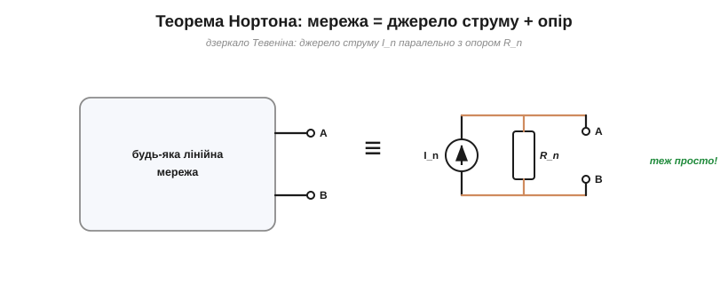
*Рис. 1.5.4.1. Теорема Нортона — дзеркало Тевеніна: будь-яку лінійну мережу з двох клем можна замінити джерелом **струму** I_n паралельно з опором R_n.*

Теорема Нортона: будь-яка лінійна двополюсна мережа еквівалентна джерелу **струму** I_n (струм Нортона) **паралельно** з опором R_n. Порівняйте з Тевеніном (§1.5.3): там було джерело **напруги послідовно** з опором, тут — джерело **струму паралельно**. Точна двоїстість: напруга↔струм, послідовно↔паралельно. Обидві схеми описують **ту саму** чорну скриньку й однаково правдиві; це лише два «обличчя» одного еквівалента.

На схемах джерело струму малюють кружком зі стрілкою (напрям струму), на відміну від двох рисок батареї. І так само, як реальна батарея, реальне струмове джерело має скінченний внутрішній опір — це і є R_n, тільки ввімкнений **паралельно** (а не послідовно, як r у Тевеніна).

### I_n і R_n

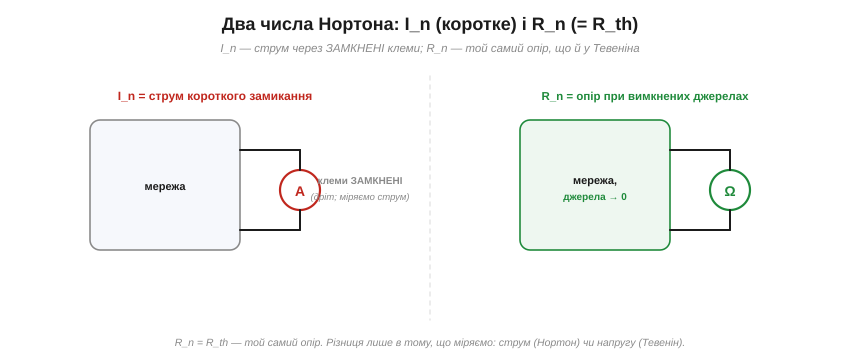
*Рис. 1.5.4.2. Два числа Нортона: **I_n** — струм через **замкнені** клеми (коротке замикання); **R_n** — той самий опір, що й R_th (мережа з вимкненими джерелами). Тевенін міряє напругу холостого ходу, Нортон — струм короткого замикання.*

Два числа Нортона знаходять майже так само, як Тевенінові, лише дзеркально. **I_n — це струм короткого замикання**: той, що потече через клеми, якщо **замкнути** їх навпрямки (дротом). **R_n — це той самий опір, що й R_th** (мережа з вимкненими джерелами); опір у Тевеніна й Нортона **однаковий**. Уся різниця в тому, **що** ми міряємо на клемах: Тевенін дивиться на напругу холостого ходу (клеми розімкнені), Нортон — на струм короткого замикання (клеми замкнені).

Маленьке застереження з безпеки: «коротке замикання» для знаходження I_n — здебільшого **розрахункова** операція. Реально замикати клеми потужного джерела не варто — потече величезний струм (ε/r з §1.5.1), можливі іскри й перегрів. Для слабких джерел I_n міряють амперметром (він і є майже коротким замиканням, бо має дуже малий опір), а для потужних — рахують.

### Перетворення джерел: Тевенін ↔ Нортон

Оскільки обидва описують ту саму скриньку, між ними є простий **перехід** — і це один із найкорисніших прийомів у всій схемотехніці.

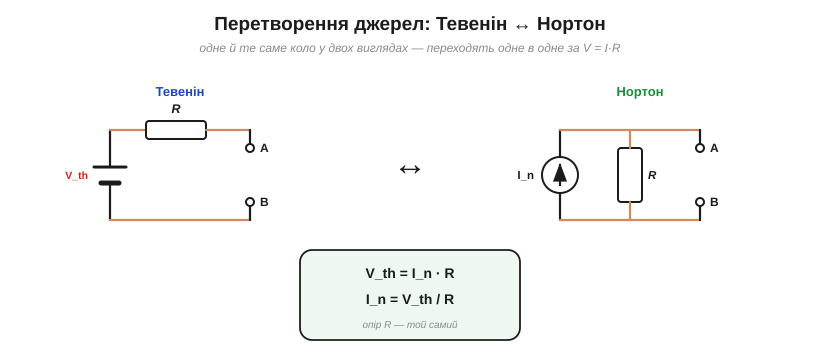
*Рис. 1.5.4.3. Перетворення джерел: Тевенін (V_th послідовно з R) і Нортон (I_n паралельно з R) — це одне коло у двох виглядах. Переходять одне в одне за V_th = I_n·R; опір R той самий.*

**Перетворення джерел** (*source transformation*) дозволяє будь-якої миті замінити «джерело напруги + послідовний опір» на «джерело струму + паралельний опір» (і навпаки), за простими формулами:

V_th = I_n · R,  I_n = V_th / R,  опір R — **той самий**.

Навіщо це потрібно? Бо різні форми **по-різному комбінуються**. Джерела напруги легко складати, коли вони послідовні; джерела струму — коли паралельні. Перетворюючи туди-сюди, можна **злити** елементи, що інакше не складались, і поетапно спростити навіть заплутане коло до одного еквівалента. Це робоча конячка ручного аналізу схем.

Найчастіше це виглядає так: бачите джерело напруги з послідовним резистором, що заважає звести паралельні гілки, — перетворюєте його на Нортонове джерело струму з паралельним резистором, і тепер усі паралельні опори та струмові джерела складаються легко. Звівши все докупи, за потреби перетворюєте результат назад на Тевенін. Туди-сюди — і ціла мережа сходиться до одного джерела з одним опором.

### Коли який зручніший


*Рис. 1.5.4.4. Обидва еквіваленти рівносильні; обирають за зручністю. Тевенін природний для послідовних з'єднань і «напругових» джерел; Нортон — для паралельних і «струмових».*

Раз вони рівносильні, який брати? Питання **зручності**. **Тевенін** природніший там, де елементи йдуть **послідовно**, де цікавить **напруга** на навантаженні, де джерело «напругове» (батарея, блок живлення). **Нортон** — там, де елементи **паралельні**, де цікавить **струм** у гілці, а джерело «струмове». Останнє не екзотика: фотодіод, давач, транзистор у певному режимі поводяться саме як **джерела струму**, і їх природно описувати по-Нортонівськи. Досвідчений інженер тримає в голові обидва й перемикається між ними, як між мовами.

### Приклад

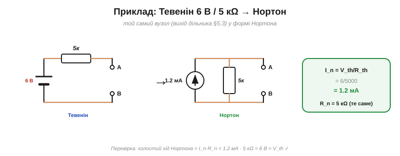
*Рис. 1.5.4.5. Приклад: Тевенін 6 В / 5 кΩ (вихід дільника з §1.5.3) у формі Нортона: I_n = V_th/R_th = 6/5000 = 1.2 мА, R_n = 5 кΩ. Перевірка: I_n·R_n = 6 В = V_th.*

Перетворімо знайомий еквівалент Тевеніна з §1.5.3 на Нортон.

**Приклад. Еквівалент Тевеніна 6 В з R_th = 5 кΩ — який його еквівалент Нортона?**

```
I_n = V_th / R_th = 6 / 5000              = 1.2 мА   (струм короткого замикання)
R_n = R_th                                = 5 кΩ     (той самий опір)
Перевірка: холостий хід = I_n·R_n = 1.2 мА · 5 кΩ = 6 В = V_th  ✓
```

Перевірка зійшлася: розімкнувши клеми Нортонової схеми, весь струм I_n тече крізь R_n, даючи напругу I_n·R_n = 6 В — рівно V_th. Дві схеми **нерозрізнимі** ззовні, як і має бути.

> 🔧 **Навіщо це.** Головна практична цінність Нортона — **перетворення джерел** як інструмент спрощення. Замінюючи «напруга + послідовний R» на «струм + паралельний R», ви зводите докупи елементи, що в первісному вигляді не складались, — і складне коло тане до простого еквівалента. А ще Нортон — природна мова для **струмових** джерел: фотодіод дає струм, пропорційний світлу; багато давачів і транзисторних каскадів — теж джерела струму. Описувати їх по-Тевенінівськи незручно, а по-Нортонівськи — якраз. Пам'ятайте головне: Тевенін і Нортон — **те саме** ззовні (V_th = I_n·R, опір спільний), тож обирайте ту форму, що спрощує саме вашу задачу.

---

Підсумок §1.5.4: **теорема Нортона** — дзеркало Тевеніна: будь-яка лінійна мережа = джерело **струму** I_n паралельно з опором R_n. I_n — струм короткого замикання; R_n = R_th (той самий опір). Між формами є просте **перетворення джерел** (V_th = I_n·R), що служить потужним інструментом спрощення кіл. Тевенін зручний для послідовних/напругових задач, Нортон — для паралельних/струмових. Лишилося навчитися **знаходити** ці еквіваленти на практиці — цим і займемось.

---

## 1.5.5 Як знайти Vth, Rth

Теореми Тевеніна й Нортона ми вже знаємо. Тепер — практичний бік: **як саме** знайти ці заповітні два числа для конкретного кола. V_th дається легко й однаково завжди; для R_th є **три способи** — і варто володіти всіма, бо кожен зручний у своїй ситуації.

### Знаходимо V_th: напруга холостого ходу

Тут усе просто й однозначно: **V_th — це завжди напруга на розімкнених клемах** (холостий хід). Прибираємо навантаження, лишаємо клеми вільними — і рахуємо (чи міряємо) напругу між ними звичайними методами Розділу 1.4. Це і є напруга Тевеніна. Жодних варіантів — V_th завжди так.

На реальному пристрої V_th знімають вольтметром із дуже високим вхідним опором — щоб сам прилад не став навантаженням і не зіпсував той «холостий хід». Це той самий нюанс, що з дільником у §1.4.6: будь-яке навантаження (зокрема й вимірювач) трохи занижує напругу, тож для чесного V_th воно має бути якомога «легшим».

### Три способи знайти R_th

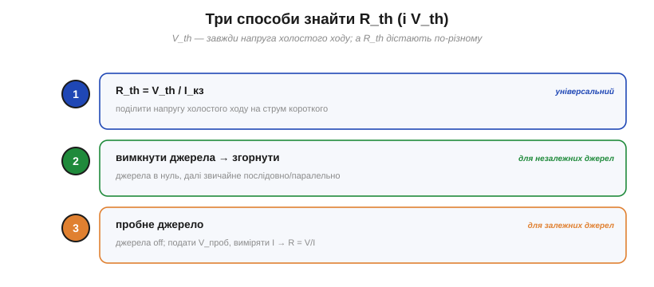
*Рис. 1.5.5.1. Три способи дістати R_th: (1) поділити напругу холостого ходу на струм короткого, R_th = V_th/I_кз — універсально (якщо I_кз ≠ 0); (2) вимкнути джерела й згорнути опір послідовно/паралельно — для незалежних джерел; (3) подати пробне джерело й поділити V/I — для залежних джерел.*

Опір Тевеніна можна дістати трьома шляхами, що дають однакову відповідь. Розгляньмо кожен.

### Спосіб 1: холостий хід ÷ коротке


*Рис. 1.5.5.2. Спосіб 1: розімкнувши клеми, дістаємо V_th (напруга холостого ходу); замкнувши — I_кз (струм короткого). Опір Тевеніна — їхнє відношення: R_th = V_th/I_кз = 4/2 = 2 Ω.*

Найуніверсальніший спосіб: знайти **обидва** граничні режими — напругу холостого ходу V_th (клеми розімкнені) і струм короткого замикання I_кз (клеми замкнені дротом), — а тоді поділити:

R_th = V_th / I_кз.

Логіка прозора: для самого еквівалента Тевеніна холостий хід дає V_th, а коротке замикання — струм V_th/R_th; їхнє відношення й повертає R_th. Цей спосіб працює майже **завжди** (навіть із залежними джерелами) — за умови, що I_кз ≠ 0. (Якщо в колі немає незалежного збудження, буває V_th = 0 і I_кз = 0 водночас, а R_th усе одно скінченний; ділити «0 ÷ 0» не можна — тоді беруть спосіб 3 із пробним джерелом.)

Та з ним є практична засторога з §1.5.4: реально замикати клеми потужного джерела **небезпечно** (потече величезний струм). Тому I_кз для сильних кіл частіше **рахують**, а не міряють; для слабких — міряють амперметром, який сам майже коротке замикання.

### Спосіб 2: вимкнути джерела й згорнути

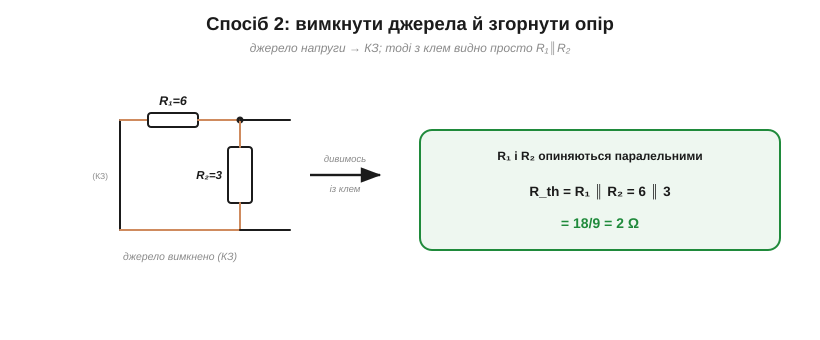
*Рис. 1.5.5.3. Спосіб 2: вимикаємо джерело (напругу в КЗ), і тоді з клем уся мережа — просто пасивні опори. Тут R₁ і R₂ опиняються паралельними: R_th = R₁∥R₂ = 6∥3 = 2 Ω.*

Найшвидший спосіб для звичайних кіл: **вимкнути всі джерела** (за правилом суперпозиції §1.5.2: напругу — в коротке замикання, струм — у розрив) і подивитися з клем на те, що лишилось, — а лишилися **самі опори**. Згорнувши їх послідовно/паралельно методами §1.4.4–§1.4.5, дістаємо R_th напряму. Це найприродніший шлях, коли джерела **незалежні** (звичайні батареї, блоки живлення), а коло зводиться згортанням, — тобто в переважній більшості задач.

### Спосіб 3: пробне джерело

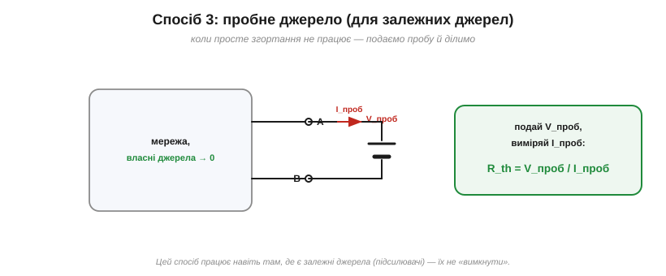
*Рис. 1.5.5.4. Спосіб 3 (для залежних джерел, які не «вимкнути»): власні джерела зануляють, а до клем прикладають пробне джерело V_проб, міряють струм I_проб — і R_th = V_проб/I_проб.*

Третій спосіб потрібен там, де згортання не виходить, — у колах із **залежними** джерелами (їх дають підсилювачі, транзистори; такі джерела не можна просто «вимкнути»). Тоді власні незалежні джерела зануляють, а до клем прикладають **пробне** джерело — скажімо, напругу V_проб — і дивляться, який струм I_проб воно жене. Відношення й дає опір:

R_th = V_проб / I_проб.

Це той самий закон Ома, лише застосований до **всієї мережі** з клем. Спосіб трохи марудніший, зате працює там, де перші два пасують. Із залежними джерелами ми зустрінемося у Модулі 2 — а поки досить знати, що такий інструмент є.

### Повний приклад


*Рис. 1.5.5.5. Повний приклад: V_th = напруга холостого ходу = дільник 12·3/(6+3) = 4 В; R_th = R₁∥R₂ (джерело в КЗ) = 2 Ω. Еквівалент: 4 В за 2 Ω.*

Зведімо все в один наскрізний розрахунок.

**Приклад. Джерело 12 В через R₁ = 6 Ω приходить у вузол A; від A до землі ввімкнено R₂ = 3 Ω. Клеми — на A й землі. Знайти еквівалент Тевеніна.**

```
V_th — напруга холостого ходу (на A без навантаження), це дільник:
        V_th = 12 · R₂/(R₁+R₂) = 12·3/9             = 4 В
R_th — спосіб 2 (джерело 12 В → КЗ): R₁ і R₂ стають паралельними:
        R_th = R₁ ∥ R₂ = 6∥3 = 18/9                 = 2 Ω
Перевірка способом 1: I_кз = 12/R₁ = 12/6 = 2 А
        R_th = V_th/I_кз = 4/2                       = 2 Ω  ✓
Еквівалент Тевеніна:  V_th = 4 В,  R_th = 2 Ω
```

Два способи дали однакові 2 Ω — як і має бути. Тепер коло описане парою **4 В / 2 Ω**, і з нею (за §1.5.3) ми вмить порахуємо будь-яке навантаження, а за §1.5.4 — переведемо в Нортон (I_n = 4/2 = 2 А).

Зверніть увагу, як **мало** роботи це коштувало: дві короткі викладки замість повного аналізу мережі окремо для кожного майбутнього навантаження. У цьому й уся принада еквівалента — раз звів коло до пари чисел, далі все легко.

> 🔧 **Навіщо це.** Тримайте в голові, який спосіб коли брати. **Спосіб 2** (вимкнути й згорнути) — ваш робочий кінь для звичайних кіл із незалежними джерелами: найшвидший. **Спосіб 1** (V_th/I_кз) — коли згортання незручне, але обидва граничні режими порахувати легко; ним і **перевіряють** результат. **Спосіб 3** (пробне джерело) — для кіл із залежними джерелами (підсилювачі, транзистори), де перші два не годяться. А V_th — завжди напруга холостого ходу. Маючи цю трійцю прийомів, ви знайдете еквівалент Тевеніна (а отже, й Нортона) для будь-якого реального вузла — і далі гратиметеся з навантаженнями скільки завгодно.

---

Підсумок §1.5.5: **V_th** — завжди напруга холостого ходу. **R_th** знаходять трьома способами: (1) R_th = V_th/I_кз — універсально (коли I_кз ≠ 0); (2) вимкнути джерела й згорнути опір — найшвидше для незалежних джерел; (3) пробне джерело R_th = V_проб/I_проб — для залежних. У наскрізному прикладі всі способи дали той самий результат (4 В / 2 Ω). Тепер ми вміємо звести будь-яку мережу до еквівалента — і можемо поставити останнє питання розділу: за якого навантаження джерело віддає **найбільшу потужність**?

---

## 1.5.6 Узгодження й максимальна передача потужності

Маючи еквівалент Тевеніна (V_th, R_th), поставмо красиве й практичне питання: **яке навантаження візьме від джерела найбільшу потужність?** Відповідь не очевидна — і веде до важливої інженерної ідеї **узгодження**.

### Питання: яке навантаження бере найбільше?

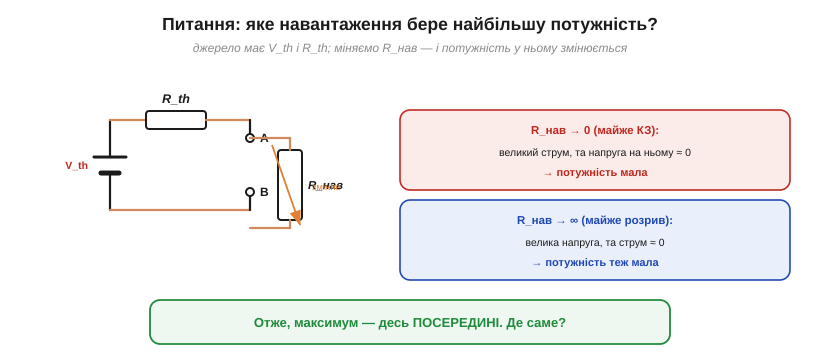
*Рис. 1.5.6.1. Джерело (V_th, R_th) живить змінне навантаження R_нав. Замале R_нав (майже КЗ) — великий струм, та напруга на ньому ≈ 0; завелике (майже розрив) — велика напруга, та струм ≈ 0. В обох крайнощах потужність мала, тож максимум — десь посередині.*

Поміркуймо над крайнощами. Якщо R_нав **дуже мале** (майже коротке замикання), крізь нього тече великий струм, але напруга на ньому майже нульова — а P = V·I, тож потужність мізерна. Якщо R_нав **дуже велике** (майже розрив), на ньому велика напруга, але струм майже нульовий — потужність знову мізерна. В обох крайнощах P → 0. Отже, десь **посередині** ховається максимум. Лишається знайти, де саме.

### Теорема: максимум при R_нав = R_th

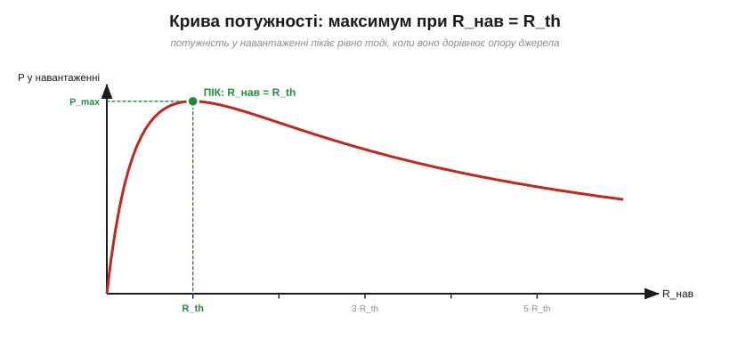
*Рис. 1.5.6.2. Крива потужності в навантаженні залежно від R_нав має чіткий пік — рівно при R_нав = R_th. Це і є теорема про максимальну передачу потужності.*

Відповідь напрочуд красива: **потужність у навантаженні максимальна, коли R_нав = R_th** — коли навантаження **дорівнює** внутрішньому опору джерела. Це **теорема про максимальну передачу потужності**. Її легко вивести: потужність у навантаженні P = V_th²·R_нав/(R_нав + R_th)²; прирівнявши похідну по R_нав до нуля, дістаємо рівно R_нав = R_th. Стан, коли навантаження «підігнане» під джерело, і називають **узгодженням** (*impedance matching*).

Інтуїтивно це баланс: менше R_нав підсилює струм, але слабшає напругу на навантаженні; більше R_нав — навпаки. Рівність R_нав = R_th — золота середина, де добуток V·I найбільший. Гарна симетрія: джерело «віддає найщедріше» тому навантаженню, що на нього найбільше схоже.

### Скільки саме: P_max = V²/(4R_th)

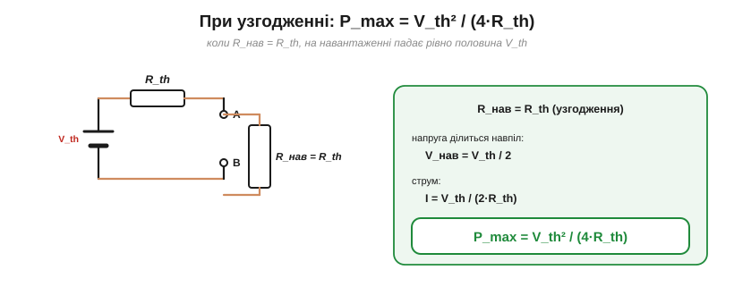
*Рис. 1.5.6.3. При узгодженні (R_нав = R_th) напруга джерела ділиться навпіл, а максимальна потужність у навантаженні P_max = V_th²/(4·R_th).*

Порахуймо й саму потужність. При узгодженні R_нав = R_th дільник із двох рівних опорів ділить напругу **навпіл**: на навантаженні падає V_th/2, а струм дорівнює V_th/(2·R_th). Перемноживши, дістаємо максимальну потужність:

P_max = V_th² / (4·R_th).

Це найбільше, що джерело з даними V_th і R_th узагалі здатне віддати в зовнішнє навантаження. Хочете більше — мусите або підняти V_th, або знизити R_th самого джерела.

Це, до речі, межа й для реального джерела з §1.5.1: максимальна потужність, яку батарея з ЕРС ε та внутрішнім опором r узагалі здатна віддати, — це ε²/(4·r), і дістається вона при навантаженні R_нав = r. Намагатися «вичавити» більше марно: за меншого опору джерело лише наближається до короткого замикання, а потужність у навантаженні падає. (І це знову межа простої моделі «ε + r»: реальну батарею не варто тримати в узгодженому режимі — половина потужності гріє її нутро, а хімічні й теплові обмеження ставлять стелю задовго до того.)

### Ціна узгодження: ККД лише 50 %

А тепер — важлива пастка, що ламає наївне «узгоджуй завжди».

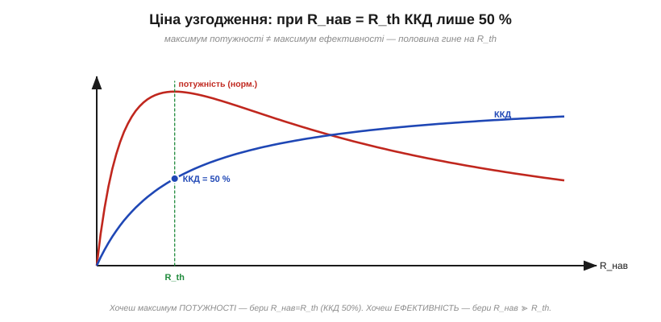
*Рис. 1.5.6.4. Пастка: максимум потужності — не максимум ефективності. При R_нав = R_th половина всієї потужності гине на R_th, тож ККД лише 50 %. Ефективність зростає, коли R_нав ≫ R_th, але потужність у навантаженні тоді падає.*

Зверніть увагу: при узгодженні **однаковий** опір R_нав і R_th несуть однаковий струм, тож на кожному виділяється **порівну** потужності. А це означає, що рівно **половина** всієї потужності джерела безповоротно гріє його **внутрішній** опір R_th, і лише половина дістається навантаженню. Коефіцієнт корисної дії при узгодженні — лише **50 %**! Максимум потужності й максимум ефективності — це **різні** режими: ефективність росте, коли R_нав ≫ R_th (втрати на R_th малі), але потужність у навантаженні тоді мала. Доводиться обирати, що важливіше.

### Коли узгоджувати, а коли — ні

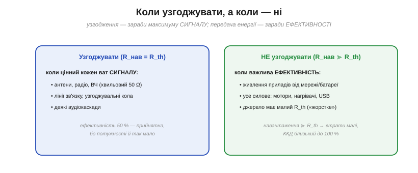
*Рис. 1.5.6.5. Узгоджують (R_нав = R_th) там, де цінний кожен ват сигналу: антени, ВЧ (50 Ω), лінії зв'язку. НЕ узгоджують (R_нав ≫ R_th) у силовому живленні, де важлива ефективність: мотори, нагрівачі, USB.*

Звідси проста практична карта. **Узгоджують** там, де цінний кожен ват **сигналу**, а втрати на ККД — другорядні (бо потужності й так обмаль): антени й радіо (звідси хвильові опори **50 Ω** і **75 Ω**), високочастотні лінії, кола зв'язку, деякі аудіокаскади. **Не узгоджують** у **силовому** живленні, де головне — ефективність: блок живлення, батарея, USB живлять прилади, чий опір **набагато більший** за внутрішній опір джерела (R_нав ≫ R_th), тож втрати малі, а ККД близький до 100 %. Саме тому реальні джерела живлення роблять «жорсткими» (малий R_th), а не «узгодженими».

І ще тонкість на майбутнє: у колах змінного струму «опір» узагальнюється до **імпедансу** (з урахуванням ємностей та індуктивностей), і узгодження стає узгодженням **імпедансів** — наріжним поняттям радіо- та звукотехніки. Тільки «дзеркалити» тут означає брати **комплексно-спряжений** імпеданс, Z_нав = Z_дж\* (активні частини зрівнюють, а реактивну компенсують протилежною: ємність — індуктивністю, і навпаки); сама ж ідея лишається — щоб віддати максимум сигналу, навантаження має «віддзеркалити» джерело.

> 🔧 **Навіщо це.** Головне рішення — **потужність чи ефективність?**, бо в узгодженій точці вони конфліктують. Для **сигналів** (антена, радіо, ВЧ-лінія) узгоджують опори (R_нав = R_th), бо там виловлюють максимум слабкого сигналу, а 50 % ККД не біда. Для **живлення** (мотори, нагрівачі, зарядка) узгодження було б катастрофою — половина енергії грілася б усередині джерела; натомість беруть навантаження, **набагато більше** за R_th, і дістають високий ККД. Тому, до речі, не можна «висмоктати» з розетки чи блока живлення довільно велику потужність, узгодившись із ним: спершу впадеш у к.з. Запам'ятайте дороговказ: **сигнал — узгоджуй; енергію — передавай ефективно**.

---

## Підсумок Розділу 1.5

Весь розділ — про одну могутню ідею: **дивитися на коло з клем** і зводити будь-яку складність до простого еквівалента.

- **Реальне джерело** (§1.5.1) — ідеальна ЕРС ε плюс внутрішній опір r; напруга просідає під навантаженням.
- **Суперпозиція** (§1.5.2) — у лінійному колі відгук від кількох джерел = сума відгуків від кожного окремо.
- **Теорема Тевеніна** (§1.5.3) — будь-яка лінійна мережа з клем = джерело напруги V_th послідовно з опором R_th.
- **Теорема Нортона** (§1.5.4) — її дзеркало: джерело струму I_n паралельно з R_n; між ними — перетворення джерел.
- **Як знайти** (§1.5.5) — V_th (холостий хід) і R_th (три способи).
- **Узгодження** (§1.5.6) — максимум потужності при R_нав = R_th, але ціною 50 % ККД.

За всім цим стоять **Тевенен і Нортон** (а перед ними — Гельмгольц), чию історію та ідею «чорної скриньки» розказано у [вставці розділу](ch05-history-thevenin-norton.md). Головний здобуток — інженерний спосіб мислення: **складне = простий еквівалент**, і блоки стикуються за двома числами.

### Що далі

Ми пройшли всю «теорію» кіл — від заряду до еквівалентних схем. Лишилося опанувати **практичну мову та інструменти** інженера: як читають **принципові схеми** (символи, вузли, «земля»), і як **вимірюють** реальні кола — мультиметром і осцилографом. Цим — і завершенням Модуля 1 — займеться **Розділ 1.6**.

> ▶️ Далі — **Розділ 1.6. Мова схем і вимірювання**: принципова схема, умовні позначення, «земля» та шини живлення, як читати схему, мультиметр і осцилограф, похибки й безпека.
