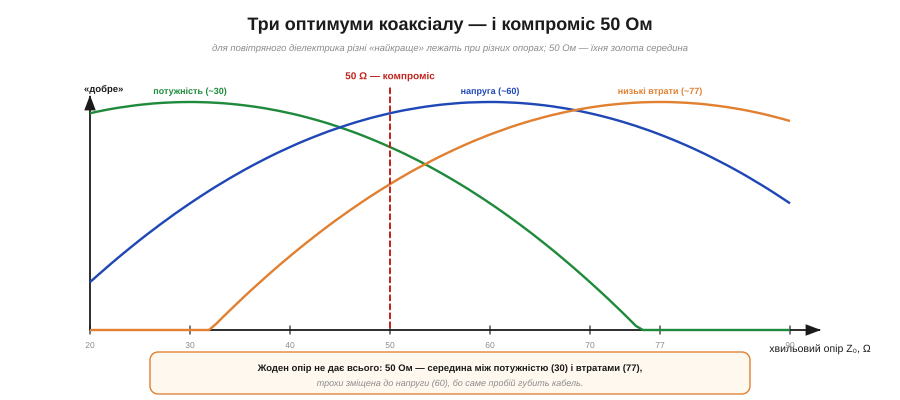

# 📜 Звідки взялися 50 Ом: компроміс коаксіального кабелю

> Історична вставка до теми [§1.5.6 «Узгодження й максимальна передача потужності»](ch05-equivalent-circuits.md). У темі майнули «хвильові опори 50 Ω і 75 Ω» — стандартні значення, під які узгоджують високочастотні лінії. Та чому саме **50**? Виявляється, за цим круглим числом стоїть гарна інженерна історія — про те, що реальні стандарти не є оптимумом за однією міркою, а народжуються як **компроміс** кількох суперечливих вимог. І «пласкоголовість» кривих із §1.5.6 робить цей компроміс на диво вдалим.

## Народження коаксіалу

Усе почалося не з радіо, а з **телефонії**. 1929 року інженери **Bell Labs** **Ллойд Еспеншайд** (*Lloyd Espenscheid*) і **Герман Аффель** (*Herman Affel*) розробили й проаналізували перший **коаксіальний** кабель — «труба в трубі»: центральний провідник усередині зовнішнього циліндра. Завдання було амбітне: проштовхнути сигнал смугою до 4 МГц на сотні кілометрів, щоб нести близько тисячі телефонних розмов одним кабелем.

Ключова величина коаксіалу — його **хвильовий опір** Z₀, що залежить від **відношення діаметрів** зовнішнього й внутрішнього провідників (і від діелектрика між ними). Міняючи це відношення, інженер обирає Z₀ — і тут постала дилема.

## Три «найкраще» — і всі різні

Виявилося, що **різні бажані властивості** коаксіалу досягають максимуму за **різних** Z₀. Для повітряного діелектрика (класичний випадок):

*Рис. 1.5.6і.1. Для повітряного коаксіалу різні оптимуми лежать при різних хвильових опорах: найбільша **потужність** — близько 30 Ω, найбільша витримка по **напрузі** (пробою) — близько 60 Ω, найменші **втрати** (загасання) — близько 77 Ω. Жоден опір не дає всього одразу; 50 Ω — компроміс між ними.*

- **Максимум потужності** — при Z₀ ≈ **30 Ω**.
- **Максимум витримки по напрузі** (до пробою) — при Z₀ ≈ **60 Ω**.
- **Мінімум втрат** (загасання сигналу) — при Z₀ ≈ **77 Ω**.

Біда в тому, що ці три числа **різні**: не можна одночасно мати найбільшу потужність, найменші втрати й найкращу витримку по напрузі. Доводилося обирати — або шукати золоту середину.

## Компроміс на ім'я «50»

Золотою серединою й стало **50 Ω**. Це компроміс між «потужнісними» 30 Ω і «малозагасними» 77 Ω: їхнє середнє арифметичне — 53.5 Ω, а округлили до зручних **50**. Чому не рівно посередині, а ближче до меншого боку? Бо вирішальним руйнівником кабелю є **пробій по напрузі**, і вибір трохи зміщували до «напругобезпечних» 60 Ω. Додалися й цілком приземлені причини: зі стандартних розмірів мідних труб «труба в трубі» природно виходив опір десь **51.5 Ω**, а 50 — приємно кругле число для розрахунків. Усе зійшлося на 50 Ω, і воно стало світовим стандартом високочастотної техніки — для передавачів, радіо, ВЧ-приладів, де важливий **баланс** потужності, втрат і надійності.

І тут варто згадати «пласкоголовість» піка з §1.5.6: оскільки всі ці криві **широкі й пологі**, 50 Ω дає **майже** найкращу потужність, **майже** найменші втрати й **майже** найкращу витримку — поступаючись кожному ідеалу зовсім трохи. Компроміс вийшов вдалим саме тому, що жодна з кривих не має гострого піка.

## А чому ж тоді 75 Ом?

*Рис. 1.5.6і.2. Два стандарти під дві потреби. 50 Ω — компроміс для передавачів і ВЧ-потужності. 75 Ω — там, де сигнал слабкий і головне втрати (телебачення, відео, антени): це майже оптимум загасання (~77 Ω), та ще й близько до ≈73 Ω диполя, тож гарно узгоджується з антеною.*

Поряд із 50 Ω живе другий стандарт — **75 Ω**, у телебаченні, відео й кабельних мережах. Логіка інша: там сигнал **слабкий**, потужність нікого не цікавить, а головний ворог — **втрати**. Тож узяли опір, **найближчий до мінімуму загасання** (~77 Ω). Бонусом 75 Ω майже збігається з **≈73 Ω** — опором простої півхвильової **дипольної антени** у вільному просторі, тож кабель чудово узгоджується з антеною без зайвих трансформаторів. Звідси й розподіл ролей: **50 Ω** — де передають потужність, **75 Ω** — де приймають слабкий сигнал.

## Що з цього лишається

Історія 50 Ом — чудовий урок про природу інженерних стандартів. Здавалося б, кругле «50» мало б бути оптимумом чогось — а насправді воно **не оптимум жодної** окремої величини. Це **перемовини** між суперечливими вимогами: потужність тягне до 30, втрати — до 77, напруга — до 60, технологія труб — до 51, а любов до круглих чисел — до 50. Перемогла золота середина, і доброю вона стала лише тому, що криві пологі (§1.5.6).

Тому, побачивши «50 Ω» на роз'ємі чи кабелі, згадайте: це не священне число й не оптимум — це **вдалий компроміс**, вистражданий ще в 1930-х на телефонних лініях Bell Labs. Реальна інженерія майже завжди така: не ідеал за однією міркою, а найкраща угода відразу за багатьма.
