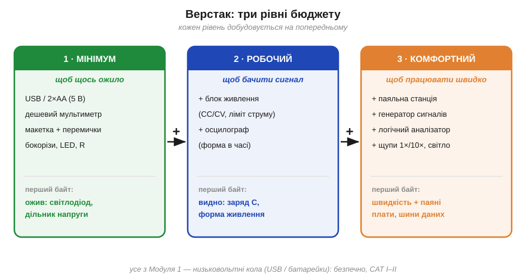

# 🔌 Майстерня з нуля: три рівні бюджету верстака

> 🔌 Компонентна вставка до всього [Розділу 1.6 «Мова схем і вимірювання»](ch06-schematics-measurement.md). У розділі ми навчилися **читати** схеми й розібрали прилади поодинці — мультиметр (§1.6.6), осцилограф (§1.6.7), блок живлення (§1.6.10). Тут зведемо це докупи з практичного боку: **що мусить стояти на столі**, аби перше коло ожило, — і скільки реально треба, щоб почати. Розглянемо верстак як систему й розкладемо його на **три рівні бюджету**: мінімум (щоб щось засвітилося), робочий (щоб бачити сигнал) і комфортний (щоб працювати швидко).

## Верстак як «прилад»: із чого він складається

Корисно дивитися на робоче місце (*bench*, *workbench*) як на один великий інструмент із кількох блоків, кожен зі своєю роллю. **Джерело** (*power*) — батарейка, USB або лабораторний блок живлення — дає колу енергію. **Око** (*instrument*) — мультиметр і осцилограф — дозволяє **бачити** напругу й струм, бо очима електрику не видно. **Поле для збирання** (*prototyping*) — макетна плата (*breadboard*, §1.4.1) — тримає компоненти й з'єднує їх без паяння. **З'єднання** (*wiring*) — перемички, щупи, затискачі-«крокодили». І **руки**: бокорізи, пінцет, а на вищому рівні — паяльник. Цього набору-кістяка вистачає, щоб пройти весь Модуль 1 на столі.

*Рис. 1.6.0.1. Три рівні верстака. **Мінімум**: USB чи батарейка, дешевий мультиметр, макетка з перемичками — щоб коло **запрацювало**. **Робочий** додає лабораторний блок живлення з обмеженням струму й бюджетний осцилограф — щоб **бачити** сигнал у часі. **Комфортний** — паяльна станція, генератор сигналів, логічний аналізатор, нормальні щупи — щоб **працювати швидко**. Кожен рівень добудовується на попередньому.*

## Рівень 1 — мінімум (щоб щось ожило)

Мета цього рівня — **замкнути перше коло** й переконатися, що воно працює. Достатньо чотирьох речей. **Живлення** — звичайний USB-порт (5 В) або батарейний відсік на дві-три AA: ці кілька вольтів і живлять усе з Модуля 1. **Мультиметр** — навіть найдешевший «2000-count» (§1.6.6): він уже міряє напругу, струм і опір та «прозвонює» з'єднання. **Макетна плата** з набором **перемичок** — щоб збирати схеми без паяння. І **бокорізи** з кількома резисторами та світлодіодами. Усе разом коштує як кілька чашок кави.

Що на цьому рівні **оживе** — ваш «перший байт» в електроніці: світлодіод через струмообмежувальний резистор (фізика — Розділ 1.3), дільник напруги, виміряний мультиметром (§1.4.6), послідовне й паралельне з'єднання, перевірене на практиці. Цього достатньо, щоб **руками** відчути все, що ми пройшли. Чого тут немає — погляду на **час**: мультиметр показує одне число, а як напруга **змінюється**, ви не побачите. Звідси й наступний рівень.

## Рівень 2 — робочий (щоб бачити сигнал)

Коли коло вже оживає, головною інвестицією стає **зір у часі** й **безпечне живлення**. Два додатки. По-перше, **лабораторний блок живлення** з режимами CC/CV (§1.6.10): він дає рівну регульовану напругу, а головне — **обмежує струм**. Виставивши межу в кілька десятків мА, ви перетворюєте коротке замикання з пожежі на безпечну подію — блок просто «впреться» в ліміт замість того, щоб спалити плату. По-друге, **осцилограф** (§1.6.7) — навіть бюджетний настільний або USB-приставка: він малює **форму** сигналу в часі, і без нього все, що змінюється (а далі весь Розділ 1.7), лишається невидимим.

«Перший байт» цього рівня — побачити на екрані заряд конденсатора, тремтіння кнопки, форму живлення. Прилад нарешті показує не число, а **криву**. Тут уже варто звикати читати з паспорта приладу два числа — **вхідний опір** і **похибку** (§1.6.6, §1.6.8): на робочому рівні точність починає важити.

## Рівень 3 — комфортний (щоб працювати швидко)

Коло вже оживає й видно його сигнал — тож третій рівень не додає нового **розуміння**, а економить **час** і відкриває **паяння**. **Паяльна станція** з регульованою температурою переводить вас від тимчасових макетних плат до постійних паяних. **Генератор сигналів** (синус, меандр, трикутник на вимогу) дає чим «годувати» коло, не чекаючи природного сигналу. **Логічний аналізатор** (§1.6.9) показує одразу багато цифрових ліній — незамінний, коли дійде до шин даних. Додайте сюди **нормальні щупи 1×/10×** (§1.6.7), третю руку із затискачами, гарне світло й порядок на столі — і робота пришвидшується в кілька разів.

## Типові граблі

- **Економія на «оці», а не на «руках».** Дешевий пінцет пробачимо, дешевий **мультиметр** — теж згодиться для старту, а от брак **обмеження струму** (рівень 2) коштує спалених плат. Безпечне живлення важливіше за зайвий інструмент.
- **Категорія приладу під мережу.** Усе на столі з Модуля 1 — це низьковольтні кола (USB, батарейки), безпечні **CAT I–II**. Лізти тим самим дешевим мультиметром у **розетку чи щиток** не можна — це окрема історія категорій **CAT** (§1.6.8); за сумніву — вимкніть живлення.
- **«Земля» приладів — спільна.** Коли на столі стоять блок живлення, осцилограф і комп'ютер, їхні «землі» (§1.6.4) часто з'єднані через розетку. Це породжує **земляні петлі** й може через щуп замкнути те, що ви не планували, — тонка пастка, до якої ми ще повернемося далі в курсі.
- **Макетка — не для сили.** Пружинні контакти breadboard розраховані на малі струми; десяті частки ампера вже гріють контакт, а кілька ампер його псують. Силові кола — на паяну плату (рівень 3).
- **Спокуса купити все одразу.** Не треба: рівні **добудовуються**. Почніть із мінімуму, доведіть до життя перше коло — і докуповуйте те, чого справді бракує під конкретну задачу.
