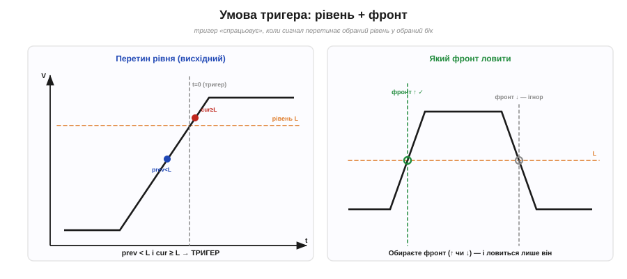
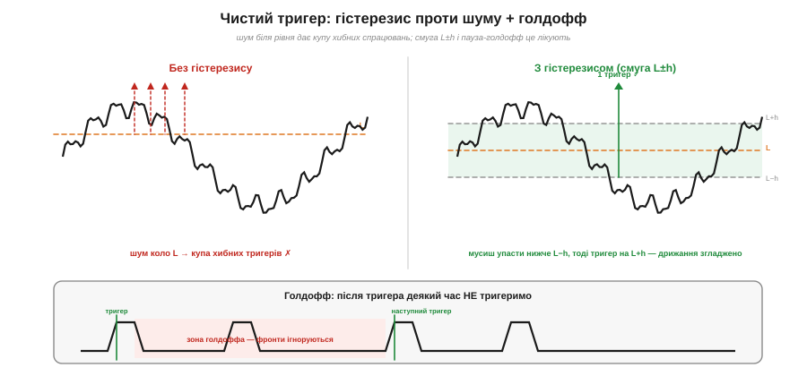
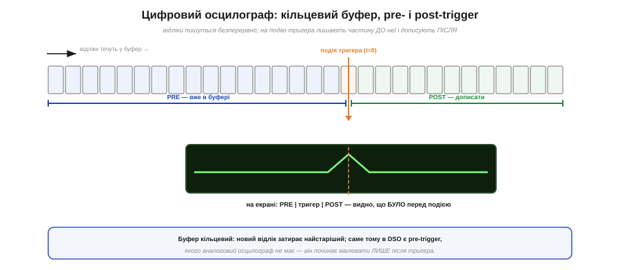

# ⚙️ Тригер: алгоритм, що зупиняє хвилю на екрані

> ⚙️ Алгоритмічна вставка до теми [§1.6.7 «Осцилограф: побачити сигнал у часі»](ch06-schematics-measurement.md). Там ми побачили, **навіщо** потрібен тригер — щоб періодична хвиля завмерла. Тут розберемо, **як** він влаштований усередині: проста умова на кожен відлік, що перетворює мерехтливу кашу на нерухому картинку. Алгоритм навдивовижу дешевий — і саме його ставлять у власні «осцилографи» на мікроконтролері.

## Задача

Осцилограф малює сигнал **знову й знову**, проходячи екран зліва направо. Якщо кожен прохід починати «з будь-де», періодична хвиля щоразу зсувається по фазі — і на екрані виходить розмита пляма (§1.6.7). Треба, щоб **кожен** прохід (а в цифровому приладі — кожен захоплений кадр) починався з **однієї й тієї самої точки** сигналу. Якої саме — задає **умова тригера**: сигнал перетинає обраний **рівень** L у обраний **бік** (висхідний чи нисхідний фронт).

## Ідея


*Рис. 1.6.7a.1. Висхідний тригер: момент, коли попередній відлік був нижчий за рівень L, а поточний став ≥ L (ліворуч). Обраний фронт (↑ чи ↓) визначає, який перетин ловити, а протилежний ігнорується (праворуч).*

Стежимо за сигналом і ловимо **момент перетину**. Висхідний фронт — це коли **попередній** відлік був **нижчий** за рівень, а **поточний** став **не нижчим**: `prev < L` і `cur ≥ L`. Цей момент і оголошуємо за `t = 0`. В аналоговому осцилографі подія тригера **запускає розгортку**; у цифровому (DSO) відліки безперервно течуть у пам'ять, а тригер лише позначає точку, навколо якої виставити кадр.

Та проста умова має дві відомі вади, і обидві лікують класично.

**Шум.** Якщо сигнал брудний, біля рівня він **дрижить** і перетинає L багато разів поспіль — виходить купа хибних тригерів, картинка знову «біжить».


*Рис. 1.6.7a.2. Дві біди простої умови. Шум коло рівня дає купу хибних тригерів (ліворуч); смуга L±h (гістерезис) лишає один чистий (праворуч). Голдофф (внизу) після спрацювання глушить зайві фронти аж до нового періоду.*

Рятує **гістерезис**: замість одного рівня беремо **смугу** L ± h. Тригеримо на перетині `L + h` вгору — і потім **не дозволяємо** наступний тригер, поки сигнал не впаде нижче `L − h`. Дрібне дрижання в межах смуги просто не помічається (це той самий принцип, що в тригера Шмітта — про нього в Модулі 2).

**Складні хвилі.** У пакетного чи багатогорбого сигналу за період є **кілька** придатних фронтів — і тригер стрибає між ними. Тут допомагає **голдофф**: після спрацювання прилад певний час **взагалі не тригерить**, пропускаючи зайві фронти, аж поки не почнеться новий період.

Нарешті, три **режими** на всі випадки: **Auto** — якщо тригера довго нема, розгортка йде сама (бачиш бодай щось); **Normal** — малюємо **лише** на тригер (нема умови — екран порожній); **Single** — зловити **один** кадр і спинитися (для рідкісних подій).

## Псевдокод


*Рис. 1.6.7a.3. Цифровий осцилограф пише відліки в кільцевий буфер безперервно. На подію тригера він лишає частину буфера ДО неї (pre-trigger) і дописує ще трохи ПІСЛЯ (post-trigger) — тому на екрані видно й те, що передувало події.*

Цифровий варіант пише відліки в **кільцевий буфер** — тому показує й те, що було **перед** тригером (pre-trigger), чого аналоговий не вміє:

```
# Тригер по фронту з гістерезисом і голдоффом (на кожен відлік)
armed = true                  # чи готові спрацювати
hold  = 0                     # лічильник голдоффа
prev  = 0
for cur in потік_відліків:            # cur — новий відлік з АЦП
    buf.push(cur)                     # кільцевий буфер (для pre-trigger)
    if hold > 0:
        hold -= 1                     # ще в зоні голдоффа — мовчимо
    elif armed and prev < L and cur >= L:    # висхідний перетин рівня
        t0 = зараз                    # зафіксувати точку тригера
        дописати POST відліків, заморозити, показати [PRE | t0 | POST]
        hold  = T_holdoff             # пауза: не тригерити N відліків
        armed = false
    elif cur < L - h:                 # сигнал упав нижче L−h
        armed = true                  # знову готові (гістерезис проти шуму)
    prev = cur
```

## Складність і пастки на МК

**Обчислень — копійки:** на кожен відлік лише кілька порівнянь, тобто **O(1)** на відлік і O(N) на буфер. Вузьке місце — не математика, а **швидкість** і **детермінізм у часі**: відліки мусять іти рівним темпом, а момент `t = 0` — бути точним.

Коли таке роблять на **мікроконтролері** (а самопальний DSO — популярна вправа), вилазять характерні граблі:

- **Шум → хибні тригери.** Без гістерезису `h` картинка дрижатиме; програмний компаратор без смуги не варто й пробувати.
- **Замала частота вибірки** — пропустиш швидкий фронт, та ще й дістанеш **аліасинг** (§1.6.9): хвиля на екрані буде брехливою.
- **Джитер переривань.** Якщо ловити фронт софтово в обробнику переривання, затримка «плаває» — і `t = 0` розмазується. Краще **апаратний аналоговий компаратор** МК: він порівнює з рівнем у залізі й сам смикає **захоплення таймера** чи DMA — момент виходить точний.
- **Кільцевий буфер.** Новий відлік **затирає** найстаріший; треба акуратно вести вказівник запису й рахувати, скільки ще дописати після тригера (post-trigger).
- **«Тригера нема».** Обов'язково передбачте **авто-таймаут** (режим Auto), інакше за відсутності умови екран лишиться порожнім, і здаватиметься, що прилад завис.

Висновок: алгоритм тригера простий до смішного — пара порівнянь на відлік, — але саме він відрізняє осцилограф від «мерехтливої лампи». А вся інженерія ховається не в логіці, а в тому, щоб ловити фронт **швидко** й **точно в часі**.
