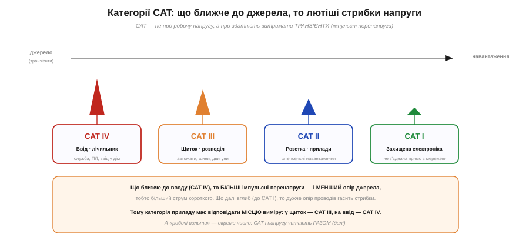
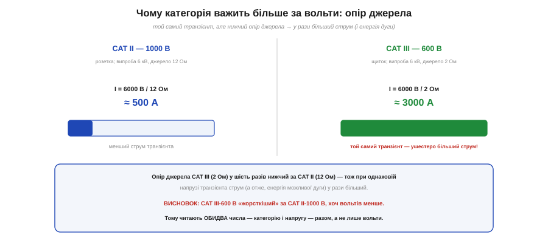
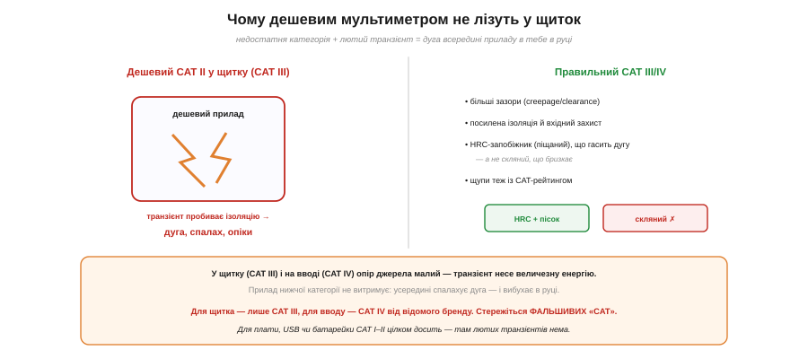

# 🔌 Категорії CAT I–IV: чому дешевим мультиметром не лізуть у щиток

> 🔌 Компонентна вставка до теми [§1.6.8 «Похибки й безпека вимірювань»](ch06-schematics-measurement.md). Там ми домовилися **поважати електрику** й лишати мережу фахівцям. Тут — про конкретне число в паспорті приладу, що вирішує, **де** ним узагалі можна працювати: категорію вимірювань **CAT**. Зрозуміти її варто, бо помилка тут карається не зіпсованим приладом, а **дугою в руці**.

## Що таке CAT і навіщо

На щупах і мультиметрі ви бачите напис на кшталт «**CAT III 600 V**». Перша частина — **категорія вимірювань** за стандартом IEC 61010. І ось головне, що дивує початківців: CAT — це **не** про робочу напругу, яку прилад міряє. Це про здатність витримати **транзієнт** — короткий потужний **імпульс перенапруги**, що стрибає в мережі (від комутацій, двигунів, а надто — від блискавки).

*Рис. 1.6.8c.1. Категорію задає відстань від джерела: CAT IV (ввід, лічильник) → CAT III (щиток, розподіл) → CAT II (розетка, прилади) → CAT I (захищена електроніка). Що ближче до джерела, то більші транзієнти й менший опір джерела; що глибше — то дужче їх гасить опір проводів.*

Категорію визначає **відстань від джерела** живлення — бо що далі вглиб мережі, то дужче опір проводів **гасить** стрибки:

- **CAT I** — захищена електроніка, не з'єднана прямо з мережею (вторинні низьковольтні кола, USB-гаджет).
- **CAT II** — штепсельні навантаження: розетка, побутові прилади, ваша макетка від адаптера.
- **CAT III** — стаціонарний розподіл: **щиток**, автомати, шини, стаціонарні двигуни, трифазне.
- **CAT IV** — **ввід** у будівлю: лічильник, кабель від стовпа, повітряні лінії — там, де б'є блискавка.

Що ближче до вводу (CAT IV), то **лютіші** транзієнти — і, що важливо, то **менший опір джерела**.

## Три числа, а не одне

Тут і ховається пастка. IEC 61010 оцінює прилад за **трьома** критеріями разом: робоча напруга, пікова напруга **транзієнта** і — найголовніше — **опір джерела**.

*Рис. 1.6.8c.2. Той самий випробний транзієнт 6 кВ, але опір джерела різний: CAT II — 12 Ом (≈500 А), CAT III — 2 Ом (≈3000 А). Ушестеро більший струм означає, що CAT III-600 В витримує куди енергійніший удар, ніж CAT II-1000 В.*

Саме опір джерела робить вищу категорію **жорсткішою**. Випробний транзієнт для CAT III-600 В — це 6000 В при опорі джерела **2 Ом**, а для CAT II-1000 В — імпульс того самого класу, але при **12 Ом**. За законом Ома 6000 В на 2 Ом дають ≈ **3000 А**, а на 12 Ом — лише ≈ 500 А: **ушестеро** більший струм, а отже, і енергія можливої дуги. Звідси контрінтуїтивний, але **критичний** висновок: **CAT III-600 В безпечніший за CAT II-1000 В**, хоч вольтів у нього менше. Тому категорію й напругу читають **разом** — самих вольтів не досить.

## Чому дешевим — не в щиток

*Рис. 1.6.8c.3. Недостатня категорія в щитку: транзієнт пробиває ізоляцію приладу, спалахує дуга — вибух у руці. Правильний CAT III/IV має більші зазори, посилену ізоляцію й HRC-запобіжник (піщаний), що гасить дугу; щупи теж мусять мати CAT.*

Тепер зрозуміло, чим небезпечний дешевий мультиметр (зазвичай CAT II — або й зовсім без чесного рейтингу) у **щитку** (CAT III) чи на **вводі** (CAT IV). Там опір джерела малий, транзієнт несе **величезну** енергію — і прилад нижчої категорії її **не витримує**: усередині, попри ізоляцію, **пробиває дугу**. А дуга в приладі, який ви тримаєте в руці, — це спалах, розплавлений метал і важкі опіки.

Правильний CAT III/IV прилад зроблено інакше: **більші зазори** (creepage/clearance) між доріжками, посилена ізоляція, вхідний захист і — важливо — **HRC-запобіжник** (високої вимикальної здатності, з піщаним наповнювачем), що **гасить** дугу, а не скляний, що бризкає. Не забувайте: **щупи теж мають CAT** — кепські щупи зведуть нанівець добрий прилад. І стережіться **фальшивих** «CAT IV», надрукованих на безіменних приладах без реальної сертифікації.

## Підсумок: де яким міряти

Правило просте. Для **плати, USB, батарейки** — там лютих транзієнтів немає, вистачить **CAT I–II**. Для роботи з **розеткою** — щонайменше **CAT II**. А в **щиток** лізьте лише з **CAT III**, на **ввід** — лише з **CAT IV**, і тільки від відомого виробника. Дивіться на **обидва** числа (категорію й вольти), бережіть щупи й пам'ятайте золоте правило §1.6.8: за найменшого сумніву — **вимкніть живлення**.
