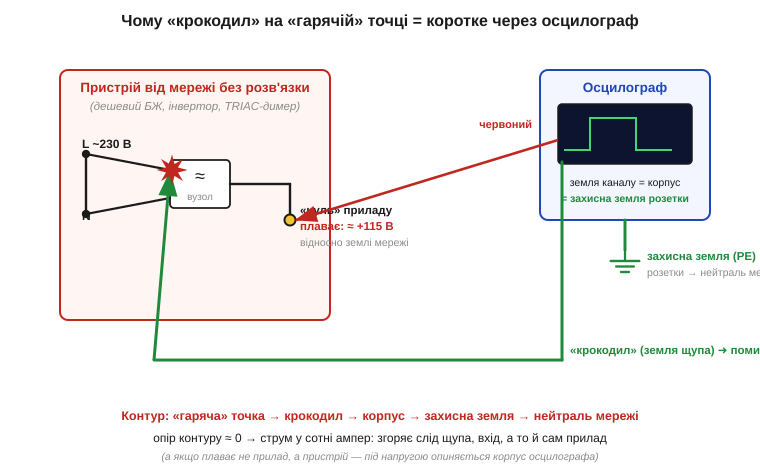
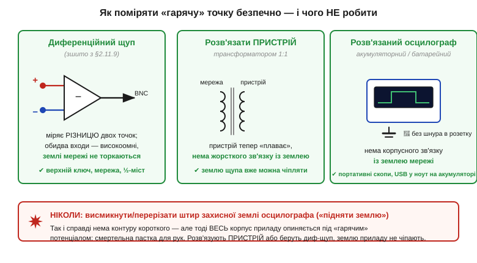

# 🔌 Земля щупа — це земля розетки: як не спалити осцилограф

> 🔌 Компонентна вставка до теми [§1.6.8 «Похибки й безпека вимірювань»](ch06-schematics-measurement.md). Там ми домовилися **поважати електрику**. Тут — про одну конкретну пастку, на яку наступають навіть бувалі: чорний «крокодил» осцилографа — це **не нейтральний нуль**, а **земля розетки**. Зрозуміти це варто до того, як ви вперше тицьнете щуп у щось, живлене від мережі, бо ціна помилки — згорілий прилад, а часом і удар струмом.

## Чорний «крокодил» — продовження земляної шини будинку

Згадаймо паспорт входу осцилографа (вставка [§1.6.7 «Осцилограф зблизька»](ch06-s7-c-oscilloscope.md)): **земля всіх каналів спільна** й сидить на металевому корпусі приладу. А корпус, заради безпеки, з'єднаний третім штирем вилки із **захисною землею** (*protective earth*, PE) розетки — щоб у разі пробою ізоляції струм пішов у землю, а не крізь руку інженера. Висновок із цього лагідного факту суворий: чорний **«крокодил»** будь-якого щупа — це **не просто опорна точка вашого кола**, а фізичне продовження земляної шини всього будинку.

Поки ви міряєте звичайну плату від адаптера, це непомітно. Адаптер усередині **гальванічно розв'язаний** (його трансформатор не пускає мережу на вихід), тож «нуль» плати вільно «плаває» і спокійно стає на потенціал PE, щойно ви чіпляєте крокодил. Жодного струму — усе гаразд.

## Що горить, коли крокодил не на землі

Біда починається, коли пристрій, який ви міряєте, **сам зв'язаний із мережею без розв'язки**: дешевий блок живлення без трансформатора, інвертор, симісторний (*TRIAC*) димер, верхнє плече напівмоста. У такому пристрої внутрішній «нуль» — **не нуль мережі**: він може стояти на сотні вольтів відносно PE (для випрямленої мережі 230 В — десь близько половини амплітуди). Причепите крокодил до такої «гарячої» точки — і ви **з'єднаєте** її з земляною шиною розетки **крізь корпус осцилографа**.

*Рис. 1.6.8c.4. Пристрій без розв'язки: його «нуль» плаває на ≈115 В відносно землі мережі. Чорний крокодил з'єднаний із корпусом осцилографа, а той — із захисною землею розетки. Чіпляємо крокодил на «гарячу» точку — і замикаємо її на землю мережі **крізь прилад**: контур майже без опору, струм у сотні ампер, згоряє слід щупа й вхід.*

Цей контур — «гаряча» точка → крокодил → корпус приладу → захисний провід → нейтраль мережі — має **майже нульовий опір**, тож струм у ньому злітає до сотень ампер. Згоряє тонкий земляний дріт у щупі, вибиває вхідний каскад, інколи гине сам прилад; летять іскри. А якщо в розетці немає справної землі, усе ще підступніше: тоді не «нуль» приладу падає на PE, а **навпаки** — увесь металевий корпус осцилографа підскакує до «гарячого» потенціалу, і прилад стає смертельною пасткою для рук.

## Як поміряти «гарячу» точку безпечно

Перше правило просте: **звичайним щупом крокодил чіпляють лише на землю свого кола** — і тільки якщо саме коло гальванічно розв'язане від мережі. А коли треба зазирнути у вузол, що не лежить на землі (верхній ключ напівмоста, точка просто на випрямленій мережі), беруть один із трьох правильних шляхів.

*Рис. 1.6.8c.5. Безпечно: (1) **диференційний щуп** міряє різницю двох точок двома високоомними входами, землі мережі не торкаючись; (2) **розв'язати пристрій** трансформатором 1:1, щоб він «плавав»; (3) **розв'язаний осцилограф** на акумуляторі без зв'язку з PE. Анти-рішення — висмикнути штир землі приладу: контуру короткого нема, зате весь корпус стає «гарячим». Так не роблять.*

Головний інструмент тут — **диференційний щуп** (*differential probe*). Замість «гарячий вивід + крокодил на землю» він має **два рівноправні високоомні входи** (+ і −) і вбудований віднімач: на осцилограф іде сама **різниця** напруг між цими точками, а самих входів земля мережі взагалі не стосується. Так він міряє напругу на верхньому ключі чи просто на фазі, не створюючи фатального контуру. Це той самий принцип «зважати не на абсолют, а на різницю», який ми зустрічали з диференційними сигналами; докладно про роботу з мережею й гальванічну розв'язку — у темі [§2.11.9 «Безпека робіт із мережею»](../../block-2-components-analog/r11-ac-power-switching/r11-ac-power-switching.md).

Решта двох шляхів прибирають небезпечний зв'язок інакше: **розв'язувальний трансформатор 1:1** змушує «плавати» сам пристрій (тоді його «нуль» уже можна чіпляти крокодилом), а **розв'язаний осцилограф** (портативний на акумуляторі чи USB-приставка в ноутбук, що живиться від батареї) сам не має зв'язку з PE. А ось чого робити **категорично не можна** — це «піднімати землю», тобто висмикувати чи перерізати штир захисної землі осцилографа. Так контуру короткого справді не буде, але весь металевий корпус приладу опиниться під «гарячим» потенціалом — це пряма дорога до удару струмом. Прибирають зв'язок **з боку пристрою**, а захисну землю приладу не чіпають ніколи.
