# Розділ 1.6 — Мова схем і вимірювання

П'ять розділів ми будували **розуміння** кіл — від заряду до еквівалентних схем. Тепер настав час практичної **грамоти** інженера: навчитися **читати** й **креслити** принципові схеми (їхні символи, вузли, «землю») та грамотно **вимірювати** реальні кола мультиметром і осцилографом. Це останній розділ Модуля 1 — місток від теорії до паяльника: щоб усе, що ми зрозуміли, можна було накреслити, зібрати й перевірити.

> 📜 **Перед матеріалом — історія:** [Як побачити невидиме: від компасної стрілки до мультиметра](ch06-history-instruments.md) — звідки взялися вимірювальні прилади й чому кожен вимір трохи змінює коло.

---

## 1.6.1 Навіщо принципова схема

Перш ніж розбирати символи й вимірювання, відповімо на засадниче питання: **навіщо взагалі потрібна принципова схема** і чим вона відрізняється від фотографії плати чи купи дротів на столі.

### Схема — карта зв'язків, не фото

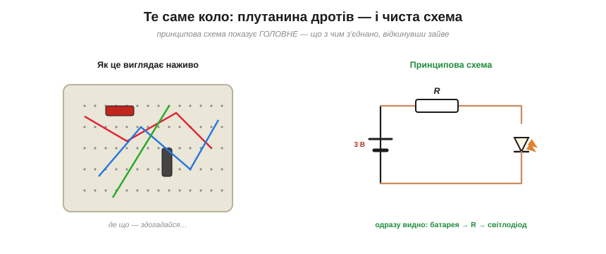
*Рис. 1.6.1.1. Те саме коло наживо й на схемі. Фізичний макет — плутанина дротів, де важко зрозуміти, що з чим з'єднано. Принципова схема показує **головне** — батарея → резистор → світлодіод, — відкинувши все зайве.*

**Принципова схема** (*schematic*) — це не малюнок того, як коло **виглядає**, а карта того, як воно **влаштоване**: які компоненти є і **що з чим з'єднано**. Погляньте на реальний макет — плутанина дротів, де навіть просте коло годі прочитати з першого погляду. А принципова схема того самого кола одразу промовляє: ось батарея, ось резистор, ось світлодіод, з'єднані по колу. Схема **відкидає неважливе** (де фізично лежить деталь, якої довжини дріт) і лишає **суть** — зв'язки й функцію.

Найближча аналогія — **карта метро**. Вона теж «бреше» про відстані й напрямки (лінії спрямлено, перегони зрівняно), зате чесно й ясно каже головне: які станції з'єднані й де пересадки. Принципова схема — така сама «карта метро» для кола: геометрію навмисне спотворено, аби топологія читалася з першого погляду.

### Три рівні опису

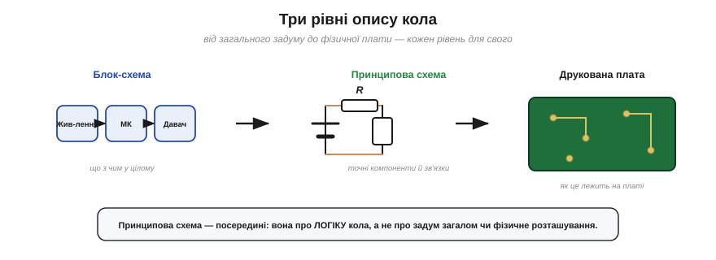
*Рис. 1.6.1.2. Три рівні опису кола: **блок-схема** (що з чим у цілому), **принципова схема** (точні компоненти й зв'язки) і **друкована плата** (фізичне розташування). Принципова — посередині: вона про логіку кола.*

Корисно бачити, що одне коло описують на **трьох рівнях абстракції**. **Блок-схема** (*block diagram*) — найзагальніша: великі блоки («живлення», «контролер», «давач») і стрілки між ними; вона про задум у цілому. **Принципова схема** — середній, найдетальніший для розуміння рівень: кожен компонент своїм символом і кожне з'єднання своєю лінією. **Друковану плату** (*PCB layout*) — найфізичніший: де саме на платі лежить деталь і як в'ються мідні доріжки. Кожен рівень — для свого: блок-схема — щоб охопити систему, плата — щоб її виготовити, а **принципова схема — щоб зрозуміти й розрахувати**, як коло працює. Саме нею ми й говоритимемо.

### Зв'язки, не розташування

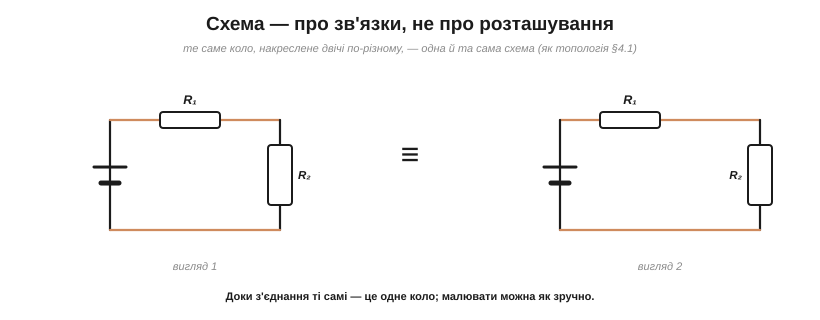
*Рис. 1.6.1.3. Схема описує **зв'язки**, а не розташування: те саме коло, накреслене двічі по-різному, — одна й та сама схема. Це пряме відлуння топології з §1.4.1 — важливо, ЩО з чим з'єднано.*

Тут спливає думка, яку ми вже зустрічали в §1.4.1: важлива **топологія** (що з чим з'єднано), а не «географія» (де намальовано). Одну й ту саму схему можна накреслити кількома способами — витягнути в лінію, повернути, перекомпонувати — і доки **з'єднання** ті самі, це **одне й те саме** коло. Тому, читаючи схему, не шукайте в ній фізичної подоби плати: схема навмисне абстрактна, аби чисто показати **структуру**. І навпаки — креслячи власну схему, дбайте не про красу розташування, а про **ясність зв'язків**.

### Анатомія схеми

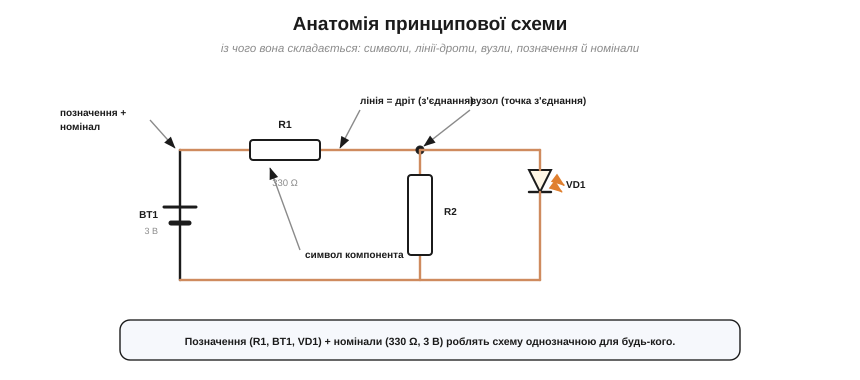
*Рис. 1.6.1.4. Анатомія схеми: **символи** компонентів, **лінії** = дроти (з'єднання), **вузли** (точки з'єднання), **позначення** (R1, BT1, VD1) і **номінали** (330 Ω, 3 В). Усе разом робить схему однозначною.*

З чого ж складається принципова схема? З кількох простих елементів. **Символи** компонентів (про них — §1.6.2) — стандартні значки резистора, конденсатора, діода тощо. **Лінії** — це дроти, тобто **з'єднання** (ідеальні, без опору). **Вузли** — точки, де лінії сходяться (часто з жирною крапкою, §1.6.3). **Позначення** (*reference designators*) — підписи на кшталт R1, C2, BT1, VD1, що дають кожній деталі унікальне ім'я. І **номінали** — значення (330 Ω, 100 мкФ, 3 В). Разом це робить схему **однозначною**: будь-хто прочитає її точно так само, як автор.

Літера в позначенні натякає на тип деталі: **R** — резистор, **C** — конденсатор, **L** — котушка, **D** чи **VD** — діод, **Q** чи **VT** — транзистор, **BT** — батарея, **U** чи **DD** — мікросхема. Цифра після літери просто нумерує однотипні деталі (R1, R2, R3…). Ці підписи разом зі **списком компонентів** (*BOM*, перелік усіх деталей із номіналами) і дають змогу зібрати плату саме з тих елементів, що задумав автор.

### Чому інженери говорять схемами

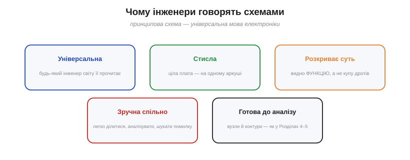
*Рис. 1.6.1.5. Чому інженери говорять схемами: вона універсальна (читає будь-хто), стисла, розкриває функцію, зручна для спільної роботи й готова до аналізу методами Розділів 1.4–1.5.*

Переваги принципової схеми й роблять її **спільною мовою** електроніки. Вона **універсальна** — інженер у будь-якій країні прочитає її без перекладу. Вона **стисла** — ціла плата вміщається на аркуші. Вона **розкриває функцію** — за символами видно, що коло **робить**, а не просто як виглядає. Вона **зручна для спільної роботи** — нею легко ділитися, обговорювати, шукати помилку. І, головне для нас, вона **готова до аналізу**: на схемі одразу видно вузли й контури, тож до неї прямо застосовні закони Кірхгофа та еквіваленти з Розділів 1.4–1.5.

У реальній роботі це окупається щодня. Маючи схему з документації приладу, його можна прочитати й полагодити; знайдену в інтернеті схему — повторити; власну — викласти на форум по допомогу. Без цієї спільної мови електроніка була б Вавилоном, де кожен описує коло по-своєму й ніхто нікого не розуміє.

> 🔧 **Навіщо це.** Уміння **читати й креслити** принципові схеми — базовий навик, без якого в електроніці нікуди: схема — це і документація, і креслення, і мова спілкування. Найпоширеніша помилка початківця — плутати схему з **фізичним** розташуванням і намагатися зробити її схожою на плату. Не треба: схема — про **зв'язки** (топологія §1.4.1), а не про географію. Навчіться бачити за символами функцію, давайте деталям позначення й номінали — і ваші схеми читатимуться однозначно. Увесь цей розділ далі вчить саме цієї мови: символи (§1.6.2), вузли й з'єднання (§1.6.3), «земля» (§1.6.4), як читати схему (§1.6.5) — а потім переходить до вимірювань.

---

Підсумок §1.6.1: **принципова схема** — це карта **зв'язків** кола (що з чим з'єднано), а не фотографія його вигляду. Вона стоїть посередині між загальною блок-схемою та фізичною платою й описує **логіку** кола. Важлива в ній топологія, а не розташування (відлуння §1.4.1); складається вона із символів, ліній-дротів, вузлів, позначень і номіналів. Схема — універсальна, стисла й готова до аналізу мова інженера. Тепер вивчимо її «абетку» — **умовні позначення компонентів**.

---

## 1.6.2 Умовні позначення компонентів

Щоб читати схеми, треба знати їхню **абетку** — умовні символи компонентів. Їх не так багато, як здається, а форма кожного зазвичай **натякає** на функцію. Пробіжімося по найуживаніших; решту ви легко впізнаватимете за аналогією.

### Пасивні: резистор, конденсатор, котушка

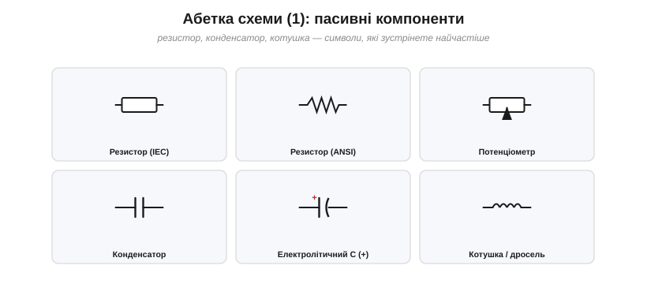
*Рис. 1.6.2.1. Пасивні компоненти: резистор (прямокутник IEC чи зигзаг ANSI), потенціометр (резистор зі стрілкою-повзунком), конденсатор (дві риски; в електролітичного одна зігнута й позначено +), котушка/дросель (низка дуг).*

**Резистор** позначають **прямокутником** (європейський стандарт) або **зигзагом** (американський) — це той самий елемент (про два стандарти — наприкінці). Додайте стрілку-повзунок — і вийде **потенціометр** (§1.4.6). **Конденсатор** — це **дві риски** (як дві пластини, між якими накопичується заряд); у **електролітичного** (полярного) одна пластина зігнута й стоїть «+», бо його не можна вмикати навпаки. **Котушку** (індуктивність, дросель) малюють **низкою дуг** — як намотаний дріт. Форма символів тут прямо повторює фізику: пластини конденсатора, витки котушки.

Маленьке нагадування: значення самого резистора часто кодують **кольоровими смужками** (§1.3.7), а на схемі його просто пишуть поруч (наприклад, «10 кΩ»). Конденсатори маркують ємністю (пФ, нФ, мкФ), котушки — індуктивністю (Гн). Тобто символ каже лише, **який** це елемент, а точне значення дає підпис-номінал біля нього.

### Напівпровідники: діод, транзистор

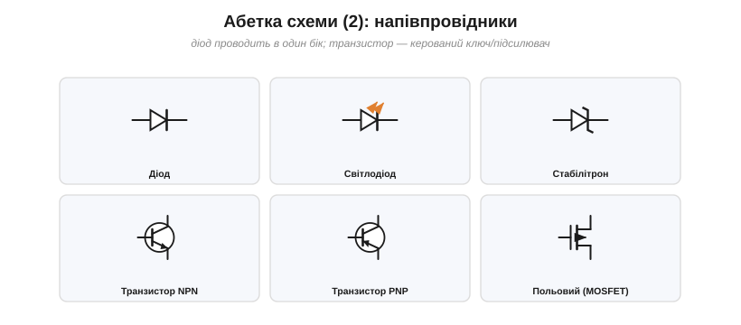
*Рис. 1.6.2.2. Напівпровідники: діод (трикутник + риска, проводить за стрілкою), світлодіод (діод зі стрілками світла), стабілітрон (діод із загнутою рискою), транзистори NPN/PNP (стрілка на емітері показує тип) і польовий MOSFET.*

**Діод** — **трикутник із рискою**; трикутник вказує напрямок, у якому діод **проводить** струм (а риска-катод його перепиняє у зворотному). **Світлодіод** — той самий діод зі **стрілочками світла**. **Стабілітрон** — діод із загнутою рискою. **Транзистори** (керовані ключі й підсилювачі) — кружок із трьома виводами: у біполярних NPN/PNP **стрілка на емітері** показує тип, а **польовий** (MOSFET) має характерну «затворну» пластину. Деталі їхньої роботи — вже Модуль 2; тут досить **упізнавати** символи.

Один практичний момент варто засвоїти вже зараз: у діода й світлодіода **бік має значення**. Вивід із боку трикутника — **анод** (плюс), із боку риски — **катод** (мінус); увімкнете навпаки — світлодіод не засвітиться, а діод не пропустить струм. На реальному світлодіоді катод позначають коротшою ніжкою або зрізом на обідку корпусу.

### Джерела й комутація

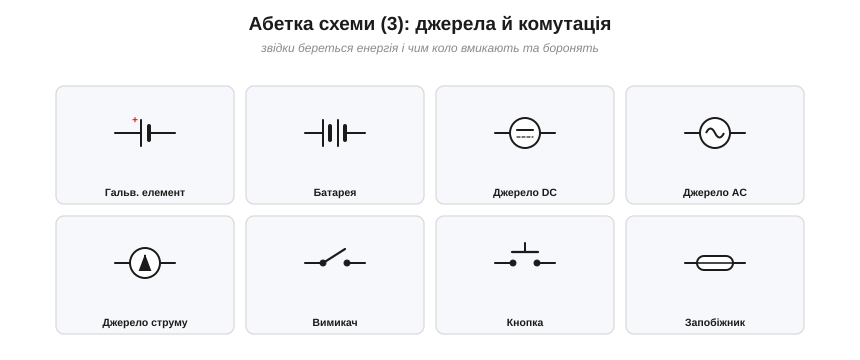
*Рис. 1.6.2.3. Джерела й комутація: гальванічний елемент (одна пара рисок), батарея (кілька), джерела DC/AC/струму (кружки з позначкою), вимикач, кнопка, запобіжник.*

Звідки береться енергія: **гальванічний елемент** — одна пара рисок (довга «+», коротка «−»); **батарея** — кілька таких пар поспіль. Узагальнені **джерела** малюють кружком: із двома рисками (постійне, DC), із синусоїдою (змінне, AC) чи зі стрілкою (джерело струму, §1.5.4). Чим коло вмикають і боронять: **вимикач** — важіль, що розриває коло; **кнопка** — миттєвий контакт; **запобіжник** — символ, що нагадує про навмисно слабку ланку (§1.3.6). Вимикачі ще бувають **нормально розімкнені** (замикаються при натисканні) і **нормально замкнені** (навпаки), а складніші — з кількома положеннями й групами контактів; усе це позначають варіаціями того самого важеля. Окремо стоїть **реле** — вимикач, який замикає не палець, а електромагніт.

### «Земля» й навантаження

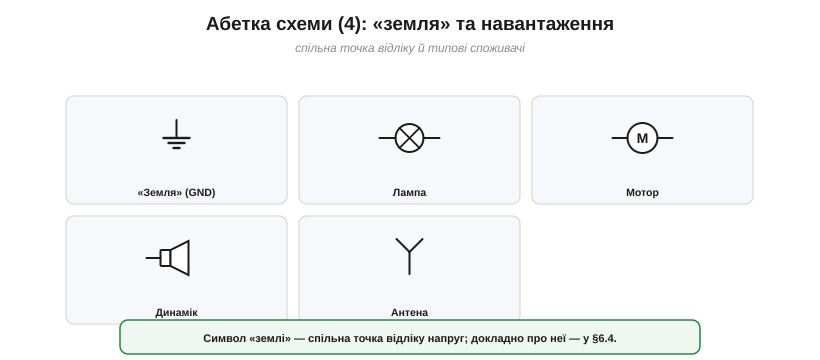
*Рис. 1.6.2.4. «Земля» (спільна точка відліку), лампа (кружок з хрестиком), мотор (M), динамік, антена — типові навантаження й позначення.*

Особливий і дуже важливий символ — **«земля»** (*ground*, GND): трикутничок зі смужок, що позначає **спільну точку відліку** напруг (їй присвячено окремий §1.6.4). А типові споживачі мають свої впізнавані значки: **лампа** — кружок із хрестиком, **мотор** — кружок із «M», **динамік** — трапеція, **антена** — характерна «галка». Здебільшого форма знову натякає на суть.

### Два стандарти: IEC і ANSI

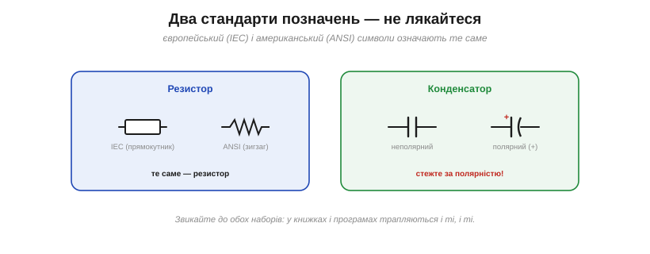
*Рис. 1.6.2.5. Два стандарти не лякають: резистор у IEC (прямокутник) та ANSI (зигзаг) — те саме. А ось у конденсатора стежте за **полярністю**: електролітичний має «+» і не терпить зворотного вмикання.*

Новачка часто бентежить, що **той самий** компонент трапляється у двох виглядах. Це через два набори стандартів: **IEC** (європейський, наш звичний — резистор прямокутником) та **ANSI** (американський — резистор зигзагом). Означають вони **те саме**; просто звикайте впізнавати обидва, бо в книжках, документації й програмах трапляються і ті, і ті. А от на що зважати **завжди** — це **полярність**: електролітичний конденсатор, діод і світлодіод мають «правильний» бік, і ввімкнені навпаки вони або не працюють, або згорають.

> 🔧 **Навіщо це.** Усю абетку напам'ять одразу вчити не треба — досить дюжини найуживаніших (резистор, конденсатор, діод, світлодіод, транзистор, батарея, вимикач, «земля»), а решту впізнаєте за формою, що натякає на функцію: дві пластини — конденсатор, котушка дуг — індуктивність, трикутник-стрілка — діод (одностороння провідність). Дві речі тримайте в голові твердо: **полярність** (електроліти, діоди, світлодіоди ввімкнені навпаки — це непрацездатність або дим) і **два стандарти** (IEC прямокутник / ANSI зигзаг — те саме). А коли креслитимете схеми в програмі (KiCad, EasyEDA), усі ці символи вже чекають у бібліотеках — лишиться їх **упізнавати**.

---

Підсумок §1.6.2: символи — це **абетка** схеми, і форма кожного натякає на функцію. **Пасивні**: резистор (прямокутник/зигзаг), конденсатор (дві пластини, в електроліта «+»), котушка (дуги). **Напівпровідники**: діод (трикутник-стрілка), світлодіод, транзистори. **Джерела**: елемент/батарея, кружки DC/AC/струму. Плюс комутація (вимикач, кнопка, запобіжник), «земля» й навантаження (лампа, мотор, динамік). Існують **два стандарти** (IEC/ANSI) — те саме різними значками; і завжди стежте за **полярністю**. Тепер навчимося читати найтонше — як саме лінії **з'єднуються** у вузлах.

---

## 1.6.3 Вузли, з'єднання й перетини

Лінії на схемі — це **дроти** (ідеальні з'єднання). Та коли дві лінії перетинаються, постає питання на копійку, від якого залежить уся схема: вони **з'єднані** чи просто **перетинаються**? Відповідь дає одна крихітна деталь.

### Крапка = з'єднання


*Рис. 1.6.3.1. Крапка вирішує: жирна **крапка** на перетині означає, що дроти **з'єднані** (одна спільна точка). Немає крапки — дроти просто перетинаються й належать різним вузлам.*

Правило просте й залізне: **жирна крапка** на місці перетину означає, що дроти тут **з'єднані** — це один спільний **вузол**. Якщо крапки **немає** — лінії лише перетинаються на папері, а електрично це **різні** вузли (як дві дороги на естакаді: перетинаються, та не сполучені). Крапка — то найважливіший знак пунктуації на схемі: загубив її або поставив зайву — і коло стало іншим.

Наслідки бувають драматичні. **Забута** крапка означає, що два дроти, які мали бути одним вузлом, насправді роз'єднані — і частина схеми просто не живиться або «висить у повітрі». **Зайва** крапка, навпаки, закорочує те, що мало лишитися окремим. Тому перше, що перевіряють у незрозумілій схемі, — чи всі крапки на місці й чи немає зайвих.

### Три способи показати перетин


*Рис. 1.6.3.2. Три способи: з'єднання показують **крапкою**; непоєднаний перетин — або **просто навхрест** (сучасно), або **«містком»**, де один дріт перестрибує другий (старіший стиль).*

З'єднання завжди показують **крапкою**. А ось непоєднаний перетин зображають двома способами. У сучасному стилі — **просто навхрест** (немає крапки — отже, не з'єднано). У старішому (і досі вживаному) — **«містком»**: один дріт малюють із маленькою дугою, що «перестрибує» другий, наочно показуючи, що вони не торкаються. Обидва означають одне — **немає з'єднання**; «місток» лише прибирає будь-який сумнів.

### Уникайте двозначного 4-перехрестя

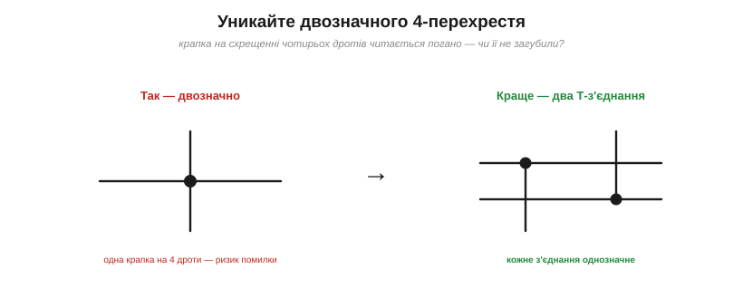
*Рис. 1.6.3.3. Крапка на схрещенні **чотирьох** дротів двозначна: легко не помітити чи сплутати з випадковою. Краще розвести з'єднання на **два Т-з'єднання** — кожне читається однозначно.*

Є одна небезпечна ситуація — **чотири** дроти, що сходяться в одній точці з крапкою. Така крапка читається погано: чи це справді з'єднання всіх чотирьох, чи хтось випадково лишив крапку, чи, навпаки, забув її? Щоб не плодити сумнівів, гарні схеми **уникають** 4-перехресть: те саме з'єднання розводять на **два Т-з'єднання** (трійники), трохи зміщені одне від одного. Кожен трійник із крапкою однозначний, і помилитися ніде. Це не педантизм, а захист від реальних багів у схемах.

### Вузол — одна електрична точка


*Рис. 1.6.3.4. Вузол — це **одна** електрична точка, хоч як розкидана по схемі: усі виводи, сполучені суцільним дротом, мають однаковий потенціал (пряме відлуння «того самого вузла» з §1.4.1).*

Тут варто згадати §1.4.1: **вузол** — це всі точки, сполучені суцільним дротом, тобто **одна** електрична точка з єдиним потенціалом. На схемі вузол може бути розкиданий: до нього під'єднано кілька деталей у різних місцях, лінії розгалужуються — та доки все сполучено дротом (через крапки-з'єднання), це **один** вузол. Читаючи схему, корисно подумки «зафарбовувати» кожен вузол: усі дроти одного кольору — то одна точка. Саме так на схемі прямо видно ті вузли, до яких застосовують закон струмів Кірхгофа (§1.4.2).

Це знання прямо стає в пригоді при **налагодженні**: якщо дві точки належать одному вузлу, між ними завжди **нуль вольтів** (ідеальний дріт), і мультиметр у будь-якій із них покаже однакову напругу відносно «землі». Тож, шукаючи обрив, дивляться саме туди, де очікуваний «один вузол» раптом розпався на дві точки з різними потенціалами.

### Іменовані ланцюги


*Рис. 1.6.3.5. Іменовані ланцюги: однакова **назва-мітка** (як «+5В» чи «GND») означає одне коло, навіть якщо лінії не намальовані з'єднаними. Так схему не захаращують довгими дротами.*

І нарешті — зручний прийом, що рятує складні схеми від плутанини дротів. Замість тягнути довгу лінію через увесь аркуш, точки з'єднують **за іменем**: ставлять однакову **мітку ланцюга** (*net label*) — скажімо, «+5В» тут і «+5В» там, — і це означає, що вони **електрично з'єднані**, хоч лінія між ними й не намальована. Так роблять насамперед для **живлення** (+5В, GND, VCC) і для **шин сигналів** (наприклад, SDA, SCL у популярній шині I²C). Схема стає чистою й читаною: замість плутанини проводів — кілька зрозумілих імен.

Окремий випадок таких міток — **символи живлення**: значки «+5В», «+3.3В», «GND» (часто у вигляді стрілочки чи планки) — це, по суті, ті самі іменовані ланцюги, лише стандартизовані. Побачивши на схемі кілька значків «GND» у різних місцях, пам'ятайте: усі вони — **один** спільний ланцюг, навіть якщо лінією не з'єднані. Саме про цей особливий ланцюг — наступна тема.

> 🔧 **Навіщо це.** Крапка-з'єднання — найдрібніший, але найкритичніший знак на схемі: **загублена або зайва крапка** — класична причина, чому «схема правильна, а не працює». Тому: ставте крапку **всюди**, де дроти справді з'єднані; **уникайте** 4-перехресть (розводьте на трійники); для живлення й шин користуйтеся **мітками ланцюгів**, а не довжелезними лініями. Сучасні програми (KiCad та інші) самі ставлять крапки й часто забороняють двозначні з'єднання — та звичка читати схему **вузол за вузлом** (зафарбовуючи кожен) лишається головним умінням. Побачили скупчення дротів — спершу розберіть, що з чим **справді** з'єднано.

---

Підсумок §1.6.3: **крапка** на перетині = дроти **з'єднані** (один вузол); без крапки — лише перетинаються (різні вузли). Непоєднаний перетин показують навхрест або «містком». Двозначних **4-перехресть** уникають, розводячи на трійники. **Вузол** — одна електрична точка, хоч як розкидана (§1.4.1), і саме до вузлів застосовний KCL. А **іменовані ланцюги** (+5В, GND, SDA…) з'єднують точки за назвою, тримаючи схему чистою. Один особливий ланцюг — спільна точка відліку — заслуговує окремої розмови: це **«земля»**.

---

## 1.6.4 «Земля» та шини живлення

Серед усіх ланцюгів схеми є один особливий, найважливіший — **«земля»**. Це спільна **точка відліку**, від якої міряють геть усі напруги. Розберімо, що це таке, чому без неї не обійтися, і як на схемі прийнято малювати живлення.

### Земля — спільна точка відліку


*Рис. 1.6.4.1. «Земля» — спільна опорна точка з потенціалом 0 В, відносно якої міряють усі напруги. «Напруга у вузлі» означає його потенціал відносно землі: «+4 В» — це на 4 В вище землі.*

**Земля** (*ground*, GND) — це вузол, якому за домовленістю призначають потенціал **0 В**, і відносно якого відлічують напруги решти вузлів. Коли кажуть «у цьому вузлі +4 В», мають на увазі: його потенціал **на 4 В вищий за землю**. Земля — як рівень моря на географічній карті: сам по собі нуль умовний, але від нього зручно міряти всі «висоти». Без такої спільної опори числа напруг просто не мали б сенсу.

### Напруга завжди відносна

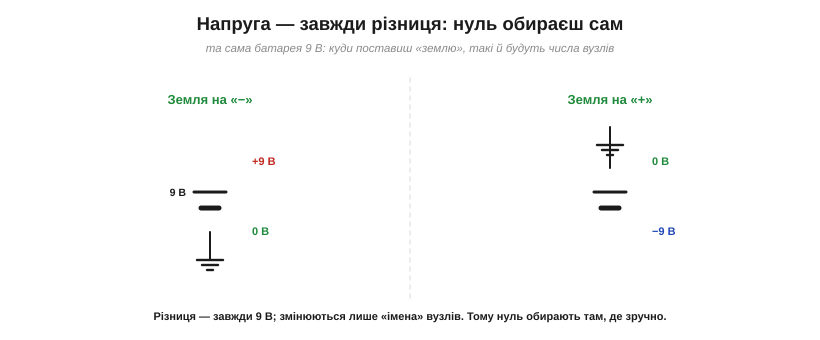
*Рис. 1.6.4.2. Напруга — завжди різниця, тож нуль обираєш сам. Та сама батарея 9 В: поставиш землю на «−» — верх стане +9 В; поставиш на «+» — низ стане −9 В. Різниця однакова, змінюються лише імена.*

Тут варто згадати засадниче з §1.1.5: **напруга — це завжди різниця** потенціалів між двома точками, а не щось абсолютне. Тому **нуль обираєте ви самі**. Візьміть батарейку 9 В: оголосите її «−» землею — і «+» стане +9 В; оголосите землею «+» — і «−» стане −9 В. **Різниця** між клемами однакова (9 В) у обох випадках; змінюються лише «імена» вузлів. Через це землю ставлять там, де **зручно** рахувати, — зазвичай на спільний мінус живлення. Аналогія знайома з §1.1.5: висоту теж міряють від обраного нуля — рівня моря, підлоги, столу. «Висота 2 метри» порожня, доки не сказано «над чим»; так і напруга: «5 вольтів» завжди означає «на 5 вольтів вище землі».

### Шини живлення: конвенція згори-вниз


*Рис. 1.6.4.3. Конвенція розкладки: плюсову шину живлення малюють **угорі**, землю — **внизу**, компоненти висять між ними, а струм тече зверху вниз. Стала розкладка робить схему звичною з першого погляду.*

**Шина живлення** (*power rail*) — це лінія, що розносить напругу живлення (+5 В, +3.3 В, +12 В…) по всій схемі. Існує усталена **конвенція розкладки**: **плюсову** шину малюють **угорі** аркуша, **землю** — **внизу**, а компоненти підвішують між ними. Тоді струм на схемі тече зверху вниз — від плюса через навантаження до землі. Дотримання цієї звички безцінне: будь-яку схему, накреслену «правильно», досвідчене око читає миттєво, бо знає, де шукати живлення, а де землю. Самі шини часто й позначають **мітками ланцюгів** (§1.6.3) — «+5В», «GND», — щоб не тягти лінії через увесь аркуш. У складніших пристроях шин буває **кілька**: скажімо, +5 В для одних мікросхем і +3.3 В для інших, а часом ще й +12 В для моторів. Кожну малюють своєю міткою, але **земля для всіх цих шин — спільна** (у межах одного пристрою): це той єдиний нуль, від якого відлічують усе живлення разом.

### Три «землі»: сигнальна, корпусна, захисна

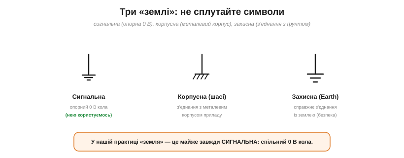
*Рис. 1.6.4.4. Три різні «землі» зі своїми символами: **сигнальна** (опорний 0 В кола — нею ми й користуємось), **корпусна** (з'єднання з металевим шасі) і **захисна** (справжнє з'єднання з ґрунтом, заради безпеки). Не плутайте їх.*

Слово «земля» приховує **три** різні поняття зі схожими, але різними символами. **Сигнальна** земля — це той самий опорний 0 В кола, про який ми весь час говоримо (трикутничок зі смужок); саме нею ми й користуємось. **Корпусна** (шасі) — з'єднання з металевим **корпусом** приладу. **Захисна** (*earth*, заземлення) — з'єднання з **ґрунтом** через контур заземлення, заради **безпеки** (щоб у разі пробою струм пішов безпечним шляхом, а не крізь людину; як саме — у §1.2.13: захисний провід дає **низькоомний шлях назад до джерела**, щоб спрацював автомат, а не «стікає в ґрунт» як у стік). У побутовій електроніці на макетці ви майже завжди маєте справу з **сигнальною** землею; земля-заземлення — це вже про мережеве живлення й безпеку.

### Однополярне vs двополярне живлення


*Рис. 1.6.4.5. Однополярне живлення — одна плюсова шина та земля (мікроконтролери, логіка, світлодіоди). Двополярне (±) додає «мінус», щоб сигнал міг гойдатися і вище, і нижче нуля (операційні підсилювачі, аудіо).*

Наостанок — про два типи живлення. **Однополярне** (single-supply) має лише **одну** плюсову шину та землю (наприклад, +5 В і GND); його вистачає для мікроконтролерів, логіки, світлодіодів — для всього, що працює «від нуля вгору». **Двополярне** (split/dual, ±) додає ще й **від'ємну** шину (скажімо, +12 В, 0 і −12 В): воно потрібне, коли сигнал має гойдатися **і вище, і нижче** нуля — як у операційних підсилювачах та аудіотехніці. Деталі — вже Модуль 2; тут досить знати, що «мінусова» шина теж буває й має сенс.

> 🔧 **Навіщо це.** Земля — це **опора всіх вимірів**: коли міряєте напругу мультиметром, чорний щуп ставлять саме на землю, бо «напруга» завжди означає «відносно землі». Звідси найважливіше практичне правило: **щоб дві частини системи розуміли одна одну звичайними (single-ended) сигналами, вони мусять мати спільну землю**. Дві плати, що так обмінюються сигналами, обов'язково з'єднують землі — інакше їхні «нулі» розійдуться, і жоден сигнал не буде прочитано правильно (це класична причина, чому «нічого не працює»). Виняток — **гальванічно розв'язані** чи **диференційні** інтерфейси (оптопари, трансформатори, RS-485): вони передають сигнал і **без** спільної землі, бо не залежать від спільного нуля (про них — у Модулі 2). Малюйте плюс угорі, землю внизу — і свою, і чужу схему читатимете легше. І не плутайте сигнальну землю із захисним заземленням: перша — опорний нуль кола, друга — про безпеку від мережі.

---

Підсумок §1.6.4: **земля** (GND) — спільна опорна точка з потенціалом 0 В, відносно якої міряють усі напруги. Бо напруга — завжди **різниця** (§1.1.5), і нуль обирають самі (зазвичай на мінус живлення). **Шини живлення** малюють за конвенцією: плюс угорі, земля внизу, струм тече вниз. Є три «землі» — **сигнальна** (наш робочий 0 В), корпусна й захисна, — їх не плутають. Живлення буває **однополярне** (плюс + земля) і **двополярне** (±). Головне правило: спільна земля обов'язкова, щоб частини схеми «розуміли» одна одну. Тепер, знаючи всю абетку, навчимося **читати схему** цілком.

---

## 1.6.5 Як читати схему

Ми вивчили абетку — символи, вузли, землю. Тепер складемо з неї **читання**: як, побачивши незнайому схему, не розгубитися, а **методично** її розібрати. Секрет — не хапатися за все одразу, а рухатися за простим рецептом.

### Рецепт читання

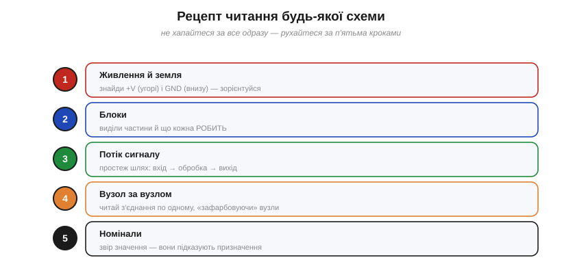
*Рис. 1.6.5.1. Рецепт читання будь-якої схеми у п'ять кроків: 1) знайди живлення й землю; 2) виділи блоки й що кожен робить; 3) простеж потік сигналу (вхід→обробка→вихід); 4) читай вузол за вузлом; 5) звір номінали.*

Будь-яку схему читають за п'ятьма кроками: **(1)** знайди **живлення й землю** — зорієнтуйся; **(2)** виділи **блоки** й зрозумій, що кожен **робить**; **(3)** простеж **потік сигналу** від входу до виходу; **(4)** читай **вузол за вузлом**, де треба деталь; **(5)** звір **номінали** — вони підказують призначення. Далі розберемо ключові кроки докладніше.

### Крок 1: спершу живлення й земля

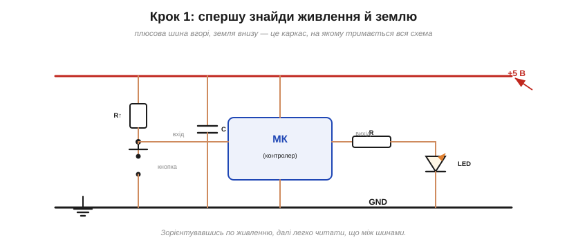
*Рис. 1.6.5.2. Крок 1: спершу знаходять плюсову шину (угорі) й землю (внизу) — це каркас, на якому тримається все інше. Зорієнтувавшись по живленню, легко читати, що між шинами.*

Найперше — знайдіть **живлення**. Завдяки конвенції з §1.6.4 це легко: плюсова шина — **вгорі**, земля — **внизу**. Це каркас схеми; усе інше підвішене між цими двома лініями. Щойно ви бачите, де «плюс», а де «нуль», схема перестає бути хаосом ліній і набуває **верху й низу**, орієнтації. Тоді кожен компонент читається у зрозумілому контексті: «оце висить між +5 В і землею», «а оце йде до входу контролера».

### Крок 3: простеж сигнал

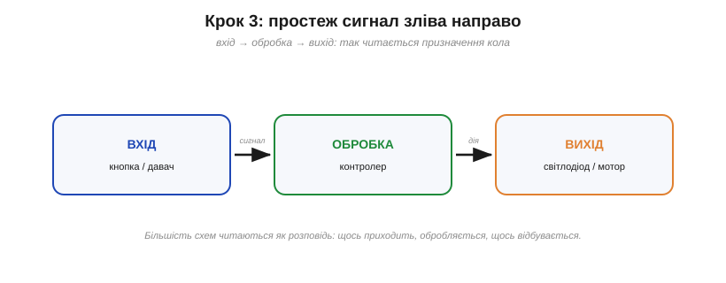
*Рис. 1.6.5.3. Крок 3: сигнал зазвичай тече зліва направо — вхід (кнопка, давач) → обробка (контролер) → вихід (світлодіод, мотор). Так читається призначення кола, мов розповідь.*

Якщо живлення йде зверху вниз, то **сигнал** зазвичай тече **зліва направо**: **вхід** (кнопка, давач) → **обробка** (контролер, підсилювач) → **вихід** (світлодіод, мотор, динамік). Простеживши цей шлях, ви читаєте схему як **розповідь**: «щось приходить ззовні, контролер це обробляє, і на виході щось відбувається». Більшість схем мають цю наративну логіку, і вловити її — значить зрозуміти **призначення** кола, ще не вникаючи в деталі.

Звісно, не кожна схема така лінійна: бувають зворотні зв'язки, кільця, суто силові кола без «сигналу» як такого. Та навіть там евристика «знайди вхід і вихід» дає першу опору, від якої легше розплутувати решту.

### Крок 4: упізнавай патерни

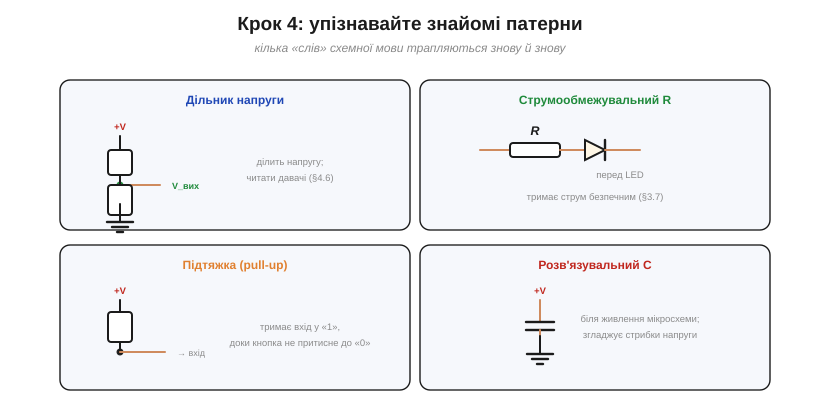
*Рис. 1.6.5.4. Чотири патерни, що трапляються знову й знову: **дільник напруги** (§1.4.6), **струмообмежувальний резистор** перед світлодіодом (§1.3.7), **підтяжка** (pull-up, тримає вхід у «1»), **розв'язувальний конденсатор** біля живлення мікросхеми.*

Ось де читання прискорюється в рази. У схемах раз у раз трапляються ті самі **типові комбінації** — «слова» схемної мови, які треба впізнавати з першого погляду, не читаючи дріт за дротом:

- **Дільник напруги** (§1.4.6) — два резистори від живлення до землі з відводом посередині; задає опорну напругу чи читає давач.
- **Струмообмежувальний резистор** (§1.3.7) — резистор послідовно зі світлодіодом; тримає струм безпечним.
- **Підтяжка** (*pull-up*) — резистор від «плюса» до входу; тримає вхід у «1», доки кнопка не притисне його до «0» (буває й **pull-down** — навпаки).
- **Розв'язувальний конденсатор** (*decoupling*) — маленький конденсатор між живленням і землею **поряд із мікросхемою**; згладжує стрибки напруги, щоб чип працював стабільно.

Упізнавши патерн, ви одразу знаєте, **навіщо** ці деталі, — і складна схема розпадається на жменю знайомих блоків.

### Приклад: читаємо схему

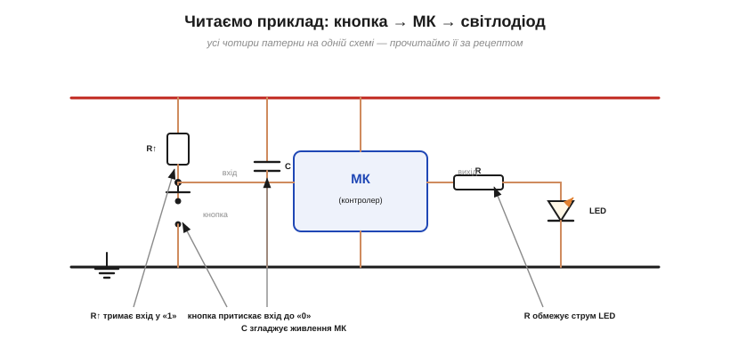
*Рис. 1.6.5.5. Наскрізний приклад: кнопка з підтяжкою на вході МК, світлодіод із резистором на виході та розв'язувальний конденсатор. Усі чотири патерни — на одній схемі.*

Прочитаймо за рецептом просту, але типову схему. **(1)** Живлення: +5 В угорі, GND унизу — є. **(2)** Блок один: мікроконтролер (МК) посередині. **(3)** Сигнал: ліворуч **вхід** (кнопка), праворуч **вихід** (світлодіод). **(4)** Тепер патерни. На вході — **підтяжка**: резистор від +5 В тримає вхід у «1»; натиснута кнопка з'єднує вхід із землею й притискає його до «0» — так контролер «бачить» натискання. На виході — світлодіод зі **струмообмежувальним резистором**: коли МК подає «1», LED світиться, а резистор боронить його від надструму. Біля живлення МК — **розв'язувальний конденсатор**, що згладжує стрибки. **(5)** Номінали (підтяжка зазвичай десятки кОм, резистор LED — сотні Ом, конденсатор — соті частки мкФ) лише підтверджують ці ролі. За п'ять кроків ціла схема прочитана — і ви розумієте, що вона робить: **по кнопці засвічує світлодіод**.

Прикметно, що ця схемка прямо лягає на код, який ми писатимемо в Модулі 3: контролер «читає» вхід із кнопкою і «вмикає» вихід зі світлодіодом. Схема й програма — два боки однієї медалі: залізо задає, що з чим **з'єднано**, а код — що з цим **робити**.

> 🔧 **Навіщо це.** Читання схем — навик, що росте з практикою: розбирайте схеми з документації (*datasheet*) і відкритих проєктів. Рецепт **живлення → блоки → сигнал → вузли → номінали** працює для будь-якого кола й рятує від паніки перед «павутиною». Та справжній прискорювач — це **впізнавання патернів**: щойно ви бачите дільник, підтяжку, струмообмежувальний резистор чи розв'язувальний конденсатор не як окремі деталі, а як цілі «слова», складні схеми читаються майже з льоту. Підтяжки й розв'язувальні конденсатори трапляються в цифровій техніці **всюди** — звикайте до них першими. І завжди орієнтуйтеся **по живленню**: знайшли верх і низ — півсправи зроблено.

---

Підсумок §1.6.5: схему читають **методично**, за п'ятьма кроками — живлення й земля, блоки, потік сигналу, вузол за вузлом, номінали. Спершу орієнтуються **по живленню** (плюс угорі, земля внизу), тоді стежать за **сигналом** зліва направо (вхід→обробка→вихід). Головний прискорювач — **упізнавання патернів**: дільник, струмообмежувальний резистор, підтяжка, розв'язувальний конденсатор. На наскрізному прикладі ми прочитали типову схему «кнопка → МК → світлодіод». Лишилося опанувати останнє — **інструменти вимірювання**, починаючи з мультиметра.

---

## 1.6.6 Мультиметр: що і як він міряє

**Мультиметр** — головний інструмент кожного, хто працює з електронікою: один прилад міряє напругу, струм, опір (а часто й перевіряє з'єднання, діоди тощо). Розберімо, що він уміє і — головне — **як** ним правильно користуватися, бо тут легко наробити дорогих помилок.

### Що вміє мультиметр

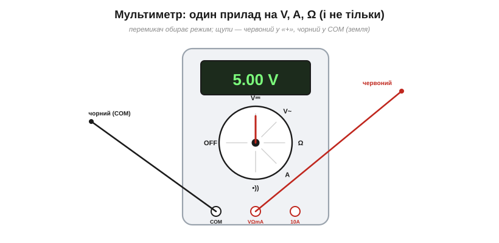
*Рис. 1.6.6.1. Мультиметр: перемикач обирає режим (V⎓ постійна напруга, V~ змінна, A струм, Ω опір, •)) прозвонка), цифрове табло показує значення. Щупи: червоний — у гніздо «VΩmA» (або «10A»), чорний — у «COM» (спільне/зворотне гніздо).*

Спереду в мультиметра — **табло** (у цифрового — з числом) і великий **перемикач режимів**: постійна напруга (V⎓), змінна (V~), струм (A), опір (Ω), «прозвонка» (•)) ) та інші. Знизу — **гнізда** для щупів: **чорний** щуп завжди в «COM» (спільне/зворотне гніздо приладу — його ставлять на вашу **опорну точку**, найчастіше землю кола §1.6.4, але це не конче «земля» мережі), а **червоний** — у «VΩmA» для більшості вимірів або в окреме «10A» для великих струмів. Перемкнули режим, вставили щупи — і прилад готовий. Три основні виміри роблять **по-різному**, і це найважливіше засвоїти.

Один нюанс із самого початку: для напруги (і струму) є **два** режими — **постійний** (позначка ⎓, для батарей, плат, USB) і **змінний** (~, для мережі 230 В). Переплутаєте — дістанете або нуль, або безглуздя; тож завжди звіряйте, постійне у вас живлення чи змінне.

### Напругу — паралельно

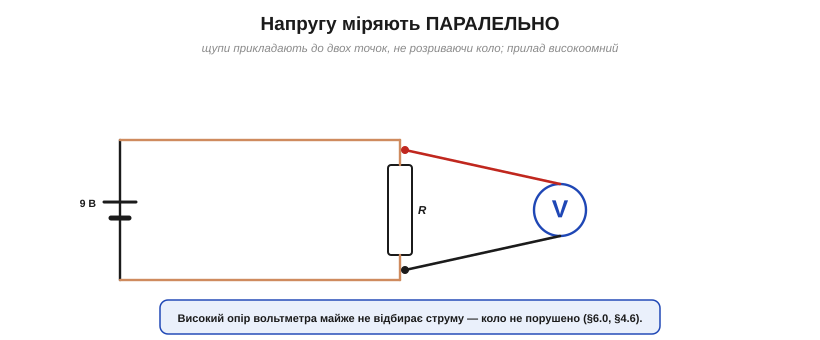
*Рис. 1.6.6.2. Напругу міряють **паралельно**: щупи прикладають до двох точок, не розриваючи кола. Високий опір вольтметра майже не відбирає струму, тож коло лишається незмінним.*

Напругу міряють **паралельно** — просто прикладають щупи до двох точок, **не розриваючи** кола. Червоний — туди, де очікують «плюс», чорний — до землі (або другої точки). Це найбезпечніший і найчастіший вимір. Працює він тому, що вольтметр **високоомний** (історія розділу): він майже не відбирає струму, тож майже не втручається в коло. Саме тому напругу можна міряти «на живому», нічого не від'єднуючи — **за умови**, що прилад і щупи розраховані на цю напругу й категорію (CAT), обрано правильний режим, а робота безпечна (надто з мережею 230 В — див. §1.6.8).

### Струм — послідовно (і обережно)

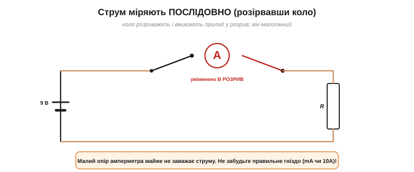
*Рис. 1.6.6.3. Струм міряють **послідовно**: коло **розривають** і вмикають прилад у розрив, щоб увесь струм ішов крізь нього. Амперметр малоомний. Уважно з гніздом — для великого струму є окреме «10A».*

А ось струм — інша річ. Його міряють **послідовно**: коло доводиться **розірвати** й увімкнути прилад у розрив, щоб увесь струм пройшов **крізь** нього. Це менш зручно (треба розмикати коло) і вимагає уваги. По-перше, амперметр **малоомний** — і це правильно (щоб не заважати струму), але саме тому його **не можна** вмикати паралельно (про це далі). По-друге, на мультиметрі зазвичай **окреме гніздо** для великих струмів (часто «10A», із власним запобіжником) — переплутаєте його зі звичайним «mA», і при великому струмі згорить запобіжник.

### Опір і прозвонка — на знеструмленому

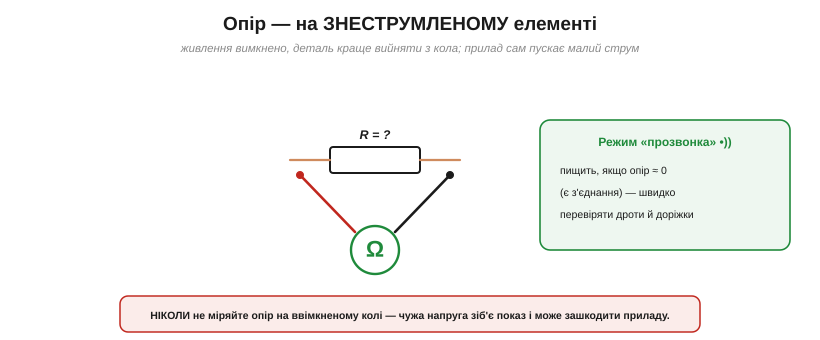
*Рис. 1.6.6.4. Опір міряють на **знеструмленому** елементі (а краще — вийнятому з кола): прилад сам пускає крізь нього малий струм і за ним судить про опір. Режим **«прозвонка»** пищить при опорі ≈0 — швидко перевіряти з'єднання.*

Опір міряють **тільки на знеструмленому** колі — мало того, деталь краще зовсім **вийняти** (інакше паралельні їй елементи спотворять показ). Працює це так: омметр **сам** пускає крізь деталь свій маленький струм від внутрішньої батарейки й за ним обчислює опір (історія розділу). Тому **чужа** напруга в живому колі все зіпсує — і показ, і, можливо, прилад. Поруч живе надзвичайно корисний режим **«прозвонка»** (continuity): він **пищить**, коли опір близький до нуля (тобто є з'єднання). Це найшвидший спосіб перевірити, чи цілий дріт, чи не відпаялася доріжка, чи справді дві точки сполучені. Поряд часто є й режим **перевірки діода** (значок ▷|): він показує пряме падіння напруги на p-n переході (у **кремнієвого** діода зазвичай **0.5–0.8 В**, у германієвого — 0.2–0.3 В; у **світлодіода** воно помітно більше, від ~1.6 В до понад 3 В, тож не кожен мультиметр його «засвітить» і покаже). Робить він це **на знеструмленому** колі, своїм струмом; ним зручно перевіряти, чи цілий діод і де в нього який вивід.

### Дві небезпечні помилки

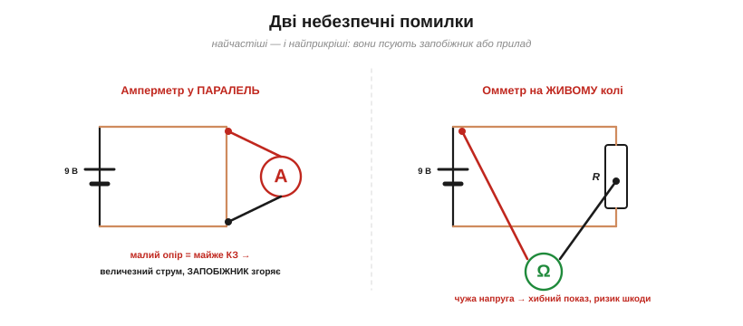
*Рис. 1.6.6.5. Дві небезпечні помилки: **амперметр у паралель** до джерела — це майже коротке замикання, запобіжник згоряє; **омметр на живому колі** — чужа напруга дає хибний показ і може зашкодити приладу.*

Двох помилок бояться найбільше — їх роблять усі початківці хоч раз. **Перша**: ввімкнути прилад у режимі **струму** (малоомний!) **паралельно** до джерела чи навантаження. Для джерела це майже **коротке замикання**: крізь прилад рине величезний струм, і в кращому разі згорить **запобіжник** мультиметра, у гіршому — сам прилад. **Друга**: міряти **опір на живому колі** — чужа напруга дає безглуздий показ і ризикує зашкодити. Обидві помилки родом з одного нерозуміння — **який** опір має прилад у кожному режимі й **як** його вмикати.

> 🔧 **Навіщо це.** Три золоті правила, які варто закарбувати: **напругу — паралельно** (вольтметр високоомний, можна на живому); **струм — послідовно**, розірвавши коло (амперметр малоомний, і ніколи не в паралель!); **опір — на знеструмленому**, а краще вийнятому елементі. Найчастіший «вбивця запобіжників» — лишити щупи в струмовому гнізді й тицьнути ними в напругу: це коротке замикання. Чорний щуп — це завжди ваш **COM** (спільне гніздо приладу; його ставлять на опорну точку — найчастіше землю кола §1.6.4), від нього й відлік. А найкорисніша кнопка на щодень — **прозвонка**: нею за секунди знаходять обрив чи перевіряють, що з'єднання справді є. Поводьтеся з мультиметром свідомо — і він стане вашим найвірнішим помічником у налагодженні.

---

Підсумок §1.6.6: **мультиметр** міряє напругу, струм і опір (плюс прозвонку). **Напругу** — паралельно (високоомний, на живому); **струм** — послідовно, розірвавши коло (малоомний, окреме гніздо для великих струмів); **опір** — на знеструмленому, краще вийнятому елементі. Чорний щуп — у COM (земля), червоний — у VΩmA. Дві небезпечні помилки: амперметр у паралель (коротке → запобіжник) і омметр на живому колі. А зробити такі прилади **точними й портативними** свого часу зумів Едвард Вестон — про нього наступна вставка.

> 📜 **Історична вставка:** [Едвард Вестон і точні прилади](ch06-s6-history-weston.md) — як стабільні сплави й еталон вольта зробили точний вимір буденним.

---

## 1.6.7 Осцилограф: побачити сигнал у часі

Мультиметр відповідає на питання «**скільки**?» — дає число. Та багато сигналів **змінюються в часі** (змінний струм, імпульси, цифрові рівні, звук), і одне число тут безсиле — воно ховає найцікавіше. На це питання — «**яка форма**?» — відповідає **осцилограф**: він малює сигнал як графік у часі.

### Число проти форми

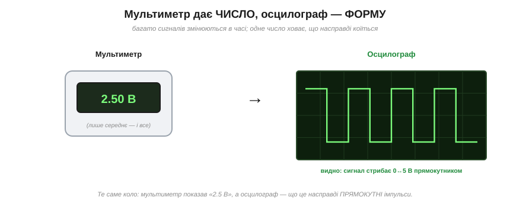
*Рис. 1.6.7.1. Мультиметр дає одне **число** (часто лише середнє), а осцилограф — **форму** сигналу в часі. Тут мультиметр показав «2.5 В», а осцилограф розкрив, що це насправді прямокутні імпульси 0↔5 В.*

Уявіть сигнал, що стрибає між 0 і 5 В прямокутником. Мультиметр (у режимі постійної напруги) усереднить його й покаже якісь «2.5 В» — ніби там спокійна стала напруга. Це **правда**, але **не вся**: насправді сигнал увесь час **перемикається**, і саме це часто важливо. Осцилограф же показує **справжню форму** — прямокутні імпульси, їхню висоту, частоту, тривалість. Там, де мультиметр стискає все до одного числа, осцилограф розгортає сигнал **у часі**.

Приклад із життя: світлодіод, яскравість якого регулюють **широтно-імпульсною модуляцією** (ШІМ) — швидким вмиканням-вимиканням. Мультиметр покаже якусь усереднену напругу, ніби LED світить рівно й тьмяно; осцилограф же розкриє правду — що насправді він **миготить** із великою частотою, а «тьмяність» лише складає наш усереднений зір. Багато цифрових явищ саме такі: середнє оманливе, а важить форма.

### Екран: напруга по вертикалі, час по горизонталі

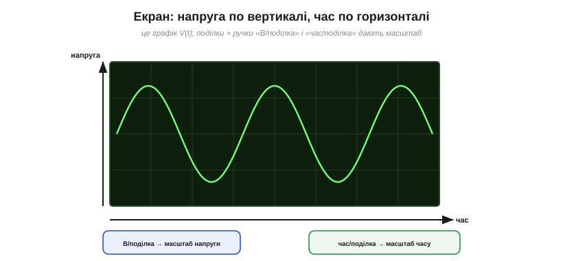
*Рис. 1.6.7.2. Екран осцилографа — це графік напруги (вертикаль) від часу (горизонталь), розкреслений на поділки. Ручки «В/поділка» і «час/поділка» задають масштаб обох осей.*

Екран осцилографа — це **графік V(t)**: по **вертикалі** відкладено напругу, по **горизонталі** — час, а сам екран розкреслено сіткою **поділок** (*divisions*). Дві головні ручки задають масштаб: **«В/поділка»** (*volts/div*) каже, скільки вольтів припадає на одну клітинку по вертикалі, а **«час/поділка»** (*time/div*) — скільки часу на клітинку по горизонталі. Покрутивши їх, ви «наближаєте» чи «віддаляєте» сигнал, щоб він зручно вмістився на екрані.

### Зчитати амплітуду й період


*Рис. 1.6.7.3. Зчитування: амплітуду й період рахують у поділках і множать на масштаб. Тут амплітуда 3 поділки × 1 В = 3 В (розмах V_pp = 6 В); період 4 поділки × 1 мс = 4 мс; звідси частота f = 1/T = 250 Гц.*

Звідси й читають числа — рахуючи **поділки** й множачи на масштаб. По вертикалі беруть розмір сигналу: **амплітуду** рахують **від середньої лінії до піка** (× «В/поділка»), а повний **розмах від піка до піка** (V_pp) — удвічі більший. **Період** T (час одного повного циклу) — по горизонталі: скільки поділок, помножити на «час/поділка». А знаючи період, одразу маємо **частоту** за формулою f = 1/T. У прикладі: амплітуда 3 поділки по 1 В = 3 В (тобто розмах V_pp = 6 В); період 4 поділки по 1 мс = 4 мс; отже, f = 1/0.004 с = **250 Гц**. Так із картинки дістають усі числа сигналу.

### Синхронізація (тригер)

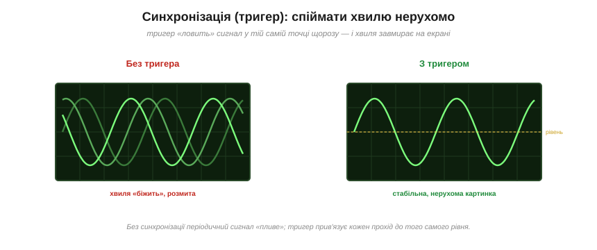
*Рис. 1.6.7.4. Тригер (синхронізація) «ловить» сигнал у тій самій точці щороз — і періодична хвиля завмирає нерухомо. Без нього вона «біжить» і розмивається.*

Є одна тонкість, без якої екран — суцільна каша. Осцилограф малює сигнал **знову й знову**, проходячи екран зліва направо. Якщо кожен прохід починати «з будь-де», періодична хвиля щоразу зміщується — і на екрані виходить **розмита плутанина**. Рятує **тригер** (*trigger*, синхронізація): він каже приладу починати малювати **щоразу з тієї самої точки** сигналу (скажімо, коли напруга проходить певний рівень угору). Тоді кожен прохід лягає на попередній **точно** — і хвиля **завмирає** нерухомо, її стає видно. Налаштувати тригер — перше, що роблять, отримавши «біжучу» картинку.

### Що видно осцилографу

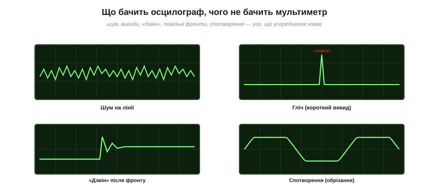
*Рис. 1.6.7.5. Осцилограф показує те, що усереднення мультиметра ховає: шум на лінії, короткі викиди (глічі), «дзвін» після фронту, спотворення (обрізання) сигналу.*

Найцінніше в осцилографі — він показує те, що мультиметр **усереднив би й сховав**: **шум** на лінії живлення, короткі **викиди** (глічі), що збивають логіку; **«дзвін»** (загасальні коливання) після різкого фронту; повільні **фронти**; **спотворення** сигналу (наприклад, обрізання верхівок синусоїди в перевантаженому підсилювачі). Усе це — динамічні, часові явища, невидимі для приладу, що дає одне число. Тому в налагодженні швидких чи аналогових кіл осцилограф **незамінний**: він буквально дає **очі**, щоб побачити, що насправді робить сигнал.

Більшість осцилографів мають **два (а то й більше) канали** — тож можна показати дві хвилі водночас і порівняти їх: вхід і вихід підсилювача, дві лінії шини зв'язку, сигнал та його відгук. Це безцінно, коли цікавить не один сигнал, а **зв'язок** між ними.

> 🔧 **Навіщо це.** Запам'ятайте розподіл ролей: **мультиметр** відповідає «скільки» (значення), **осцилограф** — «яка форма й коли» (поведінка в часі). Вони не конкурують, а **доповнюють** одне одного. Осцилограф потрібен щоразу, коли сигнал **змінюється**: цифрові рівні, ШІМ (керування яскравістю/швидкістю), зв'язок між мікросхемами, звук, живлення з пульсаціями. Ключ до читабельної картинки — **тригер**: спершу налаштуйте його, інакше хвиля «втече». Сьогодні осцилографи цифрові, є навіть дешеві USB-приставки до комп'ютера — тож цей колись недосяжний прилад тепер під рукою в кожного. У Модулях 2–3, коли підемо в сигнали й керування, осцилограф стане вашим найкращим діагностом.

---

Підсумок §1.6.7: **осцилограф** показує сигнал **у часі** — графік напруги (вертикаль) від часу (горизонталь), на відміну від одного числа мультиметра. Масштаб задають «В/поділка» і «час/поділка»; амплітуду й період рахують у поділках, а частоту — як f = 1/T. **Тригер** (синхронізація) робить періодичну хвилю нерухомою. Осцилограф розкриває те, що усереднення ховає: шум, глічі, «дзвін», спотворення. Мультиметр і осцилограф — доповнювальні інструменти: «скільки» і «яка форма». А виник осцилограф із електронно-променевої трубки Карла Брауна — про неї наступна вставка.

> 📜 **Історична вставка:** [Браун і електронно-променева трубка](ch06-s7-history-crt.md) — як пучок електронів став «пером зі світла».

---

## 1.6.8 Похибки й безпека вимірювань

Остання, але чи не найважливіша тема всього Модуля 1 — про **тверезе ставлення** до вимірів. Бо два правила вирізняють зрілого інженера від новачка: він знає, що **жоден вимір не ідеальний**, і він **поважає електрику**, яка може скалічити. Засвоїмо обидва.

### Прилад завжди трохи спотворює


*Рис. 1.6.8.1. Ідеальних приладів немає: вольтметр відбирає крихту струму (тож читає трохи менше), амперметр додає крихту опору (тож струм трохи зменшується). Похибка зазвичай мала, та в точних вимірах її враховують.*

Ми вже знаємо це з історії розділу та §1.5.1: **підключений прилад трохи змінює коло**. Вольтметр має не нескінченний, а просто **великий** опір — тож трохи **навантажує** коло. У типовому випадку (скажімо, вимір на дільнику) він через це показує **трохи менше** за справжнє; у складнішій мережі напрямок похибки залежить від схеми, але **сам факт** втручання лишається. Амперметр має не нульовий, а **малий** опір — тож додає краплю опору й трохи **зменшує** струм, який міряє. Здебільшого ці похибки мізерні, але вони **завжди є**: вимірюючи коло, ви міряєте коло, **уже змінене** фактом вимірювання. Перший крок до точності — пам'ятати про це.

Покажемо на числах, наскільки «крихта струму» псує показ. Візьмемо дільник із двох однакових 10 кОм від 10 В і поміряймо напругу на середній точці вольтметром із входом 1 МОм:

```
Дільник 10 кОм + 10 кОм від 10 В; міряємо середню точку:
  істинна напруга    U₀ = 10 · 10/(10+10)        = 5.000 В
  вольтметр 1 МОм паралельно нижньому плечу 10 кОм:
  10 кОм ∥ 1 МОм                                  ≈ 9.901 кОм
  показ              U  = 10 · 9.901/(10+9.901)   ≈ 4.975 В
  відносна похибка      (5.000 − 4.975)/5.000     ≈ 0.5 %
```

Бачите механізм: вольтметр (1 МОм) став **паралельно** нижньому плечу (10 кОм) і трохи його «просадив» — з 10 до 9.9 кОм, тож показ упав на пів відсотка. Якби джерело було «жорсткіше» (плечі по 1 кОм), похибка вийшла б у десять разів менша; а на високоомному колі — навпаки, помітнішою. Звідси практичне правило: **що більший опір кола, то дужче прилад його спотворює** — і то ретельніше треба зважати на скінченний вхідний опір вольтметра.

### Точність, влучність, роздільність

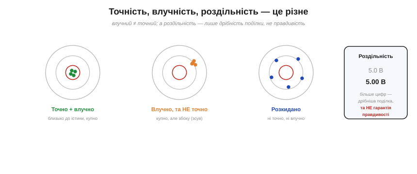
*Рис. 1.6.8.2. Три різні поняття. **Точність** — близькість до істини (центр). **Влучність** — повторюваність (купність), хай навіть збоку. **Роздільність** — дрібність поділки на табло; більше цифр не означає правдивіше.*

Три слова, які часто плутають, а вони геть різні. **Точність** (*accuracy*) — наскільки показ близький до **істини**. **Влучність**, або повторюваність (*precision*) — наскільки **купно** лягають повторні виміри (хай навіть усі вони збоку від істини). І **роздільність** (*resolution*) — наскільки **дрібна** поділка на табло (скільки цифр). Підступ ось у чому: прилад може показувати «5.000 В» (висока роздільність), а насправді брехати на пів вольта (низька точність). **Більше цифр — не гарантія правди.** Тому в паспорті приладу шукають не кількість цифр, а **клас точності** (наприклад, ±0.5 % ± 2 одиниці).

Розшифруймо цей загадковий запис на числі — і побачимо, скільки цифр на табло варті довіри:

```
Показ 5.000 В; паспорт «±0.5 % показу ± 2 одиниці»; молодша цифра 0.001 В:
  частка від показу   0.5 % · 5.000     = 0.025 В
  «± 2 одиниці»       2 · 0.001          = 0.002 В
  повна похибка       0.025 + 0.002      = 0.027 В
  результат           5.000 ± 0.027 В   → істина десь у 4.97 … 5.03 В
```

Висновок витвережує: попри гарні «5.000», правда лежить десь між 4.97 і 5.03 В — тобто останні **дві** цифри показу майже нічого не важать. Ось чому грамотний інженер записує результат **із похибкою** (5.00 ± 0.03 В), а не сліпо переписує всі цифри з табло: зайві знаки створюють **оману точності**, якої насправді немає. Знати, скільки цифр у вашому числі справжні, — окреме й важливе вміння.

### Систематичні й випадкові похибки

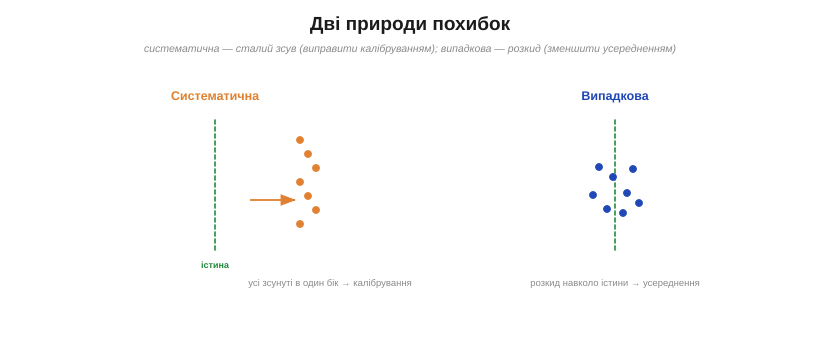
*Рис. 1.6.8.3. Дві природи похибок: **систематична** — сталий зсув в один бік (виправляється калібруванням); **випадкова** — розкид навколо істини (зменшується усередненням багатьох вимірів).*

Похибки бувають двох природ, і боротися з ними треба **по-різному**. **Систематична** похибка — це сталий **зсув** в один бік (прилад завжди завищує на 0.1 В, лінійка стерта з краю). Усереднення тут не поможе — усі виміри зсунуті однаково; рятує лише **калібрування** (звірка з еталоном, §історія про Вестона). **Випадкова** похибка — це **розкид** туди-сюди навколо істини (шум, дрижання останньої цифри). Її, навпаки, **усереднення** зменшує: зробив багато вимірів, узяв середнє — і випадкові відхилення взаємно гасяться. Розрізняти ці дві природи — ознака вмілого вимірювача.

### Безпека: струм крізь тіло вбиває

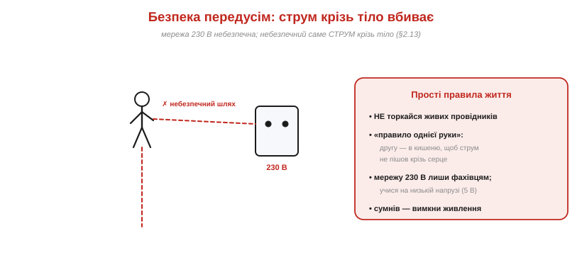
*Рис. 1.6.8.4. Електрика небезпечна: мережа 230 В може вбити, і небезпечний саме струм крізь тіло (§1.2.13). Прості правила: не торкатися живого, «правило однієї руки», лишити мережу фахівцям, а вчитися на безпечних 5 В.*

А тепер найсерйозніше. Електрика **вбиває** — і вбиває саме **струм крізь тіло** (пригадайте §1.2.13), а не «вольти» самі по собі. Мережа **230 В** цілком здатна пропустити крізь людину смертельний струм. Тому затямте кілька правил, що рятують життя. **Не торкайтеся** живих провідників. Користуйтеся **«правилом однієї руки»** — другу тримайте в кишені, щоб струм випадково не пішов **крізь серце** від руки до руки. **Мережеву** напругу лишіть фахівцям, а вчіться на **безпечних** низьких напругах (5 В макетної плати вас струмом не вб'ють — це наднизька, SELV-напруга). Тільки затямте: «безпечна щодо удару» — не означає «безпечна геть»: навіть на 5 В потужне джерело дає великий **струм**, що гріє дроти, плавить ізоляцію й може спричинити пожежу чи опік (а літієві акумулятори — ще й загорітися). І золоте правило: **маєте сумнів — вимкніть живлення**.

### Бережіть прилад і коло

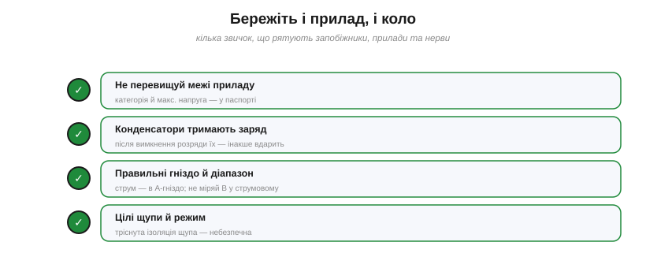
*Рис. 1.6.8.5. Кілька звичок бережуть прилад і коло: не перевищувати межі приладу, розряджати конденсатори перед роботою, обирати правильні гніздо й діапазон, стежити за цілістю щупів.*

Нарешті — звички, що бережуть і техніку, і нерви. **Не перевищуйте межі приладу** (максимальну напругу й категорію безпеки з паспорта). Пам'ятайте, що **конденсатори тримають заряд** і після вимкнення живлення — великий конденсатор у блоці живлення може **вдарити** через хвилини; перед роботою його **розряджають**. Завжди обирайте **правильні гніздо й діапазон** (струм — лише в струмове гніздо!). І стежте за **цілістю щупів** — тріснута ізоляція небезпечна. Дрібні звички — велика різниця між спокійною роботою і згорілим приладом (чи пальцями).

> 🔧 **Навіщо це.** Винесіть із цієї теми два сталі переконання. Перше — **здоровий скепсис**: число на табло це не свята істина, а **оцінка з похибкою**; добрий інженер питає «наскільки точно?», розрізняє точність/влучність/роздільність і знає, що систематичну похибку лікують калібруванням, а випадкову — усередненням. Друге, найважливіше — **безпека**: електрика не прощає недбалості, тож поважайте мережу, тримайте одну руку в кишені, розряджайте конденсатори, вчіться на низькій напрузі й за найменшого сумніву вимикайте живлення. Розумний скепсис і обережність — це не боягузтво, а професіоналізм; саме вони відрізняють майстра, що працює роками, від того, хто спалив прилад (чи гірше) на першому ж тижні.

---

## Підсумок Розділу 1.6

Ми опанували **практичну грамоту** інженера — мову й інструменти:

- **Принципова схема** (§1.6.1) — карта зв'язків, не фото; топологія, а не «географія».
- **Символи** (§1.6.2), **вузли й крапки-з'єднання** (§1.6.3), **«земля» та шини живлення** (§1.6.4) — абетка й синтаксис схеми.
- **Як читати схему** (§1.6.5) — рецепт «живлення → блоки → сигнал → вузли → номінали» й упізнавання патернів.
- **Мультиметр** (§1.6.6) і **осцилограф** (§1.6.7) — «скільки» і «яка форма»; а **похибки й безпека** (§1.6.8) — тверезе й безпечне користування ними.

За лаштунками — людська драма винаходу приладів: від компасної стрілки **Ерстеда** до точних приладів **Вестона** й «пера зі світла» **Брауна** ([історія розділу](ch06-history-instruments.md), [Вестон](ch06-s6-history-weston.md), [Браун](ch06-s7-history-crt.md)).

---

## 🎉 Підсумок Модуля 1 — «Фізика електрики й кіл»

Ми пройшли довгий і цілісний шлях — від невидимого заряду до приладу в руці:

- **Розділ 1.1** — заряд, **поле**, потенціал і напруга: звідки все береться.
- **Розділ 1.2** — **напруга, струм і провідність**: що тече в дроті й чому.
- **Розділ 1.3** — **опір, потужність і тепло**: перші числа й перша деталь (резистор).
- **Розділ 1.4** — **закони Кірхгофа**: як розрахувати будь-яку мережу.
- **Розділ 1.5** — **еквівалентні схеми**: звести складне до «джерело + опір» (Тевенін, Нортон).
- **Розділ 1.6** — **мова схем і вимірювання**: як це накреслити, прочитати й перевірити.

Тепер ви **розумієте кола** — не як магію, а як струнку фізику, яку можна порахувати, накреслити й виміряти. А наскрізна нитка історій показала, що за кожним законом стоять живі люди: Кулон і Фарадей, Ом і Джоуль, Кірхгоф і Ейлер, Тевенен і Нортон, Ерстед, Вестон і Браун — і їхня вперта боротьба за розуміння.

### Що далі

Дотепер наші деталі були **пасивні** (резистори) та **ідеалізовані**. Та справжня електроніка починається з **активних** і нелінійних компонентів: **діод**, що пропускає струм в один бік; **транзистор**, що підсилює й перемикає; **конденсатор** та **котушка**, що працюють із часом і частотою; **операційний підсилювач**. З них будують підсилювачі, фільтри, джерела живлення й логіку. Саме до них — у **Модуль 2 «Аналогова електроніка»** — і лежить наступний крок. Фундамент закладено; час зводити на ньому будівлю.

> ▶️ Далі — **Модуль 2. Аналогова електроніка**: напівпровідники, діоди, транзистори, конденсатори й котушки, операційні підсилювачі — активні компоненти, що оживляють схему.
