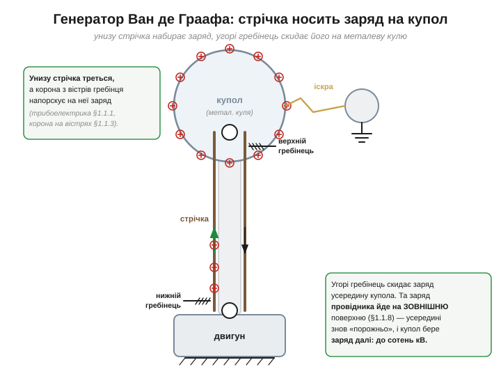

# 🔌 Генератор Ван де Граафа: сотні кіловольт із гумової стрічки

> Компонентна вставка до теми [§1.1.2 «Сила між зарядами: закон Кулона»](charge-field-potential.md). §1.1.2 показав: навіть мікрокулон дає велетенську силу, тому вільний заряд у природі дрібний. А чи можна **навмисно** накопичити величезний заряд і втримати його? Так — і найнаочніша така машина, генератор Ван де Граафа (*Van de Graaff generator*), зібрана буквально з мотора, гумової стрічки й металевої кулі. Її варто розібрати, бо в ній разом працюють одразу три ідеї нашого розділу.

### Що це й навіщо

Це **електростатичний генератор високої напруги**: перетворює механічний рух (мотор крутить стрічку) на накопичений заряд і **сотні кіловольтів** на металевому куполі. Винайшов його близько 1929 року американський фізик **Роберт Ван де Грааф** (*Robert J. Van de Graaff*, 1901–1967); великі машини колись правили за джерело високої напруги для перших прискорювачів частинок, а малі дотепер стоять у кожному фізкабінеті (волосся дибки, тріск іскор). Сила струму при цьому **мізерна** — мікроампери, — тож шкільна машина радше лоскоче й тріщить, аніж загрожує життю (хоча іскра неприємна, а для електроніки поряд — згубна).

### Як побудована

*Рис. 1.1.2c.1. Будова генератора. Двигун крутить гумову стрічку між двома роликами. Унизу гребінець коронним розрядом заряджає стрічку; вона несе заряд угору; верхній гребінець скидає його на купол. Заряд осідає на **зовнішній** поверхні кулі (§1.1.8), тож купол усе набирає напругу — до сотень кіловольт, аж до іскри.*

П'ять простих частин: **двигун** із нижнім роликом; **гумова (діелектрична) стрічка**, натягнута між нижнім і верхнім роликами; два **металеві гребінці** (щітки) з гострими вістрями — нижній біля основи, верхній усередині купола; і сам **купол** — велика гладка металева куля на ізоляційній колоні.

### Як працює — три ідеї розділу разом

1. **Зарядка стрічки внизу (трибоелектрика §1.1.1 + корона §1.1.3).** Ролик і стрічка з різних матеріалів труться — і за трибоелектричним рядом стрічка набирає заряд певного знаку. Допомагає нижній гребінець: на його гострих вістрях поле таке сильне (§1.1.3), що повітря біля них іонізується — виникає **корона**, яка «напорскує» заряд просто на стрічку.
2. **Транспорт.** Стрічка, мов конвеєр, несе цей заряд угору, всередину купола.
3. **Скид угорі — і головний трюк (§1.1.8).** Верхній гребінець знімає заряд зі стрічки коронним розрядом і віддає куполу. Чому ж купол не «наповнюється» й не починає відштовхувати новий заряд? Бо заряд провідника завжди сідає на його **зовнішню** поверхню (§1.1.8): усередині купола поле лишається нульовим, тож гребінцю там завжди «вільно» скидати ще і ще. Купол накопичує заряд доти, доки напруга не сягне межі пробою повітря, — і тоді з нього зривається **іскра**.

### Типові граблі

- **Вологість — головний ворог.** У вологому повітрі заряд стікає зі стрічки й купола швидше, ніж його приносять; у сиру погоду машина ледь працює. Суха кімната — майже обов'язкова.
- **Гострі краї = передчасний пробій.** Купол роблять **гладким** і круглим (§1.1.3): будь-яка задирка чи дротик на ньому стане «вістрям», що стече заряд короною, не давши набрати напруги.
- **Електроніка поряд гине.** Сотні кіловольт і розряди — потужне джерело ESD та наводок; чутливі схеми тримають подалі або в екрані (§1.1.8).
- **Полярність** залежить від пари матеріалів ролик/стрічка — її задає саме трибоелектричний ряд (§1.1.1).

### Варіації класу

Шкільна машина — це класичний «стрічковий» Ван де Грааф. У великих прискорювачах стрічку замінюють ланцюжком металевих ланок в ізоляторі (**пелетрон**, *Pelletron*) — він довговічніший і стабільніший; а в **тандемних** генераторах той самий купол використовують двічі, розганяючи частинки спершу до нього, потім від нього. Принцип скрізь однаковий: механічно переносити заряд на ізольований провідник, що тримає його на зовнішній поверхні.
