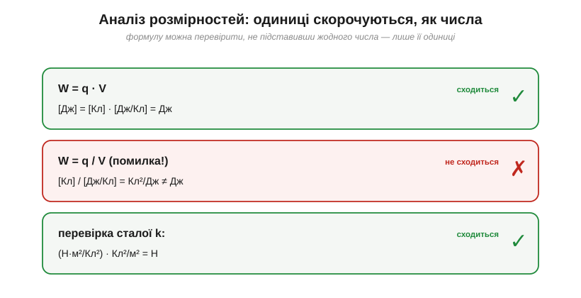

# 🧮 Аналіз розмірностей: ловимо помилки у формулах ще до чисел

> Це математична вставка до теми [§1.1.5 «Головна думка: вольт — це джоуль на кулон»](charge-field-potential.md). §1.1.5 показав силу запису через одиниці: В = Дж/Кл. Це не формальність, а **безкоштовна перевірка** будь-якої формули. Перш ніж підставляти числа, варто глянути, чи **сходяться одиниці** обох частин рівняння; якщо ні — формула майже напевно хибна. Звичка перевіряти розмірності рятує від десятків помилок ще до калькулятора.

### Головне правило: рівняння сходиться не лише в числах, а й в одиницях

У кожній фізичній рівності ховається друга, прихована рівність — **рівність одиниць**. Ліва й права частини мусять мати **однакову** розмірність: джоуль не може дорівнювати ньютону, а вольт — амперу. Це не вимога акуратності, а закон: складати чи прирівнювати можна лише величини того самого роду. Тому, написавши формулу, корисно одразу спитати: а чи зійдуться в ній одиниці?

### Одиниці — це алгебра

Перевіряють просто: замість кожної величини підставляють її **одиниці** й скорочують їх, як звичайні множники.


*Рис. 1.1.5m.1. Метод у дії. Підставляємо замість величин їхні **одиниці** й скорочуємо, як числа. Якщо ліва й права частини дають те саме — формула проходить перевірку (зелене); якщо ні — десь помилка (червоне). Жодного числа підставляти не треба.*

Скажімо, формулу енергії W = q·V (§1.1.5) перевіряють так:

```
[W] = [q]·[V] = Кл · (Дж/Кл) = Дж   ✓   (кулони скоротилися)
```

А заразом видно, що одиниця поля Н/Кл і В/м — це **те саме** (§1.1.4): В/м = (Дж/Кл)/м = (Н·м/Кл)/м = Н/Кл. І стала Кулона k мусить мати саме такі одиниці, щоб із зарядів і відстані вийшли ньютони (це ми вже перевіряли в §1.1.2).

### Дві щоденні перевірки

**Спіймати переплутану формулу.** Якщо ви завагалися, енергія — це q·V чи q/V, одиниці вирішують суперечку миттєво:

```
q·V → Кл·(Дж/Кл) = Дж        ✓  енергія
q/V → Кл/(Дж/Кл) = Кл²/Дж    ✗  це взагалі не джоулі
```

**Знати, якими мусять бути одиниці результату.** Якщо ви рахуєте те, що має бути енергією, а виходять «кулони на джоуль», — десь помилка, і шукати її треба, не чекаючи числової відповіді.

### Обережно: префікси розмірність НЕ ловить

Важливе застереження. Перевірка одиниць ловить помилку **роду** величини (джоуль замість ньютона), але **не** ловить помилку в тисячу разів через префікс: міліметри замість метрів, мА замість А, мкФ замість Ф. Розмірність «метр» однакова що для мм, що для м. Тому золоте правило: спершу перекладай усе в **базові одиниці СІ** (метри, не міліметри), а тоді рахуй. Аналіз розмірностей і акуратність із префіксами — дві окремі звички, і потрібні обидві.

### Де це працює в курсі

Це рефлекс інженера: **спершу одиниці, потім числа**. Кожну формулу з даташита варто пропустити крізь цю перевірку. Так само виводять і нові одиниці курсу — кожна наступна складається з уже відомих (наприклад, далі ом виявиться вольтом на ампер, а фарад — кулоном на вольт). А ще розмірності бувають такі сильні, що дозволяють **відновити форму** незнайомої формули з точністю до сталого множника — лише з того, які величини в неї входять і якими мають бути одиниці відповіді.
