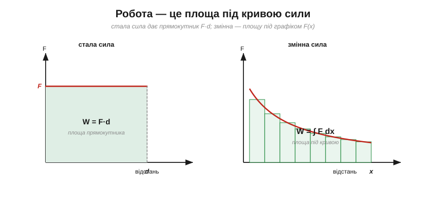
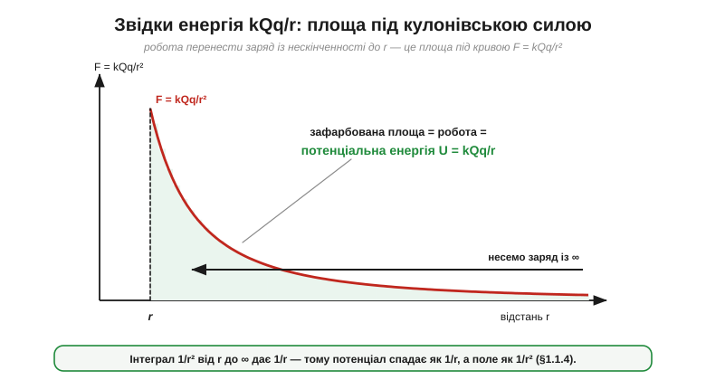

# 🧮 Робота як інтеграл: площа під кривою сили

> Це математична вставка до теми [§1.1.4 «Робота, потенціальна енергія й потенціал»](charge-field-potential.md). §1.1.4 порахував роботу простою формулою W = F·d — але лише коли сила **стала**. А кулонівська сила (§1.1.2) з відстанню **міняється** (як 1/r²): везти заряд проти неї важче зблизька й легше здалеку. Як тоді рахувати роботу? Відповідь — **інтеграл**, і суть його зовсім не страшна: це просто **площа під графіком сили**.

### Стала сила — це прямокутник

Намалюймо силу як графік: по горизонталі — пройдена відстань, по вертикалі — сила. Якщо сила стала, графік — горизонтальна пряма, а робота W = F·d — це площа **прямокутника** під нею (висота F, ширина d). Ось перша й головна думка: **робота = площа під кривою сили**.


*Рис. 1.1.4m.1. Робота як площа. Ліворуч: стала сила — площа прямокутника, W = F·d. Праворуч: змінна сила — площу під кривою набирають із тонких смужок F·Δx; у границі нескінченно тонких смужок це і є інтеграл W = ∫F dx.*

### Змінна сила — площа під кривою

Коли сила залежить від положення, прямокутник уже не годиться. Та рятує проста ідея: розіб'ємо шлях на крихітні кроки Δx, такі дрібні, що на кожному силу можна вважати **сталою**. Робота на одному кроці — це вузенька смужка площею F(x)·Δx. Уся робота — сума всіх смужок:

```
W ≈ F(x₁)·Δx + F(x₂)·Δx + … = Σ F(xi)·Δx
```

Що тонші смужки, то точніша сума. Спрямувавши Δx до нуля (нескінченно багато нескінченно тонких смужок), дістаємо **точну** площу під кривою — і саме її позначають [інтегралом](book:math/integral):

```
W = Σ F(xi)·Δx      →      W = ∫ F dx
```

Знак ∫ — це витягнута літера «S» від «Sum» (сума). Він не означає нічого містичного: **інтеграл — це площа під графіком** між двома межами, тобто накопичений ефект величини, що змінюється. (Похідна з [§1.1.6](charge-field-potential.md) була нахилом; інтеграл — площа. Це дві обернені дії: нахил роздрібнює, площа накопичує.)

### Звідки береться енергія kQq/r

Тепер застосуймо це до Кулона — і дістанемо формулу, яку §1.1.4 узяв майже з повітря. Щоб перенести заряд із нескінченності до відстані r проти сили F = kQq/r², треба виконати роботу, що дорівнює площі під цією кривою:


*Рис. 1.1.4m.2. Кулонівський випадок. Сила F = kQq/r² швидко спадає; робота перенести заряд із нескінченності до r — це зафарбована площа під нею. Інтеграл 1/r² дає 1/r, тож потенціальна енергія U = kQq/r спадає на один степінь повільніше за силу.*

```
U = ∫(від ∞ до r) F dr = k·Q·q · ∫ dr/r²  =  k·Q·q / r
```

Уся хитрість — в одному математичному факті: **інтеграл від 1/r² дорівнює 1/r** (з точністю до знаку). Ось чому сила спадає як 1/r², а енергія (і потенціал V = U/q = kQ/r) — лише як 1/r: інтеграл завжди «на степінь повільніший» за свій підінтегральний вираз. Це й є точний зміст фрази з §1.1.4: «потенціал — це накопичена робота вздовж усього шляху». Накопичена = проінтегрована = площа під кривою.

### Де це працює в курсі

«Площа під кривою» — один із двох наскрізних інструментів курсу (другий, обернений, — «нахил», тобто похідна). Потенціал — це інтеграл поля вздовж шляху (V = ∫E·dx); згодом **заряд** виявиться інтегралом струму за часом (площа під графіком I(t)), а **енергія** — інтегралом потужності. І щоразу практичний бік той самий: у коді інтеграл — це звичайна **сума, що накопичується в циклі** (додаємо F·Δx крок за кроком). Саме так будь-який симулятор рахує роботу й енергію, коли точної формули під рукою немає.
