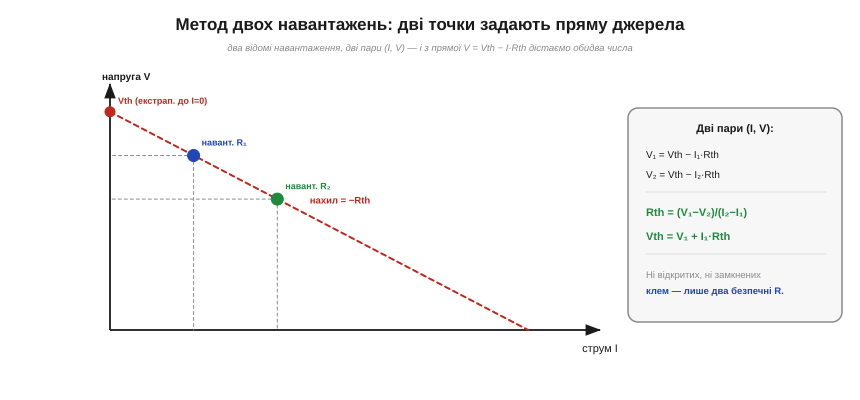
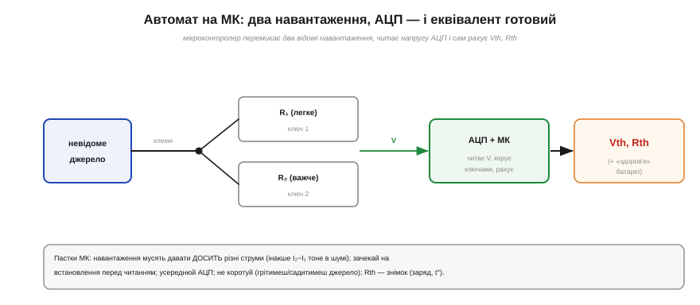

# ⚙️ Виміряти Vth і Rth на столі: метод двох навантажень

> Алгоритмічна вставка до теми [§1.5.5 «Як знайти Vth, Rth»](equivalent-circuits.md). §1.5.5 показав, як **порахувати** еквівалент Тевеніна, коли коло відоме. А що, як перед вами **чорна скринька** — батарея, блок живлення, вихід давача, — нутра якої не видно? Тоді Vth і Rth доводиться **виміряти** ззовні. Найнадійніший спосіб для цього — **метод двох навантажень**, і його легко доручити мікроконтролеру.

### Задача

Маємо двоклемне джерело з невідомими Vth і Rth. Розкривати його не можна, замикати клеми накоротко — небезпечно (§1.5.5), а «холостий хід» вольтметром буває ненадійним (прилад сам трохи навантажує). Треба знайти обидва числа, лише **подаючи відомі навантаження** й міряючи напругу на клемах.

### Ідея: дві точки задають пряму

Згадаймо §1.5.1: характеристика реального джерела — **пряма** V = Vth − I·Rth. А пряму однозначно задають **дві точки**. Тож подаймо два різні відомі навантаження R₁ і R₂, зміряймо на клемах напруги V₁, V₂ (струми порахуємо як I = V/R) — і дістанемо дві точки на цій прямій.


*Рис. 1.5.5a.1. Два навантаження дають дві пари (I, V) на прямій V = Vth − I·Rth. Нахил прямої — це −Rth, а її продовження до I = 0 — це Vth. Не потрібні ні розімкнені (холостий хід), ні замкнені (коротке) клеми — лише два безпечні резистори.*

Маємо систему з двох рівнянь:

```
V₁ = Vth − I₁·Rth
V₂ = Vth − I₂·Rth
```

Відняв одне від одного — і обидва числа знайдено:

```
Rth = (V₁ − V₂) / (I₂ − I₁)
Vth = V₁ + I₁·Rth
```

Геометрично це просто: **нахил** прямої дає −Rth, а її продовження до I = 0 — це Vth. Жодних крайнощів — ні короткого замикання, ні чистого холостого ходу.

### Псевдокод

Метод чудово автоматизується: два резистори, перемикані ключами (транзисторами), і АЦП на клемах.

```
підключити R₁;  зачекати на встановлення;  V₁ ← read_adc();  I₁ ← V₁ / R₁
підключити R₂;  зачекати на встановлення;  V₂ ← read_adc();  I₂ ← V₂ / R₂
Rth ← (V₁ − V₂) / (I₂ − I₁)
Vth ← V₁ + I₁ · Rth
```


*Рис. 1.5.5a.2. Мікроконтролер перемикає два відомі навантаження R₁, R₂, читає напругу на клемах через АЦП і сам рахує Vth та Rth — по суті, готовий тестер внутрішнього опору й «здоров'я» батареї.*

Так влаштовані тестери акумуляторів і вимірювачі внутрішнього опору: МК сам прикладає навантаження, читає напругу й видає Vth, Rth.

### Складність і пастки на МК

Самі обчислення тривіальні (кілька дій), та диявол — у деталях вимірювання:

- **Навантаження мають давати ДОСИТЬ різні струми.** У знаменнику стоїть (I₂ − I₁); якщо два навантаження близькі, ця різниця крихітна, і шум АЦП роздуває похибку. Бери одне **легке**, друге **важче** — щоб точки лягли далеко одна від одної на прямій.
- **Час встановлення.** Після перемикання навантаження напруга на клемах усідається не вмить (хімія батареї, ємності) — **зачекай**, перш ніж читати АЦП, інакше зміряєш перехідний процес.
- **Шум і усереднення.** Віднімання V₁ − V₂ двох близьких чисел підсилює шум; усереднюй кілька відліків АЦП і бери досить різні навантаження.
- **Не перевантаж.** Замале R наближає коротке замикання: стресує джерело й ключ, а батарею **гріє й садить** (I²R, §1.3.6). Тримай струми в безпечних межах; для слабких джерел корисне **імпульсне** навантаження (коротко увімкнув, зміряв, вимкнув).
- **Rth — це знімок.** Внутрішній опір батареї залежить від заряду, температури й самого струму (§1.5.1c). Виміряне Rth справедливе **тут і зараз**; для іншого режиму воно інше.

Отак, маючи лише два резистори, ключі й АЦП, мікроконтролер визначає еквівалент Тевеніна будь-якого реального джерела — і, до речі, стежить за «здоров'ям» акумулятора: зростання Rth певно вказує, що батарея старіє.
