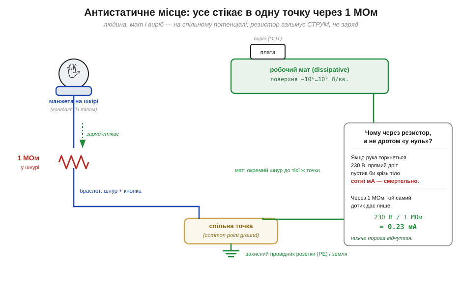
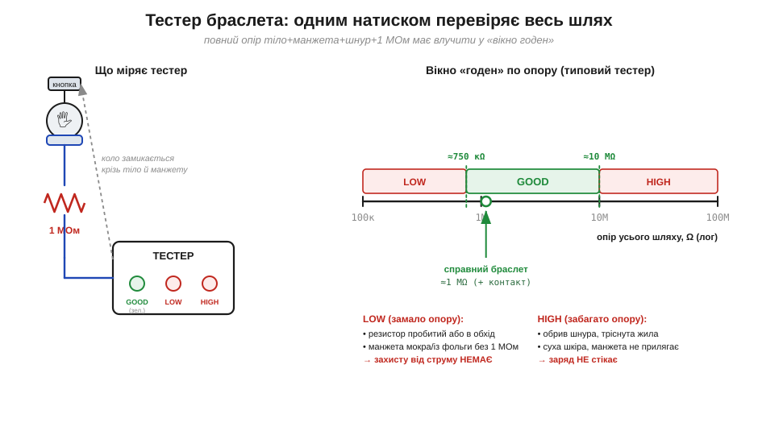

# 🔌 Браслет, мат і тестер браслетів зблизька

> 🔌 Компонентна вставка до теми [§1.10.6 «Антистатичне робоче місце: браслет, мат, заземлення»](esd-static.md). Там ми домовилися, **навіщо** заземлювати себе й стіл і **чому скрізь стоїть 1 МОм**. Тут розберемо ці предмети як **прилади зі своїм паспортом**: що в них усередині, куди приєднується який провід і як перевірити, що захист справді працює, а не лежить на столі для годиться.

## Клас: засоби персонального заземлення

Антистатичний набір — це не «дроти в нуль», а сімейство **засобів персонального заземлення** (*personal grounding*): браслет на зап'ясток (*wrist strap*), розсіювальний робочий мат (*dissipative mat*) і тестер, що їх перевіряє. Усі вони роблять одне — **спокійно зливають заряд** із тіла й поверхонь у землю, не даючи накопичитися кіловольтам зі §1.10.1. Слово «спокійно» тут ключове: розряд має бути **повільним і слабким**, бо різкий стрибок струму сам по собі — це той самий імпульс, що вбиває мікросхему (§1.10.5).

## Куди що приєднується

Знаючи, з чого складається набір, погляньмо, як ці три предмети з'єднують між собою. Головна ідея монтажу: **усе сходиться в одну точку**. Її так і звуть — **спільна точка заземлення** (*common point ground*, CPG): один вузол, від якого вже йде провід на захисний контакт розетки (PE) або на технологічну землю.

*Рис. 1.10.6c.1. Людина, мат і виріб опиняються на спільному потенціалі. У шнурі браслета й у шнурі мата ввімкнено по резистору **1 МОм**: він пропускає повільне стікання заряду, але обмежує струм, якби тіло торкнулося напруги. Праворуч — арифметика, чому саме мегаом, а не прямий дріт.*

- **Браслет** — це провідна **манжета** (стрічка з вплетеним сріблястим волокном) щільно на шкірі, від неї — **кнопка** й витий шнур до CPG. У шнурі (зазвичай у самій кнопці) захований резистор **1 МОм**.
- **Мат** має провідний шар; його окрема **кнопка** йде своїм шнуром до тієї самої точки, теж через 1 МОм. Поверхня мата не є чистим провідником — вона **розсіювальна** (опір по поверхні ~10⁶…10⁹ Ω на квадрат): достатньо, щоб заряд стікав, але не так різко, щоб ударити виріб розрядом.
- **Виріб** лежить на маті — і опиняється на тому самому потенціалі, що й рука. А коли всі частини мають **однаковий** потенціал, перетікати немає чому: різниці напруг нема — нема й розряду.

> 🔧 **Навіщо це.** Заземлюють не «в землю заради землі», а заради **спільного потенціалу**: рука, мат, паяльник і плата на одному рівні — і небезпечної різниці, яка б проскочила іскрою в чутливий вхід, просто не виникає.

## Перша перевірка: як «заговорити» з тестером

Спільний потенціал тримається лише доти, доки коло справді проводить, — а ось у цьому й криється підступ. Браслет — єдиний засіб захисту, який **тихо відмовляє**: волокно манжети перетирається, шнур ламається в жилі, шкіра пересихає — і ви працюєте, гадаючи, що заземлені, а насправді ні. Тому є окремий прилад — **тестер браслета**. Ним не «вмикаються», а коротко перевіряються: надіти браслет, притиснути пальцем контактну пластину — і прилад жене крізь усе коло (тіло → манжета → шнур → 1 МОм) мікроскопічний струм та міряє **повний опір шляху**.

*Рис. 1.10.6c.2. Тестер міряє опір усього кола й порівнює з **вікном**. Типове вікно браслета — приблизно **750 кΩ … 10 МΩ**: нижче — щось закоротило резистор (захисту нема), вище — обрив чи поганий контакт (заряд не стікає). Зелене світло — годен; два краї відмови мають різні причини.*

Результат — не число, а світло: **зелене «годен»** або відмова. І відмови дві, різні за змістом. **Замало опору** (*low fail*, нижче ~750 кΩ) означає, що 1 МОм кудись зник — резистор пробитий або манжета закоротила шнур; струмового захисту вашого тіла більше **немає**. **Забагато опору** (*high fail*, вище ~10 МΩ) — це обрив: тріснула жила шнура, висохла шкіра, манжета бовтається; заряд просто **не стікає**.

## Граблі

Тестер ловить несправне коло лише в момент перевірки — більшість же провалів стається саме між перевірками, через звички й дрібниці монтажу. Найчастіші з них такі.

- **«Носив — отже, заземлений».** Ні. Браслет перевіряють перед зміною (а критичні робочі місця тримають на **безперервному моніторі**, що пищить миттєво).
- **Манжета поверх рукава.** Контакт іде по сухій тканині — опір вилітає у *high fail*, захисту нема.
- **«Заземлюся прямо, без резистора».** Смертельно небезпечно: прямий дріт на руці перетворює випадковий дотик до 230 В на струм у сотні мА крізь серце. 1 МОм лишає 230 В / 1 МОм = **0.23 мА** — нижче порога відчуття.
- **Мат «у нуль» дротом без резистора.** Так само небезпечно й до того ж б'є по виробу різким розрядом — мат теж заземлюють через 1 МОм.

## Варіації класу

Манжета на зап'ясток — лише найзвичніший представник класу; варто знати, які ще форми персонального заземлення існують і за якими нормами їх судять. Браслети бувають **дротяні** (надійніше, бо тестовані) і **бездротові** — останні фізики не мають: без кола до землі заряду нікуди стікати, тож це радше плацебо. Стандарт **ANSI/ESD S20.20** ставить системі браслета межу **0.8…1.2 МΩ**, а весь шлях до землі вимагає тримати нижче **35 МΩ**. Поруч стоїть рідня: **п'яткові заземлювачі** (*heel grounders*) для тих, хто рухається стоячи на розсіювальній підлозі, і **комбіновані тестери** «браслет + взуття» з двома вікнами (взуттю дозволяють ширше, ~750 кΩ … 100 МΩ, бо в колі ще й підлога).
