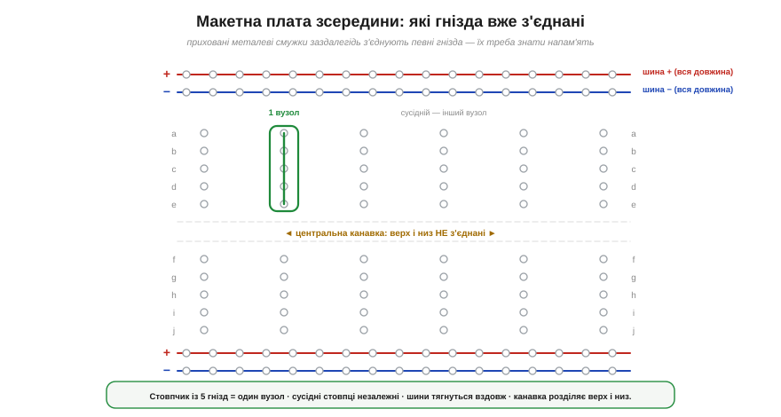
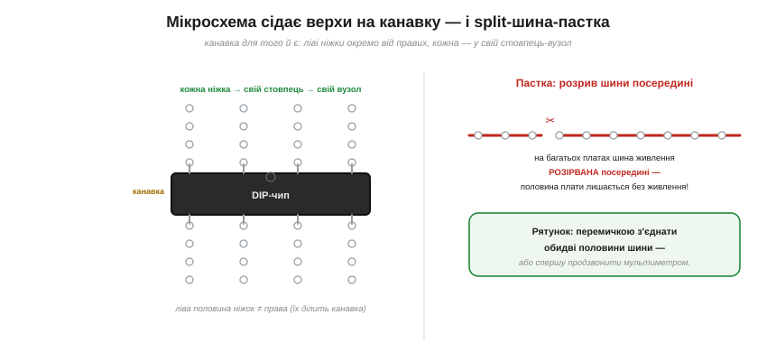

# 🔌 Макетна плата (breadboard) зсередини: які гнізда вже з'єднані

> Компонентна вставка до теми [§1.4.1 «Вузли, гілки, контури»](kirchhoff-circuit-analysis.md). §1.4.1 ввів поняття **вузла** — точки, де електрично сходяться кінці гілок. Макетна плата — це найнаочніше його втілення «в металі»: кожна її смужка гнізд є готовим **вузлом**. Зрозумієш, які гнізда вже з'єднані всередині, — і збирання схеми перетвориться на буквальне «мислення вузлами».

### Що це таке

**Макетна плата** (*breadboard*) дає змогу зібрати схему **без паяння**: ніжки деталей і кінчики проводів просто **встромляють** у гнізда, де їх затискають приховані металеві пружинки. Зручно для прототипів — вставив, спробував, переставив. Та вся хитрість у тому, що **частина гнізд уже з'єднана між собою** заздалегідь, і користуватися платою — означає знати, які саме.

### Що з'єднано всередині

*Рис. 1.4.1c.1. Приховані з'єднання макетної плати. У центральній зоні гнізда з'єднані **вертикальними** смужками по 5: кожен стовпчик із 5 гнізд — це один спільний вузол, а сусідні стовпці незалежні. **Центральна канавка** розділяє верхню й нижню половини — стовпці її не перетинають. Уздовж країв ідуть **шини живлення** (+ і −), з'єднані по всій довжині плати.*

Карта з'єднань проста, щойно її засвоїш:

- **Стовпчик із 5 гнізд = один вузол.** У центральній зоні гнізда з'єднані вертикальними смужками по п'ять. Усі п'ять гнізд одного стовпчика — електрично **одна точка** (вузол із §1.4.1); встромивши в нього кілька ніжок, ви їх **з'єднали**. Сусідній стовпчик — уже **інший** вузол.
- **Центральна канавка розділяє верх і низ.** Вертикальні смужки **не** перетинають канавку посередині: верхні 5 гнізд стовпчика й нижні 5 — це **два різні** вузли.
- **Шини живлення тягнуться вздовж.** Довгі ряди по краях (зазвичай із червоною «+» і синьою «−» лініями) з'єднані по **всій довжині** плати — це довгі вузли, щоб роздавати живлення й землю куди завгодно.

### Навіщо канавка: місце для мікросхеми

*Рис. 1.4.1c.2. Канавку зроблено саме під **DIP-мікросхеми**: чип сідає верхи на неї, і кожна його ніжка потрапляє у свій окремий стовпчик-вузол, а ліві ніжки лишаються відокремленими від правих. Праворуч — поширена пастка: на багатьох платах шина живлення **розірвана** посередині.*

Канавка не випадкова: її ширина точно під **DIP-мікросхему** (корпус із двома рядами ніжок). Чип сідає на канавку верхи, і кожна ніжка потрапляє у **власний** стовпчик — тобто у власний вузол, не замкнений на сусідні. Якби канавки не було, протилежні ніжки чипа сиділи б в одному стовпчику й були б закорочені. Тепер видно, що канавка — не просто щілина, а конструктивна умова, щоб мікросхема працювала.

### Типові граблі

- **Канавка ділить стовпчик.** Найчастіша помилка новачка — думати, що всі 10 гнізд стовпчика з'єднані. Ні: верхні 5 і нижні 5 — окремі вузли.
- **Розірвана шина живлення.** На багатьох платах довгі шини «+» і «−» **перервані посередині**. Підключив живлення до одного кінця — а половина плати лишилась знеструмленою. Рятунок: з'єднати половини **перемичкою** (або спершу продзвонити шину мультиметром).
- **Поганий контакт.** Гнізда з часом розношуються, товсті чи криві ніжки тримаються нещільно — і виникає плавучий контакт, від якого схема «то працює, то ні». Це головна болячка макеток.
- **Не для потужного й високочастотного.** Перехідний опір контактів і паразитні ємності роблять макетну плату придатною лише для **слабкострумових, низькочастотних** прототипів; для сильного струму чи швидких сигналів вона не годиться.

Опанувавши цю карту, ви фактично навчилися **бачити вузли наживо**: кожна смужка плати — готовий вузол із §1.4.1, а збирання схеми зводиться до того, щоб правильно поєднати потрібні вузли перемичками.
