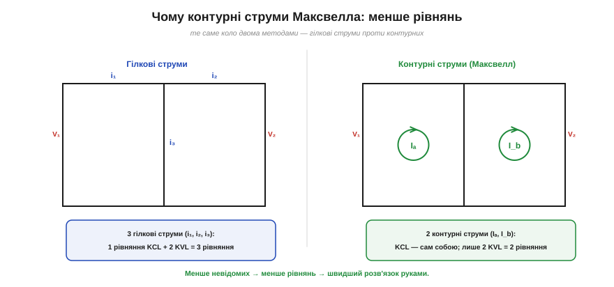
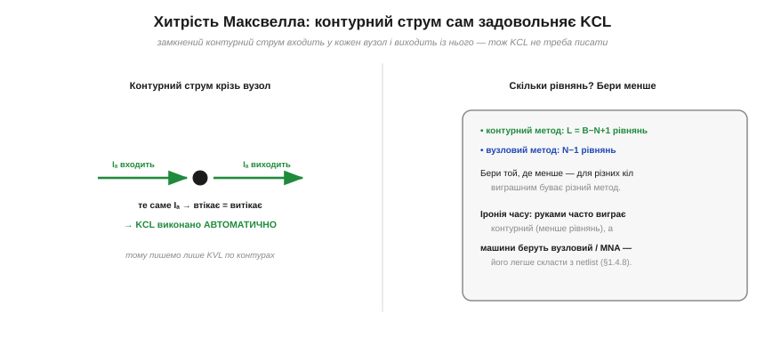

# 📜 Контурні струми Максвелла: менше рівнянь — швидший розв'язок

> Історична вставка до теми [§1.4.8 «Як розв'язувати коло»](kirchhoff-circuit-analysis.md). §1.4.8 показав систематичний шлях: познач струми, напиши KCL і KVL, розв'яжи систему. Та коли гілок багато, рівнянь набирається лячно. І ще 1873 року чоловік, чиє ім'я ви знаєте з рівнянь електромагнетизму, придумав, як їх **скоротити вдвічі** — простою зміною того, що брати за невідоме.

Цей чоловік — **Джеймс Клерк Максвелл** (*James Clerk Maxwell*, 1831–1879), шотландський фізик із Единбурга, той самий, що звів електрику, магнетизм і світло в єдину теорію. Серед його велетенських звершень загубилася маленька, суто практична хитрість для розрахунку кіл — **метод контурних струмів**. Вона не змінює фізики, зате різко зменшує арифметику; і досі її звуть **методом циркулюючих струмів Максвелла**.

### Проблема: забагато невідомих

Згадаймо «лобовий» спосіб із §1.4.8. Призначаємо струм **кожній гілці** — їх B штук. Щоб їх знайти, пишемо рівняння: по одному KCL на кожен незалежний вузол (їх N−1) і по одному KVL на кожен незалежний контур (їх L = B−N+1, §1.4.1). Разом — рівно B рівнянь на B невідомих. Усе правильно, та для схеми навіть із кількох вічок це вже громіздка система, яку руками розв'язувати марудно й легко наплутати зі знаками.

Максвелл подивився на це й запитав: а чи не забагато ми беремо невідомих? Адже гілкові струми **не незалежні** — їх зв'язує KCL у кожному вузлі. Може, є набір невідомих, який задовольняє KCL **сам собою**, і тоді ці рівняння писати взагалі не доведеться?

### Ідея: струм, що циркулює по контуру

*Рис. 1.4.8і.1. Те саме коло з двох вічок. Ліворуч — метод гілкових струмів: три невідомі (i₁, i₂, i₃) і три рівняння (1 KCL + 2 KVL). Праворуч — метод Максвелла: два контурні струми (Iₐ, I_b), KCL виконується автоматично, лишаються самі два рівняння KVL.*

Винахід Максвелла — взяти за невідомі не гілкові струми, а **фіктивні струми, що циркулюють по замкнених контурах** (вічках). Кожному незалежному контуру — свій струм Iₐ, I_b, … А реальний струм будь-якої гілки складається з тих контурних струмів, що крізь неї течуть.

І тут — уся краса. Контурний струм **замкнений**: він тече по колу, тож у кожен вузол на своєму шляху він **входить і одразу виходить**.

*Рис. 1.4.8і.2. Замкнений контурний струм входить у кожен вузол і виходить із нього тим самим значенням — отже, «втікає = витікає» виконується само собою, і KCL писати не треба. Лишається тільки KVL по кожному контуру. Праворуч — практичний вибір: контурів L = B−N+1 чи вузлів N−1, бери менше.*

Отже, скільки б вузлів струм не проходив, у кожному «втікає = витікає» — **KCL виконано тотожно**, без жодного рівняння. Лишається написати самі **KVL** — по одному на контур, тобто L = B−N+1 рівнянь. Для кола з двох вічок це **два** рівняння замість трьох; для більших схем виграш ще помітніший. Менше невідомих — менше рівнянь — менше шансів помилитися й швидший розв'язок руками. Той самий [метод Гаусса](math-gauss.md) на меншій системі працює помітно менше.

### Звідки ми це знаємо

Свій прийом Максвелл виклав у фундаментальній праці **«Трактат про електрику й магнетизм»** (*A Treatise on Electricity and Magnetism*), що вийшла **1873 року** — у тій самій книзі, де у завершеному вигляді постали його знамениті рівняння поля. Він називав ці величини **циклічними** (циркулюючими) струмами. Авторство методу за Максвеллом — добре усталений факт; пізніше виклад відшліфували й перетворили на сучасний шкільний «метод контурних струмів» (а заодно дали йому пару — **метод вузлових напруг**), але стрижнева ідея циклічного струму — його.

### Що з цього лишилося — і одна іронія

Метод контурних струмів живий і сьогодні: ним зручно рахувати **планарні** схеми руками, бо рівнянь виходить мало. Поряд стоїть його дзеркало — **вузловий** метод, де невідомі це потенціали вузлів, а рівнянь N−1. Практичне правило просте: порахуй, чого менше — контурів (L = B−N+1) чи вузлів (N−1), — і бери той метод; для різних схем виграє різний.

А наостанок — гарна іронія історії. Максвелл вигадував контурні струми, щоб **людині** було менше писати рівнянь. Та коли кола стали розв'язувати **машини**, перевагу віддали якраз **вузловому** методу (точніше, його «модифікованому» варіанту MNA, [про який — окремо](proj-mna-spice.md)): не тому, що він дає менше рівнянь, а тому, що його куди легше **автоматично скласти** зі списку з'єднань. Те, що економило працю руці, поступилося тому, що економить працю програмісту. А скромна хитрість Максвелла лишилась — нагадуванням, що іноді найбільший виграш дає не нова фізика, а просто розумніший вибір невідомих.
