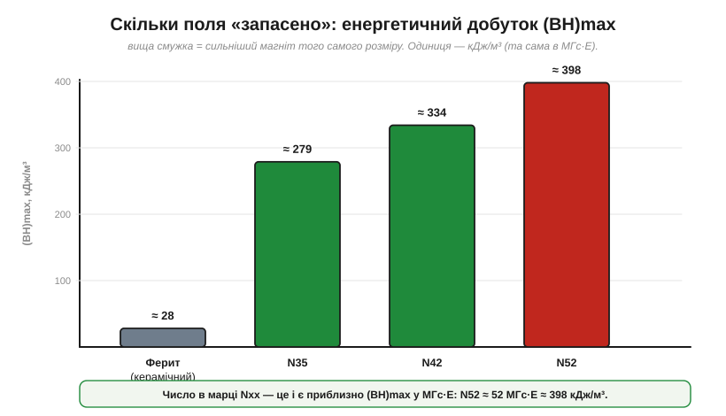
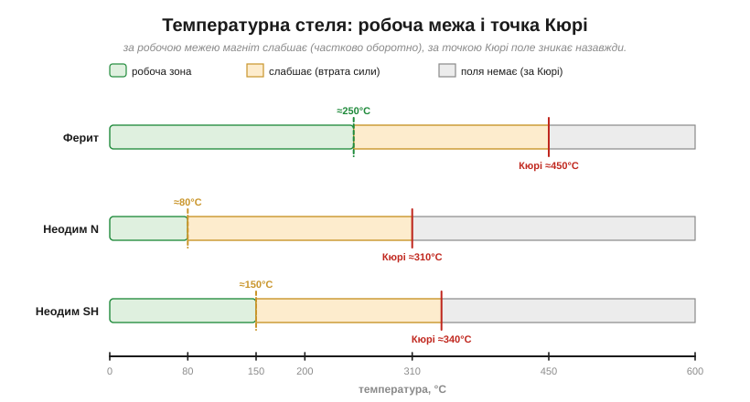

# 🔌 Ферит проти неодиму: класи N35–N52, крихкість, корозія й температурні межі

> Компонентна вставка до теми [§1.8.3 «Постійні магніти: ферит і неодим»](magnetism.md). §1.8.3 пояснив фізику: чому магніт «не розряджається», що таке точка Кюрі й коли домени (§1.8.2) розпадаються. Тут — практичний бік: магніт як **деталь, яку купуєш за марками**. Дві родини покривають майже все, що ставлять у пристрої, і вибір між ними — це торг між силою, ціною, температурою та крихкістю.

### Дві родини: чим живуть і скільки коштують

На полиці постачальника постійні магніти діляться на дві великі родини, і різниця між ними — у кілька разів за силою:

- **Ферит** (*ferrite*, він же керамічний, *ceramic*) — спечений оксид заліза з барієм чи стронцієм. Дешевий, твердий, темно-сірий. Не іржавіє в принципі (це вже й так оксид), терпить нагрів до сотень градусів. Слабкий: «прилипає», але великого зусилля не дасть. Це магніт холодильникових сувенірів, дешевих динаміків, сепараторів.
- **Неодим** (*neodymium*, NdFeB — неодим-залізо-бор) — найсильніший із серійних магнітів. Той самий об'єм тягне у 5–10 разів дужче за ферит. Дорожчий, блищить (його покривають металом), боїться нагріву й корозії. Це магніти моторів, жорстких дисків, защіпок, давачів.

Поряд існують ще **самарій-кобальт** (*SmCo* — дорогий, але тримає високу температуру) і **AlNiCo** (алюміній-нікель-кобальт, надзвичайно стабільний з температурою), проте в типовому пристрої вибір майже завжди зводиться саме до «ферит чи неодим».

### Що означає марка N35–N52

Обравши неодим заради сили, ми одразу впираємося в його маркування — і тут марка не маркетинг, а число. Літера **N** (плюс іноді ще одна, температурна — про неї нижче), а за нею **35…52** — це приблизно **енергетичний добуток** (*maximum energy product*, (BH)max) у старих одиницях МГс·Е (мегагаус-ерстед). Чим більше число, тим «густіше» в магніт запаковано поле — тим сильніша тяга за той самий об'єм.


*Рис. 1.8.3c.1. Енергетичний добуток (BH)max — скільки поля «запасено» в одиниці об'єму. Ферит відстає в рази; усередині неодимового ряду N52 десь на 40 % сильніший за N35. Число в марці — це й є приблизно (BH)max у МГс·Е (N52 ≈ 52 МГс·Е ≈ 398 кДж/м³).*

Сучасні каталоги частіше подають (BH)max у кілоджоулях на кубометр, і переведення між одиницями просте: 1 МГс·Е ≈ 7.96 кДж/м³, тож

```
N35:  35 МГс·Е × 7.96 ≈ 279 кДж/м³
N52:  52 МГс·Е × 7.96 ≈ 398 кДж/м³
```

**N52** — практична верхня межа серійного неодиму; усе, що вище, або лабораторне, або підробка маркування.

### Дві стелі: робоча температура й точка Кюрі

Висока марка дає силу, але саме тут ховається головна підступність неодиму — він не любить тепла. §1.8.3 вже ввів **точку Кюрі** (*Curie point*, T_C) — температуру, за якою теплові коливання руйнують упорядкування доменів і магнетизм **зникає назавжди**. Та задовго до Кюрі є нижча, **робоча межа** (*max operating temperature*): за нею магніт ще працює, проте сила «пливе» — частина втрати оборотна (повертається після охолодження), а частина лишається.


*Рис. 1.8.3c.2. Температурні стелі. У звичайного неодиму N робоча межа лише ≈80 °C, а Кюрі ≈310 °C; ферит спокійно тримає сотні градусів. Високотемпературні марки неодиму (літери після N) піднімають робочу стелю ціною трохи меншої сили.*

Саме тому до **N** додають **температурну літеру**: M (≈100 °C), H (≈120 °C), SH (≈150 °C), UH (≈180 °C), EH (≈200 °C). Тобто «N42SH» — це сила N42, але тримає до 150 °C. У моторі чи біля силового ключа це критично: дешевий «N52» без літери поряд із гарячою котушкою тихо втратить частину поля — і пристрій «здеградує» без жодної видимої поломки.

### Як пускати в роботу: граблі

Силу ми вибрали, температуру теж — лишається фізично взяти магніт у руки, а тут неодим примхливий. Ось типове, що псує складання:

- **Крихкість.** Спечений неодим — як кераміка: твердий, але **колеться**. Два магніти, що клацнули один об одного, легко скидають кутики й бризкають гострими скалками. Не давайте їм вільно «стрибати» назустріч.
- **Корозія.** Гола NdFeB-сполука у вологому повітрі іржавіє й кришиться, тому магніти **покривають** — нікелем (Ni-Cu-Ni, блискучий), цинком (сірий) чи епоксидом. Подряпали покриття — відкрили шлях іржі. Для вулиці беріть епоксидне чи цинкове покриття.
- **Сила недооцінена.** Навіть невеликий неодим тягне кілограми й боляче защемлює шкіру, що потрапила між двома магнітами; великі — травмонебезпечні.
- **Розмагнічування полем.** Сильне зовнішнє поле проти власного (наприклад, від іншого магніта чи котушки) може **частково розмагнітити** — особливо коли магніт уже підігрітий.

> 🔧 **Навіщо це.** Коли в проєкті є мотор, защіпка, давач положення чи енкодер — вибір магніта зводиться до трьох чисел: марка (сила, N35…N52), температурна літера (до якого нагріву) і покриття (де працюватиме). Помилка в будь-якому з трьох тихо «з'їдає» поле або вбиває магніт корозією — без диму й без явної поломки.

### Коли що брати

Зведімо ці три числа в просте правило вибору. Дешево, тепло, без вимог до сили (динамік, утримувач, навчальний дослід) — **ферит**. Потрібна сила в малому об'ємі (мотор, тонка защіпка, давач) — **неодим**, із маркою під зусилля, температурною літерою під нагрів і покриттям під середовище. Гаряче понад можливості неодиму, а ціна не критична — **SmCo**.
