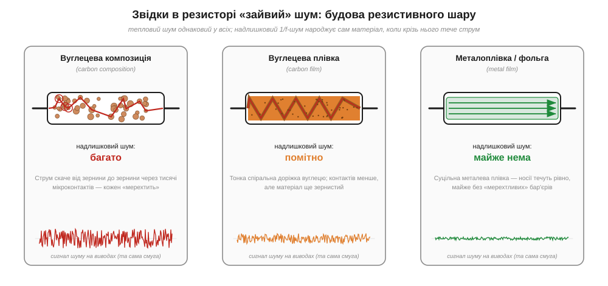
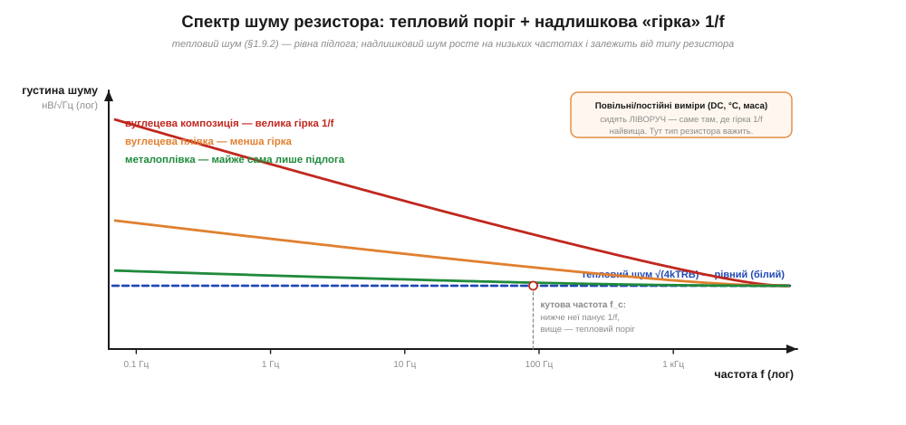

# 🔌 Шумлять і резистори: вуглецеві проти металоплівкових

> Компонентна вставка до теми [§1.9.3 «Дробовий шум і шум 1/f»](noise-interference.md). §1.9.3 показав: шум 1/f (*flicker noise*) росте на низьких частотах і живе там, де крізь матеріал тече постійний струм. Найпростіший компонент, на якому це видно руками, — звичайний резистор. Тепловий шум Джонсона—Найквіста (§1.9.2) однаковий у будь-якого резистора того самого номіналу; а от **надлишковий шум** (*excess noise*, він же струмовий, *current noise*) залежить від того, **з чого** резистор зроблений. Тому в малосигнальних вузлах «однакові на омметрі» резистори поводяться по-різному.

### Що це за клас деталей

Резистор задає опір, але фізично це шматок резистивного матеріалу між двома виводами — і матеріал буває принципово різний (Рис. 1.9.3c.1). Саме звідси й береться різниця в шумі, тож почнімо з будови. Три типові сімейства:

- **Вуглецева композиція** (*carbon composition*) — спечена суміш вуглецевих зернин зі зв'язкою. Струм пробивається крізь тисячі мікроконтактів між зернинами.
- **Вуглецева плівка** (*carbon film*) — тонкий шар вуглецю на керамічному стрижні, з якого лазером чи різцем вирізають спіральну доріжку.
- **Металоплівка / металофольга** (*metal film / foil*) — суцільна плівка металевого сплаву; носії течуть рівним шаром майже без зернистих бар'єрів.


*Рис. 1.9.3c.1. Та сама смуга частот, той самий номінал — різна будова. Що більше «мерехтливих» контактів проходить струм, то більший надлишковий шум: у вуглецевої композиції його багато, у металоплівки — майже нема. Доріжки внизу — той самий сигнал шуму на виводах, відмінність лише в амплітуді.*

### Чим його описують у даташиті

Будова визначає шум, але в каталог її не запишеш — тому виробник згортає її в одне число. У резистора немає розпіновки й регістрів, тож уся його «карта» — це кілька рядків у каталозі. Надлишковий шум там задають **індексом шуму** (*noise index, NI*) у **мкВ на вольт прикладеної напруги, в декаді частоти** (одиниця — дБ відносно 1 мкВ/В). Логіка проста: цей шум **пропорційний прикладеній напрузі** (на відміну від теплового, який тече і без струму), а його густина спадає як 1/f, тож на кожну декаду частоти припадає однакова потужність. Грубі орієнтири: металоплівка — від ≈ −35 до 0 дБ (часто «нуль струмового шуму»), вуглецева плівка — приблизно 0…−10 дБ, вуглецева композиція — +10…−20 дБ і вище. Різниця між крайнощами — десятки разів за напругою.

### Де це працює і «з чого почати»

Маючи цей індекс, надлишковий шум легко прикинути подумки — кілька рядків арифметики:

```
NI       = індекс шуму, мкВ/В у декаді  (з даташита)
E_дек    = NI · V_R        ← V_R: постійна напруга НА резисторі
                              (струмового шуму нема без струму!)
для смуги від f₁ до f₂:
n_декад  = log₁₀(f₂ / f₁)
E_надл   = E_дек · √(n_декад)   ← середньоквадратично
```

Куди ж дивитися за цією оцінкою? Надлишковий шум помітний саме на **повільних** вимірюваннях — постійні рівні, температура, маса, опорні напруги, вхід АЦП. Там робоча смуга лежить ліворуч, біля нуля герц, де гірка 1/f найвища (Рис. 1.9.3c.2); на звукових і вищих частотах він зазвичай тоне в тепловому порозі.


*Рис. 1.9.3c.2. Повна густина шуму = теплова підлога (рівна, §1.9.2) плюс надлишкова «гірка» 1/f. Нижче кутової частоти f_c панує 1/f і вирішує тип резистора; вище — лишається тільки тепловий поріг, однаковий для всіх.*

> 🔧 **Навіщо це.** У дільнику опорної напруги чи на вході малосигнального підсилювача вуглецевий резистор додає повільно «плавучий» шум, який виглядає як дрейф нуля. Заміна на металоплівку прибирає його майже повністю — копійчана зміна, що рятує молодші розряди вимірювання.

### Типові граблі

- **Шуму нема без струму.** Знеструмлений резистор має лише тепловий шум. Надлишковий з'являється, коли на ньому падає напруга, — і росте разом із нею.
- **Омметр його не бачить.** Два резистори з однаковим виміряним опором шумлять по-різному; прилад показує лише номінал (§1.6).
- **Потужність не рятує.** Великий «силовий» резистор не означає тихий: важить матеріал і конструкція, а не габарит.

### Варіації класу

Для найтихіших опорних і вимірювальних вузлів існують **металофольгові** (*bulk metal foil*) і точні дротяні (*wirewound*) резистори з практично нульовим струмовим шумом і дуже малим температурним дрейфом. На іншому полюсі — товстоплівкові SMD (*thick film*): дешеві й всюдисущі, але з помітним надлишковим шумом; для слабких сигналів замість них беруть тонкоплівкові (*thin film*) SMD. Правило просте: де рахуються мікровольти на постійному струмі — туди метал, а не вуглець.
