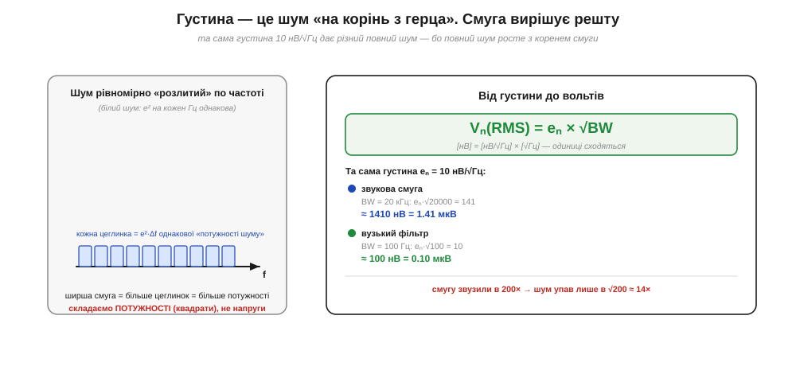
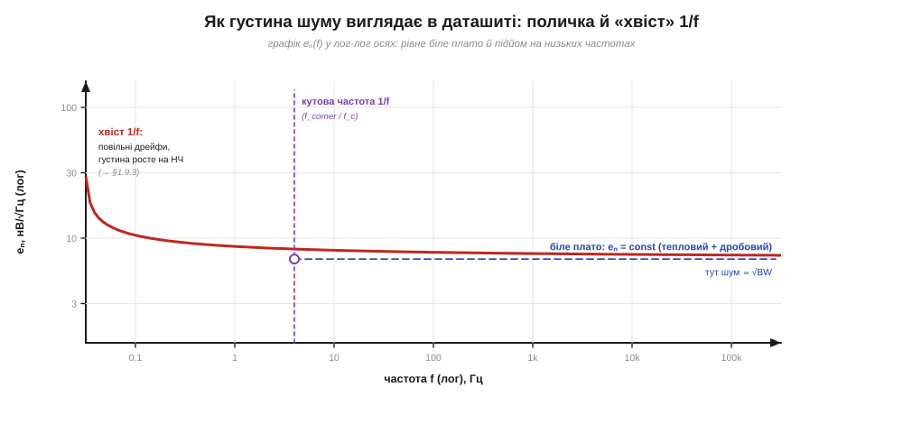

# 🧮 нВ/√Гц: спектральна густина шуму — мова даташитів

> Математична вставка до теми [§1.9.2 «Тепловий шум Джонсона—Найквіста»](noise-interference.md). §1.9.2 дав формулу повного теплового шуму Vₙ = √(4kTRB): у ній сидить смуга B. Але відкрийте даташит будь-якого операційного підсилювача чи АЦП — і шум там заданий **не** у вольтах, а в дивних одиницях **нВ/√Гц** (*nanovolts per root hertz*). Це не примха: так шум описують **до того**, як відома смуга вимірювання. Розберімося, що це за «корінь з герца», звідки він і як із цього числа дістати реальні вольти на вході.

### Означення: шум, поділений на смугу — але хитро

Спектральна **густина шуму** (*noise spectral density*, зазвичай eₙ) — це характеристика джерела шуму, що каже, **скільки шуму припадає на одиницю смуги частот**. Інтуїтивно хочеться сказати «вольтів на герц», але правильна одиниця — **нановольт на корінь з герца**, нВ/√Гц. Звідки корінь — і є вся суть.

Причина в тому, що випадкові шуми складаються **не як напруги, а як потужності** (це ми вже бачили в §1.9.1: незалежні шуми додаються в квадратурі, √(a² + b²), а не a + b). Потужність пропорційна квадрату напруги. Тому рівномірною по частоті є саме **густина потужності** — стільки квадратів вольтів на кожен герц:

```
густина потужності  Sᵥ = eₙ²   [В²/Гц]   — ось ЦЕ рівне по частоті.
```

А інженеру зручніше мислити напругою, не квадратом. Тож беруть корінь — і отримують **густину напруги** eₙ = √Sᵥ з одиницею √(В²/Гц) = **В/√Гц**. Корінь з'явився не штучно: він просто перейшов з квадрата потужності на напругу.

### Інтуїція: «цеглинки потужності» вздовж осі частоти


*Рис. 1.9.2m.1. Чому корінь. Тепловий шум — «білий»: на кожен герц смуги припадає однакова порція потужності eₙ²·Δf (ліворуч — рівні сині цеглинки). Щоб дістати повний шум, ці порції **потужності** складають, а тоді з суми беруть корінь. Тому повна напруга росте не зі смугою, а з її **коренем**: Vₙ = eₙ·√BW (праворуч). Звузивши смугу в 200 разів, шум зменшуємо лише в √200 ≈ 14 разів.*

Щоб відчути, чому корінь керує всім дальшим рахунком, уявімо вісь частот, поділену на однакові вузькі смужки по 1 Гц. Тепловий шум **білий** — це означає, що в кожну смужку «налито» однакову порцію потужності eₙ². Якщо ми вимірюємо в смузі BW герц, то збираємо BW таких порцій:

```
повна потужність шуму  ∝  eₙ² · BW.
```

А повна напруга — корінь із цього. Звідси й уся арифметика даташита: число в нВ/√Гц — це «висота» однієї цеглинки, а реальний шум залежить від того, **скільки цеглинок** (яку смугу) ви насправді пропускаєте.

### Формальний апарат: від густини до вольтів і назад

Головна робоча формула — переклад густини в повний шум для білого (рівного) спектра:

```
Vₙ(RMS) = eₙ × √BW      [В] = [В/√Гц] × [√Гц].
```

Одиниці сходяться (це варто перевіряти завжди, §1.1.5m): √Гц у знаменнику густини скорочується з √Гц зі смуги, лишаються вольти. Тепер зв'яжемо це з формулою §1.9.2. Там повний тепловий шум резистора Vₙ = √(4kTRB). Поділивши на √B, дістаємо саму густину — **без** смуги, як характеристику резистора:

```
eₙ = Vₙ / √B = √(4kTR)      [В/√Гц].
```

Ось чому так зручно: густина 4kTR не залежить від того, у якій смузі ви будете вимірювати. Це паспорт джерела, а смугу кожен підставляє свою.

**Приклад (густина теплового шуму 10 кОм при 25 °C).** Скільки нВ/√Гц «шумить» звичайний резистор 10 кОм?

```
4kT = 4 × 1.38×10⁻²³ × 298  ≈ 1.64×10⁻²⁰   Дж
eₙ = √(4kT·R) = √(1.64×10⁻²⁰ × 10⁴)
   = √(1.64×10⁻¹⁶)          ≈ 1.28×10⁻⁸  В/√Гц
   ≈ 12.8 нВ/√Гц.
```

Корисний орієнтир для пам'яті: **1 кОм при кімнатній температурі дає ≈ 4 нВ/√Гц**, а густина росте як корінь з опору. Тоді 10 кОм → 4·√10 ≈ 12.8 нВ/√Гц (сходиться), 100 кОм → 40 нВ/√Гц, 1 МОм → 128 нВ/√Гц. Це число варто тримати в голові: воно одразу каже, чи «тихий» вхідний резистор для вашого завдання.

**Приклад (повний шум у звуковій смузі).** Хай вхідний резистор 10 кОм, смуга підсилювача BW = 20 кГц. Який повний шум на вході?

```
Vₙ = eₙ·√BW = 12.8 нВ/√Гц × √20000
   = 12.8×10⁻⁹ × 141.4
   ≈ 1.81×10⁻⁶ В  ≈ 1.8 мкВ (RMS).
```

Звузьмо смугу фільтром до 100 Гц — і той самий резистор дасть 12.8 нВ × √100 = 128 нВ, у √200 ≈ 14 разів менше. Звідси перший інженерний висновок: **не пропускай ширшу смугу, ніж потрібно для сигналу** — кожен зайвий герц додає шуму.

### Чому в даташитах саме густина, а не вольти

> 🔧 **Навіщо це.** Виробник підсилювача не знає, з якою смугою ви його застосуєте — у звуці це 20 кГц, у давачі температури 1 Гц, у радіо мегагерци. Дати готові «вольти шуму» він не може: вони залежать від вашої смуги. Тому в паспорт пишуть **густину** eₙ (нВ/√Гц) — інваріант джерела, з якого ви самі дістаєте вольти під свою смугу. Так само задають струмовий шум iₙ у пА/√Гц і шум АЦП. Уміти прочитати це число — і помножити на √BW — пряма потреба, щойно ви добираєте підсилювач під давач.

Є ще одна причина любити густину: вона **миттєво порівнює** компоненти. Два операційники з 3 нВ/√Гц і 9 нВ/√Гц відрізняються за шумом утричі **за будь-якої** смуги — не треба нічого перераховувати. А повні вольти такого порівняння не дають, бо залежать від умов вимірювання.

### Тонкість: «біле» — не скрізь, і де закінчується корінь

Формула Vₙ = eₙ·√BW справедлива, поки густина **рівна** (білий шум) у вашій смузі. Тепловий шум §1.9.2 саме такий — його eₙ не залежить від частоти. Але реальна крива густини в даташиті має дві зони.


*Рис. 1.9.2m.2. Типова крива eₙ(f) у лог-лог осях. Праворуч — рівне **біле плато**: тут густина стала, і повний шум чесно рахується як eₙ·√BW. Ліворуч від **кутової частоти** (*corner frequency*, f_c) густина задирається вгору — це шум 1/f (повільні дрейфи, тема §1.9.3). На дуже низьких частотах і дуже довгих вимірюваннях рахунок «корінь зі смуги» вже не працює, бо цеглинки потужності перестали бути однаковими.*

На білому плато (праві декади) усе як описано: рівні цеглинки, шум ∝ √BW. Але на низьких частотах густина росте — це **шум 1/f** (його окремо розбирає §1.9.3). Там кожна нижча декада «галасливіша» за вищу, цеглинки вже не рівні, і просте множення на √BW дає заниження. Межу між зонами називають **кутовою частотою** f_c: вище неї панує біле плато, нижче — хвіст 1/f. Тому, оцінюючи шум, спершу гляньте, де лежить ваша смуга відносно f_c: якщо цілком на плато — формула цієї вставки точна; якщо заходить у хвіст — потрібен обережніший розрахунок, до якого ми повернемося.

### Де це працює в курсі

Спектральна густина — це **спільна мова шуму** для всього подальшого курсу. Формула §1.9.2 дає її для резистора (√4kTR); сусідня тема §1.9.3 покаже, що дробовий шум і 1/f теж зручно мислити густиною. Щоразу, відкриваючи даташит підсилювача, АЦП чи давача, ви побачите нВ/√Гц (або пА/√Гц для струму) — і тепер знаєте ритуал: знайти густину, перевірити, чи смуга на білому плато, помножити на √BW. А головна звичка з цієї вставки коротка: **шум живе на квадратах, тому скрізь, де його складають чи перераховують, з'являється корінь** — у √Гц густини, у √BW смуги й у √(a²+b²) суми незалежних джерел.
