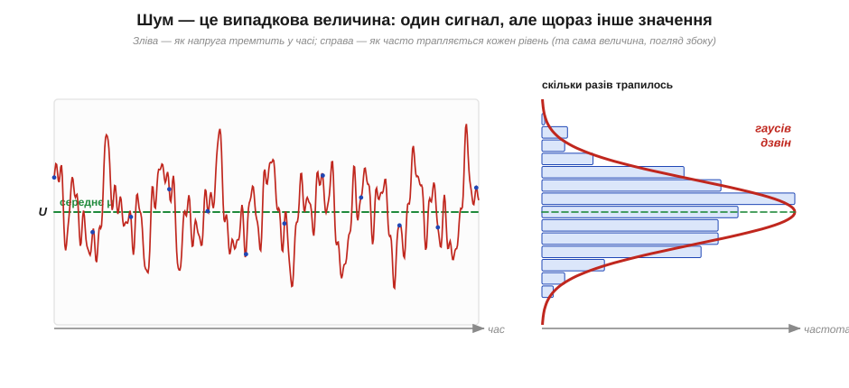
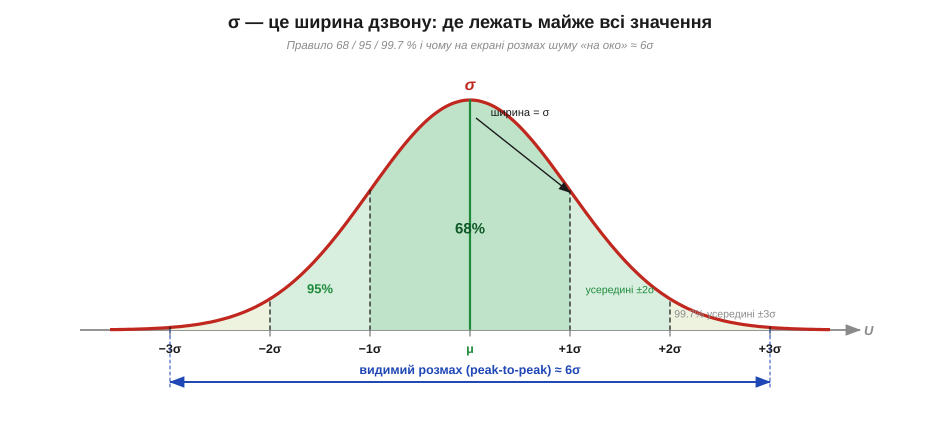

# 🧮 Випадкова величина: середнє, σ і гаусів розподіл

> Це математична вставка до теми [§1.9.1 «Шум і завада: чому жоден сигнал не ідеальний»](noise-interference.md). Там ми сказали головне: внутрішній шум — це не помилка приладу, а **випадковий** додаток до сигналу, що змінюється від виміру до виміру. Але «випадковий» — це ще не діагноз. Щоб шум стало можливо **рахувати** (а не лише нарікати на нього), потрібні три поняття: **середнє**, **стандартне відхилення σ** і **гаусів розподіл**. Це той мінімум статистики, без якого не прочитати ні даташита підсилювача, ні графіка на осцилографі.

### Випадкова величина: число, якого не знаєш наперед

Напруга на вході підсилювача в конкретну мить — це число. Але якщо повторити вимір через мікросекунду, число буде вже інше, хоч джерело й не чіпали. Величину, що при кожному «зчитуванні» дає інше значення з якогось набору, звуть **випадковою величиною** (*random variable*). Окремий вимір — її **реалізація** (*sample*); передбачити його точно не можна.

Здавалося б, із чим тут працювати: значення ж щораз інше. Та якщо назбирати **багато** реалізацій, у них проступає стійка структура. Її і вловлюють дві числові характеристики — куди значення «тяжіють» і наскільки широко «розкидані».


*Рис. 1.9.1m.1. Зліва — шумова напруга в часі: суцільне тремтіння, кожна синя точка — окремий вимір (реалізація). Справа — та сама величина «збоку»: скільки разів трапився кожен рівень. Безлад у часі обертається охайним дзвоном на гістограмі — у цьому й весь сенс статистичного опису.*

### Середнє: куди тяжіють значення

Перша характеристика — **середнє** (*mean*, μ): складемо N реалізацій і поділимо на N.

```
μ = (x₁ + x₂ + … + x_N) / N = (1/N)·Σ xᵢ
```

Це «центр ваги» хмари значень — рівень, навколо якого все коливається. Для чистого шуму, накладеного на постійний сигнал, середнє дорівнює самому сигналу: відхилення вгору й униз однаково ймовірні й при усередненні гасять одне одного. Тому в шуму без постійної складової μ ≈ 0 — стільки ж «плюсів», скільки «мінусів».

Звідси, до речі, головна користь середнього на практиці: **усереднення прибирає шум, не чіпаючи сигнал**. Сигнал щоразу той самий і додається сам до себе, а шумові плюси-мінуси взаємно скорочуються. (Наскільки саме він спадає — окрема арифметика; до неї повернемось аж у §1.9.9.)

### Дисперсія і σ: наскільки широко розкидано

Саме лише середнє оманливе: дві зовсім різні хмари значень — вузенька й широка — можуть мати **однакове** μ. Бракує міри **розкиду**. Напрошується взяти середнє відхилення від μ, та воно завжди нульове (плюси гасять мінуси, за означенням центра). Рятує квадрат: він прибирає знак. Середній квадрат відхилення звуть **дисперсією** (*variance*, σ²):

```
σ² = (1/N)·Σ (xᵢ − μ)²
```

Дисперсія виходить у «квадратних вольтах» — рахувати зручно, відчути важко. Тож беруть корінь і повертаються до вольтів. Це і є **стандартне відхилення** (*standard deviation*, σ) — головна міра «сили» шуму:

```
σ = √[ (1/N)·Σ (xᵢ − μ)² ]
```

Ось ключ до всього курсу шуму: для сигналу з нульовим середнім σ — це те саме, що його **діюче значення (RMS)**. Корінь із середнього квадрата — буквально означення RMS (його ми вводили для змінного струму, §1.7.4). Тому коли в даташиті пишуть «шум 8 мкВ RMS», читай: σ цієї випадкової напруги дорівнює 8 мкВ. А σ² (дисперсія) має ще одну золоту властивість: у незалежних джерел шуму **додаються саме дисперсії**, не самі σ. Через те два однакові некорельовані шуми дають не подвоєний розкид, а більший лише в √2 ≈ 1.41 раза.

> 🔧 **Навіщо це.** σ — це єдине число, яким шум заходить у розрахунки. Відношення сигнал/шум (*SNR*) — це відношення амплітуди корисного сигналу до σ шуму. Запас до порога спрацювання компаратора міряють у «скількох σ» він лежить. А коли треба скласти внески кількох джерел завад, складають їхні σ² і беруть корінь — бо так працює статистика незалежних доданків.

### Гаусів розподіл: чому саме дзвін

Лишається питання форми: як саме значення розподілені навколо μ. Для теплового шуму (і безлічі інших природних шумів) відповідь — **нормальний**, або **гаусів, розподіл** (*Gaussian / normal distribution*), та сама «дзвоноподібна крива». Її щільність ймовірності задає формула з рівно двома параметрами — μ (де центр) і σ (яка ширина):

```
p(x) = (1 / (σ·√(2π))) · exp[ −(x − μ)² / (2σ²) ]
```

Розбирати її доскіпливо не треба — важлива форма й що нею керують лише μ та σ. Центр — у μ; що далі від нього, то рідше (експонента від квадрата падає дуже швидко); ширина «дзвону» задається σ. Чому природа так уперто обирає саме дзвін, а не якусь іншу форму, — окреме глибоке питання (за ним стоїть центральна гранична теорема; до неї звернемось далі в цьому ж розділі). Поки досить факту: **тепловий шум — гаусів**, тож знати μ та σ означає знати про нього все.


*Рис. 1.9.1m.2. Гаусів розподіл і правило «68 / 95 / 99.7». У смугу ±σ навколо середнього потрапляє ≈ 68 % значень, у ±2σ — ≈ 95 %, у ±3σ — ≈ 99.7 %. Звідси й практичне правило ока: видимий розмах шуму (peak-to-peak) — це приблизно 6σ.*

Практична сила дзвону — у **правилі 68 / 95 / 99.7**. Хоч би яким вузьким чи широким був конкретний гаусів шум, частки лишаються ті самі:

```
у межах μ ± 1σ  лежить ≈ 68 %  значень
у межах μ ± 2σ  лежить ≈ 95 %  значень
у межах μ ± 3σ  лежить ≈ 99.7 % значень
```

Звідси — місток від σ (число з даташита) до того, що видно очима на осцилографі. Майже весь шум (99.7 %) уміщається в ±3σ, тобто в смугу завширшки **6σ**. Тому «товщину» шумової доріжки на екрані, її розмах від піка до піка (*peak-to-peak*), оцінюють як приблизно 6σ. Зворотно: побачив на екрані розмах 60 мВ — поділи на 6 і матимеш σ ≈ 10 мВ RMS. Це найшвидший спосіб перевести «на око» в число, з яким уже рахують.

**Приклад (від розмаху на екрані до RMS і назад).** На осцилографі шум скаче в смузі шириною близько 48 мВ від піка до піка. Яке його σ (RMS), і чи часто викид перевалить за 30 мВ від середнього?

```
σ ≈ розмах / 6 = 48 мВ / 6        = 8 мВ (RMS)
поріг 30 мВ у частках σ: 30 / 8   ≈ 3.75σ
за межі ±3σ виходить ≈ 0.3 % часу, а ±3.75σ — ще рідше (одиниці на 10⁴)
```

Висновок: типове тремтіння — близько 8 мВ, а викид аж до 30 мВ хоч і можливий, та трапляється украй рідко — на нього не варто закладати логіку, але й виключати повністю не можна. Саме так σ перетворює розпливчасте «іноді стрибає» на конкретну ймовірність.

### Де це працює в курсі

Ці три поняття — фундамент усього розділу. Тепловий шум резистора §1.9.2 задається однією формулою для його σ (RMS); там же побачимо одиницю нВ/√Гц — спосіб говорити про σ ще до того, як обрано смугу. Гаусова форма пояснює, чому до шуму застосовна вся щойно введена арифметика, а правило 6σ зустрінеться щоразу, коли треба зв'язати картинку на екрані з числом у даташиті (§1.9.9). І ще практичне: коли в коді треба **згенерувати** реалістичний шум, генерують саме гаусову величину із заданими μ і σ — як саме, показано в сусідній алгоритмічній вставці до цієї ж теми.
