# Розділ 1.9 — Шум і завади: фізичні джерела

Досі ми малювали сигнали так, ніби вони ідеальні: чистий нуль, чиста синусоїда, рівна постійна напруга. Та коли вперше під'єднуєш осцилограф до тонкого сигналу з давача, екран показує не охайну лінію, а **тремтливу, нечисту смужку** — вона дрижить, по ній пробігає повільна хвиля, час від часу стрибають гострі піки. Сигнал «забруднений». І це не дефект конкретного приладу: **жоден реальний сигнал не буває ідеальним**. Над кожним корисним рівнем напруги завжди сидить тонкий шар сторонньої «домішки» — і вся практична електроніка вимірювань, по суті, є мистецтвом тримати цю домішку меншою за те, що ми хочемо побачити.

Цей розділ — про те, **звідки** береться ця домішка й **як** з нею боротися. Виявиться, що джерел рівно два роди, і вони геть різні за природою. Одне — **внутрішнє**: сама матерія, з якої зроблений будь-який провідник чи деталь, ніколи не стоїть на місці — її електрони безперервно товчуться від теплоти (це ми вже бачили в §1.2.9), а струм виявляється не рівною рікою, а дощем окремих зарядів (бо заряд дискретний, §1.1.1). Це **шум** (*noise*) — випадковий, невитравний, заданий фізикою. Друге джерело — **зовнішнє**: світ навколо повний змінних полів (§1.1.3 і §1.8.4) і чужих струмів, і вони проникають у наш ланцюг через ємність, через магнітне поле або через спільний провід. Це **наводка**, або **завада** (*interference*), — і її, на відміну від шуму, майже завжди можна вистежити й прогнати.

Логіка розділу така. Спершу (§1.9.1) розберемо саму **термінологію** і відмінність шуму від наводки — бо лікують їх по-різному. Потім — три глави про **внутрішній шум**: тепловий (§1.9.2), дробовий і 1/f (§1.9.3). Далі — чотири глави про **зовнішні наводки** та їх приборкання: ємнісний зв'язок (§1.9.4), індуктивний (§1.9.5), спільний шлях повернення й земляні петлі (§1.9.6), екранування (§1.9.7) та вита пара (§1.9.8). А завершимо практикою — **полюванням на заваду з осцилографом** (§1.9.9): як упізнати ворога за формою сліду на екрані й методично загнати його в кут. Усе спирається лише на вже пройдене в Модулі 1 — поле, струм, опір, ємність, магнетизм, осцилограф; нічого з майбутніх розділів тут не знадобиться.

> 📜 **Перед матеріалом — історія:** [Джонсон і Найквіст: шум, що виявився властивістю самої матерії](hist-johnson-nyquist.md). Вона показує, як інженер, що полював на «дефект ламп», натрапив на фундаментальну межу природи — і як теоретик за лічені тижні вивів її з термодинаміки, не написавши жодного рівняння руху електрона.

---

## 1.9.1 Шум і завада: чому жоден сигнал не ідеальний

Перш ніж боротися з «брудом» на сигналі, варто чітко домовитися, **що ми називаємо чим**. У побутовій мові «шум», «завада», «перешкода», «фон» — слова-синоніми, і це нормально для розмови. Але в електроніці за ними стоять **дві фізично різні речі** з різними джерелами, різною поведінкою й, найголовніше, різними способами лікування. Плутати їх — означає лікувати головний біль мікстурою від кашлю: можна довго ставити дорогі екрани там, де треба було просто звузити смугу, або навпаки — гнатися за «тихими» деталями, поки гул із сусіднього мотора домінує над усім.

Чому це питання взагалі важливе саме для нас? Бо вся електроніка, по суті, працює з **малими різницями напруг**. Сигнал давача температури — це, може, кілька мілівольтів; сигнал тензодавача чи мікрофона — мікровольти; навіть «логічна одиниця» цифрової шини — це лиш кілька вольтів, які треба впевнено відрізнити від нуля. А над кожним таким рівнем сидить шар сторонньої домішки. Поки домішка значно менша за корисний сигнал — усе гаразд, ми її не помічаємо. Та щойно вона наближається до сигналу за величиною, вимірювання починає брехати: давач «дрижить», цифрова лінія «збоїть», звук «гуде». Тому межа між «працює» і «не працює» — це часто межа між сигналом і домішкою, і вся ця тема, по суті, про те, як тримати цю межу з добрим запасом.

### Дві природи бруду: зсередини й ззовні

Уявімо найпростіший вимірювальний ланцюг: якийсь давач породжує слабку напругу, тонкий дріт несе її до входу приладу, прилад її читає. Де на цьому шляху сигнал може забруднитися? Виявляється, є рівно два принципово різні механізми.

Перший — **шум** (*noise*) у вузькому, технічному сенсі. Це **випадкова домішка, що народжується в самій матерії** ланцюга. Її ніхто не «надсилає» ззовні: сам резистор, сам перехід у напівпровіднику, сам шматок дроту генерує її просто тому, що складається з атомів за ненульової температури. Електрони в ньому безперервно тремтять від теплового руху (точно той самий рух, що дає опір, — §1.2.9), і ця тряска проявляється як крихітна змінна напруга на виводах. Шум **широкосмуговий** (присутній на всіх частотах одразу), **випадковий** (його не передбачиш від миті до миті) і, що найважче, **невитравний у принципі**: поки деталь тепліша за абсолютний нуль, вона шумить. З ним не «борються» — його лише **тримають нижче за сигнал**.

Другий механізм — **наводка**, або **завада** (*interference*). Це домішка, що **приходить ззовні**, від інших електричних процесів у світі: проводки в стіні з її 50-герцовою напругою, сусіднього мотора, що іскрить щітками, імпульсного блока живлення, реле, радіопередавача, навіть від люмінесцентної лампи. Усі вони породжують змінні поля й чужі струми, а ті проникають у наш ланцюг трьома шляхами, які ми розберемо далі: через **електричне поле** (ємнісний зв'язок, §1.9.4), через **магнітне поле** (індуктивний зв'язок, §1.9.5) або через **спільний провід** (§1.9.6). На відміну від шуму, наводка зазвичай має **впізнаваний почерк**: її частота, форма й момент появи видають джерело. А головне — її майже завжди можна **вистежити й усунути**: переставити кабель, додати екран, змінити розводку «землі».

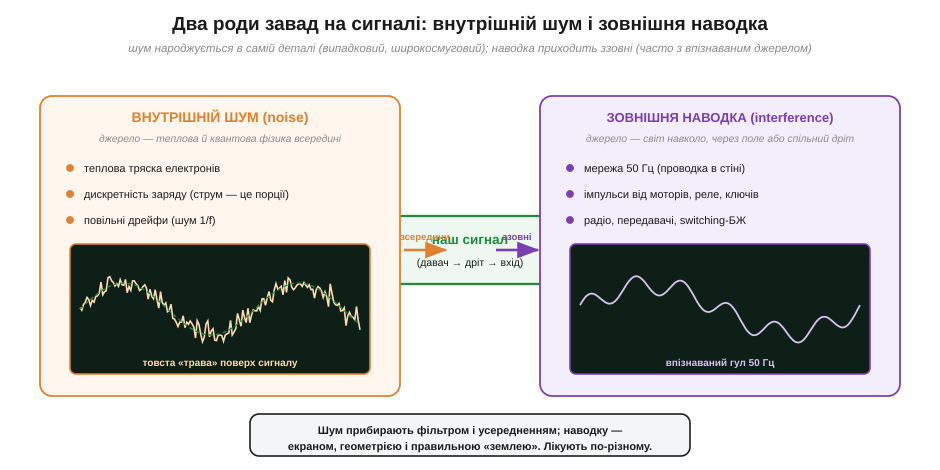
*Рис. 1.9.1.1. Дві природи «бруду». Ліворуч — внутрішній **шум**: теплова тряска електронів, дискретність заряду, повільні дрейфи; джерело — фізика всередині деталі, форма на екрані — товста «трава». Праворуч — зовнішня **наводка**: мережа 50 Гц, імпульси комутації, радіо; джерело — світ навколо, форма часто впізнавана (плавний гул). Лікують їх різними засобами.*

Ця двоїстість — головна думка теми, і її варто закарбувати одразу: **шум прибирають фільтрацією та усередненням** (звужують смугу частот, у якій працюють, і нагромаджують вимірювання — про це §1.9.2 і §1.9.9), а **наводку прибирають геометрією, екраном і правильною «землею»** (§1.9.4–1.9.8). Перше — про статистику й смугу; друге — про поля й провідники. Тому перший крок будь-якого «полювання» — спершу **зрозуміти, з чим маєш справу**, а вже потім братися за інструмент.

Є й проміжний випадок, який варто згадати чесно, щоб поділ не здавався надто чистим. Іноді джерело завади **зовнішнє**, а проявляється вона **широкосмугово**, майже як шум, — наприклад, високочастотне «сміття» від імпульсного блока живлення чи від цифрової шини, що рясно випромінює на багатьох частотах. Така завада і приходить ззовні (її можна вистежити й заглушити екраном), і виглядає на екрані як неохайна «трава». Тож на практиці питання «шум чи наводка?» інколи має відповідь «наводка, що прикидається шумом», і остаточно його вирішує лише експеримент (замкнути вхід, повимикати споживачів — §1.9.9). Але навіть тоді сам поділ лишається робочим компасом: він каже, **які два набори інструментів** взагалі існують, і не дає, скажімо, нескінченно екранувати власний тепловий шум.

Терміни тут варто закріпити одразу, бо в літературі вони трапляються двома мовами. Внутрішню випадкову домішку звуть **шум** (*noise*); зовнішню — **завада** або **наводка** (*interference*, дослівно «втручання»; також кажуть *pickup* — «підхоплення», коли підкреслюють, що сигнал «підхопив» заваду з оточення). Загальне англійське слово для електромагнітних завад — **EMI** (*electromagnetic interference*), а здатність пристрою і не заважати іншим, і самому стійко терпіти завади — **електромагнітна сумісність**, **EMC** (*electromagnetic compatibility*). Уся ця тема, по суті, — азбука EMC на рівні фізики; самі норми й випробування ми зачепимо пізніше, а тут закладаємо розуміння **механізмів**, без якого жодна норма не має сенсу.

> 🔧 **Навіщо це.** На столі це розрізнення економить години. Побачивши на екрані дрижання, інженер передусім питає: воно **широкосмугове й хаотичне** (схоже на траву) — чи має **період і форму** (плавна хвиля, ритмічні піки)? Перше — швидше за все власний шум схеми, і дорогий екран тут не зарадить: треба звузити смугу або взяти «тихіший» підсилювач. Друге — майже напевно наводка, і її джерело можна знайти й вимкнути. Один погляд на форму вже спрямовує всю діагностику.

### Шум випадковий — але описуваний числами

«Випадковий» не означає «незбагненний». Хоча миттєве значення шуму непередбачуване, його **статистика** дуже стабільна й піддається точному опису. Якщо довго дивитися на шумову напругу, видно, що вона коливається навколо **нуля** (середнє значення = 0: шум однаково часто додатний і від'ємний), а от **розмах** цих коливань — величина цілком певна. Її міряють **середньоквадратичним значенням** (*RMS*, корінь із середнього квадрата — те саме, що ми вводили для змінного струму в §1.7.4): для шуму RMS — це його **ефективний розмах**, і саме він каже, наскільки шум «сильний».

Глибша характеристика — **розподіл** значень шуму. Для більшості фізичних шумів він **гаусів** (*Gaussian*, «дзвін»): малі відхилення трапляються часто, великі — рідко, і ймовірність спадає за відомою дзвоноподібною кривою. Чому саме гаусів — є гарна причина: шумова напруга складається з безлічі незалежних мікровнесків (мільярдів окремих електронних поштовхів), а сума багатьох незалежних випадковостей завжди прагне до гаусового дзвону (це **центральна гранична теорема**, і ми ще повернемося до неї). Практичний наслідок дзвону — правило «трьох сигм»: майже всі миттєві значення (≈ 99.7 %) укладаються в ±3σ навколо нуля, де σ (сигма) — це і є RMS-розмах. Тому, побачивши на екрані смужку шуму завтовшки, скажімо, 6 поділок, можна сміливо казати: σ ≈ одна поділка.

Цей зв'язок між RMS і видимим розмахом варто розуміти твердо, бо він плутає новачків. На осцилографі око бачить **розмах від піка до піка** (*peak-to-peak*) — повну товщину смужки шуму. А в розрахунках і даташитах шум задають через **RMS** (σ). Для гаусового шуму вони пов'язані приблизно як «розмах ≈ 6σ … 8σ»: оскільки великі викиди рідкісні, але не виключені, повний видимий розмах залежить від того, як довго дивишся (що довше — то ймовірніше зловити рідкісний великий сплеск, і смужка «розпухає»). Тому розмах від піка до піка — величина дещо «гумова» й залежить від часу спостереження, а RMS — стабільна й однозначна. Звідси правило: **рахуй і порівнюй у RMS**, а око на екрані ділить видиму товщину приблизно на шість, щоб прикинути σ.

Чому взагалі беруть саме **квадрат** (RMS), а не просто середнє відхилення? Бо шум переносить **потужність**, а потужність пропорційна квадрату напруги (§1.3.5). Середнє від самої напруги — нуль (плюси гасять мінуси), а от середнє від **квадрата** напруги — додатне й дорівнює середній потужності шуму. Корінь із нього (RMS) і є та «ефективна» напруга шуму, що чесно відображає його енергію. Та сама логіка, що й для змінного струму в §1.7.4: RMS — це міра потужності, а не миттєвого значення. І саме тому шуми різної природи **складаються за потужностями** (через квадрати): якщо в схемі є тепловий шум 3 мкВ і незалежний від нього інший шум 4 мкВ, сумарний буде не 7, а √(3² + 4²) = 5 мкВ. Незалежні випадковості додаються «по-піфагорськи», а не лінійно, — і це ще одна причина, чому з шумом працюють у квадратах.

> 🧮 Формальний бік — що таке середнє, дисперсія, σ і чому гаусів дзвін виникає так часто — винесено у вставку [Випадкова величина: середнє, σ і гаусів розподіл](math-random-variables.md), а глибше «чому шум гаусів» — у [Центральна гранична теорема](math-clt.md). Тут досить інтуїції: шум має нульове середнє й певний RMS-розмах, а його значення лягають дзвоном.

### SNR: важить не шум, а його відношення до сигналу

Тепер — найголовніше питання всієї теми. Скільки шуму — це «багато»? Відповідь: **дивлячись на сигнал**. Сам по собі рівень шуму нічого не каже. Десять мікровольтів шуму — це катастрофа для давача, що віддає сигнал у двадцять мікровольтів, і повна дрібниця для сигналу у вольт. Тому головна величина, навколо якої крутиться вся інженерія боротьби з завадами, — це **відношення сигнал/шум** (*signal-to-noise ratio, SNR*): у скільки разів корисний сигнал перевищує домішку.

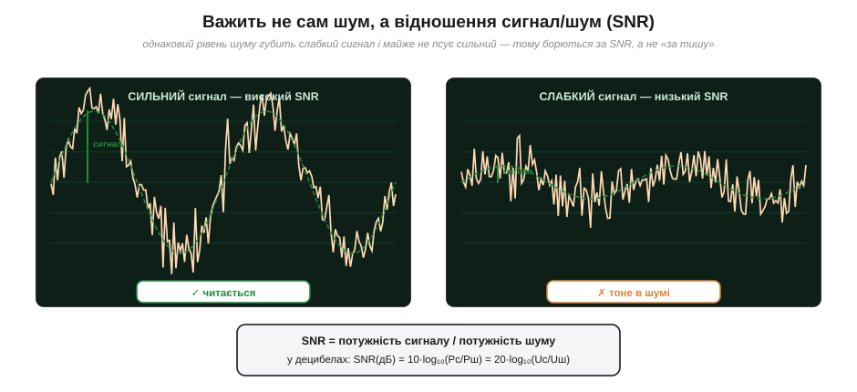
*Рис. 1.9.1.2. Той самий рівень шуму на двох сигналах. Сильний сигнал (ліворуч) має високий SNR — шум лише трохи «розмиває» хвилю, форма читається. Слабкий сигнал (праворуч) при тому самому шумі має низький SNR — і просто тоне. Тому борються не «за тишу взагалі», а за відношення сигналу до шуму.*

SNR — це відношення **потужностей**: SNR = Pсигналу / Pшуму. Оскільки потужність пропорційна квадрату напруги (§1.3.5), через напруги воно записується з квадратами: SNR = (Uсигн / Uшум)². А оскільки ці відношення бувають велетенськими (мільйони разів), їх зручно стискати в **децибели** (*decibel, dB*) — логарифмічну міру:

```
SNR(дБ) = 10 · log₁₀(Pсигн / Pшум)
SNR(дБ) = 20 · log₁₀(Uсигн / Uшум)
```

Множник 20 (а не 10) для напруг з'являється саме тому, що потужність ∝ U², а логарифм квадрата дає подвоєний коефіцієнт. Грубі орієнтири, які варто тримати в голові: **+6 дБ ≈ удвічі більша напруга**, **+20 дБ = удесятеро**, **+3 дБ ≈ удвічі більша потужність**. SNR у 0 дБ означає, що сигнал і шум рівні (сигнал ледь видно); 60 дБ — сигнал у тисячу разів більший за шум (чисто й комфортно).

**Приклад (SNR у децибелах).** Давач віддає корисний сигнал розмахом 200 мВ (RMS), а виміряний шум на вході — 2 мВ (RMS). Який SNR?

```
відношення напруг = Uсигн / Uшум = 200 мВ / 2 мВ = 100
SNR(дБ) = 20 · log₁₀(100)
SNR(дБ) = 20 · 2 = 40 дБ
```

Сорок децибелів — сигнал усотеро більший за шум, тобто дуже комфортний запас: на екрані шум буде тонкою смужкою на тлі великої хвилі. А тепер уявімо, що сигнал ослаб у сто разів (давач відсунули далі) — до 2 мВ, тоді як шум лишився 2 мВ:

```
відношення = 2 мВ / 2 мВ = 1
SNR(дБ) = 20 · log₁₀(1) = 0 дБ
```

Нуль децибелів — сигнал і шум однакові, корисну хвилю ледь розрізнити в дрижанні. Той самий шум, та сама схема — а придатність до вимірювання впала з «чудово» до «майже неможливо» лише через ослаблення сигналу. Ось чому інженери так бережуть **рівень корисного сигналу**: підсилюють давач якомога раніше, ближче до джерела, поки SNR іще високий, — бо втрачений на старті SNR пізніше вже не повернути жодним фільтром.

> 🔧 **Навіщо це.** Правило «бережи SNR на вході» — одне з найважливіших у всій вимірювальній техніці. Слабкий сигнал з давача треба підсилити **якнайраніше**, поки до нього не домішалося зайве: кожен зайвий метр тонкого дроту, кожен поганий контакт, кожен шумний каскад на початку безповоротно псує відношення сигнал/шум. Підсилити можна й потім, але разом із сигналом підсилиться і вся домішка, що встигла причепитися, — відношення вже не виправити. Тому передпідсилювачі ставлять впритул до давача, а не «десь у приладі».

### Що буває крім шуму: спотворення й дрейф

Щоб картина була чесна, згадаймо ще два роди «псування» сигналу, які формально не є ні шумом, ні наводкою, але часто стоять поруч. Перший — **спотворення** (*distortion*): зміна самої **форми** сигналу через нелінійність ланцюга (зрізані верхівки, перекошена синусоїда). Воно не випадкове й не приходить ззовні — це детермінований ефект самої схеми, і ми торкнемося його в наступних модулях. Другий — **дрейф** (*drift*): дуже повільна, майже постійна «втеча» нуля чи коефіцієнта з часом і температурою. Дрейф межує з шумом 1/f (§1.9.3) і теж заважає точним вимірюванням, але діє в масштабі секунд і хвилин, а не мікросекунд.

Для цього розділу головними лишаються двоє — **шум** (внутрішній, випадковий, широкосмуговий) і **наводка** (зовнішня, часто впізнавана). Засвоївши цю двійку й поняття SNR, ми готові копнути в перше з джерел до самого дна: чому будь-який резистор шумить просто тому, що він теплий, — і скільки саме.

---

## 1.9.2 Тепловий шум Джонсона—Найквіста: межа, яку не можна вимкнути

Почнемо з найдивовижнішого факту про шум: **звичайний резистор, що лежить на столі й нікуди не під'єднаний, на своїх виводах має напругу.** Не постійну — її середнє рівно нуль, — а крихітну, безперервно тремтливу змінну напругу, що нізвідки не береться і яку нічим не вимкнути. Це не дефект, не брак, не «погана партія». Це **тепловий шум** (*thermal noise*), або, за іменами першовідкривачів, **шум Джонсона—Найквіста** (*Johnson–Nyquist noise*) — і він є **фундаментальною межею** будь-якого вимірювання. Найкращий у світі підсилювач, найдорожчий прилад, ідеальна схема — усі вони впираються в цю стіну, бо вона поставлена не інженерами, а термодинамікою.

### Звідки береться: тепловий рух, що ми вже бачили

Механізм нам уже знайомий — ми зустрічали його в §1.2.9, коли пояснювали, **звідки взявся опір**. Згадаймо: у металі є море вільних електронів, і за будь-якої температури вище абсолютного нуля вони перебувають у безперервному **хаотичному тепловому русі** — снують туди-сюди, стикаються з атомами ґратки, відскакують, міняють напрямок мільярди разів за секунду. Раніше нас цікавило, як цей рух **гальмує дрейф** і дає опір. Тепер подивимося на нього з іншого боку.

У кожну мить електрони в резисторі рухаються не зовсім симетрично: випадково то трохи більше їх летить ліворуч, то трохи більше — праворуч. Це означає, що в кожну мить на одному кінці резистора збирається мізерний надлишок заряду, а на іншому — нестача, тобто між кінцями виникає крихітна **різниця потенціалів**. За мить картина перетасовується, дисбаланс міняє знак, напруга стрибає в інший бік. Усереднено за довгий час цей дисбаланс нульовий (немає причини, щоб електрони воліли якийсь один бік), але **в кожну окрему мить він не нуль**. Ось ця випадкова, теплом породжена різниця потенціалів і є тепловий шум.

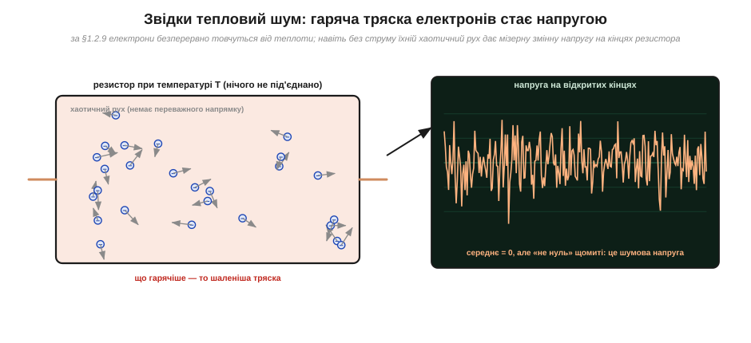
*Рис. 1.9.2.1. Резистор при температурі T, ні до чого не під'єднаний. Електрони (−) хаотично товчуться від теплового руху — без переважного напрямку. Та в кожну мить випадковий дисбаланс «лівих» і «правих» дає крихітну різницю потенціалів на виводах. Середнє — нуль, але щомиті «не нуль»: це й є шумова напруга. Що гарячіше — то шаленіша тряска й більший шум.*

Звідси одразу ясні дві речі. По-перше, шум **росте з температурою**: гарячіше — енергійніша тряска — більші флуктуації. Охолоди резистор — і він стихне (саме тому надчутливі підсилювачі й детектори охолоджують рідким азотом чи гелієм). При абсолютному нулі тепловий рух завмер би й шум зник — але абсолютний нуль недосяжний, тож шум невитравний. По-друге, шум **пов'язаний з опором**: він народжується там само, де й опір, — у зіткненнях електронів із ґраткою. Це не випадковий збіг, а глибокий закон (його ще називають **флуктуаційно-дисипативною теоремою**): те, що **розсіює** енергію (опір), те саме її й **флуктуаційно віддає** (шумить). Немає опору без шуму, немає шуму без опору.

Цей другий висновок вартий того, щоб затриматися, бо він спершу здається парадоксом. Резистор лежить сам по собі, нікуди не під'єднаний, нічого не «робить» — звідки ж напруга, звідки енергія? Хіба це не вічний двигун? Ні. Енергію резистор бере з власного тепла й тут-таки повертає в нього: шумова напруга — це не «вироблена» з нічого енергія, а та сама теплова енергія резистора, що **на мить** виглянула як електричний сигнал і за мить знову розчинилася в теплі. У середньому резистор не віддає й не поглинає нічого (інакше він мимоволі грівся б або холов би сам собою). Це тонка рівновага: тепло безперервно «булькає» в електричну форму й назад, а назовні ми ловимо лише крихітні сплески цього булькання. Глибина закону Найквіста саме в тому, що він пов'язав цю електричну метушню з температурою тіла через термодинаміку — і виявилося, що порахувати її можна, **зовсім не знаючи**, як саме рухається кожен електрон.

> 🔧 **Навіщо це.** Розуміння, що тепловий шум невитравний, рятує від гонитви за привидами. Новачок, побачивши «траву» на чутливому вході, може місяцями шукати «де витікає», міняти деталі, паяти екрани — а це просто тепловий шум резисторів, і його там рівно стільки, скільки наказує фізика. Досвідчений інженер натомість одразу **рахує** очікуваний тепловий шум за формулою (нижче) і порівнює з побаченим: якщо збігається — це межа, і боротися треба не з «витоком», а звужувати смугу чи знижувати опори; якщо шуму помітно **більше** за тепловий — отам уже варто шукати наводку або поганий компонент.

### Скільки саме: закон √(4kTRB)

Найдивовижніше в цій історії — що величину теплового шуму можна порахувати **точно**, наперед, не знаючи нічого про конкретний резистор, крім трьох чисел. Гаррі Найквіст вивів цю формулу 1928 року з чистої термодинаміки, і вона стала однією з найкрасивіших у всій електроніці. Середньоквадратична (RMS) шумова напруга на резисторі дорівнює:

```
Uш(rms) = √(4 · k · T · R · B)
```

де:

```
k = 1.38 × 10⁻²³ Дж/К   — стала Больцмана (зв'язок температури й енергії)
T — абсолютна температура, кельвіни (кімнатна ≈ 300 К)
R — опір, оми
B — смуга частот вимірювання, герци
```

Придивімося, **що тут є і чого немає**. Є температура T — логічно, гарячіше шумить дужче. Є опір R — теж очікувано, він джерело шуму. Є **смуга частот** B — і це ключовий, неочевидний учасник, до якого ми зараз дійдемо. І є фундаментальна стала Больцмана k — місток між світом тепла й світом електрики. А чого **немає** — то це будь-яких подробиць про сам резистор: ні матеріалу, ні розміру, ні форми, ні способу виготовлення. Вуглецевий, металоплівковий, дротяний — за однакових R, T, B вони дають **однаковий** тепловий шум. (Реальні резистори можуть шуміти ще й **понад** тепловий рівень — додатковим струмовим шумом, особливо вуглецеві; але теплову «підлогу» жоден опустити не може.)

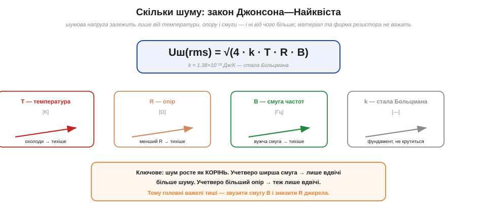
*Рис. 1.9.2.2. Формула √(4kTRB) і її чотири «ручки». Крутити можна температуру T (охолодити), опір R (зменшити) і смугу B (звузити); k — фундаментальна стала, вона не крутиться. Ключове: шум росте як КОРІНЬ із кожного множника — учетверо ширша смуга чи вчетверо більший опір дають лише вдвічі більше шуму.*

Найважливіша риса формули — **квадратний корінь**. Шум росте не пропорційно множникам, а як корінь із них. Це означає: щоб **удвічі** зменшити шумову напругу, треба зменшити R, T або B аж **учетверо**. Корінь працює і проти нас, і за нас: погіршення параметрів б'є по шуму слабше, ніж здається, але й покращення дається важко. Практичний висновок: головні важелі тиші — це **смуга B** (її часто можна звузити в десятки разів задарма, простим фільтром) і **опір джерела R** (його варто тримати малим там, де це можливо). Температуру в звичайній техніці не крутять — кімнатних 300 К нікуди не дінеш, а кріогеніка дорога.

### Смуга вирішує: чому B такий важливий

Спинімося на найцікавішому множнику — смузі частот **B**. Звідки він узагалі взявся у формулі напруги і чому вимірювана шумова напруга залежить від того, **в якій смузі частот** ми дивимося?

Річ у тім, що тепловий шум — **«білий»** (*white noise*): його енергія рівномірно «розмазана» по **всіх** частотах. Як біле світло містить усі кольори порівну, так білий шум містить усі частоти порівну. А будь-який реальний прилад чи фільтр пропускає не всі частоти, а лише певну **смугу** — від нуля до якоїсь верхньої межі (або між двома межами). І шумова потужність, яку прилад «збере», дорівнює рівню білого шуму, помноженому на **ширину цієї смуги**. Ширша смуга — більше шуму впустили; вужча — менше.

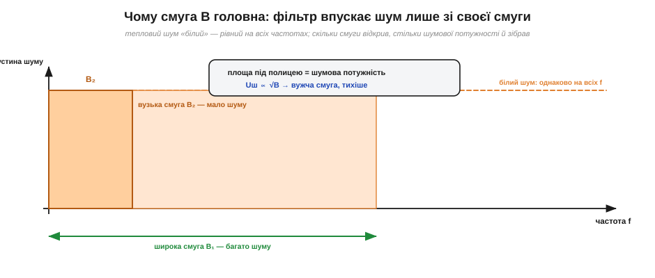
*Рис. 1.9.2.3. Тепловий шум «білий» — його густина однакова на всіх частотах (горизонтальна полиця). Шумова потужність, яку зловив прилад, — це площа під полицею в межах його смуги. Широка смуга B₁ збирає багато шуму; вузька B₂ — мало. Оскільки потужність ∝ B, шумова напруга ∝ √B: звузив смугу вчетверо — шум удвічі тихіший.*

Звідси й корінь: шумова **потужність** пропорційна смузі B, а **напруга** — кореню з потужності, тобто √B. І звідси найпрактичніша порада всієї теми: **не відкривай смугу ширшою, ніж потрібно сигналу.** Якщо корисний сигнал лежить, скажімо, до 100 Гц, а прилад слухає до 100 кГц, то 99.9 % зловленого шуму — зайвий, він прийшов із частот, де сигналу й нема. Поставивши фільтр, що зрізає все вище 100 Гц, ми викидаємо весь цей зайвий шум, нітрохи не зачепивши сигнал, — і SNR підскакує. Це безкоштовний виграш, і саме тому фільтр, узгоджений зі смугою сигналу, — перший інструмент у боротьбі з шумом.

Тут варто розвіяти поширену оману. Слово «білий» не означає, що в шумі «однаково всіх частот» у якомусь нескінченному сенсі — реальний шум завжди обмежений зверху (нескінченної потужності не буває). Воно означає лише, що в **тій смузі, де ми працюємо**, густина шуму практично рівна — як рівне світло лампи розжарювання в видимому діапазоні. І саме ця рівність робить смугу таким простим важелем: зменшив смугу вдвічі — рівно вдвічі менше шумової потужності впустив, без жодних тонкощів. Якби шум був «кольоровим» (нерівним за частотою, як 1/f із §1.9.3), залежність від смуги була б складнішою. Для теплового ж шуму все просто й лінійно за потужністю — тому формула така чиста.

Ще одна корисна інтуїція — звідки взагалі смуга в напрузі шуму, адже сам резистор «не знає» ні про який фільтр. Відповідь: резистор шумить **на всіх** частотах одразу, але **виміряти** ми можемо лише те, що пропустить наш тракт. Скільки спектра відкрили — стільки шуму й побачили. Сам по собі шматок дроту з резистором не має «своєї» шумової напруги в вольтах; ця напруга з'являється лише разом зі смугою вимірювання. Тому коректно казати не «резистор шумить на стільки-то мікровольтів», а «резистор шумить на стільки-то мікровольтів **у такій-то смузі**» — без смуги число безглузде. Саме тому, до речі, фундаментальною характеристикою шуму є не напруга, а **спектральна густина** (шум на одиницю смуги), про яку — у вставці нижче.

> 🔧 **Навіщо це.** Звідси випливає чому «повільні» вимірювання точніші. Коли мультиметр чи АЦП усереднює довше (робить менше відліків за секунду), він фактично **звужує смугу** — і впускає менше теплового шуму. Тому в режимі високої роздільності прилади навмисно сповільнюються: кожен зайвий розряд точності купується вужчою смугою й довшим часом вимірювання. Швидкість і тиша — завжди компроміс, і формула √(4kTRB) показує його точну ціну.

**Приклад (тепловий шум резистора 10 кОм).** Скільки шумить опір 10 кОм при кімнатній температурі в звуковій смузі до 20 кГц? Порахуймо за формулою Найквіста:

```
дано:  R = 10 000 Ом,  T = 300 К,  B = 20 000 Гц,  k = 1.38×10⁻²³ Дж/К
4kTR = 4 × (1.38×10⁻²³) × 300 × 10 000
4kTR = 1.656×10⁻¹⁶  (це «густина квадрата напруги», В²/Гц)
Uш² = 4kTR · B = 1.656×10⁻¹⁶ × 20 000 = 3.31×10⁻¹²  В²
Uш  = √(3.31×10⁻¹²) ≈ 1.82×10⁻⁶ В ≈ 1.8 мкВ (rms)
```

Майже два мікровольти шуму з простого резистора — лише через те, що він теплий. Для сигналу в кілька вольтів це дрібниця (SNR під 120 дБ), але для давача, що віддає одиниці мікровольтів, це вже стіна: тепловий шум резистора джерела зрівнявся з корисним сигналом. А тепер подивимось, як корінь рятує: щоб ушестеро **зменшити** цей шум (скажімо, до 0.3 мкВ), не вистачить ушестеро звузити смугу — корінь вимагає звузити її аж у 36 разів, до ~550 Гц. Те саме з опором: тихіше джерело з R = 1 кОм (учетверо… ні, удесятеро менше) шумітиме лише в √10 ≈ 3.2 раза тихіше. Корінь — це і подарунок, і кайдани водночас.

Цей приклад відкриває головну істину про тепловий шум давачів: **шумить уже саме джерело сигналу.** Будь-який давач має якийсь вихідний опір, і цей опір шумить за Найквістом ще до того, як сигнал дійшов до підсилювача. Хоч який тихий підсилювач ти поставиш, нижче за тепловий шум опору самого давача не опустишся — це абсолютна підлога. Тому, обираючи давач для слабких сигналів, дивляться не лише на його чутливість, а й на його **вихідний опір**: високоомне джерело шумить дужче й важче піддається тихому підсиленню. І тому ж, повторимо, головна стратегія — **звузити смугу** до тієї, що реально потрібна сигналу: це єдиний важіль, що знижує шум, не чіпаючи ні давач, ні температуру.

> 🧮 У даташитах підсилювачів тепловий шум подають не повною напругою, а **спектральною густиною** — у «нановольтах на корінь із герца» (нВ/√Гц). Що це за дивна одиниця, як із неї дістати повну шумову напругу для своєї смуги і чому корінь стоїть саме там — розібрано у вставці [нВ/√Гц: спектральна густина шуму — мова даташитів](math-noise-density.md). А чому стала Больцмана k й добуток kT (≈ 26 меВ при кімнатній температурі) виринають геть усюди у фізиці — від шуму до напівпровідників — у вставці [kT як універсальний масштаб](math-kt-scale.md).

Тепловий шум — не єдина внутрішня домішка. Поруч із ним живе ще двоє джерел, що випливають не з теплоти, а з **дискретності заряду** й із повільних процесів у матеріалі. До них — наступна тема.

---

## 1.9.3 Дробовий шум і шум 1/f

Тепловий шум (§1.9.2) народжувався з **теплового руху** — він є навіть у мертвому резисторі без струму. Але є шуми, що виникають саме тоді, коли **тече струм**, і їхнє коріння — в зовсім іншому факті природи, який ми вже знаємо з самого початку курсу: **заряд дискретний**. Згадаймо §1.1.1 — струм не є гладкою рідиною, він складається з окремих неподільних порцій-електронів (кожна по e = 1.602×10⁻¹⁹ Кл). А раз так, то й «рівний» струм насправді трохи зернистий: він тремтить просто тому, що зроблений із крапель. Цей зернистий шум називають **дробовим** (*shot noise*). А поряд із ним діє ще один, найзагадковіший і найповільніший, — **шум 1/f**, винуватець того, що дуже повільні вимірювання непомітно «пливуть».

### Дробовий шум: струм — це дощ окремих зарядів

Уявімо струм у новому образі. Ми звикли думати про нього як про рівний потік — стільки-то кулонів за секунду. Але якщо наблизитися «впритул», виявиться, що це радше **дощ окремих крапель**: носії заряду долають якийсь бар'єр (скажімо, p-n перехід у діоді чи транзисторі, або проміжок у вакуумній лампі) **поодинці** й у **випадкові** миті часу. Як краплі дощу по даху: усереднено за секунду їх падає певна кількість (це й є «середній струм»), але **в кожну окрему мить** їх то трохи більше, то трохи менше — стук нерівномірний. Ось ця нерівномірність дощу зарядів і є дробовий шум.

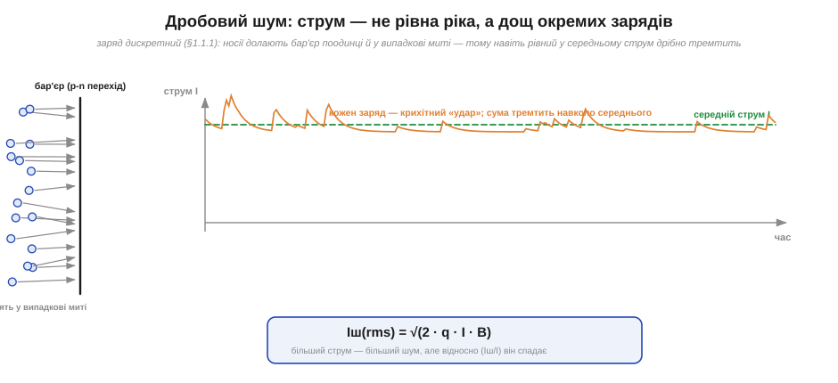
*Рис. 1.9.3.1. Носії заряду долають бар'єр (наприклад, p-n перехід) поодинці й у випадкові миті. Кожен — крихітний «удар» струму. Їхня сума дає рівний у середньому струм, але щомиті він тремтить навколо середнього — це дробовий шум. Чим менший струм (рідший дощ), тим відносно помітніша зернистість.*

Тут важлива тонка, але принципова відмінність від теплового шуму. Тепловий шум був у резисторі **завжди**, навіть без струму, бо його джерело — теплова тряска. Дробовий шум з'являється **лише коли тече струм** і коли носії долають якийсь **бар'єр** поодинці, незалежно один від одного. У звичайному металевому резисторі помітного дробового шуму немає: там електрони рухаються щільним, скорельованим «натовпом», вони весь час штовхають одне одного, тож їхній потік згладжений — окремі «краплі» не видно. А от у **p-n переході** (діод, транзистор) чи у вакуумному проміжку кожен носій долає бар'єр **сам**, як окрема подія, незалежно від сусідів, — і ось тоді зернистість виходить назовні повною мірою. Тому дробовий шум — характерна прикмета саме напівпровідникових переходів і вакуумних приладів, а не «опору взагалі».

Назва «дробовий» (англійською *shot* — «дріб», «постріл») — від образу дробинок, що сиплються поодинці. Її ввів Вальтер Шоттки 1918 року, вивчаючи флуктуації струму у вакуумних лампах, і вона прижилася. Величину дробового шуму, як і теплового, можна порахувати точно — і формула напрочуд схожа за духом:

```
Iш(rms) = √(2 · q · I · B)
```

де q = e — елементарний заряд, I — середній струм, B — смуга частот. Знову бачимо знайомий **квадратний корінь** і знайому **смугу B**: дробовий шум теж «білий» (рівний на всіх частотах) і теж тим більший, чим ширша смуга. Але є важлива тонкість, схована в корені. Сам шумовий струм Iш росте як √I, а **корисний** струм — як I. Тому **відносний** шум (Iш / I) спадає як 1/√I: що більший струм, то він **відносно** тихіший, гладкіший. Слабкі струми зернисті, сильні — гладкі. Це знову та сама статистика великих чисел: коли дощ рясний (мільярди крапель), окрема краплина не помітна; коли рідкий — кожна на слуху.

Цю «гру коренів» варто відчути на числах, бо вона неінтуїтивна. Збільшимо струм у сто разів: корисний сигнал виросте в 100 разів, а шумовий струм — лише в √100 = 10 разів. Відношення сигнал/шум за струмом покращало в 100/10 = 10 разів. Тобто **рясніший дощ зарядів завжди чистіший** — і це фундаментальна, не усувна жодною хитрістю властивість. Звідси й глибокий висновок: щоб надійно полічити **окремі** події (фотони, частинки, електрони), доводиться або набирати їх **багато** (рясний потік — малий відносний шум), або миритися з тим, що при лічених подіях зернистість непереборна. Скажімо, якщо детектор за час вимірювання зловив у середньому 100 квантів, то природний розкид цього числа — близько √100 = 10, тобто ±10 %; зловив 10 000 — розкид √10000 = 100, тобто вже лише ±1 %. Точність лічби росте як корінь із числа подій — той самий закон √N, що пронизує весь розділ.

> 🔧 **Навіщо це.** Дробовий шум стає головним болем там, де **струми мізерні**: фотодіоди в темряві, вхідні струми чутливих підсилювачів, лічильники окремих частинок. Якщо фотодіод ловить кілька фотонів, кожен народжує лічену кількість електронів — і дробовий шум фундаментально обмежує, наскільки слабке світло можна виміряти. Звідси й практичний хід: де можливо, працюють із **більшим** середнім струмом (рясніший дощ), бо тоді відносний дробовий шум менший. А в цифрових схемах дробовий шум зазвичай не турбує — там струми великі, а сигнали ще більші.

### Шум 1/f: чому повільні вимірювання «пливуть»

Тепловий і дробовий шуми — обидва «білі»: однакові на всіх частотах. Та якщо дуже довго й дуже уважно дивитися на сигнал чутливої схеми на **низьких** частотах — у герцах, частках герца, — виявиться щось дивне. Шуму там виявляється **більше**, ніж на високих, і що нижча частота, то його більше. Це **шум 1/f** (*flicker noise*, «флікер-шум», «мерехтливий шум», іноді «рожевий шум»). Його густина росте обернено пропорційно частоті: удесятеро нижча частота — приблизно вдесятеро більше шуму.


*Рис. 1.9.3.2. Спектри шуму в подвійному логарифмічному масштабі. Білий шум (тепловий + дробовий) — горизонтальна полиця, однакова на всіх частотах. Шум 1/f (флікер) злітає вгору на низьких частотах. Нижче кутової частоти fc він домінує — і саме він потрапляє в зону повільних вимірювань, проявляючись як дрейф нуля.*

Природа 1/f-шуму складніша за дві попередні й досі не зведена до однієї простої формули — це збірна назва для повільних процесів у матеріалі: захоплення й вивільнення носіїв на дефектах кристалічної ґратки, повільні перебудови на межах зерен, дрейф властивостей поверхні. Усі вони мають **довгу пам'ять** — діють у масштабі секунд, хвилин, годин, — і саме тому проявляються на низьких частотах. Практично 1/f-шум зливається з тим, що інженери називають **дрейфом** (*drift*): повільним «спливанням» нуля підсилювача, поступовою зміною показів із часом і температурою. Коли точний прилад, постоявши, починає показувати інший нуль, ніж пів години тому, — це здебільшого 1/f-шум і дрейф.

Дивовижне в 1/f те, **наскільки** він всюдисущий. Закон «густина ∝ 1/f» спостерігають не лише в електроніці: так само «шумлять» розлив річок рік до року, биття серця, гучність музики, коливання курсів, навіть похибка ходу маятникового годинника. Чому той самий закон виринає в геть різних системах — одна з відкритих загадок фізики; єдиної причини, схоже, немає, просто багато різних повільних механізмів дають схожий «рожевий» спектр. Для нас важливий практичний бік: 1/f задає **межу повільної точності**. У будь-якого підсилювача чи давача є **кутова частота** fc (на рис. 1.9.3.2), нижче якої 1/f переважає білий шум. Працювати «нижче fc» — означає неминуче мати справу з дрейфом; працювати «вище fc» — означає бачити лише тихий білий шум. Уся стратегія точних повільних вимірювань зводиться до того, щоб **не сидіти в зоні нижче fc** довше, ніж конче треба.

**Приклад (дробовий шум фотодіода).** Фотодіод під слабким світлом дає середній струм I = 1 нА. Скільки дробового шуму в смузі B = 1 кГц?

```
дано:  q = 1.602×10⁻¹⁹ Кл,  I = 1×10⁻⁹ А,  B = 1000 Гц
2qI = 2 × 1.602×10⁻¹⁹ × 1×10⁻⁹ = 3.2×10⁻²⁸
Iш² = 2qI·B = 3.2×10⁻²⁸ × 1000 = 3.2×10⁻²⁵  А²
Iш  = √(3.2×10⁻²⁵) ≈ 5.7×10⁻¹³ А ≈ 0.57 пА (rms)
```

Відносний шум тут Iш/I ≈ 0.57 пА / 1 нА ≈ 0.06 %, тобто струм у наноампер уже досить «гладкий». А якби струм був у тисячу разів менший (1 пА — лічені фотони), відносний дробовий шум зріс би в √1000 ≈ 32 рази, до ~1.8 %, і зернистість стала б серйозною завадою. Знову той самий висновок: рясніший потік — чистіший; рідкий — зернистий.

Звідси найважливіша практична думка про шум 1/f: **не намагайся побороти повільний дрейф «довгим і повільним» усередненням.** Інтуїція підказує протилежне — мовляв, поміряю довше, усереднюся краще. Але для білого шуму це працює, а для 1/f — ні: що довше міряєш, то нижчі частоти захоплюєш, а там 1/f-шуму якраз **більше**. Довге усереднення проти дрейфу — як вичерпувати човен, у якому що довше пливеш, то більша діра.

Правильні ліки інші. По-перше, **частіше калібрувати нуль** — раз у раз вимірювати відому опорну точку й віднімати дрейф. По-друге, вимірювати **різницю** двох близьких у часі відліків (диференційно): повільний дрейф у них майже однаковий і при відніманні зникає. По-третє, переносити корисний сигнал **на вищу частоту**, подалі від 1/f-зони, виміряти там, де панує тихий білий шум, а потім повернути назад (саме так працює прийом «модуляції–демодуляції», або «чопперні» підсилювачі). Спільна ідея всіх трьох: **не давати сигналу затриматися в низькочастотній зоні**, де живе 1/f.

Третій прийом вартий окремого слова, бо він спершу здається парадоксальним: навіщо тягати повільний сигнал на високу частоту й назад? Уявіть, що ви хочете виміряти дуже повільну (майже постійну) величину — а саме на постійці й найближче до неї панує 1/f-шум. Хитрість: швидко «перемикайте» сигнал (модулюйте) — наприклад, по черзі вимірюйте то сам сигнал, то нуль, сотні разів за секунду. Тоді корисна інформація переноситься на частоту перемикання (де білий шум малий), а повільний дрейф підсилювача лишається на місці — на нулі — і легко відокремлюється. Демодулювавши назад, отримуєте чистий повільний сигнал **без** дрейфу підсилювача. Це і є «чоппер» (*chopper*, дослівно «той, що рубає»): сигнал ніби «рубають» на шматки й переносять у тиху зону. Звучить складно, але саме так влаштовані найточніші підсилювачі для давачів — і тепер зрозуміло, **навіщо**: щоб утекти від 1/f.

> 🔧 **Навіщо це.** Будь-яке точне повільне вимірювання — температури, ваги, тиску, постійної напруги — впирається саме в 1/f-шум і дрейф, а не в тепловий шум. Тому терези автоматично «таруються» (калібрують нуль) перед зважуванням, точні вольтметри періодично заглядають у внутрішній еталон, а серйозні підсилювачі для давачів роблять «чопперними». Якщо вимірювання повільне й потребує стабільності хвилинами — головний ворог не теплова «трава», а тихий дрейф 1/f, і боротьба з ним зовсім інша.

**Приклад (де яка домішка головна).** Уявімо три задачі й спитаймо, який шум у кожній домінує:

```
(1) Звуковий підсилювач, смуга 20 Гц–20 кГц, опори десятки кОм:
    → панує ТЕПЛОВИЙ шум (широка смуга, помітні опори); 1/f лише в самому низу.
(2) Фотодіод ловить слабке світло, струм наноампери:
    → панує ДРОБОВИЙ шум (мізерний струм — рідкий дощ зарядів).
(3) Вимірювання постійної напруги з давача раз на секунду, годинами:
    → панує шум 1/f і ДРЕЙФ (наднизькі частоти, довгий час).
```

Три задачі — три різні головні вороги й три різні стратегії: звузити смугу й знизити опір; підняти струм; калібрувати нуль і вимірювати різницю. Уміння наперед сказати, **який шум домінує**, — і є професійний погляд на схему.

> ⚙️ Випадковий шум потрібен не лише для боротьби — його часто доводиться **створювати** (для тестів, моделювання, аудіо-дизерингу). Як із простого рівномірного `rand()` зробити правильний гаусів шум — у вставці [Шум у коді: від rand() до гаусового (Бокс—Мюллер)](proj-noise-generator.md). А чому реальні резистори різних типів шумлять по-різному (вуглецеві понад теплову межу, металоплівкові — майже на ній) — у вставці [Шумлять і резистори: вуглецеві проти металоплівкових](comp-resistor-noise.md).

На цьому ми закриваємо тему **внутрішнього** шуму. Він фундаментальний, його не вимкнути, але його можна порахувати й утримати під сигналом. Тепер — у зовсім інший світ: домішки, що приходять **ззовні**. І перший із трьох шляхів, якими вони лізуть, — це електричне поле.

---

## 1.9.4 Наводка через електричне поле: ємнісний зв'язок і гул 50 Гц

Є один дослід, який бачив кожен, хто брав у руки осцилограф. Береш щуп, нічого до нього не під'єднуєш, ставиш вхід на чутливу межу — і торкаєшся пальцем кінчика щупа. Екран миттю оживає: по ньому пробігає чистий, рівний синус із періодом 20 мілісекунд. Звідки? Ти ж нічого не під'єднав, нема джерела. А проте сигнал є, і він **не випадковий** — це рівно **50 герців**, частота електромережі. Твоє тіло, як антена, спіймало напругу з проводки, що оточує тебе з усіх боків — у стінах, у підлозі, у лампі над головою, — і завело її просто крізь повітря на високоомний вхід приладу. Це і є **наводка через електричне поле**, або **ємнісний зв'язок** (*capacitive coupling*) — найпоширеніша з усіх зовнішніх завад.

### Два провідники поряд — це конденсатор

Щоб зрозуміти механізм, повернімося до §1.1.3, де ми вводили **електричне поле**, і до того, що ми знаємо про конденсатор. Будь-які **два провідники, розділені проміжком**, утворюють конденсатор — більший чи менший, але завжди ненульовий. Дві жили в кабелі, провід і корпус, доріжка на платі й сусідня доріжка, мережевий дріт у стіні й твій сигнальний провід за метр від нього — будь-яка така пара має між собою якусь **ємність**. Зазвичай вона мізерна — частки чи одиниці пікофарад, — і ми про неї не думаємо. Її так і називають — **паразитна ємність** (*parasitic capacitance*, *stray capacitance*), бо ми її не ставили навмисно, вона просто є.

Тепер ключ: через конденсатор **тече змінний струм**, навіть якщо пластини нічим не з'єднані. Коли на одному провіднику напруга міняється (як на мережевому дроті — 50 разів на секунду гойдається на сотні вольтів), його змінне поле штовхає й тягне заряди на сусідньому провіднику в такт. Виходить, ніби паразитна ємність — це невидимий «дріт», що пропускає змінний сигнал з агресора на жертву. І що **вища частота** й що **більша ємність**, то «товщий» цей невидимий дріт — то легше проходить наводка.

Чому саме вища частота легше проходить? Інтуїція проста, без жодних формул. Через конденсатор заряд не «протікає» наскрізь — пластини розділені. Натомість, коли напруга на одній пластині росте, вона **притягує** заряд на іншу; коли падає — **відпускає** його. Тобто струм через ємність — це безперервне «перезаряджання» пластин у такт зміні напруги. А скільки заряду треба переганяти за секунду (тобто який струм) — залежить від того, **як швидко** міняється напруга: повільна зміна — мало перезаряджань, кволий струм; швидка — багато перезаряджань, рясний струм. Звідси й правило: чим вища частота агресора, тим більший наведений струм за тієї самої ємності. Постійна напруга (нульова частота) не проходить узагалі — пластини один раз зарядились і все, струму нема. Саме тому ємнісна наводка — це завжди про **змінні** сигнали: мережу, імпульси, радіо; постійку вона не переносить.

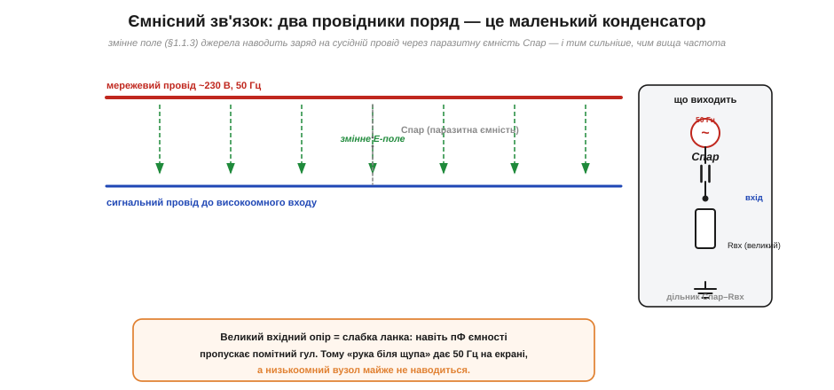
*Рис. 1.9.4.1. Мережевий провід (~230 В, 50 Гц) і сигнальний провід поряд утворюють паразитну ємність Cпар. Змінне поле джерела (§1.1.3) наводить заряд на сигнальний провід — крізь повітря, без жодного контакту. Праворуч — еквівалент: Cпар і вхідний опір Rвх утворюють дільник; на високоомному вході навіть пікофаради дають помітний гул 50 Гц.*

### Чому страждає саме високоомний вхід

Тут криється ключ до всієї поведінки ємнісної наводки — і до того, чому «рука біля щупа» дає такий помітний ефект. Подивимося на праву частину рисунка: паразитна ємність Cпар і вхідний опір приладу Rвх утворюють **дільник** (точнісінько такий, як ми розбирали в §1.4.6, тільки одне плече — ємнісне). Наводка, що проходить крізь Cпар, осідає на Rвх як напруга. І чим **більший** Rвх, тим більша частка наводки на ньому лишається.

Ось чому осцилограф із його типовим вхідним опором у мегаоми (а тим паче «висячий» розімкнений щуп — там опір майже нескінченний) так чутливий до ємнісної наводки: на величезному Rвх навіть мізерний наведений струм дає помітну напругу (за законом Ома, U = I·R, велике R множить струм у велику напругу). А **низькоомний** вузол — скажімо, вихід потужного джерела з опором у частки ома — практично не наводиться: той самий наведений струм на крихітному опорі дає нікчемну напругу. Звідси й перше правило проти ємнісної наводки: **тримай чутливі вузли низькоомними**, де можна, — наведеному струму нема на чому набрати напругу.

> 🔧 **Навіщо це.** Це пояснює класичну сцену біля приладу: торкаєшся високоомного входу — гул 50 Гц злітає до небес; під'єднуєш реальне низькоомне джерело — гул майже зникає. Не тому, що джерело «глушить» наводку активно, а тому, що його малий опір не дає наведеному струму перетворитися на помітну напругу. Тому, до речі, тонкий сигнал давача треба передавати **низькоомним** трактом і підсилювати раніше: високоомний сигнальний провід — це готова антена для мережевого гулу.

### Чому це майже завжди 50 (або 60) герців

Чому наведена завада так часто має саме частоту 50 Гц (у Європі; 60 Гц в Америці) і чистий синусоїдний вигляд? Бо найпотужніше й найвсюдисущіше джерело змінного поля навколо нас — це **електромережа**. Проводка в стінах, кабелі живлення, трансформатори, лампи — усі вони несуть мережеву напругу, що гойдається з частотою мережі, і всі вони випромінюють змінне електричне поле саме цієї частоти. Ми буквально живемо в слабкому 50-герцовому полі, що пронизує приміщення. Будь-який високоомний провід у цьому полі підхоплює його як антена — і на екрані з'являється знайомий «мережевий гул» (*mains hum*). За його **періодом** заваду й упізнають: рівно 20 мс між гребенями → 50 Гц → мережа (про це детально в §1.9.9).

**Приклад (звідки беруться мілівольти гулу).** Прикинемо грубо, який гул наведе мережа на висячий вхід осцилографа. Хай паразитна ємність між рукою/проводом і мережевою проводкою Cпар ≈ 1 пФ, мережева напруга Uмер ≈ 230 В при f = 50 Гц, а вхідний опір осцилографа Rвх = 1 МОм. Спершу — який струм пропустить ємність (її опір на 50 Гц — це ємнісний опір, що ми лише згадуємо тут якісно):

```
опір ємності:  Xc = 1 / (2π·f·C) = 1 / (2π × 50 × 1×10⁻¹²) ≈ 3.2×10⁹ Ом  (3.2 ГОм)
наведений струм:  I ≈ Uмер / Xc = 230 В / 3.2×10⁹ Ом ≈ 72 нА
напруга на вході:  Uгул ≈ I × Rвх = 72×10⁻⁹ А × 1×10⁶ Ом ≈ 72 мВ
```

Сімдесят мілівольтів гулу — з однієї жалюгідної пікофаради! На чутливій межі осцилографа це величезна хвиля через увесь екран. А тепер замінимо висячий вхід реальним джерелом з опором 1 кОм замість мегаома: напруга гулу впаде в тисячу разів — до ~72 мкВ, тобто стане майже непомітною. Те саме показує і зворотний бік: ємнісний опір на 50 Гц величезний (гігаоми), тож наведений струм мізерний — і лише на велетенському Rвх він встигає набрати помітну напругу. Усе сходиться: висока частота й великий вхідний опір — друзі ємнісної наводки; низький опір — її ворог.

### Як прибрати: екран і менший опір

Маючи механізм, маємо й ліки. Перший і найдієвіший — **екран** (*shield*): провідна оболонка навколо сигналу, з'єднана з «землею». Силові лінії електричного поля від агресора **обриваються на провіднику** (це ми бачили в §1.1.8 — всередині провідника поля немає), тож заземлений екран **перехоплює** поле на себе: наведений заряд стікає в землю, а сигнальна жила всередині лишається «в тіні», майже без поля. Другий важіль ми вже назвали — **знизити опір** вузла й **скоротити** довжину чутливого проводу (коротша антена ловить менше). Третій — **відсунути** сигнальний провід від джерела завади (ємність спадає з відстанню, наводка слабшає).

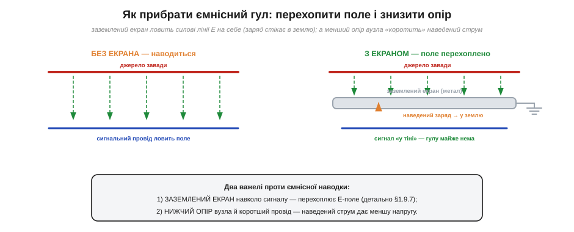
*Рис. 1.9.4.2. Ліворуч — без екрана: сигнальний провід ловить поле джерела й гуде. Праворуч — заземлений екран навколо сигналу перехоплює силові лінії E на себе (наведений заряд стікає в землю), і під ним поля майже нема. Два головні важелі проти ємнісної наводки: заземлений екран (детально §1.9.7) і нижчий опір та коротший провід вузла.*

Зауважте важливе: проти ємнісної наводки екран працює, **лише коли заземлений**. Просто металева трубка навколо проводу, ні до чого не під'єднана, мало що дає — поле наводиться на неї, а з неї на жилу. Лінії E мають **стікати в землю** — лише тоді поле справді перехоплене. Це принципова відмінність від екранування магнітного поля, яке працює зовсім інакше (про що — у §1.9.5 і §1.9.7). А **де саме** з'єднувати екран із землею (і чому часто лише з одного кінця) — окрема важлива тонкість, якій присвячено §1.9.7.

Зведемо в голові коротку «карту важелів» проти ємнісної наводки — усі вони прямо випливають із механізму. **Відстань**: відсунь сигнальний провід від агресора — ємність спадає, наводка слабшає (тому силові й сигнальні джгути розводять). **Орієнтація**: не клади чутливий провід паралельно агресору на велику довжину — що довший паралельний хід, то більша взаємна ємність. **Опір**: тримай чутливий вузол низькоомним — наведеному струму нема на чому набрати напругу. **Швидкість/смуга**: якщо корисний сигнал повільний, зріж фільтром високі частоти — найбільше ємнісної наводки приходить саме звідти (вона ж легше проходить на високих частотах). І, нарешті, **екран**: заземлена оболонка перехоплює поле. Жоден із цих важелів не вимагає рідкісних деталей — це передусім **геометрія й топологія**, тобто майже безкоштовно.

І остання, об'єднавча думка. Усе екранування приладів — металеві корпуси, заземлені кожухи, сітка на дверцятах мікрохвильовки (§1.1.8) — це той самий ємнісний механізм, узятий «навиворіт». Там ми захищаємо **зовнішній світ або нутро приладу**, обгортаючи його заземленим металом, щоб поле не проходило ні всередину, ні назовні. Тут, у сигнальному кабелі, ми робимо те саме в мініатюрі — обгортаємо одну тонку жилу. Принцип незмінний: **провідна заземлена оболонка перехоплює електричне поле й відводить його заряд у землю.** Засвоївши його один раз на прикладі «руки біля щупа», ви впізнаєте його скрізь — від екранованого мікрофонного кабелю до металевого корпусу будь-якого приладу.

Чому саме твоє тіло — така добра антена для мережі? Бо воно велике, провідне (солона вода всередині — §1.2.11) і має чималу площу, тож ємність між тобою й навколишньою проводкою — десятки пікофарад, набагато більше за ємність тонкого дроту. Стоячи в кімнаті, ти буквально занурений у 50-герцове поле проводки в стінах і підлозі, і твоє тіло набирає від нього напругу в кілька вольтів змінного потенціалу відносно землі (саме тому, торкнувшись входу, ти заводиш на нього такий помітний гул). Це не лише курйоз для осцилографа — це й причина, чому сенсорні кнопки (ємнісні) реагують на дотик пальця, і чому деякі прилади «відчувають» наближення руки. Той самий механізм, що псує вимірювання, в інших застосуваннях стає корисним давачем дотику. Розуміючи фізику, бачиш обидва боки тієї самої медалі.

> 🔧 **Навіщо це.** Тому всі чутливі аналогові сигнали возять у **екранованому кабелі** (з'єднаному з землею), мікрофонні й давачеві лінії роблять екранованими, а корпуси приладів роблять металевими й заземленими. Той самий принцип, що рятує від гулу мережі, лежить в основі будь-якого аналогового тракту: спершу — низький опір і коротка лінія, потім — заземлений екран навколо неї. Засвоївши ємнісний механізм, ви розумієте не лише, **чому** рука біля щупа дає 50 Гц, а й **чому** півжиття інженера-аналоговика — це боротьба за правильний екран і «землю».

> 📜 Колись цей самий гул був не лабораторною дрібницею, а національною проблемою: коли телефонні лінії потягли вздовж силових і трамвайних, у слухавках загуло так, що розмовляти стало годі. Як телефоністи десятиліттями воювали з наводкою від силових мереж — у вставці [Гул у слухавці: як телефоністи воювали з силовими лініями](hist-induction-coordination.md).

Ємнісний зв'язок переносить заваду через **електричне** поле, і головну роль грає **напруга** агресора та опір жертви. Але є й дзеркальний механізм — коли заваду несе **магнітне** поле, і головну роль грають **струм** агресора та площа петлі жертви. До нього — наступна тема.

---

## 1.9.5 Наводка через магнітне поле: індуктивний зв'язок і площа петлі

Ємнісна наводка (§1.9.4) проникала через **електричне** поле, і ключем була **напруга** агресора. Але є рівноправний брат-близнюк, що діє через **магнітне** поле, — **індуктивний зв'язок** (*inductive coupling*, *magnetic coupling*). Тут усе дзеркальне: винуватцем є вже не напруга, а **струм** агресора; жертва вловлює заваду не високим опором, а **площею петлі**; і помагає не заземлений екран, а геометрія проводів. Цей механізм підступніший за ємнісний — від нього не рятує проста заземлена оболонка, — і саме він стоїть за багатьма «незрозумілими» завадами біля моторів, трансформаторів та силових кабелів.

### Струм народжує поле, змінне поле наводить ЕРС

Складемо механізм із двох цеглинок, які ми вже маємо. Перша — з §1.8.4: **струм народжує магнітне поле**. Навколо будь-якого проводу зі струмом завивається магнітне поле B, і концентричні силові лінії охоплюють провід кільцями (правило правої руки). Якщо струм **змінний** (як у мережевому кабелі чи в проводі до мотора), то й поле B навколо нього **змінне** — воно пульсує в такт струму.

Друга цеглинка — з §1.8.10, де ми вводили **електромагнітну індукцію**: змінне магнітне поле, що пронизує контур (петлю з дроту), **наводить у ньому ЕРС** (закон Фарадея). Що швидше міняється потік крізь петлю — то більша наведена напруга. А потік — це поле, помножене на **площу** петлі.

Складімо разом. Провід-агресор зі змінним струмом породжує навколо себе змінне поле B. Якщо поряд є наш сигнальний ланцюг, і він утворює **петлю** (а він майже завжди її утворює: сигнал тече «туди» одним проводом і повертається «назад» іншим, замикаючи контур), то змінне поле B пронизує площу цієї петлі — і наводить у ній паразитну ЕРС. Ця ЕРС додається просто до корисного сигналу. Ось і весь індуктивний зв'язок.

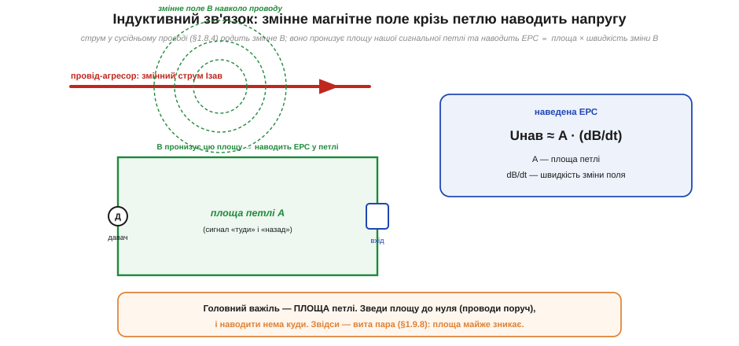
*Рис. 1.9.5.1. Провід-агресор зі змінним струмом Iзав (§1.8.4) родить навколо себе змінне поле B. Воно пронизує площу A нашої сигнальної петлі («туди» давачем, «назад» іншим проводом) і за законом індукції (§1.8.10) наводить ЕРС. Величина наводки Uнав ≈ A·(dB/dt): площа петлі × швидкість зміни поля.*

Якісна формула наведеної напруги проста й дуже промовиста:

```
Uнав ≈ A · (dB/dt)
```

де A — **площа петлі** жертви, а dB/dt — **швидкість зміни** магнітного поля в місці петлі. Розберімо, що тут за важелі. По-перше, **площа A**: що більша петля, утворена сигнальним і зворотним проводами, то більше поля вона «зачерпує» і то більша наводка. По-друге, **dB/dt** — швидкість зміни поля: вона тим більша, чим більший і чим швидше змінний струм агресора (різкі імпульси з крутими фронтами наводять сильніше за плавний синус тієї самої амплітуди) і чим ближче агресор (поле спадає з відстанню). Зменшити можна будь-який із цих множників — але найкерованіший, найдоступніший інженеру важіль — це **площа петлі**.

Спинімося на множнику **dB/dt**, бо в ньому захована неочевидна, але дуже практична річ: наводить не саме поле, а **його зміна**. Постійне магнітне поле (хай яке сильне) у нерухомій петлі **не наводить нічого** — потік сталий, його похідна нуль. Тому статичний магніт поряд із сигнальним проводом не страшний; страшний **змінний** струм. І ще важливіше — наводка тим більша, чим **крутіша** зміна. Плавний синус 50 Гц міняється відносно повільно. А різкий імпульс (іскра на щітках мотора, фронт цифрового сигналу, момент розмикання реле) міняється за частки мікросекунди — його dB/dt у тисячі разів більше, і він наводить незрівнянно сильніше, навіть якщо «середній» струм невеликий. Ось чому комутаційні завади (про їх «почерк» — у §1.9.9) такі болючі: коротка, але крута зміна струму породжує великий dB/dt і б'є по сигналу гострим викидом. Запам'ятаймо це правило: **круті фронти небезпечніші за великі амплітуди**.

### Площа петлі — це «антена» для магнітної наводки

Ось головна думка теми, варта того, щоб вкарбуватися: **петля з дроту — це антена для магнітних завад, а її розмір — площа.** Велика петля (сигнальний і зворотний проводи розведені широко, гуляють різними шляхами) ловить багато поля й сильно наводиться. Мала петля (проводи притиснуті один до одного, йдуть поруч) ловить майже нічого. А якщо площу звести до нуля — наводити нема куди, ЕРС зникає.

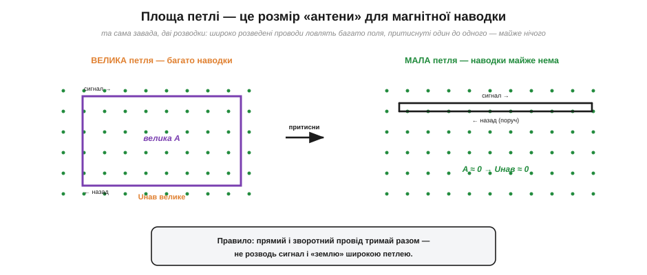
*Рис. 1.9.5.2. Та сама завада (однорідне поле B з площини), дві розводки. Ліворуч — широко розведені сигнальний і зворотний проводи: велика площа A, велика наводка. Праворуч — ті самі проводи притиснуті один до одного: A ≈ 0, наводки майже нема. Правило: тримай прямий і зворотний провід разом, не розводь сигнал і «землю» широкою петлею.*

Звідси випливає найпростіша й найдешевша зброя проти індуктивної наводки — **притиснути проводи один до одного**. Сигнальний провід і його зворотний (земляний) мають іти **поряд**, найкраще — впритул, щоб площа між ними була мізерна. Тоді поле просто не має куди пронизувати. Це безкоштовно (нічого не треба купувати, лише правильно прокласти) і часто дієвіше за будь-який екран. А якщо проводи ще й **перевити** між собою — вийде вита пара, де площа не просто мала, а й почергово міняє знак, і наводки гасять одна одну майже повністю. Це настільки важливий прийом, що йому присвячено окрему тему §1.9.8.

Тут варто наголосити на частій помилці новачка — забути про **зворотний** провід. Думаючи про сигнал, легко стежити лише за «прямим» проводом — від давача до входу — і не замислюватися, **яким шляхом струм повертається**. А саме контур «туди + назад» і утворює петлю, що ловить наводку. Якщо зворотний струм іде якимось далеким, окремим шляхом (наприклад, через спільну землю іншим боком плати), петля виходить велетенська, навіть якщо сам сигнальний провід короткий. Тому правильна звичка — завжди питати: «де тече зворотний струм?» — і вести його **впритул** до прямого. На платах це роблять суцільним шаром «землі» під сигнальними доріжками: зворотний струм сам стікається просто під доріжкою (шляхом найменшого опору й індуктивності), і петля стискається майже до нуля без жодних зусиль монтажника.

> 🔧 **Навіщо це.** Це пояснює низку «магічних» правил монтажу, які інакше здавалися б забобонами. Чому сигнальні й силові кабелі не кладуть паралельно впритул, а перетинають під прямим кутом (при перетині поле майже не пронизує петлю). Чому до давача тягнуть **виту пару**, а не два розкидані дроти. Чому на платі сигнальну доріжку ведуть прямо над суцільним шаром «землі» (зворотний струм тече просто під нею, площа петлі — майже нуль). Усе це — боротьба за **малу площу петлі**, прямий наслідок формули Uнав ≈ A·(dB/dt).

### Чому екран тут не панацея

Важлива й часто несподівана річ: від магнітної наводки **проста заземлена оболонка майже не рятує** — на відміну від ємнісної. Згадаймо, чому екран працював проти електричного поля: лінії E обриваються на провіднику й стікають у землю (§1.9.4, §1.1.8). Але магнітне поле B **проходить крізь** тонкий немагнітний провідник майже без перешкод — алюмінієва чи мідна оболонка для статичного й низькочастотного B практично прозора. Тож заземлений екран, що чудово глушив ємнісну наводку, проти магнітної на низьких частотах майже безсилий.

Що ж тоді працює проти B? Три речі. Перша й головна — **геометрія**: мала площа петлі, притиснуті проводи, вита пара (саме тому магнітну наводку б'ють здебільшого розводкою, а не екраном). Друга — щоб екран **сам став зворотним провідником**: якщо зворотний струм тече по екрані, що щільно охоплює жилу (як у коаксіалі), то поля прямого й зворотного струмів майже взаємно гасяться, і петля стискається до нуля. Третя, для серйозних випадків, — **магнітний екран** із матеріалу з високою магнітною проникністю (типу пермалою), що «замикає» силові лінії в собі; але це дорого й громіздко. Для практики достатньо запам'ятати: **проти E — заземлений екран, проти B — геометрія й мала петля**.

Чому ж проста металева оболонка все-таки **частково** допомагає й проти змінного магнітного поля на високих частотах? Бо змінне поле, проходячи крізь метал, наводить у самому металі **вихрові струми** (їх ми згадували в §1.8.10), а ті, за правилом Ленца, породжують власне поле, протилежне зовнішньому, — і частково його гасять. Що вища частота, то сильніші вихрові струми й то краще екран глушить магнітну наводку. Тому на високих частотах (мегагерци й вище) звичайний мідний чи алюмінієвий екран уже відчутно ослаблює і B, а от на низьких (50 Гц) вихрові струми мляві, і проти такого поля метал майже прозорий. Звідси й чесний підсумок: на низьких частотах проти B — лише геометрія, на високих — допомагає й екран (через вихрові струми). Але «магнітну наводку б'ють геометрією» лишається золотим правилом, бо саме воно діє на всіх частотах і нічого не коштує.

**Приклад (наводка від кабелю до мотора).** Поряд із сигнальним кабелем за 5 см проходить провід, що живить мотор змінним струмом. Сигнальна петля має ширину 1 см і довжину 50 см, тобто площу A = 0.01 м × 0.5 м = 0.005 м². Хай у місці петлі змінне поле має амплітуду такої швидкості зміни, що dB/dt ≈ 0.2 Тл/с (груба оцінка для помітного струму поряд). Тоді наведена напруга:

```
A = 0.01 м × 0.5 м = 0.005 м²
Uнав ≈ A · (dB/dt) = 0.005 × 0.2 = 1.0×10⁻³ В = 1 мВ
```

Один мілівольт наводки — а для давача, що віддає десятки мілівольтів, це вже відчутна домішка. Тепер притиснемо проводи: зведемо ширину петлі з 1 см до 1 мм — площа впаде в десять разів, і наводка стане 0.1 мВ. А перевивши пару (§1.9.8), зменшимо її ще на порядок-два. Те саме без жодної купленої деталі — лише правильною геометрією. Ось чому досвідчений монтажник передусім дивиться не «який тут екран», а «яка площа петлі» — і це найдешевший спосіб приборкати магнітну заваду.

Тепер варто звести разом два механізми наводки — ємнісний (§1.9.4) та індуктивний — бо вони **дзеркальні**, і це дзеркало дуже допомагає не плутатися. Ємнісна наводка йде через **електричне** поле; її жене **напруга** агресора; жертва ловить її **високим опором**; рятує **заземлений екран**; вона тим сильніша, чим **вища частота й більший опір** вузла. Індуктивна наводка йде через **магнітне** поле; її жене **струм** агресора; жертва ловить її **площею петлі**; рятує **мала петля й геометрія**; вона тим сильніша, чим **крутіша зміна струму й більша площа**. Звідси й діагностична підказка: якщо завада зростає, коли **роз'єднуєш** вузол (робиш його високоомнішим) — це радше ємнісна; якщо завада живе, навіть коли вузол низькоомний, і реагує на **площу петлі** й близькість силового кабелю — це радше індуктивна. Дві наводки, два дзеркальні набори важелів — і ясне правило, який пробувати першим.

> 🧮 Звідки береться поле навколо проводу і як його порахувати — у математиці §1.8 (закон Біо—Савара, ампер-витки). Тут важливий лише висновок: змінний струм → змінне B → наведена ЕРС ∝ площа петлі. А чому різкі імпульси (з великим dB/dt) наводять незрівнянно сильніше за плавний синус — побачимо на практиці в §1.9.9, упізнаючи «імпульсні викиди» на екрані.

Ми розібрали два «безконтактні» шляхи завади — через електричне поле (ємнісний) і через магнітне (індуктивний). Лишився третій, найковарніший, бо він діє не крізь повітря, а через **спільний провід**, яким два ланцюги змушені користуватися разом, — і саме він винен у славнозвісних «земляних петлях».

---

## 1.9.6 Спільний шлях повернення: земляні петлі й спільний імпеданс

Дотепер завада приходила **крізь повітря** — полем. Але є третій механізм, що часто винен у найзагадковіших гулах, і він зовсім інший: завада тут проникає не через поле, а через **спільний провід** — той самий шматок дроту, яким змушені користуватися одразу два різні ланцюги. Корінь проблеми — у факті, який ми твердо засвоїли ще в §1.3.1 і §1.6.4: **жоден реальний провід не має нульового опору.** «Земля», яку ми на схемах малюємо одним символом і вважаємо ідеальним нулем вольтів, насправді є мережею реальних дротів із реальним (хай і крихітним) опором. І щойно цим спільним дротом починають текти **два різні струми**, ідеальний нуль розсипається.

### Спільний імпеданс: чужий струм робить напругу на «землі»

Розгляньмо типову ситуацію. На одній платі (чи в одному приладі) живуть два блоки: **сильний** — скажімо, мотор чи потужний світлодіод, що споживає великий струм, — і **слабкий** — давач із крихітним сигналом. І обидва повертають свій струм назад до джерела **одним і тим самим** земляним дротом. Поки що нічого підозрілого. Але згадаймо закон Ома (§1.3.2): струм, течучи по дроту з опором Rg, створює на ньому **падіння напруги** U = I·Rg. Сильний блок жене великий струм Iсил — і на спільному дроті виникає падіння Iсил·Rg. А слабкий давач «бачить» свою землю **не в істинному нулі**, а на цьому піднятому потенціалі — і паразитна напруга Iсил·Rg домішується просто до його сигналу.

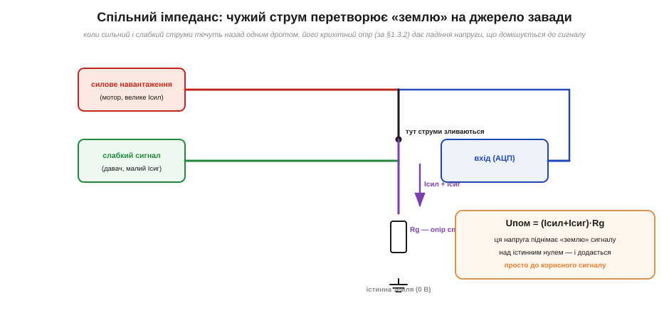
*Рис. 1.9.6.1. Сильне навантаження (мотор) і слабкий давач повертають струм одним спільним дротом з опором Rg. За законом Ома (§1.3.2) сумарний струм створює на ньому падіння Uпом = (Iсил+Iсиг)·Rg. Ця напруга піднімає «землю» сигналу над істинним нулем — і додається просто до корисного сигналу. Винен не якийсь «витік», а опір спільного зворотного дроту.*

Це і є **завада через спільний імпеданс** (*common-impedance coupling*). Найпідступніше в ній те, що вона не приходить ні полем, ні випромінюванням — вона «вшита» в саму топологію з'єднань. Хоч як екрануй, хоч як притискай проводи, поки сильний і слабкий струми течуть назад **спільною** ділянкою дроту, чужий струм робитиме на ній напругу, що псує сигнал. Особливо боляче, коли сильний струм ще й **змінний чи імпульсний** (мотор, ШІМ, цифрові кидки): тоді на сигналі з'являється змінна завада, що ритмічно смикається в такт роботі сильного блока.

Корінь усієї проблеми — у звичці думати про «землю» як про ідеальний нуль. На схемі ми малюємо землю одним символом, ніби всі точки, позначені ним, — це одна й та сама точка з потенціалом рівно 0 В. Це зручна **ідеалізація**, і поки струми малі, вона працює. Але фізично «земля» — це **мережа реальних дротів і доріжок**, кожна з опором (а на високих частотах — ще й з індуктивністю). Двi точки, обидві позначені символом землі, з'єднані не чарівним нулем, а шматком міді з опором, скажімо, 0.05 Ом. Поки між ними не тече струм, вони й справді мають однаковий потенціал. Та щойно потече — між ними з'являється різниця U = I·R, і дві «однакові землі» розходяться. Тому досвідчений інженер ніколи не каже просто «земля» — він питає «**яка саме** земля, у якій точці, і які струми крізь неї течуть». Земля — не точка, а провідник; і до неї застосовний закон Ома так само, як до будь-якого іншого дроту.

> 🔧 **Навіщо це.** Класичний симптом: давач показує рівно, аж поки не ввімкнеться мотор (або підсвітка, або передавач) — і тоді на сигналі вискакує гул чи стрибки, синхронні з роботою того блока. Дев'ять разів із десяти причина — спільний земляний дріт: великий струм мотора падає напругою на ділянці, яку давач вважає своїм нулем. Лікування не в екрані, а в **розводці**: дати кожному блоку **окремий** шлях повернення до спільної точки (про це нижче). Уміння впізнати цей почерк — «завада з'являється рівно тоді, коли вмикається щось потужне» — економить багато марних спроб «заекранувати».

### Земляна петля: дві «землі» з різницею потенціалів

Той самий механізм у більшому масштабі дає сумнозвісну **земляну петлю** (*ground loop*). Уявімо два окремі прилади — кожен зі своєю вилкою в свою розетку, — з'єднані сигнальним кабелем (наприклад, екранованим). Кожен прилад заземлено через свою розетку на «землю» будівлі. Здавалося б, обидві землі — це «нуль». Але **«земля» в різних розетках — НЕ той самий потенціал!** Проводка будівлі довга, по ній течуть мережеві струми інших споживачів, і через її опір між двома точками заземлення завжди є якась різниця потенціалів — від мілівольтів до вольтів, та ще й на частоті 50 Гц.

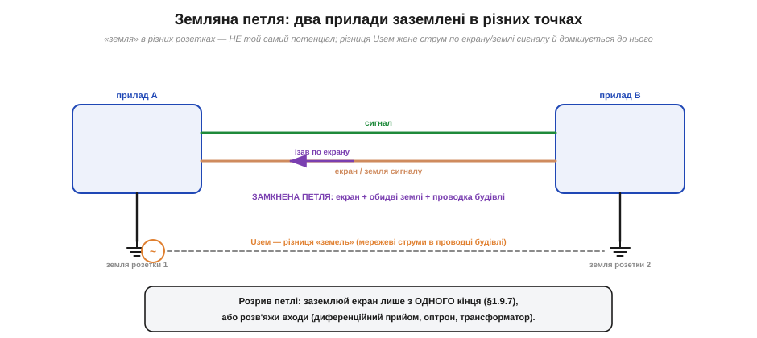
*Рис. 1.9.6.2. Прилади A і B заземлені кожен у свою розетку. «Земля» розетки 1 і розетки 2 — не той самий потенціал: між ними є різниця Uзем (мережеві струми в проводці будівлі). Ця різниця жене струм по замкненій петлі «екран кабелю + обидві землі + проводка будівлі». Струм по екрану наводить на сигнал гул 50 Гц.*

Тепер бачимо петлю: екран сигнального кабелю + земля приладу A + земля розетки 1 + проводка будівлі + земля розетки 2 + земля приладу B — усе це замкнений контур. Різниця потенціалів Uзем між двома заземленнями жене цим контуром струм, і він тече **по екрану сигнального кабелю** (бо екран — частина петлі). А струм по екрану падає напругою на опорі екрана — і ця напруга домішується до сигналу. Виходить класичний 50-герцовий гул, що дошкуляє звукотехніці, відеосистемам, лабораторним установкам — усюди, де два заземлені прилади з'єднані сигнальним кабелем.

Як розірвати земляну петлю? Ідея завжди одна — **не дати струму завади текти шляхом сигналу**. Способів кілька. Заземлити екран лише з **одного** кінця (тоді петля розімкнена — детально в §1.9.7). Розв'язати входи **гальванічно**: трансформатором, оптроном, диференційним приймачем (тоді між приладами немає прямого електричного містка для струму завади, а сигнал передається «через бар'єр»). Або звести всі землі в **одну точку**, щоб петлі взагалі не утворювалося. Усі ці прийоми ми згадаємо далі; головне зараз — зрозуміти **причину**: дві «землі» — це майже ніколи не той самий нуль.

Класичне місце, де земляна петля чутно дошкуляє, — **звукова** техніка. З'єднайте два прилади, що живляться від різних розеток, звичайним аудіокабелем — і в колонках з'явиться знайоме муркотіння на 50 Гц («земляний гул», *ground hum*). Причина рівно та, що на рисунку: різниця потенціалів двох заземлень жене струм по екрану аудіокабелю, і він домішується до звуку. Тому в студіях так бережно зводять усі землі в одну точку, застосовують розв'язувальні трансформатори й балансні (диференційні) лінії. Це, до речі, чудовий приклад того, як та сама фізика проявляється скрізь: муркотіння в колонках, дрижання показів давача й збій цифрової шини — це той самий спільно-імпедансний механізм, лише в різних масштабах і з різними наслідками.

### Зірка проти ланцюжка: як розводити «землю»

Якщо причина завади — спільний шлях повернення, то й профілактика в тому, **як саме розводити земляні проводи**. Тут протистоять дві топології. Погана — **ланцюжок** (*daisy-chain*): блоки «нанизані» на один земляний дріт один за одним, як намистини, і струм дальнього блока тече назад крізь земляні ділянки всіх ближніх. Хороша — **зірка** (*star ground*, з'єднання в одній точці): кожен блок має **власний** окремий провід до однієї спільної точки «землі», і струми різних блоків ніде не змішуються по дорозі.

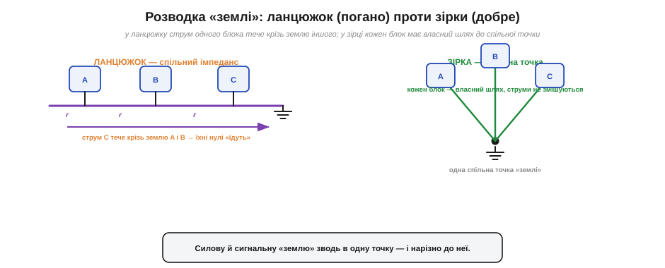
*Рис. 1.9.6.3. Ліворуч — ланцюжок: блоки нанизані на спільний земляний дріт, тож струм блока C тече крізь земляні ділянки A і B, і їхні «нулі» їдуть. Праворуч — зірка: кожен блок веде окремий провід до однієї спільної точки, струми не змішуються. Силову й сигнальну «землю» зводять в одну точку — і нарізно до неї.*

Особливо важливо розділяти **силову** й **сигнальну** землі. Великі, брудні струми (мотори, силові ключі, потужні світлодіоди) мають свій земляний шлях; тонкі, чутливі сигнали — свій; і сходяться вони лише в **одній** спільній точці, найкраще біля джерела живлення. Тоді брудний струм фізично не проходить ділянкою, яку чутливий вузол вважає нулем, — і не псує сигнал. Це одне з наріжних правил розводки плат і приладів, і випливає воно прямо зі спільно-імпедансного механізму.

Зірка, втім, не панацея на всі випадки — і чесно сказати, де її межа. Вона ідеальна для **низьких** частот, де головне — не пускати брудний струм спільним опором. Але на дуже **високих** частотах довгі окремі проводи зірки самі стають проблемою (у них помітна індуктивність, вони працюють як антени), і там воліють інший підхід — суцільний **шар землі** (*ground plane*), до якого все під'єднується найкоротшим шляхом, а зворотні струми самі знаходять оптимальний шлях під доріжками. Тому повне правило звучить так: **на низьких частотах — зірка (одна точка), на високих — суцільний шар землі**; а часто й комбінація. Але для нашого рівня й для більшості аналогових сигналів головне просте: не змушуй чужий сильний струм текти ділянкою, яку твій слабкий сигнал вважає нулем.

**Приклад (скільки гулу дає спільна земля).** Давач і світлодіодна підсвітка ділять спільний земляний дріт, скажімо, з опором Rg = 0.1 Ом. Підсвітка пульсує струмом Iсил = 0.5 А (вмикається-вимикається ШІМ). Який стрибок «землі» бачить давач?

```
Uпом = Iсил · Rg = 0.5 А × 0.1 Ом = 0.05 В = 50 мВ
```

П'ятдесят мілівольтів стрибків на «землі» — і всі вони лягають просто на сигнал давача, та ще й синхронно з ШІМ підсвітки. Якщо давач віддає сигнал у десятки мілівольтів — завада того ж порядку, вимірювання зіпсоване. А тепер дамо підсвітці **окремий** земляний провід прямо до джерела (зірка): її струм більше не тече ділянкою давача, і стрибок на сигнальній землі падає до мікровольтів. Жодного екрана, жодної нової деталі — лише інша топологія тих самих проводів. Ось чому грамотна «земля» коштує нуль грошей, але рятує більше нервів, ніж будь-який екран.

Корисно відчути, що опір «землі», який усе це спричиняє, мізерний — і саме тому проблему так легко проґавити. Метр тонкого монтажного дроту має опір порядку сотих ома; доріжка на платі — теж міліоми; контакт роз'єму — міліоми. На схемі це нуль, на вимірі мультиметром — майже нуль. Але помножте ці міліоми на ампери сильного струму — і отримаєте мілівольти завади, що для слабкого сигналу вже катастрофа. Ось чому спільний імпеданс такий підступний: винуватець — опір, **надто малий**, щоб його запідозрити, але **достатній**, щоб зіпсувати сигнал у парі з великим струмом. Перевіряється це просто: якщо завада росте з ростом струму сильного блока (більше навантаження — більший гул) і зникає, коли блокам дати окремі землі, — діагноз «спільний імпеданс» підтверджено.

> 🔌 Як це виглядає на практиці — на макетній платі, де спокуса «нанизати» все на одну земляну шину особливо велика, — розібрано у вставці [Розводка «землі» на макетці: зірка проти ланцюжка](comp-star-ground.md). Там же — типові граблі макетки й чому її довга земляна шина сама стає спільним імпедансом.

Спільний імпеданс і земляні петлі лікують **топологією** — розводкою проводів і розривом петель. Але є й активний захисний прийом, що бореться одразу з ємнісною наводкою й допомагає проти земляних петель, — це **екран** навколо сигналу. Ми вже кілька разів на нього посилалися; час розібрати його як слід.

---

## 1.9.7 Екран у дії: клітка Фарадея для сигналу

Ми вже двічі згадували екран як ліки від наводки — час розібрати його по-справжньому. В основі лежить явище, яке ми докладно вивчили в §1.1.8: **усередині провідника, що оточує об'єм, електричного поля немає.** Це **клітка Фарадея** (*Faraday cage*) — провідна оболонка, всередину якої не проникає зовнішнє електричне поле, бо вільні заряди оболонки самі перерозподіляються так, щоб погасити поле всередині. У §1.1.8 ми застосовували цей принцип, щоб **захистити простір** (нутро мікрохвильовки, екранована кімната). Тепер застосуємо його точково — щоб **захистити сигнальний провід**: обгорнемо тонку чутливу жилу провідною оболонкою, і зовнішні електричні поля до неї вже не доберуться. Це той самий принцип клітки Фарадея, лише стиснутий до розмірів кабелю.

Варто на мить здивуватися, наскільки це сильна ідея. Майкл Фарадей колись зачинявся в металевій кімнаті, обвішаній зовні зарядами, і не виявляв усередині **жодного** сліду електричного поля — заряди оболонки самі вишиковувалися так, щоб усе погасити. Та сама фізика працює й у мідній оплітці завтовшки з волосину навколо сигнальної жили: зовнішнє поле наводить заряди на оплітку, ті перерозподіляються — і всередині поля практично не лишається. Дивовижно, що для електричного поля важлива не товщина металу й не його кількість, а лише **те, що він суцільний і провідний**: навіть тонка фольга чи густа сітка повністю перехоплюють статичне й низькочастотне поле. Тому екран сигнального кабелю не мусить бути масивним — досить тонкої, але суцільної й заземленої провідної оболонки.

### Як екран перехоплює поле

Механізм для сигналу той самий, що ми бачили в §1.9.4, тільки тепер подивимося на нього як на повноцінний інструмент. Сигнальну жилу охоплює провідна оболонка — **екран** (*shield*): суцільна фольга, обплетення з тонких дротинок (оплітка), або трубка. Зовнішнє електричне поле від агресора (мережі, сусіднього кабелю) натрапляє на цю провідну оболонку — і його силові лінії **обриваються на ній**, не проникаючи всередину. Наведений зовнішнім полем заряд осідає на екрані, а звідти стікає в **землю** (екран заземлений). Сигнальна жила всередині лишається «в тіні» — поля біля неї майже немає, тож і наводити нема чому.

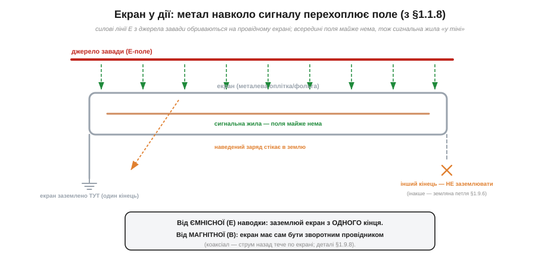
*Рис. 1.9.7.1. Силові лінії E від джерела завади обриваються на провідному екрані (з §1.1.8 — всередині провідника поля немає) і стікають у землю. Сигнальна жила всередині — «у тіні», поля майже нема. Екран заземлено з ОДНОГО кінця: інший кінець навмисно лишають вільним, щоб не утворити земляну петлю (§1.9.6).*

Підкреслимо ще раз річ, без якої екран не працює: проти електричного поля екран рятує, **лише коли заземлений**. Незаземлена металева оболонка навколо проводу мало що дає — поле наводиться на неї, а з неї крізь внутрішню ємність на жилу. Лінії E мають кудись **стікати**, і це «кудись» — земля. Заземлений екран — це працююча клітка Фарадея; незаземлений — просто шматок металу, що сам став антеною.

Якою має бути добра клітка Фарадея для сигналу? Тут є кілька практичних тонкощів, що відрізняють надійний екран від декоративного. По-перше, **суцільність покриття**. Ідеальний екран повністю охоплює жилу; реальна оплітка має дірочки між дротинками, і крізь них трохи поля просочується. Тому якісні кабелі роблять із густою опліткою (висока «щільність покриття», %), а для відповідальних застосувань — з суцільною фольгою або з фольгою плюс оплітка. По-друге, **розриви — це зло**. Будь-яка щілина в екрані (місце, де він не з'єднаний, або довгий незаекранований хвостик біля роз'єму — «косичка») працює як прохід для поля; на високих частотах навіть коротка щілина помітно псує захист. По-третє, екран має оточувати сигнал **по всьому шляху** — обірваний на півдорозі екран лишає жилу відкритою саме там, де він закінчився. Звідси й суто практичні правила монтажу: щільна оплітка, мінімум косичок, безперервність екрана від кінця до кінця.

### Найважливіше: де з'єднувати екран із землею

А тепер — найтонше і найважливіше питання всієї теми, на якому спотикаються навіть бувалі: **в якому місці з'єднувати екран із землею?** Інтуїція кричить «заземли з обох кінців, надійніше» — і часто саме це псує все. Бо тут стикаються два механізми завад, які тягнуть у протилежні боки.

Зрозуміймо спершу, чому «надійніше з обох» — пастка. Заземливши екран з обох кінців, ти **навмисно** з'єднав землю одного приладу із землею іншого ще й через екран кабелю. А ми щойно з'ясували (§1.9.6): дві землі — це майже ніколи не той самий потенціал. Тож між кінцями екрана з'явиться різниця Uзем, вона **жене струм по екрану**, а той струм наводить на жилу гул. Вийшло, що екран, поставлений «для надійності», сам став джерелом завади — класична земляна петля. Ось чому тут не можна діяти за гаслом «що більше з'єднань із землею, то краще»: для екрана це гасло хибне. Кількість точок заземлення екрана треба **обирати свідомо**, а не «про всяк випадок».

З одного боку — **ємнісна наводка** (§1.9.4): для неї байдуже, де заземлено екран, аби лиш наведений заряд мав куди стікати; досить **одного** кінця. З іншого боку — **земляна петля** (§1.9.6): якщо заземлити екран із **обох** кінців, він стає частиною контуру «екран + дві землі + проводка будівлі», по ньому потече струм від різниці потенціалів двох земель, і цей струм наведе на сигнал гул. Дві поради конфліктують: ємнісна каже «заземли», земляна каже «не замикай петлю».

Розв'язання залежить від частоти й від того, з чим боремося:


*Рис. 1.9.7.2. Три випадки. (1) Низькочастотний аналог, головна загроза — E-поле й земляні петлі: заземлюй екран з ОДНОГО кінця — поле перехоплено, петлі немає. (2) Коаксіал на високих частотах: екран сам є зворотним провідником, заземлюють ОБИДВА кінці. (3) Помилка — обидва кінці на низькій частоті: дві землі ≠ один потенціал → струм по екрану → гул 50 Гц.*

- **Низькочастотний аналоговий сигнал** (давачі, аудіо, постійка): головні вороги — ємнісна наводка й земляні петлі. **Заземлюй екран лише з одного кінця** (зазвичай з боку приймача чи спільної точки «землі»). Поле перехоплено, а петля розімкнена — струму завади текти нема де. Інший кінець навмисно лишають вільним.
- **Високочастотний сигнал, коаксіальний кабель** (відео, радіо, швидкі лінії): тут екран працює інакше — він **сам є зворотним провідником** сигналу (струм назад тече по екрані щільно навколо жили, площа петлі мала — заразом і від магнітної наводки захист, §1.9.5). Такий екран заземлюють із **обох** кінців: на високих частотах це потрібно, а земляна петля менш страшна, бо її низькочастотний струм не заважає високочастотному сигналу.
- **Обидва кінці на низькій частоті без потреби** — типова **помилка**: створює земляну петлю там, де вона не потрібна, і додає гул замість того, щоб прибрати.

Чому ж не можна просто «завжди один кінець» і не морочитися? Бо на високих частотах одного кінця замало для магнітного захисту. Згадаймо: проти B працює мала петля, а для неї зворотний струм має текти по екрані впритул до жили — а це можливо, лише коли екран під'єднаний з **обох** кінців (інакше струму нема куди замкнутися по екрану). Тому вибір — це завжди компроміс між двома загрозами: «один кінець» рятує від земляної петлі, але лишає екран магнітно неактивним; «обидва кінці» вмикають магнітний захист, але ризикують земляною петлею. На низьких частотах страшніша петля (тож один кінець), на високих — магнітна наводка й хвильові ефекти (тож обидва). Існують і компромісні хитрощі — заземлити один кінець «намертво», а другий через конденсатор (тоді для високих частот екран замкнений з обох боків, а для низьких — лише з одного, і петлі немає), — але це вже тонке налаштування; на нашому рівні досить чітко тримати дві базові настанови.

> 🔧 **Навіщо це.** Правило «аналоговий екран — з одного кінця, коаксіал ВЧ — з обох» розв'язує безліч загадкових гулів. Якщо екранований кабель між двома приладами гуде на 50 Гц — найперше, що пробують, це **роз'єднати екран з одного кінця**: дуже часто гул зникає миттєво, бо ви щойно розірвали земляну петлю. І навпаки — якщо «земля» одна (обидва кінці на тій самій точці), заземлення з двох боків уже не страшне. Тому грамотний інженер ніколи не заземлює екран «навмання»: він спершу питає, з якою завадою бореться і яка тут частота.

### Чим екран допомагає проти магнітної наводки (і чим ні)

Варто чесно повторити межу, окреслену в §1.9.5: проста заземлена оболонка чудово глушить **електричну** наводку, але **магнітне** поле проходить крізь тонкий немагнітний екран майже без перешкод. Тож від магнітної наводки на низьких частотах сам по собі екран мало рятує. Допомагає він проти B лише в одному (зате дуже поширеному) випадку — коли **зворотний струм тече по самому екрані**, щільно охоплюючи жилу. Тоді поля прямого струму (по жилі) і зворотного (по екрану навколо) майже взаємно гасяться, площа петлі стискається до нуля — і магнітної наводки теж майже нема. Саме так влаштований коаксіал. Тому коаксіальний екранований кабель захищає **і** від електричної (як клітка Фарадея), **і** від магнітної (як співвісний зворотний провідник) наводки — звідки його популярність для тонких і швидких сигналів.

Чому для аналогової лінії екран заземлюють саме **з боку приймача** (чи спільної точки), а не передавача? Бо саме приймач — найчутливіше місце, його «земля» має бути опорою для вимірювання, і логічно прив'язати екран до тієї самої опорної точки, щоб наведений на екран заряд стікав туди, де й так нуль сигналу. Якщо ж заземлити екран на дальньому кінці (біля давача), то між екраном і землею приймача може лишитися невелика різниця потенціалів, яка через паразитну ємність екран–жила трохи підмішається до сигналу. Тонкість невелика, але правило «екран на землю приймача» — добра звичка за замовчуванням для однокінцевого заземлення. Головне ж — **не на обох кінцях** (на низькій частоті), щоб не замкнути земляну петлю.

**Приклад (як вибрати схему заземлення екрана).** Три типові лінії — і правильне рішення для кожної:

```
(1) Мікрофон/давач, кабель 3 м, сигнал слабкий, частоти до кількох кГц:
    → екран заземлити з ОДНОГО кінця (з боку підсилювача). Розрив земляної петлі важливіший.
(2) Відеосигнал по коаксіалу, частоти до сотень МГц:
    → екран = зворотний провідник, заземлити з ОБОХ кінців. ВЧ цього вимагає.
(3) Два прилади в різних розетках гудуть на 50 Гц:
    → роз'єднати екран з одного кінця (або розв'язати входи трансформатором/оптроном).
```

Три однакові на вигляд кабелі — три різні правильні відповіді, і всі випливають із того, **з якою завадою** маєш справу. Це і є практична зрілість у роботі з екраном: не «заземлити надійніше», а «заземлити правильно для цього випадку».

> 🔌 Як насправді влаштований екранований сигнальний кабель і коаксіал зсередини — фольга, оплітка, їхнє покриття, де й як кріпити екран до роз'єму — у вставці [Коаксіал і екранований сигнальний кабель: будова й де заземлювати екран](comp-shielded-cables.md). Там же — чому погано лишати «косичку» (довгий незаекранований хвостик екрана біля роз'єму) і як це псує захист на високих частотах.

Екран і правильна «земля» — потужна зброя проти електричної наводки. Але проти **магнітної** ми вже двічі назвали найдієвіший і найдешевший прийом — мала площа петлі. Доведена до досконалості, ця ідея дає, мабуть, найгеніальніший витвір простої геометрії в усій техніці зв'язку — **виту пару**.

---

## 1.9.8 Вита пара: геометрія проти наводок

З усіх засобів проти завад **вита пара** (*twisted pair*) — найелегантніший. Жодного екрана, жодної електроніки, жодних додаткових деталей — лише два проводи, **перевиті** один навколо одного. І ця проста геометрична хитрість гасить магнітну наводку на порядки. Вита пара — у телефонній лінії, в Ethernet-кабелі, в USB, у CAN-шині автомобіля, в лініях RS-485 і мікрофонів. Зрозуміти, **чому** перевивання працює, — значить остаточно засвоїти головну думку §1.9.5: наводка живе на **площі петлі**, а вмілою геометрією цю площу можна не просто зменшити, а змусити **саму себе погасити**.

Чому взагалі звивання, а не просто «притиснути проводи»? Адже §1.9.5 уже навчив: тримай прямий і зворотний провід поряд — і площа петлі мала. Це правда, і притиснута пара вже сильно краща за розкидані дроти. Але в неї лишається одна **залишкова** петля по всій довжині: хай вузька, та якщо поле неоднорідне або проводи десь трохи розходяться, наводка з цієї петлі накопичується **в один бік** уздовж усього кабелю. Звивання робить наступний, вирішальний крок: воно не просто тримає площу малою, а **перевертає її знак** кожну півскрутку. Тепер наводка вже не накопичується — вона по черзі додається й віднімається, і в сумі сама себе з'їдає. Різниця як між «зробити калюжу маленькою» (притиснута пара) і «зробити так, щоб кожна крапля мала собі протилежну» (вита пара). Друге — принципово сильніше.

### Як звивання гасить наводку

Згадаймо механізм магнітної наводки (§1.9.5): змінне поле B, пронизуючи площу петлі, наводить ЕРС, пропорційну цій площі. Якщо проводи притиснути впритул, площа стає малою — наводка слабшає. Але можна зробити хитріше. Перевиймо проводи — і вони утворять не одну велику петлю, а **ланцюжок дрібних петельок**, що чергуються: одна закручена «за годинниковою стрілкою», наступна — «проти», далі знову «за», і так уздовж усього кабелю.

А тепер ключ. Зовнішнє магнітне поле, пронизуючи дві **сусідні** півскрутки, входить у них **з протилежних боків** (бо вони закручені в різні боки). Тому наведена ЕРС у сусідніх петельках виходить **майже однакова за величиною, але протилежна за знаком**: одна петелька дає +ε, наступна −ε, далі знову +ε... І коли ми складаємо всі ці внески вздовж проводу (а в замкненому контурі вони саме складаються послідовно), сусідні +ε і −ε **взаємно гасяться**. У сумі наводка наближається до нуля — і тим точніше, чим дрібніший крок звивання й чим однорідніше поле.

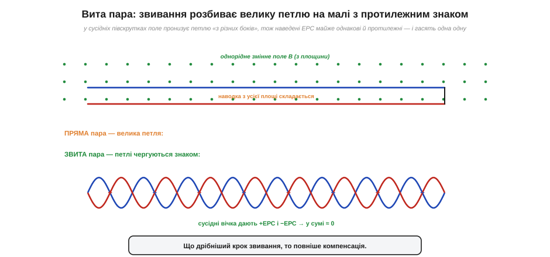
*Рис. 1.9.8.1. Угорі — пряма пара з однією великою петлею: наводка з усієї площі складається. Унизу — звита пара: ланцюжок дрібних петельок чергового знаку. У сусідніх півскрутках поле пронизує петлю «з різних боків», тож наведені ЕРС майже рівні й протилежні (+ та −) і гасять одна одну. Що дрібніший крок звивання, то повніша компенсація.*

Це геніально саме своєю «безкоштовністю»: компенсація вбудована в **геометрію**, вона працює сама, без живлення й налаштування. Перевиті проводи самі стежать, щоб кожна петелька, що ловить наводку в один бік, мала сусідку, що ловить її в протилежний. Що рівномірніший і дрібніший крок звивання, то точніша взаємна компенсація — тому в якісних кабелях крок звивання витриманий і навіть різний для різних пар (щоб сусідні пари ще й не наводили одна на одну).

Чому компенсація все ж не ідеальна, варто розуміти чесно, щоб не сподіватися на диво. По-перше, поле в реальності не зовсім однорідне: якщо агресор дуже близько до одного боку пари, сусідні петельки ловлять трохи різну наводку, і гасіння неповне. По-друге, крок звивання скінченний: на дуже високих частотах, коли довжина хвилі завади стає порівнянною з кроком звивання, картина «+ε, −ε» збивається, і захист погіршується. По-третє, сама пара має бути **симетрична** відносно землі (обидва проводи однаково віддалені від навколишніх предметів) — інакше наводка ляже на них трохи по-різному. Тому реальне придушення витою парою — не нескінченне, а конкретні десятки децибелів, тим більші, чим дрібніший і рівніший крок та чим симетричніша пара. Але навіть «недосконале» гасіння в десятки разів — це колосальний виграш за нульову ціну, і саме тому виту пару застосовують усюди.

Корисно й зіставити виту пару з екраном, бо вони борються з **різними** завадами і чудово доповнюють одне одного. Екран (заземлена оболонка) — це передусім захист від **електричного** поля (§1.9.7); проти магнітного він сам по собі майже безсилий. Вита пара — навпаки: вона блискуче гасить **магнітну** наводку (бо зводить площу петлі й перевертає її знак), але від електричного поля сама не захищає (поле наводиться на обидва проводи). Тому для повного захисту їх **поєднують**: вита пара **в** заземленому екрані (так влаштовані екрановані кабелі FTP/STP). Звивання прибирає магнітну наводку, екран — електричну. Кожен робить те, що вміє найкраще.

> 🔧 **Навіщо це.** Тому до будь-якого віддаленого давача тягнуть **виту пару**, а не два випадкові дроти; тому Ethernet-кабель усередині — це чотири окремо звиті пари; тому сигнальний і його зворотний (земляний) провід завжди ведуть разом і за змоги перевивають. Це найдешевший спосіб приборкати магнітну наводку — він не коштує нічого, крім того, щоб **скрутити** проводи замість того, щоб кинути їх абияк. Один цей навик — «не розводь сигнал і землю, перевивай їх» — рятує більше слабких сигналів, ніж будь-який екран.

### Чому вита пара особливо сильна з диференційним входом

Вита пара блищить у повну силу в парі з **диференційним прийомом** (*differential signaling*) — способом передавати сигнал не «провід відносно землі», а як **різницю** між двома проводами. Чому ці двоє створені одне для одного, видно з простого міркування про **синфазну** заваду.

Будь-яка наводка — ємнісна чи магнітна, що лишилася після звивання, — лягає на **обидва** проводи витої пари **практично однаково**: вони ж ідуть упритул, в однаковому полі, на однаковій відстані від агресора. Така однакова на обох проводах завада зветься **синфазною** (*common-mode*). А приймач бере не абсолютний рівень кожного проводу, а їхню **різницю**. Корисний сигнал переданий саме як різниця проводів — він зберігається. А синфазна завада, **однакова** на обох, при відніманні дає нуль: (сигнал + завада) − (завада) = сигнал. Завада зникає сама!

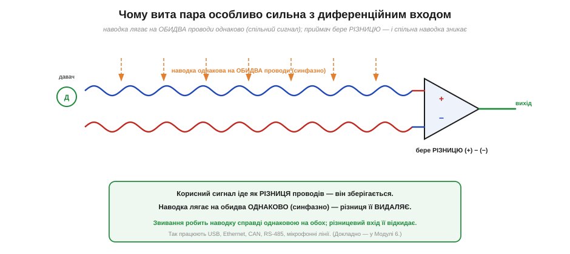
*Рис. 1.9.8.2. Сигнал іде як РІЗНИЦЯ двох проводів витої пари. Наводка лягає на обидва проводи ОДНАКОВО (синфазно — бо проводи поруч, у тому самому полі). Приймач (різницевий вхід) бере (+)−(−): корисна різниця зберігається, а однакова на обох наводка віднімається до нуля. Так працюють USB, Ethernet, CAN, RS-485, мікрофонні лінії.*

Ось чому ці два прийоми посилюють один одного. **Звивання** робить наводку справді **однаковою** на обох проводах (без нього один провід ловив би більше, ніж інший, і завада не була б ідеально синфазною). А **диференційний вхід** цю однакову наводку **відкидає**, віднімаючи проводи. Перше готує заваду до знищення, друге її знищує. Разом вони дають захист, недосяжний для кожного окремо, — і саме тому на цьому дуеті збудовані всі сучасні швидкі й завадостійкі лінії зв'язку. (Як саме влаштований диференційний прийом і чому він такий стійкий — детально розбиратимемо вже в Модулі 6, у темі про диференційну пару; тут досить інтуїції «однакову на обох заваду різниця прибирає».)

Здатність приймача відкидати синфазну заваду навіть має власну міру — її називають **коефіцієнтом подавлення синфазного сигналу** (*CMRR, common-mode rejection ratio*), і в добрих диференційних приймачів він сягає 80–120 дБ, тобто синфазна завада придушується в десятки тисяч і мільйони разів. Помножте це на десятки децибелів, що дає саме звивання, — і стає зрозуміло, чому виту пару з диференційним прийомом майже неможливо «забити» наводкою. Саме тому, попри здавалося б застарілий вигляд «двох скручених дротиків», ця технологія не лише не вмерла, а перемогла: Ethernet тримає гігабіти по витих парах, автомобільний CAN надійно працює в електрично «брудному» моторному відсіку, промисловий RS-485 тягне сигнал на сотні метрів повз силові кабелі. Усюди, де треба передати сигнал далеко й завадостійко, відповідь та сама — **вита пара плюс диференційний прийом**. Проста геометрія, помножена на просте віднімання, дає те, чого не купиш дорогою електронікою.

**Приклад (наскільки звивання гасить наводку).** Пряма пара з петлею завдовжки 1 м і шириною 1 см ловить, скажімо, наводку Uпрям. Перевиймо її з кроком 1 см — на метрі вийде близько 100 півскруток, що чергуються знаком:

```
пряма пара:   одна петля площею A = 0.01 м × 1 м = 0.01 м²  → наводка Uпрям
звита пара:   ~100 дрібних петельок, сусідні гасяться парами
              лишкова наводка ~ (Uпрям) / (кілька десятків)
              типове придушення витою парою: 20…40 дБ і більше
```

Двадцять-сорок децибелів придушення — це в десятки й сотні разів менша наводка, отримана **задарма**, самим лише скручуванням проводів. А додавши диференційний прийом, що відкидає синфазну заваду ще на 60–80 дБ, отримуємо лінію, якій майже байдуже до магнітних завад. Ось чому виту пару не витіснив жоден дорожчий засіб: проста геометрія дає те, за що інакше довелося б платити складною електронікою.

Звідки взагалі взялася ця ідея — скручувати проводи? Не з теорії, а з болючого досвіду. Перші телефонні лінії були однопровідними (зворотний струм ішов через землю — як у телеграфі, §1.6.4), і вони нещадно ловили наводку від сусідніх ліній та, згодом, від силових і трамвайних мереж. Перехід на **два** проводи (повноцінна петля) і їх **звивання** виявився рятунком: наводка, що раніше била по одному проводу, тепер лягала на обидва однаково й гасилася. Це інженерне відкриття XIX століття виявилося настільки фундаментальним, що пережило всі зміни технологій — від механічних комутаторів до оптики поряд — і досі лежить в основі найшвидших мідних ліній. Рідко буває, щоб прийом, винайдений для телефону позаминулого століття, без змін працював у гігабітному Ethernet; вита пара — саме такий випадок.

> 🔌 Як це втілено в реальних кабелях — категорії (Cat 5e, Cat 6...), крок звивання кожної пари, екранований (FTP/STP) проти неекранованого (UTP) — у вставці [UTP/FTP зсередини: категорії, крок звивання, екран](comp-utp-cables.md).

> 📜 А чи знаєте ви, що звивання проводів **запатентував** не хто інший, як Александер Белл (1881)? Щоправда, тоді він боровся ще не з силовими наводками, а з перехресним «дзвоном» між телефонними лініями; справжня війна з гулом від трамваїв і силових мереж розгорнулася трохи пізніше. Як це було — у вставці [Телефон проти телеграфу: як Белл запатентував звивання](hist-twisted-pair.md).

Ми зібрали повний арсенал: розуміємо джерела шуму (теплове, дробове, 1/f) і три шляхи наводок (ємнісний, індуктивний, спільний імпеданс), а також зброю проти них (фільтр і смуга, екран, геометрія, вита пара, диференційний прийом, правильна «земля»). Лишилося звести все це в практичну навичку — **вистежити конкретну заваду** в конкретній схемі. А головний інструмент мисливця за завадами — осцилограф.

---

## 1.9.9 Полювання на заваду з осцилографом: упізнати джерело за формою

Уся теорія попередніх тем сходиться тут, у практичній навичці: перед вами схема, на сигналі — «бруд», і треба з'ясувати, **що це** і **звідки**. Найсильніший інструмент для цього — **осцилограф** (§1.6.7): на відміну від мультиметра, що показує одне усереднене число, осцилограф малює **форму** завади в часі. А форма й частота завади — це її **відбиток пальців**: за ними майже завжди можна впізнати джерело, навіть не торкаючись схеми. Навчитися читати ці відбитки — і означає стати мисливцем за завадами.

### Три головні почерки: гул, імпульси, трава

Більшість завад на екрані потрапляє в одну з трьох упізнаваних категорій — і кожна одразу звужує коло підозрюваних.

**Перший почерк — плавний гул мережі.** На екрані чистий, рівний синус (або трохи спотворений) із періодом рівно **20 мілісекунд** (для мережі 50 Гц) чи 16.7 мс (для 60 Гц). Це майже напевно **мережева наводка** — ємнісна (§1.9.4) або через земляну петлю (§1.9.6). Період — головна прикмета: 20 мс між гребенями однозначно вказує на 50 Гц і, отже, на електромережу. Іноді видно не чистий синус, а гострі здвоєні «горбики» двічі за період — це наводка від випрямлячів, що смикають струм на пиках мережі.

**Другий почерк — імпульсні викиди.** На рівному (чи майже рівному) сигналі час від часу вискакують **гострі поодинокі піки** — короткі, високі, нерегулярні або прив'язані до якихось подій. Це **комутаційна** завада: щось вмикається-вимикається — реле, контактор, щітки мотора, силовий ключ, іскра. Згадаймо §1.9.5: різкі імпульси з крутими фронтами мають велике dB/dt і наводяться особливо сильно. Прикмета — піки **синхронні з якоюсь подією** (клацнуло реле — вискочив пік; працює мотор — піки сиплються чергою).

**Третій почерк — суцільна «трава».** Сигнал розмитий у товсту нечітку смугу **без певної форми** й без періоду — суцільне дрижання. Це **широкосмуговий шум**: або власний тепловий/дробовий шум схеми (§1.9.2–1.9.3), або високочастотне «сміття» з ефіру (радіо, імпульсні перетворювачі на сотнях кГц). Прикмета — немає ні форми, ні періоду, лише рівномірна товщина смуги; і вона не зникає, коли вимикаєш сусідні прилади.

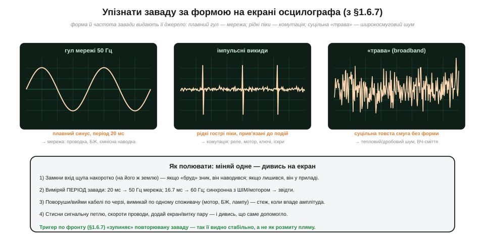
*Рис. 1.9.9.1. Три головні почерки завад. Плавний синус із періодом 20 мс — гул мережі 50 Гц (проводка, БЖ, ємнісна наводка). Рідкі гострі піки, прив'язані до подій, — імпульсна комутація (реле, мотор, ключі). Суцільна товста смуга без форми — широкосмуговий шум (тепловий/дробовий, ВЧ-сміття). Унизу — алгоритм методичного полювання.*

### Алгоритм мисливця: міняй одне — дивись на екран

Упізнати почерк — півсправи; далі заваду треба **загнати в кут**. Тут діє золоте правило діагностики: **міняй за раз лише одне й дивися, що змінилося на екрані.** Ось перевірений порядок дій.

**Крок 1. З'ясувати: шум чи наводка?** Замкни вхід щупа накоротко — приєднай його кінчик до його ж земляного затискача (нуль на вході). Якщо «бруд» **зник** — він наводився ззовні (на щуп, на проводи): це наводка, шукай джерело. Якщо «бруд» **лишився** — він народжується вже в самому приладі/щупі або це власний шум: екран тут не поможе. Цей простий крок одразу ділить задачу навпіл.

**Крок 2. Виміряти період завади.** Розтягни розгортку й поміряй період «бруду». 20 мс → 50 Гц, мережа. 16.7 мс → 60 Гц. Синхронно з обертанням мотора чи з частотою ШІМ → джерело там. Період — найнадійніший вказівник на джерело; навчися першим ділом його міряти.

**Крок 3. Вимикати підозрюваних по одному.** Вимикай по черзі сусідні споживачі — мотор, блок живлення, лампу, передавач — і стеж, коли завада **впаде**. Коли від вимкнення чогось одного «бруд» різко зменшився — джерело знайдено. Так само поворуши й повиймай кабелі по одному: якщо від ворушіння кабелю завада міняється — вона наводиться саме на нього.

**Крок 4. Перевірити ліки.** Тепер, знаючи ворога, пробуй засоби з попередніх тем і дивись, що **саме** допомогло: стисни сигнальну петлю (проти магнітної, §1.9.5), скороти проводи й знизь опір (проти ємнісної, §1.9.4), додай чи переключи екран (§1.9.7), перевий проводи (§1.9.8), розв'яжи земляну петлю (§1.9.6). Те, від чого завада впала, і підтверджує її природу.

Зверніть увагу на логіку цих кроків — це не випадковий набір, а **дерево діагнозу**, що звужує коло з кожним рухом. Крок 1 ділить світ навпіл: шум чи наводка (і відсікає половину марних дій). Крок 2 за періодом одразу вказує на найімовірніше джерело. Крок 3 експериментально ловить винуватця «за руку». Крок 4 не лише прибирає заваду, а й **підтверджує діагноз**: якщо допомогло саме стискання петлі — значить, наводка була магнітна, і ти зрозумів схему правильно. У цьому й полягає інженерна дисципліна: не «тицяти навмання всі засоби одразу», а міняти **одне** й щоразу робити висновок. Той, хто розуміє механізми з §1.9.2–1.9.8, проходить це дерево за хвилини; той, хто ні, — місяцями переставляє деталі, не розуміючи, що саме й чому міняється. Осцилограф тут — не чарівна паличка, а **очі**, які перетворюють невидиму заваду на видиму форму, доступну міркуванню.

Окремо згадаймо роль **тригера** (§1.6.7). Повторювану заваду (гул, ритмічні піки) видно стабільно лише тоді, коли осцилограф **синхронізує** розгортку по ній — інакше хвиля «пливе» розмитою плямою. Налаштувавши тригер по фронту завади, ти «зупиняєш» її на екрані й можеш роздивитися форму та поміряти період. А якщо завада синхронна з якимось сигналом (скажімо, з ШІМ мотора), тригер по тому сигналу прив'яже заваду до нього — і відразу стане видно зв'язок.

Є й важлива пастка, про яку варто пам'ятати: **сам осцилограф може брехати або навіть створювати заваду.** По-перше, його щуп і земляний провідник — це теж петля (§1.9.5): довгий «крокодил» земляного дроту щупа утворює велику площу й сам ловить магнітну наводку, домішуючи її до того, що ти міряєш. Тому при ловінні швидких або слабких сигналів земляний хвіст щупа роблять якнайкоротшим (а для тонких вимірювань — спеціальним коротким «пружинним» контактом). По-друге, земля щупа — це земля розетки осцилографа (важлива безпекова тонкість, яку ми вже зачіпали в §1.6.8): під'єднавши «крокодил» не туди, можна замкнути власну земляну петлю через осцилограф і отримати гул, якого в схемі насправді не було. По-третє, одноразову, неповторювану подію усередненням не витягнеш, а тригером по ній не завжди легко «зачепитися» — тут рятує режим одиночного запуску (*single shot*). Тобто осцилограф — потужний, але не всевидющий: треба розуміти й **його** обмеження, інакше ризикуєш «полювати» на заваду, яку сам же й завів щупом.

> 🔧 **Навіщо це.** Цей алгоритм — щоденний хліб налагодження. «У давача стрибають покази» — і замість того, щоб гадати, інженер за п'ять хвилин з осцилографом ставить діагноз: замкнув вхід (наводка, не шум), поміряв період (20 мс — мережа), повимикав споживачів (зник із вимкненням підсвітки — отже, спільна земля з нею), розвів землі зіркою — готово. Без осцилографа це були б дні наосліп; із ним і знанням трьох почерків — лічені хвилини.

### Остання зброя: усереднення витягує сигнал із шуму

Коли завада виявилася **широкосмуговим шумом** (а не наводкою, яку можна вимкнути), лишається статистична зброя — **усереднення** (*averaging*, режим Average в осцилографі). Ідея спирається прямо на §1.9.1: шум **випадковий і в середньому нульовий**, а корисний сигнал — **ні**. Якщо знімати ту саму розгортку багато разів і усереднювати, випадковий шум від разу до разу гаситься сам із собою (то плюс, то мінус), а сталий сигнал нагромаджується. Шум спадає, сигнал лишається.

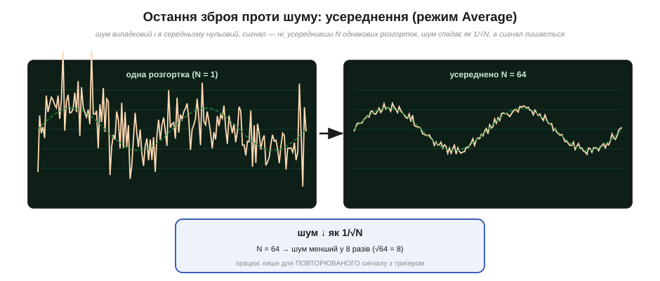
*Рис. 1.9.9.2. Ліворуч — одна розгортка: слабкий сигнал тоне в шумі. Праворуч — усереднено N = 64 розгортки: випадковий шум погасився сам із собою, сигнал проступив. Шум спадає як 1/√N: при N = 64 шум менший у √64 = 8 разів. Працює лише для ПОВТОРЮВАНОГО сигналу зі стабільним тригером.*

Виграш від усереднення підкоряється тому самому **кореню**, що й увесь цей розділ: шум спадає як **1/√N**, де N — число усереднених розгорток. Усереднив 64 рази — шум менший у √64 = 8 разів (SNR кращий на 18 дБ); усереднив 100 — у 10 разів; 10 000 — у 100. Знову корінь і за нас, і проти нас: кожне наступне поліпшення дається дедалі важче (щоб виграти ще вдвічі, треба вчетверо більше розгорток). Та головне обмеження інше: усереднення працює **лише для повторюваного сигналу**, який можна стабільно зловити тригером (інакше сигнал «попливе» так само, як шум, і теж усередниться в кашу). Для одноразової події усереднення не годиться — там рятують лише фільтр і вузька смуга.

**Приклад (скільки усереднювати).** Сигнал тоне в шумі: SNR = 0 дБ (сигнал і шум рівні). Хочемо комфортні SNR ≈ 30 дБ (сигнал у ~32 рази більший за шум). Скільки розгорток усереднити?

```
треба покращити SNR на 30 дБ за напругою
30 дБ = 20·log₁₀(виграш)  →  виграш напруги = 10^(30/20) ≈ 31.6 разів
шум спадає як √N  →  √N = 31.6  →  N = 31.6² ≈ 1000 розгорток
```

Близько тисячі усереднень — і сигнал, який тонув у шумі, проступить чисто. Але якщо схочеться ще на 30 дБ краще (до 60 дБ), знадобиться вже **мільйон** розгорток (1000² ): корінь робить дорогою кожну наступну сходинку точності. Тому усереднення — потужний, але не безкоштовний інструмент: ним добирають останні десятки децибелів, коли смугу вже звужено, опори знижено, а наводки вистежено й прогнано.

> 🧮 Чому саме 1/√N, а не 1/N — це проста й глибока статистика: при усередненні N незалежних випадкових величин їхнє середнє має розкид у √N разів менший за окрему. Повне пояснення — у вставці [Чому усереднення працює: σ/√N](math-averaging.md). Той самий закон, до речі, стоїть за точністю будь-яких повторних вимірювань — від зважування до астрономії.

На цьому коло замикається. Ми пройшли шлях від питання «чому жоден сигнал не ідеальний» через фізику внутрішнього шуму й три механізми зовнішніх наводок до повного набору засобів захисту — і, нарешті, до практичної навички вистежити конкретну заваду осцилографом і добити її усередненням. Тепер «брудна смужка» на екрані для вас не загадка, а **діагноз**: ви бачите не просто шум, а його природу, джерело й ліки.

---

Підсумок Розділу 1.9. **Жоден сигнал не ідеальний**, і причин дві, фізично різних. **Шум** (*noise*) народжується **зсередини** деталі: **тепловий** шум від тряски електронів (Uш = √(4kTRB), невитравний, «білий», §1.9.2), **дробовий** від дискретності заряду (Iш = √(2qIB), §1.9.3) і **1/f** від повільних процесів (дрейф нуля, §1.9.3). Шум випадковий, гаусів, із нульовим середнім; борються з ним **звуженням смуги** й **усередненням** (1/√N), а міряють відношенням сигнал/шум (SNR у дБ, §1.9.1). **Наводка** (*interference*) приходить **ззовні** трьома шляхами: через **електричне поле** (ємнісний зв'язок, гул 50 Гц на високоомному вході, §1.9.4), через **магнітне поле** (індуктивний зв'язок, наводка ∝ площа петлі, §1.9.5) і через **спільний провід** (спільний імпеданс і земляні петлі, §1.9.6). Проти наводок — **геометрія** (мала петля, вита пара §1.9.8), **екран** (клітка Фарадея для сигналу, заземлений правильно §1.9.7), **диференційний прийом** і грамотна «земля» (зірка §1.9.6). А головний інструмент діагностики — **осцилограф** (§1.9.9): за формою сліду (плавний гул / гострі піки / трава) і періодом упізнають джерело, а методом «міняй одне — дивись на екран» заганяють його в кут.

> ▶️ Далі: [Розділ 1.10 — Електростатика на практиці: іскри, блискавка й ESD](../esd-static/esd-static.md)
