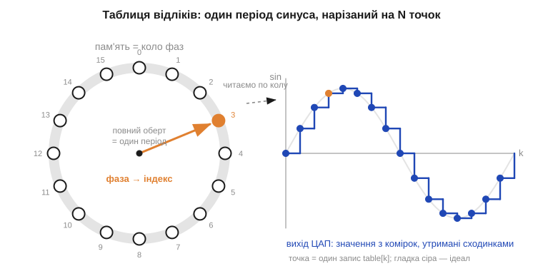
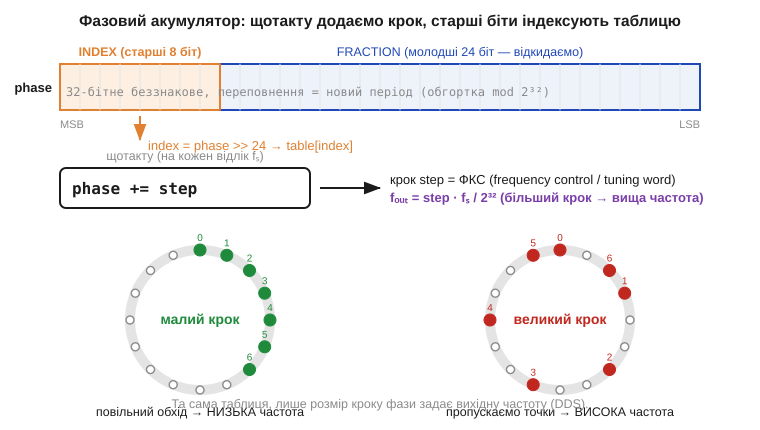

# Синус у коді: таблиця відліків і фазовий акумулятор

> ⚙️ Алгоритмічна вставка до теми [§1.7.1 «Чому синусоїда: природна форма коливань»](r07-ac-signals.md). Там ми побачили, що синус — це **проєкція рівномірного обертання**: стрілка-фазор рівно крутиться по колу, а її тінь гойдається синусоїдою. Тут перетворимо цю саму картинку на код. Виявляється, щоб мікроконтролер видавав синус, не треба щотакту рахувати `sin()` — досить **один раз** обчислити таблицю значень і потім лише ходити по ній стрілкою-вказівником. Цей прийом зветься **пряме цифрове синтезування** (*direct digital synthesis, DDS*), і він стоїть усередині кожного генератора сигналів, звукового чипа та програмного «гудка».

## Задача

Мікроконтролер не вміє видавати плавну хвилю безпосередньо: його вихід — це цифро-аналоговий перетворювач (ЦАП), якому щотакту, з рівним темпом **частоти вибірки** fₛ (*sample rate*), треба подати **число** — рівень наступного відліку. Щоб на виході вийшов синус частоти fₒᵤₜ, ці числа мусять лягати на синусоїду. Найочевидніше рішення — щоразу рахувати `v = sin(2π·fₒᵤₜ·t)`. Та `sin()` на МК без апаратного блока з рухомою комою — це десятки-сотні тактів на виклик; робити це **на кожен відлік**, та ще й по кілька десятків тисяч разів на секунду, — розкіш, якої зазвичай нема. Потрібен спосіб віддавати відлік синуса за **одиниці** тактів — і з частотою, яку можна точно й плавно міняти на льоту.

## Ідея

Згадаймо обертову стрілку з §1.7.1. Один повний оберт — це один період синуса. Розіб'ємо коло на N рівних позицій і **наперед** порахуємо синус у кожній — раз, ще до роботи. Дістанемо **таблицю відліків** (*lookup table, LUT*): масив `table[0…N−1]`, де `table[k] = sin(2π·k/N)`. Тепер замість тригонометрії — просте **читання з пам'яті за індексом**: вийняти готове число коштує одиниці тактів.


*Рис. 1.7.1a.1. Один період синуса нарізано на N точок і складено в пам'ять. Кут стрілки-фази вказує, яку комірку читати; пройти всі N комірок по колу — це видати один період. На виході ЦАП значення з комірок тримаються сходинками (синє), наближаючи ідеальний синус (сіре). Що більше N, то дрібніші сходинки.*

Лишається питання: **як швидко** йти по таблиці, щоб дістати потрібну частоту? Тут і з'являється головний герой — **фазовий акумулятор** (*phase accumulator*). Це широкий (зазвичай 32-бітний) беззнаковий регістр `phase`, який зберігає поточну фазу. Працює так: на **кожен** відлік ми додаємо до нього сталий **крок** `step` (його звуть **слово керування частотою**, *frequency control / tuning word*), а в таблицю йдемо за **старшими** бітами акумулятора:


*Рис. 1.7.1a.2. Регістр phase щотакту збільшується на step. Старші біти (тут 8) — це індекс у таблиці, молодші — дробова частина фази, яку при простому читанні відкидають. Малий крок → стрілка повзе по колу повільно (низька частота); великий крок → перестрибує точки (висока частота). Переповнення 32-бітного регістра саме й означає кінець періоду — обгортка по модулю 2³² безкоштовно дає циклічність синуса.*

Чому це дає саме частоту? За один відлік фаза проходить частку `step/2³²` повного кола, тож повний оберт (один період) набіжить за `2³²/step` відліків. Помноживши на частоту вибірки fₛ, маємо точну формулу DDS:

```
fₒᵤₜ = step · fₛ / 2³²        ⇒    step = round(fₒᵤₜ · 2³² / fₛ)
```

Найкрасивіше тут — **переповнення**. Коли `phase` перескакує 2³², воно само «обертається» по модулю 2³² назад до початку — рівно як стрілка, що завершила оберт. Циклічність синуса виходить **безкоштовно**, із природного переповнення лічильника; ніякого `if (phase >= max) phase -= max` писати не треба.

## Псевдокод

Зберемо всі три складники докупи — таблицю, крок і акумулятор. Підготовка виконується раз, а далі лишається коротка гаряча петля на кожен відлік:

```
# Підготовка (раз):
for k in 0…N-1:
    table[k] = round( A * sin(2*pi * k / N) )   # A — амплітуда під розрядність ЦАП

step  = round(f_out * 2**32 / f_s)   # слово керування частотою (ФКС)
phase = 0                            # 32-бітний беззнаковий

# Гаряча петля — рівно на такт fₛ (краще з таймера/DMA, не в циклі while):
on each sample tick:
    index = phase >> (32 - log2(N))  # старші біти → індекс у таблиці
    DAC_write( table[index] )        # видати готовий відлік
    phase = (phase + step) & 0xFFFFFFFF   # крок + обгортка (переповнення = новий період)
```

Зміна частоти — це просто запис нового `step`; фаза при цьому не рветься (хвиля йде далі без клацання). Хочете кілька синусів водночас (акорд, два тони DTMF) — заведіть кілька пар `phase/step` і складіть їхні відліки перед ЦАП.

## Складність і пастки на МК

**Вартість — O(1) на відлік:** додавання, зсув і читання з пам'яті, жодної рухомої коми в гарячій петлі. Саме тому DDS тягне навіть найскромніший МК. Але дешевизна оманлива — вилазять характерні граблі:

- **Темп мусить бути залізно рівним.** Якщо видавати відліки з циклу `while` зі «сном», джитер темпу спотворить частоту й додасть шум. Правильно — таймер запускає ЦАП (або DMA жене таблицю) з точним fₛ; так само ловлять точність у тригері осцилографа (§1.6.7).
- **Аліасинг.** fₒᵤₜ мусить бути значно нижчою за fₛ/2 (межа Найквіста), інакше синус на виході буде брехливим — те саме явище, що псує картинку на осцилографі (§1.6.7); докладніше про нього — далі в курсі.
- **Розмір таблиці N — компроміс.** Малий N економить пам'ять, але робить сходинки грубими (більше гармонік-спотворень); великий N — рівніший синус, та з'їдає RAM/Flash. Симетрію синуса можна використати й зберігати лише чверть періоду, добудовуючи решту дзеркально.
- **Шум усічення фази.** Відкидаючи молодші біти `phase`, ми щоразу трохи округляємо фазу — звідси дрібні **спури** (паразитні лінії) у спектрі. Лікують **інтерполяцією** між сусідніми комірками таблиці (`dither`/лінійне згладжування) — ціною кількох зайвих тактів.
- **Переповнення тільки беззнакове.** Акумулятор має бути **unsigned** саме потрібної розрядності; на знаковому типі «обгортка» дасть не фазу, а невизначену поведінку.

Підсумок: уся хитрість — порахувати синус **наперед** і звести синтез до додавання кроку у фазовий регістр. Обертова стрілка з §1.7.1 буквально оживає в коді: `phase` — це кут, `step` — швидкість обертання, переповнення — кінець оберту, а таблиця — та сама проєкція на вісь. Проста арифметика на цілих — і з МК ллється чистий синус заданої частоти.
