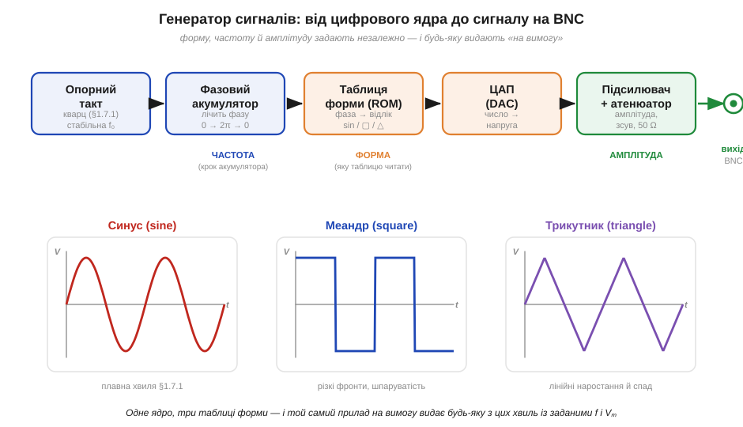

# 🔌 Генератор сигналів: синус, меандр і трикутник на вимогу

> Компонентна вставка до теми [§1.7.2 «Амплітуда, період, частота»](r07-ac-signals.md). §1.7.2 уводить три числа, якими описують будь-яку періодичну хвилю, — амплітуду, період і частоту. А чи є прилад, що дозволяє **самому задати** ці числа й одразу побачити готовий сигнал на виході? Так: це генератор сигналів — інструмент, на якому параметри з §1.7.2 перестають бути формулами й стають ручками, що їх крутиш.

### Що це й навіщо

**Генератор сигналів** (*signal / function generator*) — лабораторне джерело змінної напруги заданої форми, частоти й амплітуди. На відміну від блока живлення, що тримає сталу напругу (DC), цей прилад видає **коливання на вимогу**: набираєш «синус, 1 кГц, 2 В розмаху» — і на виході рівно це. Потрібен він, щоб «розгойдати» досліджуване коло й подивитися, як воно відповідає: подати тон на підсилювач, кинути перепад на цифровий вхід, «продзвонити» фільтр на різних частотах. Це парний інструмент до осцилографа (§1.6.7): генератор ставить запитання, осцилограф читає відповідь.

Майже кожен такий прилад уміє три базові форми — **синус** (*sine*), **меандр / прямокутник** (*square*) і **трикутник** (*triangle*). Вибір не випадковий: синус — природна форма коливань і єдина, що проходить лінійне коло, не міняючи форми (§1.7.1); меандр з його гострими фронтами — мова цифрової логіки й тест на швидкодію; трикутник з рівномірним наростанням — зручний пилкоподібний «змах» для розгорток і перевірки лінійності.

### Як побудований

*Рис. 1.7.2c.1. Ланцюг сучасного (прямого цифрового синтезу, DDS) генератора: стабільний кварцовий такт → фазовий акумулятор, що рівномірно «біжить» по фазі 0…2π → таблиця форми, де фаза перетворюється на відлік потрібної хвилі → ЦАП (DAC), що робить із числа напругу → підсилювач з атенюатором, який задає амплітуду й зсув і узгоджує вихід на 50 Ω. Три ручки незалежні: частота — це крок акумулятора, форма — яку таблицю читати, амплітуда — підсилення на виході. Унизу — три форми, які той самий прилад видає на вимогу.*

Серце сучасного генератора — **прямий цифровий синтез** (*direct digital synthesis*, DDS). Стабільний кварцовий такт (та сама фізика, що задає такт мікроконтролеру, §1.7.1) живить **фазовий акумулятор** — лічильник, що рівномірно набігає по колу фази від 0 до 2π й знову. Поточна фаза адресує **таблицю форми** в пам'яті: для синуса там лежать відліки sin, для трикутника — лінійний пилкоподібний підйом-спад, для меандра — просто «верх» на півперіоді й «низ» на другому. Числа з таблиці йдуть на **ЦАП** (*DAC*), що відтворює їх напругою, а далі **підсилювач з атенюатором** масштабує сигнал до заданого розмаху й додає, за потреби, постійний зсув. Простіші аналогові генератори будують інакше — на інтеграторі, що жене трикутник, і компараторі, що робить із нього меандр, — але керування скрізь однакове: три незалежні регулятори форми, частоти й амплітуди.

### Органи керування й вихід

Передня панель — це прямий доступ до параметрів §1.7.2. **Форма** (FUNC) перемикає синус/меандр/трикутник. **Частота** (FREQ) задає, скільки періодів за секунду (Гц), тобто період T = 1/f. **Амплітуда** (AMPL) задає висоту хвилі — зазвичай у вольтах **розмаху** (*peak-to-peak*, Vpp, від низу до верху), рідше — амплітуду Vₘ від осі до піка; це різні числа (Vpp = 2·Vₘ для симетричного сигналу), і їх легко переплутати. Часто є ще **зсув** (OFFSET) — підняти всю хвилю на сталу DC-складову — і для меандра **шпаруватість** (*duty cycle*), частка періоду, яку сигнал тримає «вгорі». Вихід — це роз'єм **BNC**: центральний контакт — сигнал, обідок — спільний «нуль» (земля).

### «Перший байт» — як заговорити

Найшвидший шлях упевнитися, що прилад працює: вихід BNC — кабелем на осцилограф; виставити **синус, 1 кГц, 1 Vpp**; на екрані має постати плавна хвиля з періодом 1 мс і висотою 1 В від низу до верху. Далі — перемкнути форму на меандр і трикутник (картинка міняється, період лишається), покрутити частоту (хвиля стискається й розтягується) і амплітуду (росте по висоті). Це й є перевірка трьох незалежних ручок із §1.7.2 наживо.

### Типові граблі

Коли проста перевірка пройшла, лишається кілька місць, де показане на панелі число розходиться з реальним сигналом на виході:

- **Vpp проти Vₘ.** Прилад майже завжди показує **розмах** (Vpp), а формули — амплітуду Vₘ. Переплутати — означає помилитися вдвічі; пам'ятай Vpp = 2·Vₘ.
- **Узгодження 50 Ω.** Вихід розрахований на навантаження 50 Ω. На «високоомному» вході (осцилограф, 1 МΩ) реальний розмах виходить **удвічі більший** за вказаний на панелі — багато приладів мають перемикач «High-Z / 50 Ω», щоб показувати правду.
- **Падіння амплітуди на високих частотах.** Дешевий генератор «сідає» по висоті ближче до верху свого діапазону; на кількох мегагерцах виставлений 1 Vpp може стати помітно меншим.
- **Несправжній прямокутник.** Ідеальний меандр потребує нескінченно швидких фронтів, а реальний має скінченний час наростання; на високій частоті «прямокутник» округлюється й наближається до синуса (§1.7.1, гармоніки). Тобто на самому верху діапазону всі форми тяжіють до синуса.

### Варіації класу

Найпростіші **аналогові** генератори дають три форми у фіксованому діапазоні й коштують копійки. **DDS-генератори** додають точне цифрове задавання частоти й чистоту синуса. **Генератори довільної форми** (*arbitrary waveform generator*, AWG) йдуть далі: у таблицю форми можна завантажити **будь-яку** криву — імітацію давача, сплеск, мовний сигнал — і прилад видасть її на вимогу. Принцип скрізь той самий, що на блок-схемі: тактований лічильник фази читає таблицю форми, а ЦАП перетворює числа на напругу заданої амплітуди.
