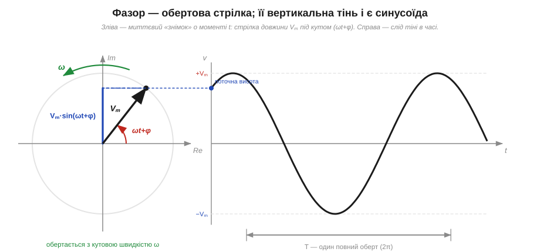
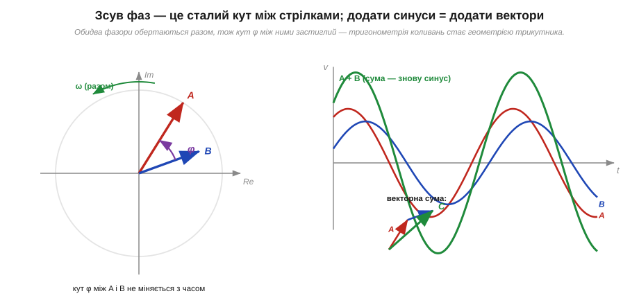

# 🧮 Фазор: синусоїда як вектор, що обертається

> 🧮 Математична вставка до теми [§1.7.3 «Фаза й зсув фаз»](r07-ac-signals.md). У §1.7.1 ми вже мигцем побачили обертову стрілку, чия тінь малює синус, і назвали її **фазором**. Тут доведемо цей образ до робочого інструмента: покажемо, як замінити цілу синусоїду **двома числами**, як зсув фаз стає просто кутом між стрілками — і чому додавати коливання тоді можна, як вектори, замість громіздкої тригонометрії.

## Означення: два числа замість цілої хвилі

Синусоїда заданої частоти f несе рівно три параметри: **амплітуду** Vₘ (висота), **частоту** (швидкість, ω = 2πf) і **фазу** φ (з якої точки циклу хвиля стартує):

```
v(t) = Vm · sin(ωt + φ)
```

Та коли всі сигнали в колі мають **одну** частоту (а так і буває: подали на коло синус — усюди синус тієї самої частоти, §1.7.1), то ω скрізь однакова й нічим сигнали не різнить. Лишаються тільки **амплітуда** й **фаза**. Саме цю пару — (Vₘ, φ) — і називають **фазором** (*phasor*) сигналу. Записують її як стрілку завдовжки Vₘ під кутом φ або, що те саме, символом

```
V̲ = Vm ∠ φ        («Vₘ під кутом φ»)
```

Риска під літерою (чи «крапка» над нею в інших школах) каже: це не просто число, а **вектор-стрілка**, що несе і довжину, і напрям. Уся динаміка коливання — швидке гойдання вгору-вниз — згорнулась у застиглий знімок: одну стрілку на площині.

## Інтуїція: застиглий знімок обертання

Звідки право так чинити? Згадаймо картину з §1.7.1: синус — це **тінь** точки, що рівномірно біжить по колу. Радіус-вектор тієї точки має сталу довжину Vₘ і обертається з кутовою швидкістю ω, тож у момент t він дивиться під кутом (ωt + φ), а його **вертикальна** проєкція дає рівно Vₘ·sin(ωt + φ) — нашу миттєву напругу.


*Рис. 1.7.3m.1. Зліва — миттєвий «знімок» обертової стрілки в момент t: довжина Vₘ, кут (ωt + φ). Її вертикальна тінь (синій відрізок) дорівнює Vₘ·sin(ωt + φ). Справа — слід цієї тіні в часі: та сама синусоїда. Один повний оберт стрілки (2π) = один період T хвилі.*

Хитрість фазора ось у чому. Стрілка обертається з тією самою ω, що й усі інші стрілки в колі, — тому замість того, щоб тягти цей спільний оберт за собою щомиті, його просто **виносять за дужки** й заморожують картину на t = 0. Лишається стрілка під кутом φ — стартовий напрям. Спільне обертання ωt домовляються «домалювати в голові» однаково для всіх: уся система стрілок крутиться як одне ціле, тож їхнє взаємне розташування застигле. Фазор — це фотографія обертового колеса зі стробоскопом, що блимає в такт оберту: колесо мчить, а на знімку завжди нерухоме.

## Формальний апарат: стрілка як комплексне число

Щоб зі стрілками можна було **рахувати**, їх кладуть на комплексну площину: горизонтальна вісь — дійсна (*Re*), вертикальна — уявна (*Im*). Тоді фазор — це комплексне число, і в нього два рівноправні записи:

```
полярний:        V̲ = Vm ∠ φ          (довжина Vm, кут φ)
прямокутний:     V̲ = Vm·cos φ + j·(Vm·sin φ) = a + j·b
```

Тут **j** — уявна одиниця (інженери пишуть j, а не i, щоб не плутати зі струмом i). Перехід між записами — звичайна тригонометрія прямокутного трикутника:

```
a = Vm·cos φ        Vm = √(a² + b²)
b = Vm·sin φ        φ  = atan2(b, a)
```

Саму синусоїду повертають назад так: беруть стрілку Vₘ∠φ, домножують на обертовий множник e^(jωt) (це й є «увімкнути обертання») і дивляться на **уявну** частину результату:

```
v(t) = Im{ Vm · e^(j(ωt+φ)) } = Vm · sin(ωt + φ)
```

Це формула Ейлера в дії: e^(jθ) = cos θ + j·sin θ — точка на одиничному колі під кутом θ. Два записи зручні для різного: **полярний** — щоб множити (множиш довжини, додаєш кути), **прямокутний** — щоб додавати (складаєш окремо дійсні й окремо уявні частини). Саме ця розкладність додавання й дає фазорам головний виграш.

## Зсув фаз — це просто кут між стрілками

Тепер головне для теми §1.7.3. Візьмемо два сигнали однієї частоти: A випереджає B на фазу φ. Як фазори — це дві стрілки, що обертаються **разом** (та сама ω), тож кут φ між ними **застиглий**: A весь час дивиться на φ «попереду» B.


*Рис. 1.7.3m.2. Зліва — два фазори A і B під сталим кутом φ; обертаються разом, тож кут не міняється. Справа — ті самі сигнали в часі (червоний і синій) та їхня сума (зелений): додати дві синусоїди = додати дві стрілки за правилом трикутника, і результат — знову синус тієї самої частоти.*

Звідси випливає вся «арифметика фаз», яку в §1.7.3 ми бачимо на хвилях, — але тепер вона геометрична й очевидна:

- **випереджає (*leads*)** — стрілка повернута проти годинникової, на додатний кут;
- **відстає (*lags*)** — повернута за годинниковою, на від'ємний кут;
- **у фазі** — стрілки збігаються (кут 0); **у протифазі** — дивляться навпроти (кут 180°);
- **у квадратурі** — перпендикулярні (кут 90°), як синус і косинус.

Найбільший виграш — **додавання коливань**. У тригонометрії сума Vₘ₁·sin(ωt+φ₁) + Vₘ₂·sin(ωt+φ₂) — це сторінка перетворень із формулами суми кутів. Фазорами це **додавання двох стрілок** за правилом трикутника: приставив одну до кінця іншої, провів результуючу — її довжина дає амплітуду суми, а кут — її фазу. Жодної тригонометрії суми кутів: коло саме «склало» хвилі за нас.

**Приклад (додати два коливання).** Знайти суму 3·sin(ωt) + 4·sin(ωt + 90°) — два сигнали однієї частоти, другий випереджає перший на чверть періоду.

```
як фазори (прямокутний запис):
  A̲ = 3 ∠ 0°   = 3 + j·0
  B̲ = 4 ∠ 90°  = 0 + j·4
складаємо по осях:
  C̲ = A̲ + B̲   = (3+0) + j·(0+4) = 3 + j·4
назад у полярний:
  Vm = √(3² + 4²) = √25      = 5
  φ  = atan2(4, 3)           ≈ 53.1°
отже:
  3·sin(ωt) + 4·sin(ωt+90°) = 5·sin(ωt + 53.1°)
```

Сума двох синусів — знову синус тієї самої частоти, з амплітудою 5 і фазою 53.1°. Той самий результат прямою тригонометрією забрав би кілька рядків розкриття sin(ωt+90°) і зведення подібних; стрілками це майже усний рахунок — і добре видно, чому амплітуда виходить **не** 3+4=7, а 5: стрілки не вздовж однієї лінії, тож складаються за теоремою Піфагора, а не «в лоб».

## Де в курсі це працює

Фазор — не самоціль, а робочий інструмент далі в курсі. Він перетворює всю алгебру змінного струму на геометрію стрілок:

- **зсув фаз між напругою і струмом** (§1.7.3) на елементах — це кут між їхніми фазорами: на котушці струм відстає на 90°, на конденсаторі випереджає на 90°, на резисторі — у фазі;
- **імпеданс** (опір змінному струму, далі в курсі) природно стає комплексним числом — стрілкою, що задає і «скільки» (модуль), і «який зсув фаз» (аргумент);
- **додавання сигналів** у вузлах кола (закони Кірхгофа для AC) — векторне, як у прикладі вище;
- усе це — спадок методу, яким Чарльз Штейнмец звів розрахунки змінного струму до комплексної алгебри (історія розділу, [Штейнмец і математика змінного струму](r07-history-steinmetz.md)).

Підсумок: **фазор** згортає синусоїду фіксованої частоти у стрілку Vₘ∠φ (комплексне число a + j·b). Спільне обертання ωt виносять за дужки й заморожують картину; тоді **зсув фаз — це сталий кут між стрілками**, а складати коливання можна **векторно** — додаванням стрілок замість тригонометрії суми кутів. Це і є той прийом, що робить розрахунок кіл змінного струму не складнішим за арифметику постійного.
