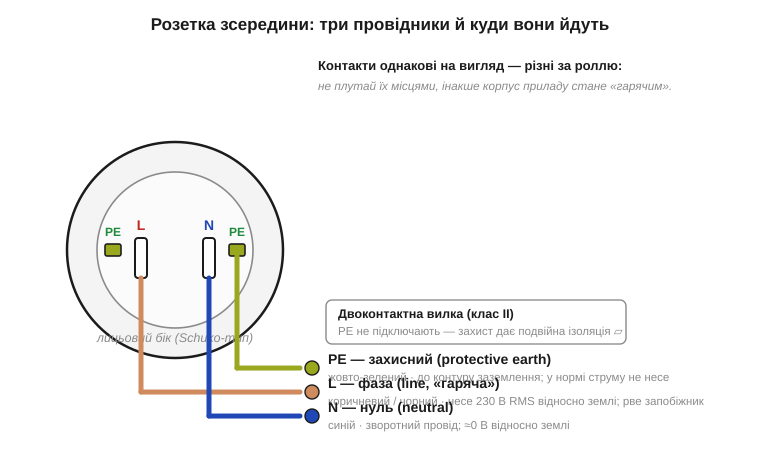
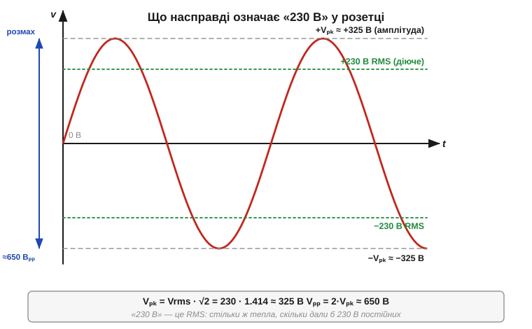

# 🔌 Розетка: фаза, нуль, захисний провідник і 230 В RMS

> 🔌 Компонентна вставка до теми [§1.7.6 «Чому мережа змінна: транспорт енергії»](r07-ac-signals.md). Там ми з'ясували, **навіщо** мережа змінна й чому енергію вигідно гнати високою напругою. Тут — про той кінець лінії, що в стіні: **три провідники розетки**, що означає магічне число **230 В** (підказка: це діюче значення, RMS, із §1.7.4) і де тут чигає небезпека. Розетка — найперший «компонент» мережі, з яким стикається кожен прилад, тож варто знати її розпіновку так само твердо, як цоколівку чипа.

## Що це за «пристрій»

Побутова розетка — це не просто дві дірки, а **інтерфейс** до енергосистеми, стандартизований так само суворо, як роз'єм USB. У більшості Європи (і в Україні) це **тип F**, «Schuko» (*Schutzkontakt* — «захисний контакт»): два круглі штирі плюс бічні заземлювальні пелюстки. Робоча напруга — **230 В RMS, 50 Гц**; історично казали «220 В», але мережу давно гармонізували до 230 В (старі прилади на 220 В працюють однаково — допуск ±10 % це покриває). За цим інтерфейсом ховаються три провідники з чітко розподіленими ролями.

## Три провідники: розпіновка


*Рис. 1.7.6c.1. Контакти розетки на вигляд однакові, та ролі в них різні. **L** (line, фаза) — «гарячий» провід, що несе 230 В RMS відносно землі. **N** (neutral, нуль) — зворотний провід, у нормі майже під потенціалом землі. **PE** (protective earth, захисний) — окреме заземлення, що в нормі струму не несе й чекає лише аварії. Двоконтактні вилки (клас II) PE не використовують — їх рятує подвійна ізоляція.*

- **L — фаза** (*line*, «гаряча»; колір **коричневий** або чорний). Саме вона «під напругою»: 230 В RMS відносно землі. Дотик до неї — і струм піде крізь тіло в землю (саме її розриває запобіжник чи автомат).
- **N — нуль** (*neutral*; **синій**). Зворотний провід для робочого струму. На підстанції він з'єднаний із землею, тож відносно землі на ньому майже **0 В** — але вважати його «безпечним» не можна (про це нижче).
- **PE — захисний** (*protective earth*; **жовто-зелений**, ні з чим не сплутаєш). Окремий провід до контуру заземлення. У нормальній роботі він **струму не несе** — він чекає аварії: якщо фаза проб'ється на металевий корпус приладу, PE дає струмові безпечний шлях у землю й змушує спрацювати захист, не пускаючи небезпечний потенціал на корпус.

## Що означає «230 В»

Ролі трьох проводів ми розклали — лишилося розшифрувати саме число, що стоїть на цій парі L–N. Це не амплітуда й не миттєве значення, а **діюче значення (RMS)** із §1.7.4 — те єдине число, яким змінну напругу чесно порівнюють із постійною за нагрівом. Реальна синусоїда сягає куди вище:


*Рис. 1.7.6c.2. «230 В» — це RMS. Амплітуда (пік) сягає Vₚₖ = 230·√2 ≈ 325 В, а повний розмах від мінуса до плюса — близько 650 Вₚₚ. Тому ізоляцію та конденсатори для мережі беруть із запасом на 400 В і вище, а не на 230.*

```
Vₚₖ = Vrms · √2 = 230 · 1.414  ≈ 325 В   ← амплітуда (пік)
Vₚₚ = 2 · Vₚₖ                  ≈ 650 В   ← повний розмах
```

Звідси практичний висновок: усе, що торкається мережі (ізоляція, конденсатори, реле), мусить **витримувати пік ≈325 В**, а не «лише» 230 — тому мережеві конденсатори маркують на 400 В і вище.

## «Перший дотик»: як приладові живитися від розетки

Знаючи й проводи, і число на них, можна нарешті підключитися. Прилад під'єднується до L і N — це його робоча пара, між ними ті самі 230 В RMS. PE йде окремо на металевий корпус (якщо корпус металевий і прилад класу I). Найперше і найважливіше правило підключення: **N — це не «земля» для сигналів**. Спокуса прив'язати «мінус» своєї низьковольтної схеми до нуля мережі коштує життя приладу й людині: нейтраль може опинитися під повною напругою (обрив N, переплутані місцями L і N у розетці — а на вигляд вони однакові). Тому мережу від низьковольтної частини **гальванічно розв'язують** — трансформатором чи ізольованим блоком живлення; земля вашої плати з'єднана з мережею лише через PE, і то для безпеки, а не як робочий провід.

## Типові граблі

Саме на цих припущеннях — «нуль безпечний», «корпус заземлений», «230 значить 230» — і трапляються найдошкульніші помилки. Ось ті, що коштують найдорожче.

- **L і N переплутані.** Багато розеток підключені «навпаки» — на вигляд це ніяк не помітно, прилад працює однаково. Тому ніколи не вважайте, що «нуль безпечний»: вимикайте автомат, а не покладайтеся на полярність.
- **Немає або обірваний PE.** Без справного захисного провідника прилад класу I у разі пробою лишає **фазу на корпусі** — смертельно. «Земля» з труби чи батареї опалення — небезпечна імпровізація, не PE.
- **Однофазна ілюзія.** Розетка дає **одну** фазу й 230 В; для трифазних 400 В і потужних навантажень — інші роз'єми. Не плутайте.
- **Пік, а не RMS.** Беручи компоненти «на 230 В», легко забути про амплітуду 325 В і розмах 650 В — і спалити деталь на першому ж півперіоді.

Глибше про захист людини від витоку (ПЗВ, який порівнює струм у L і N) — у вставці [§1.2.13c](../ch02-voltage-current-conduction/ch02-s13-c-rcd.md); про категорії безпеки приладів коло мережі — у [§1.6.8c](../ch06-schematics-measurement/ch06-s8-c-cat-ratings.md). Золоте правило лишається те саме: **за найменшого сумніву — вимкніть живлення.**
