# Розділ 1.8 — Магнетизм і електромагніти

Досі весь наш курс тримався на одному дійовому персонажі — **заряді**. Він сидів на тілах, тік дротами, штовхав інші заряди через електричне поле. Та варто зарядам **зрушити з місця**, як народжується щось нове, чого нерухомий заряд не давав ніколи, — **магнетизм**. Стрілка компаса, що вперто дивиться на північ; магніт, який тримається на дверцятах холодильника; гудіння трансформатора; обертання будь-якого мотора; навіть те, як зчитується крутіння коліс і нахил у польотному контролері, — усе це той самий магнетизм, друга половина єдиного явища, що його фізики звуть **електромагнетизмом**.

Цей розділ показує магнетизм від першопричин — і будує міст від нього назад до вже знайомої електрики. Ми почнемо з **поля B** — другого векторного поля курсу після електричного E (§1.1.3), — і з'ясуємо дивний факт: у магнетизмі немає окремих «зарядів», немає монополів. Потім заглянемо в саму речовину й зрозуміємо, **чому залізо магнітне, а мідь — ні**, як працює постійний магніт і чому його можна зіпсувати нагрівом. Далі — головний поворот усієї історії: **рухомий заряд (струм) сам створює магнітне поле**. На цьому стоять електромагніт, реле й мотор. Ми виведемо **силу Ампера**, через яку поле штовхає провідник, розберемо **ефект Холла**, на якому тримаються майбутні давачі, поглянемо на **магнітне поле самої Землі** — і завершимо найважливішим законом, що замикає коло: **електромагнітною індукцією**, завдяки якій рух у полі породжує струм, а генератор виявляється «мотором навпаки».

> 📜 **Перед матеріалом — історія:** [від магнітного каменю до Ерстеда](r08-history-lodestone-oersted.md) — дві тисячі років, поки компас був загадкою, і день, коли стрілка біля дроту раптом смикнулась. Вона показує, *чому* магнетизм так довго жив окремо від електрики й що насправді сталося на лекції Ерстеда 1820 року.

---

## 1.8.1 Магніти й поле B: полюси, силові лінії, чому немає монополів

Магніт — чи не перший «науковий» предмет, з яким стикається кожна дитина: дві залізячки то чіпляються одна за одну, то вперто розштовхуються, наче між ними напнута невидима пружина. У цьому буденному фокусі захована глибока фізика, і саме з неї варто почати, перш ніж пов'язувати магнетизм зі струмом. Бо магнітне поле — це **друге велике векторне поле** нашого курсу, рідний брат електричного поля E з §1.1.3, і водночас поле з однією разючою відмінністю, якої в електрики немає.

Магнетизм бентежив людство тисячоліттями саме тому, що дія йде **крізь порожнечу й крізь перешкоди**. Магніт тягне залізну скріпку через аркуш паперу, через скло, навіть через долоню — і ніщо в проміжку, здається, не змінюється. Стародавні вважали це чи не чаклунством; ще Фалес у VI столітті до н. е. дивувався, чому камінь із Магнесії притягує залізо. Ми вже маємо ключ до цієї загадки — поняття **поля** (§1.1.3), яким Фарадей розв'язав таку саму проблему для електрики. Магніт не тягне залізо «безпосередньо через ніщо»; він заповнює простір навколо себе невидимим **магнітним полем**, і вже це поле, дійшовши до заліза, на нього діє. Папір чи скло полю не заважають — вони для магнетизму прозорі. Тож наша перша задача — навчитися описувати це поле: його напрям, силу й форму.

### Полюси: два роди, як і в зарядів — але нероздільні

Найперше спостереження: у магніту є **два кінці**, що поводяться по-різному. Один притягує певний бік стрілки компаса, другий той самий бік відштовхує. Ці кінці назвали **полюсами** (*poles*): **північний** (*north*, **N**) і **південний** (*south*, **S**) — за тим, куди показував відповідний кінець вільно підвішеного магніту (до географічної півночі чи півдня Землі; до цієї плутанини назв ми ще повернемося в §1.8.9). І діє правило, до болю схоже на правило зарядів із §1.1.1:

```
однойменні полюси (N і N,  S і S)  →  відштовхуються
різнойменні полюси (N і S)         →  притягуються
```

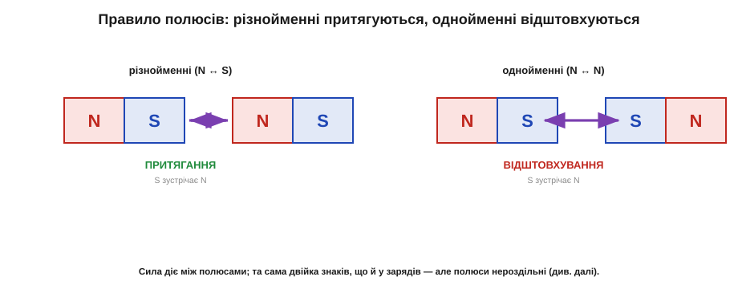
*Рис. 1.8.1.1. Між полюсами діє сила: піднесеш N до S — магніти тягнуться один до одного; N до N — розштовхуються. Та сама двійка знаків, що й у зарядів (§1.1.1), але з принциповою відмінністю, яку видно нижче.*

Спокуса очевидна: оголосити N «магнітним плюсом», S — «магнітним мінусом» і будувати магнетизм за зразком електрики. Природа на цю спокусу відповідає категоричним «ні», і саме це «ні» — найцікавіше в усій темі.

### Поле B: невидимий посередник

Як і заряди, магніти діють **на відстані**, не торкаючись. Між зарядами цю дію переносило електричне поле; між магнітами її переносить **магнітне поле** (*magnetic field*), яке позначають літерою **B**. У кожній точці простору навколо магніту поле B має певний **напрям** і певну **величину** — тобто це **векторна** величина, точно як E. Магніт не «знає» наперед, де лежить інший магніт; він просто створює навколо себе поле B, а вже це поле діє на все магнітне, що в нього потрапляє.

Щоб зробити невидиме видимим, користуються тим самим прийомом, що й для електричного поля, — малюють **силові лінії** (*field lines*). Лінія в кожній точці спрямована вздовж поля B, а її густина показує силу поля: де лінії гущі — поле сильніше. Картину магнітного поля можна навіть побачити наживо, насипавши на аркуш над магнітом залізних ошурок: кожна крихітна ошурка повертається вздовж поля й вишиковується в характерні дуги.

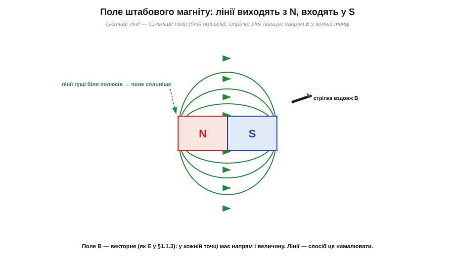
*Рис. 1.8.1.2. Поле штабового магніту. Зовні лінії виходять з північного полюса N і входять у південний S; біля полюсів вони згущуються — там поле найсильніше. Маленька магнітна стрілка в будь-якій точці встановлюється вздовж лінії — це і є напрям B.*

За домовленістю **зовні** магніту лінії спрямовані **від N до S**. Стрілка компаса, кинута в це поле, повертається так, що її власний північний кінець дивиться вздовж лінії — тобто вказує туди, куди тече поле. Це дає практичне означення напряму B: **куди показує північний кінець вільної магнітної стрілки, туди й напрямлене поле**.

Силові лінії — не просто гарна картинка, у них зашито кілька строгих правил, спільних з лініями електричного поля. По-перше, **лінії ніколи не перетинаються**: якби дві лінії зійшлися в одній точці, поле там мало б одразу два напрями, а це безглуздя — у кожній точці B спрямоване кудись одне. По-друге, **густина ліній пропорційна силі поля**: там, де вони збігаються тісно (біля полюсів), поле сильне, а де розходяться широко — слабке. По-третє, поле в будь-якій точці — це **сума** (за правилом додавання векторів, §1.1.2) полів від усіх магнітів навколо: піднесіть до одного магніту другий, і їхні лінії перебудуються, утворивши спільну картину — десь підсилившись, десь погасившись. Цей принцип **суперпозиції** працює для B так само, як працював для E, і саме він пояснює, чому два магніти створюють складні візерунки з ошурок, а не просту суму двох окремих картин.

Варто одразу попередити про межу аналогії з ошурками. Залізні ошурки чудово показують **форму** ліній і їхній напрям, але не їхню «кількість»: лінії — це наш спосіб малювати неперервне поле, а не реальні нитки, яких можна нарахувати рівно стільки-то. Поле існує в **кожній** точці простору неперервно; лінії ми проводимо так густо чи рідко, як зручно, аби лиш їхня густина чесно відображала силу. Тримаючи це в голові, ми уникаємо наївної думки, ніби між двома сусідніми лініями поля «немає».

> 🔧 **Навіщо це.** Картина силових ліній — не лише краса з підручника. Коли поряд із чутливою схемою лежить динамік, мотор чи навіть звичайний неодимовий магніт, його поле тягнеться на сантиметри довкола саме такими дугами. Розуміючи форму поля, інженер знає, де покласти давач, щоб той ловив сигнал, а де — навпаки, де поле наведе заваду чи зрушить показ електронного компаса. Уся боротьба з магнітними наводками (до якої ми дійдемо в §1.9.5) починається з уміння «бачити» ці лінії.

### Чому немає монополя: розріж магніт — отримаєш два магніти

А тепер — головна відмінність магнетизму від електрики. Заряди можна **розділити**: потерши скло об шовк, ми лишаємо надлишок «плюса» тут, а «мінуса» там; існує окремий протон, окремий електрон, окремий заряджений предмет. Здавалося б, із полюсами має бути так само: візьми магніт і розріж його посередині — і отримаєш окремий «шматок N» та окремий «шматок S», магнітні аналоги двох зарядів.

Спробуйте — і вийде зовсім інше. Розрізаний магніт дає **два менші магніти**, у кожного знову повний комплект: і N, і S. Розріжте кожен ще раз — знову чотири повноцінні диполі. І так аж до окремого атома: ніде не з'являється «голий» північний полюс без південного.

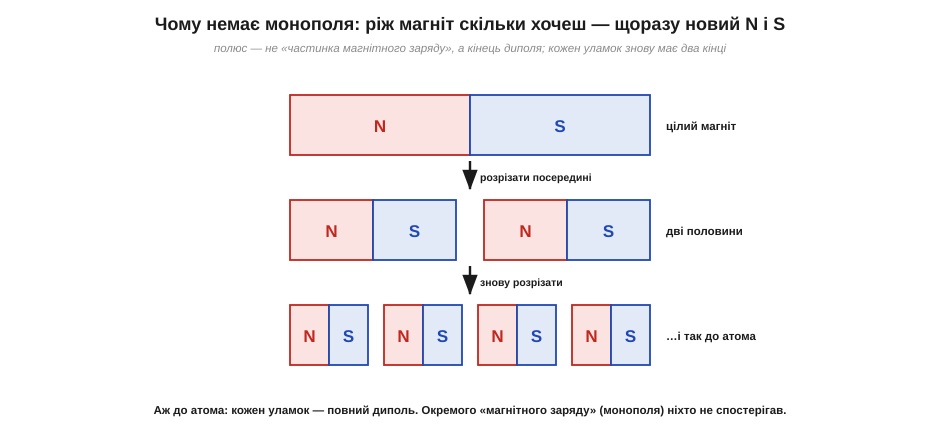
*Рис. 1.8.1.3. Хоч скільки ділити магніт, кожен уламок лишається повним диполем — парою N–S. Окремого «магнітного заряду» (магнітного монополя) досі не спостерігав ніхто, попри прицільні пошуки. Полюс — це не частинка, а кінець диполя.*

Окремий магнітний полюс назвали б **магнітним монополем** (*magnetic monopole*) — магнітним аналогом точкового заряду. Його шукали й шукають: деякі теорії навіть передбачають, що десь у Всесвіті він може існувати. Але в усій доступній нам фізиці — й у всій електроніці без винятку — **монополя немає**. Магнетизм завжди приходить **диполями**: парою нероздільних полюсів.

Це не дрібна технічна деталь, а глибока асиметрія між електрикою й магнетизмом, що пронизує весь розділ. В електриці є окремий заряд — джерело поля E, з якого лінії «б'ють фонтаном». У магнетизмі джерела немає: найдрібніша цеглинка магнетизму — це вже **диполь**, пара полюсів. Тому, де б ми далі не зустріли магнітне поле — від штабового магніту до котушки зі струмом, — воно завжди матиме структуру диполя з двома кінцями, ніколи — структуру одинокого «магнітного заряду».

Звідки ж тоді полюс, якщо його не можна виокремити? Відповідь — у наступних темах: магнетизм речовини народжується з **рухомих зарядів усередині атомів**, а рух заряду по замкненому контуру неминуче дає поле з двома кінцями. Полюс — це не «річ», а **кінець петлі**. Згодом (§1.8.4) ми побачимо це буквально: виток зі струмом має північний і південний бік саме тому, що це **замкнена петля**, а не точка. Розрізавши магніт, ми не розриваємо петель — ми лише робимо менші петлі, у кожної знову два кінці. Звідси й випливає, чому монополя бути не може: він був би «половиною петлі», а петля половин не має.

Цікаво й те, як **сила** між магнітами спадає з відстанню. Між двома точковими зарядами сила слабшає за законом оберненого квадрата (1/r², §1.1.2). Між двома магнітами-диполями вона спадає **набагато крутіше** — приблизно як 1/r⁴ на великій відстані, бо здалеку північний і південний полюси кожного магніту майже гасять дію один одного. Ось чому магніт, що міцно вчепився впритул, легко відірвати, відсунувши лише на сантиметр: сила падає стрімко. Це теж прямий наслідок дипольної (а не монопольної) природи магнетизму.

### Лінії E мають початок і кінець, лінії B — ні

Цю відмінність найясніше видно, якщо поставити поруч картину поля точкового заряду й картину поля магніту.


*Рис. 1.8.1.4. Зліва — електричне поле E: лінії **виходять** із додатного заряду (або входять у від'ємний), тобто мають початок і кінець на зарядах-джерелах. Справа — магнітне поле B: лінії **замкнені**, у них немає ні початку, ні кінця; усередині магніту вони продовжуються від S до N і змикаються в петлю.*

Ось точне формулювання того, що означає «монополя немає»: **силові лінії магнітного поля завжди замкнені**. Електрична лінія може початися на заряді й там-таки скінчитися — бо є джерело, з якого поле «витікає». Магнітна лінія не має куди «втикатися»: немає джерела, з якого поле виходило б назовсім. Тому всередині магніту лінія не обривається на полюсі, а проходить його наскрізь і замикається сама на себе. Це настільки фундаментально, що згодом стане одним із чотирьох рівнянь Максвелла (для нас поки досить образу замкнених петель).

Із замкненості ліній випливає й корисний практичний наслідок: магнітне поле не можна «екранувати» так само, як електричне. Клітка Фарадея (§1.1.8) надійно прибирає поле E всередині металевого корпусу, бо заряди в металі перерозподіляються й гасять зовнішнє поле. Для поля B такого простого трюку немає — його лінії однаково мусять кудись замкнутися. Магнітний екран працює інакше: він не нищить поле, а **перенаправляє** його лінії в товщу матеріалу з високою проникністю (про це — у §1.8.6).

### Аналогія E і B: де вона працює, а де ламається

Оскільки B — наше друге векторне поле, варто чесно звести, чим воно схоже на електричне E (§1.1.3) і де аналогія перестає діяти, — це вбереже від типових помилок. **Спільне** в них чимало: обидва — векторні поля, що в кожній точці мають напрям і величину; обидва зображають силовими лініями, де густина означає силу; обидва підкоряються принципу суперпозиції (поля джерел складаються); обидва діють на відстані через посередника-поле, а не «безпосередньо». Тому багато інтуїції з §1.1.3 переноситься на магнетизм майже без змін.

А ось де аналогія **ламається** — і це найважливіше. По-перше, джерела. У поля E джерело — **заряд**, окремий і виокремлюваний; у поля B окремого «магнітного заряду» немає, джерело завжди дипольне (або, як ми побачимо, — це струм). По-друге, форма ліній: лінії E можуть **починатися й кінчатися** (на зарядах), лінії B **завжди замкнені**. По-третє, на що діє поле: електричне поле штовхає **будь-який** заряд, навіть нерухомий, причому **вздовж** лінії поля; магнітне поле діє лише на **рухомий** заряд, і то **поперек** його руху (це ми строго побачимо в §1.8.7–1.8.8). Через цю поперечність магнітна сила поводиться зовсім інакше за електричну — вона скривлює траєкторії, а не розганяє вздовж них. Тримаючи в голові і спільне, і відмінне, ми користуємось аналогією там, де вона допомагає, і не потрапляємо в пастку там, де магнетизм поводиться по-своєму.

### Поле — це стан простору, а не «промені» магніту

Наостанок — концептуальна засторога, успадкована від Фарадея (§1.1.3). Легко уявляти, ніби магніт «випускає» щось на кшталт променів, що ловлять залізо. Це хибний образ. Поле B існує в **кожній** точці простору навколо магніту як **стан цього простору** — незалежно від того, чи є там залізо, чи його ловити. Піднесене залізо лише **виявляє** поле, що вже там було, реагуючи на нього; саме поле магніт створює й тоді, коли довкола порожнеча. Цей погляд — поле як самостійна фізична реальність, а не як дія магніту «навпростець» — і був великим внеском Фарадея, що згодом дозволив описати поширення електромагнітних хвиль. Для нас він практичний: думаючи про поле як про карту простору, ми можемо в кожній точці спитати «куди і наскільки сильно тут спрямоване B?» — і саме так читаються всі подальші фігури розділу.

### Скільки магнетизму: одиниця тесла

Лишилось дати полю B число. Одиниця магнітного поля — **тесла** (*tesla*, **Тл** / **T**), названа на честь Ніколи Тесли. Тесла — велика одиниця, тож у практиці часто бачимо й давнішу одиницю **гаус** (*gauss*, **Гс**): 1 Тл = 10 000 Гс. Щоб відчути масштаб, корисно одразу прив'язати числа до знайомих речей.


*Рис. 1.8.1.5. Орієнтири поля B (логарифмічна шкала). Магнітне поле Землі біля поверхні — лише близько 50 мкТл; магнітик на дверцятах холодильника — кілька мілітесла; добрий феритовий магніт — десяті частки тесла; неодимовий — до 1.4 Тл біля поверхні; томограф (МРТ) — 1.5–3 Тл; найсильніші лабораторні електромагніти — десятки тесла.*

Звідси відразу видно, чому компас такий вередливий: поле Землі **дуже слабке** (десятки мікротесла), і будь-який магнітик чи провід зі струмом поряд легко його перебиває. До цього ми ще повернемося в §1.8.9, а поки що головне засвоїти: **B — це векторне поле, у якого є напрям, величина (в теслах) і силові лінії, що завжди замкнені**. На цьому фундаменті стоїть увесь розділ.

**Приклад (скільки разів поле неодимового магніту сильніше за поле Землі).** Прикинемо відношення, користуючись орієнтирами з Рис. 1.8.1.5.

```
B(неодим, біля поверхні) ≈ 0.5 Тл
B(Земля, біля поверхні)  ≈ 50 мкТл = 50 × 10⁻⁶ Тл = 0.00005 Тл

відношення = 0.5 / 0.00005 = 10 000 разів
```

Біля самої поверхні маленький неодимовий магніт створює поле в **десять тисяч разів** сильніше за земне. Ось чому, піднісши такий магніт до компаса, ви миттєво «забиваєте» поле Землі й стрілка слухається лише магніта. Втім, поле магніту швидко спадає з відстанню, тож за метр від нього компас знову відчуває переважно Землю.

> 🔧 **Навіщо це.** Тримати в голові, що поле Землі — це десятки мікротесла, надзвичайно практично. Електронний компас (магнітометр) у дроні чи телефоні міряє саме ці крихітні десятки мкТл — і тому його доводиться **калібрувати** й тримати подалі від динаміків, моторів та сталевих деталей корпусу: їхнє поле, навіть слабеньке на дотик, для такого давача — ціла буря, що повністю спотворює напрям на північ.

---

## 1.8.2 Магнетизм матерії: домени й феромагнетики

Попередня тема лишила нас із чесною загадкою. Ми сказали: магнетизм приходить диполями, бо народжується з рухомих зарядів усередині атомів. Але тоді чому **залізо** легко стає магнітом і прилипає до інших магнітів, а зовні дуже схожа на нього **мідь** — ні, скільки її не три об магніт? Адже атоми є і там, і там, електрони рухаються в обох. Відповідь ховається в тому, **як саме** ці мікроскопічні магнітики розташовані один щодо одного, — і вона напрочуд красива.

### Кожен електрон — крихітний магніт

Почнімо з найдрібнішого. Електрон в атомі має дві властивості, що роблять його мікроскопічним магнітом. По-перше, він рухається навколо ядра — а рух заряду по контуру, як ми скоро доведемо в §1.8.4, створює магнітне поле. По-друге, і це головне, електрон має власну квантову властивість — **спін** (*spin*), через яку він сам поводиться як крихітний постійний магнітик із власним **магнітним моментом** (*magnetic moment*, μ). Можна образно (не зовсім строго) уявляти спін як обертання електрона довкола власної осі; важливо лише, що кожен електрон — це готовий мікродиполь зі своїм напрямом N–S.

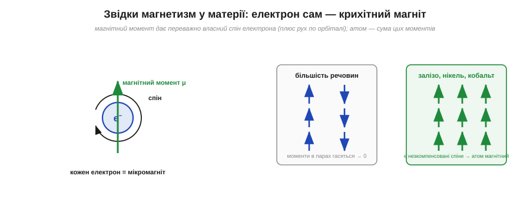
*Рис. 1.8.2.1. Зліва: електрон завдяки спіну має власний магнітний момент μ — він сам крихітний магнітик. Справа: у більшості речовин електрони ходять парами з протилежними спінами (↑↓), і їхні моменти гасять один одного; у заліза, нікелю й кобальту лишаються незкомпенсовані спіни — і атом має сумарний магнітний момент.*

Отут і перша розвилка між залізом і міддю. У більшості атомів електрони заповнюють рівні **парами** з протилежними спінами: один «вгору», один «вниз». Їхні магнітні моменти спрямовані назустріч і **гасять** один одного, тож атом як ціле виходить майже немагнітним. Це наслідок квантового **принципу Паулі**: на одному рівні можуть сидіти лише два електрони, і саме з протилежними спінами. Доки рівні заповнюються повністю, спіни йдуть строго парами «↑↓» і їхній магнетизм взаємно знищується. А от у кількох елементів — насамперед у **заліза** (Fe), **нікелю** (Ni) та **кобальту** (Co) — будова електронних оболонок особлива: у них є частково заповнена внутрішня оболонка (так звана 3d), де кільком електронам енергетично вигідніше сидіти з **однаково** напрямленими спінами, ніж паруватися. Через це частина спінів лишається **незкомпенсованою**, і кожен такий атом має помітний власний магнітний момент — він справжній маленький магніт. Мідь же належить до «парних»: її оболонки заповнені так, що атомні моменти гасяться, і окремий атом міді магнітного моменту майже не має. Звідси видно тонку, але вирішальну деталь: магнітність — не питання «метал чи ні», а питання **тонкої будови електронних оболонок**, де навіть сусідні в таблиці елементи поводяться зовсім по-різному.

### Чому самих атомних магнітиків замало

Здавалося б, цього вже досить: у заліза атоми магнітні — отже, шматок заліза магнітний. Але тут чекає друга загадка. Звичайний цвях чи болт магнітного поля **не створює** — він не притягує інших цвяхів, не повертає компаса. Хоча кожен його атом, як ми щойно з'ясували, є мікромагнітом. Куди ж дівається їхній магнетизм?

Відповідь: окремих атомних магнітиків справді замало. Якби вони дивилися хто куди — врізнобіч, — їхні поля в сумі гасилися б до нуля, і зовні шматок заліза був би немагнітним, попри мільярди мікромагнітів усередині. Саме так і буває в **парамагнетиках** (про них трохи нижче). Щоб речовина стала магнітом, мікромоменти повинні **вишикуватися** в одному напрямі. І природа заліза дає для цього особливий механізм.

### Домени: армія мікромагнітів

У залізі, нікелі й кобальті між сусідніми атомами діє особлива квантова взаємодія (її звуть **обмінною**), яка змушує сусідні спіни **вишиковуватися паралельно** — дивитися в один бік. Через це матеріал самочинно розбивається на безліч дрібних областей, усередині кожної з яких **усі** атомні моменти вже зорієнтовані однаково. Такі області називають **доменами** (*magnetic domains*); типовий домен — мікроскопічний (часто частки міліметра), але містить трильйони атомів, що дивляться в один бік. Речовини, здатні на таке самочинне вишиковування, звуть **феромагнетиками** (*ferromagnets*) — від латинського *ferrum*, залізо.

Чому ж тоді не намагнічений цвях зовні «мовчить»? Бо самі **домени** в ньому дивляться врізнобіч. Усередині кожного домену лад ідеальний, але напрями різних доменів випадкові, тож їхні поля в сумі гасяться. Магнетизм є — він просто **захований** у хаосі орієнтацій.

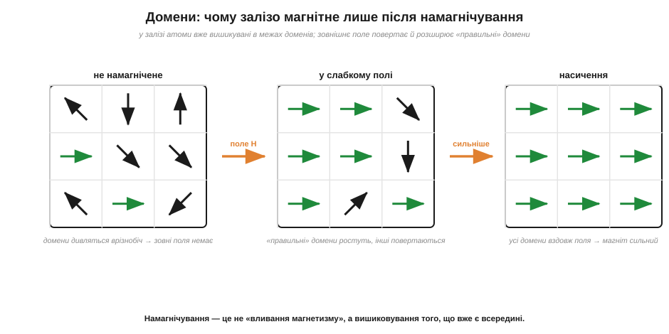
*Рис. 1.8.2.2. Намагнічування феромагнетика. Ліворуч (не намагнічене): домени дивляться врізнобіч, їхні поля гасяться, зовні поля немає. У центрі (слабке зовнішнє поле H): «правильно» зорієнтовані домени розростаються коштом сусідів, а ті повертаються вздовж поля. Праворуч (насичення): усі домени вишикувані вздовж поля — матеріал намагнічений максимально.*

Межі між доменами називають **доменними стінками** (*domain walls*) — це тонкі перехідні шари, у яких напрям спінів плавно повертається від орієнтації одного домену до орієнтації сусіднього. Саме рух цих стінок і дає намагнічування: коли «правильний» домен розростається коштом сусіда, його стінка просто зсувається, відвойовуючи територію. На цьому образі тримається вся подальша картина — і насичення (стінкам більше нікуди рухатися, бо «неправильних» доменів не лишилось), і гістерезис (стінки чіпляються за дефекти кристала й не повертаються точно туди, звідки прийшли, — про це детально в §1.8.6).

Тепер ясно, що таке **намагнічування** (*magnetization*). Піднесімо до заліза зовнішнє магнітне поле (його зручно позначати **H** — про різницю між H і B йтиметься в §1.8.6). Поле починає впорядковувати домени двома шляхами: домени, що вже дивляться «правильно», **розростаються** коштом сусідів (стінки зсуваються), а решта **повертається** вздовж поля. Що сильніше зовнішнє поле, то більше доменів вишикувано — і тим сильніший власний магнетизм заліза. Коли вишикуються геть усі, настає **насичення** (*saturation*): сильніше намагнітити вже нікуди (до цієї межі ми ще повернемося в §1.8.6).

Ключова думка, яку варто винести: намагнічування — це **не вливання магнетизму ззовні**, а **вишиковування** того, що в залізі вже було. Магнітики-атоми нікуди не зникали й не з'являлися — їх лише розвернули в лад. Ця думка пояснює і зворотний бік: коли зовнішнє поле прибрати, теплове тремтіння й внутрішні напруги частково повертають домени в хаос, і намагніченість слабшає. Наскільки слабшає — залежить від матеріалу: «м'яке» залізо майже повністю розмагнічується, «тверде» (з якого роблять постійні магніти) тримає лад. До цієї різниці ми впритул підійдемо в §1.8.3.

> 🔧 **Навіщо це.** Цей механізм — пряма причина, чому залізна викрутка з часом сама собою намагнічується (земне поле й постійне сусідство з інструментами поволі впорядковують її домени) і чому намагнічене жало зручне — притримує гвинтик. Той самий механізм пояснює, чому стрічка чи жорсткий диск **зберігають** записане: голівка локально вишиковує домени крихітних ділянок, і вони лишаються в цьому стані, кодуючи нулі та одиниці. Магнітний запис — це впорядкування доменів за командою.

### Три відповіді речовини на поле

Феромагнетики — яскравий, але не єдиний випадок. За тим, **як** речовина відгукується на зовнішнє магнітне поле, усі матеріали ділять на три класи. Це пояснює і нашу початкову загадку про мідь.

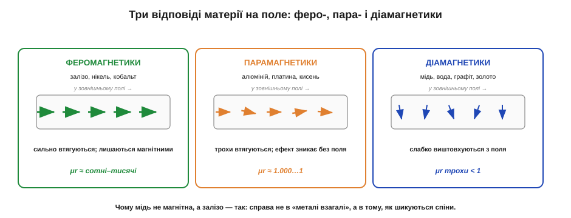
*Рис. 1.8.2.3. Три класи. **Феромагнетики** (залізо, нікель, кобальт) сильно втягуються в поле й лишаються намагніченими — у них працюють домени. **Парамагнетики** (алюміній, платина, кисень) мають незкомпенсовані атомні моменти, але без обмінної взаємодії: поле трохи їх упорядковує, проте без поля все знову розсипається. **Діамагнетики** (мідь, вода, графіт, золото) власних моментів не мають і слабко **виштовхуються** з поля.*

- **Феромагнетики** — залізо, нікель, кобальт і їхні сплави. Сильна обмінна взаємодія → домени → сильне втягування в поле й **залишковий** магнетизм. Відносна магнітна проникність (μr) — сотні й тисячі (число, що показує, у скільки разів матеріал підсилює поле; §1.8.6).
- **Парамагнетики** — алюміній, платина, кисень. Атоми мають моменти, але домен не утворюється; поле трохи їх вишиковує, проте ефект кволий і зникає, щойно поле прибрати. μr ледь більша за одиницю.
- **Діамагнетики** — мідь, вода, графіт, золото, більшість «немагнітних» речовин. Власних моментів немає; зовнішнє поле наводить у них слабенький **зустрічний** момент, тож вони ледь-ледь **виштовхуються** з поля. μr трохи менша за одиницю.

Ось і розгадка про мідь: **мідь — діамагнетик**. Її атоми магнітного моменту практично не мають, домени не утворюються, тож хоч скільки три мідь об магніт — вона не намагнітиться. А залізо — феромагнетик, у нього є домени, і їх можна вишикувати. Справа, отже, **не в «металі взагалі»**, а в тонкій будові електронних оболонок і взаємодії спінів. (Цікавий нюанс: мідь усе ж бурхливо реагує на магніт, але інакше — через наведені струми, коли поле **змінюється**; це вже електромагнітна індукція з §1.8.10, зовсім інший механізм.)

### Чому магнетизм не вічний: суперник на ім'я тепло

Вишикуваність доменів тримається на обмінній взаємодії, але в неї є постійний суперник — **тепловий рух** атомів. За будь-якої температури вищої за абсолютний нуль атоми дрижать, і це тремтіння весь час намагається збити спіни з ладу. Доки взаємодія дужча за тремтіння — феромагнітний порядок тримається; та чим гарячіше, тим тремтіння сильніше, і тим легше зруйнувати лад. Звідси два наслідки, важливі для практики. По-перше, намагніченість феромагнетика **слабшає** з нагрівом ще задовго до повної втрати. По-друге, існує критична температура, за якої тремтіння остаточно перемагає й феромагнетизм зникає геть, — про неї (температуру Кюрі) ми докладно говоритимемо в §1.8.3. Поки що досить запам'ятати: магнетизм матерії — це завжди боротьба впорядкування проти теплового хаосу, і хто переможе, залежить від температури.

Це пояснює й те, чому намагнічене залізо при кімнатній температурі все ж стабільне: за звичайних умов обмінна взаємодія в залізі набагато сильніша за теплове тремтіння, тож домени тримаються впевнено. А от парамагнетик програє цю боротьбу вже за кімнатної температури — у нього немає сильної обмінної взаємодії, і теплове тремтіння миттєво розкидає кволо впорядковані моменти, щойно зникне зовнішнє поле. Ось чому парамагнітний алюміній не стає постійним магнітом, а феромагнітне залізо — стає: різниця знову в силі взаємодії між сусідніми спінами.

**Приклад (чому магнітний тримач для викруток робить зі сталі, а не з міді).** Розсудимо якісно, спираючись на класи матеріалів.

```
сталь (сплав заліза) — феромагнетик: μr ~ кілька тисяч
   → у полі магніту сильно намагнічується, прилипає, ще й сама притримує дрібні залізні деталі

мідь — діамагнетик: μr трохи менша за 1
   → у полі магніту майже не реагує (слабке виштовхування), деталей не тримає
```

Тому магнітні тримачі, тарілочки для гвинтиків і жало викрутки роблять із феромагнітної сталі — лише вона дає потрібний ефект. Якби корпус інструмента був мідний чи алюмінієвий, магнітна функція просто не працювала б. Це прямий практичний наслідок поділу матеріалів на три класи.

> 🔧 **Навіщо це.** Поділ на феро-, пара- й діамагнетики підказує, з чого роблять різні деталі. Осердя електромагнітів, трансформаторів і реле — лише з феромагнетиків (залізо, спеціальні сплави): тільки вони помітно підсилюють поле. А там, де магнітне поле **заважає** — корпус біля магнітометра, кронштейн давача, немагнітний кріпеж, — навмисно беруть діа- чи парамагнітні матеріали: алюміній, латунь, нержавійку аустенітного класу. «Немагнітний гвинт» — це інженерне рішення, що спирається саме на цей поділ.

---

## 1.8.3 Постійні магніти: ферит і неодим

Ми розібрались, як залізо намагнічується — домени вишиковуються вздовж зовнішнього поля. Але тут постає природне питання, яке інтуїтивно бентежить кожного: чому **постійний магніт** залишається магнітом? Адже електрична батарейка з часом «сідає», заряджене тіло поступово втрачає заряд у вологе повітря — а магніт на дверцятах холодильника висить роками й тримає так само міцно, нібито нічого не «витрачає». Звідки він бере силу й чому не «розряджається»? І якщо магнетизм усе ж можна зруйнувати, то як саме? Ці питання ведуть нас до інженерно найважливіших магнітних матеріалів — фериту й неодиму.

### Магніт нічого не «витрачає»

Перше, що варто чітко зрозуміти: проводити аналогію між магнітом і батарейкою — **хибно**. Батарейка віддає енергію, бо в ній іде хімічна реакція, що поступово вичерпує реагенти (§1.1.5). Магніт же, просто **лежачи** й тримаючи цвях, **не виконує роботи** й **не витрачає енергії** взагалі. Поле магніту утримує цвях статично — так само, як полиця тримає на собі книжку, не витрачаючи «запасу». Робота виконується лише тоді, коли щось **рухається**; нерухоме поле енергії не споживає.

А сам магнетизм постійного магніту — це, як ми вже знаємо з §1.8.2, **вишикуваність доменів**. Усі (чи майже всі) домени дивляться в один бік і так і лишаються. Питання тоді переформулюється: чому домени не розсипаються самі собою назад у хаос, як це сталося б у парамагнетику? Відповідь у тому, що постійні магніти роблять зі спеціальних — **«твердих»** — магнітних матеріалів.

Тут варто розвіяти ще одну поширену помилку. Дехто уявляє, ніби магніт «притягає» завдяки якійсь силі, що неухильно вичерпується від роботи. Але пригадаймо §1.1.4: робота виконується, лише коли точка прикладання сили **рухається**. Магніт, що тримає цвях нерухомо, роботи не виконує — як не виконує її гак, на якому висить вантаж. Енергію магніт віддає тільки в **момент притягання**, коли цвях летить до нього й набирає швидкості, — але цю енергію магніт не «створює з себе», а лише вивільняє з потенціальної енергії взаємодії, точно як гравітація вивільняє енергію тіла, що падає. Притягнувши цвях, магніт повертається у вихідний стан без жодної втрати. Тому й немає «розряджання»: цикл замкнений, нічого не витрачено безповоротно.

### Тверді й м'які магнітні матеріали

Феромагнетики бувають дуже різні за тим, **наскільки вперто** вони тримають вишикувані домени після того, як зовнішнє поле прибрали. За цією ознакою їх ділять на два табори.

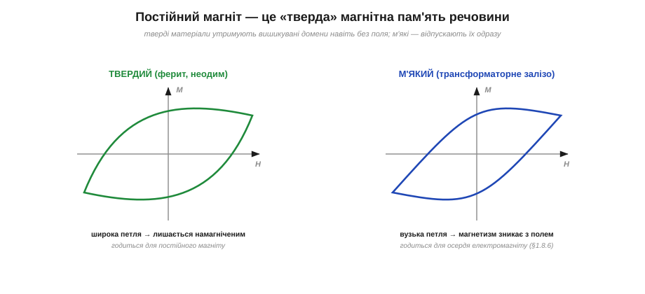
*Рис. 1.8.3.1. **Тверді** магнітні матеріали (ферит, неодим) утримують вишикувані домени навіть без зовнішнього поля — їхня крива намагнічування описує **широку** петлю; вони й стають постійними магнітами. **М'які** матеріали (трансформаторне залізо) відпускають домени, щойно поле зникне, — їхня петля **вузька**; вони годяться на осердя електромагнітів (§1.8.6), але не на постійний магніт.*

- **Тверді магнітні** (*hard magnetic*) матеріали — ферити, неодимові й самарій-кобальтові сплави. У них доменам **важко** перевернутися: щоб збити їх з вишикуваного стану, потрібне сильне зустрічне поле. Раз намагнітивши такий матеріал, ми отримуємо стабільний постійний магніт, що тримає лад роками.
- **М'які магнітні** (*soft magnetic*) матеріали — чисте залізо, кремнисте «трансформаторне» залізо, пермалой. У них домени вишиковуються легко, але так само легко й розсипаються, щойно зовнішнє поле зникне. Постійного магніту з них не зробиш — зате вони ідеальні там, де поле треба то вмикати, то вимикати (осердя котушок).

Те, наскільки матеріал «твердий», кількісно описує **коерцитивна сила** (*coercivity*, H_c) — величина зустрічного поля, потрібного, щоб розмагнітити матеріал. У твердих магнітів вона велика, у м'яких — крихітна. До повної картини з петлею намагнічування ми повернемося в §1.8.6, а тут досить образу: **постійний магніт — це феромагнетик із доменами, замкненими на «тугий замок»**.

### Ферит проти неодиму

Двома робочими конячками сучасної техніки є **феритові** й **неодимові** магніти, і їх корисно протиставити.

**Феритові** (*ferrite*, керамічні) магніти — це спечений порошок оксиду заліза з домішкою барію чи стронцію. Вони **дешеві**, не бояться корозії (це вже й так оксид), витримують високу температуру — але дають **відносно слабке** поле (десяті частки тесла біля поверхні) і крихкі, як кераміка. Це ті чорнуваті важкі магніти з гучномовців, простих моторчиків, навчальних наборів і дверних защіпок. Цікаво, що ферит — це не метал, а **керамічний ізолятор**: він майже не проводить електрики. Ця властивість виявиться неоціненною для осердь на високих частотах (§1.8.6), бо ізолятор не дає текти вихровим струмам (§1.8.10), — але про це у відповідних темах; тут досить запам'ятати, що «ферит» означає клас оксидних, керамічних магнітних матеріалів.

**Неодимові** (*neodymium*, сплав Nd–Fe–B) магніти — найсильніші з масово доступних. За тих самих розмірів вони дають **у рази** сильніше поле (до 1.2–1.4 Тл біля поверхні), тримають величезну вагу. Розплата — ціна, крихкість (сколюються при ударі), схильність до **корозії** (тому їх покривають нікелем чи цинком) і чутливість до нагріву. Саме неодимові магніти стоять у потужних компактних моторах, жорстких дисках, акустиці, защіпках і безлічі давачів. Класи неодиму позначають як **N35, N42, N52** і т. д. — число приблизно відповідає максимальній «магнітній енергії», тож вищий клас означає сильніший магніт.

Що ж це за «магнітна енергія», яку кодує число класу? Її називають **максимальним енергетичним добутком** (*maximum energy product*, BH_max) і міряють у кілоджоулях на кубометр (кДж/м³) або в старих одиницях МГс·Е. Грубо кажучи, BH_max показує, **скільки магнітної енергії запасено в одиниці об'єму** магніту — а отже, наскільки сильне поле він здатен дати при заданому розмірі. У класу N52 число «52» — це і є приблизно BH_max ≈ 52 (у старих одиницях). Тому інженерна логіка проста: за обмеженого місця беруть вищий клас (сильніше поле в тому самому об'ємі), а коли місця досить, дешевший нижчий клас цілком справляється. Феритам же до неодиму тут далеко — їхній BH_max у 5–10 разів менший, тож феритовий магніт тієї самої сили виходить помітно більшим і важчим.

Чому неодим узагалі такий сильний? Секрет — в атомі **неодиму** (рідкісноземельний метал), чия електронна оболонка дає величезний магнітний момент і, головне, дуже високу коерцитивність у сполуці Nd₂Fe₁₄B. Це поєднання — сильне поле плюс упертість доменів — і зробило неодим королем постійних магнітів від самого його винайдення 1984 року.

> 🔌 **Компонентна вставка:** [ферит проти неодиму — класи N35–N52, крихкість, корозія й температурні межі](r08-s3-c-magnet-grades.md) — як читати маркування магнітів і не помилитися з вибором.

> 📜 **Історична вставка:** [1984: неодимовий магніт відкривають двічі](r08-s3-history-neodymium.md) — як майже одночасно й незалежно його винайшли Масато Сагава в Японії та команда Джона Кроута в General Motors.

> 🔧 **Навіщо це.** Вибір між феритом і неодимом — щоденне інженерне рішення. Потрібен сильний магніт у малому об'ємі (компактний мотор, тримач, давач положення) — беруть неодим, закладаючи в проєкт його крихкість і температурну межу. Потрібен дешевий магніт, що працюватиме в спеці й не іржавітиме, а сила не критична — ставлять ферит. А неодимовий магніт біля гарячого вузла (поряд із силовим транзистором чи двигуном) може **тихо ослабнути** від перегріву — і це окрема пастка, до якої ми переходимо.

### Температура Кюрі: межа, за якою магнетизм зникає

Є один спосіб **гарантовано** зруйнувати будь-який магніт — нагріти його. І тут криється глибока фізика. Вишикуваність доменів тримається на обмінній взаємодії між спінами, але їй протистоїть **тепловий рух**: атоми за будь-якої температури дрижать, і чим гарячіше, тим сильніше це тремтіння збиває спіни з ладу. Доки взаємодія сильніша за теплове тремтіння — лад тримається. Та існує критична температура, за якої тремтіння перемагає й упорядкування зникає **раптово**. Її називають **температурою Кюрі** (*Curie temperature*, T_C) — на честь П'єра Кюрі, що відкрив цей перехід.

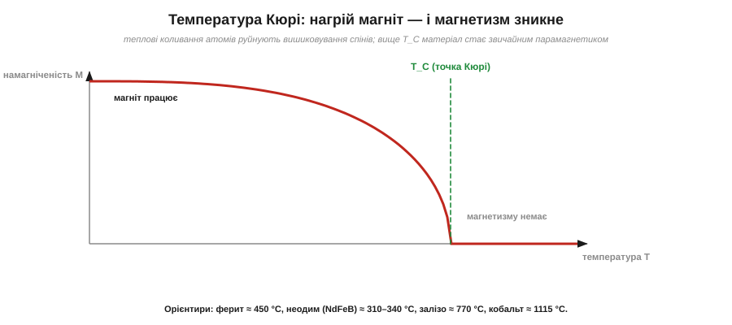
*Рис. 1.8.3.2. Залежність намагніченості від температури. Доки T < T_C, феромагнетик зберігає магнетизм (хоч він і слабшає з нагрівом); при T_C намагніченість круто падає до нуля, і вище цієї точки матеріал стає звичайним парамагнетиком. Орієнтири: ферит ≈ 450 °C, неодим (NdFeB) ≈ 310–340 °C, залізо ≈ 770 °C, кобальт ≈ 1115 °C.*

Вище T_C речовина повністю **втрачає феромагнітні властивості** — стає звичайним парамагнетиком, домени більше не утворюються. Якщо охолодити її назад без зовнішнього поля, вона лишиться **розмагніченою**: домени застигнуть знову врізнобіч. Тобто перегрів — це незворотна втрата магнетизму, поки магніт не намагнітять заново.

Особливо підступний тут **неодим**: його точка Кюрі — лише близько 310–340 °C, а помітно слабшати він починає вже за значно нижчих температур (іноді від 80 °C для звичайних класів). Тому неодимовий магніт у гарячому вузлі може втратити частину сили задовго до того, як ви взагалі подумаєте про «нагрів до Кюрі».

**Приклад (чи переживе неодимовий магніт паяння поряд).** Прикинемо, чи безпечно тримати магніт біля місця паяння.

```
T_C(неодим)            ≈ 320 °C
типова температура паяння жалом ≈ 350 °C
робоча межа звичайного неодиму (клас N) часто  ≈ 80 °C

350 °C > 320 °C  →  пряме торкання гарячим жалом ПЕРЕВИЩУЄ точку Кюрі
   → магніт незворотно розмагнічується
навіть тепловіддача від паяння поряд може перевищити робочі 80 °C
   → частина сили втрачається
```

Висновок: гаряче жало біля неодимового магніту — це майже гарантована його втрата. На практиці магніти або встановлюють **після** паяння, або беруть високотемпературні класи (з позначками SH, UH, EH), або відводять тепло. Той самий розрахунок для фериту (T_C ≈ 450 °C) дав би більший запас — ще одна причина, чому ферит люблять у гарячих місцях.

### Як іще зіпсувати магніт

Нагрів вище Кюрі — найрадикальніший, але не єдиний спосіб розмагнітити. Загалом їх три, і всі вони про одне: **збити домени з вишикуваного стану**.

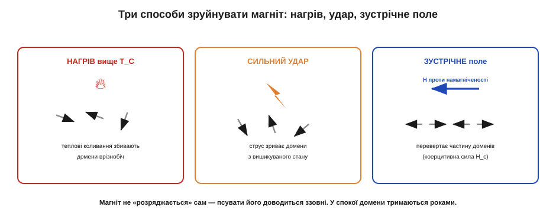
*Рис. 1.8.3.3. Розмагнічування. **Нагрів** вище T_C руйнує лад тепловим тремтінням. **Сильний удар** механічно струшує домени, частина яких зривається з ладу (тому магніти бережуть від падінь і ударів). **Зустрічне поле**, сильніше за коерцитивну силу H_c, перевертає частину доменів проти намагніченості. У спокої ж, без цих впливів, домени тримаються роками — магніт не «розряджається» сам.*

Отже, на головне питання теми відповідь така: постійний магніт **не розряджається сам**, бо нічого не витрачає — він лише тримає вишикувані домени. Зруйнувати цей лад можна, але для цього треба прикласти зусилля **ззовні**: нагріти, вдарити чи піднести зустрічне поле. Лишений у спокої, добрий магніт із твердого матеріалу зберігає силу десятиліттями.

> 🔧 **Навіщо це.** Звідси прямі правила поводження з магнітами в майстерні. Не кидати й не бити неодимові магніти — від удару вони і сколюються (крихкі), і частково розмагнічуються. Не нагрівати їх паяльником чи феном понад робочу межу. Не зберігати сильні магніти впритул різнойменними полюсами до слабких — сильне поле може перемагнітити слабкий. І навпаки: якщо стара магнітна викрутка «ослабла», її можна **намагнітити заново**, кілька разів провівши вздовж неї сильним магнітом, — ви просто наново вишиковуєте домени.

---

## 1.8.4 Струм народжує поле: дослід Ерстеда й правило правої руки

Досі ми говорили про магнетизм так, наче він живе сам по собі: магніти, домени, полюси. Електрика — окремо, магнетизм — окремо. Рівно так вважала наука протягом двох тисяч років: компас і бурштин — дві різні загадки, що не мають між собою нічого спільного. І ось ми підходимо до **поворотного моменту** всієї фізики XIX століття — до відкриття, яке зшило ці дві загадки в одну й без якого не було б ні моторів, ні генераторів, ні трансформаторів, ні самої електротехніки. Виявилося, що **електричний струм створює навколо себе магнітне поле**.

### Дослід Ерстеда: дріт повертає стрілку

У 1820 році данський фізик **Ганс Крістіан Ерстед** (*Hans Christian Ørsted*) показав експеримент, простий до краю — і саме тому такий переконливий. Він поклав провідник поряд із магнітною стрілкою компаса. Доки струму не було, стрілка спокійно дивилася на північ, як їй і належить у полі Землі. Та щойно Ерстед **пустив дротом струм**, стрілка несподівано **повернулася** — стала майже поперек дроту. Вимкнув струм — стрілка вернулася на північ.

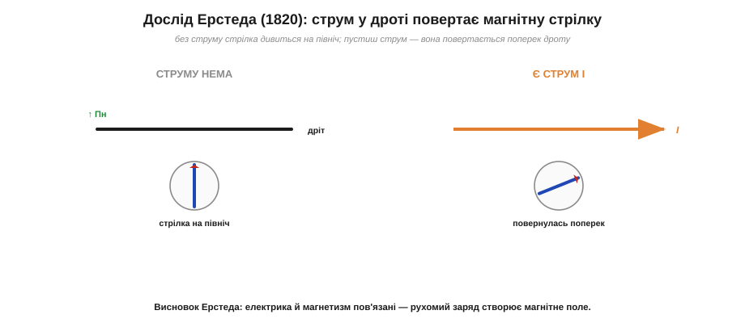
*Рис. 1.8.4.1. Дослід Ерстеда (1820). Без струму магнітна стрілка показує на північ (поле Землі). Щойно дротом пускають струм I, навколо нього виникає магнітне поле, і стрілка повертається вздовж нього — майже поперек дроту. Прибрали струм — стрілка вернулася. Висновок: рухомий заряд (струм) створює магнітне поле.*

Це був грім серед ясного неба. Стрілка — суто магнітний прилад — відгукнулася на **електричний** струм. Отже, електрика й магнетизм пов'язані: те, що тече дротом, якимось чином діє як магніт. Звістка облетіла Європу за тижні, і вже того ж 1820 року Андре-Марі Ампер дав цьому явищу кількісний опис (його ім'я ми ще не раз згадаємо в цьому розділі). Так народилася **електродинаміка** — і так зник дволітній поділ на «електрику» й «магнетизм».

Щоб відчути, наскільки це було несподівано, варто згадати ще одну деталь досліду. Стрілка повернулася не **до** дроту й не **від** нього, як було б, якби струм просто притягував чи відштовхував її, наче заряд. Вона стала **поперек**, нібито поле обходить дріт по колу. Це спантеличило сучасників: жодна знайома сила так не діяла. Притягання й відштовхування зарядів спрямовані вздовж лінії між ними; а тут сила була **збоку**, перпендикулярна. Саме ця «бічна», поперечна природа магнітної дії — лейтмотив усього розділу: вона ще не раз вигулькне в силі Ампера (§1.8.7) і в ефекті Холла (§1.8.8). Магнетизм від самого початку поводиться не так, як електростатика, — і дослід Ерстеда був першим тому свідченням.

Можна спитати глибше: а **чому** рухомий заряд породжує поле, та ще й таке дивне, поперечне? Найглибша відповідь, до якої дійшла фізика XX століття, така: магнетизм — це, по суті, **релятивістський бік електрики**. Те, що для нерухомого спостерігача виглядає як суто магнітна сила від струму, для спостерігача, який рухається разом із зарядами, частково перетворюється на звичайну електричну. Електричне й магнітне поля — два прояви єдиного **електромагнітного** поля, і який саме прояв ми бачимо, залежить від руху. Це красива, але непроста ідея, і повного її розгортання наш курс не потребує; нам досить твердого факту Ерстеда — **струм створює магнітне поле** — і вміння цим полем користуватися.

> 📜 Чи справді стрілка смикнулася **випадково**, посеред лекції, як любить розповідати легенда? Сам Ерстед наполягав, що шукав цей зв'язок свідомо. Як було насправді й чому історія обросла анекдотом — у [історії розділу](r08-history-lodestone-oersted.md).

### Поле прямого провідника: концентричні кільця

Який же вигляд має поле навколо дроту зі струмом? Підказку дала сама стрілка Ерстеда: вона ставала **поперек** дроту, а не вздовж і не до нього. Якщо обійти провідник із компасом, стрілка весь час буде дотичною до кола, у центрі якого — дріт. Отже, силові лінії магнітного поля прямого струму — це **концентричні кола**, що охоплюють провідник.

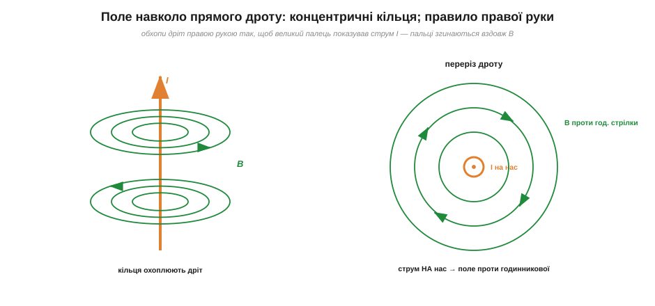
*Рис. 1.8.4.2. Поле прямого провідника зі струмом — це система **концентричних кілець** навколо дроту (зліва — погляд збоку, справа — у перерізі). Поле сильніше біля дроту й слабшає з відстанню. Напрям обходу кілець задає **правило правої руки**.*

Ці кільця не мають ні початку, ні кінця — вони замкнені, як і годиться магнітним лініям (§1.8.1). Ось і обіцяний доказ замкненості: поле прямого струму буквально утворює кола навколо дроту — куди тут «втикатися» лінії, як це робила лінія E на заряді? Поле найсильніше біля самого дроту й спадає обернено пропорційно до відстані. Кількісно це записують простою формулою:

```
B = μ₀ · I / (2π · r)
```

де **I** — струм у дроті, **r** — відстань до осі дроту, а **μ₀** ≈ 1.257 × 10⁻⁶ Тл·м/А — вже знайома нам магнітна стала. Зверніть увагу на закон спадання: тут **1/r**, а не 1/r², як було для точкового заряду (§1.1.2). Поле довгого дроту слабшає повільніше за поле точки — бо дріт «довгий», його внески складаються вздовж усієї лінії. Удвічі далі від дроту — удвічі слабше поле; це знадобиться нам у §1.8.9, коли рахуватимемо, на якій відстані поле проводу зрівняється з полем Землі. А **напрям**, у який «крутяться» кільця, визначає одне з найкорисніших правил усієї електротехніки.

### Правило правої руки

Звідки знати, за чи проти годинникової стрілки спрямоване поле? Природа тут не симетрична: напрям поля жорстко прив'язаний до напряму струму. Запам'ятати зв'язок допомагає **правило правої руки** (*right-hand rule*):

> Обхопіть провідник правою рукою так, щоб **великий палець** показував напрям струму I (за умовним напрямом — від плюса до мінуса, §1.2.2). Тоді **зігнуті пальці** показують напрям магнітного поля B навколо дроту.

Просте й безвідмовне. Якщо струм тече вгору, поле обходить дріт проти годинникової стрілки (якщо дивитися згори); якщо вниз — за годинниковою. У перерізі це зручно малювати так: струм **на нас** позначають кружком із крапкою (вістря стріли, що летить до нас), струм **від нас** — кружком із хрестиком (хвіст стріли). Для струму «на нас» поле йде проти годинникової стрілки — саме так, як на правій частині Рис. 1.8.4.2.

Тут чигає одна пастка, через яку легко помилитися на півоберта. Правило правої руки прив'язане до **умовного** напряму струму — від плюса до мінуса (§1.2.2), тобто до напряму руху уявних додатних зарядів. А реальні електрони, як ми знаємо, біжать **назустріч** цьому напряму. Тож якщо мислити рухом електронів, треба брати **ліву** руку (або повернути результат на 180°). У всій інженерній практиці домовилися користуватися саме умовним струмом і **правою** рукою — так роблять усі схеми, даташити й розрахунки. Головне — не змішувати дві картини в одній задачі: визначившись користуватися умовним струмом, послідовно тримаймося його, і права рука ніколи не підведе.

> 🔧 **Навіщо це.** Правило правої руки — робочий інструмент, а не формальність. Воно пояснює, чому два паралельні дроти зі струмом створюють поле один навколо одного (і через це притягуються чи відштовхуються — побачимо в §1.8.7). Воно ж підказує, чому довгі сигнальні дроти краще не лишати петлями: кожна петля зі струмом — це маленький магніт, що випромінює поле й ловить чуже (звідси завади з §1.9.5). А ще саме воно дасть напрям поля в котушці, на якій тримається весь подальший розділ.

### Згорни дріт у виток — поля складуться

Поле одного прямого дроту слабке й «розмазане» кільцями. Але варто **зігнути** дріт у кільце — і картина різко змінюється на користь. Уявімо виток зі струмом. За правилом правої руки поле кожної ділянки дроту охоплює її кільцем; а всередині витка ці кільця від усіх ділянок **складаються в один бік** — крізь отвір витка. Зовні ж вони частково гасяться й розходяться.

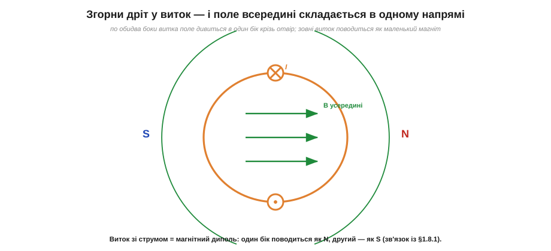
*Рис. 1.8.4.3. Згорнутий у виток провідник: усередині поля від усіх ділянок дроту додаються й дивляться в один бік крізь отвір, а зовні поле розходиться й замикається петлями. У результаті виток зі струмом поводиться **точно як магнітний диполь** (§1.8.1): один його бік — північний полюс N, другий — південний S.*

Це глибокий і важливий результат: **виток зі струмом — це магнітний диполь**. Один його бік стає північним полюсом, другий — південним; яким саме — знову підкаже права рука (тепер пальці згинаються вздовж струму витка, а **великий палець показує на N**). Ось і обіцяна в §1.8.1 розгадка, звідки беруться полюси без монополів: полюс — це просто **кінець петлі струму**. І атомний магнетизм заліза, по суті, той самий: мікроскопічні струми (рух і спін електронів) — це мікроскопічні витки, у кожного свій N і S, нероздільні за самою своєю природою.

Це замикає велику ідею. Згадаймо §1.8.2: магнетизм речовини народжується зі спінів і орбітального руху електронів. Тепер видно, **чому** він завжди дипольний: кожен такий мікроскопічний рух заряду — це крихітна петля струму, а петля має два кінці, ніколи — один. Ось чому в речовині не буває «магнітного заряду»: на найглибшому рівні весь магнетизм зведений до **струмів-петель**, а петля монополем бути не може. Велика картина складається: і постійний магніт, і електромагніт, і намагнічене залізо — усе це, зрештою, струми, що течуть по контурах, великих чи мікроскопічних.

Кількісно поле в центрі одного круглого витка радіуса R зі струмом I дорівнює B = μ₀·I/(2R), а для котушки з N витків воно у N разів більше. Не обов'язково заучувати цю формулу — важлива закономірність: поле росте з числом витків і струмом і слабшає з розміром витка. Саме цю ідею ми розгорнемо в наступній темі, коли з багатьох витків зберемо повноцінний електромагніт.

**Приклад (поле під лінією електропередачі).** Прямий провід несе струм I = 100 А. Яке магнітне поле він створює на відстані r = 1 м (порядок поля під побутовою повітряною лінією)?

```
B = μ₀ · I / (2π · r)
B = (1.257×10⁻⁶ Тл·м/А · 100 А) / (2π · 1 м)
B = (1.257×10⁻⁴) / 6.283
B ≈ 2.0 × 10⁻⁵ Тл = 20 мкТл
```

Близько 20 мкТл — це приблизно **половина** поля Землі (§1.8.1). Тобто навіть під лінією зі значним струмом магнітне поле на рівні людини співмірне із земним, а не катастрофічне. Зате прямо біля дроту (на сантиметрах) воно стає набагато сильнішим — і саме там компас уже безнадійно «бреше», як ми побачимо в §1.8.9.

> ⚙️ **Алгоритмічна вставка:** [поле довільного контуру чисельно — складаємо внески за Біо–Саваром](r08-s4-a-biot-savart.md) — як порахувати поле дроту будь-якої форми, розбивши його на крихітні відрізки й підсумувавши їхні внески.

**Приклад (у який бік дивиться північ котушки).** Нехай дивимося на виток із торця, і струм по ньому йде **проти годинникової стрілки**. Куди спрямоване поле всередині й де північний полюс?

```
струм по витку (як ми бачимо): проти годинникової стрілки
права рука: пальці згинаємо за струмом (проти год. стрілки)
            → великий палець дивиться НА НАС
отже: поле всередині витка спрямоване на нас
      бік витка, що до нас, — це північний полюс N
```

Тобто якщо струм тече проти годинникової стрілки з нашого боку, то саме цей бік витка є північним полюсом і поле «б'є» з нього на нас. Перевернувши виток або змінивши напрям струму, ми поміняємо полюси місцями. Це правило ми негайно застосуємо до котушки в наступній темі.

---

## 1.8.5 Електромагніт: котушка, осердя, ампер-витки

Один виток зі струмом — уже маленький магніт, але кволенький: його поле слабке й швидко спадає. Природна думка інженера: якщо один виток дає трохи поля, то **багато витків** дадуть багато. Так народжується **електромагніт** — пристрій, що творить магнітне поле зі струму й, на відміну від постійного магніту, дозволяє це поле **вмикати, вимикати й регулювати**. Саме керованість робить електромагніт серцем реле, соленоїдів, клапанів, гучномовців і — врешті — будь-якого мотора. Розберімо, від чого залежить його сила.

### Соленоїд: складаємо поля багатьох витків

Сама ідея проста, але історично вона дала величезний стрибок. Перший електромагніт побудував 1824 року англієць **Вільям Стерджен** (*William Sturgeon*), обмотавши кілька витків навколо залізного осердя; той піднімав вагу, у рази більшу за власну. А вже наприкінці 1820-х американець **Джозеф Генрі** (*Joseph Henry*) показав ключове вдосконалення: він намотав **багато** витків ізольованого дроту (Стерджен ізоляції майже не мав, тож не міг класти витки щільно) і дістав електромагніти небаченої на той час сили — деякі підіймали сотні кілограмів. Саме перехід від кількох голих витків до сотень ізольованих перетворив іграшку на інструмент — і дав ту саму ідею N·I, до якої ми зараз дійдемо.

Намотаймо дріт у щільну спіраль із багатьох витків — отримаємо **соленоїд** (*solenoid*), або просто котушку. Кожен виток, як ми бачили в §1.8.4, створює своє поле, спрямоване вздовж осі. У щільній котушці витки стоять упритул, і їхні поля **складаються**: усередині соленоїда вони підсилюють один одного й вишиковуються в одну сильну, на диво **рівну** (однорідну) лінію поля. Зовні ж картина соленоїда стає схожою як дві краплі води на картину штабового магніту: один торець котушки — північний полюс, другий — південний.

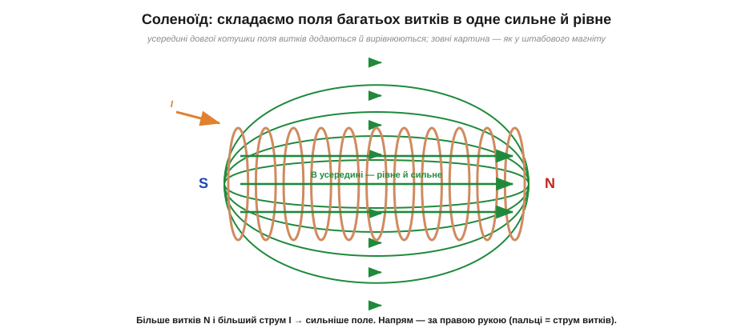
*Рис. 1.8.5.1. Соленоїд — щільна котушка з багатьох витків. Усередині поля всіх витків додаються, даючи сильне й рівномірне поле B уздовж осі; зовні поле виходить з одного торця (N) і входить у другий (S) — точно як у штабового магніту (§1.8.1). Напрям полюсів задає права рука: пальці згинаємо за струмом витків, великий палець показує на N.*

Сила поля всередині довгого соленоїда виявляється напрочуд простою. Вона залежить від того, **скільки витків** N на одиницю довжини й **який струм** I тече кожним:

```
B = μ₀ · (N · I) / ℓ
```

де **N** — кількість витків, **I** — струм, **ℓ** — довжина котушки, а **μ₀** (*магнітна стала*, *permeability of free space*) ≈ 1.257 × 10⁻⁶ Тл·м/А — універсальна константа, що зв'язує струм із полем у порожнечі (її роль у магнетизмі схожа на роль ε₀ в електриці). Головне в цій формулі — добуток **N·I**: поле визначається тим, скільки сумарного струму «накручено» навколо осі.

### Ампер-витки: міра «накачаного» магнетизму

Добуток N·I зустрічається так часто, що для нього є власна назва — **ампер-витки** (*ampere-turns*, A·в), або, формальніше, **магніторушійна сила** (*magnetomotive force*, MMF). Це міра того, **скільки магнетизму накачує котушка**. І в ній захована дуже практична ідея: однакове поле можна дістати або великим струмом через мало витків, або малим струмом через багато витків — аби добуток N·I був той самий.

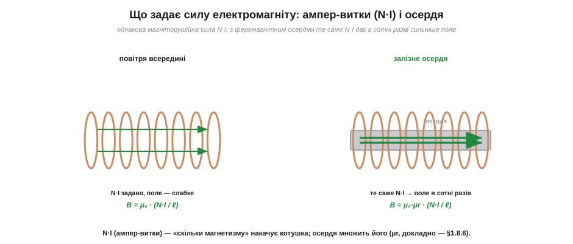
*Рис. 1.8.5.2. Магніторушійну силу N·I (ампер-витки) задає котушка. У повітрі це N·I дає відносно слабке поле B = μ₀·(N·I)/ℓ. Якщо ж усередину котушки вставити феромагнітне **осердя**, те саме N·I дає поле в сотні разів сильніше: B = μ₀·μr·(N·I)/ℓ, де μr — у скільки разів осердя підсилює поле (докладно — §1.8.6).*

Це пояснює, чому 100 витків зі струмом 1 А і 1000 витків зі струмом 0.1 А створюють однакове поле: в обох випадках N·I = 100 ампер-витків. Інженер користується цією свободою постійно: якщо джерело дає малий струм, але високу напругу — намотують **більше витків тонким дротом**; якщо є великий струм — обходяться **меншою кількістю товстого**.

Є й корисна аналогія, що пов'язує магнітне коло з електричним, добре знайомим із §1.4. Магніторушійну силу N·I можна вважати «магнітною напругою», що жене **магнітний потік** Φ крізь замкнений шлях (осердя). Тому, що цьому потоку «опирається», дали назву **магнітний опір**, або **релуктанс** (*reluctance*). І тоді все вкладається в магнітний аналог закону Ома: потік дорівнює магніторушійній силі, поділеній на магнітний опір (Φ = N·I / релуктанс). Феромагнітне осердя — це шлях із **малим** магнітним опором (поле охоче ним тече), а повітря — з великим. Ця аналогія напрочуд практична: вона одразу пояснює, чому навіть тонкий **повітряний зазор** в осерді різко послаблює поле (повітря має величезний магнітний опір порівняно з залізом), і чому осердя реле роблять замкненим, з мінімальним зазором, — щоб магнітний потік не «витікав» намарно.

> 🧮 **Математична вставка:** [ампер-витки — оцінити поле котушки із закону Ампера](r08-s5-m-ampere-turns.md) — звідки береться формула B = μ₀·N·I/ℓ і як швидко прикинути поле «на серветці».

### Осердя: множник поля

Найпотужніший важіль — це **осердя** (*core*). Вставимо всередину котушки стрижень із феромагнітного матеріалу (зазвичай м'якого заліза). Поле котушки намагнічує осердя — вишиковує його домени (§1.8.2), — і вже **вишикувані домени додають своє, значно сильніше поле**. У результаті те саме N·I дає поле в **сотні, а то й тисячі разів** сильніше, ніж у повітрі. Формула набуває множника **μr** — відносної магнітної проникності матеріалу:

```
B = μ₀ · μr · (N · I) / ℓ
```

Для м'якого трансформаторного заліза μr сягає кількох тисяч — звідси й колосальний приріст. Чому залізо так працює і де межа цього підсилення — серцевина наступної теми (§1.8.6). Тут важливо засвоїти головне: **сила електромагніту = ампер-витки × проникність осердя**. Три важелі в руках інженера — кількість витків, струм і матеріал осердя.

### Тяга якоря: електромагніт як актуатор

Навіщо взагалі творити поле струмом, якщо є постійні магніти? Через **керованість**. Постійний магніт тягне завжди; електромагніт тягне **лише поки тече струм** — а отже, ним можна керувати електричним сигналом. На цьому стоїть цілий клас пристроїв-актуаторів, що перетворюють струм на рух.

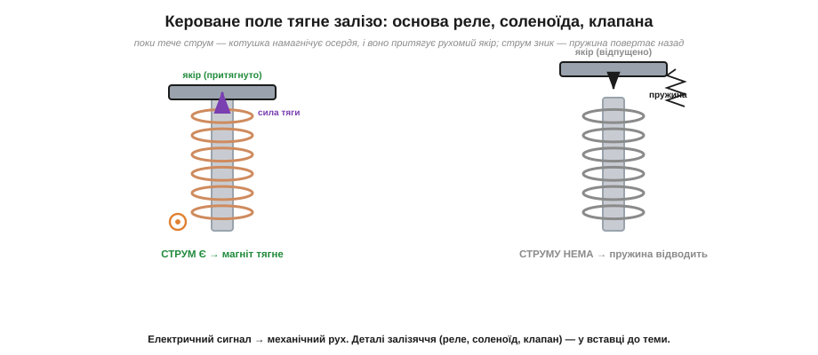
*Рис. 1.8.5.3. Електромагніт як актуатор. Поки тече струм, котушка намагнічує осердя, і воно притягує рухому залізну деталь — **якір**. Щойно струм зникає, поле зникає, і **пружина** повертає якір назад. Так електричний сигнал перетворюється на механічний рух — основа реле, соленоїда й електромагнітного клапана.*

Механізм простий: котушка з осердям, поряд — рухомий шматок заліза (**якір**, *armature*) на пружині. Подали струм — осердя намагнітилось і притягнуло якір; зняли струм — пружина відвела його назад. Цей рух можна використати по-різному: замкнути/розімкнути електричні контакти (це **реле**), штовхнути стрижень (це **соленоїд**-штовхач), відкрити/закрити прохід для рідини чи газу (це електромагнітний **клапан**). У всіх випадках суть та сама — кероване струмом магнітне поле виконує механічну роботу.

Чому ж якір саме **притягується**, а не відштовхується? Тут спрацьовує та сама логіка магнітного опору. Поки якір далеко, у магнітному колі зяє повітряний зазор із великим магнітним опором; система «хоче» його позбутися, бо із замкненим осердям потік більший, а енергія поля влаштована вигідніше. Тому осердя **втягує** якір, скорочуючи зазор, — рух завжди спрямований так, щоб замкнути магнітний шлях. Звідси, до речі, важлива інженерна деталь: сила тяги різко **зростає в міру наближення** якоря (зазор меншає — опір падає — потік росте — сила більшає). Тому реле спрацьовує «клац» — лавиноподібно, а не плавно: щойно якір рушив, сила підскакує й дотягує його до кінця. Це і добре (чіткий контакт), і вимагає продуманого зусилля пружини, щоб якір повертався назад, коли струм зник.

> 🔌 **Компонентна вставка:** [реле, соленоїд, електромагнітний клапан — електромагніт як актуатор](r08-s5-c-solenoid-relay.md) — як влаштовані ці пристрої й чому котушку реле супроводжує захисний діод.

> 🔧 **Навіщо це.** Електромагніт-актуатор — усюди. Реле дозволяє слабкому сигналу мікроконтролера комутувати потужне навантаження (мотор, лампу, нагрівач), фізично розв'язуючи кола. Соленоїдний клапан керує водою в пральній машині й пальним у двигуні. Замок-засувка на дверях під'їзду відсувається тим самим електромагнітом. Розуміючи, що сила тяги росте з ампер-витками й осердям, інженер свідомо вибирає котушку: скільки витків, на який струм, із яким осердям — щоб вистачило сили притягнути якір, але не перегріти обмотку.

**Приклад (скільки витків треба для заданого поля).** Котушка завдовжки ℓ = 5 см має створити в повітрі поле B = 5 мТл при струмі I = 0.5 А. Скільки витків N намотати?

```
B = μ₀ · N · I / ℓ   →   N = B · ℓ / (μ₀ · I)

N = (5 × 10⁻³ Тл · 0.05 м) / (1.257 × 10⁻⁶ Тл·м/А · 0.5 А)
N = (2.5 × 10⁻⁴) / (6.28 × 10⁻⁷)
N ≈ 398 витків
```

Майже 400 витків — і це лише для скромних 5 мТл у повітрі. Звідси добре видно дві речі: по-перше, без осердя котушки виходять «витратними» на витки; по-друге, варто вставити залізне осердя з μr ≈ 1000 — і ті самі 400 витків дадуть уже не 5 мТл, а близько 5 Тл (якби не насичення, про яке — далі). Саме тому реальні електромагніти майже завжди роблять із осердям.

### Плата за поле: нагрів обмотки

У формулі поля бракує одного гравця, якого не оминути в реальному пристрої, — **тепла**. Струм тече мідним дротом, а дріт має опір (§1.3.1), тож котушка неминуче гріється за законом Джоуля P = I²·R (§1.3.6). Це ставить жорстку межу: не можна просто «накрутити струму» скільки заманеться, бо обмотка перегріється й згорить ізоляція. Звідси випливає тонкий компроміс при намотуванні. Якщо взяти **більше витків тоншого** дроту, то для тих самих ампер-витків N·I потрібен менший струм I — менший нагрів, але тонкий дріт сам має більший опір. Якщо взяти **менше витків товстого** дроту — опір малий, але струм потрібен великий, і нагрів росте як квадрат струму. Інженер шукає золоту середину під конкретне джерело й допустиму температуру.

Ще один важіль — **режим роботи** (*duty cycle*). Електромагніт, що працює короткими імпульсами (соленоїд клацнув і відпустив), можна на мить перевантажити великим струмом заради потужного ривка — він не встигне перегрітися. А електромагніт, що тримає якір **постійно** (утримувальне реле, підйомний магніт), мусить жити на куди менший тривалий струм, бо тепло накопичується. Тому в даташитах котушок часто вказують окремо «струм спрацювання» (вищий, на мить) і «струм утримання» (нижчий, тривалий) — і навіть будують схеми, що спершу б'ють сильним імпульсом, а потім переходять на ощадливе утримання.

> 🔧 **Навіщо це.** Цей компроміс — повсякденність при доборі реле чи соленоїда. Котушку характеризують **опором** і **робочою напругою**: подаси на 12-вольтову котушку 24 В — учетверо зросте потужність нагріву (P = V²/R), і вона згорить. Тому напругу живлення котушки беруть строго за специфікацією, а в схемах із тривалим утриманням нерідко знижують струм після спрацювання (наприклад, послідовним резистором чи ШІМ), щоб реле не «варилося» намарно й споживало менше.

---

## 1.8.6 Осердя, насичення й гістерезис

У попередній темі ми кинули осердю величезний комплімент: воно множить поле в тисячі разів. Та сказати «множить у тисячі разів» — замало; інженерові треба знати **чому** так стається, **де межа** цього підсилення й яку **ціну** доводиться платити. Бо осердя — це не безкоштовний підсилювач: у нього є стеля (насичення) і своя «пам'ять» про минуле (гістерезис), що обертається втратами енергії. Ця тема — про фізику осердя, і вона критично важлива для всього, де є котушки з залізом: від реле до майбутніх трансформаторів.

### H і B: причина й наслідок

Спершу розчепимо два поняття, які досі йшли поруч. Котушка зі струмом створює те, що називають **напруженістю магнітного поля** (*magnetic field strength*, **H**) — це, грубо кажучи, «зовнішнє намагання» поля, яке задають ампер-витки: H = N·I/ℓ. А реальне поле, що виникає в матеріалі, — це вже знайома нам **магнітна індукція** (*magnetic flux density*, **B**), яку міряють у теслах. Зв'язок між ними — через проникність:

```
B = μ₀ · μr · H        (μr — відносна проникність матеріалу)
```

Образно: **H — це те, що ми задаємо струмом (причина); B — те, що виходить у матеріалі (наслідок)**. У порожнечі μr = 1, і B просто пропорційне H. А от у феромагнітному осерді μr величезна — і тут починається все цікаве.

Розрізнення H і B плутає багатьох новачків, тож закріпимо його на прикладі одиниць. **H** міряють в **амперах на метр** (А/м) — і це не випадково: H ≈ N·I/ℓ, тобто буквально «скільки ампер-витків на метр довжини» ми накрутили. H залежить **лише** від струму й геометрії котушки, але **не** від того, що всередині. **B** же міряють у **теслах** — це реальне поле, яке відчуває стрілка, давач чи інший провідник, і воно вже залежить від матеріалу осердя через μr. Вставивши в ту саму котушку (те саме H) спершу повітря, потім залізо, ми отримаємо те саме H, але зовсім різне B — у залізі в тисячі разів більше. Ось чому фізики наполягають на двох різних літерах: H — це «зусилля» котушки, однакове за будь-якого осердя, а B — «результат», що залежить від матеріалу. Сплутати їх — означає не розуміти, що саме робить осердя.

### Чому осердя підсилює поле в тисячі разів

Механізм підсилення прямо випливає з §1.8.2. Слабке зовнішнє поле H, яке створює котушка, саме по собі дало б кволеньке B. Але це H потрапляє у залізо й **вишиковує його домени**. А кожен домен — то трильйони вже зорієнтованих атомних магнітиків. Вишикувавшись, вони додають **своє** поле — у сотні й тисячі разів сильніше за те, що дала сама котушка. Сумарне B всередині осердя і є цим помноженим полем.

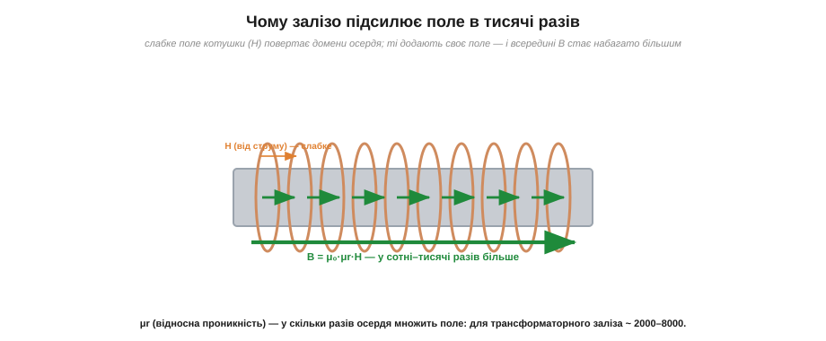
*Рис. 1.8.6.1. Чому залізо підсилює поле. Слабке поле H від струму котушки вишиковує домени осердя; вишикувані домени додають своє, набагато сильніше поле, і сумарне B = μ₀·μr·H виходить у сотні–тисячі разів більшим. Для трансформаторного заліза μr ≈ 2000–8000.*

Тобто осердя не «творить магнетизм із нічого» — воно **позичає** його у власних доменів, а котушка лише командує, куди їх повернути. Ось чому осердя обов'язково роблять із **феромагнетика** (там є домени) і саме з **м'якого** (§1.8.3) — щоб домени слухняно йшли за струмом і так само легко відпускались, коли струм зник.

Тут ховається пастка для початківця: μr — **не константа**. Її подають у даташитах одним числом (скажімо, «μr ≈ 4000»), але насправді проникність залежить від того, **наскільки осердя вже намагнічене**. Коли домени тільки починають вишиковуватися, проникність одна; коли більшість уже зорієнтована й до насичення близько — проникність падає; а в самому насиченні μr фактично сповзає до одиниці. Тому в інженерних розрахунках обережно говорять про «початкову проникність» (для слабких полів) і пам'ятають, що зі зростанням поля множник слабшає. Це прямо веде нас до головного обмеження осердя — насичення.

### Насичення: у заліза є стеля

А тепер — найважливіше обмеження. Доменів в осерді **скінченна кількість**. Доки є невишикувані домени, збільшення струму (а отже, H) вишиковує дедалі більше їх, і B росте круто. Та коли **всі** домени вже дивляться вздовж поля, додавати більше нікуди — настає **насичення** (*saturation*). Далі поле B майже перестає рости, хоч скільки нарощуй струм: внесок від доменів вичерпано, лишається тільки кволий приріст від самого струму (як у повітрі).

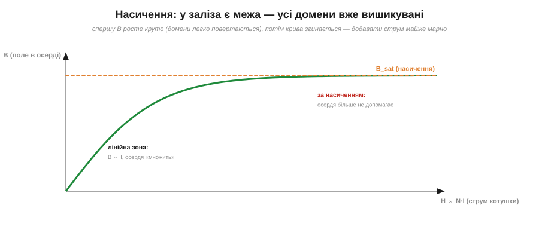
*Рис. 1.8.6.2. Крива намагнічування осердя. Спершу B росте круто (домени легко вишиковуються) — це лінійна, робоча зона, де осердя «множить» поле. Далі крива згинається й виходить на полицю B_sat: усі домени вишикувані, осердя більше не допомагає, і нарощувати струм майже марно. Тому котушки з осердям проєктують так, щоб працювати **нижче** насичення.*

Насичення — це жорстка фізична стеля, і її треба поважати. Якщо загнати осердя в насичення, далі воно поводиться, як **повітряне**: μr фактично падає до одиниці. Для електромагніта це означає, що сила перестає рости зі струмом (а обмотка тим часом дарма гріється); для трансформатора чи дроселя насичення взагалі катастрофічне — про це йтиметься у відповідних темах Модуля 2. Типове поле насичення для заліза — близько 1.5–2 Тл; вище нього осердя «здається».

### Гістерезис: осердя пам'ятає минуле

Є й друга особливість, тонша за насичення. Феромагнітне осердя **пам'ятає** своє магнітне минуле. Якщо повільно збільшувати струм від нуля, потім зменшувати назад до нуля, потім пускати в інший бік і знову повертати — крива B(H) не йде назад тим самим шляхом, яким прийшла. Вона описує **петлю**. Це явище називають **гістерезисом** (*hysteresis*, від грецького «відставання»).

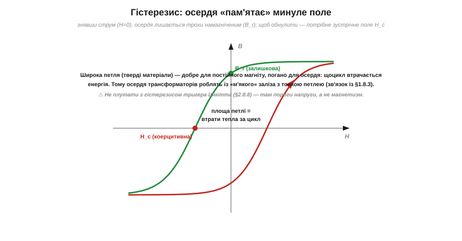
*Рис. 1.8.6.3. Петля гістерезису B(H). Знявши струм (H = 0), осердя лишається трохи намагніченим — це **залишкова індукція** B_r. Щоб обнулити поле, потрібне зустрічне поле — **коерцитивна сила** H_c. Уся петля — це «відставання» B від H. **Площа петлі дорівнює енергії, що втрачається теплом за один цикл** перемагнічування.*

Петля одразу пояснює дві речі, на які ми посилались раніше. По-перше, **залишкова індукція** B_r (поле, що лишилось при H = 0) — це і є те, завдяки чому існують постійні магніти (§1.8.3): тверді матеріали мають велику B_r і не відпускають домени. По-друге, **коерцитивна сила** H_c — це зустрічне поле, потрібне, щоб домени перевернути назад; у твердих матеріалів вона велика (тому й важко розмагнітити), у м'яких — крихітна.

А головне практичне — **площа петлі**. Щоразу, перемагнічуючи осердя туди-сюди, ми «протягуємо» його по петлі, і енергія, що дорівнює площі цієї петлі, перетворюється на **тепло**. Це **втрати на гістерезис** (*hysteresis loss*). Фізично це плата за те, що доменні стінки чіпляються за дефекти кристала: щоб зрушити їх, доводиться долати «тертя», а воно гріє матеріал. Для постійного магніту ці втрати неважливі (його не перемагнічують), а от для осердя, яке щосекунди перемагнічується десятки чи тисячі разів (трансформатор, дросель на змінному струмі), кожен цикл — це згаяна енергія. І що **частіше** перемагнічування, то більше циклів за секунду — тож втрати на гістерезис ростуть прямо пропорційно до частоти. Ось чому на високих частотах вибір матеріалу осердя стає критичним: осердя для таких застосувань роблять із м'яких матеріалів із **тонкою** петлею — чим вона вужча, тим менша площа й тим менші втрати щоцикла. (Поряд із гістерезисом на змінному струмі є й другий механізм втрат — вихрові струми, але про них доречніше в §1.8.10, де ми взагалі розберемо індукцію.)

> 🧮 **Математична вставка:** [петля B–H кількісно — площа петлі = втрати за цикл](r08-s6-m-hysteresis-loop.md) — як із форми петлі порахувати, скільки енергії осердя перетворює на тепло щоцикла.

> 🔌 **Компонентна вставка:** [осердя дроселів і трансформаторів — фізика феритів](r08-s6-c-ferrites.md) — чому на високих частотах беруть феритові осердя, а не залізні.

> ⚠️ **Не плутати:** гістерезис **магнітного осердя** — це зовсім інше явище, ніж гістерезис **тригера Шмітта** (§2.8.8). Спільне в них лише слово й сама ідея «відставання/пам'яті про минуле»: тригер Шмітта має два різні **пороги напруги** для перемикання вгору й униз, і це чиста електроніка без жодного магнетизму. Магнітний гістерезис — про поле B та поле H у залізі. Однакова назва, різна фізика.

### Магнітне екранування: лінії затягуються в залізо

Тепер можна повернути борг із §1.8.1 і пояснити, як **екранують** магнітне поле, якщо вже клітка Фарадея для нього не годиться. Хитрість — у високій проникності. Якщо помістити чутливий вузол усередину оболонки з матеріалу з величезною μr (спеціальні сплави на кшталт пермалою), то магнітні лінії, дійшовши до оболонки, «віддадуть перевагу» шляху крізь неї — адже в матеріалі з високою проникністю магнітний опір малий (згадаймо аналогію з §1.8.5), і полю «легше» текти там, ніж крізь порожнину. Лінії немовби **затягуються** в товщу оболонки й обходять захищений простір стороною. Усередині лишається лише жалюгідний залишок поля. Це не знищення поля (його не можна знищити — лінії замкнені), а **перенаправлення** його в обхід. Так екранують головки приладів, чутливі давачі, електронні мікроскопи від зовнішніх магнітних завад.

> 🔧 **Навіщо це.** Розуміння насичення й гістерезису — це різниця між робочим і згорілим пристроєм. Проєктуючи електромагніт чи дросель, інженер навмисно тримається **нижче** B_sat (інакше струм росте, а сила — ні, і котушка гріється намарно). Вибираючи осердя для змінного струму, він бере м'який матеріал із вузькою петлею, щоб не втрачати енергію на гістерезис щоцикла. А магнітне екранування, як ми щойно бачили, працює саме на високій μr: лінії поля «затягуються» в товщу матеріалу з великою проникністю, лишаючи захищений простір усередині майже без поля.

**Приклад (чому осердя не дає нескінченно сильного поля).** Котушка з прикладу §1.8.5 (≈ 400 витків, ℓ = 5 см) із залізним осердям μr ≈ 1000 при I = 0.5 А «обіцяє» поле:

```
B = μ₀ · μr · N · I / ℓ
B = 1.257×10⁻⁶ · 1000 · 400 · 0.5 / 0.05
B = 1.257×10⁻⁶ · 1000 · 200 / 0.05
B ≈ 5.0 Тл  (формальний розрахунок)

але B_sat заліза ≈ 1.5–2 Тл
   → реально осердя НАСИЧУЄТЬСЯ задовго до 5 Тл
   → справжнє поле «впреться» в ~1.5–2 Тл, а далі майже не росте
```

Формула чесно дає 5 Тл, але фізика ставить стелю: осердя насичується близько 1.5–2 Тл, і подальше нарощування струму поле вже майже не збільшує. Це показує, чому формулу B = μ₀·μr·H можна застосовувати **лише в лінійній зоні**, нижче насичення, — і чому μr насправді не стала, а сама залежить від того, наскільки осердя вже намагнічене.

**Приклад (скільки тепла «з'їдає» гістерезис за секунду).** Осердя об'ємом V = 10 см³ перемагнічується на частоті f = 50 Гц. Нехай енергія, що втрачається за один цикл на одиницю об'єму (площа петлі), становить w = 300 Дж/м³ (типовий порядок для звичайного трансформаторного заліза). Яка потужність втрат на гістерезис?

```
енергія за цикл у всьому осерді: W = w · V = 300 Дж/м³ · 10×10⁻⁶ м³ = 3×10⁻³ Дж
циклів за секунду: f = 50
потужність втрат: P = W · f = 3×10⁻³ Дж · 50 1/с = 0.15 Вт
```

Лише 0.15 вата — здавалося б, дрібниця. Але два уточнення міняють картину. По-перше, ці ватти виділяються **постійно**, гріючи осердя, тож у великому трансформаторі (де об'єм у тисячі разів більший) втрати на гістерезис стають уже десятками ватів марного тепла. По-друге, вони ростуть **із частотою**: на 50 кГц замість 50 Гц той самий цикл повторюється в тисячу разів частіше, і втрати підскочили б у тисячу разів — ось чому на високих частотах звичайне залізо не годиться й переходять на ферити з дуже вузькою петлею. Цей приклад показує, чому площа петлі — не абстракція, а прямі ватти, що їх інженер мусить рахувати.

---

## 1.8.7 Сила Ампера: поле штовхає провідник зі струмом

Дослід Ерстеда (§1.8.4) показав, що струм **діє** на магнітну стрілку. Але якщо струм діє на магніт, то — за третім законом Ньютона — і магніт мусить діяти на струм. І справді: помістіть провідник зі струмом у магнітне поле — і поле штовхне цей провідник з цілком відчутною силою. Це **сила Ампера** (*Ampère force*, або сила Лапласа), і саме вона перетворює електрику на механічний рух. Без неї не було б жодного електродвигуна, жодного гучномовця, жодного стрілочного приладу. Розберімо її від першопричин — і ця тема стане фізичним фундаментом усіх майбутніх моторів.

### Чому поле штовхає струм

Інтуїцію дає вже знайома картина. Провідник зі струмом оточений власними кільцями поля (§1.8.4). Тепер накладемо на нього **зовнішнє** однорідне поле. З одного боку дроту власні кільця спрямовані **за** зовнішнім полем — там лінії згущуються, поле підсилюється. З протилежного боку власне поле спрямоване **проти** зовнішнього — там лінії розріджуються, поле слабшає. Виходить асиметрія: з одного боку дроту поле «густе», з іншого «рідке». А магнітні лінії, наче напнуті гумки, прагнуть випрямитись і розштовхнутись — тож вони **виштовхують** дріт із густого боку в рідкий. Дріт зазнає сили вбік.

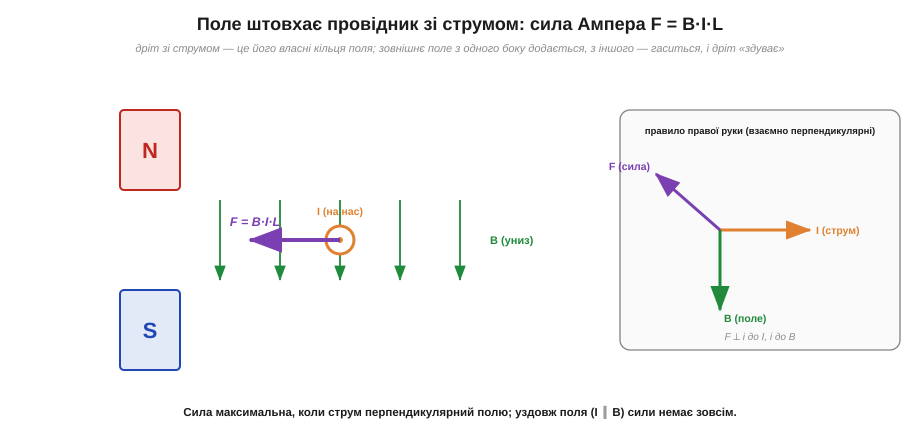
*Рис. 1.8.7.1. Провідник зі струмом у зовнішньому полі зазнає сили. З одного боку власне поле дроту додається до зовнішнього (густо), з іншого — гаситься (рідко); ця асиметрія «здуває» дріт убік. Сила F перпендикулярна і до струму I, і до поля B; її напрям дає правило правої руки (праворуч).*

Цей самий ефект можна (і строгіше) пояснити через силу, що діє на кожен рухомий заряд у дроті, — **силу Лоренца**, до якої ми повернемося в наступній темі. Але образ «густих і рідких ліній, що виштовхують дріт» дуже наочний і добре працює.

Найкрасивіший окремий випадок — **два паралельні дроти зі струмом**. Кожен дріт оточений своїми кільцями поля (§1.8.4), і кожен опиняється в полі сусіда. Якщо струми течуть в **один** бік, дроти **притягуються**; якщо в **протилежні** — **відштовхуються**. (Зверніть увагу на красиву протилежність до зарядів: однакові заряди відштовхуються, а однаково напрямлені струми — притягуються.) Цей ефект настільки фундаментальний, що тривалий час саме через нього **означували ампер**: один ампер — це такий струм, що, течучи у двох паралельних дротах за метр один від одного, створює між ними силу 2 × 10⁻⁷ Н на кожен метр довжини. Тобто базова одиниця струму всього курсу історично спиралася саме на силу Ампера між дротами. Це й нагадування, наскільки глибоко магнетизм вшитий в основи електрики.

### Формула: F = B·I·L

Скільки ж сили? Експеримент дає просту відповідь. Сила тим більша, чим сильніше поле B, чим більший струм I і чим довший шматок дроту L перебуває в полі:

```
F = B · I · L          (коли струм перпендикулярний полю)
```

де **F** — сила (Н), **B** — індукція поля (Тл), **I** — струм (А), **L** — довжина провідника в полі (м). Формула гранично проста, і кожен множник інтуїтивний: більше поле — сильніше штовхає; більший струм — більше рухомих зарядів, на кожен діє сила; довший дріт — більше таких зарядів у полі. Власне, з цієї формули й означують саму одиницю поля: 1 тесла — це таке поле, що діє силою 1 ньютон на провідник завдовжки 1 метр зі струмом 1 ампер.

### Напрям сили й роль кута

Сила Ампера має дивовижну властивість: вона спрямована **не вздовж струму й не вздовж поля, а перпендикулярно їм обом**. Це знову задача для правої руки (одна з кількох її версій):

> Витягніть пальці правої руки за напрямом струму I, зігніть так, щоб вони повертали до поля B; тоді **відставлений великий палець** покаже напрям сили F. (Рівнозначно: F спрямована «вбік» від площини, у якій лежать I та B.)

А що, як струм **не** перпендикулярний полю? Тоді працює лише та складова поля, що поперек струму, і сила слабшає за синусом кута:

```
F = B · I · L · sinθ        (θ — кут між струмом і полем)
```

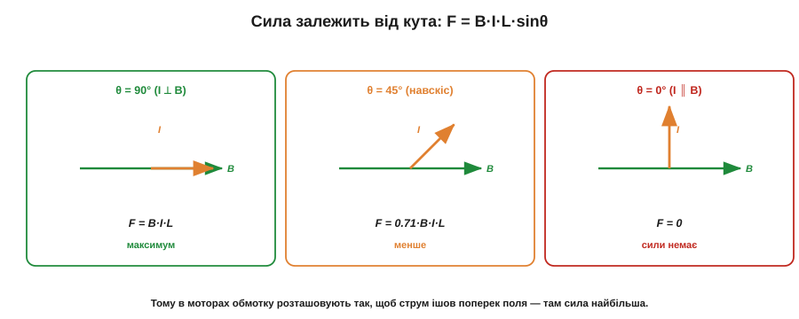
*Рис. 1.8.7.2. Залежність сили від кута θ між струмом і полем. При θ = 90° (струм поперек поля) сила максимальна: F = B·I·L. При θ = 45° вона менша (множник sin45° ≈ 0.71). При θ = 0° (струм уздовж поля) сила **дорівнює нулю** — поле не діє на струм, що тече вздовж нього. Тому в моторах обмотку завжди ставлять так, щоб струм ішов поперек поля.*

Крайній випадок варто запам'ятати: **уздовж поля сили немає взагалі**. Струм, що тече паралельно B, поле не штовхає. Максимальна ж сила — коли струм строго поперек поля. Звідси пряме конструктивне правило: щоб дістати найбільшу силу (а отже, найпотужніший мотор), струм у робочих провідниках пускають **перпендикулярно** магнітному полю.

Чому ж саме поперечна складова працює, а поздовжня — ні? Згадаймо механізм. Сила народжується з того, що власні кільця поля дроту накладаються на зовнішнє поле асиметрично. Якщо струм тече **впоперек** B, кільця дроту орієнтовані так, що з одного боку чітко додаються до зовнішнього поля, а з іншого гасяться — асиметрія максимальна, виштовхування найсильніше. Якщо ж струм тече **вздовж** B, кільця дроту лежать у площині, перпендикулярній полю, і додаються до нього симетрично з усіх боків — асиметрії немає, виштовхувати нікуди. Тому поздовжній струм поле «не помічає». Цей самий висновок строго випливає з векторного добутку (вставка нижче), але інтуїція з кільцями дає його без жодної формули.

> 🧮 **Математична вставка:** [векторний добуток — математика правил правої й лівої руки](r08-s7-m-cross-product.md) — як одна операція F = I·L × B заміняє всі «правила руки» й автоматично дає і величину sinθ, і напрям.

### Від сили — до обертання: зародок мотора

Тепер найкрасивіше. Візьмемо не прямий дріт, а **рамку** (виток) зі струмом і помістимо її в поле. Дві протилежні сторони рамки несуть струм у **протилежних** напрямах. Отже, на одну сторону сила Ампера діє в один бік, а на протилежну — у другий. Дві рівні протилежно спрямовані сили, прикладені до різних боків рамки, утворюють **пару сил**, яка не зрушує рамку з місця, а **крутить** її.

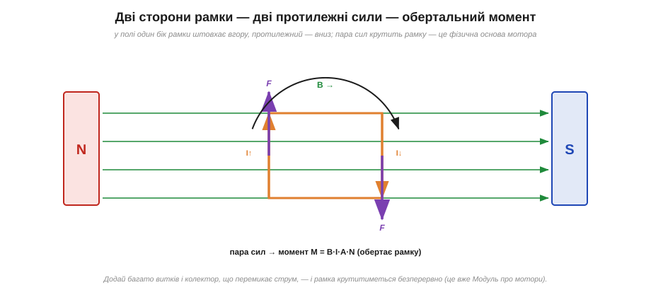
*Рис. 1.8.7.3. Рамка зі струмом у полі. На лівій і правій сторонах струм тече в протилежні боки, тож сили Ампера на них протилежні — виникає пара сил, що створює обертальний момент M = B·I·A·N (A — площа рамки, N — кількість витків). Це фізична основа електродвигуна: лишається додати багато витків і пристрій, що вчасно перемикає напрям струму.*

Ось вона — серцевина будь-якого електромотора. Рамка зі струмом у магнітному полі прагне **повернутися**. Чому ж потрібне перемикання струму? Бо рамка, повернувшись до положення, де її площина перпендикулярна полю, опиняється в **рівновазі**: пара сил тут уже не крутить, а лише розтягує рамку, і вона зупиняється. Щоб обертання тривало, треба саме в цю мить **змінити напрям струму** в рамці — тоді сили перекинуться, і рамка знову матиме момент, що жене її далі. Якщо додати багато витків (більше N — більший момент) і пристрій, що вчасно перемикає струм, — дістанемо двигун, що крутиться безперервно. Деталі цього перемикання (колектор у щіткових моторах, електронна комутація в безщіткових) належать спеціальному модулю про мотори, тож тут ми не забігаємо вперед — нам важлива сама фізика: **поле + струм у рамці = обертальний момент**, а перемикання струму лише підтримує цей момент у потрібному напрямі.

> 🔧 **Навіщо це.** Сила Ампера — це фізичний двигун (буквально) усієї рухомої електроніки. Електромотори дрона, серводвигуни, вібромоторчик у телефоні, привід дисковода, котушка гучномовця, що штовхає дифузор у такт музиці, стрілка аналогового приладу, що відхиляється пропорційно струму, — усе це сила Ампера в дії. Розуміючи F = B·I·L, інженер відразу бачить, **від чого залежить тяга** мотора чи гучність динаміка (сильніший магніт, більший струм, більше витків) — і де межа, за якою обмотка просто перегріється.

**Приклад (сила на провіднику в полі магніту).** Прямий провідник завдовжки L = 4 см зі струмом I = 2 А лежить поперек поля B = 0.3 Тл (поле феритового магніту). Яка сила діє на нього?

```
струм перпендикулярний полю → sinθ = 1
F = B · I · L
F = 0.3 Тл · 2 А · 0.04 м
F = 0.024 Н   (≈ 2.4 грама-сили)
```

Сила скромна — близько ваги двох грамів. Але в реальному моторі чи гучномовці провідник згорнуто в котушку із сотень витків, тож сили складаються в сотні разів, а поле беруть сильніше (неодим, добре сфокусоване осердям) — і сумарна тяга стає цілком відчутною. Цей приклад показує, чому одиночний дріт «майже нічого не може», а котушка з багатьох витків у сильному полі рухає механізми.

### Два прямі застосування: гучномовець і стрілочний прилад

Перш ніж рухатись далі, варто побачити силу Ампера у двох простих пристроях, що не потребують жодного обертання, — там вона працює найнаочніше.

**Гучномовець.** До легкого паперового дифузора прикріплено котушку (звукову котушку), що сидить у вузькому кільцевому зазорі сильного постійного магніту. Через котушку пускають **звуковий** струм — змінний струм, форма якого повторює звукову хвилю. За формулою F = B·I·L сила на котушці миттєво слідує за струмом: струм більший — сила більша, струм змінив знак — сила штовхнула в інший бік. Котушка з дифузором коливається точно в такт струму, штовхає повітря — і ми чуємо звук. Гучномовець — це майже буквальне втілення сили Ампера: електричний сигнал → сила → рух повітря.

**Стрілочний прилад.** В аналоговому амперметрі чи вольтметрі (механізм Вестона, §1.6) котушка на осі сидить у полі постійного магніту й утримується спіральною пружинкою. Пропустиш струм — сила Ампера створює момент, що повертає котушку зі стрілкою; пружинка протидіє, і стрілка зупиняється під кутом, **пропорційним струму**. Так невидимий струм стає видимим відхиленням стрілки. Це теж чиста сила Ампера, тільки зрівноважена пружиною замість безперервного обертання.

**Приклад (тяга котушки мотора зі ста витків).** Та сама геометрія, що й вище (L = 4 см, B = 0.3 Тл), але тепер це котушка з N = 100 витків при струмі I = 1 А. Яка сумарна сила на одній стороні котушки?

```
кожен виток несе струм I у полі → сила на N витках складається
F = B · I · L · N
F = 0.3 Тл · 1 А · 0.04 м · 100
F = 1.2 Н   (≈ 120 грамів-сили)
```

Зі скромних двох грамів на одному дроті ми піднялися до 120 грамів-сили на стороні котушки — у сто разів, рівно як і число витків. А в моторі таких сторін дві (пара сил), поле часто сильніше за феритове, та й витків буває більше. Звідси ясно, як із кволого F = B·I·L одного провідника народжується відчутна механічна потужність реальних двигунів: усе вирішує множення на витки й добрий магнітний потік.

---

## 1.8.8 Ефект Холла: поле відхиляє носії в провіднику

У темі про силу Ампера ми дивилися на провідник **ззовні**: поле штовхає дріт як ціле. А що відбувається **всередині**, з кожним окремим рухомим зарядом? Виявляється, поле діє не на «дріт узагалі», а на кожен носій заряду персонально, відхиляючи його вбік. Це призводить до тонкого, але надзвичайно корисного явища — **ефекту Холла**. На ньому стоять цілі класи давачів, що їх ми зустрінемо в Модулі 5: безконтактні вимикачі, давачі положення й кута, вимірювачі струму. Тож розберімо його уважно — це фізична основа того, як електроніка «відчуває» магнітне поле.

### Сила Лоренца: поле відхиляє рухомий заряд

Спершу — глибша причина сили Ампера. Магнітне поле діє з силою на **будь-який рухомий заряд**: це **сила Лоренца** (*Lorentz force*). Її дві ключові риси такі самі, як у сили Ампера (бо це по суті те саме, лише на рівні одного заряду): сила перпендикулярна і до швидкості заряду, і до поля, а величина пропорційна заряду q, швидкості v та полю B:

```
F = q · v · B        (коли швидкість перпендикулярна полю)
```

Нерухомий заряд (v = 0) поле не відчуває зовсім — магнетизм діє **лише на рух**. А оскільки струм у дроті — це і є рух зарядів (§1.2.1), то сила Ампера на весь дріт є просто сумою сил Лоренца на всі його рухомі заряди. Сила Ампера й сила Лоренца — одне явище у двох масштабах.

Варто наголосити на двох рисах сили Лоренца, бо саме вони породжують ефект Холла. Перша: сила перпендикулярна швидкості — а отже, вона **не прискорює** заряд уздовж руху й не виконує над ним роботи, лише **скривлює** його траєкторію вбік. Магнітне поле не може ні розігнати, ні загальмувати вільний заряд — воно тільки повертає його. Друга: напрям повороту залежить від **знаку** заряду — додатні й від'ємні носії за тих самих v і B відхиляються в **протилежні** боки. Обидві риси ми зараз побачимо в дії.

### Як виникає напруга Холла

Тепер простежмо, що ця сила робить усередині провідника. Пустимо струм уздовж плоскої пластинки й накладемо поле B перпендикулярно до неї (на нас із площини). Носії заряду дрейфують уздовж пластинки зі швидкістю v (це дрейфова швидкість із §1.2.3) — а поле, за силою Лоренца, відхиляє їх **убік**, до одного краю. Носії починають **накопичуватись** біля цього краю, заряджаючи його; протилежний край лишається з нестачею носіїв і заряджається протилежно. Між боками пластинки виникає **поперечна напруга** — її й називають **напругою Холла** (*Hall voltage*, U_H).

Зверніть увагу на витончену рівновагу, що тут установлюється, — вона того ж роду, що й рівновага в багатьох фізичних системах. Спершу сила Лоренца жене носії вбік нічим не стримувано. Але щойно на краю зібрався заряд, він створює **поперечне електричне поле**, спрямоване проти подальшого накопичення — і це поле тисне на наступні носії електричною силою (§1.1.3). Накопичення триває рівно доти, доки електрична сила не **зрівноважить** магнітну. У точці рівноваги нові носії вже не зносить убік — вони течуть прямо вздовж пластинки, а на краях стоїть стала напруга. Це самовстановлювана рівновага: система сама знаходить той заряд на краях, за якого дві сили точно гасяться. Саме тому напруга Холла стабільна й відтворювана — на ній можна будувати точний давач.

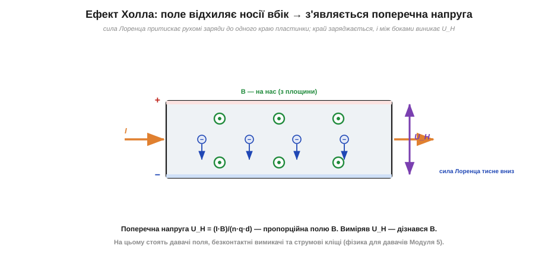
*Рис. 1.8.8.1. Ефект Холла. Струм I тече вздовж пластинки, поле B спрямоване на нас. Сила Лоренца притискає рухомі носії до одного краю — той заряджається, протилежний заряджається навпаки, і впоперек пластинки виникає напруга U_H = (I·B)/(n·q·d). Накопичення триває, поки електричне відштовхування не зрівноважить силу Лоренца, — і тоді U_H стабільна.*

Накопичення не безмежне: щойно на краях зібралося досить заряду, його власне електричне поле починає **відштовхувати** наступні носії назад. Коли це відштовхування точно врівноважує силу Лоренца, накопичення припиняється, і напруга Холла встановлюється на сталому значенні. Її величина:

```
U_H = (I · B) / (n · q · d)
```

де **n** — концентрація носіїв, **q** — заряд носія, **d** — товщина пластинки. Найважливіше в цій формулі: за сталих I, n, d напруга Холла **прямо пропорційна полю B**. Тобто, вимірявши U_H, ми міряємо магнітне поле. Це й робить ефект Холла основою давачів поля.

> 📜 **Історична вставка:** [Едвін Холл — ефект, відкритий за 18 років до електрона](r08-s8-history-hall.md) — як молодий аспірант 1879 року виявив поперечну напругу, ще не знаючи, що ж саме в металі рухається.

### Несподіваний бонус: знак напруги викриває носіїв

Ефект Холла подарував фізиці дещо більше за давач поля — він дав перший **прямий доказ**, які заряди несуть струм у провіднику. Адже куди саме накопичаться носії (а отже, який край стане плюсом, а який мінусом), залежить від **знаку** носіїв. Один і той самий струм можна уявити двояко: або від'ємні носії течуть в один бік, або (умовно) додатні — у протилежний. Сила Лоренца F = q·v·B залежить і від знаку заряду q, і від напряму швидкості v; а в цих двох випадках **обидва** множники протилежні. Здавалося б, два мінуси скасуються й носії підуть в один бік — але річ у тім, що до **одного** краю притискаються самі носії, а полюсом стає той край залежно від їхнього знаку. У підсумку плюс і мінус на краях пластинки міняються місцями: знак напруги Холла виходить **різним** для від'ємних і додатних носіїв (Рис. 1.8.8.2).

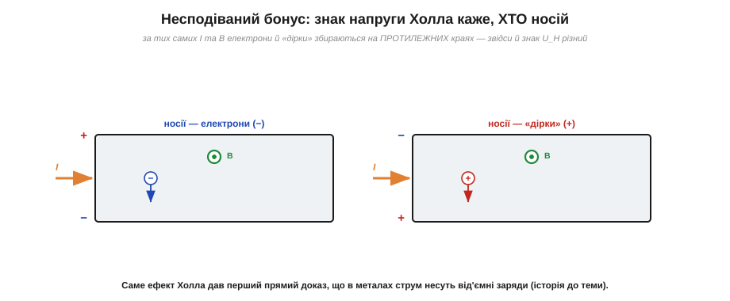
*Рис. 1.8.8.2. Знак U_H викриває тип носіїв. За тих самих напрямів I та B від'ємні носії (електрони) і додатні («дірки») накопичуються на **протилежних** краях пластинки — тож знак поперечної напруги в них різний. Саме так ефект Холла дав перший прямий доказ, що в металах струм несуть від'ємні заряди (підтвердивши §1.2.2).*

Це був разючий результат: ще до відкриття електрона ефект Холла показав, що в звичайних металах носії **від'ємні** — підтвердивши те, про що ми говорили в §1.2.2. А ще пізніше, у напівпровідниках, він виявив, що там струм можуть нести й ефективно **додатні** носії — «дірки». Так скромна поперечна напруга стала інструментом, що зазирає в саму природу провідності.

### Чому давачі роблять із напівпровідників

Формула U_H = (I·B)/(n·q·d) ховає важливий інженерний урок. Напруга Холла обернено пропорційна **концентрації носіїв** n. У металах носіїв надзвичайно багато (кожен атом віддає електрон-два у «море» — §1.2.3), тож n величезне, і поперечна напруга виходить мікроскопічною — мікровольти, які важко вловити. А в **напівпровідниках** носіїв на багато порядків менше, тому за того самого струму й поля U_H виходить у тисячі разів більшою — міллівольти, які легко підсилити. Ось чому, хоча Холл відкрив ефект на металах (і ледь-ледь його зловив), практичним давачем явище стало лише з приходом напівпровідників. Сучасний давач Холла — це тонка напівпровідникова пластинка (часто з арсеніду галію чи кремнію) разом із вбудованим підсилювачем просто на кристалі.

Друга тонкість — чутливість залежить і від **рухливості** носіїв (як швидко вони набирають дрейфову швидкість у полі). Що рухливіші носії, то сильніше їх відхиляє за того самого струму, і то більша U_H. Тому для найчутливіших давачів обирають матеріали з високою рухливістю. Це знову показує, що ефект Холла — місток між «чистою» фізикою провідності (§1.2) і прикладними давачами: ті самі величини n і рухливість, які описували опір матеріалу, тепер визначають, наскільки добре він «бачить» магнітне поле.

### Два режими: лінійний і пороговий

Давачі Холла працюють у двох типових режимах, і обидва корисно розрізняти. У **лінійному** давачі вихідна напруга прямо пропорційна полю — такий потрібен, щоб виміряти *скільки* поля (наприклад, який струм тече в дроті чи де саме стоїть магніт). У **пороговому** (ключовому) давачі на кристалі стоїть компаратор, що видає просто «є поле / немає поля»: магніт наблизився — на виході логічна одиниця, віддалився — нуль. Такий давач замінює механічний вимикач, але без жодних контактів, що іскрять і зношуються. На ньому стоять безконтактні кінцеві вимикачі, лічильники обертів, визначення «кришка відкрита/закрита» — усюди, де треба надійно й безконтактно відчути наближення магніту.

> 🔌 **Компонентна вставка:** [струмові кліщі — виміряти ампери, не розриваючи кола](r08-s8-c-clamp-meter.md) — як давач Холла в розімкненому осерді міряє струм у дроті безконтактно.

> 🔧 **Навіщо це.** Ефект Холла — це очі електроніки в магнітному світі. Давач Холла, піднесений до магніта, дає напругу, пропорційну полю, — і на цьому стоять: безконтактні вимикачі (магніт наблизився — схема спрацювала, без жодних контактів, що зношуються); давачі положення й кута (де магніт на валу, туди й «дивиться» давач); безщіткові мотори (контролер за полем ротора знає, коли перемикати обмотки); струмові кліщі й давачі струму (поле навколо дроту пропорційне струму — §1.8.4 — а Холл його міряє). Усі давачі поля в Модулі 5 спираються саме на цю фізику.

**Приклад (яка напруга Холла на типовому давачі).** Тонка напівпровідникова пластинка давача: товщина d = 0.1 мм, концентрація носіїв n = 2 × 10²¹ м⁻³, струм I = 5 мА, поле B = 0.1 Тл. Оцінимо U_H.

```
U_H = (I · B) / (n · q · d)
U_H = (5×10⁻³ А · 0.1 Тл) / (2×10²¹ м⁻³ · 1.6×10⁻¹⁹ Кл · 1×10⁻⁴ м)
U_H = (5×10⁻⁴) / (3.2×10⁻²)
U_H ≈ 0.0156 В ≈ 15.6 мВ
```

Близько 16 мілівольтів — невелика, але цілком вимірна напруга, яку легко підсилити. Зверніть увагу: у **металах** концентрація носіїв n у тисячі разів більша, тож напруга Холла там була б мікроскопічна (тому давачі роблять із **напівпровідників** — у них носіїв менше, а отже, U_H помітніша). Це пояснює, чому ефект Холла, відкритий на металах ледь-ледь, став практичним давачем лише з напівпровідниками.

**Приклад (як давач Холла міряє струм у дроті).** Згадаймо §1.8.4: навколо дроту зі струмом є поле B = μ₀·I/(2π·r). Поставмо давач Холла на відстані r = 5 мм від проводу, у якому тече I = 20 А. Яке поле «побачить» давач?

```
B = μ₀ · I / (2π · r)
B = (1.257×10⁻⁶ · 20) / (2π · 5×10⁻³)
B = (2.51×10⁻⁵) / (3.14×10⁻²)
B ≈ 8.0 × 10⁻⁴ Тл = 0.8 мТл
```

Давач Холла перетворить ці 0.8 мТл на пропорційну напругу, а схема перерахує її назад у струм 20 А — і все це **без розриву кола** й без жодного контакту з проводом. Саме так працюють струмові кліщі та безконтактні давачі струму: вони міряють магнітне поле навколо проводу (§1.8.4) ефектом Холла й за ним судять про струм. Часто провід ще й охоплюють розімкненим феритовим кільцем, щоб зібрати поле й підсилити сигнал. Це красивий приклад, як дві теми розділу — «струм творить поле» (§1.8.4) і «поле відхиляє носії» (ця тема) — разом дають практичний прилад.

---

## 1.8.9 Магнітне поле Землі й компас

Ми не раз згадували поле Землі — то як орієнтир сили (десятки мікротесла, §1.8.1), то як те, що перебиває магніт біля компаса. Настав час подивитися на нього прямо. Компас — найдавніший магнітний прилад людства, що тисячоліттями водив кораблі, — і водночас джерело тонкої плутанини в назвах полюсів, яку ми відкладали з §1.8.1. А ще компас — це готовий урок про те, чому слабке поле так легко збити чужим, що прямо стосується кожного, хто користується електронним компасом у дроні чи телефоні.

### Земля — це великий магніт

Найголовніший факт: **сама Земля поводиться як величезний штабовий магніт**. Глибоко в надрах, у рідкому залізному ядрі, течуть колосальні струми (це так зване **геодинамо**), і вони, за вже знайомим нам правилом «струм народжує поле» (§1.8.4), створюють магнітне поле, що пронизує всю планету й тягнеться далеко в космос. Зовні це поле має такий самий вигляд, як поле штабового магніту з §1.8.1: лінії виходять з одного полюса, огинають планету й входять в інший.

Саме це поле й повертає стрілку компаса. Стрілка — маленький магніт на вільній осі; вона встановлюється вздовж місцевої лінії поля Землі, і її північний кінець показує приблизно на географічну північ. Тисячі років цього було досить, щоб знаходити дорогу.

Походження поля Землі — окрема дивовижна історія, і вона прямо спирається на §1.8.4. Земля не є постійним магнітом: у її надрах надто гаряче, далеко вище за температуру Кюрі будь-якого матеріалу (§1.8.3), тож жодне залізо там не втримало б намагніченості. Поле породжують **струми** — потоки розплавленого заліза в зовнішньому ядрі, що рухаються через теплову конвекцію й обертання планети. Ці гігантські струми за правилом «рух заряду творить поле» і дають магнітне поле всієї Землі. Механізм самопідтримки таких струмів називають **геодинамо** (*geodynamo*). Він пояснює й те, чому поле Землі не вічне й не сталене: воно повільно дрейфує, слабшає й підсилюється, а за геологічні епохи навіть **перемикає полюси** місцями (магнітні інверсії, сліди яких знайшли в намагніченості давніх порід). Для нас, утім, на людському віку поле можна вважати майже сталим — і саме на цю майже-сталість спирається компас.

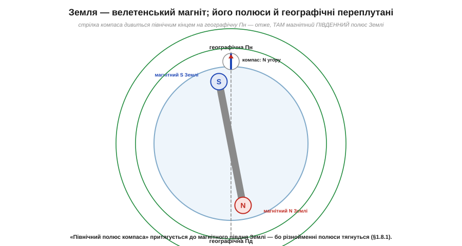
*Рис. 1.8.9.1. Земля як магнітний диполь. Глибинні струми в ядрі створюють поле, схоже на поле штабового магніту, нахиленого приблизно на 11° до осі обертання. Стрілка компаса встановлюється вздовж ліній цього поля; її північний кінець показує на географічну північ.*

### Плутанина полюсів: північ компаса тягнеться до магнітного півдня Землі

А тепер — та сама обіцяна тонкість, і вона спершу збиває з пантелику. Ми домовились (§1.8.1), що **різнойменні** полюси притягуються. Північний кінець стрілки компаса дивиться на географічну північ — отже, його **притягує** те, що лежить на півночі. Але притягувати північний полюс стрілки може лише **південний** полюс. Виходить парадокс: **там, де в Землі географічна північ, насправді міститься магнітний південний полюс**.

Це не помилка, а наслідок історичних назв. Полюси магнітної стрілки назвали за тим, **куди вони показують** (північний кінець — той, що дивиться на північ), ще задовго до того, як зрозуміли механізм притягання. Якби називали логічно, довелося б перейменувати або полюси стрілки, або полюси Землі. Тому фізики говорять акуратно: **«північний геомагнітний полюс»** (той, що біля географічної півночі) є насправді **південним** полюсом земного магніту-диполя. У побуті ж просто пам'ятають факт: північний кінець компаса показує на північ — і цього досить для навігації.

> 🔧 **Навіщо це.** Ця плутанина — не просто курйоз. Коли в даташиті давача Холла чи в описі магніта пишуть «N-pole» / «S-pole», треба чітко розуміти, який полюс що притягує. Складаючи магнітну защіпку, тримач чи систему позиціювання, інженер орієнтується саме на правило різнойменних полюсів — і знання, що «північ компаса = південь джерела поля», рятує від помилок зі зборкою «навпаки».

### Магнітне схилення: стрілка показує не зовсім туди

Друга практична деталь: магнітні полюси Землі **не збігаються** з географічними (тими, через які проходить вісь обертання). Магнітний диполь нахилений до осі приблизно на 11°, а самі магнітні полюси ще й повільно **дрейфують** рік у рік. Тому стрілка компаса показує на **магнітну** північ, яка в більшості місць планети трохи відхилена від справжньої, географічної. Цей кут між напрямом на магнітну й на географічну північ називають **магнітним схиленням** (*magnetic declination*).

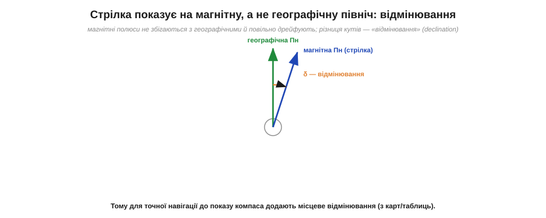
*Рис. 1.8.9.2. Стрілка показує на магнітну північ, що відхилена від географічної на кут δ — магнітне схилення. Воно різне в різних точках Землі й повільно змінюється з часом, тож для точної навігації його беруть із карт чи таблиць і додають до показу компаса.*

Для прогулянки схиленням можна знехтувати, а от для точної навігації — ні: на великих відстанях кут у кілька градусів дає помітну похибку курсу. Тому в авіації, морській справі й точній геодезії показ компаса завжди **виправляють** на місцеве схилення. Електронні навігаційні системи роблять це автоматично, маючи в пам'яті карту схилень.

Є й третій, менш відомий кут. Поле Землі не лежить горизонтально — воно ще й **пірнає в землю** під кутом, що зветься **магнітним нахилом** (*inclination*, або нахиленням). Біля екватора лінії поля майже горизонтальні, а ближче до полюсів вони дедалі крутіше йдуть униз, поки над самим магнітним полюсом не стають прямовисними. Тому проста горизонтальна стрілка компаса поблизу полюса працює погано — її «тягне» вниз. Це не абстракція: електронний магнітометр міряє **всі три** складові поля (північ, схід і вертикаль), і саме вертикальна складова дозволяє прошивці відрізнити справжній напрям від нахилу. Для інженера, що ставить такий давач, це означає: компенсувати треба не лише силу місцевих завад, а й нахил поля Землі — інакше курс «попливе» при крені апарата.

### Чому компас бреше біля проводів і заліза

І нарешті — пряме продовження всього розділу. Поле Землі **дуже слабке** (десятки мікротесла). А ми знаємо, що сильніше поле легко перебиває слабше. Тож будь-яке **місцеве** магнітне поле поряд зі стрілкою — поле проводу зі струмом (§1.8.4) чи намагніченого шматка заліза (§1.8.2) — може виявитися сильнішим за земне й **перетягнути** стрілку на себе. Компас почне показувати не на північ, а вздовж місцевого поля.

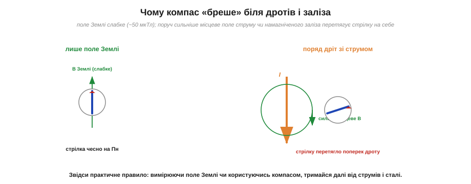
*Рис. 1.8.9.3. Чому компас «бреше». Ліворуч у чистому полі Землі стрілка чесно показує на північ. Праворуч поряд із дротом зі струмом виникає сильніше місцеве поле (його концентричні кільця — §1.8.4), і воно перетягує стрілку поперек дроту — як у самому досліді Ерстеда. Те саме роблять намагнічені сталеві деталі поблизу.*

Це рівно той ефект, який бачив Ерстед: дріт зі струмом повертає стрілку (§1.8.4). Лише тепер ми дивимося на нього з іншого боку — як на **заваду** для компаса. Звідси практичне правило: користуючись магнітним компасом чи вимірюючи поле Землі, тримайся подалі від струмів, моторів, динаміків і сталевих мас.

### Два роди завад: тверда й м'яка

Завади для компаса корисно поділити на два роди — це поділ прямо успадковує §1.8.3. **Тверда** завада (*hard-iron*) — це стале власне поле від намагнічених деталей (постійних магнітів, намагніченого сталевого корпусу) або від постійних струмів. Воно завжди додає той самий вектор до поля Землі, тож компас стабільно «зміщений» в один бік. Таку заваду компенсувати найлегше: достатньо один раз виміряти зсув і відняти його. **М'яка** завада (*soft-iron*) складніша — це спотворення, яке вносять феромагнітні маси поряд (вони викривляють самі лінії поля Землі залежно від орієнтації апарата). Її компенсація потребує складнішого калібрування з поворотами апарата в різні боки. Електронні компаси в дронах і телефонах борються з обома: процедура «помахати вісімкою» перед калібруванням — це якраз збір даних, щоб прошивка обчислила й тверду, і м'яку поправки.

### Як влаштований сам компас

Варто на мить зупинитися й на самому приладі, бо він навдивовижу давній. Класичний магнітний компас — це легка намагнічена стрілка на майже безтертьовій голчастій опорі (часто у в'язкій рідині, що гасить коливання). Стрілку роблять із **твердого** магнітного матеріалу (§1.8.3), щоб вона тримала власну намагніченість і не розмагнічувалась від трясіння. Найперші ж компаси, відомі ще в стародавньому Китаї, використовували природний намагнічений мінерал — **магнетит**, або «магнітний камінь» (*lodestone*), шматочки якого самі собою намагнічені земним полем за геологічні часи. Те, що такий камінь, підвішений на нитці, завжди повертається в той самий бік, тисячоліттями здавалося майже магічним — поки фізика не пояснила це через поле Землі. Цій довгій історії — від магнітного каменю до наукового розуміння — присвячена історія розділу.

> 🔧 **Навіщо це.** Поділ на тверду й м'яку заваду — це прямо те, що інженер закладає в прошивку магнітометра. Тверда поправка зберігається як сталий вектор зсуву; м'яка — як матриця, що виправляє викривлення. Без обох курс апарата «гуляє»: дрон думає, що летить на північ, а насправді його зносить, бо поряд стоїть силовий дріт чи сталевий гвинт. Тому грамотне розміщення давача (подалі від моторів і струмів) плюс правильне калібрування — обов'язкові кроки, що прямо випливають із фізики цієї теми.

> 🔧 **Навіщо це.** Це прямий клопіт кожного, хто ставить електронний компас (магнітометр) на рухомий апарат. На платі поряд течуть струми, стоять сталеві гвинти, гудуть мотори — і всі вони створюють місцеві поля, що в рази сильніші за земні 50 мкТл, які давач намагається зміряти. Тому магнітометр виносять якнайдалі від силових проводів і моторів (часто на окремій щоглі), а перед польотом обов'язково **калібрують**: апарат повертають у різні боки, і прошивка вчиться віднімати стале місцеве поле корпусу, лишаючи чисте поле Землі. Без цього показ курсу «попливе», і апарат полетить не туди.

**Приклад (на якій відстані поле дроту зрівняється з полем Землі).** Прямий провід зі струмом I = 10 А. Поле прямого дроту спадає як B = μ₀·I/(2π·r). На якій відстані r воно дорівнюватиме земним 50 мкТл?

```
B = μ₀ · I / (2π · r)   →   r = μ₀ · I / (2π · B)

r = (1.257×10⁻⁶ · 10) / (2π · 50×10⁻⁶)
r = (1.257×10⁻⁵) / (3.14×10⁻⁴)
r ≈ 0.04 м = 4 см
```

Уже на відстані 4 см від дроту зі струмом 10 А його поле дорівнює земному, а **ближче** — переважає його. Тобто компас (чи магнітометр), піднесений на пару сантиметрів до силового проводу, показуватиме переважно поле цього проводу, а не Землі. Ось чому навіть невеликі струми поряд з давачем поля — серйозна проблема, і чому розводка плати з магнітометром потребує особливої уваги.

---

## 1.8.10 Електромагнітна індукція: закон Фарадея, правило Ленца, вихрові струми

Ми пройшли довгий шлях і встановили глибоку істину: **струм народжує магнітне поле** (§1.8.4). Електрика творить магнетизм. Але природа рідко буває однобокою, і протягом 1820-х років фізиків мучило симетричне питання: якщо струм робить поле, то чи не може **поле зробити струм**? Чи можна, маючи магніт, видобути з дроту електрику? Десять років спроб давали нуль — нерухомий магніт, хоч який сильний, не наводив у сусідньому дроті ані найменшого струму. Розгадку знайшов 1831 року Майкл Фарадей, і вона виявилася настільки глибокою, що на ній стоїть уся світова електроенергетика. Цією темою ми замикаємо розділ — і коло електромагнетизму.

### Відкриття Фарадея: важлива зміна, а не саме поле

Ключ, який десять років не давався в руки, був ось у чому: струм наводить не саме поле, а його **зміна**. Нерухомий магніт біля котушки не дає нічого. Але **рухомий** магніт — дає. Фарадей узяв котушку, під'єднав до неї гальванометр (чутливий вимірювач струму) і почав **рухати** крізь неї магніт. Поки магніт рухався — стрілка гальванометра відхилялася, у колі тік струм. Магніт зупинявся — струм миттю зникав, хоч поле магніту нікуди не ділося. Висмикував магніт назад — струм з'являвся знову, але **в інший бік**.

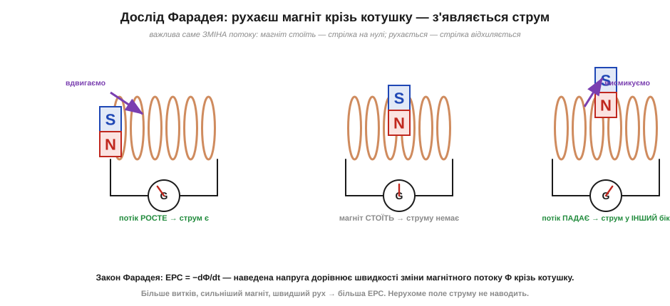
*Рис. 1.8.10.1. Електромагнітна індукція. Магніт вдвигають у котушку — магнітний потік крізь неї росте, і виникає струм (стрілка гальванометра відхиляється). Магніт стоїть — потік сталий, струму немає. Магніт висмикують — потік падає, і струм тече у протилежний бік. Важлива саме швидкість зміни потоку, а не його величина.*

Це й була розгадка десятиліття: значення має **швидкість зміни** магнітного поля крізь котушку, а не саме поле. Явище назвали **електромагнітною індукцією** (*electromagnetic induction*), а наведену напругу — **електрорушійною силою індукції** (ЕРС, *induced emf*).

### Закон Фарадея: ЕРС = швидкість зміни потоку

Щоб записати це кількісно, потрібне поняття **магнітного потоку** (*magnetic flux*, Φ) — міри того, скільки силових ліній поля пронизує контур. Кількісно потік дорівнює добутку поля на площу й на косинус кута між полем і нормаллю до контуру:

```
Φ = B · A · cosθ        (одиниця — вебер, Вб = Тл·м²)
```

Звідси видно три способи **змінити** потік, а отже, навести ЕРС: змінити **поле** B (рухаючи магніт ближче/далі, як у досліді Фарадея), змінити **площу** A контуру (стискаючи чи розтягуючи рамку), або змінити **кут** θ (повертаючи рамку в полі — саме так працює генератор, про який далі в цій темі). Усі три способи зводяться до одного: важлива швидкість, з якою Φ міняється в часі. Закон Фарадея каже:

```
ЕРС = −N · (ΔΦ / Δt)
```

де **N** — кількість витків котушки, а **ΔΦ/Δt** — швидкість зміни потоку. Наведена напруга дорівнює швидкості, з якою змінюється потік крізь котушку, помноженій на число витків. Звідси все стає на місця: рухаєш магніт швидше — потік міняється швидше — більша ЕРС; більше витків — більша ЕРС; сильніший магніт — більший потік і знову більша ЕРС. А якщо нічого не міняється (магніт стоїть) — ΔΦ = 0, і ЕРС = 0. Знак «мінус» у формулі — це окремий і важливий персонаж, до якого переходимо.

Є й приємний місток назад до сили Лоренца (§1.8.8), що робить індукцію зовсім не загадковою. Уявімо найпростіший випадок: прямий провідник завдовжки L ковзає зі швидкістю v по рейках упоперек поля B. Кожен вільний заряд у провіднику рухається разом із ним зі швидкістю v у полі B, тож на нього діє сила Лоренца F = q·v·B, що жене заряди вздовж провідника — буквально як насос. Це й створює напругу на кінцях: ЕРС = B·L·v. Жодної містики — лише сила Лоренца, що ми її вже знаємо, діє на заряди в рухомому дроті. Цей випадок (його звуть **ЕРС руху**, *motional emf*) — найнаочніший спосіб переконатися, що індукція й магнітна сила на заряди — це одне явище, побачене з різних боків. А загальний закон Фарадея охоплює і його, і випадок нерухомого контуру зі змінним полем.

### Правило Ленца: наведений струм завжди протидіє

Що означає той «мінус»? Його зміст сформулював **Емілій Ленц** (*Emil Lenz*) у вигляді чудово простого правила: **наведений струм завжди спрямований так, щоб протидіяти тій зміні, що його породила**. Якщо магніт наближається — наведений струм створює поле, що **відштовхує** магніт (намагається не пустити). Якщо магніт віддаляється — струм створює поле, що **притягує** його назад (намагається втримати). Котушка завжди «опирається» зміні потоку.

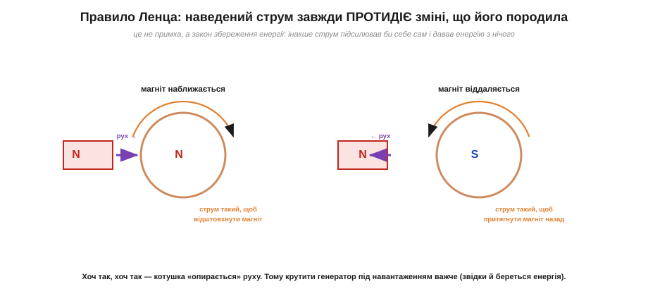
*Рис. 1.8.10.2. Правило Ленца. Коли магніт наближається північним полюсом, наведений струм робить ближній бік котушки теж північним — щоб відштовхнути магніт. Коли магніт віддаляється, струм міняє напрям і робить ближній бік південним — щоб притягнути магніт назад. У будь-якому разі котушка протидіє руху.*

Чому природа така «вперта»? Бо інакше порушувався б **закон збереження енергії** (§1.1.4). Уявіть, що наведений струм навпаки **підсилював** би рух магніту: тоді магніт розганявся б сам, струм зростав, давав ще більше розгону — і ми б отримали нескінченну енергію з нічого, вічний двигун. Природа цього не дозволяє. Тому наведений струм мусить **гальмувати** причину — і енергію, яку ми дістаємо у вигляді електрики, ми оплачуємо механічною роботою проти цього гальмування. Звідси й «мінус» у законі Фарадея: він кодує цю незламну протидію.

> 🔧 **Навіщо це.** Правило Ленца — це не абстракція, а те, що інженер відчуває руками й бачить на осцилографі. Саме воно пояснює, чому генератор під навантаженням крутити **важче**, ніж на холостому ходу (більший струм — сильніша протидія — більший опір обертанню; це безпосередньо й є перетворенням механічної енергії на електричну). Воно ж стоїть за **самоіндукцією** котушки (§2.2), через яку котушка опирається зміні власного струму й дає небезпечні викиди напруги при розриві кола, — звідси захисні діоди на реле. Хто зрозумів Ленца, той розуміє половину поведінки котушок у схемах.

### Генератор: «мотор навпаки»

Тепер з'єднаймо дві великі ідеї розділу. У §1.8.7 ми бачили: пропустиш струм крізь рамку в полі — рамка крутиться (мотор). Тепер додаємо обернене: крутиш рамку в полі — потік крізь неї безперервно міняється, і в ній наводиться струм (генератор). Це **те саме залізо**, лише потік енергії обернений.

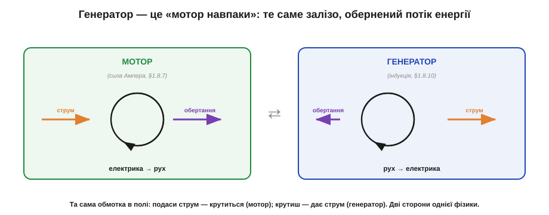
*Рис. 1.8.10.3. Двоїстість мотора й генератора. Мотор (§1.8.7): подаєш струм — сила Ампера обертає рамку, електрика перетворюється на рух. Генератор (§1.8.10): обертаєш рамку — індукція наводить струм, рух перетворюється на електрику. Одна й та сама машина працює в обидва боки — це дві сторони єдиної фізики електромагнетизму.*

Ця двоїстість — одна з найкрасивіших речей у всій електротехніці. Будь-який електромотор, якщо його розкрутити зовнішньою силою, стає генератором; будь-який генератор, якщо подати на нього струм, починає крутитися як мотор. Саме так влаштовано рекуперативне гальмування електромобіля: на ходу мотор перемикають у режим генератора, він гальмує машину (за Ленцем!) і водночас заряджає батарею. А вся світова електроенергетика — це гігантські генератори, де турбіна (парова, водяна, вітрова) крутить обмотки в магнітному полі, перетворюючи механічну енергію на електричну за законом Фарадея.

Звернімо увагу на форму наведеної напруги. Коли рамка рівномірно обертається в полі, кут θ зростає рівномірно, а потік Φ = B·A·cosθ міняється за косинусом. Швидкість зміни косинуса — це синус, тож наведена ЕРС виходить **синусоїдною**. Ось іще одна, незалежна причина, чому напруга в мережі має форму синуса (першу ми бачили в §1.7.1): обертовий генератор за самою своєю будовою дає синусоїдну ЕРС. Так індукція безпосередньо змикається зі змінним струмом — двома темами, що тепер постають як одне ціле.

Є й важливий окремий випадок, який наводить місток до Модуля 2. Потік крізь котушку може мінятися не лише від зовнішнього магніту, а й від **сусідньої котушки** зі змінним струмом — або навіть від **самої себе**, якщо власний струм котушки росте чи спадає. Перше — це **взаємна індукція** (основа трансформатора), друге — **самоіндукція** (основа поведінки котушки в колі). Обидва — той самий закон Фарадея, лише джерело змінного потоку інше. Докладно ці явища ми розгорнемо у відповідному розділі про котушки (§2.2); тут важливо побачити, що вони — пряме продовження індукції, а не щось нове.

> 📜 Як саме Фарадей — палітурник без математичної освіти (з ним ми вже зустрічались у §1.1.3, де він вигадав саме поняття поля) — за десять років упертих спроб дійшов до індукції, докладніше в [історії розділу 1.1 про Фарадея](../ch01-charge-field-potential/ch01-s3-history-faraday.md).

### Вихрові струми: індукція прямо в металі

Наостанок — ефект, що показує силу індукції наочно й має масу застосувань. Досі ми наводили струм у **дроті** (котушці). Але змінне магнітне поле наводить струми в **будь-якому** провіднику, навіть у суцільному шматку металу. Ці замкнені струми, що кружляють у товщі металу, називають **вихровими струмами** (*eddy currents*).


*Рис. 1.8.10.4. Вихрові струми. Змінне поле B(t) наводить у суцільному металі замкнені кругові струми. За правилом Ленца вони протидіють зміні поля — гальмують рух і гріють метал. Якщо ж метал зробити з тонких **ізольованих** пластин (шихтування), петлі для струмів розриваються, вихори дрібнішають, і втрати різко падають.*

Вихрові струми мають два обличчя. **Корисне**: за правилом Ленца вони гальмують рух провідника в полі без жодного механічного тертя — це безконтактне магнітне гальмо (в атракціонах, лічильниках енергії, спідометрах); вони ж розігрівають метал в індукційній плиті й у промисловій плавці. **Шкідливе**: у залізному осерді трансформатора чи дроселя змінне поле наводить вихрові струми, що **марно гріють** осердя й крадуть енергію. Саме щоб побороти цю шкоду, осердя для змінного струму складають не суцільними, а з тонких **ізольованих одна від одної пластин** (шихтують): тонкі пластини розривають великі петлі вихорів, і втрати падають у багато разів. Ось чому, розпилявши трансформатор, ви побачите не монолітне залізо, а стос тонких пластинок.

Дуже наочний дослід із вихровими струмами — кинути сильний магніт у вертикальну **мідну** (немагнітну!) трубу. Здавалося б, мідь магнітом не притягується, тож магніт мав би вільно падати. Натомість він повзе вниз повільно, наче в меду. Розгадка — вихрові струми: падаючи, магніт міняє потік крізь кільця труби попереду й позаду себе, наводить у них струми, а ті за Ленцем гальмують його падіння. Це чистий приклад того, що мідь «реагує» на магніт лише через **зміну** поля (індукцію), а не через намагнічування, — рівно як ми застерігали ще в §1.8.2.

**Приклад (яку напругу наведе рух магніту).** Котушка з N = 500 витків; за час Δt = 0.1 с магніт, що вдвигають у неї, збільшує потік крізь кожен виток на ΔΦ = 2 × 10⁻⁵ Вб. Яка наведена ЕРС?

```
ЕРС = N · ΔΦ / Δt
ЕРС = 500 · (2×10⁻⁵ Вб) / 0.1 с
ЕРС = 500 · 2×10⁻⁴
ЕРС = 0.1 В = 100 мВ
```

Сто мілівольтів від простого руху магніту рукою — цілком вимірна напруга. А якщо рухати магніт удвічі швидше (Δt = 0.05 с), ЕРС подвоїться до 200 мВ — наочне підтвердження, що значення має саме **швидкість** зміни потоку. Так само працює мікрофон динамічного типу, генератор на велосипеді чи датчик обертів колеса: усюди рух магніту (чи котушки) перетворюється на напругу за цим самим розрахунком.

**Приклад (чому осердя трансформатора роблять із пластин, а не суцільним).** Порівняймо якісно дві конструкції осердя під змінним полем.

```
суцільне залізне осердя:
   великі замкнені петлі для вихрових струмів → малий опір петлі
   → великі вихрові струми → сильний нагрів P = I²·R (марні втрати)

осердя з тонких ізольованих пластин (шихтоване):
   ізоляція рве петлі на багато дрібних → кожна петля вузька, опір великий
   → вихрові струми дрібні → нагрів у рази менший
```

Висновок прямий: шихтування — не примха, а спосіб приборкати вихрові струми, що їх неминуче наводить змінне поле за законом Фарадея. Це останній і дуже наочний доказ головної думки теми: **змінне магнітне поле наводить струм усюди, де є провідник**, — і інженерові доводиться то використовувати цей струм (генератор, гальмо, плита), то навмисно з ним боротися (шихтоване осердя).

---

Цей розділ зшив дві великі теми курсу в одну. Магнітне поле B виявилося другим векторним полем — рідним братом електричного E, але без монополів, із завжди замкненими лініями. Ми побачили, що магнетизм речовини народжується з вишикуваності доменів, що постійний магніт нічого не витрачає, а лише тримає цей лад до самої точки Кюрі. Головним відкриттям став двобічний зв'язок електрики й магнетизму: **струм народжує поле** (Ерстед, права рука, електромагніт), **поле штовхає струм** (сила Ампера — фізика моторів і давачів Холла), а **зміна поля наводить струм** (Фарадей, Ленц, генератор). Усе це не окремі факти, а грані єдиного електромагнетизму — і саме на ньому стоятиме майже вся подальша електроніка: котушки й трансформатори, мотори й давачі, безпровідна передача й боротьба з завадами.

> ▶️ Далі: [Розділ 1.9 — Шум і завади: фізичні джерела](../r09-noise-interference/r09-noise-interference.md)


