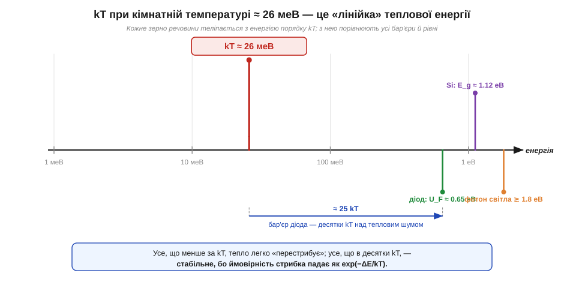
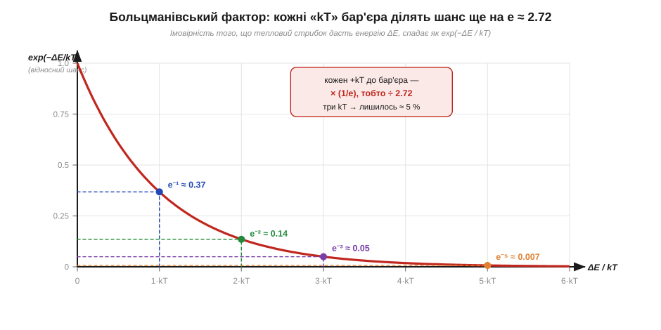

# 🧮 kT — універсальний масштаб теплової енергії: 26 меВ і больцманівський фактор

> Це математична вставка до теми [§1.9.2 «Тепловий шум резистора»](r09-noise-interference.md). Там у формулі для шуму резистора стоїть добуток **kT** — і він не випадковий гість. Те саме kT керує падінням на діоді, заповненням енергетичних рівнів, швидкістю реакцій. Варто раз розібратися, що це за величина, звідки береться загадкове число **26 меВ** і чому майже всюди у фізиці напівпровідників вигулькує **експонента**. Тоді формула теплового шуму перестане бути магічною і стане очевидною.

### Означення: kT — це «порція» теплового безладу

Будь-яке тіло за температури вище абсолютного нуля «кишить» зсередини: атоми тремтять, електрони безладно товчуться. Міра цього безладу — **абсолютна температура** (*absolute temperature*, T) у кельвінах. Але сама по собі температура — це ще не енергія; щоб дістати енергію, її множать на місток між «градусами» і «джоулями» — **сталу Больцмана** (*Boltzmann constant*, k):

```
k  = 1.381 × 10⁻²³  Дж/К
kT = характерна теплова енергія однієї «ступені свободи»
```

Стала k — це просто перевідний коефіцієнт: скільки джоулів припадає на один кельвін на кожен незалежний спосіб рухатися. Добуток **kT** і є тією **характерною порцією теплової енергії**, якою володіє кожне зерно речовини. Не точна енергія кожної частинки (вони всі різні, розкидані за тим самим Гауссом із [сусідньої вставки про випадкову величину](r09-s1-m-random-variables.md)), а саме **масштаб** — порядок величини, навколо якого все коливається.

### Інтуїція: чому саме 26 меВ

Щоб ця абстрактна «порція» перетворилася на конкретне число, підставмо в неї кімнатну температуру. «Кімнатна» в даташитах — це T = 300 K (≈ 27 °C, кругле число для оцінок):

```
kT = 1.381 × 10⁻²³ × 300 = 4.14 × 10⁻²¹  Дж
```

Джоулі тут незручні — числа з мінус двадцять першим степенем не вкладаються в голові. Перейдімо до **електронвольтів** (*electronvolt*, еВ) — енергії, яку електрон набирає, пройшовши 1 вольт (1 еВ = 1.602 × 10⁻¹⁹ Дж):

```
kT = 4.14 × 10⁻²¹ Дж / 1.602 × 10⁻¹⁹ Дж/еВ ≈ 0.0259 еВ ≈ 26 меВ
```

Ось воно — **26 меВ при кімнатній температурі**. Це число варто завчити, як завчають 9.8 м/с² для тяжіння: воно зринатиме постійно. (За точніших 25 °C виходить ≈ 25.7 меВ; інженери округлюють до 26 меВ або навіть до 25 меВ — для оцінок різниця неважлива.) Поділивши kT на заряд електрона, дістаємо ту саму величину у вольтах — **тепловий потенціал** (*thermal voltage*, V_T = kT/q ≈ 25.85 мВ), що його ще зустрінемо в рівнянні діода.


*Рис. 1.9.2m.1. kT ≈ 26 меВ як «лінійка», з якою порівнюють усі інші енергії. Заборонена зона кремнію (≈ 1.12 еВ) і бар'єр діода (≈ 0.65 еВ) — це десятки kT над тепловим рівнем, тому тепло саме по собі їх майже не долає; фотон видимого світла (≳ 1.8 еВ) — і поготів. Усе, що менше за kT, тепловий безлад розмиває без зусиль.*

> 🔧 **Навіщо це.** 26 меВ — це лінійка, якою інженер на око оцінює, що в схемі «легко», а що «важко» для теплового збурення. Рівень логіки (сотні мВ — вольти) у тисячі разів вищий за тепловий потенціал 26 мВ — тому теплові флуктуації не перемикають вентиль самі собою. А от вхід чутливого підсилювача, де корисний сигнал — одиниці мікровольтів, уже близький до теплової межі, і там kT нагадує про себе шумом.

### Апарат: больцманівський фактор і звідки експонента

Лишається головне питання теми: **чому всюди експоненти**. Відповідь — у **больцманівському факторі** (*Boltzmann factor*). Статистична фізика стверджує: імовірність того, що теплове збурення закине систему в стан з енергією на ΔE вище, ніж основний, спадає за законом

```
P(ΔE) ∝ exp(−ΔE / kT)
```

Уся суть — у відношенні **ΔE / kT**: енергію бар'єра міряють не в джоулях, а в **«скількох kT»** він заввишки. І спадає шанс не лінійно, а множенням. Кожне додаткове kT висоти ділить шанс ще на e ≈ 2.718:

```
ΔE = 1·kT  →  e⁻¹ ≈ 0.37     (трохи більше за третину)
ΔE = 2·kT  →  e⁻² ≈ 0.14
ΔE = 3·kT  →  e⁻³ ≈ 0.05      (лишилося ≈ 5 %)
ΔE = 5·kT  →  e⁻⁵ ≈ 0.007
ΔE = 10·kT →  e⁻¹⁰ ≈ 0.000045
```


*Рис. 1.9.2m.2. Больцманівський фактор exp(−ΔE/kT). По осі — висота бар'єра в одиницях kT, по вертикалі — відносний шанс, що тепловий стрибок його подолає. Крива падає не рівно, а множенням: кожні «+kT» зрізають шанс у e ≈ 2.72 раза, тож уже за трьох kT лишається близько 5 %. Звідси й експоненти в усіх «теплових» формулах.*

Чому саме множення, а не віднімання? Бо незалежні випадковості перемножуються: щоб назбирати енергію 2·kT, теплу треба «вдало скластися» двічі поспіль, а ймовірності таких подій множаться — звідси й степінь. Ця єдина думка — «бар'єр у kT входить в експоненту» — і породжує експоненти всюди, де тепло долає (чи не долає) енергетичний поріг.

### Де в курсі це працює

Тепер видно, що обидві ролі kT — «масштаб» і «бар'єр в експоненті» — сходяться вже в тій формулі, з якої ми почали. У формулі теплового шуму резистора (§1.9.2) kT стоїть прямим множником: що тепліше тіло, то сильніше тремтять його електрони й то більший шум — лінійно за kT. Больцманівський фактор тут пояснює, чому шум **гаусів і широкосмуговий**: безліч незалежних теплових поштовхів складаються в ту саму дзвоноподібну випадкову величину з [§1.9.1m](r09-s1-m-random-variables.md). А експонента exp(−ΔE/kT) — це той самий механізм, що згодом дасть експоненту в рівнянні діода й у залежності струму витоку від температури: щойно в курсі трапиться формула з exp(щось/kT), згадуй цю вставку — там завжди ховається «бар'єр заввишки в стільки-то kT».
