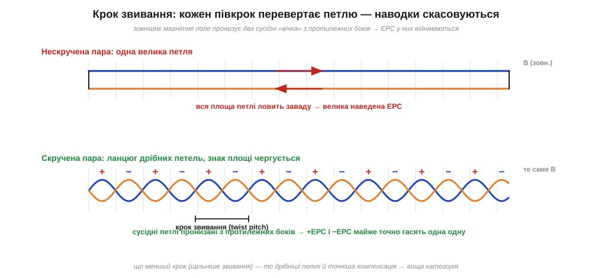
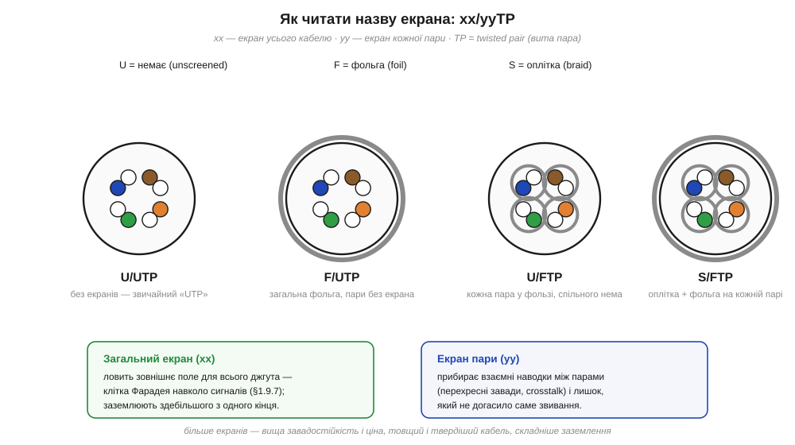

# 🔌 UTP/FTP зсередини: категорії, крок звивання, екран

> 🔌 Компонентна вставка до теми [§1.9.8 «Вита пара: геометрія проти наводок»](r09-noise-interference.md). Там ми побачили **принцип**: дві скручені жили перетворюють велику петлю-антену на ланцюг дрібних петель, що чергують знак, і наводки в них скасовуються. Тут розберемо, як цей принцип запакований у найпоширеніший сигнальний кабель планети — звичайну виту пару (*twisted-pair*) з блакитною оболонкою й знайомим конектором на кінці. Що під оболонкою, чому пар саме чотири, що означають загадкові Cat5e/Cat6 і навіщо одним кабелям екран, а іншим — ні.

## Клас компонента: чотири пари в одній оболонці

Розкриймо оболонку звичайного мережевого шнура. Усередині — **чотири виті пари** (*twisted pair*), вісім мідних жил завтовшки десь 0.5 мм. Кожна пара має свій колір за стандартом TIA-568: помаранчева, зелена, синя, бура — і до кожної кольорової жили йде її біло-смугаста «напарниця». Пари не просто скручені поодинці: усі чотири ще й сплетені між собою в джгут, щоб не розповзалися.

Найважливіша, але непомітна деталь — **крок звивання** (*twist pitch*): у різних пар він **навмисно різний** (приблизно 13–19 мм на оберт). Це не недбалість виробника, а захист від перехресних завад: якби всі пари були скручені однаково й лежали паралельно, їхні петлі йшли б у такт і одна пара щедро наводила б сигнал на сусідню. Різний крок розсинхронізовує петлі — наводка пари на пару теж починає скасовуватися, як і зовнішня.


*Рис. 1.9.8c.1. Угорі — нескручена пара: одна велика петля ловить усю заваду (механізм із §1.9.5). Унизу — та сама пара, скручена: ланцюг дрібних петель, де сусідні «вічка» пронизані зовнішнім полем з протилежних боків, тож наведені ЕРС чергують знак і майже точно гасять одна одну. Що менший крок звивання, то дрібніші петлі й точніша компенсація — звідси й вища категорія.*

## Категорії: те саме мідне ядро, інша точність

Саме точність цього звивання й розводить кабелі по категоріях. Категорія (*Category*, Cat) кабелю — це його **частотна стеля**, тобто до якої частоти звивання й геометрія тримають пари достатньо «тихими». Фізика проста: чим вища частота сигналу, тим коротшою стає його довжина хвилі — і тим дрібнішою має бути кожна петля звивання, щоб лишатися «електрично малою». Звідси сходинки:

```
Cat5e   до 100 МГц    1 Гбіт/с      базова вита пара, ще всюди жива
Cat6    до 250 МГц    1 Гбіт/с (10 Гбіт/с до ~55 м)
Cat6a   до 500 МГц    10 Гбіт/с на повні 100 м
Cat7/8  до 600+ МГц/2 ГГц   майже завжди з екраном
```

Мідь у всіх однакова — різниця в **щільності й рівномірності звивання**, у точності витримування геометрії та (з вищих категорій) в екрані. Тому кабель вищої категорії товщий і жорсткіший: у нього менший крок, часто роздільник-«хрестик» між парами й нерідко фольга.

## Екран: коли звивання замало

Звивання — захист від **магнітної** наводки (петля стає малою, §1.9.5). Але є ще наводка через **електричне** поле (§1.9.4) і чужі радіохвилі — від них рятує екран, тобто клітка Фарадея навколо сигналу (§1.9.7). Звідси сім'я позначень `xx/yyTP`, яку варто навчитися читати: перша літера — екран **усього** кабелю, друга — екран **кожної пари**.


*Рис. 1.9.8c.2. Як читати назву: U — немає, F — фольга (*foil*), S — оплітка (*braid*). U/UTP — голі виті пари (звичайний «UTP»); F/UTP — спільна фольга поверх усіх пар; U/FTP — фольга на кожній парі окремо; S/FTP — оплітка по всьому кабелю плюс фольга на кожній парі (максимум захисту). Загальний екран ловить зовнішнє поле для всього джгута; екран пари додатково гасить перехресні завади між парами.*

## Підключення й «перший байт»

Виту пару рідко вмикають у схему «голими» жилами — її обтискають у стандартний 8-контактний конектор (*8P8C*, у побуті «RJ-45») за розкладкою T568B. Для розробника на макетці важать дві речі. Перше: жили йдуть **парами**, тому сигнал треба пускати **диференційно** — корисний на кольоровій жилі, його дзеркало на біло-смугастій (саме так працює та сама диференційна пара, що чекає в §6.4.2). Кинути сигнал по одній жилі, а «землю» по жилі з іншої пари — означає викинути весь захист звивання: петля знову стане велика.

Друге — **екран**. Його приєднують до «землі» здебільшого **з одного кінця** (зазвичай із боку приймача), щоб не утворити земляну петлю (§1.9.6): якщо з'єднати екран із землею на обох кінцях, різниця потенціалів двох «земель» пожене ним струм, і екран сам стане джерелом гулу замість захисту.

> 🔧 **Навіщо це.** Прокладаючи довгий сигнал між платами чи давачем і контролером — енкодер, RS-485, диференційна лінія — беріть виту пару й тримайте сигнал із його зворотом **в одній парі**. Це безплатно дає той самий захист, що й дорогий екран: площа петлі мізерна, наводка скасовується сама. Екран додавайте, коли поруч силові кабелі чи передавачі, і заземлюйте з одного кінця.

## Типові граблі

Кожна з цих помилок зводить нанівець той самий захист звивання, заради якого пару й скрутили:

- **Розплести пари біля конектора «щоб зручніше».** Кожен сантиметр розкрученої жили — це знову велика петля; на гігабітних швидкостях розплетення довше ~13 мм уже псує лінію. Знімати оболонку — мінімум, звивати — до самого контакту.
- **Сигнал і зворот у різних парах.** Класична помилка з саморобним кабелем: формально всі вісім жил задіяні, а захисту нема, бо петля сигналу велика. Зворот — завжди в парі зі «своїм» сигналом.
- **Екран на обидва кінці.** Дає земляну петлю (§1.9.6) і часто гірший результат, ніж зовсім без екрана. Один кінець — правило за замовчуванням.
- **UTP уздовж силового кабелю.** Звивання гасить магнітну наводку, але не рятує від сильного електричного поля поруч 230-вольтової лінії — тут уже потрібен екран (F/UTP чи S/FTP) або відстань.

## Варіації класу

Та сама ідея витої пари живе далеко за межами мережевих шнурів: телефонна «локшина», промислові кабелі для RS-485 і CAN, давачні лінії енкодерів. Скрізь працює один закон — **сигнал зі своїм зворотом скручені разом**, і площа петлі прагне нуля. Побачивши будь-який багатожильний сигнальний кабель зі скрученими парами, ви тепер знаєте і навіщо вони скручені, і чому крок у сусідніх пар різний, і що означає літера перед скісною рискою в його назві.
