# Розділ 1.10 — Електростатика на практиці: іскри, блискавка й ESD

Уся книга досі говорила про заряд, що **рухається** керовано: струми в дротах, напруги на резисторах, сигнали в часі. Але є й інший бік — заряд, що накопичився **нерухомо** й чекає. Він не світить світлодіодом і не крутить мотор; він тихо сидить на твоєму светрі, на пластиковому корпусі, на власному тілі — аж поки не знайде шлях стекти. І тоді він стікає не плавно, а **зривом**: іскрою, тріском, уколом у палець, спалахом на кілометр. Це електростатика — і вона з'єднує дві речі, які на перший погляд лежать на протилежних полюсах масштабу: крихітну іскру з пальця, що вбиває мікросхему, і блискавку, що розколює дерево.

Цей розділ — про прикладну електростатику. Він спирається на фундамент Розділу 1.1: заряд переносять **електрони** (§1.1.1), заряд **зберігається**, а тіла бувають **провідниками** й **ізоляторами**. Тепер ми побачимо, що буває, коли цей заряд накопичується у великих кількостях і малих ємностях. Спершу — звідки беруться кіловольти «з нічого» (§1.10.1) і скільки вольтів несе людське тіло (§1.10.2). Далі — як саме пробиває повітря (§1.10.3) і чому той самий механізм у масштабі хмари дає блискавку (§1.10.4). Потім — головна практична біда для розробника: чому мікросхеми від цього вмирають, часто **непомітно** (§1.10.5). І нарешті — як із цим жити: антистатичне робоче місце (§1.10.6), правильне пакування (§1.10.7) і керування вологістю та матеріалами в середовищі (§1.10.8).

> 📜 **Перед матеріалом — історія:** [Франклін, Ріхман і приборкання блискавки](r10-history-franklin-richmann.md). Вона показує, як людство вперше зрозуміло, що іскра з пальця й удар із неба — це **одне й те саме**, і чого це коштувало першим дослідникам.

---

## 1.10.1 Кіловольти з нічого: трибоелектрика в побуті й на робочому столі

Почнімо з відчуття, знайомого кожному: пройшовся кімнатою, торкнувся дверної ручки — і **клац**, укол струмом. Здається, ніби заряд узявся з повітря. Але ми вже знаємо з §1.1.1, що заряд нізвідки не береться й нікуди не зникає — він лише **перерозподіляється**. То звідки ж тоді кіловольти? Відповідь у тому, що звичайнісінькі побутові дії — хода, вставання з крісла, знімання светра — це насправді мільйони мікроскопічних актів **контакту й розриву** двох різних поверхонь. І кожен такий акт переганяє жменьку електронів з одного матеріалу на інший. Зрозуміти цей механізм — означає навчитися передбачати, де саме на робочому столі чатує небезпека для електроніки.

### Контактна електризація: справа не в терті, а в контакті й розриві

Звичне слово «наелектризувати тертям» трохи збиває з пантелику. Тертя тут не головне — воно лише **збільшує площу** дотику й кількість циклів контакт↔розрив. Сам же заряд народжується в простішому акті: дві різні поверхні **торкнулись** і **роз'єдналися**.

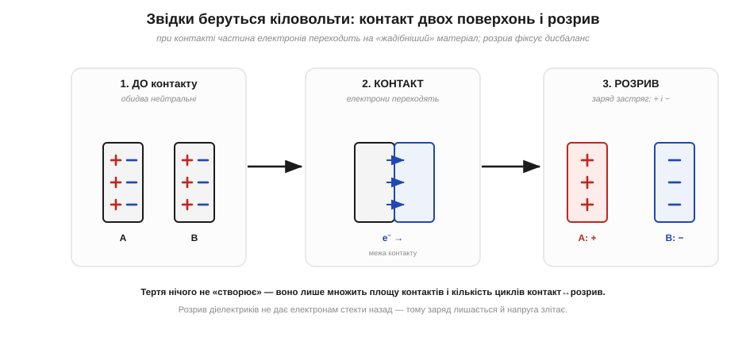
*Рис. 1.10.1.1. Поки два матеріали порізно — обидва нейтральні. При контакті частина електронів переходить на той матеріал, що «жадібніший» до них (має нижчий енергетичний рівень для електрона). Поки поверхні разом, це нічого не означає. Але якщо їх **розірвати** — кожна забирає свій новий баланс: одна лишається з нестачею електронів (стає **+**), друга — з надлишком (стає **−**).*

Чому розрив такий важливий? Бо поки поверхні торкаються, електрони можуть вільно ходити туди-назад, і жодного стійкого заряду немає. Розрив — це мить, коли шлях для електронів раптом обривається. Якщо обидва матеріали — **провідники**, заряд встигне стекти назад через останню точку контакту, і нічого не лишиться. А от якщо хоча б один із них **ізолятор** (а більшість побутових поверхонь — пластик, гума, синтетика — саме ізолятори), електронам ніяк повернутись: вони застрягають там, куди їх занесло. Саме тому статика — це переважно явище **діелектриків**: метал розрядиться сам, пластик — ні.

Тут варто на мить зупинитись і спитати глибше: а **чому** взагалі при дотику електрони з одного матеріалу переходять на інший? Адже обидва тіла були нейтральні й нікуди не поспішали. Причина — у тому, що в різних речовинах електронам «живеться» по-різному. У кожному матеріалі є власний рівень, до якого електронові вигідно опуститись, — щось на кшталт «глибини ями», у якій він сидить (фізики звуть це **роботою виходу**, *work function*). Коли дві поверхні стикаються впритул, на межі їхні електронні хмари перекриваються, і електрони, як вода між сполученими посудинами різного рівня, перетікають туди, де «глибше» — у матеріал із сильнішим притяганням. Тому перехід **спрямований**: не туди-сюди порівну, а переважно в один бік. Скільки саме перетече — залежить від того, наскільки різні ці «глибини» у двох матеріалів; звідси й увесь трибоелектричний ряд, до якого ми зараз дійдемо.

Кожен окремий контакт переносить мізерну порцію заряду. Але уявімо ходу: підошва тисячу разів торкається й відривається від ворсу килима, і щоразу — новий мікроскопічний перенос. Заряди **додаються** (закон збереження дозволяє лише перерозподіл, але накопичення дисбалансу — будь ласка), і за хвилину на тілі вже нанокулони надлишкового заряду. Як ми побачимо в §1.10.2, на крихітній ємності тіла це дає тисячі вольтів.

Тут же ховається відповідь на старе питання, чому статика так залежить від **площі й шорсткості**. Дві ідеально гладенькі пластини торкаються лише в кількох точках — справжня площа контакту мізерна. Тертя ж притискає поверхні, зминає мікронерівності й проганяє їх одна по одній, тимчасово створюючи **тисячі нових точок контакту**, кожна зі своїм циклом дотик-розрив. Тому потерті матеріали електризуються набагато сильніше за просто притиснуті: тертя — це не окремий магічний механізм, а спосіб **багаторазово помножити** ту саму контактну електризацію. Це й пояснює, чому енергійне протирання пластику сухою ганчіркою «заряджає» його куди дужче, ніж легкий дотик.

> 🔧 **Навіщо це.** Розуміння «контакт + розрив + ізолятор» одразу підказує, де на столі небезпека. Дістаєш плату зі звичайного поліетиленового пакета — це розрив двох діелектриків, плата заряджається. Відліплюєш захисну плівку — те саме. Совгаєш компонент по пінопласту — теж. Усе, що **відривається** від пластику, треба подумки позначати як «зараз тут народилися кіловольти».

### Хто стає плюсом, а хто мінусом: трибоелектричний ряд

Чи можна сказати наперед, який із двох матеріалів віддасть електрони, а який забере? Здебільшого так. Матеріали шикуються в уже знайомий нам із §1.1.1 **трибоелектричний ряд** (*triboelectric series*) — список, упорядкований за «жадібністю» до електронів.

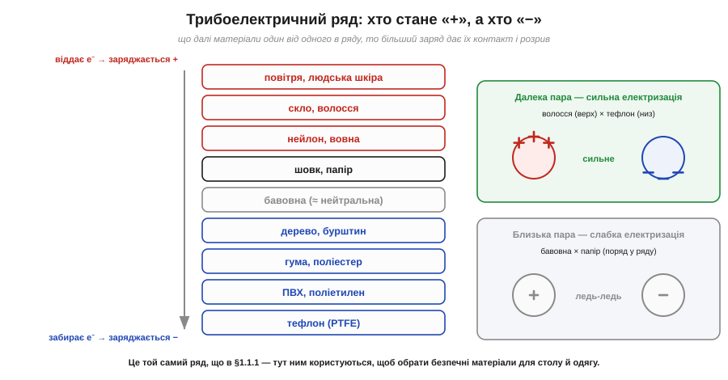
*Рис. 1.10.1.3. Той, що **вище** в ряду, віддає електрони й заряджається **+**; нижній забирає їх і стає **−**. Чим далі матеріали один від одного в списку, тим сильніша електризація: волосся об тефлон (далека пара) б'ється потужно, бавовна об папір (сусіди) — ледь-ледь.*

Ряд пояснює не лише знак, а й **силу** ефекту. Шкіра, скло й вовна стоять угорі — вони охоче віддають електрони. Тефлон, ПВХ і поліетилен — унизу, вони електрони жадібно забирають. Потерти волосся об надувну кульку (вовна/шкіра вгорі, гума внизу) — далека пара, сильний заряд. А два схожі матеріали майже не електризуються. Це прямий практичний інструмент: добираючи одяг, килимок чи пакет для роботи з електронікою, ми хочемо матеріали **близько до середини** ряду й близько один до одного — щоб нічому було сильно заряджатись.

Чесно скажемо й про **межі** цього інструмента, бо інакше ним легко зловживати. Трибоелектричний ряд — не закон із точними числами, а радше якісне впорядкування, і в різних таблицях сусідні позиції часом міняються місцями. Причина в тому, що реальний заряд залежить не лише від самих матеріалів, а й від вологи на поверхні, забруднень, температури, навіть від того, наскільки чисто й сильно терли. Тому ряд надійно передбачає **загальну тенденцію** (хто радше стане плюсом, а хто мінусом, і чи буде заряд великим) — але не дає гарантованого числа вольтів. Для практики цього цілком досить: нам і треба знати, яких пар матеріалів уникати, а не рахувати заряд до відсотка.

### Заряд від тертя — це не «наведений» заряд

Щоб не плутати поняття, відокремимо контактну електризацію від іншого способу «наелектризувати» тіло, з яким ми зустрічалися в §1.1.1, — **електростатичної індукції**. Це різні речі, і їх корисно тримати нарізно. При **контактній електризації** (те, про що весь цей розділ) заряд **фізично переходить** з тіла на тіло: на одному його стало менше, на іншому більше, і сумарний заряд кожного тіла **змінився**. При **індукції** ж заряд нікуди не переходить — піднесене заряджене тіло лише **зсуває** наявні заряди всередині сусіда (ближчі притягуються, дальні відштовхуються, як у поляризації соломинки з §1.1.1), але повний заряд тіла лишається **нульовим**, поки немає дотику чи заземлення.

Чому це важливо на практиці? Бо заряджений пластиковий предмет на столі діє на чутливу плату поряд **обома** способами одразу. По-перше, він наводить (індукує) на ній зсув зарядів — і якщо в цю мить плату заземлити чи торкнутись її виводу, зсунутий заряд стече, і плата лишиться реально зарядженою (це зветься заряджанням через індукцію). По-друге, якщо предмет торкнеться плати — піде вже прямий контактний перенос. Тому небезпечним є не лише дотик зарядженого тіла, а й просто його **присутність поряд** із чутливою електронікою: поле наводить заряди, і досить одного невдалого заземлення, щоб вони «застигли» на платі. Саме тому з робочого місця прибирають усі сторонні наелектризовані діелектрики — навіть ті, до яких ніхто не збирається торкатись.

### Чому в побуті статики так багато

Тепер прикладемо механізм до реальних сцен. Виявляється, дім і робочий стіл — це фабрика статики, і майже завжди винні ті самі дві умови: **синтетика** (матеріали з країв трибоелектричного ряду) і **сухе повітря** (нема вологи, що стікала б заряд — детально в §1.10.8).


*Рис. 1.10.1.2. Усі ці сцени — один і той самий механізм Рис. 1.10.1.1: контакт різнорідних поверхонь і розрив. Типові напруги — одиниці й десятки кіловольтів. Синтетика й сухе повітря підсилюють кожен випадок.*

Найпотужніший побутовий генератор — **крісло на коліщатах**. Коли встаєш, одяг відривається від оббивки на великій площі за одну мить — ідеальні умови для контактної електризації, та ще й часто далека трибоелектрична пара (синтетична тканина одягу об синтетику оббивки). Звідси — типові 5–18 кВ на тілі лише від вставання. **Хода по килиму** працює дрібнішими порціями, але їх багато. **Знімання светра** супроводжується видимими (в темряві) іскорками — це теж розриви діелектриків. А на робочому столі найковарніше — **діставання плати зі звичайного пакета** й **відліплювання плівок чи скотчу**: тут заряд народжується просто в руках, поряд із чутливими виводами.

Чому одні дії заряджають дужче за інші, видно, якщо звернути увагу на три множники: **площу** контакту, **кількість циклів** і **трибоелектричну відстань** пари. Вставання з крісла перемагає за площею (увесь одяг відразу) і відстанню пари (синтетика об синтетику) — звідси й найвищі напруги. Хода виграє кількістю циклів, але кожен дрібний. Відліплювання скотчу — це майже ідеальний «чистий розрив» двох діелектриків на всю ширину стрічки за частку секунди, тому стрічка так охоче іскрить у темряві й так надійно притягує пил. Тримаючи ці три множники в голові, можна на око оцінити небезпечність будь-якої нової дії — навіть тієї, якої немає на рисунку.

Окремо підкреслимо неочевидне: заряджається не лише людина, а й **сам предмет**. Коли ти витираєш пластиковий корпус сухою ганчіркою, заряд набирає і ганчірка, і корпус — обоє, з протилежними знаками (закон збереження, §1.1.1). Корпус — діелектрик, тож заряд лишається на ньому плямами там, де терли. Якщо потім покласти на цей заряджений корпус плату, поле наведе на ній заряди (індукція з попереднього підрозділу) — і ось плата вже в небезпеці, хоча ти ніби «нічого з нею не робив». Тому в роботі небезпечні не лише руки, а й будь-яка наелектризована поверхня поряд.

**Приклад (скільки електронів переганяє вставання з крісла).** Припустимо, після вставання тіло має заряд Q ≈ 0.5 мкКл (це відповідає кільком кіловольтам на ємності тіла — числа в §1.10.2). Скільки електронів перейшло?

```
Q = 0.5 мкКл = 0.5 × 10⁻⁶ Кл
N = |Q| / e
N = (0.5 × 10⁻⁶ Кл) / (1.602 × 10⁻¹⁹ Кл)
N ≈ 3.1 × 10¹² електронів
```

Три трильйони електронів — і водночас це **мізерна** частка від усіх електронів тіла (порівняй із масштабом кулона з §1.1.1). Заряду «багато» в штуках і «дуже мало» в кулонах — обидва відчуття правильні. Саме ця мала кількість кулонів і робить статику такою непомітною на дотик, але смертельною для мікросхем.

> 🔧 **Навіщо це.** Звідси випливає перша заповідь робочого місця: **усе, що рухається й треться, має бути з правильних матеріалів**. Не синтетичний килим, а антистатична підлога; не звичайний поліетилен, а спеціальний пакет; не флісовий светр, а бавовняний халат. Це не забобон — це інженерне читання трибоелектричного ряду. Що саме обрати для підлоги, одягу й інструменту, розкладемо в §1.10.8.

### Чому це не зникає само

Лишилось пояснити, чому заряд просто не «розсіюється». На провіднику він би стік за наносекунди. Але на ізоляторі заряд застрягає **точково**: де народився, там і сидить, бо вільних носіїв для його розтікання немає. Тому пластиковий корпус може лишатися зарядженим **годинами**. Єдиний природний рятівник — волога: за нормальної вологості на поверхнях осідає тонка плівка води з розчиненими іонами, яка робить навіть ізолятор трошки провідним, і заряд повільно стікає (механізм — §1.10.8). А коли повітря сухе (опалення взимку, кондиціонер влітку), цього рятівника немає — і статика накопичується безперешкодно. Ось чому майстерню з електронікою завжди розглядають разом із її **кліматом**, а не лише зі столом і приладами.

Корисно бачити це як **рівновагу двох потоків**: один потік заряду весь час **надходить** (рух, тертя, контакти-розриви), а другий весь час **стікає** (через провідність матеріалів, вологу плівку, повітря). Підсумкова напруга на тілі чи предметі — це там, де ці два потоки врівноважились. На сухому ізоляторі стік майже нульовий, тож рівновага встановлюється дуже високо — кіловольти. Зробити стік швидшим (зволожити повітря, замінити ізолятор на розсіювальний матеріал, з'єднати з землею) — і та сама рівновага опуститься до безпечних значень навіть за того самого надходження. Уся подальша ESD-дисципліна, по суті, — це керування саме **потоком стоку**: ми майже не можемо заборонити людині рухатись і тертись, зате можемо дати накопиченому заряду легкий і безпечний шлях зникати швидше, ніж він встигає нашкодити. До цієї думки ми ще не раз повернемося — у браслеті (§1.10.6), у виборі матеріалів і вологості (§1.10.8).

Підсумуймо §1.10.1: статика народжується при **контакті й розриві** різних поверхонь, переважно діелектриків; глибша причина — різна «жадібність» матеріалів до електронів, а тертя лише множить точки контакту; знак і силу передбачає (якісно) **трибоелектричний ряд**; побут повний таких джерел, а сухе повітря й синтетика їх підсилюють, бо різко зменшують стік. Контактну електризацію треба відрізняти від індукції, але небезпечні обидві. Ми весь час казали «кіловольти на тілі» — час нарешті поставити число й зрозуміти, **скільки вольтів** людина реально носить і чому цього не відчуває.

---

## 1.10.2 Тіло як накопичувач заряду: скільки вольтів ти носиш

У §1.10.1 ми з'ясували, **звідки** береться заряд на тілі. Тепер поставимо, мабуть, найдивовижніше питання всього розділу: якщо на тобі заряд, то **під якою ти напругою**? Відповідь шокує новачка: ходячи по килиму, людина легко набирає напругу в **кілька, а то й десятки кіловольтів** — більшу, ніж на високовольтній лінії в під'їзді. І при цьому нічого не відчуває. Як таке можливо? Розгадка — у тому, що тіло поводиться як **конденсатор** дуже малої ємності, а на малій ємності навіть крихітний заряд дає велетенську напругу. А ще — у тому, що людське відчуття й чутливість мікросхеми лежать у зовсім різних діапазонах напруг.

### Тіло — це обкладинка конденсатора відносно землі

Щоб зв'язати заряд із напругою, згадаймо: будь-які два провідники, розділені ізолятором, утворюють конденсатор. Тіло людини — непоганий провідник (солона вода й іони, §1.2.11). Земля (підлога, будівля, ґрунт) — теж провідник. А між ними — **ізолятор**: підошва взуття, сухий килим, повітря.

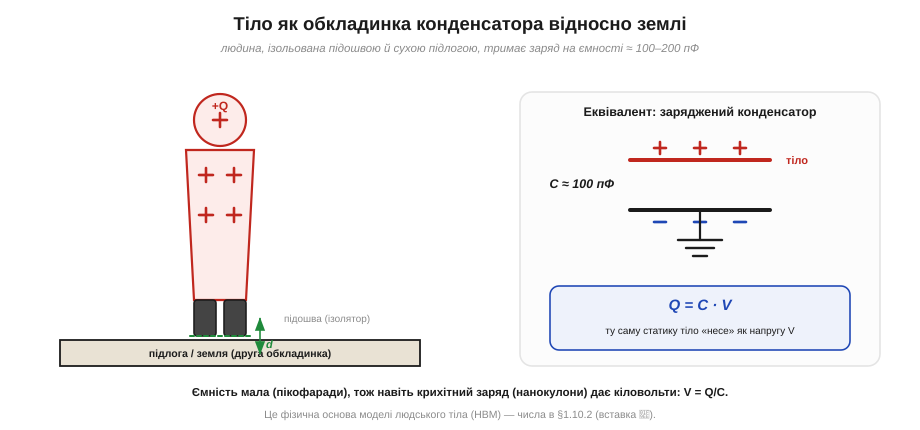
*Рис. 1.10.2.1. Людина, ізольована від землі підошвою й сухою підлогою, — це заряджена обкладинка конденсатора з ємністю близько 100–200 пФ. Заряд Q, що сидить на тілі, пов'язаний із напругою V простим співвідношенням Q = C·V. Мала ємність означає велику напругу за малого заряду.*

Зв'язок між зарядом і напругою конденсатора — це фундаментальне Q = C·V (його ми докладно вивчимо в Розділі 2.1, а тут користуємось як готовим фактом). Перепишемо його, щоб знайти напругу:

```
V = Q / C
```

І ось де ховається весь фокус. Ємність тіла **C мала** — близько 100 пФ (пікофарад, 100 × 10⁻¹² Ф). А заряд, як ми бачили в §1.10.1, хоч і малий у кулонах, але це все ж нанокулони. Поділи нанокулони на пікофаради — і отримаєш кіловольти. Мала ємність — це підсилювач напруги: вона перетворює дрібний заряд на величезну різницю потенціалів.

**Приклад (скільки вольтів дає типовий заряд тіла).** Хай після ходи по килиму на тілі Q = 0.3 мкКл, а ємність тіла C = 100 пФ. Яка напруга?

```
V = Q / C
V = (0.3 × 10⁻⁶ Кл) / (100 × 10⁻¹² Ф)
V = (0.3 × 10⁻⁶) / (1.0 × 10⁻¹⁰)
V = 3000 В = 3 кВ
```

Три кіловольти — від простої ходи. А вставання з крісла з його 0.5 мкКл дало б уже 5 кВ. Це не екзотика, а буденність сухого зимового дня.

> 🔧 **Навіщо це.** Ємність тіла — не абстракція: вона лежить в основі **моделі людського тіла** (*Human Body Model, HBM*) — стандартного способу описувати ESD-удар «з пальця». У HBM тіло — це конденсатор ≈100 пФ, заряджений до кількох кіловольтів, що розряджається через опір ≈1.5 кОм (опір руки й шкіри). Саме на цю модель розраховують захист входів мікросхем, і саме її числа (100 пФ, 1.5 кОм) задають форму й силу удару. Докладніше — у вставці 🧮 [Модель людського тіла (HBM)](r10-s2-m-hbm.md).

### Звідки беруться саме 100 пФ і чому це число «плаває»

Природно спитати: чому ємність тіла саме така — близько сотні пікофарад? Точне число залежить від геометрії «конденсатора» тіло–земля: від площі, оберненої до землі, і від «зазору» між ними (товщини й матеріалу підошви, відстані до заземлених предметів). Тіло — велике, тож площа чимала; але й «обкладинки» рознесені, та й форма складна, тож виходить порядок сотні пікофарад, а не мікрофаради. Грубо кажучи, людина — це конденсатор «розміром із людину», і пікофаради тут — природний масштаб.

Важливо, що ця ємність **не стала**: вона помітно міняється від пози й оточення. Підніми руку до заземленого приладу — площа «навпроти землі» збільшиться, ємність зросте. Сядь — зміниться і площа, і зазор. Підійди впритул до великого заземленого корпусу — ємність між тобою й ним додасться. Через те саму людину описують діапазоном (типово 100–250 пФ), а не одним числом. Для нас тут важливий не точний фарад, а наслідок: **ємність мала й мінлива**, тож напруга на тілі — теж велика й мінлива, і покладатись на «зараз я, мабуть, не дуже заряджений» не можна.

Є й корисний бік цієї мінливості. Коли заряджена людина **наближає** палець до виводу (заземленого чи з'єднаного з великою масою), ємність між пальцем і ціллю стрімко зростає в останні міліметри. А заряд при підльоті ще майже сталий, тож напруга V = Q/C на цьому проміжку **падає** — але поле в зазорі все одно встигає сягнути порога пробою (§1.10.3), і розряд стрибає за частку міліметра до дотику. Саме тому ESD часто «б'є» ще до фізичного контакту: остання ділянка зближення — це різка зміна ємності.

Зробимо ще один корисний висновок із малості ємності — про те, як **легко** тіло заряджається до небезпечних напруг. Мала ємність означає, що тілу не треба «багато заряду», аби набрати кіловольти: достатньо нанокулонів, які дає одна-єдина дія з §1.10.1. Інакше кажучи, тіло — це не лише підсилювач напруги, а й **дуже легка мішень** для заряджання: кілька кроків по килиму, і ти вже під кіловольтами. Великий конденсатор довелося б довго «накачувати»; крихітну ємність тіла наповнює до небезпечного рівня будь-який дріб'язок. Тому статика на людині — не рідкісна подія, а майже постійний фоновий стан, що його доводиться весь час «здувати» заземленням.

### Мала ємність як підсилювач напруги: ще один погляд

Щоб закріпити головну інтуїцію, погляньмо на V = Q/C з іншого боку — через **енергію** (її ми теж докладно розберемо в Розділі 2.1, тут лише якісно). Той самий заряд на малій ємності «коштує» більшої напруги — буквально тому, що заштовхати наступну порцію заряду на маленьку обкладинку дедалі важче: однойменні заряди тісняться й сильно відштовхуються (закон Кулона, §1.1.2). Велика обкладинка «розводить» заряди далеко один від одного, і напруга росте повільно; мала тримає їх близько, тож кожна нова порція швидко піднімає потенціал. Звідси й образ: **малий конденсатор — це підсилювач напруги**, що з мізерного заряду робить кіловольти.

**Приклад (та сама дія, інша ємність).** Хай людина набрала Q = 0.3 мкКл. Порівняймо напругу для «звичайної» пози (C = 100 пФ) і для пози ближче до заземленого приладу (C = 250 пФ):

```
V₁ = Q / C₁ = (0.3 × 10⁻⁶) / (100 × 10⁻¹²) = 3000 В = 3 кВ
V₂ = Q / C₂ = (0.3 × 10⁻⁶) / (250 × 10⁻¹²) = 1200 В = 1.2 кВ
```

Той самий заряд дав то 3 кВ, то 1.2 кВ — лише через зміну ємності. Це ще раз нагадує, що «скільки вольтів ти носиш» — величина рухома, і єдиний надійний спосіб тримати її низькою — це **постійно стікати заряд** (браслет, §1.10.6), а не сподіватись на вдалу позу.

### Чому ти цього не відчуваєш: драбина напруг

Якщо на тобі 3 кіловольти, чому ти спокійно сидиш і працюєш? Тому що **відчуття** залежить не від напруги самої по собі, а від енергії й струму розряду через нервові закінчення — а людина має досить високий **поріг сприйняття** статичного розряду. І тут починається найважливіша й найнебезпечніша частина теми.

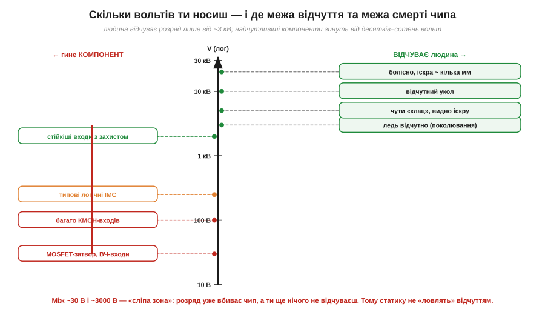
*Рис. 1.10.2.2. Праворуч — що відчуває людина: до ~3 кВ узагалі нічого, ледь відчутне поколювання від ~3 кВ, чутний «клац» та іскра від ~5 кВ. Ліворуч — від чого гинуть компоненти: найчутливіші входи вмирають уже від десятків вольт. Між ~30 В і ~3000 В — «сліпа зона»: розряд уже вбиває чип, а людина ще нічого не помічає.*

Уважно роздивімося цю драбину, бо вона — серце всієї ESD-дисципліни. Людина починає **щось** відчувати лише від приблизно 3 кВ — і то як ледь помітне поколювання. Чіткий «клац» з видимою іскрою — це вже 5 кВ і вище. Болісний укол — десятки кіловольтів. А тепер подивись ліворуч: найчутливіші входи (затвори польових транзисторів, ВЧ-входи) гинуть від **30–100 вольтів**. Типова логіка — від сотень вольтів.

Висновок приголомшливий і його треба засвоїти раз і назавжди: **між порогом загибелі чутливого чипа й порогом твого відчуття лежить майже сто разів напруги**. Тобто ти можеш убити мікросхему розрядом, якого **взагалі не помітив** — ні поколювання, ні іскри, ні звуку. Це і є та «сліпа зона» на рисунку, червона смуга між ~30 В і ~3 кВ. Саме тому статику **не можна контролювати відчуттям**: твоє тіло — поганий детектор у тому самому діапазоні, де гинуть деталі.

### Поріг відчуття проти порога ушкодження: чому це різні шкали

Варто окремо наголосити, чому пороги такі різні за природою. Поріг **відчуття** — це властивість нервової системи: щоб ти щось відчув, через нерви має пройти певний струм протягом певного часу. Статичний розряд короткий (наносекунди–мікросекунди) і несе мало заряду, тож аби розбудити нерв, потрібна висока напруга — звідси поріг у кіловольтах.

Поріг **ушкодження** чипа — це властивість його внутрішньої будови: тонесенькі ізолятори завтовшки в нанометри пробиваються вже кількома вольтами поля на собі (фізику цього розгорнемо в §1.10.5). Чипові байдуже, чи відчула щось людина; йому важливо лише, яке поле виникло на його тоненькому оксиді. Тому дві шкали — відчуття й ушкодження — це **різні фізичні явища**, які просто опинились у незручному взаємному розташуванні: ми сліпі рівно там, де чип найвразливіший.

Можна було б подумати: «гаразд, я заряджений на 3 кВ, але ж розряд короткий — невже кількох наносекунд досить, щоб щось спалити?» Досить, і ось чому. Хоча тривалість мала, **струм** у піку розряду великий: ті самі кіловольти, поділені на невеликий опір руки (≈1.5 кОм у HBM), дають піковий струм у кілька ампер. Кілька ампер крізь мікроскопічну структуру чипа — навіть на наносекунди — це колосальна густина струму й локальний нагрів. Для нервів така коротка порція майже непомітна (вони реагують на довші процеси), а для нанометрового оксиду чи тоненької доріжки — фатальна. Отже, річ не лише в напрузі, а в тому, що мала тривалість шкодить нерву мало, а чипу — багато: ще одна причина розбіжності двох шкіл.

Практичний наслідок жорсткий: **відсутність відчуття нічого не гарантує**. Можна за робочий день жодного разу не «отримати клац» — і все одно занапастити кілька компонентів прихованими розрядами зі сліпої зони. Тому досвідчений розробник не питає себе «чи відчув я статику?», а просто **завжди** працює так, ніби на ньому небезпечні кіловольти, — бо найчастіше так і є.

### Не лише людина: і виріб може бути зарядженим

Досі ми говорили про заряд на **тілі**, що розряджається в чип, — це класична «модель людського тіла». Та є й дзеркальний випадок, не менш небезпечний: заряджається **сам виріб**, а потім розряджається, торкнувшись чогось заземленого. Уяви: плату дістали зі звичайного пакета (вона набрала заряд через тертя об плівку, §1.10.1) і кладуть на металеву заземлену поверхню. У мить дотику весь заряд плати миттєво стікає через **один** вивід, що торкнувся першим, — і саме крізь нього проходить руйнівний імпульс. Тут людина взагалі ні до чого не торкалась: заряд був на самому виробі.

Цей випадок підказує дві речі. По-перше, безпека — це не лише «розрядити людину», а й «не дати зарядитись виробу»: звідси вимога до пакування й тари (§1.10.7) не електризувати вміст. По-друге, розряджати заряджений виріб теж треба **повільно** — не кидати його на голий метал, а класти на розсіювальний мат, через який заряд стече помалу, без різкого піка струму крізь одну ніжку. Знову той самий лейтмотив розділу: небезпечний не сам заряд, а **раптовість** його стікання вузьким шляхом; дай заряду розтектись повільно — і та сама кількість кулонів пройде безпечно.

Звідси й чесне уточнення до «скільки вольтів ти носиш»: питати треба ширше — скільки вольтів **на всьому**, що зараз бере участь у роботі. Заряджена людина, заряджена плата, заряджений інструмент, заряджений пакет — будь-що з цього може стати джерелом розряду в чип. Тому й заземлюють (через мегаом) не лише зап'ястя, а й мат, тару, інструмент — щоб жоден учасник не лишився під напругою.

> 🔧 **Навіщо це.** Звідси — головне правило роботи з електронікою: **не покладайся на відчуття, дій профілактично**. Не «торкнуся — як стрельне, тоді й буду обережним»: коли стрельнуло так, що ти відчув, це вже 3+ кВ, і чутливий компонент давно мертвий. Тому браслет, мат і заземлення (§1.10.6) одягають **до** роботи й завжди, а не «коли запахне статикою». Профілактика тут безальтернативна саме через сліпу зону.

Підсумуємо §1.10.2: тіло — це конденсатор ємністю близько 100 пФ, і на ньому навіть нанокулони дають кіловольти (V = Q/C); людина не відчуває розряду до ~3 кВ, а чутливі чипи гинуть від десятків вольт — між цими порогами лежить «сліпа зона», у якій ми безпорадні. Ми весь час казали «розряд», «іскра», «стрельнуло» — але ще не пояснили, **як саме** заряд проскакує крізь повітря, що взагалі-то ізолятор. Це наступне питання.

---

## 1.10.3 Пробій повітря: іскра, корона й вістря

Повітря — ізолятор. На цьому стоїть половина електротехніки: проводи в повітрі не замикаються, контакти розімкнутого вимикача не проводять. Та все ж ми бачили іскру з пальця й знаємо про блискавку. Виходить, за певних умов ізолятор-повітря раптом стає провідником — і то лавиноподібно, за частки наносекунди. Це явище зветься **пробоєм** (*breakdown*), і в нього є чіткий поріг: близько **3 кіловольти на кожен міліметр** сухого повітря. Зрозуміти механізм пробою важливо подвійно: він пояснює і нешкідливу іскру з пальця, і чому громовідвід роблять гострим, і чому гострі виводи на платі — найнебезпечніше місце для ESD.

### Електронна лавина: як ізолятор стає провідником

У повітрі завжди є кілька **вільних електронів** — їх вибиває космічне проміння й природна радіоактивність. У звичайному полі вони нічого не роблять. Але якщо поле досить сильне, один такий електрон встигає між зіткненнями з молекулами розігнатися так, що, врізавшись у молекулу, **вибиває з неї ще один електрон**. Тепер вільних електронів два, кожен розганяється й вибиває наступний — і число носіїв росте лавиною.

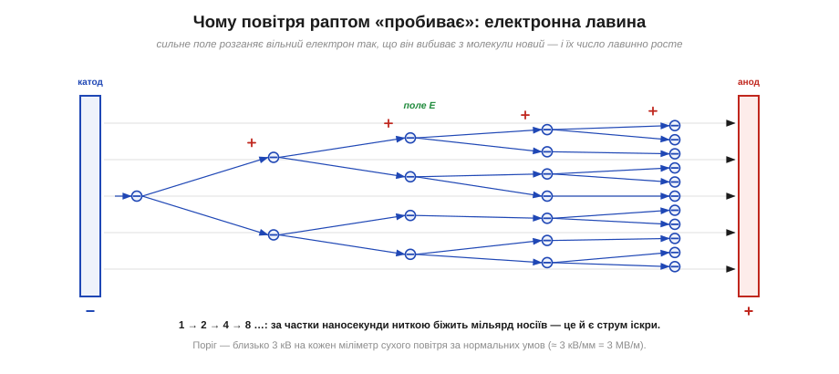
*Рис. 1.10.3.1. Сильне поле між електродами розганяє вільний електрон так, що він іонізує молекулу — вибиває з неї ще один електрон, лишаючи позаду додатний іон. Електрони множаться лавинно (1→2→4→8…), і за частки наносекунди ниткою біжить мільярд носіїв. Це і є струм іскри. Поріг — близько 3 кВ на міліметр сухого повітря (≈ 3 МВ/м).*

Ключове слово — **лавина** (*avalanche*). Поки поле слабке, електрон не встигає набрати між зіткненнями енергію, достатню для іонізації, і нічого не множиться — повітря лишається ізолятором. Але як тільки поле перевищує поріг, лавина зривається: один електрон за лічені кроки породжує мільярди, утворюючи розжарений провідний канал. Саме тому пробій такий різкий — це не плавне «потекло трошки», а раптовий обвал від нуля до повної провідності. Канал світиться (збуджені молекули віддають світло) і тріщить (різкий нагрів і розширення повітря — крихітний грім) — звідси видима іскра й чутний клац.

Звідки ж береться сам **поріг** — чому є чітка межа поля, нижче якої лавини немає, а трохи вище вона вибухає? Розгадка — у балансі двох речей: яку енергію електрон **набирає** від поля між зіткненнями й скільки йому **треба** на іонізацію молекули. Електрон у повітрі весь час налітає на молекули; середній шлях між зіткненнями зветься **довжиною вільного пробігу** й за нормального тиску дуже малий. На цьому коротенькому шляху поле підганяє електрон, додаючи йому енергію (робота сили на відстані, §1.1.4). Якщо поле слабке, набрана за пробіг енергія мала — електрон врізається в молекулу «не розігнавшись», лише трохи її струшує, і нічого не вибиває. А коли поле сягає ~3 МВ/м, набраної за один пробіг енергії якраз вистачає, щоб вибити з молекули електрон — і запускається ланцюгова реакція. Поріг — це і є та напруженість поля, за якої «розгін за один пробіг» дорівнює «ціні іонізації».

Ця картина одразу пояснює дві речі, важливі для практики. По-перше, чому пробій **залежить від тиску**: за нижчого тиску молекул менше, довжина вільного пробігу більша, електрон встигає розігнатись на меншому полі — тож розріджене повітря пробивається легше (ця залежність і ховається за кривою Пашена, до якої повернемось нижче). По-друге, чому важлива **сухість**: волога й бруд у повітрі трохи змінюють умови, але головне — волога на **поверхнях** дає заряду стекти ще до того, як напруга дійде до пробою (механізм §1.10.8). Тому «3 кВ/мм» — це орієнтир саме для чистого сухого повітря за нормального тиску.

### Правило 3 кВ/мм: скільки треба напруги на який зазор

Поріг пробою зручно тримати в голові як просте інженерне правило: щоб пробити проміжок, потрібно приблизно **3 кВ на кожен міліметр** зазору (для рівних електродів у сухому повітрі за нормальних умов).

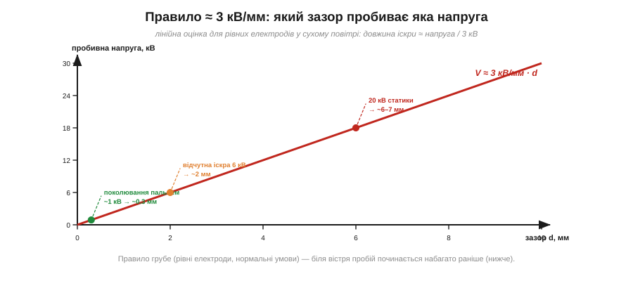
*Рис. 1.10.3.2. Пробивна напруга приблизно лінійна за зазором: V ≈ 3 кВ/мм · d. Звідси й зворотне читання: довжина іскри ≈ напруга / 3 кВ. Поколювання пальцем (~1 кВ) дає мікроіскру ~0.3 мм; відчутні 6 кВ — іскру ~2 мм; сильна статика 20 кВ — іскру ~6–7 мм.*

Це правило одразу пов'язує дві речі, які ми вже обговорювали. По-перше, **довжина іскри міряє напругу**: побачив іскру в кілька міліметрів — отже, було кілька десятків кіловольтів. По-друге, воно пояснює форму драбини з §1.10.2: укол, який людина відчуває з 3 кВ, відповідає мікроіскрі близько міліметра — рівно тоді, коли проміжок між пальцем і ручкою стає достатньо малим. А поки напруги мало (сотні вольтів), іскра не проскакує навіть впритул — заряд переходить тихо, через прямий дотик, і саме так гине чип, не давши жодного зовнішнього знаку.

**Приклад (яка іскра від 12 кВ).** Дитина з'їхала з пластикової гірки й набрала 12 кВ. З якої відстані вже проскочить іскра на металеві поручні?

```
правило:  V ≈ 3 кВ/мм · d   →   d ≈ V / (3 кВ/мм)
d ≈ 12 кВ / 3 кВ/мм
d ≈ 4 мм
```

Іскра здатна перестрибнути проміжок близько 4 мм — тобто стрельне ще до того, як палець торкнеться поручня. Це й пояснює відчуття «вдарило, хоч я ще не торкнувся».

Звідси випливає й корисне практичне правило **мінімальної відстані наближення**. Якщо ти заряджений до напруги V, то небезпечний (здатний пробитись) проміжок — приблизно V/(3 кВ/мм). Тобто чим вищий заряд, тим з більшої відстані іскра вже може стрибнути. Для роботи з електронікою це означає: «здалеку — ще не безпечно». Заряджена рука, піднесена на кілька міліметрів до виводу, може стрельнути в нього розрядом, не торкнувшись, — а для чипа з його десятками вольтів порога (§1.10.2) цього більш ніж досить. Тому правило «спершу розрядись, потім тягни руку до плати» діє навіть тоді, коли ти не збираєшся ні до чого торкатись: достатньо просто наблизитись.

Це ж пояснює, чому статику з тіла знімають **навмисно й заздалегідь** — торкнувшись великого заземленого металевого предмета *перед* роботою. Краще злити заряд контрольовано, через товстий безпечний шлях (велика площа контакту, нема чутливого оксиду), ніж дати йому стрельнути іскрою в перший-ліпший вивід. Той самий заряд, та сама фізика пробою — але результат протилежний залежно від того, **куди** ми пустили розряд.

Варто чесно зазначити межі правила. Воно для **рівних** електродів (плоских, із великим радіусом кривини) і нормальних умов. Залежність пробою від тиску й зазору насправді не строго лінійна, а описується **кривою Пашена** — і за дуже малих зазорів поводиться неочікувано. Цю тонкість розгортає вставка 🧮 [Крива Пашена](r10-s3-m-paschen.md). А зараз — найважливіший виняток із правила: вістря.

### Чому вістря: концентрація заряду й поля на кінчику

Якщо електрод не плоский, а **гострий**, пробій починається набагато раніше — при куди меншій напрузі. Причина — у тому, як заряд розподіляється по провіднику. Ми вже зустрічали це в §1.1.3: на провіднику заряд тим **густіший**, чим менший радіус кривини поверхні. На гострому кінчику заряд згущується, а густий заряд означає **сильне поле** поряд.


*Рис. 1.10.3.3. На великій кулі заряд лежить рідко, поле біля поверхні слабке. На вістрі заряд згущується на кінчику — і поле там може сягнути порога пробою, навіть коли загальна напруга помірна. Тоді біля кінчика виникає **корона** — тихий безперервний розряд. Громовідвід роблять гострим саме для цього: сильне поле на кінчику або стікає заряд короною, або приймає удар на себе.*

З цього випливають два важливі наслідки. Перший — **корона** (*corona discharge*): біля гострого зарядженого кінчика поле перевищує поріг лише в тонкому шарі повітря, тож виникає не повна іскра, а тихий, локальний, безперервний розряд — синювате світіння й шипіння. Корона повільно стікає заряд у повітря через іонізацію.

Другий наслідок — **громовідвід** (*lightning rod*). Усупереч поширеній думці, його гострий кінчик не «притягує блискавку заради краси»: гостра форма забезпечує сильне локальне поле, що, по-перше, безперервно стікає заряд короною (трохи розряджаючи хмару над собою), а по-друге, якщо удар усе ж стається, надійно приймає його на металевий стрижень і відводить струм у землю безпечним шляхом. Це пряме прикладне читання §1.1.3.

Корисно усвідомити й зворотний бік цього правила — **притуплення проти пробою**. Якщо вістря шкодить (концентрує поле й пускає корону там, де нам не треба), то рятунок — зробити поверхню **гладкою й заокругленою**. Великий радіус кривини «розводить» заряд рідше, поле біля поверхні нижче, і пробій починається пізніше. Саме тому високовольтні деталі роблять округлими, без гострих кутів і задирок: круглі екрани, тороїдальні «бублики» на верхівках високовольтних установок, згладжені краї провідників. Те саме міркування діє й у мініатюрі на платі: гладкий заокруглений вивід чи полігон концентрує поле слабше за гострий кутик доріжки, тож і ESD-пробій біля нього починається за вищої напруги. Одне правило — «гостре концентрує, гладке розводить» — працює від громовідводу до кутика мідної доріжки.

**Приклад (чому корона з вістря, а не іскра наскрізь).** Хай заряджений тонкий щуп має на кінчику радіус r ≈ 0.1 мм, а до заземленої пластини — 10 мм. Поле біля гострого кінчика приблизно в R/r разів сильніше за «середнє» поле проміжку (де R — характерний масштаб, тут ~10 мм):

```
підсилення поля ≈ R / r ≈ 10 мм / 0.1 мм = 100×
тож біля кінчика поріг пробою (≈3 МВ/м) досягається,
коли «середнє» поле ще в ~100 разів менше
→ розряд починається з тонкого шару БІЛЯ вістря (корона),
   а не одразу пробиває всі 10 мм наскрізь
```

Через стократне підсилення поля кінчик «запалюється» першим — і дає локальну тиху корону, тоді як решта проміжку ще міцно тримається. Ось чому гострі об'єкти **світяться по краях** (корона), а пробивають наскрізь лише за значно вищої напруги.

> 🔧 **Навіщо це.** Концентрація поля на вістрі — це і пастка, і інструмент. **Пастка:** на платі гострі виводи компонентів, обрізані «під корінь» ніжки, кутики доріжок і задирки — це мікрогромовідводи, що концентрують поле так само, як кінчик громовідводу. Саме звідти найчастіше починається ESD-пробій: заряджений палець ще за міліметр від плати, а поле біля гострого виводу вже сягнуло порога — і розряд стрибнув. Тому в чутливих місцях уникають голих гострих виводів, а в потужних — округлюють усе, де можливе високе поле. **Інструмент:** там, де розряд бажаний і керований, навмисно ставлять вістря чи малий проміжок, щоб пробій стався в заздалегідь обраному безпечному місці, а не випадково в чипі — на цьому стоять найстаріші захисні елементи, іскрові проміжки й газові розрядники (вставка 🔌 [Іскровий проміжок і GDT](r10-s3-c-spark-gap-gdt.md)).

### Іскра, корона й тиха провідність: три режими того самого пробою

Корисно скласти докупи режими, у яких повітря «здається» провідним, бо новачок часто плутає їх в одне. **Іскра** (*spark*) — це повний пробій проміжку: яскравий гарячий канал від електрода до електрода, різкий струмовий імпульс, тріск. Вона стається, коли поле перевищує поріг **по всьому** проміжку (або коли стример проростає його наскрізь). **Корона** (*corona*) — частковий, локальний пробій лише в тонкому шарі біля вістря, де поле понадпорогове, тоді як решта проміжку ще тримається: тихе світіння, шипіння, повільне стікання заряду без повного замикання. І, нарешті, **тиха поверхнева провідність** — узагалі не пробій повітря, а стікання заряду по вологій плівці на поверхнях (механізм §1.10.8). Три різні явища, одна спільна причина-родич: заряд шукає, де стекти, і знаходить то іскру, то корону, то плівку — залежно від поля, форми електродів і вологості.

Звідси й відповідь на питання, чому **за тієї самої напруги** іноді б'є іскрою, а іноді ні. Усе вирішує, чи встигне десь поле сягнути порога **раніше**, ніж заряд стече тихо. Гострі краї й малі проміжки штовхають до іскри/корони (поле згущується). Волога й розсіювальні поверхні штовхають до тихого стікання (заряд іде, не встигнувши накопичитись до пробою). Тому той самий заряджений предмет у сухій кімнаті стрельне іскрою, а у вологій — тихо розрядиться без жодного «клац». Це прямо пов'язує §1.10.3 з §1.10.8: пробій — лише один із можливих фіналів, і керуванням вологістю та матеріалами ми навмисно підштовхуємо заряд до **тихого**, нешкідливого шляху замість іскри в чип.

Підсумуємо §1.10.3: повітря пробивається **електронною лавиною**, коли поле перевищує близько 3 кВ/мм; це правило пов'язує напругу з довжиною іскри; а на **вістрі** заряд і поле згущуються, тож пробій (або корона) починається раніше — звідси гострий громовідвід і небезпека гострих виводів. Ми кілька разів згадали блискавку як «велику іскру» — настав час подивитись на неї прямо й переконатися, що це справді той самий пробій повітря, лише в масштабі кілометрів.

---

## 1.10.4 Блискавка — найбільший електростатичний розряд

Блискавка вражає уяву, але в основі своїй вона до банальності проста: це **той самий пробій повітря** з §1.10.3 і **те саме розділення заряду тертям** з §1.10.1 — лише в гігантському масштабі. Грозова хмара — це наелектризований «светр» завбільшки з гору, а блискавка — іскра, що проскакує, коли напруга стає завеликою. Зрозуміти блискавку якісно корисно не тому, що ми проєктуватимемо громовідводи, а тому, що вона — найнаочніша демонстрація всього, про що ми говоримо: розділення зарядів, накопичення на «обкладинках», наростання поля до порога й раптовий зрив у розряд. Це масштабна модель того, що відбувається на твоєму столі в мініатюрі.

### Як хмара набирає заряд: розділення по висоті

Перше питання — звідки в хмарі заряд. Механізм складний і досі не остаточно вивчений у деталях, але якісна картина така: всередині грозової хмари вирують потужні **висхідні потоки**, що несуть угору вологу й крижані частинки. Дрібні легкі крижані кристали й важча «крупа» (град) при зіткненнях **обмінюються зарядом** — це той самий контактний механізм, що й тертя в §1.10.1. Легкі заряджені частинки потік тягне вгору, важкі осідають донизу — і заряди **розходяться по висоті**.

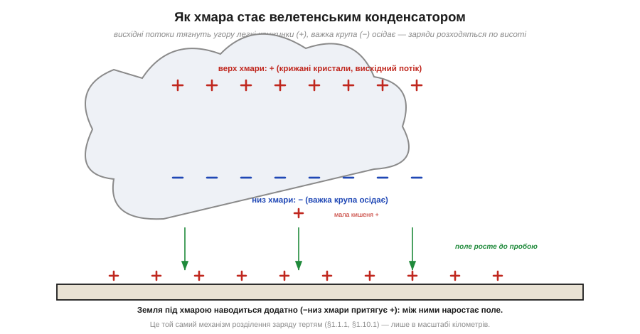
*Рис. 1.10.4.1. Висхідні потоки тягнуть угору легкі крижані кристали, що несуть переважно додатний заряд; важка крупа з від'ємним зарядом осідає в нижній частині. Хмара стає велетенським конденсатором: верх **+**, низ **−**. Земля під нею наводиться **+** (бо від'ємний низ хмари притягує додатний заряд ближче). Між низом хмари й землею наростає поле.*

Результат — хмара перетворюється на колосальний конденсатор: верхня частина заряджена додатно, нижня — від'ємно. А оскільки від'ємний низ хмари висить над землею, він **наводить** (за рахунок індукції, §1.1.8) на землі під собою додатний заряд. Тепер маємо два протилежно заряджені «листи» — низ хмари й поверхня землі — і між ними наростає електричне поле. Це точно та сама конфігурація, що тіло–земля з §1.10.2, лише з зарядом у кулонах і відстанню в кілометрах. Поле росте, аж поки десь не сягне порога пробою — і тоді починається розряд.

Зверни увагу, наскільки точно ця картина повторює настільну статику з §1.10.1, лише в іншому масштабі. Там два різні матеріали (підошва й килим) терлися й обмінювались електронами; тут два різні «матеріали» (легкі крижинки й важка крупа) стикаються й обмінюються зарядом. Там гравітація ні до чого, а розділяла заряди рука; тут заряди розділяє по висоті сила тяжіння й висхідний потік (легке вгору, важке вниз). Там результат — кіловольти на тілі; тут — сотні мільйонів вольтів між хмарою й землею. Механізм-родич, інструмент розділення інший, масштаб — несумісний. Корисно тримати цю паралель у голові: вона показує, що «велика електростатика» неба й «мала» твого столу — не дві теми, а одна, прочитана на різних масштабах.

Тут варто розв'язати уявну суперечність, яку уважний читач уже міг помітити. Якщо для пробою повітря треба ~3 МВ/м (§1.10.3), то на кілометр це 3 мільярди вольтів — а виміряні поля в грозовій хмарі набагато менші, сотні кіловольтів на метр у найсильніших місцях. Як же тоді б'є блискавка, якщо «офіційного» порога поле ніби не досягає? Відповідь у тому, що пробій на кілометри **не** вимагає порогового поля по всій довжині одразу. Досить, щоб поріг перевищився **локально** — у малому об'ємі біля краплі, крижинки чи нерівності, де поле згущується (та сама концентрація на «вістрі», що в §1.10.3). Там зривається перша мікролавина, утворюється коротка провідна ниточка — а вона своїм гострим кінцем знову згущує поле попереду себе й «пророщує» канал далі. Тобто канал не пробиває всю товщу нараз, а **сам собі прокладає** шлях, крок за кроком підтримуючи на своєму вістрі надпорогове поле. Саме тому реальний пробій стартує за середніх полів, набагато нижчих за наївні «3 МВ/м × кілометр».

### Лідер і зворотний удар: дві стадії спалаху

Тут блискавка показує гарну тонкість, якої не видно в дрібній іскрі: пробій на кілометри відбувається **не одразу**, а у дві виразні стадії.

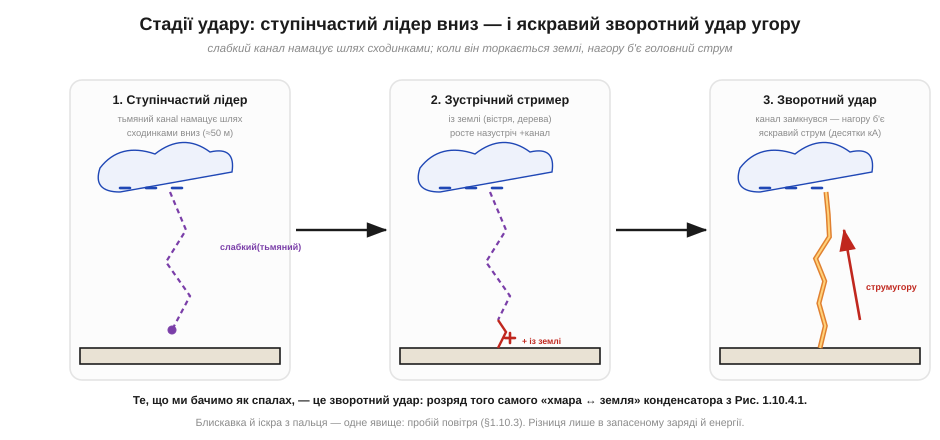
*Рис. 1.10.4.2. Спершу від хмари вниз сходинками (≈50 м кожна) намацує шлях тьмяний **ступінчастий лідер** — слабкий провідний канал. Назустріч йому з гострих об'єктів на землі (дерева, вістря) тягнуться додатні **стримери**. Коли вони змикаються, утворюється суцільний провідний канал — і ним угору б'є яскравий **зворотний удар** (десятки кілоампер). Те, що ми бачимо як спалах, — це саме зворотний удар.*

Перша стадія — **ступінчастий лідер** (*stepped leader*). Від хмари до землі стрибками, кроками приблизно по 50 метрів, прокладається слабкий, тьмяний канал іонізованого повітря. Він наче навпомацки шукає шлях найменшого опору, тому й гілкується — звідси характерна розгалужена форма блискавки. Назустріч йому, з найвищих і найгостріших точок на землі, під дією величезного поля тягнуться вгору додатні **стримери** (тут знову працює концентрація поля на вістрі з §1.10.3 — тому й б'є частіше у високі дерева й шпилі).

Чому лідер іде саме **сходинками**, а не суцільно? Бо канал росте на межі своїх можливостей: на кінчику він згущує поле до пробою, проростає на крок уперед — і там на мить «видихається», поки нова порція заряду з хмари не дотече каналом до нового кінчика й не підніме поле знову. Звідси ривковий, переривчастий ріст по ~50 метрів за раз, який і дав назву «ступінчастий». Гілкування ж — наслідок того, що пробій навпомацки пробує кілька напрямків одразу: десь канал глухне, десь росте далі, і лишається розгалужений «корінь». А оскільки до землі першим дотягнеться лише один із паростків, головний удар піде саме ним — решта гілок так і лишаться тьмяними відгалуженнями.

Тут варто чесно зауважити: далеко не кожна блискавка б'є в землю. Більшість розрядів відбувається **всередині хмари** або між хмарами — там теж є розділені заряди (Рис. 1.10.4.1) і та сама різниця потенціалів, що рветься пробоєм. Удар «хмара–земля», який ми розбираємо, — найвидовищніший і найважливіший для нас, але він лише окремий випадок загального явища «розряд між областями розділеного заряду». Фізика скрізь однакова, міняється лише, між чим саме проскакує розряд.

Друга стадія — **зворотний удар** (*return stroke*). У мить, коли лідер і зустрічний стример змикаються, канал стає суцільним провідником від хмари до землі. І тоді весь накопичений заряд ринає каналом — але **знизу вгору**: хвиля яскравого світіння й величезного струму (десятки, іноді сотні кілоампер) злітає від землі до хмари за мікросекунди. Саме цей зворотний удар ми бачимо як сліпучий спалах і чуємо як грім (різкий нагрів повітря до десятків тисяч градусів спричиняє ударну хвилю).

Чому ж так багато енергії звільняється саме на стадії зворотного удару, а не лідера? Бо лідер лише **прокладає** тонкий слабкопровідний канал — це підготовка, що несе невеликий струм. А коли канал замкнувся й став добре провідним, по ньому під дією колосальної різниці потенціалів ринає весь запас заряду майже без опору. Це як прорвана гребля: спершу вода тонкою цівкою намацує тріщину (лідер), а коли тріщина розкрилась — ринає весь об'єм (зворотний удар). Тому й видно ми майже лише зворотний удар: на ньому виділяється переважна частина енергії, і саме він розжарює канал до сліпучого спалаху.

Кілька деталей, що роблять картину повною. По-перше, удар рідко буває **один**: каналом, що вже прокладений, часто проходить кілька зворотних ударів поспіль (хмара має ще заряд), і кожен наступний лідер уже не «ступінчастий», а швидкий, біжить готовим каналом — звідси характерне **мерехтіння** блискавки, яке око ледь ловить. По-друге, напрям «знизу вгору» спершу дивує, але він логічний: канал замкнувся внизу, тож саме там першим «відпускається» заряд, і фронт розряду (область, де канал різко стає яскравим і провідним) біжить угору, до резервуара заряду в хмарі. По-третє, **спалах і грім** розділені в часі не тому, що це різні явища, а тому, що світло долітає майже миттєво, а звук ударної хвилі — повільно (близько 3 секунд на кілометр): порахувавши затримку, можна оцінити відстань до удару.

**Приклад (як далеко вдарило — за затримкою грому).** Між спалахом і громом минуло t ≈ 6 секунд. На якій відстані була блискавка? (Швидкість звуку ≈ 340 м/с, світло вважаємо миттєвим.)

```
відстань = швидкість звуку × затримка
s ≈ 340 м/с × 6 с
s ≈ 2040 м ≈ 2 км
```

Близько двох кілометрів. Зручне польове правило з цього прикладу: **кожні ~3 секунди затримки = приблизно 1 км** до удару. Це той самий «закон скінченної швидкості сигналу», що й у будь-якій хвилі, — лише тут він робить грозу зручним далекоміром.

**Приклад (порядок заряду в блискавці проти заряду на тілі).** Типовий удар переносить заряд близько Q ≈ 15 Кл. Порівняймо з тілом людини (≈0.3 мкКл із §1.10.2):

```
Q_блискавка / Q_тіло = 15 Кл / (0.3 × 10⁻⁶ Кл)
                     = 5 × 10⁷
```

Блискавка несе у **50 мільйонів разів** більший заряд, ніж людське тіло після ходи по килиму. Фізика розряду — однакова (пробій повітря), а от запасений заряд і енергія відрізняються на астрономічні порядки. Тому іскра з пальця лоскоче, а блискавка валить дерева.

### Звідки руйнівна сила: енергія й потужність удару

Заряд — лише пів картини; друга половина — **енергія** й **потужність**. Грозовий конденсатор заряджений до сотень мільйонів вольтів, і коли крізь канал проходять десятки кулонів за мікросекунди, виділяється колосальна енергія за майже миттєвий час. Саме звідси й руйнування: не просто «багато енергії», а **багато енергії за дуже короткий час** — тобто величезна потужність у вузькому каналі. Згадай §1.10.5 (яку ми зараз готуємо): там та сама думка в мініатюрі — крихітна енергія іскри руйнує чип, бо вкладається в мікрон за наносекунди. Блискавка — це той самий принцип, лише з велетенськими числами: концентрація енергії в часі й просторі важить більше за саму її кількість.

Звідси й видимі наслідки. Канал розжарюється до температур, у рази вищих за поверхню Сонця, повітря в ньому вибухово розширюється — це ударна хвиля, яку ми чуємо як грім. Дерево розколюється не від «удару» як такого, а тому, що струм миттєво **скипає** воду в деревині, і пара розриває стовбур зсередини. А струми в десятки кілоампер створюють навколо каналу потужне **магнітне поле**, що змінюється за мікросекунди, — і саме воно наводить небезпечні імпульси в усіх провідниках поблизу (до магнітного наведення курс іще дійде окремо; тут важливо, що близький удар «б'є» електроніку навіть без прямого влучення).

Корисно усвідомити й те, чому люди й тварини поряд з ударом потерпають навіть без прямого влучення. Коли струм розтікається від місця удару по землі, він створює на поверхні напруги, що **спадають з відстанню**: між двома точками землі на віддалі кроку виникає різниця потенціалів (її звуть кроковою напругою). Це той самий принцип «струм крізь опір дає напругу», лише опором тут є сам ґрунт. Для нас, людей електроніки, тут важлива загальна мораль: великий імпульсний струм у будь-якому спільному провіднику (хай то земля під ногами чи спільна «земляна» доріжка плати) породжує на ньому різниці потенціалів там, де ми наївно чекали «одну землю». До цієї думки курс іще не раз повернеться, коли йтиметься про розводку землі.

> 🔧 **Навіщо це.** Для розробника електроніки пряме влучення блискавки — рідкісний випадок, але її **наведення** дуже актуальне. Близький удар створює потужний імпульс поля, що наводить кидки напруги в довгих дротах: лініях живлення, антенах, кабелях давачів на щоглі. Тому пристрої, що працюють просто неба чи з довгими кабелями, захищають елементами на тому самому принципі керованого пробою — газовими розрядниками й варисторами (вставка 🔌 [Іскровий проміжок і GDT](r10-s3-c-spark-gap-gdt.md)). Розуміння «блискавка = розряд гігантського конденсатора» допомагає бачити, звідки прийде імпульс і де його перехопити.

Підсумуємо §1.10.4: блискавка — це розряд хмари-конденсатора, що зарядилась **розділенням зарядів** (той самий механізм, що тертя в §1.10.1), через **пробій повітря** (той самий, що в іскрі, §1.10.3); розряд іде у дві стадії — ступінчастий лідер униз і яскравий зворотний удар угору, а сам канал не пробиває кілометри нараз, а проростає, тримаючи надпорогове поле на власному кінчику. Масштаб заряду й енергії колосальний, але кожен елемент картини — знайомий нам із настільної статики. У цьому й головна цінність блискавки для нашого курсу: вона наочно доводить, що велике й мале явища — одне, і працюють за тими самими правилами. Тепер повернімося від кілометрів до нанометрів і розберемо, чому той самий розряд, тільки крихітний, **убиває мікросхему** — і часто так, що цього навіть не видно.

---

## 1.10.5 Чому мікросхеми вмирають тихо: приховані ESD-пошкодження

Ось тема, заради якої практик і читає весь цей розділ. Ми вже знаємо: тіло носить кіловольти (§1.10.2), а розряд пробиває проміжки (§1.10.3). Тепер з'єднаймо це з мікросхемою — і побачимо, чому **електростатичний розряд** (*ESD, electrostatic discharge*) — головний невидимий убивця електроніки. Найковарніше тут не те, що чип іноді гине одразу. Найгірше — що часто він **не гине одразу**, а лишається з прихованим пошкодженням і відмовляє пізніше: на тесті, у замовника, у польоті. Така «тиха смерть» руйнує довіру до пристрою сильніше за будь-яку явну поломку, бо її майже неможливо ні відтворити, ні відстежити.

### Чому чип такий тендітний: ізолятор завтовшки в нанометри

Щоб зрозуміти вразливість, треба заглянути всередину. Сучасний транзистор у мікросхемі керується **затвором** (*gate*), відділеним від кремнію тоненьким шаром ізолятора — **підзатворним оксидом**. І цей шар неймовірно тонкий: лічені нанометри, тобто **десятки атомних шарів**.

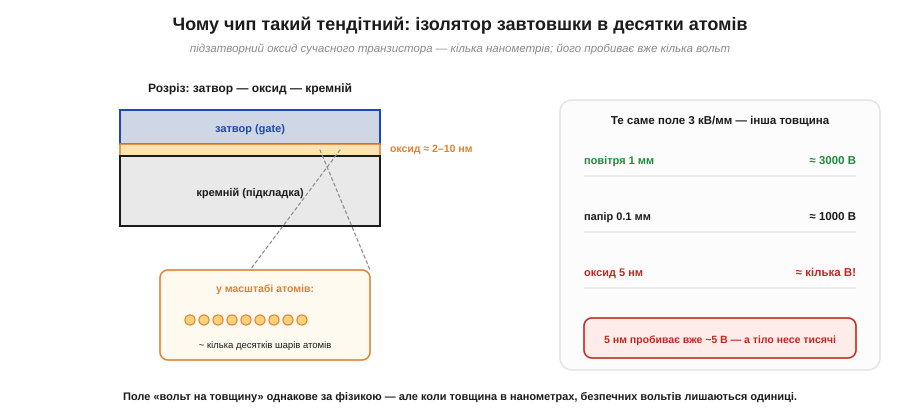
*Рис. 1.10.5.1. Підзатворний оксид сучасного транзистора — лише 2–10 нм, кілька десятків шарів атомів. Поле пробою в оксиді приблизно того ж порядку, що й «вольт на товщину» деінде, але товщина в нанометрах означає, що небезпечними стають уже одиниці вольтів: 5 нм пробиває приблизно 5 В, тоді як тіло несе тисячі.*

Тут спрацьовує проста, але немилосердна арифметика поля. Пробій ізолятора визначається не напругою як такою, а **полем** — напругою, поділеною на товщину (вольт на метр). Ми бачили, що повітря пробивається при ~3 кВ/мм. Тверді ізолятори тримають більше, але не безмежно. І коли товщина оксиду — нанометри, навіть кілька вольтів дають усередині нього колосальне поле. Ось чому затвор польового транзистора — один із найтендітніших елементів: його тоненький оксид пробивається напругою, якої людина абсолютно не помічає (згадай сліпу зону з §1.10.2).

Чому ж пробій оксиду такий **остаточний**, чому він не «відпускає», коли напруга спадає, як відпускає повітря після іскри? Бо в твердому ізоляторі пробій лишає по собі **фізичний слід**. У повітрі після розряду молекули знову розлітаються, іони рекомбінують, і проміжок відновлює ізоляцію. А в оксиді пробійний канал — це вже змінена речовина: локально перегріта, з провідною ниточкою з дефектів, інколи з домішкою матеріалу затвора, втопленого вглиб. Цей канал нікуди не зникає; він лишається провідним містком, що замикає затвор на канал транзистора. Тому пробій оксиду — **незворотний**: одна подія, і структура зіпсована назавжди. Ба більше, через цей канал тепер тече струм, що гріє його ще дужче, — пошкодження схильне **розростатись само** (теплова втеча), перетворюючи мікроскопічну ниточку на велику дірку.

Пробій оксиду — не єдиний механізм. Розряд може й **розплавити** тонесенькі металеві доріжки чи контакти всередині кристала: струм іскри хоч і короткий, але дуже інтенсивний, а провідники мікроскопічні. Може й **спекти** p-n переходи на вході (про переходи — попередні розділи курсу про провідність). Та незалежно від конкретного механізму, суть одна: енергії навіть **крихітного** розряду досить, щоб локально зруйнувати наноструктуру.

**Приклад (яке поле дає 200 В на оксиді 5 нм).** Уяви слабкий розряд, що навів лише 200 В на затворі з оксидом 5 нм. Яке поле в оксиді?

```
E = V / d
E = 200 В / (5 × 10⁻⁹ м)
E = 4 × 10¹⁰ В/м = 40 ГВ/м
```

Сорок гігавольтів на метр — це в **тисячі разів** більше за поле пробою повітря (3 МВ/м). Жоден тонкий оксид такого не витримає. І зверни увагу: 200 В — це напруга, якої людина не відчула б навіть зблизька.

Може здатися, що для руйнування потрібна велика енергія — адже ми звикли, що «спалити» щось коштує дорого. Та насправді все навпаки: енергії в розряді тіла **мізерно мало** за побутовими мірками, а шкодить вона саме тому, що вкладається в **мікроскопічний** об'єм за **наносекунди**. Прикиньмо порядок.

**Приклад (скільки енергії в розряді тіла й чому цього досить).** Тіло-конденсатор C = 100 пФ заряджене до V = 2 кВ. Скільки енергії звільнить розряд? (Енергія конденсатора W = ½·C·V² — це з Розділу 2.1, тут користуємось готовим.)

```
W = ½ · C · V²
W = ½ · (100 × 10⁻¹²) · (2000)²
W = ½ · (100 × 10⁻¹²) · (4 × 10⁶)
W = ½ · 4 × 10⁻⁴
W = 2 × 10⁻⁴ Дж = 0.2 мДж
```

Лише дві десятих міліджоуля — це менше, ніж віддає падіння канцелярської скріпки з висоти столу. За мірками побуту — ніщо. Але вся ця енергія вивільняється за наносекунди в пляму завбільшки з мікрон на краю чипа — і там вона перетворюється на локальний нагрів у тисячі градусів, якого досить, щоб розплавити доріжку чи пробити оксид. Руйнує не кількість енергії, а її **концентрація** в часі й просторі. (Скільки саме мікроджоулів потрібно різним структурам і як це рахують точніше — вставка 🧮 [Енергія іскри](r10-s5-m-spark-energy.md).)

Тут варто додати тривожну тенденцію. Що дрібнішим стає транзистор (а технології весь час «зменшуються»), то **тоншим** робиться оксид і **меншими** — структури, що відводять тепло й струм. А отже, кожне нове покоління чипів за інших рівних **вразливіше** до ESD: той самий розряд, що ледь дряпав товсту стару логіку, наскрізь пробиває тонкий сучасний оксид. Тому ESD-дисципліна з роками не слабшає, а навпаки — стає критичнішою: ми працюємо з дедалі тендітнішою «начинкою». Заспокійливе «раніше ж паяли без браслетів і нічого» не працює: раніше й оксиди були в рази товстіші, а входи — грубіші. Сучасний чутливий компонент пробачає куди менше.

Зробимо ще один наочний підрахунок, щоб відчути цю тендітність числом. Порівняймо «бюджет напруги» товстого й тонкого оксиду за одного й того самого поля пробою (візьмемо для оксиду орієнтовно ~10⁹ В/м):

```
тонкий оксид сучасного чипа:   d ≈ 3 нм
  V_проб ≈ E · d ≈ 10⁹ В/м × 3×10⁻⁹ м ≈ 3 В

товстіший оксид старішого:     d ≈ 30 нм
  V_проб ≈ 10⁹ В/м × 30×10⁻⁹ м ≈ 30 В
```

Десятикратне стоншення оксиду — десятикратне падіння безпечної напруги: з ~30 В до ~3 В. Обидва числа мізерні проти кіловольтів тіла, але різниця показова: новіший чип «здувається» від удесятеро меншого збурення. Ось чому не можна переносити старі звички на сучасні компоненти.

### Дві долі чипа: катастрофа або латентне пошкодження

Тепер головне — **що буває** після того, як розряд проскочив. Доль рівно дві, і друга набагато підступніша за першу.


*Рис. 1.10.5.2. Сильний розряд дає **катастрофічний** збій: оксид пробитий наскрізь або доріжка випарувана — чип мертвий одразу, і це видно на тесті. Слабший розряд лишає **латентне** (приховане) пошкодження: оксид лише ослаблений, тест проходить ✓, але ресурс уже з'їдено. Праворуч — крива інтенсивності відмов у часі: латентні дефекти піднімають частку ранніх («дитячих») відмов.*

Перша доля — **катастрофічний збій** (*catastrophic failure*). Розряд був сильний, пробій наскрізний, доріжка перегоріла. Чип мертвий **одразу**: не вмикається, коротить, поводиться явно неправильно. Це, як не дивно, **найкращий** із поганих сценаріїв — бо проблему видно негайно, дефектний виріб не вийде за двері, і ти знаєш, що сталося.

Друга доля — **латентне пошкодження** (*latent damage*, приховане). Розряд був слабкий — десь у тій самій сліпій зоні. Він не пробив оксид наскрізь, а лише **ослабив** його: створив мікроскопічну провідну ниточку, тоненьку тріщину, локальний дефект. Чип після цього **працює** і **проходить усі тести на виході**. Але всередині він уже поранений. Дефект із часом росте — під робочою напругою, від нагріву, від циклів увімкнення — аж поки одного дня не доросте до повного пробою. І тоді пристрій відмовляє: у замовника через місяць, у приладі в полі, у найгірший момент. Відтворити це майже неможливо, бо зовні нічого не передвіщало біди.

Чому ослаблений оксид «доростає» до пробою сам? Бо крізь тоненьку провідну ниточку, що лишив розряд, тепер постійно протікає невеликий струм витоку. Він помалу гріє й розширює дефект, той пропускає більший струм, гріється ще дужче — і так місяцями, аж поки канал не доросте до повного замикання. Виходить **повільна версія** тієї самої теплової втечі, що в катастрофі діє за наносекунди. Робоча напруга, перепади температури, цикли ввімкнення-вимкнення — усе це підштовхує процес. Тому латентний дефект — це не «майже ціло», а **закладена міна**: пристрій працює рівно доти, доки міна не дозріє.

Заради повноти згадаймо й третій, м'якший наслідок — **збій без поломки** (*upset*). Іноді розряд не руйнує нічого фізично, а лише наводить перешкоду, від якої логіка «спотикається»: чип зависає, скидається, плутає біт. Після перезавантаження він знову справний — заліза не зачеплено, постраждала тільки робота в ту мить. Для нашого розділу головні все ж перші дві долі (вони про **загибель** компонента), але корисно знати, що ESD буває й причиною загадкових «глюків» цілком живого пристрою, а не лише його смерті.

### Що вразливіше за все і чому не рятує вбудований захист

Не всі виводи однаково тендітні. Найвразливіші — ті, що ведуть **просто на тонкий оксид затвора**: входи КМОН-логіки, затвори польових транзисторів, високочастотні входи (там захист мусить бути малим, щоб не псувати сигнал). Саме тому в драбині з §1.10.2 ці входи стояли найнижче, гинучи від десятків вольтів. Менш вразливі — виводи, за якими стоять міцніші структури: силові ноги, виходи з товстими транзисторами. Тому, працюючи з платою, особливо бережуть **сигнальні входи** й роз'єми, що ведуть прямо в чутливі чипи.

Виникає природне питання: але ж виробники вбудовують у входи **захисні структури** (діоди до шин живлення, що відводять надлишок). Хіба вони не рятують? Рятують — частково, і саме тому компоненти витримують хоч щось, а не гинуть від кожного дотику. Але цей вбудований захист розрахований на **обмежені** рівні (ту саму модель тіла з §1.10.2, певні кіловольти) і має свою межу. Сильніший чи невдало прикладений розряд його перевершує. Гірше: сам захисний елемент теж може дістати латентне пошкодження — і тоді він тихо слабшає, лишаючись на вигляд справним, а наступний розряд уже проходить глибше. Тому вбудований захист — це **остання лінія**, а не дозвіл нехтувати рештою: він рятує від випадкового недогляду, але не заміняє браслет, мат і пакування.

Звідси й чесна відповідь на спокусливе «та на платі ж є захист, навіщо ці церемонії». Захист на платі бореться з тим, що **вже сталося**, і в межах свого запасу. Браслет і пакування борються з тим, щоб розряд **не стався взагалі**. Це різні рубежі, і покладатись лише на останній — означає весь час випробовувати його межу й накопичувати латентні дефекти в самому захисті. Надійність дає лише сукупність рубежів, а не один із них.

### Чому латентні відмови такі дорогі

Праворуч на Рис. 1.10.5.2 — крива інтенсивності відмов у часі (інженери звуть її «ванною»). У нормі вона має невеликий горб ранніх, «дитячих» відмов, довге пласке дно надійної служби й підйом наприкінці ресурсу. Латентні ESD-дефекти **піднімають передню частину** цієї кривої: пристроїв, що відмовляють у перші тижні-місяці, стає більше. Для виробника це прямі збитки — гарантійні заміни, репутація, відкликання партій, — і все через розряд, якого ніхто не відчув на складанні.

Саме тому ESD-захист — це не «педантизм», а економіка надійності. Один непомічений дотик голим пальцем до виводу може не вбити плату на столі, але закласти в неї міну сповільненої дії. І ось чому стандарти випробувань на стійкість до ESD такі суворі: пристрої навмисно «б'ють» каліброваними розрядами, щоб виявити слабкі місця **до** того, як це зробить життя (про методику — вставка 🔌 [ESD-симулятор і рівні IEC 61000-4-2](r10-s5-c-esd-gun.md)).

Варто відчути й **масштаб** цієї економіки. Компонент, убитий на столі, коштує копійки — його просто замінюють. Той самий компонент із латентним дефектом, що відмовив у зібраному пристрої в замовника, коштує вже на порядки більше: виїзд, діагностика, демонтаж, репутаційні втрати, а в критичному застосуванні (медицина, авіоніка, борт апарата) — потенційно й безпека. Вартість відмови **росте** з кожним етапом, на якому її не зловили: дешево на вході, дорого в полі. Тому ESD-дисципліна на складанні — це не витрата, а **дешеве страхування** від набагато дорожчих відмов потім. Кожен браслет і пакет окупається тим, що ловить проблему на найдешевшому етапі — поки компонент іще на столі, а не в руках користувача.

> 🔧 **Навіщо це.** Латентність повністю перевертає логіку роботи. Не можна міркувати «плата ж працює — значить, я нічого не зіпсував». Працює — ще не значить ціла. Тому ESD-дисципліну дотримують **завжди й до кінця**, навіть коли «нічого ж не сталося»: бо те, що сталося, могло й не проявитись одразу. Це той рідкісний випадок, коли відсутність видимого результату нічого не доводить — і саме тому профілактика (наступні теми) безальтернативна.

Підсумуємо §1.10.5: чипи тендітні через **нанометрові ізолятори**, що пробиваються одиницями вольтів; розряд або вбиває чип **одразу** (катастрофа — її видно), або лишає **латентний** дефект, який тест пропускає, а пристрій відмовляє пізніше. Друге — найдорожче й найпідступніше. Висновок очевидний: статику треба не «ловити», а **не давати їй виникнути й накопичитись**. Як саме облаштувати для цього робоче місце — наступна тема.

---

## 1.10.6 Антистатичне робоче місце: браслет, мат, заземлення

Усі попередні теми вели до одного практичного питання: **як працювати з електронікою так, щоб її не вбити?** Відповідь — облаштувати робоче місце так, щоб статиці не було де накопичитись, а будь-який заряд стікав **повільно й безпечно** в одну спільну землю. Це не набір окремих гаджетів, а єдина продумана система: браслет, настільний мат і заземлення, з'єднані за чіткими правилами. І в кожному з цих елементів незмінно зустрічається загадковий резистор на **1 мегаом** — розберемося й чому саме він.

### Головна ідея: усе на одному потенціалі

Ключ до всього — стара думка з §1.1.1: різниця потенціалів небезпечна, **однаковий потенціал — ні**. Розряд тече тоді, коли між двома точками є різниця напруг. Якщо ж усе на робочому місці — твоє тіло, виріб, інструмент, мат — тримати на **тому самому** потенціалі, то між ними просто нема чому розряджатися. Заряд може стекти кудись назовні, але **не крізь чутливий виріб**.

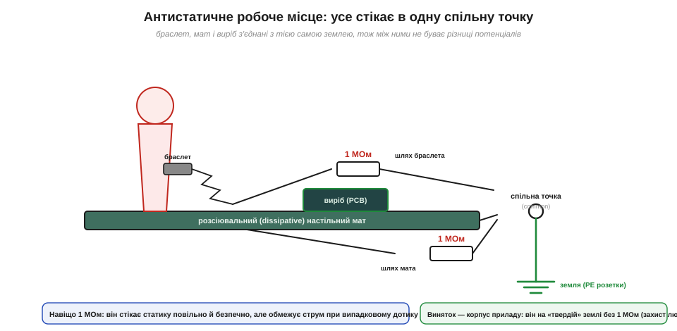
*Рис. 1.10.6.1. Браслет на зап'ясті, настільний мат і виріб ведуть до однієї **спільної точки** (common point), а вона — до землі розетки. У шляху браслета й мата стоїть по 1 МОм. Корпус приладу при цьому заземлений «твердо», без 1 МОм. Так між тілом, матом і виробом ніколи не виникає різниці потенціалів — розряджатися нема чому.*

Розгляньмо елементи. **Антистатичний браслет** (*wrist strap*) — провідний ремінець на зап'ясті, з'єднаний шнуром із землею. Він **постійно** стікає заряд із тіла, не даючи накопичитись тим кіловольтам із §1.10.2. **Настільний мат** (*mat*) — розсіювальне покриття столу, на якому лежить виріб; він теж заземлений і вирівнює заряд на всьому, що на ньому стоїть. **Спільна точка** (*common ground point*) — вузол, куди сходяться всі заземлення, щоб гарантовано бути одним потенціалом. Усе це — пряме застосування заземлення з §1.1.1: під'єднати до велетенського резервуара заряду (землі), щоб прибрати надлишок.

> 🔧 **Навіщо це.** Браслет важливіший за все інше разом узяте — бо людина є головним носієм статики. Але працює він, лише поки **надітий на голу шкіру й під'єднаний**: браслет «на потім», звисаючий зі столу, або вдягнений поверх рукава — нуль захисту. Перед роботою з чутливим виробом порядок такий: спершу надів і під'єднав браслет, став заземленим — і **лише тоді** дістаєш плату з екранувального пакета (§1.10.7). Що саме всередині браслета й мата і як перевірити їх тестером — вставка 🔌 [Браслет, мат і тестер браслетів](r10-s6-c-wrist-strap.md).

Тут важливо зрозуміти, чому система працює саме як **єдине ціле**, а не як набір окремих заземлень. Якби браслет вів в одну землю, мат — в іншу, а прилад — у третю, між цими «землями» могла б виникати різниця потенціалів (вони ж розведені різними дротами з різним опором). А різниця потенціалів — це рівно те, чого ми боїмося: вона жене розряд. Тому всі заземлення зводять в **одну спільну точку** й уже від неї ведуть до землі. Це зветься **вирівнюванням потенціалів** (*equipotential bonding*): мета — не стільки «з'єднати з землею», скільки зробити так, щоб тіло, мат і виріб були **рівні між собою**. Навіть якби ця спільна точка раптом «попливла» по потенціалу, попливла б вона разом з усім — а отже, всередині робочого місця розряджатись усе одно нема чому. Заземлення тут — спосіб тримати рівність, а не самоціль.

Звідси й чесне застереження про **інший** бік: працювати «без заземлення взагалі» гірше, ніж здається. Якщо браслет ні до чого не під'єднаний, тіло **плаває** (floating) — воно не стікає заряд, а просто накопичує його, як і раніше. Гірше: іноді люди, боячись струму, навмисно лишають усе ізольованим — і тоді чутливий виріб, узятий у руки, заряджається разом із тілом до тих самих кіловольтів, а вб'є його перший же дотик до чогось заземленого. Тому правильна відповідь — не «уникати землі», а **під'єднатись до неї правильно**, через резистор, про який далі.

Чому ж не обійтися без браслета, просто **час від часу торкаючись** заземленого предмета, щоб «скинути» заряд? Тому що це знімає заряд лише в **одну мить** — а вже за наступний рух (поворот у кріслі, потягнувся за деталлю) тіло набирає нові кіловольти, і до наступного дотику ти знову небезпечний. Періодичне розряджання — як вичерпувати воду з дірявого човна вряди-годи: між «черпаннями» вода (заряд) знову набігає. Браслет натомість тримає стік **постійно відкритим**, тож заряд не встигає накопичитись узагалі. Різниця між «іноді торкнутись» і «постійно під'єднаний» — це різниця між кількома небезпечними мілісекундами на кожен рух і **повною** відсутністю накопичення. Для чипа з його сліпою зоною (§1.10.2) тільки друге надійне.

### Чому скрізь стоїть 1 мегаом

Тепер та сама загадка: чому в браслеті й маті завжди вшито резистор приблизно на **1 МОм**? Чому не з'єднати тіло із землею просто дротом — стікало б іще краще? Відповідь — у тому, що цей резистор мусить догодити **двом вимогам одразу**, які тягнуть у протилежні боки.


*Рис. 1.10.6.2. Якби заземлення було пряме (0 Ом), випадковий дотик зап'ястям до фази 230 В пустив би крізь тіло десятки міліампер — смертельно (з §1.2.13). Якби опір був завеликий (1 ГОм), стала часу стікання τ = R·C стала б завеликою, і статика не встигала б стікати. 1 МОм влучає між: дотик до 230 В дає лише ~0.23 мА (безпечно), а τ = 1 МОм · 100 пФ ≈ 0.1 мс (стікає швидко).*

Перша вимога — **безпека людини**. Якщо тіло заземлене прямим дротом (0 Ом) і ти ненароком торкнешся фази мережі, увесь струм піде крізь тебе в землю. При 230 В і типовому опорі тіла це десятки міліампер — небезпечний для життя струм (ми це обговорювали в §1.2.13). Отже, потрібен **послідовний опір**, що обмежить струм при випадковому дотику до напруги.

Друга вимога — **швидке стікання статики**. Заряд тіла стікає через резистор за час порядку сталої τ = R·C (де C — ємність тіла, ~100 пФ). Якщо опір завеликий (наприклад, 1 ГОм), τ виходить великою, і заряд встигає накопичитись між стіканнями. Отже, опір не має бути завеликим.

Тут варто наголосити, що це **компроміс**, а не точне магічне число. Дві вимоги тягнуть у протилежні боки: безпека хоче опір **більший** (менший струм при дотику до фази), швидкість стікання хоче опір **менший** (мала стала часу). Між «не менше, ніж треба для безпеки» і «не більше, ніж дозволяє стікання» лежить широке вікно — приблизно від сотень кілоом до десятків мегаом, — і 1 МОм просто зручно сидить посередині цього вікна, з добрим запасом в обидва боки. Тому в браслетах і трапляються номінали трохи різні (часто саме 1 МОм, інколи більше): важлива не точна цифра, а те, щоб опір лишався в цьому безпечно-дієвому вікні. Перевіримо тепер обидва боки числом.

**Приклад (1 МОм задовольняє обидві вимоги).** Безпека: який струм крізь людину при дотику до 230 В через 1 МОм? Швидкість: яка стала часу стікання при C ≈ 100 пФ?

```
Безпека (струм при дотику до фази):
I = V / R = 230 В / 1 000 000 Ом
I ≈ 0.23 мА        — нижче порога відчуття, безпечно (пор. §1.2.13)

Швидкість (стала часу стікання заряду тіла):
τ = R · C = (1 × 10⁶ Ом) · (100 × 10⁻¹² Ф)
τ = 1 × 10⁻⁴ с = 0.1 мс    — заряд стікає майже миттєво
```

0.23 міліампера — людина навіть не відчує; 0.1 мілісекунди — статика стікає швидше, ніж устигне нашкодити. Одне число, 1 МОм, влучає в обидві цілі. Часто опір розкладають: ~1 МОм у браслеті плюс ~1 МОм у маті — щоб навіть пошкодження одного шляху лишало захист.

Варто відчути, наскільки 0.1 мс — це швидко в людських масштабах. Заряд стікає не миттєво, а за експонентою (точну форму розрядки RC побачимо в Розділі 2.1): за одну сталу часу залишається близько 37% заряду, за п'ять сталих — менш як 1%. П'ять сталих по 0.1 мс — це 0.5 мс, пів тисячної частки секунди. Тобто від моменту, коли ти став заземленим через браслет, до моменту, коли від кіловольтів не лишилось і відсотка, минає менше мілісекунди — ти й оком не встигнеш кліпнути. Ось чому надітий браслет тримає тіло «розрядженим» **безперервно**: будь-який свіжонабраний заряд зникає швидше, ніж устигаєш до чогось доторкнутись.

**Приклад (за скільки браслет «здуває» кіловольти).** Тіло C = 100 пФ заряджене до 4 кВ, браслет із резистором 1 МОм. За який час напруга впаде до безпечних ~100 В? (Розрядка: V(t) = V₀·e^(−t/τ), τ = R·C = 0.1 мс.)

```
треба:  V(t)/V₀ = 100 / 4000 = 0.025
e^(−t/τ) = 0.025   →   t = τ · ln(1/0.025) = τ · ln(40)
ln(40) ≈ 3.7
t ≈ 0.1 мс × 3.7 ≈ 0.37 мс
```

Менш ніж за пів мілісекунди тіло падає з 4 кВ до сотні вольтів. Жоден рух людини не встигає за цим — тому при справному браслеті небезпечні кіловольти на тілі просто не накопичуються.

### Виняток із правила: корпус приладу — «тверда» земля

Важлива тонкість, яку видно на Рис. 1.10.6.1: резистор 1 МОм стоїть у шляхах **антистатичного** захисту (браслет, мат), але **не** на корпусі приладу. Металевий корпус, що може опинитись під небезпечною напругою при несправності, заземлюють «твердо», прямим провідником захисного заземлення (PE) розетки — без жодного мегаома. Логіка протилежна: тут опір нам **не** потрібен, навпаки — треба, щоб при пробої на корпус великий струм миттєво пішов у землю й вибив запобіжник, рятуючи людину. Тобто 1 МОм — це інструмент **антистатики** (повільне стікання + захист від дотику до фази), а не захисного заземлення (миттєвий злив аварійного струму). Плутати ці дві землі не можна.

> 🔧 **Навіщо це.** Розрізняти «антистатичну землю через 1 МОм» і «захисну землю напряму» — питання і деталей, і людської безпеки. Якщо хтось «для надійності» закоротить браслет прямо на землю (прибравши 1 МОм), він перетворить засіб захисту електроніки на смертельну пастку при дотику до фази. А якщо, навпаки, заземлити корпус приладу через 1 МОм, аварійний струм не зможе вибити запобіжник. Кожне з двох заземлень робить свою роботу — і саме тому вони різні.

### Типові помилки й чому місце треба перевіряти

Антистатичне місце оманливо просте на вигляд — і саме тому в нього легко закрастись «тихим» помилкам, через які захист є лише номінально. Перша й найчастіша — **браслет, що не контактує зі шкірою**: надітий поверх рукава, пересохлий, із брудним контактом. Зовні все «як треба», а насправді тіло ізольоване й накопичує заряд, як без браслета. Друга — **обрив у шнурі браслета**: тоненький провідник усередині спіралі ламається від згинань, і ланцюг тихо розривається. Третя — **незаземлений мат**: мат лежить, але його провідник нікуди не під'єднано, тож він лише вирівнює заряд на собі, не зливаючи його. Усі ці помилки об'єднує те, що вони **невидимі**: місце виглядає робочим, а захисту немає.

Звідси й практика **перевірки**. Браслет і мат не приймають на віру, а контролюють: щодня (а в серйозних умовах — щоразу перед роботою) перевіряють опір ланцюга «зап'ястя — земля» тестером браслетів, який показує, чи лежить опір у потрібному вікні (приблизно в районі того самого мегаома: не обрив і не коротке). Там, де ціна помилки висока, ставлять **безперервний монітор** (*continuous monitor*) — пристрій, що весь час стежить за ланцюгом браслета й пищить, щойно контакт зник. Це теж пряме застосування думки зі сліпої зони (§1.10.2): оскільки людина не відчуває ні статики, ні обриву браслета, надійність дає лише **вимірювання**, а не відчуття.

Корисно й узагальнити саме поняття «земля» в цьому контексті. У книзі «земля» вже з'являлась у кількох ролях, і їх не можна змішувати: є **захисна земля** розетки (для безпеки людини, тверда, без опору), є **сигнальна/опорна земля** схеми (нуль відліку напруг) і є **антистатична земля** робочого місця (для повільного стікання заряду, через мегаом). Фізично вони часто сходяться в одній точці будівлі, але роль у кожної своя. Плутанина ролей — джерело і небезпек (як із браслетом без 1 МОм), і загадкових завад. Тримаючи в голові «яка це земля й для чого», легше не наробити саме тих помилок, що роблять захист уявним.

Підсумуємо §1.10.6: антистатичне місце тримає тіло, виріб і мат на **одному потенціалі**, зливаючи заряд у спільну землю; повсюдний резистор **1 МОм** — це компроміс між швидким стіканням статики й захистом людини від випадкового дотику до напруги; корпус приладу при цьому заземлюють **твердо**, без опору. Браслет і мат стерегли виріб **на столі**. Але виріб ще треба десь зберігати й кудись везти — а там браслета не надінеш. Як захищати компоненти в дорозі — наступна тема.

---

## 1.10.7 Пакування й транспортування: розсіювальні та екранувальні пакети, тубуси, котушки

Коли компонент лежить на заземленому маті під захистом браслета — він у безпеці (§1.10.6). Але більшу частину життя деталь проводить **не на столі**: на складі, у коробці, у дорозі від виробника до тебе. Там немає ні браслета, ні мата — лише пакування. Тому правильна тара так само критична, як правильний стіл. І тут на новачка чекає головна пастка всього розділу: інтуїтивне переконання, що «антистатичний пакет = захист». Насправді пакування буває **кількох різних класів**, і вони захищають від **різних** небезпек. Сплутати їх — означає везти чутливу мікросхему в тому, що її не захищає.

### Три класи матеріалів: антистатичний, розсіювальний, екранувальний

Розберемо три типи плівок і коробок за двома ознаками: чи **електризується** сам матеріал і чи **екранує** він вміст від зовнішнього поля.

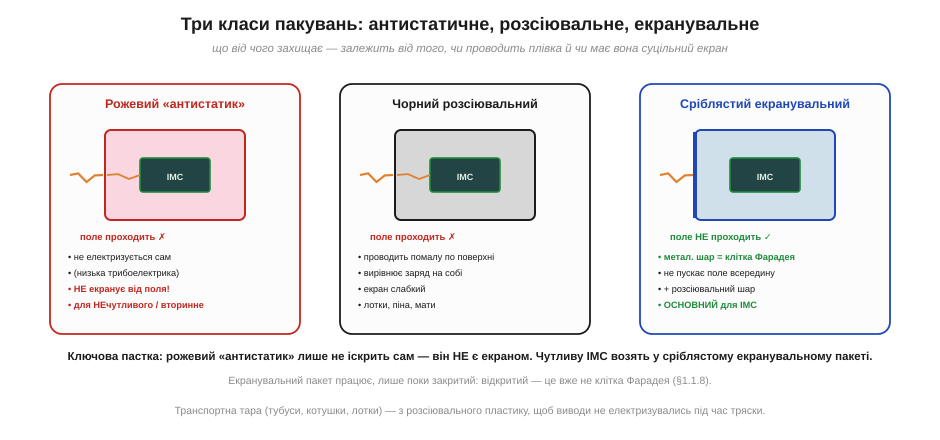
*Рис. 1.10.7.1. **Рожевий «антистатик»** не електризується сам, але поле зовні пропускає — це НЕ екран. **Чорний розсіювальний** проводить помалу по поверхні, вирівнюючи заряд на собі. **Сріблястий екранувальний** має металевий шар — справжню клітку Фарадея, що не пускає поле всередину; це основна тара для чутливих ІМС. Зверни увагу: екранувальний пакет працює, лише поки закритий.*

Перший клас — **антистатичний** (*antistatic*), знайомий рожевий або рожево-прозорий поліетилен. Його єдина чеснота: він **сам не електризується** при терті (на відміну від звичайної плівки, що стоїть скраю трибоелектричного ряду). Тобто він безпечний як **обгортка** й підкладка. Але — і це треба підкреслити тричі — він **не екранує**: зовнішнє поле й розряд проходять крізь нього до вмісту. Рожевий пакет годиться для нечутливих деталей або як вторинне пакування, але **не** для голої чутливої мікросхеми.

Другий клас — **розсіювальний** (*dissipative*), зазвичай чорний пластик, піна, мати, лотки. Він **проводить помалу** по поверхні (опір середній — між ізолятором і металом), тож заряд на ньому не застрягає точково, а розтікається й повільно стікає. Це матеріал столу й тари, що сама не накопичує заряд і безпечно знімає його з покладених деталей. Слабкий екран, але непогане «вирівнювання».

Третій клас — **екранувальний** (*shielding*), той сріблястий металізований пакет, у якому приходять плати й мікросхеми. Він має тонкий **металевий шар**, що утворює справжню **клітку Фарадея** (§1.1.8): зовнішнє електричне поле всередину не проникає, а зовнішній розряд обтікає пакет по поверхні, не торкаючись вмісту. Зазвичай він багатошаровий: усередині розсіювальний шар (щоб не іскрило об саму деталь), назовні — металевий екран. Це **основна** тара для чутливих компонентів.

Варто докладніше зрозуміти, **чому** металевий шар захищає, — бо це пряме застосування клітки Фарадея з §1.1.8. Коли заряджений палець або інструмент торкається пакета зовні, розряд приходить на **зовнішню** металеву оболонку. А в провіднику надлишковий заряд і струм течуть **по поверхні**, не заходячи всередину (це ми бачили для зарядженого провідника в §1.1.6 і для екранування в §1.1.8). Тож увесь струм розряду розтікається по зовнішньому шарі пакета й стікає геть, а всередині — там, де лежить плата — поля від цього майже немає. Виходить, екранувальний пакет не «поглинає» розряд і не «гасить» його якоюсь хитрою речовиною — він просто **відводить** струм в обхід вмісту по своїй металевій шкірці. Саме тому ціла оболонка критична: дірка, надрив чи відкритий верх руйнують клітку, і розряд знаходить шлях усередину.

> 🔧 **Навіщо це.** Запам'ятай головну пастку: **рожевий ≠ екран**. Везти процесор або датчик у рожевому «антистатику» — все одно що везти яйце в паперовому конверті: само не подряпає, але від удару ззовні не врятує. Чутливі ІМС возять **тільки** в сріблястому екранувальному пакеті. І ще: екранувальний пакет — це клітка Фарадея, лише поки **закритий**. Відкрив, заглянув, поклав плату зверху на пакет — і екран уже не працює (§1.1.8). Тому дістають виріб із пакета вже **на заземленому місці**, ставши заземленим через браслет.

### Дві різні роботи пакування: «не родити» й «не пустити»

Щоб три класи не злились у голові в кашу, корисно явно розвести **дві задачі**, які пакування може виконувати, — бо саме їх плутанина й народжує пастку «рожевий = захист». Перша задача — **не родити заряд самому** (low charging): матеріал не повинен сильно електризуватись від тертя об вміст і об усе довкола. Це вміють і антистатичний (рожевий), і розсіювальний матеріали — обидва стоять близько до середини трибоелектричного ряду й не іскрять. Друга задача — **не пустити зовнішній розряд і поле всередину** (shielding): а це вміє **лише** екранувальний пакет із суцільним металевим шаром.

Рожевий «антистатик» виконує **тільки першу** задачу й геть не виконує другу — звідси й уся плутанина. Він безпечний як підкладка чи обгортка (сам не нашкодить), але голу чутливу ІМС від зовнішнього удару не врятує. Екранувальний пакет — навпаки — закриває обидві задачі одразу (зовні екран, усередині розсіювальний шар), тому він і основний. Тримаючи в голові цю пару «не родити / не пустити», легко перевірити будь-яку тару: спитати, котрі з двох робіт вона реально робить — і чи цього досить для саме цього компонента.

Окремо про **піну й поролон**. Темна провідна (розсіювальна) піна, у яку втикають ніжки мікросхем, робить ще третю корисну річ: вона **замикає всі виводи між собою**. Поки всі ноги чипа на одному потенціалі, між ними не виникає різниці напруг — а отже, нема чому пробити вхід відносно живлення. Це той самий принцип «усе на одному потенціалі» з §1.10.6, лише в мініатюрі для одного компонента. А от звичайний білий пакувальний пінопласт — навпаки, чудовий ізолятор, що шалено електризується від тертя; класти на нього електроніку не можна.

Проженімо три класи через один конкретний сценарій — **заряджена людина бере пакет із полиці** — щоб різниця стала відчутною. Випадок із рожевим пакетом: рука торкається плівки, але та поля не екранує, тож наведене зарядженою рукою поле спокійно проходить крізь стінку до плати; якщо при цьому пакет іще й лежить на чомусь, через що заряд може перерозподілитись, плата дістає удар. Випадок із розсіювальним: трохи краще — заряд із руки помалу розтечеться по провідній поверхні пакета, але суцільного екрана все одно немає. Випадок із екранувальним: рука торкається зовнішнього металевого шару, увесь заряд розтікається по ньому й стікає геть, а всередині — там, де плата — поля майже немає (клітка Фарадея). Той самий дотик зарядженої руки — три різні результати: пробій, напівзахист, повний захист. Ось чому для справді чутливого возять саме екранувальне.

**Приклад (наскільки екран послаблює поле).** Хай заряджений предмет створює зовні пакета поле, що відповідає кільком кіловольтам. Металевий шар екранувального пакета — провідник, тож усередині суцільної цілої оболонки поле спадає практично до нуля:

```
зовні оболонки:        E_зовн — від зарядженого предмета (сильне)
всередині провідної
суцільної оболонки:    E_всер ≈ 0   (екранування провідником, §1.1.8)
→ виріб усередині «не бачить» зовнішнього поля
АЛЕ: дірка / надрив / відкритий верх
→ оболонка вже не суцільна, поле проникає → захисту немає
```

Висновок числа простий і жорсткий: цілий закритий екран послаблює зовнішнє поле майже до нуля, а от **порушений** (відкритий, надірваний) екран не послаблює майже нічого. Тому стан пакета — «закритий і цілий» — це не формальність, а умова, без якої вся ідея екранування не працює.

### Тара для виводів: тубуси, котушки, лотки

Окремо — про тару, що тримає **багато однакових компонентів**. Тут до електричної вимоги додається ще й **механічна**: компоненти не повинні совгатись і терти виводами один об одного й об стінки (бо це знову контакт-розрив, §1.10.1).

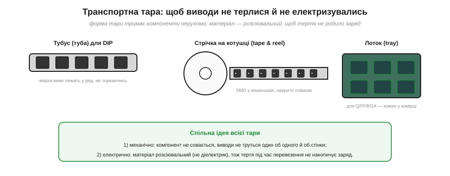
*Рис. 1.10.7.2. **Тубус (туба)** тримає DIP-мікросхеми в ряд, не даючи їм торкатись. **Стрічка на котушці** (tape & reel) несе SMD-компоненти в окремих кишеньках під плівкою. **Лоток (tray)** дає кожному QFP/BGA свою комірку. Усе це — з розсіювального пластику, щоб тряска в дорозі не родила заряд.*

**Тубус** (*tube*) — довга планка-жолоб, у якій мікросхеми в корпусі DIP лежать рядком, кожна у своїй позиції, не торкаючись сусідів. **Стрічка на котушці** (*tape & reel*) — основний спосіб для SMD: компоненти сидять у штампованих кишеньках паперової чи пластикової стрічки, накриті плівкою, і стрічка намотана на котушку (так їх і подають у автомати складання). **Лоток** (*tray*, часто стандарту JEDEC) — пластикова таця з комірками-гніздами під великі корпуси QFP і BGA. У всіх трьох випадках працює та сама подвійна ідея: **механічно** зафіксувати, щоб виводи не терлись, і зробити тару з **розсіювального** матеріалу, щоб саме перевезення не накопичувало заряд.

**Приклад (чому форма тари важить не менше за матеріал).** Уяви 1000 мікросхем, насипом у звичайному пакеті, у кузові авто на вибоїстій дорозі. Оцінимо порядок числа контактів-розривів за поїздку:

```
тряска ≈ кілька коливань на секунду  →  ~3 Гц
поїздка ≈ 1 година  →  3600 с
циклів струсу ≈ 3 × 3600 ≈ 10⁴ на компонент
× 1000 компонентів × (десятки контактів за струс)
≈ 10⁸ – 10⁹ актів контакт↔розрив за поїздку
```

Сотні мільйонів мікроперетинів заряду — і якби пакет був зі звичайної плівки, кожен компонент приїхав би наелектризованим до кіловольтів. Ось чому насип у будь-чому — погано: навіть у непоганому матеріалі тертя виводів сама себе генерує статику. Тара має тримати деталі **нерухомо**.

Зверни увагу, що тут об'єднуються **обидві** небезпеки розділу. Рух у тарі — це джерело заряду (контакт-розрив, §1.10.1), а зіткнення виводів об стінки — ще й шанс на дрібний розряд між зарядженими деталями. Тому хороша тара водночас і не дає **родитись** заряду (розсіювальний матеріал), і не дає компонентам **рухатись** (форма-фіксація). Це знову та сама пара задач, що й для пакетів вище, лише тепер механічна фіксація виходить на перший план: для розсипу дрібних SMD саме нерухомість важливіша за все, бо їх багато й вони легкі, тож труться найохочіше.

> 🔧 **Навіщо це.** Практичне правило приймання: компонент має лишатись у заводській тарі (стрічці, тубусі, лотку, екранувальному пакеті) аж **до моменту встановлення** на заземленому місці. Перекладати чутливі деталі «у щось своє» — звичайну коробочку, пакетик, поролон — це або зняти екран, або додати тертя, або і те, й те. А там, де заземлити тару взагалі не можна (скажімо, рухома лінія), заряд знімають іонізатором повітря — вставка 🔌 [Іонізатор повітря](r10-s7-c-ionizer.md).

### Як пакування й стіл працюють у парі: правильна послідовність

Пакування саме по собі лишає одну небезпечну мить — **момент діставання**. Поки плата в закритому екранувальному пакеті, вона захищена; коли вона вже на заземленому маті під браслетом — теж. Але між цими станами є секунда, коли пакет відкрито, а плату ще не «прив'язано» до спільної землі. Якщо в цю мить ти заряджений, перший же дотик до виводу пустить розряд просто в чип. Тому пакування й стіл (§1.10.6) — це не два окремі заходи, а **одна послідовність**, і порядок дій критичний.

Правильний порядок такий. Спершу — стати заземленим: надіти браслет на голу шкіру й під'єднати, прибрати зі столу зайві діелектрики. Тоді — покласти **закритий** пакет на заземлений мат, щоб його зовнішній заряд (якщо він є) стік на мат. І лише після цього відкрити пакет і дістати плату, тримаючи її за краї. Зворотний шлях — дзеркальний: повертати виріб у пакет теж на заземленому місці. Сенс простий: ми ніколи не лишаємо чутливий виріб «голим» поза спільним потенціалом. Пакет передає його з рук у руки заземленому столу, як естафету, без жодної незахищеної миті.

Звідси випливає й те, чому **тару теж заземлюють** там, де це можливо. Металеву котушку, тубус чи лоток у складальному цеху не просто кладуть, а ставлять на заземлену поверхню або в заземлене гніздо: щоб заряд, наведений під час перевезення, стік ще до того, як автомат візьме компонент. Це той самий принцип «усе на одному потенціалі» (§1.10.6), розширений з робочого столу на весь шлях деталі — від складу до місця на платі.

Варто згадати й сусідню, хоч і відмінну, проблему — **вологу всередині пакета**. Деякі компоненти (зокрема у пластикових корпусах) бояться поглинутої вологи: при швидкому нагріві паяння вона скипає й розриває корпус. Тому такі деталі возять у герметичних **вологозахисних** пакетах із пакетиком-осушувачем та індикатором вологості. Це **не** про статику (механізм геть інший), але про те саме пакування — і плутати дві функції не варто: екранувальний пакет захищає від розряду, вологозахисний — від вологи. Гарна тара часто поєднує обидві властивості, але це дві різні роботи, як і «не родити / не пустити» вище.

Підсумуємо §1.10.7: пакування буває **антистатичне** (само не іскрить, але не екранує), **розсіювальне** (повільно проводить, вирівнює заряд) і **екранувальне** (клітка Фарадея — основна тара для чутливих ІМС); головна пастка — плутати рожевий «антистатик» з екраном. Транспортна тара (тубуси, котушки, лотки) додатково тримає виводи **нерухомо**, щоб тряска не родила статику. Ми не раз згадували, що сухе повітря все погіршує. Час нарешті розібратися, **чому** — і як керувати статикою через середовище.

---

## 1.10.8 Вологість і матеріали: керування статикою в середовищі

Остання тема розділу зводить усе докупи через одне спостереження, знайоме кожному: **взимку статики більше**. Тріщить одяг, б'є дверна ручка, прилипає до руки пил — а влітку того майже немає. Чому? І як цим скористатися, щоб захистити робоче місце не лише браслетом і пакетами, а й самим **середовищем** — повітрям, підлогою, одягом, інструментом? Це найдешевший і найширший рівень захисту: він діє на все приміщення одразу й не залежить від того, чи згадав хтось надіти браслет.

### Чому волога рятує: тонка плівка води стікає заряд

Ми вже кілька разів казали: волога допомагає стікати заряду. Тепер розберемо механізм точно — і відразу розвіємо хибну думку, ніби вода якось «нейтралізує» заряд хімічно. Нічого подібного: вода дає заряду **повільний шлях стекти**.


*Рис. 1.10.8.1. На сухій поверхні (RH ≈ 20%) заряд сидить точково — стікати нема куди, напруга росте до кіловольтів. За високої вологості (RH ≈ 60%) на всьому осідає мікроскопічна плівка води з розчиненими іонами; вона робить навіть ізолятор трохи провідним по поверхні, і заряд розтікається й стікає, не встигаючи накопичитись.*

Суть — у **поверхневій провідності**. На будь-якій поверхні за нормальної вологості осідає невидима плівка води в кілька молекулярних шарів. Чиста вода — поганий провідник, але реальна плівка містить розчинені іони (з повітря, з самого матеріалу), а отже, помалу **проводить** (згадай іонну провідність із §1.2.11). Цього досить, щоб заряд, який сів на ізолятор, не застрягав точково (як на Рис. 1.1.1.6), а **розтікався** по плівці й повільно стікав геть. Ізолятор лишається ізолятором у товщі, але його **поверхня** стає трохи провідною — і цього достатньо, щоб статика не накопичувалась до небезпечних значень.

Коли повітря сухе, плівки немає — і рятівний шлях зникає. Заряд сидить, де народився, годинами, а напруга на тілі й на пластику росте безперешкодно. Ось чому опалене зимове приміщення (тепле повітря тримає мало вологи, відносна вологість падає до 15–25%) — це рай для статики, а вологе літо — навпаки.

### Чому саме взимку: відносна проти абсолютної вологості

Тут ховається тонкість, без якої «взимку гірше» лишається загадкою. Адже взимку повітря на вулиці вологе (туман, сніг) — то чому в кімнаті стає **сухо**? Розгадка — у різниці між **абсолютною** й **відносною** вологістю. Абсолютна — це скільки грамів води реально є в кубометрі повітря. Відносна (RH, *relative humidity*) — це яку **частку** від максимально можливого за цієї температури ця вода становить. А максимум сильно залежить від температури: тепле повітря здатне втримати **набагато більше** води, ніж холодне.

Тепер прослідкуймо шлях зимового повітря. Надворі −5 °C, повітря вологе — скажімо, 80% RH, але цих 80% від маленького «холодного» максимуму — це зовсім трохи грамів води. Це холодне повітря заходить у приміщення й **нагрівається** до +22 °C. Води в ньому скільки було, стільки й лишилось (абсолютна вологість не змінилась) — але «місткість» теплого повітря тепер у рази більша, тож та сама вода становить уже якісь жалюгідні 15–20% RH. Повітря стало **відносно сухим**, просто нагрівшись. А оскільки стікання заряду залежить саме від плівки води на поверхнях, тобто від **відносної** вологості, — узимку в опалених кімнатах статика буяє. Влітку ж тепле повітря приносить багато води й при кімнатній температурі, RH висока — і статика сама собою менша.

Звідси й чесне пояснення, чому **опалення сушить**: воно не «спалює воду», а лише піднімає температуру, через що та сама кількість води стає малою часткою від нового, більшого максимуму. І тому ж зволожувач узимку — не примха: він додає в повітря саме ту воду, якої бракує, щоб підняти відносну вологість назад до безпечних значень. Розуміючи «нагрів сам по собі знижує RH», легко передбачити найгірші для статики дні: морозні, з увімкненим на повну опаленням.

**Приклад (як нагрів обвалює відносну вологість).** Грубо: «місткість» повітря для води приблизно подвоюється на кожні ~10 °C. Холодне вуличне повітря з вулиці має, скажімо, RH = 70% при −5 °C і заходить у кімнату, де нагрівається до +25 °C (це +30 °C, тобто три подвоєння місткості — у ~8 разів більше).

```
води в повітрі не додалось (абсолютна вологість та сама)
місткість зросла у ≈ 2³ = 8 разів
RH у кімнаті ≈ 70% / 8 ≈ 9%
```

Дев'ять відсотків — глибоко в «червоній» зоні статики, хоч надворі повітря було вологе. Жодної води не зникло — її лише «розбавив» нагрів. Ось чому в морозний день у теплій кімнаті статика найзліша, і саме тоді зволожувач найпотрібніший: він повертає ту воду, якої бракує, щоб підняти RH назад до ~40–60%.

### Скільки важить вологість: та сама дія — кіловольти або вольти

Наскільки сильний цей ефект? Дуже. Та сама дія за різної вологості дає напруги, що відрізняються **в десятки разів**.


*Рис. 1.10.8.2. Типова напруга статики від тих самих рухів круто спадає з ростом відносної вологості (RH). Хода по килиму при RH ≈ 15% дає десятки кіловольтів, а при RH ≈ 60% — лише одиниці. Практичний орієнтир для майстерні: тримати RH у межах ~40–60%. Числа орієнтовні (залежать від матеріалів і взуття), але форма залежності стійка: суше = у рази більша напруга.*

Графік підсумовує весь розділ кількісно. При сухому повітрі (ліва, червона зона) навіть антистатична підлога не гарантує спокою, а хода по килиму злітає в небезпечні десятки кіловольтів. При вологому (права, зелена зона) ті самі дії дають у рази менше. Звідси — найдешевший засіб профілактики: **зволоження повітря**. Підтримувати в майстерні відносну вологість близько 40–60% — і найгірші піки статики зникають самі, ще до браслета й мата.

Важливе застереження, щоб не виникло хибної безпеки: вологість **не скасовує** решту дисципліни. Вона прибирає піки, але не гарантує, що заряду не буде зовсім — особливо локально, на свіжовідірваній плівці. Тому вологість — це **додатковий** рубіж, а не заміна браслету (§1.10.6) і пакуванню (§1.10.7). Захист завжди багатошаровий.

**Приклад (як вологість міняє напругу від ходи).** Хай при RH = 20% хода по килиму дає 15 кВ, а емпірично кожні +20% вологості зменшують напругу приблизно в 4 рази. Що буде при RH = 60%?

```
від 20% до 60% — це два кроки по +20%  →  поділ на 4 двічі
V(60%) ≈ 15 кВ / 4 / 4
V(60%) ≈ 15 кВ / 16
V(60%) ≈ 0.9 кВ
```

Майже кіловольт замість п'ятнадцяти — у понад **п'ятнадцять разів** менше, від самої лише вологості. Менше кіловольта — це вже нижче порога відчуття, та й для багатьох компонентів значно безпечніше. Зволожувач повітря іноді рятує плату дієвіше, ніж дорогий браслет.

> 🔧 **Навіщо це.** Контроль вологості — найдешевший спосіб «опустити» весь рівень статики в приміщенні. Узимку зволожувач у майстерні — не комфорт, а інструмент захисту електроніки. Але є й зворотний бік: задерти вологість «про запас» до 80%+ не можна — це загрожує конденсатом і корозією. Тому й цілять у вікно ~40–60%: статика вже стікає, а вологи ще не настільки багато, щоб шкодити.

### Керування статикою через матеріали середовища

Другий важіль середовища — **матеріали**, з якими стикається людина, рухаючись приміщенням. Логіка пряма й виростає з §1.10.1: прибрати зі шляху руху ті пари матеріалів, що стоять **далеко** в трибоелектричному ряду й сильно електризуються, замінивши їх **розсіювальними**.


*Рис. 1.10.8.3. Три фронти середовища. **Підлога/взуття:** антистатична плитка й розсіювальне взуття (з п'ятковими ремінцями) — так, синтетичний килим і підошва-ізолятор — ні. **Одяг:** бавовна й заземлений ESD-халат — так, вовняний/флісовий светр і синтетика — ні. **Інструмент:** розсіювальні ручки й заземлене жало паяльника — так, звичайний пластик і поролон — ні.*

Розгляньмо три фронти. **Підлога й взуття** — головний генератор «ходячої» статики (§1.10.1): антистатична (розсіювальна) підлога й спеціальне взуття або п'яткові ремінці перетворюють кожен крок зі джерела заряду на шлях його стікання в землю. Звичайний синтетичний килим і підошва-ізолятор роблять протилежне. **Одяг** — друга поверхня, що постійно треться: бавовна (ближче до середини ряду) і заземлений ESD-халат безпечні, а вовняний чи флісовий светр і синтетика, що іскрять, — небезпечні (тому в чистих зонах халат ще й з'єднують із землею). **Інструмент** — те, що в руках біля самого виробу: розсіювальні ручки пінцетів і викруток, заземлене жало паяльника — добре; звичайний пластиковий корпус інструмента й, особливо, поролон/пінопласт (що шалено електризуються від тертя) — погано.

Зверни увагу на логіку **взуття з п'ятковим ремінцем** (heel strap) — вона гарно показує, як середовище доповнює браслет. Браслет прив'язує тебе до столу шнуром, тож ходити в ньому незручно. А коли треба рухатись приміщенням (узяти деталь, підійти до приладу), тіло знову набирає заряд від ходи. П'ятковий ремінець розв'язує це: він з'єднує тіло через підошву з **розсіювальною підлогою**, тож заряд стікає на кожному кроці, поки людина просто ходить. Виходить «мобільне заземлення»: браслет — поки сидиш за столом, підлога+ремінець — поки рухаєшся. Разом вони не лишають тілу шансу накопичити кіловольти ні в спокої, ні в русі.

Корисно бачити, що тут діє **той самий принцип повільного стоку**, що й 1 МОм у браслеті (§1.10.6). Розсіювальна підлога й взуття мають **не нульовий**, а помірно великий опір до землі — рівно з тих самих двох причин: заряд має стікати швидко, але не настільки, щоб підлога стала небезпечною при контакті з мережевою напругою. Тому «антистатична підлога» — це не металевий лист (він був би і слизьким, і небезпечним), а матеріал із розрахованою провідністю, що відіграє роль розподіленого мегаомного резистора під ногами. Так само й розсіювальний одяг: він не металізований, а лише достатньо провідний, щоб заряд на ньому не застрягав.

Підсумовуючи логіку матеріалів, зведімо її до одного питання, яке варто ставити до кожної речі в майстерні: **«куди з неї дінеться заряд?»** Якщо відповідь «нікуди — застрягне» (ізолятор: звичайний пластик, синтетика, пінопласт), річ небезпечна біля електроніки. Якщо «стече помалу в землю» (розсіювальний матеріал, з'єднаний зі спільною землею), річ безпечна. Усе різноманіття антистатичних мір — підлога, взуття, халати, мати, ручки інструменту, тара — це різні відповіді на це саме питання. І саме тому середовище, побудоване за цим принципом, працює надійніше за будь-який окремий гаджет: воно прибирає **ізолятори зі шляху заряду** скрізь, а не лише там, де людина згадала про статику.

> 🔧 **Навіщо це.** Середовище — це захист, що працює **сам**, без щоденних рішень людини. Браслет можна забути надіти; антистатична підлога стікає заряд із кожного, хто по ній іде, незалежно від того, згадав він про статику чи ні. Тому в серйозній майстерні дбають не лише про стіл, а про всю «екосистему»: клімат (вологість), підлогу, одяг, інструмент. Кожен шар окремо неідеальний, але разом вони закривають ту саму сліпу зону (§1.10.2), у якій людина безпорадна. І ще: усі ці заходи здешевлюють головне — вони зменшують **залежність від людської дисципліни**, а отже, від людських помилок.

Підсумуємо §1.10.8: волога створює **поверхневу плівку**, що стікає заряд, тож суше повітря дає в рази більшу статику; ключ — у відмінності відносної й абсолютної вологості (нагрів сам по собі обвалює RH, тому взимку найгірше), а орієнтир для майстерні — RH ~40–60%. Правильні **матеріали** підлоги, одягу й інструменту прибирають генератори заряду зі шляху руху людини, відповідаючи на одне питання — «куди з речі дінеться заряд». Це найширший рівень захисту, бо діє на все приміщення відразу й не залежить від уваги конкретної людини, а отже, найменше потерпає від людських помилок.

---

Підсумуймо весь Розділ 1.10. Статика — це не магія, а знайома фізика з Розділу 1.1 у новій ролі: заряд переходить при **контакті й розриві** поверхонь (§1.10.1) і накопичується на тілі-конденсаторі до **кіловольтів**, яких людина не відчуває (§1.10.2). Він стікає **пробоєм повітря** при ~3 кВ/мм, а на **вістрі** — і раніше (§1.10.3); той самий пробій у масштабі хмари дає **блискавку** (§1.10.4). Для мікросхеми навіть малий розряд згубний: він пробиває нанометрові ізолятори й часто лишає **латентний** дефект, який тест пропускає (§1.10.5). Захист — багатошаровий: **браслет, мат і заземлення** через 1 МОм тримають усе на одному потенціалі (§1.10.6); правильне **пакування** стереже деталь у дорозі (§1.10.7); а **вологість і матеріали** середовища прибирають статику з усього приміщення (§1.10.8). Уся ця дисципліна тримається на одній думці зі сліпої зони: статику не можна відчути там, де вона вбиває, — тому її не ловлять, а профілактично не дають виникнути.

> ▶️ Далі: [Розділ 2.1 — Конденсатор](../../block-2-components-analog/ch07-capacitor/ch07-capacitor.md)
