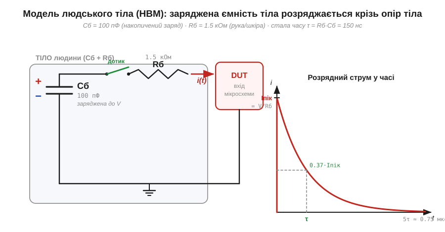
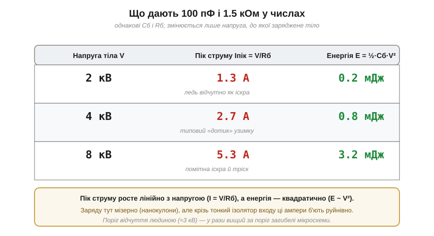

# 🧮 Модель людського тіла (HBM): 100 пФ і 1.5 кОм

> Математична вставка до теми [§1.10.2 «Тіло як накопичувач заряду»](r10-esd-static.md). §1.10.2 показав головне: ходячи по підлозі, людина набирає на собі тисячі вольтів, і це реальна загроза для мікросхем. Але «тіло заряджене до кількох кіловольтів» — ще не число, з яким працює інженер. Щоб порахувати, **наскільки сильний** буде розряд і **чи переживе** його вхід мікросхеми, тіло заміняють найпростішою схемою з двох деталей: ємності, де сидить заряд, і опору, крізь який цей заряд витікає. Ця схема й зветься **модель людського тіла** (*Human Body Model*, HBM); її канонічні числа — **100 пФ** і **1.5 кОм**.

### Навіщо взагалі модель: від «кількох кіловольтів» до амперів

§1.10.2 дав напругу, до якої заряджається тіло, але не сказав, що станеться в **мить дотику** до виводу мікросхеми. А руйнує кристал саме ця мить: не сама по собі напруга, а **струм**, що проходить крізь тонкі ізолятори всередині чипа, поки заряд тіла стікає на землю. Щоб цей струм порахувати, потрібно знати дві речі — **скільки** заряду на тілі й **наскільки легко** він витече. Перше задає ємність, друге — опір. Дві деталі, два числа, і вся подія розряду стає передбачуваною.

Це класичний інженерний хід: складний об'єкт (людина зі шкірою, потом, взуттям, одягом) зводять до **еквівалентної схеми** з мінімумом елементів, що відтворює потрібну поведінку. Так само в §1.5 реальне джерело звели до ЕРС із внутрішнім опором. HBM — те саме спрощення, але для тіла-як-джерела-розряду.

### Ємність тіла: скільки заряду вміщає людина

Перша деталь — **ємність тіла** (*body capacitance*, Cб). Інтуїція проста: будь-який провідник, віддалений від інших, здатний утримати на собі певний заряд, і що його більше — то вища напруга. Кількісно цей зв'язок лінійний:

```
Q = C · V     (заряд = ємність × напруга).
```

Ємність C (*capacitance*, одиниця — **фарад**, Ф = Кл/В) — це і є коефіцієнт пропорційності: скільки кулонів заряду «вміщається» в тіло на кожен вольт напруги. (Повноцінно ємність як властивість і конденсатор як компонент розглядає Модуль 2; тут вистачить цього означення — заряд, поділений на напругу.) Людське тіло поводиться як невелика «пластина» відносно землі та довколишніх предметів, і її типова ємність — близько **100 пФ** (пікофарад, 100 × 10⁻¹² Ф). Звідси одразу видно, **який мізерний** заряд тут насправді задіяний:

```
Q = C · V = 100×10⁻¹² Ф × 4000 В = 4×10⁻⁷ Кл = 0.4 мкКл.
```

Менш як мікрокулон — на тлі тисяч кулонів у звичайній батарейці (§1.1.1) це майже ніщо. Парадокс §1.10 саме в цьому: заряду крихітно, а шкоди багато — бо вся справа в **напрузі** й у тому, **як швидко** цей заряд проходить крізь кристал.

### Опір тіла: крізь що витікає заряд

Друга деталь — **опір тіла** (*body resistance*, Rб). Коли палець торкається виводу, заряд біжить із тіла на мікросхему не вільно, а крізь тканини руки й контакт шкіри. Цей шлях має опір, і в моделі його беруть рівним **1.5 кОм**. Звідки саме таке число? Це усереднений опір руки від долоні до тіла на високій напрузі, коли шкіра вже «пробита» й майже не заважає (на низьких напругах суха шкіра дає набагато більше, десятки й сотні кОм, — але в момент кіловольтного розряду вона перестає бути перешкодою).


*Рис. 1.10.2m.1. Уся подія розряду двома деталями. Ліворуч: ємність тіла Cб = 100 пФ, заряджена до напруги V, у мить дотику замикається через опір тіла Rб = 1.5 кОм на вхід мікросхеми (DUT). Праворуч: розрядний струм у часі. Він стрибком сягає піку Iпік = V/Rб (бо ємність спершу поводиться як «закоротка»), а далі спадає по експоненті зі сталою часу τ = Rб·Cб = 150 нс; за час τ струм падає до 0.37 піку, а за ≈5τ (близько 0.75 мкс) майже зникає.*

### Що дає ця схема: пік струму й стала часу

Тепер схема працює, і з неї випливають усі потрібні числа. У першу мить розряду заряджена ємність ще тримає на собі повну напругу V, а сама ємність струму не обмежує — тож увесь перепад лягає на опір Rб, і струм стрибком сягає **піку**:

```
Iпік = V / Rб.
```

Для типового «зимового» розряду в 4 кВ це 4000 / 1500 ≈ **2.7 А** — кілька ампер крізь вивід, розрахований на міліампери. Ось чому ESD руйнівний. Далі ємність розряджається, напруга на ній падає, і струм згасає за тією самою експонентою, що й у будь-якому RC-колі, зі **сталою часу**:

```
τ = Rб · Cб = 1500 Ом × 100×10⁻¹² Ф = 150×10⁻⁹ с = 150 нс.
```

Сто п'ятдесят наносекунд — ось характерна тривалість удару HBM. За час τ струм спадає до ≈37 % піку, а за ≈5τ (близько 0.75 мкс) розряд практично завершується. Подія коротка, але **дуже** різка: одиниці ампер за сотні наносекунд.

> 🔧 **Навіщо це.** Ці числа — не абстракція: саме за моделлю HBM (Cб = 100 пФ, Rб = 1.5 кОм) випробовують стійкість мікросхем до статики. У даташиті в розділі ESD ratings стоїть рядок на кшталт «HBM ±2 kV» — це означає, що вхід витримує розряд тіла, зарядженого до 2 кВ, за цією самою схемою. Знаючи модель, ти читаєш цей рядок як конкретний пік струму й тривалість, а не як магічне число.

### Скільки в розряді енергії

Лишається остання величина — **енергія**, запасена в зарядженій ємності. Вона теж рахується з тих самих двох чисел:

```
E = ½ · Cб · V².
```

Для 4 кВ це ½ × 100×10⁻¹² × 4000² ≈ 0.8 мДж — менше за міліджоуль. Здавалося б, дрібниця; але вся ця енергія вкидається за сотні наносекунд у крихітний об'єм кристала, і локальна густина потужності там виходить колосальна. Зверни увагу на квадрат: подвоїш напругу — енергія вчетверо більша. Тому 8 кВ небезпечніші за 4 кВ не вдвічі, а вчетверо.


*Рис. 1.10.2m.2. Та сама модель (Cб = 100 пФ, Rб = 1.5 кОм) у числах для трьох рівнів напруги. Пік струму Iпік = V/Rб росте з напругою лінійно, а запасена енергія E = ½·Cб·V² — квадратично. Заряду всюди мізерно (частки мікрокулона), але крізь тонкий ізолятор входу ці ампери б'ють руйнівно. Поріг, за якого людина взагалі **відчуває** іскру (≈3 кВ, §1.10.2), у рази вищий за поріг, що вже вбиває мікросхему, — тому небезпечні розряди здебільшого непомітні.*

### Де це працює в курсі

Модель людського тіла — перший приклад того, як зведенням до **RC-кола** з двох елементів складне фізичне явище стає лічильним. Той самий апарат — ємність як накопичувач заряду (Q = C·V), пік струму на опорі (I = V/R, §1.3.2) і стала часу τ = R·C — повертатиметься щоразу, коли заряд кудись швидко перетікає. HBM лишає три числа, з якими працюють далі: **пік струму** Iпік = V/Rб (лінійний за напругою) — що руйнує вхід; **тривалість** τ = Rб·Cб (сотні наносекунд) — наскільки швидким має бути захист; **енергія** ½·Cб·V² (квадратична за напругою) — скільки тепла виділиться в точці пробою. Саме цю трійку стандарт випробувань і згортає в рядок «HBM ±N kV», який тепер читається як конкретна фізична подія.
